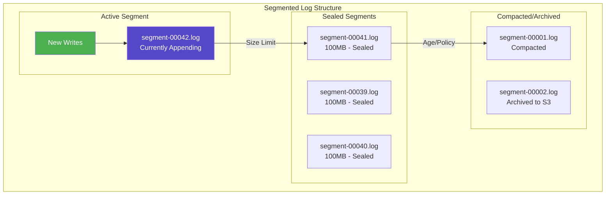
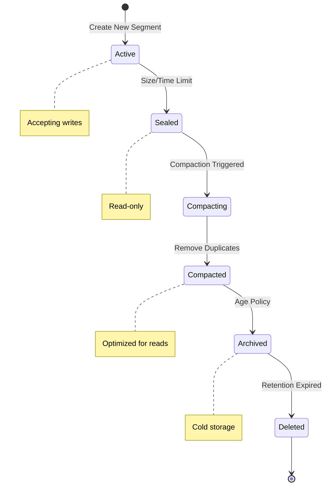
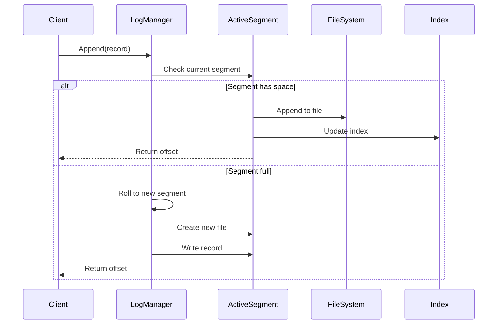
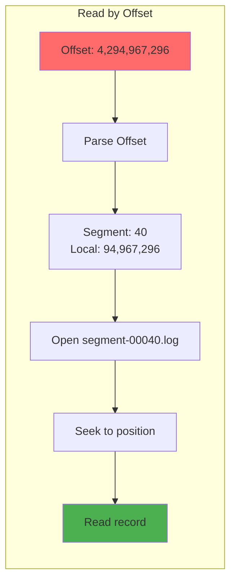
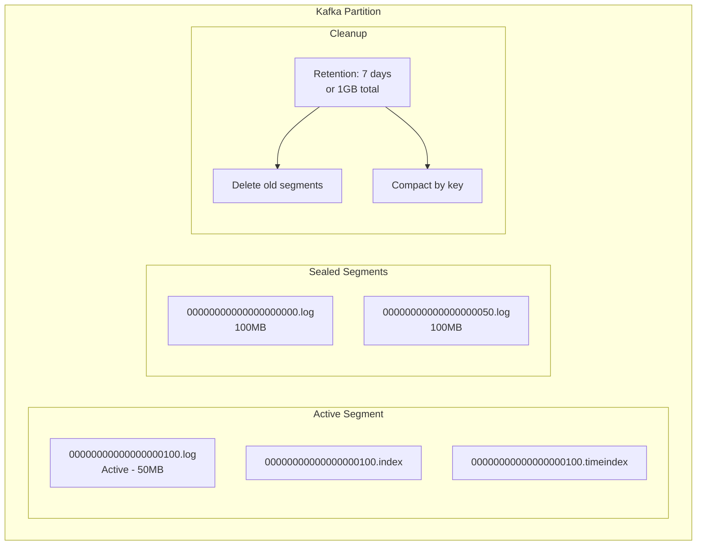
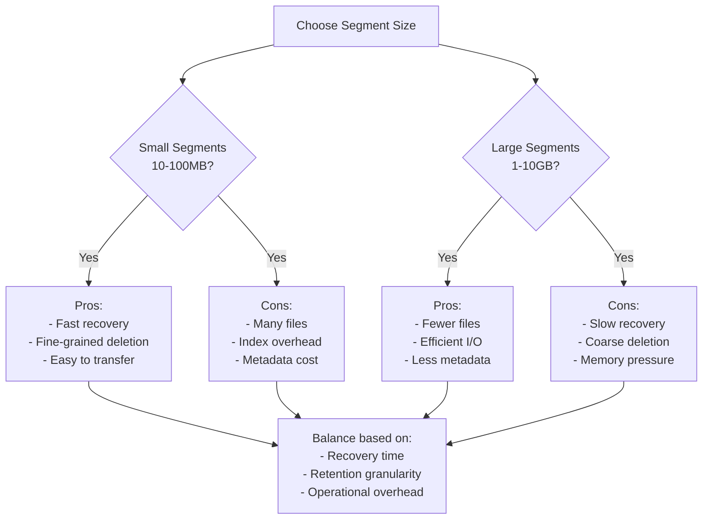

# Segmented Log Pattern

<div class="pattern-type">Data Management Pattern
 Split a continuously growing append-only log into fixed-size segments, enabling efficient cleanup, compaction, and parallel operations while maintaining sequential write performance.
</div>

## Problem Context

!!! warning "🎯 The Challenge"

 Append-only logs face scalability challenges:
 - **Unbounded growth** - Single log file grows indefinitely
 - **Inefficient cleanup** - Can't delete old data from middle of file
 - **Recovery time** - Scanning large logs takes too long
 - **Compaction difficulty** - Hard to remove duplicate or deleted entries
 - **Backup complexity** - Moving large files is problematic

 Segmented logs solve this by dividing the log into manageable chunks.

## Core Architecture



## How Segmented Logs Work

### 1. Segment Lifecycle



### 2. Write Process



### 3. Read Process


## Implementation

### Basic Segmented Log

```python
class SegmentedLog:
 def __init__(self, log_dir, segment_size=100*1024*1024): # 100MB
 self.log_dir = log_dir
 self.segment_size = segment_size
 self.segments = self._load_segments()
 self.active_segment = self._get_or_create_active_segment()
 
 def append(self, record):
 """Append record to active segment"""
 # Check if current segment has space
 if self.active_segment.size + len(record) > self.segment_size:
 # Roll to new segment
 self._roll_segment()
 
 # Write to active segment
 offset = self.active_segment.append(record)
 
 # Return global offset
 return self._to_global_offset(
 self.active_segment.id, 
 offset
 )
 
 def read(self, global_offset):
 """Read record at global offset"""
 segment_id, local_offset = self._parse_offset(global_offset)
 segment = self._get_segment(segment_id)
 return segment.read(local_offset)
 
 def _roll_segment(self):
 """Create new active segment"""
 # Seal current segment
 self.active_segment.seal()
 
 # Create new segment
 new_id = self.active_segment.id + 1
 self.active_segment = Segment(
 self.log_dir, 
 new_id
 )
 self.segments[new_id] = self.active_segment
 
 # Trigger background compaction if needed
 self._maybe_compact()

class Segment:
 def __init__(self, base_dir, segment_id):
 self.id = segment_id
 self.base_dir = base_dir
 self.file_path = f"{base_dir}/segment-{segment_id:05d}.log"
 self.index_path = f"{base_dir}/segment-{segment_id:05d}.idx"
 self.size = 0
 self.sealed = False
 self.file = open(self.file_path, 'ab')
 self.index = OffsetIndex(self.index_path)
 
 def append(self, record):
 """Append record to segment file"""
 if self.sealed:
 raise Exception("Cannot write to sealed segment")
 
 # Current position is the offset
 offset = self.file.tell()
 
 # Write length-prefixed record
 length = len(record)
 self.file.write(length.to_bytes(4, 'big'))
 self.file.write(record)
 
 # Update index periodically
 if offset % 4096 == 0: # Every 4KB
 self.index.add_entry(offset, self.size)
 
 self.size += 4 + length
 return offset
 
 def read(self, offset):
 """Read record at offset"""
 with open(self.file_path, 'rb') as f:
 f.seek(offset)
 length = int.from_bytes(f.read(4), 'big')
 return f.read(length)
 
 def seal(self):
 """Mark segment as sealed"""
 self.sealed = True
 self.file.close()
 self.index.close()
```

### Log Compaction

```python
class LogCompactor:
 def __init__(self, retention_ms=7*24*60*60*1000): # 7 days
 self.retention_ms = retention_ms
 
 def compact_segments(self, segments):
 """Compact sealed segments"""
 compacted = []
 
 for segment in segments:
 if not segment.sealed:
 continue
 
 if self._should_compact(segment):
 compacted_segment = self._compact_segment(segment)
 compacted.append((segment, compacted_segment))
 
 return compacted
 
 def _compact_segment(self, segment):
 """Remove duplicates and deleted records"""
 # Read all records
 records = self._read_all_records(segment)
 
 # Keep only latest version of each key
 latest = {}
 for offset, key, value in records:
 if value is not None: # Not a delete marker
 latest[key] = (offset, value)
 
 # Write compacted segment
 new_segment = Segment(
 segment.base_dir,
 f"{segment.id}-compacted"
 )
 
 for key, (offset, value) in sorted(latest.items()):
 new_segment.append(f"{key}:{value}".encode())
 
 new_segment.seal()
 return new_segment
 
 def _should_compact(self, segment):
 """Decide if segment needs compaction"""
 # Compact if:
 # 1. Segment is old enough
 # 2. Has significant duplicates/deletes
 # 3. Size reduction would be significant
 
 age = time.time() * 1000 - segment.created_time
 if age < self.retention_ms / 2:
 return False
 
 # Estimate duplicate ratio
 duplicate_ratio = self._estimate_duplicates(segment)
 return duplicate_ratio > 0.3
```

### Offset Management

```python
class OffsetManager:
 """Manage global offsets across segments"""
 
 def __init__(self, bytes_per_segment=100*1024*1024):
 self.bytes_per_segment = bytes_per_segment
 
 def to_global_offset(self, segment_id, local_offset):
 """Convert segment + local offset to global offset"""
 # Global offset = segment_id * max_segment_size + local_offset
 return segment_id * self.bytes_per_segment + local_offset
 
 def parse_global_offset(self, global_offset):
 """Parse global offset into segment and local offset"""
 segment_id = global_offset // self.bytes_per_segment
 local_offset = global_offset % self.bytes_per_segment
 return segment_id, local_offset
 
 def get_segment_for_offset(self, global_offset, segments):
 """Find segment containing the global offset"""
 segment_id, local_offset = self.parse_global_offset(global_offset)
 
 # Handle compacted segments
 if segment_id not in segments:
 # Search for compacted version
 compacted_id = f"{segment_id}-compacted"
 if compacted_id in segments:
 return segments[compacted_id], local_offset
 
 return segments.get(segment_id), local_offset
```

## Advanced Features

### 1. Time-Based Rolling

```python
class TimeBasedSegmentation:
 def __init__(self, roll_interval_ms=3600000): # 1 hour
 self.roll_interval_ms = roll_interval_ms
 self.last_roll_time = time.time() * 1000
 
 def should_roll(self, current_segment):
 """Check if time to roll segment"""
 current_time = time.time() * 1000
 time_since_roll = current_time - self.last_roll_time
 
 return (time_since_roll >= self.roll_interval_ms or
 current_segment.size >= self.size_limit)
 
 def roll_segment(self):
 """Roll to new segment with timestamp"""
 timestamp = int(time.time() * 1000)
 segment_name = f"segment-{timestamp}.log"
 self.last_roll_time = timestamp
 return segment_name
```

### 2. Index Structure

```mermaid
graph TB
 subgraph "Segment Index"
 subgraph "Sparse Index"
 I1[Offset: 0<br/>Position: 0]
 I2[Offset: 4096<br/>Position: 4096]
 I3[Offset: 8192<br/>Position: 8192]
 end
 
 subgraph "Time Index"
 T1[Time: 1640001000<br/>Offset: 0]
 T2[Time: 1640001060<br/>Offset: 4096]
 T3[Time: 1640001120<br/>Offset: 8192]
 end
 
 subgraph "Key Index (Optional)"
 K1[Key: "user:123"<br/>Offset: 1024]
 K2[Key: "user:456"<br/>Offset: 5120]
 end
 end
```

### 3. Parallel Segment Operations

```python
class ParallelSegmentReader:
 def __init__(self, segments, num_threads=4):
 self.segments = segments
 self.executor = ThreadPoolExecutor(max_workers=num_threads)
 
 def read_range(self, start_offset, end_offset):
 """Read records in parallel from multiple segments"""
 # Determine segments to read
 segments_to_read = self._get_segments_in_range(
 start_offset, end_offset
 )
 
 # Read each segment in parallel
 futures = []
 for segment, start, end in segments_to_read:
 future = self.executor.submit(
 self._read_segment_range,
 segment, start, end
 )
 futures.append(future)
 
 # Collect results
 results = []
 for future in futures:
 results.extend(future.result())
 
 # Sort by offset
 return sorted(results, key=lambda x: x[0])
```

## Real-World Examples

### Apache Kafka

<h4>Kafka's Log Segments</h4>



- Default segment size: 1GB
- Time-based rolling: 7 days
- Parallel log cleaning
- Zero-copy data transfer

### Distributed Databases

<h4>RocksDB WAL Segments</h4>

- Fixed-size WAL segments
- Background archival
- Point-in-time recovery
- Parallel recovery from segments

## Performance Characteristics

<table class="responsive-table">
<thead>
<tr>
<th>Operation</th>
<th>Latency</th>
<th>Throughput</th>
<th>Bottleneck</th>
</tr>
</thead>
<tbody>
<tr>
<td data-label="Operation"><strong>Append</strong></td>
<td data-label="Latency">< 1ms</td>
<td data-label="Throughput">100MB/s+</td>
<td data-label="Bottleneck">Disk sequential write</td>
</tr>
<tr>
<td data-label="Operation"><strong>Read Recent</strong></td>
<td data-label="Latency">< 1ms</td>
<td data-label="Throughput">1GB/s+</td>
<td data-label="Bottleneck">Page cache hit</td>
</tr>
<tr>
<td data-label="Operation"><strong>Read Old</strong></td>
<td data-label="Latency">5-10ms</td>
<td data-label="Throughput">100MB/s</td>
<td data-label="Bottleneck">Disk seek + read</td>
</tr>
<tr>
<td data-label="Operation"><strong>Compaction</strong></td>
<td data-label="Latency">Minutes</td>
<td data-label="Throughput">50MB/s</td>
<td data-label="Bottleneck">CPU + I/O</td>
</tr>
</tbody>
</table>

## Configuration Patterns

### Segment Size Selection



### Retention Strategies

<table class="responsive-table">
<thead>
<tr>
<th>Strategy</th>
<th>Use Case</th>
<th>Implementation</th>
</tr>
</thead>
<tbody>
<tr>
<td data-label="Strategy"><strong>Time-based</strong></td>
<td data-label="Use Case">Compliance, logs</td>
<td data-label="Implementation">Delete segments older than X days</td>
</tr>
<tr>
<td data-label="Strategy"><strong>Size-based</strong></td>
<td data-label="Use Case">Bounded storage</td>
<td data-label="Implementation">Keep only last N GB</td>
</tr>
<tr>
<td data-label="Strategy"><strong>Count-based</strong></td>
<td data-label="Use Case">Event limits</td>
<td data-label="Implementation">Keep last M segments</td>
</tr>
<tr>
<td data-label="Strategy"><strong>Compaction</strong></td>
<td data-label="Use Case">Key-value stores</td>
<td data-label="Implementation">Keep only latest per key</td>
</tr>
</tbody>
</table>
## Common Pitfalls

### 1. Segment Leaks

!!! danger "⚠️ Segments Not Deleted"
 **Problem**: Segments accumulate indefinitely
 **Causes**:
 - Broken cleanup logic
 - References preventing deletion
 - Clock skew in time-based deletion
 
 **Solution**:
 - Monitor segment count
 - Forced cleanup on startup
 - Use monotonic clocks

### 2. Offset Gaps

```python
def handle_offset_gaps(self):
 """Handle gaps from deleted segments"""
 # Problem: Segment 5 deleted, offset 500MB-600MB invalid
 
 # Solution 1: Maintain offset mapping
 self.valid_offsets = IntervalTree()
 for segment in self.segments:
 self.valid_offsets.add(
 segment.start_offset,
 segment.end_offset
 )
 
 # Solution 2: Return error for invalid offsets
 def read(self, offset):
 if not self.valid_offsets.contains(offset):
 raise OffsetOutOfRangeError(offset)
```

### 3. Compaction Loops

!!! warning "Infinite Compaction"
 **Scenario**: Compaction triggers more compaction
 **Fix**: Implement backoff and limits:
 ```python
 max_compaction_ratio = 0.5 # Max 50% of time compacting
 min_segment_age = 3600 # Don't compact segments < 1 hour old
 ```

## Trade-offs

<table class="responsive-table">
<thead>
<tr>
<th>Aspect</th>
<th>Benefits</th>
<th>Costs</th>
</tr>
</thead>
<tbody>
<tr>
<td data-label="Aspect"><strong>Manageability</strong></td>
<td data-label="Benefits">Easy deletion<br/>Parallel operations<br/>Efficient backup</td>
<td data-label="Costs">Multiple files<br/>Index overhead<br/>Segment coordination</td>
</tr>
<tr>
<td data-label="Aspect"><strong>Performance</strong></td>
<td data-label="Benefits">Sequential writes<br/>Parallel reads<br/>Cache-friendly</td>
<td data-label="Costs">Segment roll overhead<br/>Cross-segment reads<br/>Compaction CPU</td>
</tr>
<tr>
<td data-label="Aspect"><strong>Scalability</strong></td>
<td data-label="Benefits">Unbounded growth<br/>Old data cleanup<br/>Compression friendly</td>
<td data-label="Costs">Metadata growth<br/>Offset management<br/>Recovery complexity</td>
</tr>
</tbody>
</table>


| **High-throughput streaming** | 1-2 GB | Balance rotation overhead |
| **Time-series metrics** | 100-500 MB | Align with time windows |
| **Event sourcing** | 500 MB - 1 GB | Snapshot boundaries |
| **Message queue** | 1 GB | Standard practice |


## Related Patterns

- [Write-Ahead Log (WAL)](wal.md) - Often uses segmentation
- [LSM Tree](lsm-tree.md) - Segments as SSTable files
- [Event Sourcing](event-sourcing.md) - Segmented event storage
- [Partitioning](partitioning.md) - Segment distribution

## References

- "The Log: What every software engineer should know" - Jay Kreps
- Apache Kafka Design Documentation
- "Segment-Based Log Structured Storage" - Various papers
- Production experiences from LinkedIn, Uber, Netflix