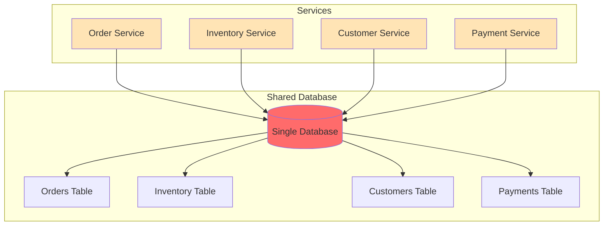
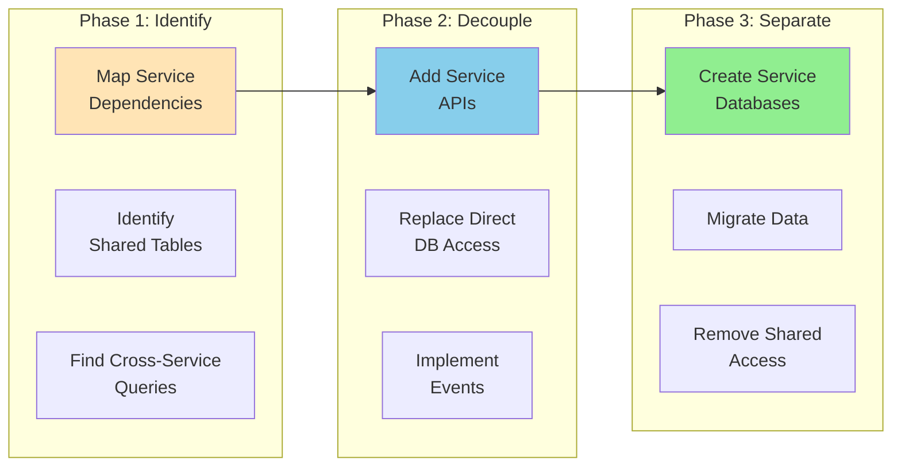

# Shared Database Pattern

!!! danger "🥉 Bronze Tier Pattern"
    **Legacy Pattern** • Consider modern alternatives
    
    While still in use in legacy systems, this pattern has been superseded by database-per-service and event-driven architectures. See migration guides for transitioning to modern approaches.

**The anti-pattern that refuses to die**

## Visual Architecture

## Why This Pattern is Problematic

| Problem | Impact | Modern Solution |
|---------|--------|-----------------|
| **Tight Coupling** | Services can't evolve independently | Database per service |
| **No Autonomy** | Teams block each other | API contracts |
| **Scaling Bottleneck** | All services hit same DB | Distributed data |
| **Schema Conflicts** | Version coordination nightmare | Service ownership |
| **Performance Issues** | Noisy neighbor problems | Isolated resources |
| **Testing Complexity** | Can't test in isolation | Service virtualization |

## Common Symptoms of Shared Database Problems

<h4>💥 The Deployment Coordination Dance</h4>

**What Happens**: 
- Team A needs to add a column
- Team B's code breaks with new column
- Team C is in the middle of a release
- All teams must coordinate deployment

**Result**: 3-week deployment cycles, midnight releases

**Better Approach**: Each service owns its data and schema

## Migration Strategy

## When Shared Database Might Be Acceptable

<h4>🎯 Limited Acceptable Use Cases</h4>

1. **Transitional State**
   - During monolith decomposition
   - Temporary measure with clear timeline

2. **Read-Only Analytics**
   - Shared read replicas for reporting
   - No write operations from services

3. **Legacy System Constraints**
   - When refactoring cost exceeds benefit
   - With clear isolation boundaries

**Even then**: Plan for eventual separation

## Modern Alternatives Comparison

| Pattern | Data Consistency | Autonomy | Complexity | Use When |
|---------|-----------------|----------|------------|----------|
| **Database per Service** | Eventual | High | Medium | Default for microservices |
| **Event Sourcing** | Eventual | High | High | Audit requirements |
| **CQRS** | Eventual | High | High | Complex queries |
| **API Gateway** | Request-time | Medium | Low | Simple data needs |
| **Data Mesh** | Federated | Very High | Very High | Large organizations |

## Anti-Pattern Indicators

- [ ] Multiple services directly query same tables
- [ ] Schema changes require multi-team coordination  
- [ ] "God tables" with 50+ columns
- [ ] Database becomes single point of failure
- [ ] Can't scale services independently
- [ ] Test data conflicts between teams
- [ ] Performance degradation affects all services
- [ ] Security boundaries are unclear

## Excellence Framework Integration

### Migration Path to Modern Patterns

- :material-file-document:{ .lg .middle } **To Database per Service**
    
    ---
    
    The recommended migration path:
    - Identify service boundaries
    - Extract service APIs
    - Gradually separate data
    - [Full Migration Guide](../excellence/migrations/shared-db-to-database-per-service.md)

- :material-file-document:{ .lg .middle } **To Event-Driven**
    
    ---
    
    For data synchronization needs:
    - Implement event sourcing
    - Use CDC for transition
    - Eventual consistency
    - [Migration Guide](../excellence/migrations/shared-db-to-event-driven.md)

- :material-file-document:{ .lg .middle } **To CQRS**
    
    ---
    
    For read/write separation:
    - Separate read models
    - Optimize independently
    - Scale separately
    - [Migration Guide](../excellence/migrations/shared-db-to-cqrs.md)

- :material-file-document:{ .lg .middle } **To API-Based**
    
    ---
    
    For service communication:
    - Define service contracts
    - Replace DB joins with API calls
    - Add caching layer
    - [Migration Guide](../excellence/migrations/shared-db-to-apis.md)

### Modern Alternatives Comparison

<table class="responsive-table">
<thead>
<tr>
<th>From Shared DB</th>
<th>To Pattern</th>
<th>Migration Effort</th>
<th>Benefits</th>
<th>Challenges</th>
</tr>
</thead>
<tbody>
<tr>
<td data-label="From Shared DB"><strong>Direct queries</strong></td>
<td data-label="To Pattern">Service APIs</td>
<td data-label="Migration Effort">Medium</td>
<td data-label="Benefits">Clear contracts</td>
<td data-label="Challenges">Network latency</td>
</tr>
<tr>
<td data-label="From Shared DB"><strong>Joins</strong></td>
<td data-label="To Pattern">API composition</td>
<td data-label="Migration Effort">High</td>
<td data-label="Benefits">Service autonomy</td>
<td data-label="Challenges">N+1 queries</td>
</tr>
<tr>
<td data-label="From Shared DB"><strong>Transactions</strong></td>
<td data-label="To Pattern">Saga pattern</td>
<td data-label="Migration Effort">Very High</td>
<td data-label="Benefits">Distributed resilience</td>
<td data-label="Challenges">Complexity</td>
</tr>
<tr>
<td data-label="From Shared DB"><strong>Reports</strong></td>
<td data-label="To Pattern">CQRS/Read models</td>
<td data-label="Migration Effort">Medium</td>
<td data-label="Benefits">Optimized queries</td>
<td data-label="Challenges">Eventual consistency</td>
</tr>
<tr>
<td data-label="From Shared DB"><strong>Real-time</strong></td>
<td data-label="To Pattern">Event streaming</td>
<td data-label="Migration Effort">High</td>
<td data-label="Benefits">Real-time updates</td>
<td data-label="Challenges">Event ordering</td>
</tr>
</tbody>
</table>

### Case Studies: Successful Migrations

- **[Amazon: Monolith to Services](../excellence/case-studies/amazon-service-migration.md)**: From shared Oracle to 100s of services
- **[Netflix: Microservices Journey](../excellence/case-studies/netflix-db-migration.md)**: Cassandra per service
- **[Uber: Domain Separation](../excellence/case-studies/uber-domain-services.md)**: From shared Postgres to Schemaless

### Tools for Migration

- **[Database Migration Toolkit](../excellence/tools/db-migration-toolkit.md)**: Scripts and utilities
- **[Service Extraction Patterns](../excellence/patterns/service-extraction.md)**: Step-by-step process
- **[Data Synchronization Strategies](../excellence/guides/data-sync-strategies.md)**: During transition

## Related Patterns

- [Database per Service](database-per-service.md) - The correct approach
- [Event-Driven](event-driven.md) - For data synchronization
- [API Gateway](api-gateway.md) - For data aggregation
- [CQRS](cqrs.md) - For query separation
- [Saga](saga.md) - For distributed transactions

## Further Reading

### Migration Resources
- ["Building Microservices" by Sam Newman](https://www.oreilly.com/library/view/building-microservices-2nd/9781492034018/) - Chapter on data
- ["Monolith to Microservices" by Sam Newman](https://www.oreilly.com/library/view/monolith-to-microservices/9781492047834/) - Migration patterns
- ["Microservices Patterns" by Chris Richardson](https://microservices.io/book) - Data patterns

### Online Resources
- [Martin Fowler: Database Styles](https://martinfowler.com/articles/microservices.html#DecentralizedDataManagement)
- [Chris Richardson: Database Architecture](https://microservices.io/patterns/data/database-per-service.html)
- [ThoughtWorks: Breaking the Monolith](https://www.thoughtworks.com/insights/blog/breaking-monolith)