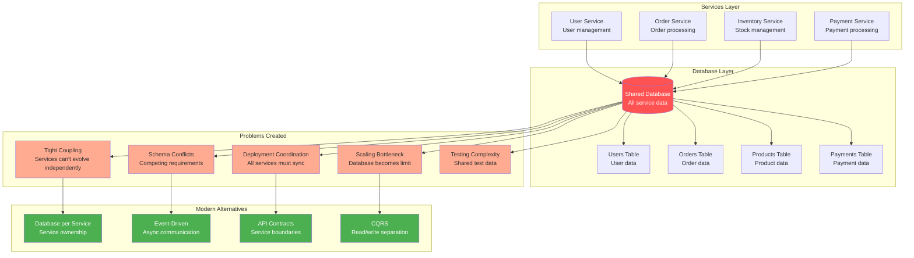
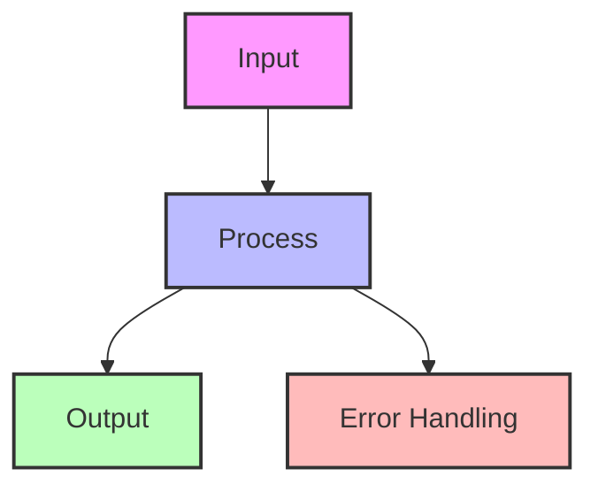

## The Complete Blueprint

The Shared Database pattern represents a legacy architecture where multiple services or applications access the same database instance for data persistence and retrieval. While this pattern offers simplicity and immediate data consistency through ACID transactions, it creates significant problems in modern distributed systems including tight coupling between services, deployment coordination nightmares, and scaling bottlenecks. This anti-pattern violates microservices principles by preventing independent service evolution and deployment. Although still found in legacy systems and during monolith-to-microservices transitions, understanding this pattern is crucial for recognizing its problems and implementing proper migration strategies to modern alternatives.

### What You'll Master

- **Anti-pattern identification** recognizing shared database problems in existing systems and understanding their impact
- **Migration strategies** planning and executing transitions from shared databases to database-per-service architectures
- **Service boundary definition** identifying natural data ownership boundaries and extracting service-specific schemas
- **Data synchronization techniques** implementing event-driven patterns and eventual consistency for cross-service data needs
- **Legacy system management** maintaining shared databases during transition periods while minimizing coupling
- **Modern alternatives evaluation** comparing database-per-service, CQRS, event sourcing, and API-based data access patterns

## Essential Question
## When to Use / When NOT to Use

### When to Use

| Scenario | Why It Fits | Alternative If Not |
|----------|-------------|-------------------|
| High availability required | Pattern provides resilience | Consider simpler approach |
| Scalability is critical | Handles load distribution | Monolithic might suffice |
| Distributed coordination needed | Manages complexity | Centralized coordination |

### When NOT to Use

| Scenario | Why to Avoid | Better Alternative |
|----------|--------------|-------------------|
| Simple applications | Unnecessary complexity | Direct implementation |
| Low traffic systems | Overhead not justified | Basic architecture |
| Limited resources | High operational cost | Simpler patterns |
**How do we ensure data consistency and reliability with shared database pattern?**

# Shared Database Pattern

!!! danger "🥉 Bronze Tier Pattern"
    **Legacy Pattern** • Consider modern alternatives
    
    While still in use in legacy systems, this pattern has been superseded by database-per-service and event-driven architectures. See migration guides for transitioning to modern approaches.

**The anti-pattern that refuses to die**

## Visual Architecture

## Why This Pattern is Problematic

| Problem | Impact | Modern Solution |
|---------|--------|-----------------|
| **Tight Coupling** | Services can't evolve independently | Database per service |
| **No Autonomy** | Teams block each other | API contracts |
| **Scaling Bottleneck** | All services hit same DB | Distributed data |
| **Schema Conflicts** | Version coordination nightmare | Service ownership |
| **Performance Issues** | Noisy neighbor problems | Isolated resources |
| **Testing Complexity** | Can't test in isolation | Service virtualization |

## Common Symptoms of Shared Database Problems

<h4>💥 The Deployment Coordination Dance</h4>

**What Happens**: 
- Team A needs to add a column
- Team B's code breaks with new column
- Team C is in the middle of a release
- All teams must coordinate deployment

**Result**: 3-week deployment cycles, midnight releases

**Better Approach**: Each service owns its data and schema

## Migration Strategy

## When Shared Database Might Be Acceptable

<h4>🎯 Limited Acceptable Use Cases</h4>

1. **Transitional State**
   - During monolith decomposition
   - Temporary measure with clear timeline

2. **Read-Only Analytics**
   - Shared read replicas for reporting
   - No write operations from services

3. **Legacy System Constraints**
   - When refactoring cost exceeds benefit
   - With clear isolation boundaries

**Even then**: Plan for eventual separation

## Modern Alternatives Comparison

| Pattern | Data Consistency | Autonomy | Complexity | Use When |
|---------|-----------------|----------|------------|----------|
| **Database per Service** | Eventual | High | Medium | Default for microservices |
| **Event Sourcing** | Eventual | High | High | Audit requirements |
| **CQRS** | Eventual | High | High | Complex queries |
| **API Gateway** | Request-time | Medium | Low | Simple data needs |
| **Data Mesh** | Federated | Very High | Very High | Large organizations |

## Anti-Pattern Indicators

- [ ] Multiple services directly query same tables
- [ ] Schema changes require multi-team coordination  
- [ ] "God tables" with 50+ columns
- [ ] Database becomes single point of failure
- [ ] Can't scale services independently
- [ ] Test data conflicts between teams
- [ ] Performance degradation affects all services
- [ ] Security boundaries are unclear

## Excellence Framework Integration

### Migration Path to Modern Patterns

- :material-file-document:{ .lg .middle } **To Database per Service**
    
    ---
    
    The recommended migration path:
    - Identify service boundaries
    - Extract service APIs
    - Gradually separate data
    - [Full Migration Guide](../../architects-handbook/implementation-playbooks/migrations/shared-db-to-database-per-service.md)

- :material-file-document:{ .lg .middle } **To Event-Driven**
    
    ---
    
    For data synchronization needs:
    - Implement event sourcing
    - Use CDC for transition
    - Eventual consistency
    - [Migration Guide](../../architects-handbook/implementation-playbooks/migrations/shared-db-to-event-driven.md)

- :material-file-document:{ .lg .middle } **To CQRS**
    
    ---
    
    For read/write separation:
    - Separate read models
    - Optimize independently
    - Scale separately
    - [Migration Guide](../../architects-handbook/implementation-playbooks/migrations/shared-db-to-cqrs.md)

- :material-file-document:{ .lg .middle } **To API-Based**
    
    ---
    
    For service communication:
    - Define service contracts
    - Replace DB joins with API calls
    - Add caching layer
    - [Migration Guide](../../architects-handbook/implementation-playbooks/migrations/shared-db-to-apis.md)

### Modern Alternatives Comparison

<table class="responsive-table">
<thead>
<tr>
<th>From Shared DB</th>
<th>To Pattern</th>
<th>Migration Effort</th>
<th>Benefits</th>
<th>Challenges</th>
</tr>
</thead>
<tbody>
<tr>
<td data-label="From Shared DB"><strong>Direct queries</strong></td>
<td data-label="To Pattern">Service APIs</td>
<td data-label="Migration Effort">Medium</td>
<td data-label="Benefits">Clear contracts</td>
<td data-label="Challenges">Network latency</td>
</tr>
<tr>
<td data-label="From Shared DB"><strong>Joins</strong></td>
<td data-label="To Pattern">API composition</td>
<td data-label="Migration Effort">High</td>
<td data-label="Benefits">Service autonomy</td>
<td data-label="Challenges">N+1 queries</td>
</tr>
<tr>
<td data-label="From Shared DB"><strong>Transactions</strong></td>
<td data-label="To Pattern">Saga pattern</td>
<td data-label="Migration Effort">Very High</td>
<td data-label="Benefits">Distributed resilience</td>
<td data-label="Challenges">Complexity</td>
</tr>
<tr>
<td data-label="From Shared DB"><strong>Reports</strong></td>
<td data-label="To Pattern">CQRS/Read models</td>
<td data-label="Migration Effort">Medium</td>
<td data-label="Benefits">Optimized queries</td>
<td data-label="Challenges">Eventual consistency</td>
</tr>
<tr>
<td data-label="From Shared DB"><strong>Real-time</strong></td>
<td data-label="To Pattern">Event streaming</td>
<td data-label="Migration Effort">High</td>
<td data-label="Benefits">Real-time updates</td>
<td data-label="Challenges">Event ordering</td>
</tr>
</tbody>
</table>

### Case Studies: Successful Migrations

- **[Amazon: Monolith to Services](../../architects-handbook/implementation-playbooks/case-studies/amazon-service-migration.md)**: From shared Oracle to 100s of services
- **[Netflix: Microservices Journey](../../architects-handbook/implementation-playbooks/case-studies/netflix-db-migration.md)**: Cassandra per service
- **[Uber: Domain Separation](../../architects-handbook/implementation-playbooks/case-studies/uber-domain-services.md)**: From shared Postgres to Schemaless

### Tools for Migration

- **[Database Migration Toolkit](../../architects-handbook/implementation-playbooks/tools/db-migration-toolkit.md)**: Scripts and utilities
- **[Service Extraction Patterns](excellence../pattern-library/service-extraction.md)**: Step-by-step process
- **[Data Synchronization Strategies](../../architects-handbook/implementation-playbooks/guides/data-sync-strategies.md)**: During transition

!!! experiment "💡 Quick Thought Experiment: Dependency Elimination Strategy"
    **Apply the 5-step framework to shared database elimination:**
    
    1. **INVENTORY**: Map all tables, stored procedures, views, triggers shared across services
    2. **PRIORITIZE**: Rank by coupling strength × blast radius (critical tables like User, Product rank highest)
    3. **ISOLATE**: Create service-specific schemas, replicated data, or API boundaries
    4. **MIGRATE**: Use Strangler Fig pattern with dual writes, then gradual service migration
    5. **MONITOR**: Track schema change frequency reduction, deployment independence metrics
    
    **Success Metric**: Achieve independent deployments - when Service A can deploy schema changes without coordinating with Services B, C, D

## Related Patterns

- [Database per Service](database-per-service.md) - The correct approach
- [Event-Driven](../architecture/event-driven.md) - For data synchronization
- [API Gateway](../communication/api-gateway.md) - For data aggregation
- [CQRS](cqrs.md) - For query separation
- [Saga](saga.md) - For distributed transactions

## Further Reading

### Migration Resources
- ["Building Microservices" by Sam Newman](https://www.oreilly.com/library/view/building-microservices-2nd/9781492034018/) - Chapter on data
- ["Monolith to Microservices" by Sam Newman](https://www.oreilly.com/library/view/monolith-to-microservices/9781492047834/) - Migration patterns
- ["Microservices Patterns" by Chris Richardson](https://microservices.io/book/) - Data patterns

### Online Resources
- [Martin Fowler: Database Styles](https://martinfowler.com/articles/microservices.html#DecentralizedDataManagement/)
- [Chris Richardson: Database Architecture](https://microservices.io../pattern-library/data/database-per-service.html/)
- [ThoughtWorks: Breaking the Monolith](https://www.thoughtworks.com/insights/blog/breaking-monolith/)

## Level 1: Intuition (5 minutes)

*Start your journey with relatable analogies*

### The Elevator Pitch
[Pattern explanation in simple terms]

### Real-World Analogy
[Everyday comparison that explains the concept]

## Level 2: Foundation (10 minutes)

*Build core understanding*

### Core Concepts
- Key principle 1
- Key principle 2
- Key principle 3

### Basic Example

## Level 3: Deep Dive (15 minutes)

*Understand implementation details*

### How It Really Works
[Technical implementation details]

### Common Patterns
[Typical usage patterns]

## Level 4: Expert (20 minutes)

*Master advanced techniques*

### Advanced Configurations
[Complex scenarios and optimizations]

### Performance Tuning
[Optimization strategies]

## Level 5: Mastery (30 minutes)

*Apply in production*

### Real-World Case Studies
[Production examples from major companies]

### Lessons from the Trenches
[Common pitfalls and solutions]

## Decision Matrix

### Quick Decision Table

| Factor | Low Complexity | Medium Complexity | High Complexity |
|--------|----------------|-------------------|-----------------|
| Team Size | < 5 developers | 5-20 developers | > 20 developers |
| Traffic | < 1K req/s | 1K-100K req/s | > 100K req/s |
| Data Volume | < 1GB | 1GB-1TB | > 1TB |
| **Recommendation** | ❌ Avoid | ⚠️ Consider | ✅ Implement |

