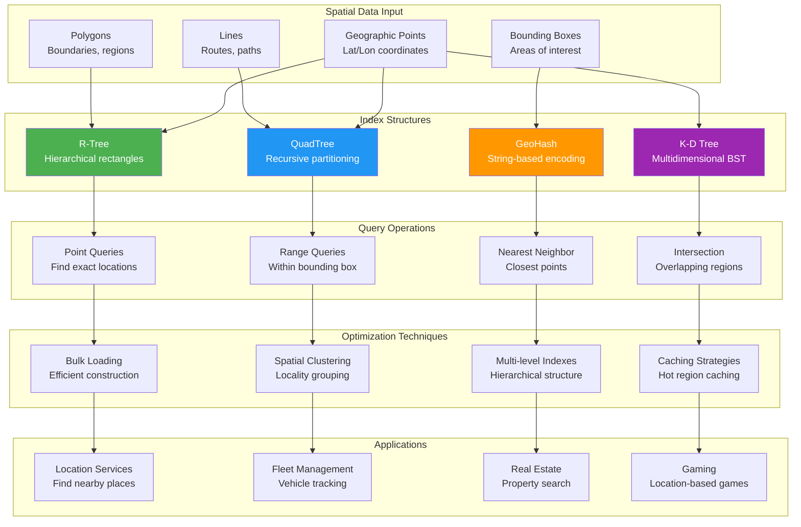

## The Complete Blueprint

Spatial Indexing patterns optimize geospatial data storage and retrieval through specialized data structures that enable efficient proximity searches, range queries, and location-based operations. Traditional database indexes fail for multidimensional spatial data, leading to O(n) scan performance for location queries. Spatial indexes like R-trees, QuadTrees, and GeoHashes partition geographic space into hierarchical structures, reducing query complexity to O(log n) while supporting complex spatial operations like nearest neighbor searches, bounding box queries, and geometric intersections. This pattern is fundamental for location services, mapping applications, fleet management, and any system requiring fast geospatial analytics.



### What You'll Master

- **Spatial data structures** including R-trees, QuadTrees, K-D trees, and GeoHash implementations for multidimensional indexing
- **Query optimization techniques** for point queries, range searches, nearest neighbor, and spatial intersection operations
- **Geospatial encoding methods** using coordinate systems, projections, and hierarchical spatial keys
- **Performance tuning strategies** with bulk loading, spatial clustering, and cache-aware data organization
- **Scalable architectures** for distributed spatial indexing across multiple servers and geographic regions  
- **Real-world applications** in location services, mapping systems, IoT tracking, and geospatial analytics

# Spatial Indexing

!!! info "Pattern Overview"
    **Category**: data-management  
    **Complexity**: Medium  
    **Use Cases**: geospatial queries, location services, mapping applications

## Problem

Naive spatial queries using bounding box searches have O(n) complexity and cannot efficiently handle location-based queries at scale. Traditional database indexes are ineffective for multidimensional spatial data.

## Solution

Spatial indexing uses specialized data structures like R-trees, QuadTrees, or geohashes to efficiently organize and query spatial data. These enable logarithmic-time proximity searches and range queries.

## Implementation

```python
## Example implementation
class SpatialIndex:
    def __init__(self):
        pass
    
    def execute(self):
        # Implementation details
        pass
```

## Trade-offs

**Pros:**
- Provides logarithmic query complexity
- Enables efficient proximity searches
- Improves scalable spatial operations

**Cons:**
- Increases index maintenance overhead
- Requires complex implementation
- May impact memory usage

## When to Use

- When you need location-based services
- For systems that require mapping applications
- In scenarios with geospatial analytics

## Related Patterns

- [Pattern 1](../related-pattern-1.md) - Complementary pattern
- [Pattern 2](../related-pattern-2.md) - Alternative approach
- [Pattern 3](../related-pattern-3.md) - Building block pattern

## References

- [External Resource 1](#)
- [External Resource 2](#)
- [Case Study Example](../../architects-handbook/case-studies/example.md)
