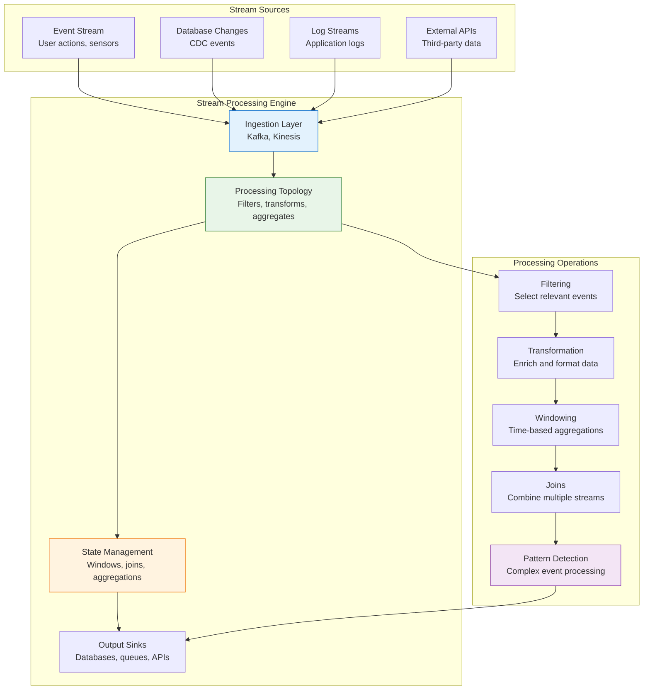

# Stream Processing

!!! info "🥇 Gold Tier Pattern"
    **Real-Time Data Processing** • Essential for modern data-driven applications
    
    Stream processing enables organizations to derive insights and take actions from data as it arrives, rather than waiting for batch processing cycles. Critical for applications requiring real-time decision making, fraud detection, and personalized user experiences.
    
    **Best For:** Real-time analytics, fraud detection, IoT processing, personalization engines, monitoring systems

## Essential Question

**How do we process unbounded data streams in real-time while maintaining state, handling failures, and ensuring consistent results?**

## When to Use / When NOT to Use

### ✅ Use When

| Scenario | Example | Impact |
|----------|---------|--------|
| Real-time decision making | Fraud detection, trading systems | Immediate responses prevent losses |
| Live personalization | Content recommendations, dynamic pricing | Real-time user experience optimization |
| Continuous monitoring | System health, IoT sensor processing | Immediate alerts and automated responses |
| Event-driven processing | Order processing, inventory updates | Real-time business process automation |
| Complex event processing | Pattern detection, anomaly identification | Advanced analytics on streaming data |

### ❌ DON'T Use When

| Scenario | Why | Alternative |
|----------|-----|-------------|
| Batch processing sufficient | Daily/hourly reports acceptable | Apache Spark, scheduled ETL |
| Simple transformations | Basic filtering or mapping | Message queues with workers |
| Low data volumes | < 1000 events/second | Traditional request-response processing |
| High consistency requirements | ACID transactions needed | Traditional databases with transactions |
| Limited operational expertise | Complex distributed system management | Managed streaming services |

## Level 1: Intuition (5 min) {#intuition}

### The Story

Stream processing is like having a team of financial traders monitoring market data feeds 24/7. Instead of waiting for end-of-day reports, they continuously analyze incoming price changes, news events, and trading volumes to make instant decisions. The system remembers previous patterns, combines information from multiple sources, and can trigger immediate actions based on complex rules - all while processing thousands of data points per second.

### Visual Metaphor



### Core Insight
> **Key Takeaway:** Stream processing transforms continuous data flows into real-time insights and actions, enabling immediate responses to changing conditions.

## Level 2: Foundation (10 min) {#foundation}

### Basic Stream Processing Implementation

```python
# Stream processing with Apache Kafka Streams (Python equivalent using kafka-python)
import json
import time
from collections import defaultdict, deque
from typing import Dict, List, Any, Optional, Callable
from kafka import KafkaConsumer, KafkaProducer
import threading
import logging
from datetime import datetime, timedelta

class StreamProcessor:
    """Core stream processing engine"""
    
    def __init__(self, bootstrap_servers: str, group_id: str):
        self.bootstrap_servers = bootstrap_servers
        self.group_id = group_id
        self.consumer = None
        self.producer = None
        self.processing_topology = []
        self.state_stores = {}
        self.running = False
        
        logging.basicConfig(level=logging.INFO)
        self.logger = logging.getLogger(__name__)
    
    def source(self, topic: str) -> 'StreamBuilder':
        """Create a stream from Kafka topic"""
        return StreamBuilder(self, topic)
    
    def start(self):
        """Start stream processing"""
        self.consumer = KafkaConsumer(
            bootstrap_servers=self.bootstrap_servers,
            group_id=self.group_id,
            value_deserializer=lambda x: json.loads(x.decode('utf-8')),
            key_deserializer=lambda x: x.decode('utf-8') if x else None,
            enable_auto_commit=True,
            auto_offset_reset='latest'
        )
        
        self.producer = KafkaProducer(
            bootstrap_servers=self.bootstrap_servers,
            value_serializer=lambda x: json.dumps(x).encode('utf-8'),
            key_serializer=lambda x: x.encode('utf-8') if x else None
        )
        
        self.running = True
        self._process_streams()
    
    def stop(self):
        """Stop stream processing"""
        self.running = False
        if self.consumer:
            self.consumer.close()
        if self.producer:
            self.producer.close()
    
    def _process_streams(self):
        """Main processing loop"""
        while self.running:
            try:
                message_batch = self.consumer.poll(timeout_ms=1000)
                
                for topic_partition, messages in message_batch.items():
                    for message in messages:
                        self._process_message(message)
                        
            except Exception as e:
                self.logger.error(f"Error in stream processing: {e}")

class StreamBuilder:
    """Builder for stream processing operations"""
    
    def __init__(self, processor: StreamProcessor, source_topic: str):
        self.processor = processor
        self.source_topic = source_topic
        self.operations = []
        
        # Subscribe to source topic
        if processor.consumer:
            processor.consumer.subscribe([source_topic])
    
    def filter(self, predicate: Callable[[Dict], bool]) -> 'StreamBuilder':
        """Filter stream events"""
        self.operations.append(('filter', predicate))
        return self
    
    def map(self, mapper: Callable[[Dict], Dict]) -> 'StreamBuilder':
        """Transform each event"""
        self.operations.append(('map', mapper))
        return self
    
    def window_by(self, window_size_ms: int, key_extractor: Callable[[Dict], str]) -> 'WindowedStreamBuilder':
        """Create windowed stream for time-based operations"""
        return WindowedStreamBuilder(self, window_size_ms, key_extractor)
    
    def join(self, other_stream: 'StreamBuilder', 
             join_condition: Callable[[Dict, Dict], bool]) -> 'StreamBuilder':
        """Join with another stream"""
        self.operations.append(('join', other_stream, join_condition))
        return self
    
    def to(self, output_topic: str):
        """Output stream to Kafka topic"""
        self.operations.append(('to', output_topic))
        
        # Add to processor topology
        self.processor.processing_topology.append(self)

class WindowedStreamBuilder:
    """Builder for windowed stream operations"""
    
    def __init__(self, stream: StreamBuilder, window_size_ms: int, 
                 key_extractor: Callable[[Dict], str]):
        self.stream = stream
        self.window_size_ms = window_size_ms
        self.key_extractor = key_extractor
        self.windows = defaultdict(lambda: deque())
        
    def aggregate(self, aggregator: Callable[[List[Dict]], Dict], 
                 output_topic: str):
        """Perform windowed aggregation"""
        
        def window_processor(event: Dict) -> Optional[Dict]:
            key = self.key_extractor(event)
            current_time = time.time() * 1000  # milliseconds
            window_start = int(current_time // self.window_size_ms) * self.window_size_ms
            
            # Add event to current window
            self.windows[(key, window_start)].append(event)
            
            # Clean old windows
            self._cleanup_old_windows(current_time)
            
            # Check if window is complete and ready for aggregation
            window_events = list(self.windows[(key, window_start)])
            if len(window_events) >= 1:  # Emit on every event for demo
                result = aggregator(window_events)
                result['window_start'] = window_start
                result['window_end'] = window_start + self.window_size_ms
                result['key'] = key
                return result
            
            return None
        
        self.stream.operations.append(('window_aggregate', window_processor))
        self.stream.operations.append(('to', output_topic))
        
        # Add to processor topology
        self.stream.processor.processing_topology.append(self.stream)
    
    def _cleanup_old_windows(self, current_time: float):
        """Remove expired windows"""
        cutoff_time = current_time - (self.window_size_ms * 2)  # Keep 2 windows
        
        expired_windows = [
            (key, window_start) for (key, window_start) in self.windows.keys()
            if window_start < cutoff_time
        ]
        
        for expired in expired_windows:
            del self.windows[expired]

class RealTimeAnalytics:
    """Real-time analytics processing example"""
    
    def __init__(self, bootstrap_servers: str):
        self.processor = StreamProcessor(bootstrap_servers, "analytics-group")
        self.setup_processing_topology()
    
    def setup_processing_topology(self):
        """Define stream processing topology"""
        
        # User activity stream processing
        user_events = self.processor.source("user-events") \
            .filter(lambda event: event.get('event_type') in ['click', 'view', 'purchase']) \
            .map(self.enrich_user_event)
        
        # Real-time user engagement metrics (5-minute windows)
        user_events.window_by(
            window_size_ms=5 * 60 * 1000,  # 5 minutes
            key_extractor=lambda event: event['user_id']
        ).aggregate(
            aggregator=self.calculate_engagement_metrics,
            output_topic="user-engagement-metrics"
        )
        
        # Fraud detection stream
        transaction_events = self.processor.source("transactions") \
            .filter(lambda event: event.get('amount', 0) > 1000) \
            .map(self.enrich_transaction)
        
        # Join user behavior with transaction patterns
        fraud_detection = transaction_events.join(
            user_events,
            join_condition=lambda txn, user_event: (
                txn['user_id'] == user_event['user_id'] and
                abs(txn['timestamp'] - user_event['timestamp']) < 300  # 5 minutes
            )
        )
        
        fraud_detection.map(self.detect_fraud).to("fraud-alerts")
        
        # Real-time trending topics (10-minute windows)
        content_events = self.processor.source("content-interactions") \
            .filter(lambda event: event.get('action') in ['like', 'share', 'comment'])
        
        content_events.window_by(
            window_size_ms=10 * 60 * 1000,  # 10 minutes
            key_extractor=lambda event: event['content_category']
        ).aggregate(
            aggregator=self.calculate_trending_score,
            output_topic="trending-topics"
        )
    
    def enrich_user_event(self, event: Dict) -> Dict:
        """Enrich user events with additional context"""
        enriched_event = event.copy()
        
        # Add derived fields
        enriched_event['hour_of_day'] = datetime.fromtimestamp(
            event['timestamp']
        ).hour
        
        # Simulate user context lookup (in production, cache user data)
        user_context = self._get_user_context(event['user_id'])
        enriched_event.update(user_context)
        
        return enriched_event
    
    def calculate_engagement_metrics(self, events: List[Dict]) -> Dict:
        """Calculate user engagement metrics for a time window"""
        if not events:
            return {}
        
        user_id = events[0]['user_id']
        
        # Calculate engagement metrics
        total_events = len(events)
        unique_content = len(set(event.get('content_id', '') for event in events))
        
        event_types = defaultdict(int)
        for event in events:
            event_types[event['event_type']] += 1
        
        # Engagement score calculation
        engagement_score = (
            event_types.get('view', 0) * 1 +
            event_types.get('click', 0) * 3 +
            event_types.get('purchase', 0) * 10
        )
        
        return {
            'user_id': user_id,
            'total_events': total_events,
            'unique_content_viewed': unique_content,
            'engagement_score': engagement_score,
            'event_breakdown': dict(event_types),
            'timestamp': time.time()
        }
    
    def enrich_transaction(self, transaction: Dict) -> Dict:
        """Enrich transaction events"""
        enriched = transaction.copy()
        
        # Add risk indicators
        enriched['is_high_value'] = transaction['amount'] > 5000
        enriched['is_unusual_time'] = self._is_unusual_time(transaction['timestamp'])
        
        return enriched
    
    def detect_fraud(self, combined_event: Dict) -> Dict:
        """Detect potential fraud based on combined signals"""
        
        # Simplified fraud detection logic
        risk_score = 0
        risk_factors = []
        
        # High-value transaction
        if combined_event.get('is_high_value'):
            risk_score += 30
            risk_factors.append('high_value_transaction')
        
        # Unusual time
        if combined_event.get('is_unusual_time'):
            risk_score += 20
            risk_factors.append('unusual_time')
        
        # Rapid user activity
        if combined_event.get('engagement_score', 0) > 100:
            risk_score += 15
            risk_factors.append('rapid_activity')
        
        # Different location (simplified)
        if combined_event.get('location') != combined_event.get('user_typical_location'):
            risk_score += 25
            risk_factors.append('location_change')
        
        return {
            'transaction_id': combined_event['transaction_id'],
            'user_id': combined_event['user_id'],
            'risk_score': risk_score,
            'risk_factors': risk_factors,
            'is_suspicious': risk_score > 50,
            'timestamp': time.time()
        }
    
    def calculate_trending_score(self, events: List[Dict]) -> Dict:
        """Calculate trending score for content category"""
        if not events:
            return {}
        
        category = events[0]['content_category']
        
        # Calculate trending metrics
        total_interactions = len(events)
        unique_users = len(set(event['user_id'] for event in events))
        
        action_weights = {'like': 1, 'share': 3, 'comment': 2}
        weighted_score = sum(
            action_weights.get(event['action'], 0) for event in events
        )
        
        # Trending score combining volume and engagement
        trending_score = (weighted_score * unique_users) / max(total_interactions, 1)
        
        return {
            'category': category,
            'total_interactions': total_interactions,
            'unique_users': unique_users,
            'weighted_score': weighted_score,
            'trending_score': trending_score,
            'timestamp': time.time()
        }
    
    def _get_user_context(self, user_id: str) -> Dict:
        """Get user context (simulate cache lookup)"""
        # In production, this would be a fast cache lookup
        return {
            'user_tier': 'premium',
            'user_typical_location': 'US-West',
            'account_age_days': 365
        }
    
    def _is_unusual_time(self, timestamp: float) -> bool:
        """Check if transaction time is unusual"""
        hour = datetime.fromtimestamp(timestamp).hour
        return hour < 6 or hour > 22  # Outside normal hours
    
    def start(self):
        """Start real-time analytics processing"""
        self.processor.start()
    
    def stop(self):
        """Stop processing"""
        self.processor.stop()

# Usage example
def main():
    # Initialize real-time analytics
    analytics = RealTimeAnalytics("localhost:9092")
    
    try:
        # Start stream processing
        print("Starting real-time analytics...")
        analytics.start()
        
    except KeyboardInterrupt:
        print("Stopping analytics...")
        analytics.stop()

if __name__ == "__main__":
    main()
```

## Quick Reference

### Stream Processing Patterns

| Pattern | Use Case | Implementation |
|---------|----------|----------------|
| **Filtering** | Remove irrelevant events | `stream.filter(predicate)` |
| **Mapping** | Transform event format | `stream.map(transformer)` |
| **Windowing** | Time-based aggregations | `stream.window(duration).aggregate()` |
| **Joining** | Combine multiple streams | `stream1.join(stream2, condition)` |
| **Stateful Processing** | Maintain processing state | State stores with checkpointing |

### Implementation Checklist

**Design Phase**
- [ ] Define stream processing topology and data flow
- [ ] Choose appropriate windowing strategy for time-based operations
- [ ] Design state management and checkpointing approach
- [ ] Plan for exactly-once vs at-least-once processing semantics

**Implementation Phase**
- [ ] Set up stream processing framework (Kafka Streams, Flink, etc.)
- [ ] Implement error handling and dead letter queues
- [ ] Configure monitoring for processing lag and throughput
- [ ] Add comprehensive logging and observability

**Production Phase**
- [ ] Load test with realistic data volumes and patterns
- [ ] Implement auto-scaling based on processing lag
- [ ] Set up alerting for processing failures and performance degradation
- [ ] Create operational runbooks for common issues

### Related Resources

<div class="grid cards" markdown>

- :material-book-open-variant:{ .lg .middle } **Related Patterns**
    
    ---
    
    - [Event Streaming](../architecture/event-streaming.md) - Data source for stream processing
    - [Change Data Capture](cdc.md) - Stream source from database changes
    - [Data Lakehouse](data-lakehouse.md) - Analytics destination for processed streams

- :material-flask:{ .lg .middle } **Fundamental Laws**
    
    ---
    
    - [Asynchronous Reality](../../core-principles/laws/asynchronous-reality.md) - Time and ordering in streams
    - [Emergent Chaos](../../core-principles/laws/emergent-chaos.md) - Complex behaviors in stream processing

- :material-tools:{ .lg .middle } **Implementation Guides**
    
    ---
    
    - [Apache Kafka Streams Guide](../../excellence/guides/kafka-streams.md)
    - [Apache Flink Best Practices](../../excellence/guides/flink-best-practices.md)
    - [Stream Processing Monitoring](../../excellence/guides/stream-monitoring.md)

</div>

---