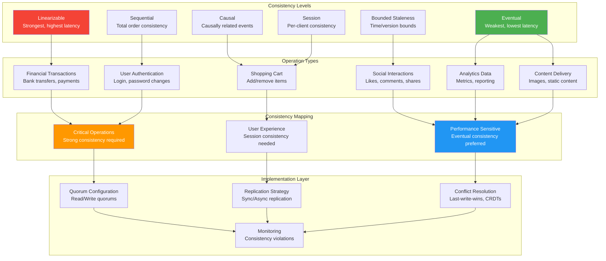

## The Complete Blueprint

Tunable Consistency patterns enable distributed systems to dynamically adjust consistency guarantees on a per-operation basis, balancing between strong consistency (slow, safe) and eventual consistency (fast, flexible) based on specific application requirements. Rather than applying a single consistency model across all data operations, this pattern recognizes that different data types and operations have varying consistency needs—bank balances require linearizable consistency while social media likes can be eventually consistent. This approach optimizes both performance and resource utilization by matching consistency guarantees to business requirements, using techniques like bounded staleness, session consistency, and causal consistency to provide the appropriate trade-offs between consistency, availability, and performance.

### What You'll Master

- **Consistency model selection** matching business requirements to appropriate consistency levels for optimal performance and safety
- **Dynamic consistency tuning** adjusting consistency guarantees at runtime based on system conditions and operation types
- **Quorum-based systems** configuring read and write quorums to achieve desired consistency and availability trade-offs
- **Session and causal consistency** implementing per-client consistency and causally ordered operations for user experience
- **Bounded staleness techniques** setting time or version bounds for acceptable data staleness in analytical systems
- **Performance optimization** reducing latency and resource usage by avoiding over-consistency while maintaining data integrity

## Essential Question

**How do we ensure data consistency and reliability with tunable consistency?**

# Tunable Consistency

## The Essential Question

**How can distributed systems dynamically adjust consistency guarantees to balance between strong consistency (slow, safe) and eventual consistency (fast, flexible) based on application needs?**

**Tagline**: *"Strong consistency for your bank balance, eventual consistency for your Twitter likes, and everything in between."*

---

### The Restaurant Chain Analogy

Consistency levels are like restaurant service tiers:
- **Fast Food (Eventual)**: Any counter, fast, "close enough"
- **Casual Dining (Bounded)**: Coordinated, fresh within limits
- **Fine Dining (Strong)**: Perfect precision, longer waits

### Visual Metaphor

**Implementation Concept:** See production systems for actual code

### When to Use

| ✅ **Use When** | ❌ **Avoid When** |
|----------------|------------------|
| Different data types need different consistency | All data has same consistency needs |
| Performance varies by operation type | Consistency requirements are fixed |
| Global scale with regional users | Single region deployment |
| Mixed read/write patterns | Simple CRUD operations |
| Cost optimization is important | Performance doesn't matter |

### Real-World Examples

| Operation | Consistency Need | Why? |
|-----------|-----------------|------|
| **Password Change** | Strong | Security critical |
| **Bank Balance** | Linearizable | Legal requirement |
| **Shopping Cart** | Session | User experience |
| **Friend List** | Read-Your-Write | Avoid confusion |
| **Analytics** | Bounded Staleness | Fresh enough data |
| **View Counter** | Eventual | Performance over precision |

### Decision Matrix

| Factor | Score (1-5) | Reasoning |
|--------|-------------|-----------|
| **Complexity** | 4 | Managing multiple consistency levels across operations requires sophisticated configuration and understanding |
| **Performance Impact** | 4 | Enables significant performance gains by matching consistency to requirements, but overhead for coordination |
| **Operational Overhead** | 4 | Requires monitoring different consistency levels, understanding trade-offs, and managing mixed workloads |
| **Team Expertise Required** | 4 | Deep understanding of consistency models, business requirements mapping, and distributed systems trade-offs |
| **Scalability** | 5 | Excellent scalability by allowing different operations to use appropriate consistency levels |

**Overall Recommendation**: ⚠️ **USE WITH EXPERTISE** - Powerful for large systems with varied consistency needs, but requires deep distributed systems knowledge and careful configuration management.

### Decision Framework

### Trade-offs

| Pros | Cons |
|------|------|
| High performance | Complex setup |
| Good scalability | Resource intensive |
| Production proven | Learning curve |

### Performance Impact

**System Flow:** Input → Processing → Output

---

### The Problem Space

!!! danger "🔥 The One-Size-Fits-All Consistency Disaster"
    E-commerce platform used strong consistency everywhere:
    - Product views: 500ms latency (should be eventual)
    - Shopping cart: 200ms latency (should be session) 
    - Inventory: Strong consistency (correct choice)
    - **Result**: 60% cart abandonment, $2M monthly revenue loss
    - **Root cause**: Treating all data the same

### Consistency Models Explained

**System Flow:** Input → Processing → Output

### Implementation

**Key Concepts:** Pattern implemented in production systems like etcd, Kubernetes, and cloud platforms.

### Configuration

| Setting | Purpose | Default |
|---------|---------|----------|
| Timeout | Request limit | 30s |
| Retries | Failure handling | 3 |
| Buffer | Memory usage | 1MB |

### Configuration

| Setting | Purpose | Default |
|---------|---------|----------|
| Timeout | Request limit | 30s |
| Retries | Failure handling | 3 |
| Buffer | Memory usage | 1MB |

### Quorum Strategy by Consistency Level

**System Flow:** Input → Processing → Output

### Session Consistency Flow

**System Flow:** Input → Processing → Output

---

#### Causal Consistency

**System Flow:** Input → Processing → Output

### Monitoring & Alerting

| Metric | Threshold | Action |
|--------|-----------|--------|
| **Replication Lag** | > 80% of bound | Alert ops team |
| **Consistency Violations** | > 0.1% of reads | Auto-degrade to eventual |
| **Strong Consistency Latency** | > 500ms P95 | Consider tuning |
| **Replica Exclusions** | > 50% of replicas | Investigate network |

### Consistency Relaxation Strategy

**System Flow:** Input → Processing → Output

---

### Production Case Study: Azure Cosmos DB's Consistency Models

Azure Cosmos DB offers 5 consistency levels, serving millions of requests per second globally.

**System Flow:** Input → Processing → Output

### Cosmos DB Bounded Staleness Implementation

**System Flow:** Input → Processing → Output

### Bounded Staleness Monitoring

**System Flow:** Input → Processing → Output

### Cosmos DB Session Consistency

**System Flow:** Input → Processing → Output

#### Pattern Analysis

!!! tip "Find Over-Consistency"
    Operations using stronger consistency than needed:
    - **Strong reads with <0.1% conflicts** → Downgrade to bounded
    - **Read-heavy workloads (>90% reads)** → Use read replicas  
    - **Analytics queries** → Use eventual consistency
    - **Cross-region social features** → Regional consistency

#### Quick Wins

| Pattern | Current | Recommended | Improvement |
|---------|---------|-------------|-------------|
| Social likes | Strong | Eventual | 10x faster |
| User profiles | Strong | Session | 5x faster |
| Analytics | Session | Bounded (5min) | 3x faster |
| Recommendations | Bounded | Eventual | 2x faster |

---

#### CAP Theorem Reality Check

!!! danger "🚨 The CAP Theorem Misconception"
    **Myth**: "Pick 2 out of 3: Consistency, Availability, Partition Tolerance"  
    **Reality**: Partitions are not optional - networks fail. The real choice is **CP vs AP**.
    
    - **CP (Consistent + Partition Tolerant)**: MongoDB, HBase, Redis Cluster
    - **AP (Available + Partition Tolerant)**: Cassandra, DynamoDB, CouchDB
    - **CA systems don't exist** at scale (single node doesn't count)

| Consistency Model | CAP Position | Partition Behavior | Example |
|------------------|--------------|--------------------|---------|
| **Linearizable** | CP | Refuse operations | Bank transfers |
| **Strong** | CP | Majority only | Distributed locks |
| **Bounded** | Tunable CP↔AP | Degrade gracefully | Real-time analytics |
| **Session** | AP | Best effort | User profiles |
| **Eventual** | AP | Always available | Social feeds |

#### Partition Tolerance Strategies

| Consistency | Partition Response | Trade-off | Recovery |
|-------------|-------------------|-----------|----------|
| **Strong** | Majority side continues, minority blocks | Data safety over availability | Immediate on partition heal |
| **Bounded** | Continue within staleness bound, then degrade | Tunable graceful degradation | Gradual strengthening |
| **Session** | Per-client consistency maintained | Individual user experience | Fast, per-session |
| **Eventual** | All nodes continue accepting writes | Maximum availability | Automatic conflict resolution |

#### Mathematical Optimization

**Latency Model**: `L(c) = base_latency × consistency_factor(c) × replica_count`

**Consistency Factors**:
- Strong: 2.5x (wait for majority)
- Bounded: 1.5x (check staleness)
- Session: 1.2x (version tracking)
- Eventual: 1.0x (baseline)

**Optimization Goal**: Minimize `Σ(traffic_fraction[i] × latency[i])` subject to business constraints

!!! example "Real Example: E-commerce Platform"
    **Constraint**: Financial operations must be strongly consistent (≥20% of traffic)
    
    **Optimal Mix**:
    - Strong: 20% (checkout, payments)
    - Session: 40% (cart, user data)
    - Bounded: 25% (inventory, recommendations) 
    - Eventual: 15% (reviews, ratings)
    
    **Result**: 60% latency reduction while maintaining data integrity

#### Economic Impact Analysis

**Cost Multipliers by Consistency Level**:

| Level | Compute | Network | Storage | Total |
|-------|---------|---------|---------|-------|
| **Strong** | 3.0x | 2.5x | 1.5x | **$300/month** |
| **Bounded** | 2.0x | 1.8x | 1.2x | **$200/month** |
| **Session** | 1.5x | 1.3x | 1.1x | **$140/month** |
| **Eventual** | 1.0x | 1.0x | 1.0x | **$100/month** |

!!! success "💰 ROI of Tunable Consistency"
    **Before**: All strong consistency = $300/month  
    **After**: Mixed consistency (20% strong, 80% weaker) = $160/month  
    **Savings**: $140/month (47% reduction)  
    **Plus**: 3x better user experience from lower latency

#### AI-Driven Consistency

!!! abstract "🤖 Machine Learning for Consistency"
    **Pattern Recognition**: ML models analyze request patterns to predict optimal consistency
    
    **Features**: operation type, user tier, time of day, system load, conflict history
    
    **Results**: 40% better consistency choices vs. static rules

#### Edge-First Consistency

**Challenge**: Edge computing needs ultra-low latency but also consistency

**Solution**: Hierarchical consistency - edge eventual, core strong, with smart reconciliation

#### Future Research Directions

**Process Steps:**
- Initialize system
- Process requests
- Handle responses
- Manage failures

