```mermaid
graph TB
    subgraph "Progressive Relaxation"
        L[LINEARIZABLE<br/>Latency: 100ms]
        S[SEQUENTIAL<br/>Latency: 50ms]
        RYW[READ_YOUR_WRITE<br/>Latency: 20ms]
        BS[BOUNDED_STALENESS<br/>Latency: 10ms]
        E[EVENTUAL<br/>Latency: 5ms]
        
        L -->|Load > 80%| S
        S -->|Load > 85%| RYW
        RYW -->|Load > 90%| BS
        BS -->|Load > 95%| E
    end
    
    subgraph "Load vs Consistency"
        Graph["📊 Dynamic Adjustment<br/><br/>Load: 0% ────────── 100%<br/>Level: Strong ──── Eventual"]
    end
    
    subgraph "Benefits"
        B1[Maintain SLAs<br/>under load]
        B2[Optimal resource<br/>utilization]
        B3[Cost-effective<br/>operations]
    end
```

# Tunable Consistency

**One size doesn't fit all - Let applications choose their consistency guarantees**

> *"Strong consistency for your bank balance, eventual consistency for your Twitter likes, and everything in between."*

---

## Level 1: Intuition

### The Restaurant Chain Analogy

Consistency levels are like restaurant service tiers:
- **Fast Food (Eventual)**: Any counter, fast, "close enough"
- **Casual Dining (Bounded)**: Coordinated, fresh within limits
- **Fine Dining (Strong)**: Perfect precision, longer waits

### Visual Metaphor

```
💰 Bank Transfer → STRONG ("Must be perfect")
❤️ Social Like → EVENTUAL ("Can be approximate")  
📊 Analytics → BOUNDED ("Fresh enough")
```

### Real-World Examples

| Operation | Consistency Need | Why? |
|-----------|-----------------|------|
| **Password Change** | Strong | Security critical |
| **Shopping Cart** | Session | User experience |
| **View Counter** | Eventual | Performance over precision |
| **Bank Balance** | Linearizable | Legal requirement |
| **Friend List** | Read-Your-Write | Avoid confusion |
| **Analytics** | Bounded Staleness | Fresh enough data |


### Basic Implementation


### Consistency Trade-offs Visualization


---

## Level 2: Foundation

### Consistency Spectrum


### Consistency Models Explained

| Model | Guarantee | Use Case | Trade-off |
|-------|-----------|----------|-----------|
| **Linearizable** | Global real-time ordering | Financial transactions | Highest latency |
| **Sequential** | Per-process ordering | User sessions | Moderate latency |
| **Snapshot Isolation** | Consistent point-in-time view | Reports | May miss updates |
| **Read Your Write** | See own writes immediately | User profiles | Per-session tracking |
| **Monotonic Read** | No time travel backwards | News feeds | Version tracking |
| **Bounded Staleness** | Maximum lag guarantee | Metrics | Tunable freshness |
| **Eventual** | Will converge eventually | Counters | Lowest latency |


### Implementation Patterns


### Consistency Configuration Matrix

| Data Type | Operation | Consistency | Max Staleness | Rationale |
|-----------|-----------|-------------|---------------|-----------|  
| **Financial** | All | Linearizable | 0ms | Regulatory compliance |
| **User Profile** | Write | Read-Your-Write | - | Immediate feedback |
| **User Profile** | Read | Session | - | See own changes |
| **Analytics** | Read | Bounded | 60s | Fresh enough data |
| **Social Stats** | All | Eventual | - | Scale over precision |
| **Inventory** | Write | Strong | 0ms | Prevent oversell |
| **Recommendations** | Read | Eventual | - | Performance critical |


### Quorum Configuration

```mermaid
graph TB
    subgraph "Quorum Calculations (N=5 replicas)"
        subgraph "Strong Consistency"
            SW[Write Quorum: 3]
            SR[Read Quorum: 3]
            SC[W + R > N<br/>3 + 3 > 5 ✓]
            
            SW --> SC
            SR --> SC
        end
        
        subgraph "Bounded Consistency"
            BW[Write Quorum: 3]
            BR[Read Quorum: 1]
            BC[Fresh replica<br/>within bound]
            
            BW --> BC
            BR --> BC
        end
        
        subgraph "Eventual Consistency"
            EW[Write Quorum: 1]
            ER[Read Quorum: 1]
            EC[Any available<br/>node]
            
            EW --> EC
            ER --> EC
        end
    end
    
    style SC fill:#ef4444,stroke:#dc2626
    style BC fill:#f59e0b,stroke:#d97706
    style EC fill:#10b981,stroke:#059669
```



### Quorum Overlap Visualization


### Session Consistency Implementation

```mermaid
sequenceDiagram
    participant U as User Session
    participant T as Session Tracker
    participant P as Primary
    participant R1 as Replica 1
    participant R2 as Replica 2
    participant R3 as Replica 3
    
    U->>T: Write(key=profile, value=newName)
    T->>P: Write to primary
    P-->>T: Version: 42
    T->>T: Track: session_123 -> v42
    T-->>U: Write confirmed
    
    Note over P,R3: Async replication in progress...
    
    P->>R1: Replicate v42
    P->>R2: Replicate v42
    P->>R3: Replicate v42 (delayed)
    
    U->>T: Read(key=profile)
    T->>T: Check: need v42 or higher
    
    T->>R1: Get version
    R1-->>T: v42 ✓
    T->>R1: Read profile
    R1-->>T: newName
    T-->>U: Return: newName
    
    Note over U: User sees their own write!
```



### Session Vector Tracking

```mermaid
graph TB
    subgraph "Session State"
        S1[Session: user_123]
        V1[Vector: {db1: 42, db2: 37}]
        W1[Writes: [(t1, v42), (t2, v43)]]
        
        S1 --> V1
        S1 --> W1
    end
    
    subgraph "Replica Selection"
        R1[Replica 1<br/>Vector: {db1: 45, db2: 40}]
        R2[Replica 2<br/>Vector: {db1: 41, db2: 38}]
        R3[Replica 3<br/>Vector: {db1: 40, db2: 35}]
        
        Check{v >= session?}
        
        R1 -->|45 >= 42 ✓| Check
        R2 -->|41 < 42 ✗| Check
        R3 -->|40 < 42 ✗| Check
        
        Check -->|Select R1| Read[Read from R1]
    end
    
    style R1 fill:#10b981,stroke:#059669,stroke-width:3px
    style R2 fill:#ef4444,stroke:#dc2626
    style R3 fill:#ef4444,stroke:#dc2626
```

---

## Level 3: Deep Dive

### Advanced Consistency Patterns

#### Causal Consistency Implementation

```mermaid
graph TB
    subgraph "Causal Dependency Tracking"
        Op1[Write A = 1]
        Op2[Read A → 1]
        Op3[Write B = A + 1]
        Op4[Read B → 2]
        Op5[Write C = B * 2]
        
        Op1 -->|causes| Op2
        Op2 -->|causes| Op3
        Op3 -->|causes| Op4
        Op4 -->|causes| Op5
        
        Deps[Op5 dependencies:<br/>{Op1, Op2, Op3, Op4}]
        
        Op5 -.-> Deps
    end
    
    subgraph "Replica Selection"
        R1[Replica 1<br/>Has: {Op1, Op2}]
        R2[Replica 2<br/>Has: {Op1, Op2, Op3, Op4}]
        R3[Replica 3<br/>Has: {Op1}]
        
        Check{Has all<br/>dependencies?}
        
        R1 -->|Missing Op3, Op4| Check
        R2 -->|Has all ✓| Check
        R3 -->|Missing many| Check
        
        Check -->|Select R2| Result[Read from R2]
    end
    
    style Op1 fill:#e0e7ff,stroke:#6366f1
    style Op3 fill:#e0e7ff,stroke:#6366f1
    style Op5 fill:#e0e7ff,stroke:#6366f1
    style R2 fill:#10b981,stroke:#059669,stroke-width:3px
```

### Causal Consistency Example


#### Bounded Staleness with Hybrid Logical Clocks

```mermaid
graph LR
    subgraph "Hybrid Logical Clock"
        HLC[HLC Timestamp]
        PT[Physical Time<br/>1234567890]
        LC[Logical Counter<br/>42]
        
        HLC --> PT
        HLC --> LC
        
        Format[Format: (PT, LC)<br/>Example: (1234567890, 42)]
    end
    
    subgraph "Bounded Staleness Check"
        Now[Current Time<br/>1234567900]
        Bound[Max Staleness<br/>5000ms (5s)]
        
        R1[Replica 1<br/>HLC: (1234567898, 10)<br/>Lag: 2s ✓]
        R2[Replica 2<br/>HLC: (1234567895, 23)<br/>Lag: 5s ✓]
        R3[Replica 3<br/>HLC: (1234567890, 5)<br/>Lag: 10s ✗]
        
        Check{Within<br/>bound?}
        
        R1 -->|2s < 5s| Check
        R2 -->|5s = 5s| Check
        R3 -->|10s > 5s| Check
        
        Check -->|Eligible| Select[Select R1<br/>(freshest)]
    end
    
    style R1 fill:#10b981,stroke:#059669,stroke-width:3px
    style R2 fill:#f59e0b,stroke:#d97706,stroke-width:2px
    style R3 fill:#ef4444,stroke:#dc2626,stroke-width:2px
```

### Staleness Monitoring Dashboard

```mermaid
graph TB
    subgraph "Replication Lag Monitor"
        subgraph "Replica Health"
            M1[Replica 1<br/>Lag: 1.2s<br/>Status: Healthy]
            M2[Replica 2<br/>Lag: 3.8s<br/>Status: Warning]
            M3[Replica 3<br/>Lag: 8.5s<br/>Status: Critical]
        end
        
        subgraph "Alerts"
            A1[⚠️ R2 approaching bound]
            A2[🚨 R3 exceeds bound]
        end
        
        subgraph "Actions"
            AC1[Increase replication<br/>bandwidth]
            AC2[Investigate network<br/>latency]
            AC3[Temporarily exclude<br/>R3 from reads]
        end
        
        M2 --> A1
        M3 --> A2
        
        A1 --> AC1
        A2 --> AC2
        A2 --> AC3
    end
    
    style M1 fill:#10b981,stroke:#059669
    style M2 fill:#f59e0b,stroke:#d97706
    style M3 fill:#ef4444,stroke:#dc2626
    style A2 fill:#ef4444,stroke:#dc2626
```



#### Dynamic Consistency Adjustment

```mermaid
flowchart TB
    subgraph "Dynamic Controller"
        Start[Operation Request]
        Base[Base Consistency<br/>from Rules]
        
        subgraph "System Metrics"
            Load[System Load: 85%]
            SLA[SLA Status: At Risk]
            Cost[Cost Analysis]
        end
        
        Decision{Adjust?}
        
        Relax[Relax Consistency<br/>STRONG → BOUNDED]
        Strengthen[Strengthen<br/>BOUNDED → STRONG]
        Keep[Keep Original]
        
        Start --> Base
        Base --> Load
        Base --> SLA
        Base --> Cost
        
        Load --> Decision
        SLA --> Decision
        Cost --> Decision
        
        Decision -->|High load +<br/>SLA risk| Relax
        Decision -->|Low load +<br/>Low cost| Strengthen
        Decision -->|Normal| Keep
    end
    
    style Relax fill:#10b981,stroke:#059669
    style Strengthen fill:#ef4444,stroke:#dc2626
    style Keep fill:#3b82f6,stroke:#2563eb
```



### Consistency Relaxation Strategy



---

## Level 4: Expert

### Production Case Study: Azure Cosmos DB's Consistency Models

Azure Cosmos DB offers 5 consistency levels, serving millions of requests per second globally.


### Cosmos DB Bounded Staleness Implementation


### Bounded Staleness Monitoring


### Cosmos DB Session Consistency


### Session Token Example


### Advanced Monitoring and Optimization

```python
class ConsistencyMonitoring:
    """Monitor consistency SLAs and optimize"""
    
    def __init__(self):
        self.metrics = MetricsCollector()
        self.analyzer = ConsistencyAnalyzer()
        
    def track_consistency_metrics(self):
        """Track detailed consistency metrics"""
        self.metrics.histogram(
            'consistency.staleness_ms',
            buckets=[10, 50, 100, 500, 1000, 5000, 10000]
        )
        
        self.metrics.counter(
            'consistency.violations',
            labels=['type', 'severity']
        )
        
        self.metrics.counter(
            'consistency.quorum_failures',
            labels=['operation', 'required_nodes']
        )
        
        self.metrics.counter(
            'consistency.downgrades',
            labels=['from_level', 'to_level', 'reason']
        )
    
    async def analyze_consistency_patterns(self):
        """Analyze patterns for optimization"""
        data = await self.metrics.get_time_series(
            metric='consistency.*',
            duration='24h'
        )
        
        analysis = {
            'over_consistency': self.find_over_consistency(data),
            'under_consistency': self.find_under_consistency(data),
            'optimal_levels': self.recommend_consistency_levels(data),
            'cost_savings': self.calculate_potential_savings(data)
        }
        
        return analysis
    
    def find_over_consistency(self, data: dict) -> list:
        """Find operations using stronger consistency than needed"""
        patterns = []
        
        strong_reads = data['consistency.operations'][
            data['consistency_level'] == 'strong'
        ]
        
        for operation in strong_reads:
            conflict_rate = self.calculate_conflict_rate(operation)
            
            if conflict_rate < 0.001:  # 0.1% conflicts
                patterns.append({
                    'operation': operation,
                    'current': 'strong',
                    'recommended': 'bounded_staleness',
                    'reasoning': 'Low conflict rate'
                })
        
        return patterns

class ConsistencyOptimizer:
    """Optimize consistency configurations"""
    
    def optimize_for_workload(self, workload: dict) -> dict:
        """Generate optimal consistency configuration"""
        optimization = {
            'rules': [],
            'estimated_improvement': {}
        }
        
        read_ratio = workload['reads'] / (workload['reads'] + workload['writes'])
        
        if read_ratio > 0.9:
            optimization['rules'].append({
                'pattern': {'operation': 'read'},
                'consistency': ConsistencyLevel.BOUNDED_STALENESS,
                'staleness_ms': 5000
            })
        
        if workload['conflict_rate'] < 0.01:
            optimization['rules'].append({
                'pattern': {'operation': 'write'},
                'consistency': ConsistencyLevel.SESSION
            })
        
        if workload['cross_region_percentage'] > 0.3:
            optimization['rules'].append({
                'pattern': {'cross_region': True},
                'consistency': ConsistencyLevel.EVENTUAL,
                'note': 'Minimize cross-region latency'
            })
        
        optimization['estimated_improvement'] = {
            'latency_reduction': '35%',
            'throughput_increase': '2.5x',
            'cost_reduction': '40%'
        }
        
        return optimization
```

---

## Level 5: Mastery

### Theoretical Foundations

#### CAP Theorem and Consistency Spectrum


### Partition Behavior by Consistency Level

```mermaid
flowchart TB
    subgraph "Network Partition Scenario"
        Part[Network Partition Detected]
        
        subgraph "Linearizable"
            L1{Majority side?}
            L2[Continue operations]
            L3[Refuse all ops]
            
            Part --> L1
            L1 -->|Yes| L2
            L1 -->|No| L3
        end
        
        subgraph "Bounded Staleness"
            B1{Within bound?}
            B2[Continue with bound]
            B3[Degrade to eventual]
            
            Part --> B1
            B1 -->|Yes| B2
            B1 -->|No| B3
        end
        
        subgraph "Eventual"
            E1[Continue all ops]
            E2[Reconcile later]
            
            Part --> E1
            E1 --> E2
        end
    end
    
    style L3 fill:#ef4444,stroke:#dc2626
    style B3 fill:#f59e0b,stroke:#d97706
    style E1 fill:#10b981,stroke:#059669
```

#### Mathematical Models

```mermaid
graph LR
    subgraph "Latency Modeling"
        subgraph "Queueing Theory"
            Lambda[λ = Arrival Rate]
            Mu[μ = Service Rate]
            K[k = Replicas]
            Rho[ρ = λ/(kμ)]
            
            Lambda --> Rho
            Mu --> Rho
            K --> Rho
        end
        
        subgraph "Consistency Latency"
            Strong[Strong: Wait for k/2+1<br/>Latency: O(log k)]
            Bounded[Bounded: Any fresh replica<br/>Latency: O(1)]
            Eventual[Eventual: First replica<br/>Latency: O(1)]
        end
    end
    
    subgraph "Optimization"
        Objective[Minimize:<br/>Σ(fraction_i × latency_i)]
        
        Constraints[Constraints:<br/>- Σ fractions = 1<br/>- strong ≥ 20%<br/>- SLA compliance]
        
        Result[Optimal Mix:<br/>Strong: 20%<br/>Bounded: 50%<br/>Eventual: 30%]
        
        Objective --> Result
        Constraints --> Result
    end
```

### Consistency Cost Analysis

```mermaid
graph TB
    subgraph "Cost Components"
        subgraph "Strong Consistency"
            SC1[Compute: 3x]
            SC2[Network: 2.5x]
            SC3[Storage: 1.5x]
            SC4[Latency: 50ms]
            SCT[Total: High]
            
            SC1 --> SCT
            SC2 --> SCT
            SC3 --> SCT
            SC4 --> SCT
        end
        
        subgraph "Eventual Consistency"
            EC1[Compute: 1x]
            EC2[Network: 1x]
            EC3[Storage: 1x]
            EC4[Latency: 5ms]
            ECT[Total: Low]
            
            EC1 --> ECT
            EC2 --> ECT
            EC3 --> ECT
            EC4 --> ECT
        end
    end
    
    subgraph "Trade-off"
        Graph["Cost vs Consistency<br/><br/>$    ↑<br/>     |  Strong<br/>     |    /<br/>     |   /<br/>     |  / Bounded<br/>     | /<br/>     |/ Eventual<br/>     +───────→<br/>     Consistency"]
    end
    
    style SCT fill:#ef4444,stroke:#dc2626
    style ECT fill:#10b981,stroke:#059669
```

### Future Directions

#### Quantum Consistency

```python
class QuantumConsistency:
    """Theoretical quantum-inspired consistency models"""
    
    def quantum_superposition_consistency(self):
        """Multiple consistency states until observed"""
        
        class QuantumState:
            def __init__(self):
                self.states = {
                    'strong': 0.5,
                    'eventual': 0.5
                }
                
            def observe(self, requirements: dict):
                """Collapse to specific consistency"""
                if requirements['critical']:
                    return ConsistencyLevel.STRONG
                else:
                    return ConsistencyLevel.EVENTUAL
        
        return QuantumState()
    
    def entangled_consistency(self):
        """Consistency states entangled across regions"""
        pass  # Implementation TBD
```

#### AI-Driven Consistency

```python
class AIConsistencyOptimizer:
    """Machine learning for consistency optimization"""
    
    def train_consistency_predictor(self, historical_data: pd.DataFrame):
        """Predict optimal consistency level"""
        features = [
            'operation_type',
            'data_type',
            'user_tier',
            'time_of_day',
            'system_load',
            'geographic_region',
            'conflict_history'
        ]
        
        model = RandomForestClassifier()
        model.fit(
            historical_data[features],
            historical_data['optimal_consistency']
        )
        
        return model
    
    def adaptive_consistency(self):
        """Real-time consistency adaptation"""
        
        def adapt_consistency(operation: dict) -> ConsistencyLevel:
            predicted = self.model.predict([operation])
            confidence = self.model.predict_proba([operation]).max()
            
            if confidence > 0.9:
                return predicted
            else:
                return ConsistencyLevel.STRONG
```

### Economic Impact

```python
class ConsistencyEconomics:
    """Economic analysis of consistency choices"""
    
    def calculate_consistency_costs(self, usage: dict) -> dict:
        """Calculate costs of different consistency levels"""
        costs = {
            'strong': {
                'compute': 3.0,  # 3x compute for coordination
                'network': 2.5,  # Cross-region coordination
                'storage': 1.5,  # Version tracking
                'latency_cost': 50  # ms average
            },
            'bounded': {
                'compute': 2.0,
                'network': 1.5,
                'storage': 1.2,
                'latency_cost': 20
            },
            'eventual': {
                'compute': 1.0,
                'network': 1.0,
                'storage': 1.0,
                'latency_cost': 5
            }
        }
        
        monthly_cost = {}
        
        for level, factors in costs.items():
            requests = usage['requests_by_level'][level]
            
            monthly_cost[level] = {
                'compute': requests * factors['compute'] * 0.00001,
                'network': requests * factors['network'] * 0.00002,
                'storage': usage['data_gb'] * factors['storage'] * 0.1,
                'total': None
            }
            
            monthly_cost[level]['total'] = sum(
                v for k, v in monthly_cost[level].items() 
                if k != 'total'
            )
        
        current_cost = sum(c['total'] for c in monthly_cost.values())
        optimal_cost = self.calculate_optimal_cost(usage)
        
        return {
            'current_monthly_cost': current_cost,
            'optimal_monthly_cost': optimal_cost,
            'potential_savings': current_cost - optimal_cost,
            'roi_months': 3  # Implementation cost recovery
        }
```

---

## Quick Reference

### Decision Framework

| Data Type | Recommended Consistency | Rationale |
|-----------|------------------------|-----------|
| Financial transactions | Strong/Linearizable | Regulatory compliance |
| User profiles | Session/Read-Your-Write | User experience |
| Social interactions | Eventual | Scale and performance |
| Analytics/Metrics | Bounded Staleness | Fresh enough |
| Audit logs | Sequential | Ordering matters |
| Configuration | Strong | Consistency critical |


### Implementation Checklist

- [ ] Identify data types and consistency needs
- [ ] Map operations to consistency levels
- [ ] Configure quorum sizes per level
- [ ] Implement session tracking
- [ ] Set up staleness monitoring
- [ ] Add consistency metrics
- [ ] Create downgrade policies
- [ ] Test partition behavior
- [ ] Document consistency SLAs
- [ ] Train team on trade-offs

### Common Anti-Patterns

1. **One size fits all** - Using same consistency everywhere
2. **Over-consistency** - Strong consistency for everything
3. **Under-consistency** - Eventual consistency for critical data
4. **No monitoring** - Not tracking consistency violations
5. **Static configuration** - Not adapting to load

---

## 🎓 Key Takeaways

1. **Consistency is a spectrum** - Not binary (strong vs eventual)
2. **Match consistency to requirements** - Financial ≠ Social media
3. **Monitor and measure** - Track violations and costs
4. **Dynamic adaptation** - Adjust based on conditions
5. **Educate stakeholders** - Everyone must understand trade-offs

---

*"The art of distributed systems is knowing when to be consistent and when to be available."*

---

**Previous**: [← Timeout Pattern](timeout.md) | **Next**: [Sharding Pattern →](sharding.md)