```mermaid
graph LR
    subgraph "Latency vs Consistency"
        Y["↑ Latency (ms)"] 
        X["Consistency Strength →"]
        
        E[Eventual<br/>5ms]
        S[Session<br/>15ms]
        B[Bounded<br/>25ms]
        T[Strong<br/>100ms]
        L[Linearizable<br/>200ms]
        
        E --> S --> B --> T --> L
        
        Y -.-> L
        X -.-> L
    end
    
    style E fill:#10b981,stroke:#059669
    style S fill:#3b82f6,stroke:#2563eb 
    style B fill:#f59e0b,stroke:#d97706
    style T fill:#ef4444,stroke:#dc2626
    style L fill:#7c2d12,stroke:#451a03
```

```mermaid
sequenceDiagram
    participant Client
    participant SessionTracker
    participant Primary
    participant Replica
    
    Client->>SessionTracker: Write(profile, "John")
    SessionTracker->>Primary: Write with session ID
    Primary-->>SessionTracker: OK, version=v42
    SessionTracker->>SessionTracker: Track: session_123 → v42
    
    Note over Primary,Replica: Async replication...
    Primary->>Replica: Replicate v42
    
    Client->>SessionTracker: Read(profile)
    SessionTracker-->>Replica: Need version ≥ v42
    
    alt Replica has v42+
        Replica-->>Client: "John" (v42)
    else Replica behind
        SessionTracker-->>Primary: Read from primary
        Primary-->>Client: "John" (v42)
    end
    
    Note over Client: Always sees own writes!
```

```mermaid
graph TB
    subgraph "Progressive Relaxation"
        L[LINEARIZABLE<br/>Latency: 100ms]
        S[SEQUENTIAL<br/>Latency: 50ms]
        RYW[READ_YOUR_WRITE<br/>Latency: 20ms]
        BS[BOUNDED_STALENESS<br/>Latency: 10ms]
        E[EVENTUAL<br/>Latency: 5ms]
        
        L -->|Load > 80%| S
        S -->|Load > 85%| RYW
        RYW -->|Load > 90%| BS
        BS -->|Load > 95%| E
    end
    
    subgraph "Load vs Consistency"
        Graph["📊 Dynamic Adjustment<br/><br/>Load: 0% ────────── 100%<br/>Level: Strong ──── Eventual"]
    end
    
    subgraph "Benefits"
        B1[Maintain SLAs<br/>under load]
        B2[Optimal resource<br/>utilization]
        B3[Cost-effective<br/>operations]
    end
```

## Essential Question

**How do we ensure data consistency and reliability with tunable consistency?**


# Tunable Consistency

## The Essential Question

**How can distributed systems dynamically adjust consistency guarantees to balance between strong consistency (slow, safe) and eventual consistency (fast, flexible) based on application needs?**

**Tagline**: *"Strong consistency for your bank balance, eventual consistency for your Twitter likes, and everything in between."*

---

## Level 1: Intuition (5 minutes)

### The Restaurant Chain Analogy

Consistency levels are like restaurant service tiers:
- **Fast Food (Eventual)**: Any counter, fast, "close enough"
- **Casual Dining (Bounded)**: Coordinated, fresh within limits
- **Fine Dining (Strong)**: Perfect precision, longer waits

### Visual Metaphor

```
💰 Bank Transfer → STRONG ("Must be perfect")
❤️ Social Like → EVENTUAL ("Can be approximate")  
📊 Analytics → BOUNDED ("Fresh enough")
```

### When to Use

| ✅ **Use When** | ❌ **Avoid When** |
|----------------|------------------|
| Different data types need different consistency | All data has same consistency needs |
| Performance varies by operation type | Consistency requirements are fixed |
| Global scale with regional users | Single region deployment |
| Mixed read/write patterns | Simple CRUD operations |
| Cost optimization is important | Performance doesn't matter |

### Real-World Examples

| Operation | Consistency Need | Why? |
|-----------|-----------------|------|
| **Password Change** | Strong | Security critical |
| **Bank Balance** | Linearizable | Legal requirement |
| **Shopping Cart** | Session | User experience |
| **Friend List** | Read-Your-Write | Avoid confusion |
| **Analytics** | Bounded Staleness | Fresh enough data |
| **View Counter** | Eventual | Performance over precision |


### Decision Framework


<details>
<summary>View implementation code</summary>


</details>

### Trade-offs Matrix

| Consistency Level | Latency | Availability | Cost | Complexity | Use Case |
|------------------|---------|--------------|------|------------|----------|
| **Linearizable** | Very High | Low | High | High | Financial transactions |
| **Sequential** | High | Medium | Medium | Medium | Audit trails |
| **Bounded Staleness** | Medium | High | Medium | Medium | Analytics |
| **Session** | Low | High | Low | Medium | User profiles |
| **Eventual** | Very Low | Very High | Low | Low | Social counters |

### Performance Impact


<details>
<summary>View implementation code</summary>



</details>

---

## Level 2: Foundation (15 minutes)

### The Problem Space

!!! danger "🔥 The One-Size-Fits-All Consistency Disaster"
    E-commerce platform used strong consistency everywhere:
    - Product views: 500ms latency (should be eventual)
    - Shopping cart: 200ms latency (should be session) 
    - Inventory: Strong consistency (correct choice)
    - **Result**: 60% cart abandonment, $2M monthly revenue loss
    - **Root cause**: Treating all data the same

### Consistency Models Explained


<details>
<summary>View implementation code</summary>



</details>

```mermaid
graph TD
    subgraph "Consistency Hierarchy"
        L[Linearizable<br/>🔒 Strongest]
        S[Sequential<br/>📝 Ordered]
        SI[Snapshot Isolation<br/>📸 Point-in-time]
        RYW[Read Your Write<br/>👤 Personal]
        MR[Monotonic Read<br/>⏰ No time travel]
        BS[Bounded Staleness<br/>⏳ Time-limited]
        E[Eventual<br/>🌊 Weakest]
        
        L -->|Relax| S
        S -->|Relax| SI
        SI -->|Relax| RYW
        RYW -->|Relax| MR
        MR -->|Relax| BS
        BS -->|Relax| E
    end
    
    style L fill:#7c2d12,stroke:#451a03,stroke-width:3px
    style E fill:#10b981,stroke:#059669,stroke-width:3px
```

### Implementation Strategies

| Strategy | Description | Best For | Complexity |
|----------|-------------|----------|------------|
| **Per-Operation** | Set consistency per API call | Mixed workloads | Medium |
| **Per-Data-Type** | Consistency by data category | Clear data tiers | Low |
| **Per-User-Tier** | Premium users get stronger consistency | SaaS platforms | High |
| **Dynamic** | Adjust based on system load | High-scale systems | Very High |
| **Geographic** | Consistency varies by region | Global applications | High |


### Configuration Patterns


<details>
<summary>View implementation code</summary>


</details>

### Configuration Matrix by Use Case

| Use Case | Data Type | Consistency Level | Max Staleness | Business Impact |
|----------|-----------|------------------|---------------|------------------|
| 🏦 **Banking** | Account balance | Linearizable | 0ms | Regulatory compliance |
| 🛒 **E-commerce** | Inventory | Strong | 0ms | Prevent oversell |
| 👤 **Social Media** | User profile | Session | - | Personal consistency |
| 📈 **Analytics** | Metrics | Bounded | 300s | Performance + freshness |
| 👍 **Engagement** | Likes/views | Eventual | - | Scale over precision |
| 🔐 **Security** | Passwords | Linearizable | 0ms | Security critical |


### Quorum Strategy by Consistency Level


<details>
<summary>View implementation code</summary>



</details>

```mermaid
graph TB
    subgraph "5 Replica System"
        subgraph "Strong (W=3, R=3)"
            S1["Replica 1 ✓"]
            S2["Replica 2 ✓"]
            S3["Replica 3 ✓"]
            S4["Replica 4"]
            S5["Replica 5"]
            
            SW["Write: Wait 3"] 
            SR["Read: Query 3"]
            SG["Guarantee: Overlap"]
            
            SW --> SG
            SR --> SG
        end
        
        subgraph "Bounded (W=2, R=1)"
            B1["Replica 1 ✓"]
            B2["Replica 2 ✓"]
            B3["Replica 3"]
            B4["Replica 4"]
            B5["Replica 5"]
            
            BW["Write: Wait 2"]
            BR["Read: Any fresh"]
            BG["Guarantee: Staleness bound"]
            
            BW --> BG
            BR --> BG
        end
        
        subgraph "Eventual (W=1, R=1)"
            E1["Replica 1 ✓"]
            E2["Replica 2"]
            E3["Replica 3"]
            E4["Replica 4"]
            E5["Replica 5"]
            
            EW["Write: Any 1"]
            ER["Read: Any 1"]
            EG["Guarantee: Eventually"]
            
            EW --> EG
            ER --> EG
        end
    end
    
    style S1,S2,S3 fill:#ef4444,stroke:#dc2626
    style B1,B2 fill:#f59e0b,stroke:#d97706
    style E1 fill:#10b981,stroke:#059669
```

### Session Consistency Flow


<details>
<summary>View implementation code</summary>



</details>


---

## Level 3: Deep Dive (25 minutes)

### Advanced Consistency Models

#### Causal Consistency


<details>
<summary>View implementation code</summary>


</details>


#### Bounded Staleness Implementation


### Monitoring & Alerting

| Metric | Threshold | Action |
|--------|-----------|--------|
| **Replication Lag** | > 80% of bound | Alert ops team |
| **Consistency Violations** | > 0.1% of reads | Auto-degrade to eventual |
| **Strong Consistency Latency** | > 500ms P95 | Consider tuning |
| **Replica Exclusions** | > 50% of replicas | Investigate network |


#### Dynamic Consistency Tuning


<details>
<summary>View implementation code</summary>


</details>

### Consistency Relaxation Strategy


<details>
<summary>View implementation code</summary>



</details>

---

## Level 4: Expert

### Production Case Study: Azure Cosmos DB's Consistency Models

Azure Cosmos DB offers 5 consistency levels, serving millions of requests per second globally.

```mermaid
graph TD
    A[Input] --> B[Process]
    B --> C[Output]
    B --> D[Error Handling]
    
    style A fill:#f9f,stroke:#333,stroke-width:2px
    style B fill:#bbf,stroke:#333,stroke-width:2px
    style C fill:#bfb,stroke:#333,stroke-width:2px
    style D fill:#fbb,stroke:#333,stroke-width:2px
```

<details>
<summary>View implementation code</summary>

```mermaid
graph TB
    subgraph "Cosmos DB Global Distribution"
        subgraph "Write Region (Primary)"
            P[East US<br/>Primary]
        end
        
        subgraph "Read Regions"
            R1[West US<br/>Replica]
            R2[Europe<br/>Replica]
            R3[Asia<br/>Replica]
        end
        
        P -->|Replication| R1
        P -->|Replication| R2
        P -->|Replication| R3
    end
    
    subgraph "5 Consistency Levels"
        Strong[Strong<br/>P99: 10ms<br/>99.99%]
        Bounded[Bounded Staleness<br/>P99: 5ms<br/>99.99%]
        Session[Session<br/>P99: 3ms<br/>99.99%]
        Prefix[Consistent Prefix<br/>P99: 2ms<br/>99.99%]
        Eventual[Eventual<br/>P99: 1ms<br/>99.999%]
    end
    
    style P fill:#10b981,stroke:#059669,stroke-width:3px
    style Strong fill:#ef4444,stroke:#dc2626
    style Eventual fill:#10b981,stroke:#059669
```

</details>
### Cosmos DB Bounded Staleness Implementation

```mermaid
graph TD
    A[Input] --> B[Process]
    B --> C[Output]
    B --> D[Error Handling]
    
    style A fill:#f9f,stroke:#333,stroke-width:2px
    style B fill:#bbf,stroke:#333,stroke-width:2px
    style C fill:#bfb,stroke:#333,stroke-width:2px
    style D fill:#fbb,stroke:#333,stroke-width:2px
```

<details>
<summary>View implementation code</summary>

```mermaid
sequenceDiagram
    participant C as Client
    participant P as Primary (East US)
    participant R1 as Replica (West US)
    participant R2 as Replica (Europe)
    
    Note over P,R2: Bounded Staleness: Max 100K ops or 5 seconds
    
    C->>P: Write Operation #1
    P->>P: Counter: 1, Time: T0
    P-->>C: Acknowledged
    
    P->>R1: Replicate Op #1
    P->>R2: Replicate Op #1
    
    loop Every write
        C->>P: Write Op #N
        P->>P: Counter++, Update timestamp
        P->>R1: Async replicate
        P->>R2: Async replicate
    end
    
    Note over R1: Lag: 50K ops, 3 seconds
    Note over R2: Lag: 90K ops, 4.5 seconds
    
    C->>R2: Read request
    R2->>R2: Check: 90K < 100K ✓<br/>4.5s < 5s ✓
    R2-->>C: Return data (within bounds)
    
    Note over R2: If lag > bounds,<br/>redirect to primary
```

</details>

### Bounded Staleness Monitoring

```mermaid
graph TD
    A[Input] --> B[Process]
    B --> C[Output]
    B --> D[Error Handling]
    
    style A fill:#f9f,stroke:#333,stroke-width:2px
    style B fill:#bbf,stroke:#333,stroke-width:2px
    style C fill:#bfb,stroke:#333,stroke-width:2px
    style D fill:#fbb,stroke:#333,stroke-width:2px
```

<details>
<summary>View implementation code</summary>

```mermaid
graph LR
    subgraph "Staleness Tracking"
        subgraph "Item Lag"
            IL[Current: 75,432 items<br/>Limit: 100,000 items<br/>Usage: 75%]
        end
        
        subgraph "Time Lag"
            TL[Current: 3.8 seconds<br/>Limit: 5 seconds<br/>Usage: 76%]
        end
        
        Alert{Alert if<br/>> 80%}
        
        IL --> Alert
        TL --> Alert
        
        Alert -->|Yes| Action[Force sync<br/>Increase bandwidth]
    end
    
    style IL fill:#f59e0b,stroke:#d97706
    style TL fill:#f59e0b,stroke:#d97706
```

</details>
### Cosmos DB Session Consistency

```mermaid
graph TD
    A[Input] --> B[Process]
    B --> C[Output]
    B --> D[Error Handling]
    
    style A fill:#f9f,stroke:#333,stroke-width:2px
    style B fill:#bbf,stroke:#333,stroke-width:2px
    style C fill:#bfb,stroke:#333,stroke-width:2px
    style D fill:#fbb,stroke:#333,stroke-width:2px
```

<details>
<summary>View implementation code</summary>

```mermaid
flowchart TB
    subgraph "Session Token Flow"
        Write[Client Write]
        Token[Session Token<br/>Generated]
        Store[Client Stores<br/>Token]
        Read[Client Read<br/>with Token]
        
        Write --> Token
        Token --> Store
        Store --> Read
    end
    
    subgraph "Token Structure"
        ST[Session Token]
        RV[Region Versions<br/>east-us: 142<br/>west-us: 138<br/>europe: 135]
        GS[Global Sequence<br/>4521]
        
        ST --> RV
        ST --> GS
    end
    
    subgraph "Read Logic"
        CheckRegion{Check closest<br/>region version}
        Regional[Read from<br/>regional replica]
        Primary[Read from<br/>primary]
        
        Read --> CheckRegion
        CheckRegion -->|Version OK| Regional
        CheckRegion -->|Version too old| Primary
    end
```

</details>


### Optimization Strategies

#### Pattern Analysis

!!! tip "Find Over-Consistency"
    Operations using stronger consistency than needed:
    - **Strong reads with <0.1% conflicts** → Downgrade to bounded
    - **Read-heavy workloads (>90% reads)** → Use read replicas  
    - **Analytics queries** → Use eventual consistency
    - **Cross-region social features** → Regional consistency

#### Quick Wins

| Pattern | Current | Recommended | Improvement |
|---------|---------|-------------|-------------|
| Social likes | Strong | Eventual | 10x faster |
| User profiles | Strong | Session | 5x faster |
| Analytics | Session | Bounded (5min) | 3x faster |
| Recommendations | Bounded | Eventual | 2x faster |

---

## Level 5: Mastery (45 minutes)

### Theoretical Foundations

#### CAP Theorem Reality Check

!!! danger "🚨 The CAP Theorem Misconception"
    **Myth**: "Pick 2 out of 3: Consistency, Availability, Partition Tolerance"  
    **Reality**: Partitions are not optional - networks fail. The real choice is **CP vs AP**.
    
    - **CP (Consistent + Partition Tolerant)**: MongoDB, HBase, Redis Cluster
    - **AP (Available + Partition Tolerant)**: Cassandra, DynamoDB, CouchDB
    - **CA systems don't exist** at scale (single node doesn't count)

| Consistency Model | CAP Position | Partition Behavior | Example |
|------------------|--------------|--------------------|---------|
| **Linearizable** | CP | Refuse operations | Bank transfers |
| **Strong** | CP | Majority only | Distributed locks |
| **Bounded** | Tunable CP↔AP | Degrade gracefully | Real-time analytics |
| **Session** | AP | Best effort | User profiles |
| **Eventual** | AP | Always available | Social feeds |

#### Partition Tolerance Strategies

| Consistency | Partition Response | Trade-off | Recovery |
|-------------|-------------------|-----------|----------|
| **Strong** | Majority side continues, minority blocks | Data safety over availability | Immediate on partition heal |
| **Bounded** | Continue within staleness bound, then degrade | Tunable graceful degradation | Gradual strengthening |
| **Session** | Per-client consistency maintained | Individual user experience | Fast, per-session |
| **Eventual** | All nodes continue accepting writes | Maximum availability | Automatic conflict resolution |

#### Mathematical Optimization

**Latency Model**: `L(c) = base_latency × consistency_factor(c) × replica_count`

**Consistency Factors**:
- Strong: 2.5x (wait for majority)
- Bounded: 1.5x (check staleness)
- Session: 1.2x (version tracking)
- Eventual: 1.0x (baseline)

**Optimization Goal**: Minimize `Σ(traffic_fraction[i] × latency[i])` subject to business constraints

!!! example "Real Example: E-commerce Platform"
    **Constraint**: Financial operations must be strongly consistent (≥20% of traffic)
    
    **Optimal Mix**:
    - Strong: 20% (checkout, payments)
    - Session: 40% (cart, user data)
    - Bounded: 25% (inventory, recommendations) 
    - Eventual: 15% (reviews, ratings)
    
    **Result**: 60% latency reduction while maintaining data integrity

#### Economic Impact Analysis

**Cost Multipliers by Consistency Level**:

| Level | Compute | Network | Storage | Total |
|-------|---------|---------|---------|-------|
| **Strong** | 3.0x | 2.5x | 1.5x | **$300/month** |
| **Bounded** | 2.0x | 1.8x | 1.2x | **$200/month** |
| **Session** | 1.5x | 1.3x | 1.1x | **$140/month** |
| **Eventual** | 1.0x | 1.0x | 1.0x | **$100/month** |

!!! success "💰 ROI of Tunable Consistency"
    **Before**: All strong consistency = $300/month  
    **After**: Mixed consistency (20% strong, 80% weaker) = $160/month  
    **Savings**: $140/month (47% reduction)  
    **Plus**: 3x better user experience from lower latency

### Emerging Trends

#### AI-Driven Consistency

!!! abstract "🤖 Machine Learning for Consistency"
    **Pattern Recognition**: ML models analyze request patterns to predict optimal consistency
    
    **Features**: operation type, user tier, time of day, system load, conflict history
    
    **Results**: 40% better consistency choices vs. static rules

#### Edge-First Consistency

**Challenge**: Edge computing needs ultra-low latency but also consistency

**Solution**: Hierarchical consistency - edge eventual, core strong, with smart reconciliation


#### Future Research Directions

1. **Quantum-Inspired Consistency**: Superposition states until "observed" by application needs
2. **Blockchain Consensus Integration**: Decentralized consistency without central coordinators  
3. **5G Edge Consistency**: Ultra-low latency consistency for IoT and AR/VR
4. **Climate-Aware Consistency**: Optimize for carbon footprint, not just performance

---

## Quick Reference

### Decision Matrix

```mermaid
flowchart TD
    Start["Data Operation"] --> Critical{"Business Critical?"}
    
    Critical -->|Yes| Financial{"Financial/Legal?"}
    Critical -->|No| Social{"Social/Engagement?"}
    
    Financial -->|Yes| Strong["STRONG\n🏦 Banks, Payments\nLatency: 100-200ms"]
    Financial -->|No| Session["SESSION\n👤 User Profiles\nLatency: 10-20ms"]
    
    Social -->|Yes| Eventual["EVENTUAL\n👍 Likes, Views\nLatency: 1-5ms"]
    Social -->|No| Bounded["BOUNDED\n📊 Analytics\nLatency: 5-15ms"]
    
    style Strong fill:#ef4444,stroke:#dc2626,stroke-width:3px
    style Session fill:#3b82f6,stroke:#2563eb,stroke-width:3px
    style Bounded fill:#f59e0b,stroke:#d97706,stroke-width:3px
    style Eventual fill:#10b981,stroke:#059669,stroke-width:3px
```

### Implementation Checklist

**Phase 1: Analysis**
- [ ] Audit current consistency usage
- [ ] Identify over-consistent operations  
- [ ] Map data types to business impact
- [ ] Define consistency SLAs per data type

**Phase 2: Configuration**
- [ ] Implement per-operation consistency rules
- [ ] Set up staleness bounds and monitoring
- [ ] Configure graceful degradation policies
- [ ] Add consistency violation alerting

**Phase 3: Optimization**
- [ ] Monitor latency improvements
- [ ] Track cost reductions
- [ ] Tune consistency levels based on data
- [ ] Train team on new patterns

### Quick Start Configuration

```mermaid
graph TD
    A[Input] --> B[Process]
    B --> C[Output]
    B --> D[Error Handling]
    
    style A fill:#f9f,stroke:#333,stroke-width:2px
    style B fill:#bbf,stroke:#333,stroke-width:2px
    style C fill:#bfb,stroke:#333,stroke-width:2px
    style D fill:#fbb,stroke:#333,stroke-width:2px
```

<details>
<summary>View implementation code</summary>

```yaml
consistency:
  rules:
    # Financial - never compromise
    - pattern: "payments/*"
      level: strong
      timeout: 10s
      
    # User data - personal consistency  
    - pattern: "users/*/profile"
      level: session
      timeout: 2s
      
    # Analytics - fresh enough
    - pattern: "analytics/**"
      level: bounded_staleness
      max_age: 300s
      
    # Social - scale over precision
    - pattern: "social/**"
      level: eventual
      timeout: 100ms
```

</details>

### Anti-Patterns to Avoid

!!! danger "Common Mistakes"
    1. **❌ All Strong**: Using strong consistency for everything (kills performance)
    2. **❌ All Eventual**: Using eventual for critical data (loses correctness)
    3. **❌ No Monitoring**: Not tracking consistency violations or staleness
    4. **❌ Static Rules**: Never adjusting consistency based on system conditions
    5. **❌ Ignoring Business Impact**: Technical decisions without business context

---

## Key Takeaways

!!! success "🎓 Master These Concepts"
    1. **Consistency is a business decision**, not just a technical one
    2. **Different data needs different consistency** - one size doesn't fit all  
    3. **Monitor staleness and violations**, not just latency
    4. **Design for graceful degradation** during system stress
    5. **Economics matter** - stronger consistency costs 2-3x more

!!! quote "Production Wisdom"
    *"The best consistency model is the weakest one that still meets your business requirements. Every bit of unnecessary consistency is money left on the table."*
    
    — Senior Engineer, Payment Systems Team

---

## Related Patterns

- **[CQRS](../architecture/cqrs.md)** - Separate read/write consistency
- **[Event Sourcing](../data-management/event-sourcing.md)** - Eventual consistency via events
- **[Saga Pattern](../coordination/saga.md)** - Distributed transaction consistency
- **[Multi-Region](../scaling/multi-region.md)** - Geographic consistency challenges