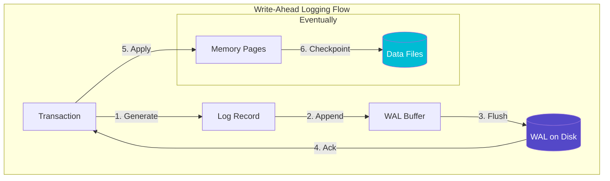
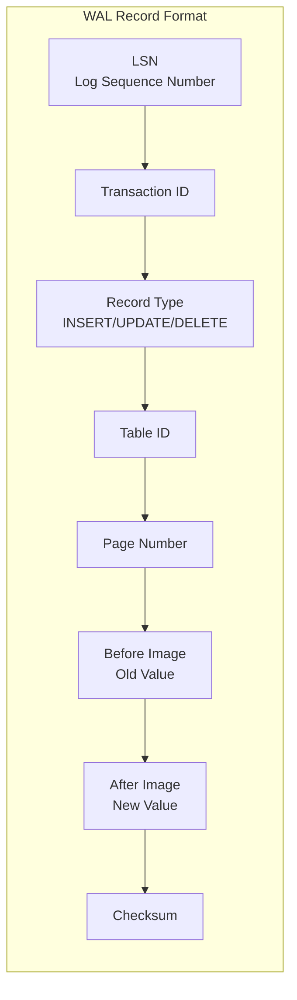
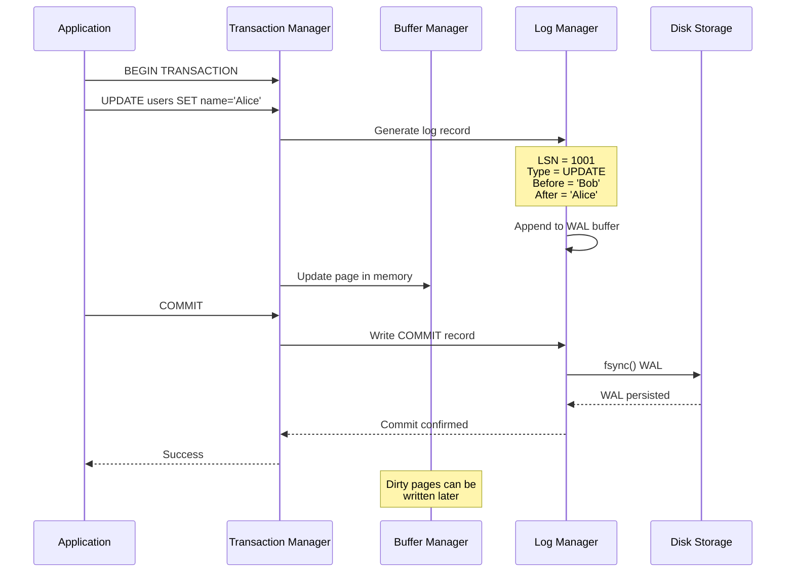
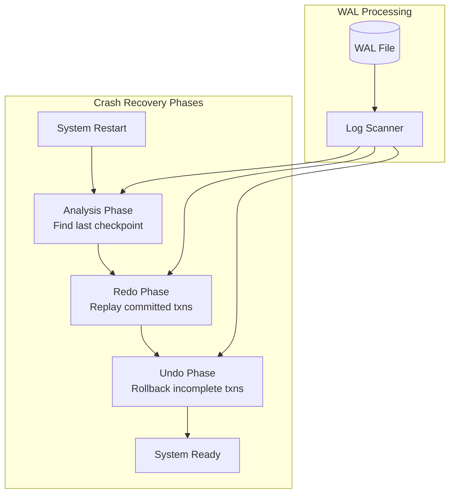
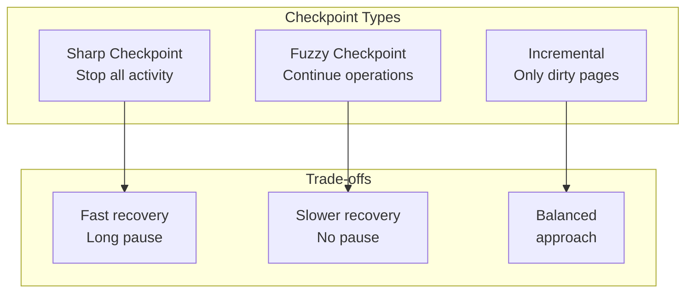
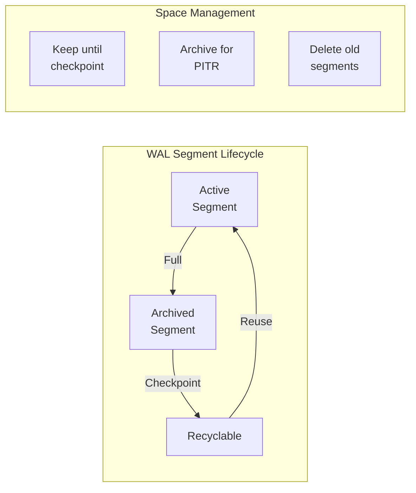
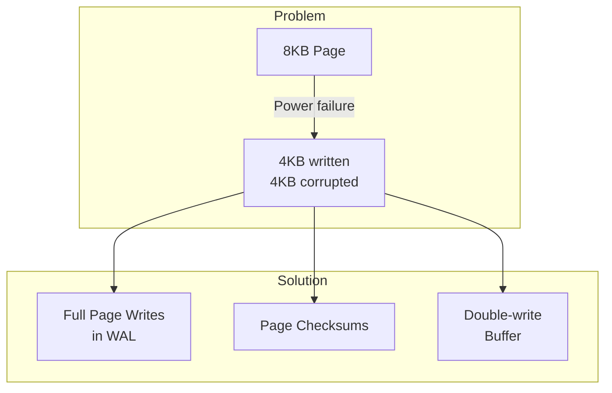

# Write-Ahead Log (WAL) Pattern

!!! warning "🥈 Silver Tier Pattern"
    **Database internals pattern**
    
    WAL is fundamental to database durability but is typically implemented by database engines, not application developers. Understanding WAL helps when tuning databases or building storage systems.
    
    **Best suited for:**
    - Building databases or storage engines
    - Understanding database durability
    - Debugging database performance
    - Learning transaction processing

<div class="pattern-type">Data Management Pattern
 Guarantee durability by writing intended changes to a sequential log before modifying the actual data, enabling crash recovery and transaction support.
</div>

## Problem Context

!!! warning "🎯 The Challenge"

 Database systems face a fundamental challenge:
 - **In-memory updates are fast** but volatile
 - **Disk updates are durable** but slow
 - **Random I/O is expensive** compared to sequential
 - **Crashes can happen** at any moment
 - **Partial writes** can corrupt data

 Without WAL, a crash during an update could leave the database in an inconsistent state.

## Core Concept



### The WAL Protocol

!!! abstract "🔑 The Golden Rule"

 **Write-Ahead Logging Protocol**:
 1. Log records must be written to stable storage **before** data page updates
 2. All log records for a transaction must be written **before** the transaction commits
 3. The log must be force-written to disk **before** acknowledging the commit

 This ensures: **No committed transaction is ever lost**

## How WAL Works

### 1. Log Record Structure



### 2. Write Path



### 3. Recovery Process



## Implementation Details

### Basic WAL Implementation

```python
class WriteAheadLog:
 def __init__(self, log_dir):
 self.log_dir = log_dir
 self.current_lsn = 0
 self.buffer = []
 self.buffer_size = 8 * 1024 * 1024 # 8MB
 
 def append(self, record):
 """Append record to WAL buffer"""
 record.lsn = self.next_lsn()
 self.buffer.append(record)
 
# Force flush if buffer full
 if self.buffer_size_bytes() >= self.buffer_size:
 self.flush()
 
 return record.lsn
 
 def flush(self):
 """Write buffer to disk with fsync"""
 if not self.buffer:
 return
 
# Write all records
 with open(self.current_log_file(), 'ab') as f:
 for record in self.buffer:
 f.write(record.serialize())
 
# Force to disk
 f.flush()
 os.fsync(f.fileno())
 
 self.buffer.clear()
 
 def force_up_to(self, lsn):
 """Ensure all records up to LSN are on disk"""
 if self.buffer and self.buffer[-1].lsn >= lsn:
 self.flush()
```

### Group Commit Optimization

```python
class GroupCommitManager:
 def __init__(self, wal, group_size=100, timeout_ms=10):
 self.wal = wal
 self.group_size = group_size
 self.timeout_ms = timeout_ms
 self.pending_commits = []
 
 def commit(self, transaction):
 """Add transaction to commit group"""
 self.pending_commits.append(transaction)
 
# Flush if group is full
 if len(self.pending_commits) >= self.group_size:
 self._flush_group()
 else:
# Wait for more commits or timeout
 self._schedule_flush()
 
 def _flush_group(self):
 """Flush all pending commits together"""
 if not self.pending_commits:
 return
 
# Single fsync for entire group
 max_lsn = max(t.commit_lsn for t in self.pending_commits)
 self.wal.force_up_to(max_lsn)
 
# Notify all transactions
 for txn in self.pending_commits:
 txn.commit_complete()
 
 self.pending_commits.clear()
```

## Advanced Concepts

### 1. Checkpoint Strategies



### 2. Log Recycling



### 3. Parallel WAL

```python
class ParallelWAL:
 """Multiple WAL streams for scalability"""
 
 def __init__(self, num_streams=4):
 self.streams = [WALStream(i) for i in range(num_streams)]
 self.current_stream = 0
 
 def append(self, record):
# Distribute across streams
 stream_id = hash(record.table_id) % len(self.streams)
 return self.streams[stream_id].append(record)
 
 def recover(self):
# Merge streams during recovery
 all_records = []
 for stream in self.streams:
 all_records.extend(stream.read_all())
 
# Sort by LSN for correct ordering
 all_records.sort(key=lambda r: r.lsn)
 return all_records
```

## Performance Considerations

### WAL Performance Metrics

<table class="responsive-table">
<thead>
<tr>
<th>Operation</th>
<th>Latency</th>
<th>Throughput</th>
<th>Bottleneck</th>
</tr>
</thead>
<tbody>
<tr>
<td data-label="Operation"><strong>Single Write</strong></td>
<td data-label="Latency">5-10ms</td>
<td data-label="Throughput">100-200 ops/s</td>
<td data-label="Bottleneck">fsync() calls</td>
</tr>
<tr>
<td data-label="Operation"><strong>Group Commit</strong></td>
<td data-label="Latency">10-20ms</td>
<td data-label="Throughput">10K-50K ops/s</td>
<td data-label="Bottleneck">Group formation</td>
</tr>
<tr>
<td data-label="Operation"><strong>Async Commit</strong></td>
<td data-label="Latency"><1ms</td>
<td data-label="Throughput">100K+ ops/s</td>
<td data-label="Bottleneck">Durability risk</td>
</tr>
<tr>
<td data-label="Operation"><strong>Recovery</strong></td>
<td data-label="Latency">-</td>
<td data-label="Throughput">1-10 GB/min</td>
<td data-label="Bottleneck">I/O bandwidth</td>
</tr>
</tbody>
</table>

### Optimization Techniques

1. **Group Commit**: Batch multiple commits into single fsync
2. **Parallel Writes**: Multiple WAL streams for different tables
3. **Compression**: Compress log records to reduce I/O
4. **Adaptive Flushing**: Flush based on load and buffer pressure

## Real-World Examples

### PostgreSQL WAL

<h4>PostgreSQL's Implementation</h4>

- 16MB WAL segments by default
- Full-page writes after checkpoint
- Streaming replication via WAL
- Point-in-time recovery support
- Parallel WAL writes in recent versions

### RocksDB WAL

<h4>RocksDB's Approach</h4>

- Per-column-family WALs
- Group commit optimization
- WAL recycling to reduce allocations
- Direct I/O option for better control
- Manual WAL flush API

## Common Pitfalls

### 1. Torn Page Problem



### 2. Log Amplification

!!! danger "⚠️ Write Amplification Scenario"
 A system updating a single byte:
 1. Write 8KB full page to WAL (first update after checkpoint)
 2. Write update record to WAL
 3. Eventually write 8KB page to data file
 **Result**: 16KB+ written for 1 byte change!
 **Mitigation**: Incremental checkpoints, compression, larger pages

## Trade-offs

<table class="responsive-table">
<thead>
<tr>
<th>Aspect</th>
<th>Benefits</th>
<th>Costs</th>
</tr>
</thead>
<tbody>
<tr>
<td data-label="Aspect"><strong>Durability</strong></td>
<td data-label="Benefits">No data loss after commit<br/>Crash recovery capability</td>
<td data-label="Costs">fsync() latency<br/>Write amplification</td>
</tr>
<tr>
<td data-label="Aspect"><strong>Performance</strong></td>
<td data-label="Benefits">Sequential I/O<br/>Batch optimizations</td>
<td data-label="Costs">Extra writes<br/>Recovery time</td>
</tr>
<tr>
<td data-label="Aspect"><strong>Flexibility</strong></td>
<td data-label="Benefits">Point-in-time recovery<br/>Replication support</td>
<td data-label="Costs">Space overhead<br/>Complexity</td>
</tr>
</tbody>
</table>

## Implementation Checklist

- [ ] Define log record format with checksums
- [ ] Implement atomic append operation
- [ ] Add group commit optimization
- [ ] Handle log rotation and archival
- [ ] Implement recovery: analysis, redo, undo
- [ ] Add checkpoint mechanism
- [ ] Monitor WAL lag and size
- [ ] Test crash recovery thoroughly
- [ ] Document fsync() configuration options

## Related Patterns

- [Event Sourcing](event-sourcing.md) - Similar append-only concept
- [LSM Trees](lsm-tree.md) - Also uses sequential writes
- [Consensus](consensus.md) - Replicated logs
- [Database Replication](replication.md) - WAL shipping

## References

- "Transaction Processing: Concepts and Techniques" - Gray & Reuter
- "ARIES: A Transaction Recovery Method" - Mohan et al.
- PostgreSQL WAL Documentation
- RocksDB WAL Implementation

## Key Properties

### 1. Write Ordering
```
1. Log record → Disk (durable)
2. Data page → Memory (fast)
3. Checkpoint → Disk (eventual)

Rule: Log before data, always
```

### 2. Recovery Guarantee
```
After crash:
- Committed transactions: Recovered from WAL
- Uncommitted transactions: Rolled back
- Partial writes: Detected and fixed
```

### 3. Performance Trade-offs

| Aspect | Without WAL | With WAL |
|--------|-------------|----------|
| Write Latency | Random I/O | Sequential I/O |
| Durability | Per-page fsync | Group commit |
| Recovery Time | Full scan | From checkpoint |
| Write Amplification | 1x | 2x+ |


## WAL Design Patterns

### Sequential Layout
```
┌─────────────┬─────────────┬─────────────┬─────────────┐
│ LSN 100 │ LSN 101 │ LSN 102 │ LSN 103 │
├─────────────┼─────────────┼─────────────┼─────────────┤
│ BEGIN TXN 1 │ UPDATE ... │ INSERT ... │ COMMIT TXN 1│
└─────────────┴─────────────┴─────────────┴─────────────┘
 ↓
 Append-only writes
```

### Group Commit
```
Transaction Batch:
T1 ─┐
T2 ─┼─→ Single fsync() ─→ All committed
T3 ─┘

Latency vs Throughput trade-off
```

## Related Patterns
- [LSM Tree](lsm-tree.md)
- [Event Sourcing](event-sourcing.md)
- [Two-Phase Commit](two-phase-commit.md)

## References
- [Key-Value Store Design](case-studies/key-value-store) - WAL for crash recovery