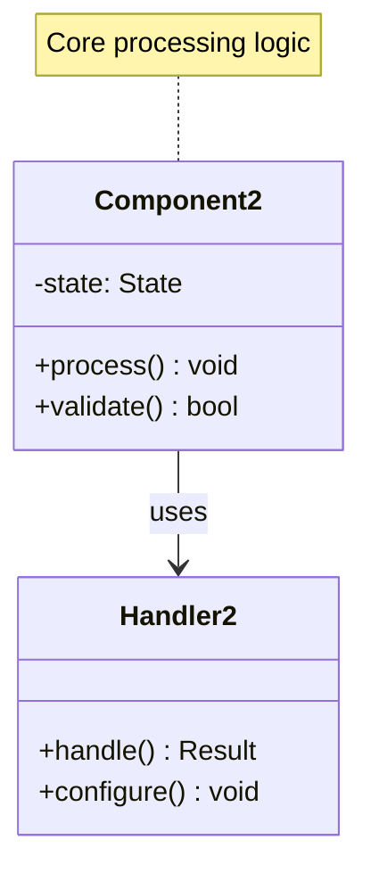

# Write-Ahead Log (WAL)

!!! info "🥈 Silver Tier Pattern"
    **Database Durability Specialist** • Essential for storage system builders
    
    WAL is fundamental to database durability but requires deep understanding of storage internals. Critical for database builders, valuable for understanding transaction processing.
    
    **Best For:** Database/storage engine development, understanding ACID properties, debugging database performance

## Essential Question

**How can we guarantee durability and enable crash recovery without sacrificing performance?**

## When to Use / When NOT to Use

### ✅ Use When

| Scenario | Example | Impact |
|----------|---------|--------|
| Building databases | Custom storage engines | ACID compliance and crash recovery |
| Transaction processing | Financial systems | Zero data loss after commit |
| State machine replication | Distributed consensus | Consistent state recovery |
| Critical data durability | System-of-record applications | Business continuity guarantees |

### ❌ DON'T Use When

| Scenario | Why | Alternative |
|----------|-----|-------------|
| Read-only systems | No writes to recover | Simple file storage |
| Ephemeral data | Loss acceptable | In-memory structures |
| Application-level development | Database handles WAL | Use existing database |
| Performance over durability | Can't afford 2x write cost | Async replication |

## Level 1: Intuition (5 min) {#intuition}

### The Story
Imagine writing a check. You first write the intent in your check register (the log), then hand over the actual check (apply the change). If something goes wrong, you can reconstruct what happened from your register. WAL works the same way for databases.

### Visual Metaphor

📄 View mermaid code (8 lines)

### Core Insight
> **Key Takeaway:** Always record intentions before executing them - durability through sequential logging with deferred application.

### In One Sentence
Write-ahead logging ensures durability by writing intended changes to a sequential log before applying them to data, enabling crash recovery and transaction rollback.

## Level 2: Foundation (10 min) {#foundation}

### The Problem Space

<h4>🚨 What Happens Without This Pattern</h4>

**Banking System X, 2019**: Direct in-place updates caused data corruption during power outage, losing 2 hours of transaction history and requiring manual reconciliation.

**Impact**: $500K reconciliation costs, 6-hour system downtime, regulatory violations

### How It Works

#### Architecture Overview
#### Key Components

| Component | Purpose | Responsibility |
|-----------|---------|----------------|
| **Log Manager** | Manage WAL operations | Append records, flush to disk |
| **Recovery Manager** | Handle crash recovery | Replay committed, undo uncommitted |
| **Checkpoint Manager** | Create recovery points | Reduce recovery time |
| **Buffer Manager** | Coordinate with WAL | Ensure log-before-data ordering |

### Basic Example

📄 View implementation code

class SimpleWAL:
    def __init__(self):
        self.log_sequence_number = 0
        self.log_file = open('wal.log', 'ab')
        self.uncommitted_txns = {}
    
    def write_log_record(self, txn_id, operation, data):
        record = {
            'lsn': self.next_lsn(),
            'txn_id': txn_id,
            'operation': operation,
            'data': data,
            'timestamp': time.time()
        }
        
        # Write to log and force to disk
        self.log_file.write(json.dumps(record).encode() + b'\n')
        self.log_file.flush()
        os.fsync(self.log_file.fileno())
        
        return record['lsn']
    
    def commit_transaction(self, txn_id):
        # Write commit record
        commit_lsn = self.write_log_record(txn_id, 'COMMIT', {})
        # Transaction is now durable
        return commit_lsn

## Level 3: Deep Dive (15 min) {#deep-dive}

### Implementation Details

#### State Management
#### Critical Design Decisions

| Decision | Options | Trade-off | Recommendation |
|----------|---------|-----------|----------------|
| **Group Commit** | Individual vs Batched | Individual: Low latency Batched: High throughput | Adaptive based on load |
| **Log Format** | Binary vs Text | Binary: Compact, fast Text: Debuggable, portable | Binary for production |
| **Checkpoint Strategy** | Sharp vs Fuzzy | Sharp: Simple, blocks writes Fuzzy: Complex, non-blocking | Fuzzy for high availability |

### Common Pitfalls

<h4>⚠️ Avoid These Mistakes</h4>

1. **Torn page writes**: Power failure during page write → Use checksums and full-page writes
2. **Log before data violation**: Applying changes before logging → Strictly enforce WAL protocol
3. **Unbounded log growth**: Never cleaning old logs → Implement checkpoint-based log recycling

### Production Considerations

#### Performance Characteristics

| Metric | Typical Range | Optimization Target |
|--------|---------------|-------------------|
| Single Commit Latency | 5-10ms | Minimize fsync() overhead |
| Group Commit Throughput | 10K-50K ops/sec | Maximize batch efficiency |
| Recovery Time | 1-10 min/GB | Optimize checkpoint frequency |
| Write Amplification | 2x-5x | Balance durability vs efficiency |

## Level 4: Expert (20 min) {#expert}

### Advanced Techniques

#### Optimization Strategies

1. **Parallel WAL Streams**
   - When to apply: High-concurrency workloads with independent transactions
   - Impact: 3-5x write throughput improvement
   - Trade-off: Complex recovery coordination across streams

2. **Compression and Deduplication**
   - When to apply: Repetitive update patterns or large log volumes
   - Impact: 50-80% storage reduction
   - Trade-off: CPU overhead for compression/decompression

### Scaling Considerations

### Monitoring & Observability

#### Key Metrics to Track

| Metric | Alert Threshold | Dashboard Panel |
|--------|----------------|-----------------|
| **WAL Write Latency** | p99 > 50ms | Histogram showing fsync performance |
| **Log Size Growth** | >10GB/hour unexpected | Trend analysis with growth rate |
| **Recovery Time** | >30 seconds | Historical recovery duration |
| **Checkpoint Lag** | >100MB behind | Distance from last checkpoint |

## Level 5: Mastery (30 min) {#mastery}

### Real-World Case Studies

#### Case Study 1: PostgreSQL WAL Evolution

<h4>💡 Production Insights from PostgreSQL</h4>

**Challenge**: Scale WAL performance for high-concurrency OLTP workloads

**Implementation**: Group commit, parallel WAL writers, and streaming replication

**Results**: 
- **Throughput**: 100K+ commits/sec with group commit
- **Recovery**: Point-in-time recovery to any second
- **Replication**: Real-time streaming to standby servers

**Lessons Learned**: Group commit is essential for high throughput; full-page writes prevent corruption but increase log size

### Pattern Evolution

#### Migration from Legacy

📄 View mermaid code (7 lines)

#### Future Directions

| Trend | Impact on Pattern | Adaptation Strategy |
|-------|------------------|-------------------|
| **NVMe Storage** | Faster persistent storage | Reduce group commit batch sizes |
| **Persistent Memory** | Near-memory durability | Simplify WAL protocol |
| **Cloud Storage** | Object store integration | Adapt for eventual consistency |

### Pattern Combinations

#### Works Well With

| Pattern | Combination Benefit | Integration Point |
|---------|-------------------|------------------|
| **LSM Trees** | Efficient storage structure | WAL serves as L0 level |
| **Two-Phase Commit** | Distributed transactions | WAL records for prepare/commit |
| **Event Sourcing** | Similar append-only concept | Events as specialized log records |

## Quick Reference

### Decision Matrix

### Comparison with Alternatives

| Aspect | WAL | Synchronous Writes | Async Replication | Snapshots |
|--------|-----|-------------------|------------------|-----------|
| **Durability** | Excellent | Good | Poor | Good |
| **Performance** | Good | Poor | Excellent | Fair |
| **Recovery Time** | Fast | Instant | Varies | Slow |
| **Complexity** | High | Low | Medium | Medium |
| **Use Case** | ACID systems | Simple apps | High performance | Backups |

### Implementation Checklist

**Pre-Implementation**
- [ ] Defined log record format with checksums
- [ ] Planned storage layout and rotation strategy
- [ ] Designed recovery procedures (analysis, redo, undo)
- [ ] Determined checkpoint frequency and strategy

**Implementation**
- [ ] Built atomic log append with fsync
- [ ] Implemented group commit optimization
- [ ] Added log recycling and archival
- [ ] Created comprehensive recovery logic

**Post-Implementation**
- [ ] Tested all failure scenarios thoroughly
- [ ] Monitored WAL performance and growth
- [ ] Documented operational procedures
- [ ] Trained team on WAL troubleshooting

### Related Resources

- :material-book-open-variant:{ .lg .middle } **Related Patterns**
    
    ---
    
    - [LSM Trees](../data-management/lsm-tree.md) - Complementary storage structure
    - [Event Sourcing](../data-management/event-sourcing.md) - Similar append-only approach
    - [Two-Phase Commit](../coordination/two-phase-commit.md) - Distributed durability

- :material-flask:{ .lg .middle } **Fundamental Laws**
    
    ---
    
    - [Law 1: Correlated Failure](../../part1-axioms/law1-failure/) - System crash scenarios
    - [Law 4: Multi-dimensional Optimization](../../part1-axioms/law4-optimization/) - Durability vs performance

- :material-pillar:{ .lg .middle } **Foundational Pillars**
    
    ---
    
    - [State Distribution](../../part2-pillars/state/) - Durable state management
    - [Truth Distribution](../../part2-pillars/truth/) - Consistent transaction ordering

- :material-tools:{ .lg .middle } **Implementation Guides**
    
    ---
    
    - [WAL Implementation Guide](../../excellence/guides/wal-implementation.md)
    - [Recovery Testing](../../excellence/guides/recovery-testing.md)
    - [Storage Optimization](../../excellence/guides/storage-optimization.md)

