# Pattern Decision Matrix

**Essential Question**: *How do I choose the optimal patterns for my distributed system based on latency requirements, consistency needs, scale, and fault tolerance requirements?*

> **What You'll Master**: A systematic approach to pattern selection based on quantified requirements, avoiding over-engineering while ensuring you meet your actual needs.

## The Complete Decision Framework

Choosing the right patterns is like designing a building - you need to understand the load requirements, environmental conditions, budget constraints, and intended use before selecting materials and structural approaches. This matrix provides a quantified, systematic approach to pattern selection based on four critical dimensions: **latency requirements** (how fast must responses be), **consistency needs** (how coordinated must your data be), **scale demands** (how many users/requests/data), and **fault tolerance** requirements (how much downtime can you accept). Each dimension has measurable thresholds that guide you toward appropriate patterns, preventing both under-engineering (system fails to meet requirements) and over-engineering (unnecessary complexity and cost).

```mermaid
graph TD
    Requirements[System Requirements] --> Latency{Latency Needs?}
    Requirements --> Consistency{Consistency Needs?}
    Requirements --> Scale{Scale Demands?}
    Requirements --> Fault{Fault Tolerance?}
    
    Latency -->|< 1ms| RealTime[Real-Time Patterns]
    Latency -->|< 100ms| LowLatency[Low-Latency Patterns]
    Latency -->|< 1s| Standard[Standard Patterns]
    Latency -->|> 1s| Batch[Batch/Async Patterns]
    
    Consistency -->|Strong| StrongC[ACID/2PC Patterns]
    Consistency -->|Eventual| EventualC[BASE Patterns]
    Consistency -->|Session| SessionC[Session Consistency]
    Consistency -->|None| NoC[Best Effort]
    
    Scale -->|< 1K users| Simple[Simple Patterns]
    Scale -->|< 100K users| Medium[Medium Scale]
    Scale -->|< 10M users| Large[Large Scale]
    Scale -->|> 10M users| Massive[Massive Scale]
    
    Fault -->|99.9%| Basic[Basic Resilience]
    Fault -->|99.99%| High[High Availability]
    Fault -->|99.999%| Critical[Mission Critical]
    
    RealTime --> PatternSet1[HFT/Gaming Patterns]
    LowLatency --> PatternSet2[Web/API Patterns]
    Standard --> PatternSet3[Standard Service Patterns]
    Batch --> PatternSet4[Data Pipeline Patterns]
    
    StrongC --> PatternSet5[Banking/Finance Patterns]
    EventualC --> PatternSet6[Social/Content Patterns]
    SessionC --> PatternSet7[User Experience Patterns]
    
    Simple --> PatternSet8[Monolith/Simple Service]
    Medium --> PatternSet9[Microservices]
    Large --> PatternSet10[Distributed Systems]
    Massive --> PatternSet11[Global Scale Systems]
```



## 🎯 Quick Scenario Decision Tree

### Step 1: Primary Constraint Assessment

**Answer these questions to identify your primary constraint:**

| Question | Score | Interpretation |
|----------|-------|----------------|
| **Latency**: What's your P99 latency requirement? | < 1ms = 4, < 10ms = 3, < 100ms = 2, < 1s = 1, > 1s = 0 | Higher scores require real-time patterns |
| **Consistency**: How critical is data consistency? | ACID required = 4, Strong = 3, Session = 2, Eventual = 1, None = 0 | Higher scores require coordination patterns |
| **Scale**: Peak requests per second? | > 1M = 4, > 100K = 3, > 10K = 2, > 1K = 1, < 1K = 0 | Higher scores require scaling patterns |
| **Availability**: Acceptable downtime per year? | < 5 min = 4, < 1 hour = 3, < 8 hours = 2, < 1 day = 1, > 1 day = 0 | Higher scores require resilience patterns |

**Your Primary Focus**: Highest scoring dimension determines your primary pattern category.

### Step 2: Pattern Selection Matrix

## 🚀 Latency-First Pattern Selection

### Ultra-Low Latency (< 1ms P99)
**Use Cases**: High-frequency trading, real-time gaming, autonomous systems

| Pattern | Why It Works | Implementation Complexity | Operating Cost |
|---------|--------------|--------------------------|----------------|
| **[Memory-Mapped Files](../data-management/memory-mapped.md)** | Zero-copy data access | 🟡 Medium | 🟢 Low |
| **[Lock-Free Data Structures](../coordination/lock-free.md)** | Eliminates contention | 🔴 High | 🟢 Low |
| **[CPU Affinity + NUMA](../scaling/cpu-affinity.md)** | Predictable memory access | 🔴 High | 🟡 Medium |
| **[Bypass Kernel Networking](../communication/kernel-bypass.md)** | Direct hardware access | 🔴 Very High | 🔴 High |

**Anti-Patterns**: Any network calls, garbage collection, dynamic allocation

### Low Latency (< 100ms P99)
**Use Cases**: Web applications, APIs, real-time dashboards

| Pattern | Why It Works | Implementation Complexity | Operating Cost |
|---------|--------------|--------------------------|----------------|
| **[CDN + Edge Computing](../scaling/edge-computing.md)** | Geographically distributed | 🟢 Low | 🟡 Medium |
| **[Redis Caching](../scaling/cache-aside-gold.md)** | In-memory data access | 🟢 Low | 🟡 Medium |
| **[Circuit Breaker](../resilience/circuit-breaker.md)** | Fail fast on errors | 🟡 Medium | 🟢 Low |
| **[Connection Pooling](../communication/connection-pool.md)** | Reuse expensive connections | 🟢 Low | 🟢 Low |

**Scoring System**: 
- ✅ **Must Have** (Score 4): Solves your primary constraint
- 🔶 **Should Have** (Score 3): Significantly improves performance  
- 🔸 **Could Have** (Score 2): Minor improvement
- ❌ **Won't Have** (Score 1): Unnecessary complexity

## 🔄 Consistency-First Pattern Selection

### Strong Consistency Required
**Use Cases**: Banking, financial systems, inventory management

| Pattern | CAP Trade-off | Data Loss Risk | Implementation Effort |
|---------|---------------|----------------|---------------------|
| **[Two-Phase Commit](../coordination/two-phase-commit.md)** | Chooses Consistency over Availability | 🟢 None | 🔴 High |
| **[Saga Pattern](../data-management/saga.md)** | Eventual consistency with compensation | 🟡 Temporary | 🟡 Medium |
| **[Event Sourcing](../data-management/event-sourcing.md)** | Single source of truth | 🟢 None | 🔴 High |
| **[Database per Service + Distributed Transactions](../data-management/database-per-service.md)** | Service isolation with consistency | 🟡 Possible | 🔴 Very High |

### Eventual Consistency Acceptable
**Use Cases**: Social media, content systems, analytics

| Pattern | Convergence Time | Conflict Resolution | Complexity |
|---------|------------------|-------------------|------------|
| **[CQRS](../data-management/cqrs.md)** | Minutes | Last-writer-wins | 🟡 Medium |
| **[Event Streaming](../architecture/event-streaming.md)** | Seconds | Event ordering | 🟡 Medium |
| **[CRDT](../data-management/crdt.md)** | Immediate | Mathematically guaranteed | 🔴 High |
| **[Gossip Protocol](../communication/gossip.md)** | Variable | Configuration-based | 🟡 Medium |

## 📈 Scale-First Pattern Selection

### Massive Scale (> 10M users)
**Use Cases**: Global social platforms, search engines, video streaming

| Pattern | Scaling Dimension | Bottleneck Addressed | Operational Complexity |
|---------|------------------|---------------------|----------------------|
| **[Consistent Hashing](../data-management/consistent-hashing.md)** | Horizontal data | Hot partitions | 🟡 Medium |
| **[Microservices](../architecture/microservices-decomposition-mastery.md)** | Team/Service scaling | Monolith limitations | 🔴 High |
| **[Event-Driven Architecture](../architecture/event-driven.md)** | Async processing | Synchronous bottlenecks | 🔴 High |
| **[Multi-Region Deployment](../scaling/multi-region.md)** | Geographic scaling | Single region limits | 🔴 Very High |

### Medium Scale (1K-100K users)
**Use Cases**: SaaS products, enterprise applications, startups

| Pattern | When to Implement | Scaling Bottleneck | Migration Complexity |
|---------|------------------|-------------------|---------------------|
| **[Auto Scaling](../scaling/auto-scaling.md)** | Traffic is variable | Resource utilization | 🟢 Low |
| **[Load Balancing](../scaling/load-balancing.md)** | > 1 server | Single server capacity | 🟢 Low |
| **[Database Read Replicas](../data-management/read-replica.md)** | Read/Write ratio > 3:1 | Database CPU/IO | 🟡 Medium |
| **[API Gateway](../communication/api-gateway.md)** | > 5 services | Service coordination | 🟡 Medium |

## 🛡️ Fault Tolerance Pattern Selection

### Mission Critical (99.999% uptime)
**Use Cases**: Payment processing, emergency systems, critical infrastructure

| Pattern | Failure Type Addressed | Recovery Time | Cost Multiplier |
|---------|----------------------|---------------|----------------|
| **[Multi-Region Active-Active](../scaling/multi-region.md)** | Regional outages | < 1 minute | 3-5x |
| **[Chaos Engineering](../resilience/chaos-engineering-mastery.md)** | Unknown failure modes | Preventive | 2x |
| **[Bulkhead Pattern](../resilience/bulkhead-gold.md)** | Resource exhaustion | Immediate | 1.5x |
| **[Health Checks + Auto-Recovery](../resilience/health-check.md)** | Service failures | < 30 seconds | 1.2x |

### High Availability (99.9% uptime)
**Use Cases**: Web applications, APIs, non-critical services

| Pattern | Failure Scenario | Implementation Time | Maintenance Overhead |
|---------|------------------|-------------------|-------------------|
| **[Circuit Breaker](../resilience/circuit-breaker.md)** | Downstream failures | 1-2 days | 🟢 Low |
| **[Retry with Backoff](../resilience/retry-backoff-gold.md)** | Transient failures | < 1 day | 🟢 Low |
| **[Graceful Degradation](../resilience/graceful-degradation.md)** | Partial system failure | 3-5 days | 🟡 Medium |
| **[Load Shedding](../resilience/load-shedding-gold.md)** | Traffic spikes | 2-3 days | 🟡 Medium |

## 🎯 Comprehensive Decision Scenarios

### Scenario 1: E-commerce Platform
**Requirements**: 100K concurrent users, eventual consistency OK, 99.9% uptime, < 200ms latency

```yaml
Primary Patterns:
  scaling:
    - Load Balancing (Score: 4) - Handle traffic distribution
    - Auto Scaling (Score: 4) - Variable traffic patterns
    - CDN (Score: 3) - Global user base
  
  resilience:
    - Circuit Breaker (Score: 4) - Payment service failures
    - Health Checks (Score: 3) - Service monitoring
  
  data:
    - CQRS (Score: 3) - Read/write optimization
    - Event Sourcing (Score: 2) - Audit requirements

Implementation Order: Load Balancing → Circuit Breaker → Auto Scaling → CDN → CQRS
```

### Scenario 2: Real-Time Gaming System
**Requirements**: < 10ms latency, 1M concurrent players, 99.99% uptime

```yaml
Primary Patterns:
  performance:
    - Edge Computing (Score: 4) - Geographic distribution
    - Memory Caching (Score: 4) - Sub-10ms responses
    - Connection Pooling (Score: 3) - Persistent connections
  
  coordination:
    - Leader Election (Score: 4) - Game state authority
    - State Synchronization (Score: 4) - Player coordination
  
  scaling:
    - Sharding (Score: 3) - Player distribution
    - Load Balancing (Score: 3) - Server distribution

Implementation Order: Memory Caching → Edge Computing → Leader Election → Sharding
```

### Scenario 3: Financial Trading Platform
**Requirements**: Strong consistency, < 1ms latency, 99.999% uptime

```yaml
Primary Patterns:
  performance:
    - Lock-Free Structures (Score: 4) - Ultra-low latency
    - Memory-Mapped Files (Score: 4) - Zero-copy access
    - CPU Affinity (Score: 3) - Predictable performance
  
  consistency:
    - Event Sourcing (Score: 4) - Audit trail
    - Two-Phase Commit (Score: 3) - Transaction integrity
  
  resilience:
    - Multi-Region Active-Active (Score: 4) - Zero downtime
    - Chaos Engineering (Score: 3) - Unknown failure modes

Implementation Order: Event Sourcing → Lock-Free Structures → Multi-Region → CPU Affinity
```

## 📊 Pattern Scoring Framework

### Requirements Mapping Matrix

| Requirement Category | Weight | Measurement Method | Pattern Score Impact |
|---------------------|--------|-------------------|---------------------|
| **Latency** | 0.3 | P99 response time | 4 = Directly addresses, 3 = Significantly improves, 2 = Minor improvement, 1 = No impact |
| **Consistency** | 0.25 | Data guarantee level | 4 = Provides required guarantee, 3 = Close approximation, 2 = Partial solution, 1 = Not relevant |
| **Scale** | 0.25 | Users/RPS capacity | 4 = Removes bottleneck, 3 = Significant improvement, 2 = Moderate improvement, 1 = Minimal impact |
| **Availability** | 0.2 | Uptime percentage | 4 = Directly improves SLA, 3 = Reduces failure impact, 2 = Minor resilience, 1 = Not applicable |

### Implementation Cost Matrix

| Pattern Complexity | Development Time | Operational Overhead | Learning Curve | Total Cost Score |
|-------------------|------------------|---------------------|---------------|------------------|
| **🟢 Simple** | < 1 week | Low | < 1 month | 1 |
| **🟡 Medium** | 1-4 weeks | Medium | 1-3 months | 2 |
| **🔴 Complex** | 1-3 months | High | 3-6 months | 3 |
| **🔴 Very Complex** | > 3 months | Very High | > 6 months | 4 |

### Pattern ROI Calculation

```
Pattern ROI = (Requirement Score × Requirement Weight) / Implementation Cost Score

Priority = High (ROI > 3), Medium (ROI 1-3), Low (ROI < 1)
```

## 🔄 Migration and Evolution Patterns

### Monolith to Microservices Evolution

| Stage | Primary Patterns | Duration | Risk Level |
|-------|-----------------|----------|------------|
| **Stage 1: Preparation** | API Gateway, Health Checks | 2-4 weeks | 🟢 Low |
| **Stage 2: Extract Services** | Strangler Fig, Database per Service | 2-6 months | 🟡 Medium |
| **Stage 3: Scale Services** | Load Balancing, Auto Scaling | 1-3 months | 🟡 Medium |
| **Stage 4: Optimize** | Circuit Breaker, CQRS | 2-4 months | 🔴 High |

### Technology Migration Patterns

| From → To | Recommended Patterns | Risk Mitigation | Timeline |
|-----------|---------------------|-----------------|----------|
| **SQL → NoSQL** | Dual Write, CQRS, Event Sourcing | Feature flags, rollback plan | 6-12 months |
| **Sync → Async** | Message Queue, Event-Driven | Circuit breaker, bulkhead | 3-6 months |
| **Single Region → Multi-Region** | Data replication, DNS failover | Active-passive first | 6-18 months |

## 🎯 Anti-Pattern Warnings

### Common Over-Engineering Traps

| Anti-Pattern | Warning Signs | When to Avoid | Simpler Alternative |
|-------------|---------------|---------------|-------------------|
| **Premature Microservices** | < 10 developers, < 100K users | Team too small | Modular monolith |
| **Complex Event Sourcing** | Simple CRUD operations | No audit requirements | Traditional database |
| **Multi-Region from Day 1** | Single geography users | No regulatory requirements | Single region + backups |
| **Kafka for Everything** | < 1000 msgs/sec | Low throughput | Simple message queue |

### Decision Validation Checklist

Before implementing any pattern, verify:

- [ ] **Requirement Validated**: Is this requirement real or assumed?
- [ ] **Measurement Planned**: How will you measure success?
- [ ] **Simpler Alternative Considered**: What's the simplest solution that could work?
- [ ] **Team Capability Assessed**: Does your team have the skills?
- [ ] **Operational Readiness**: Can you monitor and maintain this?
- [ ] **Exit Strategy Planned**: How do you roll back if needed?

## 🚀 Quick Decision Tools

### 2-Minute Pattern Selection

1. **What's your biggest pain point RIGHT NOW?**
   - Slow responses → Caching + CDN
   - Service failures → Circuit Breaker + Health Checks  
   - Can't handle traffic → Load Balancer + Auto Scaling
   - Data inconsistency → Event Sourcing + CQRS

2. **What's your scale?**
   - < 1K users: Keep it simple, focus on features
   - 1K-100K: Standard web patterns (LB, cache, DB replicas)
   - 100K-10M: Microservices + distributed patterns
   - > 10M: Everything + custom solutions

3. **What's your team size?**
   - 1-3 devs: Avoid distributed patterns
   - 4-10 devs: Moderate complexity OK
   - > 10 devs: Full distributed architecture

### Emergency Decision Matrix

When you need to choose patterns under pressure:

| Situation | Immediate Pattern | Why | Implementation Time |
|-----------|------------------|-----|-------------------|
| **Site is down** | Circuit Breaker + Health Checks | Stop cascade failures | 2-4 hours |
| **Database overloaded** | Read Replicas + Caching | Distribute load | 4-8 hours |
| **Services can't communicate** | API Gateway + Service Discovery | Central coordination | 1-2 days |
| **Users complaining about speed** | CDN + Edge Caching | Reduce latency | 2-4 hours |

## 📈 Success Metrics

### Pattern Implementation Success Criteria

| Pattern Category | Success Metrics | Measurement Method | Target Improvement |
|-----------------|-----------------|-------------------|-------------------|
| **Performance** | P99 latency reduction | APM tools | > 50% improvement |
| **Resilience** | MTTR reduction | Incident tracking | > 75% reduction |
| **Scale** | Throughput increase | Load testing | > 3x capacity |
| **Consistency** | Data conflict reduction | Application logs | > 90% reduction |

### Business Impact Validation

- **Revenue Impact**: Measure business metrics before/after
- **User Experience**: Track user satisfaction scores
- **Operational Efficiency**: Monitor team velocity and incident rates
- **Cost Optimization**: Calculate TCO changes

---

## 🎯 Next Steps

1. **Assess Your Requirements** using the scoring matrix above
2. **Calculate Pattern ROI** for your top candidates  
3. **Start with Highest ROI** patterns that address your primary constraint
4. **Implement Incrementally** following the migration guides
5. **Measure Success** using the metrics framework

**Remember**: The best pattern is the simplest one that meets your actual requirements. Avoid the temptation to over-engineer - start simple and evolve based on real needs.

---

*Ready to implement? Check our [Pattern Implementation Roadmap](pattern-implementation-roadmap.md) for step-by-step guidance.*