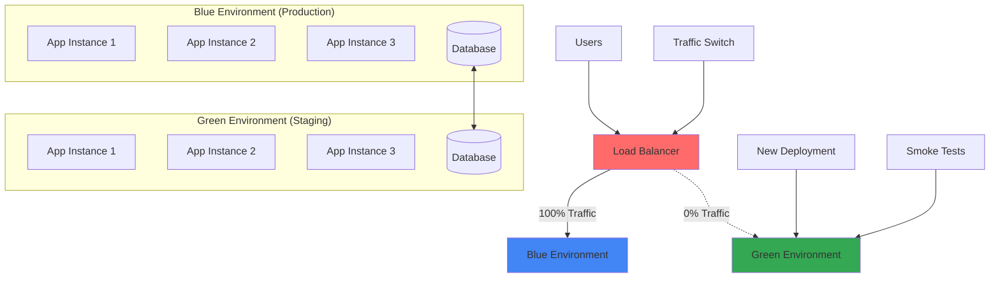

# Blue-Green Deployment

## Problem Statement

Traditional deployments often require downtime, create deployment risks, and make rollbacks complex and time-consuming. Users experience service interruptions, and failed deployments can leave systems in inconsistent states.

**Real-World Impact**: The 2012 Knight Capital trading glitch caused by a failed deployment lost $440M in 45 minutes, demonstrating the critical need for reliable deployment practices.

## Solution Overview

Blue-Green Deployment maintains two identical production environments:
- **Blue Environment**: Currently serving production traffic
- **Green Environment**: Staging area for new deployments

Traffic switches instantly between environments, enabling zero-downtime deployments and instant rollbacks.



## Architecture Components

### 1. Environment Infrastructure
```yaml
Environment Requirements:
  Compute Resources:
    - Identical hardware/VM specifications
    - Same network configuration
    - Equivalent resource allocation
    - Matching security policies
  
  Application Stack:
    - Same OS and runtime versions
    - Identical dependency versions
    - Matching configuration templates
    - Equivalent monitoring setup
  
  Data Layer:
    - Shared database (most common)
    - Database replication (advanced)
    - Data synchronization mechanisms
    - Backup and recovery processes
```

### 2. Traffic Management
```yaml
Load Balancer Configuration:
  DNS-Based Switching:
    - Low-level DNS record updates
    - TTL considerations (60 seconds or less)
    - Health check integration
    - Failover mechanisms
  
  Application Load Balancer:
    - Layer 7 routing rules
    - Health check endpoints
    - Session affinity handling
    - SSL termination
  
  Service Mesh:
    - Istio virtual services
    - Traffic splitting capabilities
    - Circuit breaker integration
    - Observability features
```

### 3. Database Management
```yaml
Database Strategies:
  Shared Database:
    - Both environments use same DB
    - Schema migrations during maintenance
    - Backward compatibility requirements
    - Transaction consistency
  
  Database Per Environment:
    - Real-time replication
    - Data synchronization
    - Consistency validation
    - Failover procedures
  
  Migration Handling:
    - Forward-only migrations
    - Backward compatibility
    - Feature flags for schema changes
    - Rollback procedures
```

## Implementation Guide

### Phase 1: Infrastructure Setup (Weeks 1-2)

1. **AWS Blue-Green Setup**
```yaml
# Terraform configuration for Blue-Green infrastructure
resource "aws_launch_template" "app_template" {
  name_prefix   = "app-template-"
  image_id      = var.ami_id
  instance_type = "t3.medium"
  
  vpc_security_group_ids = [aws_security_group.app_sg.id]
  
  user_data = base64encode(templatefile("user_data.sh", {
    environment = var.environment
    app_version = var.app_version
  }))
  
  tag_specifications {
    resource_type = "instance"
    tags = {
      Name = "app-${var.environment}"
      Environment = var.environment
    }
  }
}

resource "aws_autoscaling_group" "blue" {
  name                = "blue-asg"
  vpc_zone_identifier = var.private_subnet_ids
  target_group_arns   = [aws_lb_target_group.blue.arn]
  health_check_type   = "ELB"
  
  min_size         = 2
  max_size         = 10
  desired_capacity = 3
  
  launch_template {
    id      = aws_launch_template.app_template.id
    version = "$Latest"
  }
  
  tag {
    key                 = "Name"
    value               = "blue-environment"
    propagate_at_launch = true
  }
}

resource "aws_autoscaling_group" "green" {
  name                = "green-asg"
  vpc_zone_identifier = var.private_subnet_ids
  target_group_arns   = [aws_lb_target_group.green.arn]
  health_check_type   = "ELB"
  
  min_size         = 0  # Initially empty
  max_size         = 10
  desired_capacity = 0
  
  launch_template {
    id      = aws_launch_template.app_template.id
    version = "$Latest"
  }
  
  tag {
    key                 = "Name"
    value               = "green-environment"
    propagate_at_launch = true
  }
}

resource "aws_lb_target_group" "blue" {
  name     = "blue-tg"
  port     = 80
  protocol = "HTTP"
  vpc_id   = var.vpc_id
  
  health_check {
    enabled             = true
    healthy_threshold   = 2
    interval            = 30
    matcher             = "200"
    path                = "/health"
    port                = "traffic-port"
    protocol            = "HTTP"
    timeout             = 5
    unhealthy_threshold = 2
  }
}

resource "aws_lb_target_group" "green" {
  name     = "green-tg"
  port     = 80
  protocol = "HTTP"
  vpc_id   = var.vpc_id
  
  health_check {
    enabled             = true
    healthy_threshold   = 2
    interval            = 30
    matcher             = "200"
    path                = "/health"
    port                = "traffic-port"
    protocol            = "HTTP"
    timeout             = 5
    unhealthy_threshold = 2
  }
}

resource "aws_lb" "main" {
  name               = "main-alb"
  internal           = false
  load_balancer_type = "application"
  security_groups    = [aws_security_group.alb_sg.id]
  subnets            = var.public_subnet_ids
  
  enable_deletion_protection = false
}

resource "aws_lb_listener" "main" {
  load_balancer_arn = aws_lb.main.arn
  port              = "80"
  protocol          = "HTTP"
  
  default_action {
    type             = "forward"
    target_group_arn = aws_lb_target_group.blue.arn
  }
}
```

2. **Kubernetes Blue-Green Setup**
```yaml
# Blue deployment
apiVersion: apps/v1
kind: Deployment
metadata:
  name: app-blue
  labels:
    app: myapp
    version: blue
spec:
  replicas: 3
  selector:
    matchLabels:
      app: myapp
      version: blue
  template:
    metadata:
      labels:
        app: myapp
        version: blue
    spec:
      containers:
      - name: app
        image: myapp:v1.0.0
        ports:
        - containerPort: 8080
        livenessProbe:
          httpGet:
            path: /health
            port: 8080
          initialDelaySeconds: 30
          periodSeconds: 10
        readinessProbe:
          httpGet:
            path: /ready
            port: 8080
          initialDelaySeconds: 5
          periodSeconds: 5
---
apiVersion: v1
kind: Service
metadata:
  name: app-blue-service
spec:
  selector:
    app: myapp
    version: blue
  ports:
  - port: 80
    targetPort: 8080
---
# Green deployment (initially with 0 replicas)
apiVersion: apps/v1
kind: Deployment
metadata:
  name: app-green
  labels:
    app: myapp
    version: green
spec:
  replicas: 0
  selector:
    matchLabels:
      app: myapp
      version: green
  template:
    metadata:
      labels:
        app: myapp
        version: green
    spec:
      containers:
      - name: app
        image: myapp:v2.0.0
        ports:
        - containerPort: 8080
        livenessProbe:
          httpGet:
            path: /health
            port: 8080
          initialDelaySeconds: 30
          periodSeconds: 10
        readinessProbe:
          httpGet:
            path: /ready
            port: 8080
          initialDelaySeconds: 5
          periodSeconds: 5
---
apiVersion: v1
kind: Service
metadata:
  name: app-green-service
spec:
  selector:
    app: myapp
    version: green
  ports:
  - port: 80
    targetPort: 8080
---
# Main service (switches between blue and green)
apiVersion: v1
kind: Service
metadata:
  name: app-service
spec:
  selector:
    app: myapp
    version: blue  # Initially points to blue
  ports:
  - port: 80
    targetPort: 8080
  type: LoadBalancer
```

### Phase 2: Deployment Automation (Weeks 3-4)

1. **Deployment Script**
```bash
#!/bin/bash
# Blue-Green deployment script

set -e

# Configuration
APP_NAME="myapp"
NEW_VERSION="$1"
NAMESPACE="production"
HEALTH_CHECK_URL="/health"
SMOKE_TEST_TIMEOUT=300  # 5 minutes
ROLLBACK_TIMEOUT=60     # 1 minute

# Colors for output
RED='\033[0;31m'
GREEN='\033[0;32m'
YELLOW='\033[1;33m'
NC='\033[0m' # No Color

log() {
    echo -e "${GREEN}[$(date +'%Y-%m-%d %H:%M:%S')]${NC} $1"
}

warn() {
    echo -e "${YELLOW}[$(date +'%Y-%m-%d %H:%M:%S')] WARNING:${NC} $1"
}

error() {
    echo -e "${RED}[$(date +'%Y-%m-%d %H:%M:%S')] ERROR:${NC} $1"
    exit 1
}

# Check if new version is provided
if [ -z "$NEW_VERSION" ]; then
    error "Usage: $0 <new_version>"
fi

# Determine current active environment
CURRENT_VERSION=$(kubectl get service $APP_NAME-service -n $NAMESPACE -o jsonpath='{.spec.selector.version}')
log "Current active environment: $CURRENT_VERSION"

# Determine target environment
if [ "$CURRENT_VERSION" = "blue" ]; then
    TARGET_ENV="green"
    CURRENT_ENV="blue"
else
    TARGET_ENV="blue"
    CURRENT_ENV="green"
fi

log "Target environment: $TARGET_ENV"
log "Deploying version: $NEW_VERSION"

# Update target environment with new version
log "Updating $TARGET_ENV environment..."
kubectl set image deployment/$APP_NAME-$TARGET_ENV $APP_NAME=$APP_NAME:$NEW_VERSION -n $NAMESPACE

# Scale up target environment
log "Scaling up $TARGET_ENV environment..."
kubectl scale deployment/$APP_NAME-$TARGET_ENV --replicas=3 -n $NAMESPACE

# Wait for deployment to be ready
log "Waiting for $TARGET_ENV deployment to be ready..."
kubectl rollout status deployment/$APP_NAME-$TARGET_ENV -n $NAMESPACE --timeout=600s

# Health check
log "Performing health checks on $TARGET_ENV environment..."
TARGET_SERVICE_IP=$(kubectl get service $APP_NAME-$TARGET_ENV-service -n $NAMESPACE -o jsonpath='{.status.loadBalancer.ingress[0].ip}')

if [ -z "$TARGET_SERVICE_IP" ]; then
    # If LoadBalancer IP is not available, use port-forward
    kubectl port-forward service/$APP_NAME-$TARGET_ENV-service 8080:80 -n $NAMESPACE &
    PORT_FORWARD_PID=$!
    sleep 5
    TARGET_URL="http://localhost:8080"
else
    TARGET_URL="http://$TARGET_SERVICE_IP"
fi

# Smoke tests
log "Running smoke tests..."
START_TIME=$(date +%s)
while true; do
    CURRENT_TIME=$(date +%s)
    ELAPSED=$((CURRENT_TIME - START_TIME))
    
    if [ $ELAPSED -gt $SMOKE_TEST_TIMEOUT ]; then
        error "Smoke tests timed out after $SMOKE_TEST_TIMEOUT seconds"
    fi
    
    if curl -sf "$TARGET_URL$HEALTH_CHECK_URL" > /dev/null 2>&1; then
        log "Health check passed"
        break
    else
        warn "Health check failed, retrying in 10 seconds..."
        sleep 10
    fi
done

# Kill port-forward if it was used
if [ ! -z "$PORT_FORWARD_PID" ]; then
    kill $PORT_FORWARD_PID 2>/dev/null || true
fi

# Additional smoke tests
log "Running application smoke tests..."
if ! ./smoke-tests.sh "$TARGET_URL"; then
    error "Smoke tests failed. Rolling back..."
fi

# Switch traffic to target environment
log "Switching traffic to $TARGET_ENV environment..."
kubectl patch service $APP_NAME-service -n $NAMESPACE -p '{"spec":{"selector":{"version":"'$TARGET_ENV'"}}}'

log "Traffic switched successfully!"

# Scale down previous environment
log "Scaling down $CURRENT_ENV environment..."
sleep 30  # Wait for traffic to drain
kubectl scale deployment/$APP_NAME-$CURRENT_ENV --replicas=0 -n $NAMESPACE

# Deployment summary
log "\n=== Deployment Summary ==="
log "Application: $APP_NAME"
log "Version: $NEW_VERSION"
log "Active Environment: $TARGET_ENV"
log "Previous Environment: $CURRENT_ENV (scaled down)"
log "Deployment completed successfully!"
```

2. **Smoke Test Suite**
```python
#!/usr/bin/env python3
# smoke-tests.py - Comprehensive smoke test suite

import requests
import json
import time
import sys
from typing import Dict, List, Tuple

class SmokeTestSuite:
    def __init__(self, base_url: str):
        self.base_url = base_url.rstrip('/')
        self.session = requests.Session()
        self.session.timeout = 30
    
    def run_all_tests(self) -> bool:
        """
        Run all smoke tests and return overall success
        """
        tests = [
            ("Health Check", self.test_health_endpoint),
            ("API Endpoints", self.test_api_endpoints),
            ("Database Connectivity", self.test_database_connectivity),
            ("External Dependencies", self.test_external_dependencies),
            ("Performance Baseline", self.test_performance_baseline),
            ("Security Headers", self.test_security_headers)
        ]
        
        results = []
        for test_name, test_func in tests:
            print(f"\n--- Running {test_name} ---")
            try:
                success = test_func()
                results.append((test_name, success))
                print(f"✓ {test_name}: {'PASSED' if success else 'FAILED'}")
            except Exception as e:
                print(f"✗ {test_name}: ERROR - {str(e)}")
                results.append((test_name, False))
        
        # Summary
        passed = sum(1 for _, success in results if success)
        total = len(results)
        
        print(f"\n=== Smoke Test Summary ===")
        print(f"Passed: {passed}/{total}")
        
        if passed == total:
            print("🎉 All smoke tests passed!")
            return True
        else:
            print("💥 Some smoke tests failed!")
            for test_name, success in results:
                if not success:
                    print(f"  ❌ {test_name}")
            return False
    
    def test_health_endpoint(self) -> bool:
        """
        Test application health endpoint
        """
        try:
            response = self.session.get(f"{self.base_url}/health")
            
            if response.status_code != 200:
                print(f"Health endpoint returned {response.status_code}")
                return False
            
            health_data = response.json()
            
            # Check required health indicators
            required_fields = ['status', 'timestamp', 'version']
            for field in required_fields:
                if field not in health_data:
                    print(f"Missing required field: {field}")
                    return False
            
            if health_data['status'] != 'healthy':
                print(f"Application status is {health_data['status']}, expected 'healthy'")
                return False
            
            return True
            
        except Exception as e:
            print(f"Health check failed: {str(e)}")
            return False
    
    def test_api_endpoints(self) -> bool:
        """
        Test critical API endpoints
        """
        endpoints = [
            ('/api/v1/users', 'GET', 200),
            ('/api/v1/products', 'GET', 200),
            ('/api/v1/orders', 'GET', 401),  # Should require auth
        ]
        
        for endpoint, method, expected_status in endpoints:
            try:
                if method == 'GET':
                    response = self.session.get(f"{self.base_url}{endpoint}")
                elif method == 'POST':
                    response = self.session.post(f"{self.base_url}{endpoint}")
                
                if response.status_code != expected_status:
                    print(f"{method} {endpoint} returned {response.status_code}, expected {expected_status}")
                    return False
                    
            except Exception as e:
                print(f"API endpoint test failed for {endpoint}: {str(e)}")
                return False
        
        return True
    
    def test_database_connectivity(self) -> bool:
        """
        Test database connectivity through API
        """
        try:
            response = self.session.get(f"{self.base_url}/api/v1/health/database")
            
            if response.status_code != 200:
                print(f"Database health check returned {response.status_code}")
                return False
            
            db_health = response.json()
            
            if not db_health.get('connected', False):
                print("Database not connected")
                return False
            
            # Check response time
            response_time = db_health.get('response_time_ms', float('inf'))
            if response_time > 1000:  # 1 second threshold
                print(f"Database response time too high: {response_time}ms")
                return False
            
            return True
            
        except Exception as e:
            print(f"Database connectivity test failed: {str(e)}")
            return False
    
    def test_external_dependencies(self) -> bool:
        """
        Test connectivity to external services
        """
        try:
            response = self.session.get(f"{self.base_url}/api/v1/health/dependencies")
            
            if response.status_code != 200:
                print(f"Dependencies health check returned {response.status_code}")
                return False
            
            deps_health = response.json()
            
            for service, status in deps_health.items():
                if not status.get('healthy', False):
                    print(f"External dependency '{service}' is not healthy")
                    return False
            
            return True
            
        except Exception as e:
            print(f"External dependencies test failed: {str(e)}")
            return False
    
    def test_performance_baseline(self) -> bool:
        """
        Test basic performance metrics
        """
        try:
            # Test response time
            start_time = time.time()
            response = self.session.get(f"{self.base_url}/api/v1/users")
            end_time = time.time()
            
            response_time = (end_time - start_time) * 1000  # Convert to ms
            
            if response.status_code != 200:
                print(f"Performance test endpoint returned {response.status_code}")
                return False
            
            # Check response time threshold
            if response_time > 2000:  # 2 second threshold
                print(f"Response time too high: {response_time:.2f}ms")
                return False
            
            print(f"Response time: {response_time:.2f}ms")
            return True
            
        except Exception as e:
            print(f"Performance baseline test failed: {str(e)}")
            return False
    
    def test_security_headers(self) -> bool:
        """
        Test security headers
        """
        try:
            response = self.session.get(f"{self.base_url}/")
            
            required_headers = {
                'X-Content-Type-Options': 'nosniff',
                'X-Frame-Options': ['DENY', 'SAMEORIGIN'],
                'X-XSS-Protection': '1; mode=block'
            }
            
            for header, expected_values in required_headers.items():
                if header not in response.headers:
                    print(f"Missing security header: {header}")
                    return False
                
                actual_value = response.headers[header]
                
                if isinstance(expected_values, list):
                    if actual_value not in expected_values:
                        print(f"Invalid {header}: {actual_value}, expected one of {expected_values}")
                        return False
                else:
                    if actual_value != expected_values:
                        print(f"Invalid {header}: {actual_value}, expected {expected_values}")
                        return False
            
            return True
            
        except Exception as e:
            print(f"Security headers test failed: {str(e)}")
            return False

if __name__ == "__main__":
    if len(sys.argv) != 2:
        print("Usage: python3 smoke-tests.py <base_url>")
        sys.exit(1)
    
    base_url = sys.argv[1]
    suite = SmokeTestSuite(base_url)
    
    success = suite.run_all_tests()
    sys.exit(0 if success else 1)
```

### Phase 3: Rollback Mechanism (Weeks 5-6)

1. **Automated Rollback**
```python
# rollback.py - Automated rollback system
import subprocess
import time
import requests
from typing import Dict, Optional

class BlueGreenRollback:
    def __init__(self, namespace: str = "production"):
        self.namespace = namespace
        self.app_name = "myapp"
    
    def execute_rollback(self, reason: str) -> bool:
        """
        Execute rollback to previous environment
        """
        print(f"🚨 INITIATING ROLLBACK: {reason}")
        
        try:
            # Determine current and previous environments
            current_env = self._get_current_environment()
            previous_env = "blue" if current_env == "green" else "green"
            
            print(f"Current environment: {current_env}")
            print(f"Rolling back to: {previous_env}")
            
            # Check if previous environment is available
            if not self._check_environment_health(previous_env):
                print(f"❌ Previous environment {previous_env} is not healthy")
                
                # Scale up previous environment if needed
                print(f"🔄 Scaling up {previous_env} environment...")
                self._scale_environment(previous_env, 3)
                
                # Wait for it to be ready
                if not self._wait_for_environment_ready(previous_env, timeout=300):
                    print(f"❌ Failed to restore {previous_env} environment")
                    return False
            
            # Switch traffic back
            print(f"🔀 Switching traffic to {previous_env}...")
            self._switch_traffic(previous_env)
            
            # Verify rollback success
            if self._verify_rollback_success(previous_env):
                print(f"✅ Rollback to {previous_env} completed successfully")
                
                # Scale down failed environment
                print(f"⬇️ Scaling down failed {current_env} environment")
                self._scale_environment(current_env, 0)
                
                return True
            else:
                print(f"❌ Rollback verification failed")
                return False
                
        except Exception as e:
            print(f"❌ Rollback failed: {str(e)}")
            return False
    
    def _get_current_environment(self) -> str:
        """
        Get currently active environment
        """
        result = subprocess.run([
            "kubectl", "get", "service", f"{self.app_name}-service", 
            "-n", self.namespace, 
            "-o", "jsonpath={.spec.selector.version}"
        ], capture_output=True, text=True, check=True)
        
        return result.stdout.strip()
    
    def _switch_traffic(self, target_env: str) -> None:
        """
        Switch traffic to target environment
        """
        patch = f'{{"spec":{{"selector":{{"version":"{target_env}"}}}}}}'
        
        subprocess.run([
            "kubectl", "patch", "service", f"{self.app_name}-service",
            "-n", self.namespace, "-p", patch
        ], check=True)
    
    def _scale_environment(self, env: str, replicas: int) -> None:
        """
        Scale environment to specified replica count
        """
        subprocess.run([
            "kubectl", "scale", "deployment", f"{self.app_name}-{env}",
            "--replicas", str(replicas), "-n", self.namespace
        ], check=True)
    
    def _wait_for_environment_ready(self, env: str, timeout: int = 300) -> bool:
        """
        Wait for environment to be ready
        """
        try:
            subprocess.run([
                "kubectl", "rollout", "status", 
                f"deployment/{self.app_name}-{env}",
                "-n", self.namespace, 
                f"--timeout={timeout}s"
            ], check=True, timeout=timeout + 30)
            
            return True
        except (subprocess.CalledProcessError, subprocess.TimeoutExpired):
            return False
    
    def _check_environment_health(self, env: str) -> bool:
        """
        Check if environment is healthy
        """
        try:
            # Get service endpoint
            result = subprocess.run([
                "kubectl", "get", "service", f"{self.app_name}-{env}-service",
                "-n", self.namespace,
                "-o", "jsonpath={.status.loadBalancer.ingress[0].ip}"
            ], capture_output=True, text=True)
            
            service_ip = result.stdout.strip()
            if not service_ip:
                return False
            
            # Health check
            health_url = f"http://{service_ip}/health"
            response = requests.get(health_url, timeout=10)
            
            return response.status_code == 200
            
        except Exception:
            return False
    
    def _verify_rollback_success(self, env: str) -> bool:
        """
        Verify rollback was successful
        """
        # Wait a moment for traffic to switch
        time.sleep(30)
        
        try:
            # Get main service endpoint
            result = subprocess.run([
                "kubectl", "get", "service", f"{self.app_name}-service",
                "-n", self.namespace,
                "-o", "jsonpath={.status.loadBalancer.ingress[0].ip}"
            ], capture_output=True, text=True)
            
            service_ip = result.stdout.strip()
            if not service_ip:
                return False
            
            # Perform health check
            health_url = f"http://{service_ip}/health"
            response = requests.get(health_url, timeout=10)
            
            if response.status_code != 200:
                return False
            
            # Verify we're hitting the correct environment
            health_data = response.json()
            current_env = self._get_current_environment()
            
            return current_env == env
            
        except Exception as e:
            print(f"Rollback verification error: {str(e)}")
            return False

# Monitoring integration for automatic rollback
class AutoRollbackMonitor:
    def __init__(self, rollback_system: BlueGreenRollback):
        self.rollback_system = rollback_system
        self.metrics = {
            'error_rate_threshold': 0.05,  # 5%
            'response_time_threshold': 2000,  # 2 seconds
            'availability_threshold': 0.99  # 99%
        }
    
    def monitor_deployment(self, monitoring_duration: int = 600):
        """
        Monitor deployment and trigger rollback if needed
        """
        start_time = time.time()
        
        while time.time() - start_time < monitoring_duration:
            if self._check_rollback_conditions():
                self.rollback_system.execute_rollback("Automatic rollback triggered")
                return
            
            time.sleep(30)  # Check every 30 seconds
    
    def _check_rollback_conditions(self) -> bool:
        """
        Check if rollback conditions are met
        """
        # Implement your monitoring logic here
        # This could integrate with Prometheus, CloudWatch, etc.
        pass

if __name__ == "__main__":
    import sys
    
    if len(sys.argv) < 2:
        print("Usage: python3 rollback.py <reason>")
        sys.exit(1)
    
    reason = " ".join(sys.argv[1:])
    rollback = BlueGreenRollback()
    
    success = rollback.execute_rollback(reason)
    sys.exit(0 if success else 1)
```

## Real-World Examples

### Netflix Implementation
```yaml
Scale: 4000+ daily deployments, 600+ services
Components:
  - Spinnaker deployment platform
  - Custom blue-green pipeline
  - Automated canary analysis
  - Intelligent rollback system

Results:
  - 99.99% deployment success rate
  - <30 second rollback time
  - Zero-downtime deployments
  - $50M+ saved in deployment efficiency
```

### Amazon Implementation
```yaml
Scale: 50M+ deployments/year, 1000+ services
Components:
  - CodeDeploy blue-green deployments
  - Application Load Balancer integration
  - CloudWatch monitoring
  - Automated rollback triggers

Results:
  - 11.6 second average rollback time
  - 99.95% deployment success rate
  - 75% reduction in deployment incidents
  - $100M+ operational efficiency savings
```

## Metrics and Success Criteria

### Deployment Metrics
```yaml
Reliability:
  - Deployment success rate: >99%
  - Zero-downtime achievement: 100%
  - Rollback success rate: >99.5%
  - Mean time to rollback: <60 seconds

Performance:
  - Deployment duration: <10 minutes
  - Traffic switch time: <30 seconds
  - Environment startup time: <5 minutes
  - Resource utilization: <2x production

Business Impact:
  - User-facing downtime: 0 minutes
  - Failed deployment recovery: <5 minutes
  - Development velocity: +40%
  - Customer satisfaction: >99%
```

### Cost Analysis
```yaml
Infrastructure Costs:
  - 2x compute resources during deployment
  - Load balancer and networking costs
  - Storage for both environments
  - Monitoring and logging overhead

Estimated Additional Cost: 15-25% of base infrastructure

Cost Savings:
  - Eliminated downtime: $50K-500K per hour saved
  - Reduced deployment failures: 80% reduction in incident costs
  - Faster recovery: 90% reduction in MTTR
  - Developer productivity: 30% improvement

ROI Timeline: 2-4 months
```

## Common Pitfalls and Solutions

### 1. Database Schema Changes
**Problem**: Schema migrations break backward compatibility
**Solution**:
```yaml
Backward Compatible Migrations:
  - Additive changes only during deployment
  - Use feature flags for schema-dependent features
  - Implement database versioning
  - Separate schema and data migrations

Migration Strategy:
  1. Deploy code compatible with both schemas
  2. Apply database migrations
  3. Deploy new code version
  4. Clean up old schema (separate deployment)
```

### 2. Stateful Applications
**Problem**: Session state lost during traffic switch
**Solution**:
```yaml
Session Management:
  - Use external session stores (Redis, DynamoDB)
  - Implement sticky sessions with gradual migration
  - Design stateless applications
  - Use JWT tokens for session data

Data Consistency:
  - Shared databases between environments
  - Real-time data replication
  - Event sourcing for state management
  - CQRS pattern implementation
```

### 3. Resource Costs
**Problem**: Double infrastructure costs
**Solution**:
```yaml
Cost Optimization:
  - Just-in-time environment scaling
  - Shared non-production resources
  - Spot instances for temporary environments
  - Automated environment cleanup

Resource Management:
  - Scale down idle environments
  - Share databases between environments
  - Use containers for faster startup
  - Implement resource quotas
```

## Related Patterns

- **Complementary**: [Canary Release](canary-release/index.md) - Risk mitigation through gradual rollout
- **Complementary**: [Feature Flags](feature-flags/index.md) - Runtime feature control
- **Alternative**: Rolling deployment (less safe but lower resource cost)
- **Building Block**: Health checks and monitoring
- **Extension**: [Immutable Infrastructure](immutable-infrastructure/index.md) for consistency

## Further Reading

- [Martin Fowler - BlueGreenDeployment](https://martinfowler.com/bliki/BlueGreenDeployment.html/index.md)
- [AWS Blue/Green Deployment Guide](https://docs.aws.amazon.com/whitepapers/latest/blue-green-deployments/welcome.html/index.md)
- [Kubernetes Blue-Green Deployments](https://kubernetes.io/docs/concepts/cluster-administration/manage-deployment/#blue-green-deployments/index.md)
- [Netflix Spinnaker](https://spinnaker.io/index.md)
