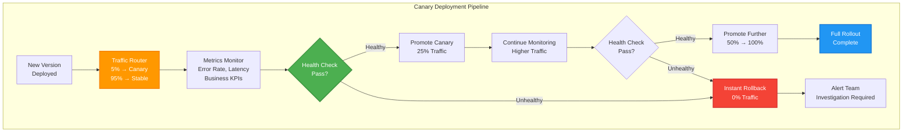
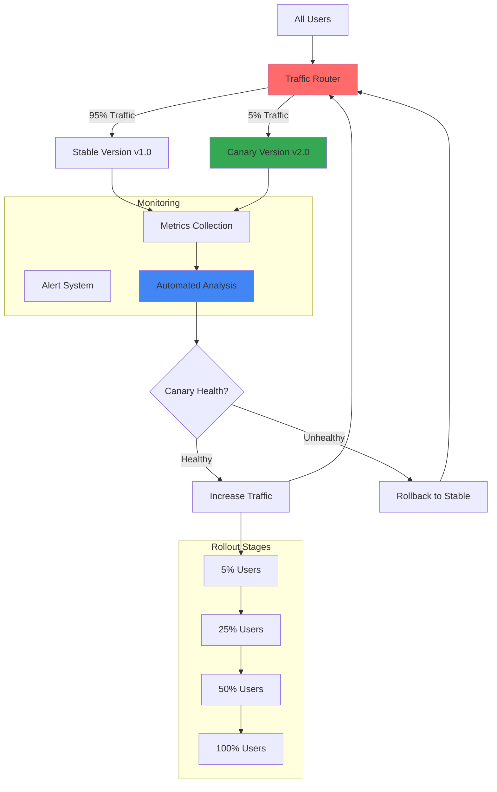

## The Complete Blueprint

Canary Release is the **risk mitigation deployment strategy** that transforms dangerous all-or-nothing deployments into controlled, gradual rollouts with automatic safety mechanisms. This pattern enables teams to **validate new software versions with real production traffic** while maintaining the ability to instantly rollback if issues are detected. By exposing new versions to progressively larger user segments and continuously monitoring key metrics, canary releases provide the confidence to deploy frequently while minimizing blast radius of potential failures.

<details>
<summary>📄 View Complete Canary Release Pipeline (20 lines)</summary>



</details>

This blueprint demonstrates **progressive traffic routing** with automated health checks, **real-time monitoring** of business and technical metrics, and **automated rollback mechanisms** that protect against deployment failures.

### What You'll Master

- **Traffic Routing Architecture**: Design sophisticated load balancing and service mesh configurations that enable precise traffic splitting and instant rollback capabilities
- **Automated Health Monitoring**: Build comprehensive monitoring systems that track error rates, latency percentiles, business metrics, and user experience indicators
- **Statistical Analysis**: Implement rigorous A/B testing methodologies with statistical significance testing to make data-driven promotion decisions
- **Rollback Automation**: Create fail-safe mechanisms that automatically detect anomalies and execute instant rollbacks without human intervention
- **Deployment Orchestration**: Orchestrate complex multi-stage rollouts with configurable promotion criteria, approval gates, and stakeholder notifications

# Canary Release

## Table of Contents

- [Problem Statement](#problem-statement)
- [Solution Overview](#solution-overview)
- [Architecture Components](#architecture-components)
  - [1. Traffic Routing](#1-traffic-routing)
  - [2. Monitoring and Analysis](#2-monitoring-and-analysis)
  - [3. Decision Engine](#3-decision-engine)
- [Implementation Guide](#implementation-guide)
  - [Phase 1: Infrastructure Setup (Weeks 1-2)](#phase-1-infrastructure-setup-weeks-1-2)
- [Istio VirtualService for canary deployment](#istio-virtualservice-for-canary-deployment)
- [Stable version deployment](#stable-version-deployment)
- [Canary version deployment](#canary-version-deployment)
  - [Phase 2: Canary Controller (Weeks 3-4)](#phase-2-canary-controller-weeks-3-4)
- [canary_controller.py - Automated canary deployment controller](#canary_controllerpy-automated-canary-deployment-controller)
- [Example usage](#example-usage)
  - [Phase 3: Advanced Analysis (Weeks 5-6)](#phase-3-advanced-analysis-weeks-5-6)
- [statistical_analysis.py - Statistical significance testing for canary releases](#statistical_analysispy-statistical-significance-testing-for-canary-releases)
- [Example integration with canary controller](#example-integration-with-canary-controller)
- [Real-World Examples](#real-world-examples)
  - [Google Implementation](#google-implementation)
  - [Facebook Implementation](#facebook-implementation)
- [Metrics and Success Criteria](#metrics-and-success-criteria)
  - [Deployment Metrics](#deployment-metrics)
  - [Cost Analysis](#cost-analysis)
- [Common Pitfalls and Solutions](#common-pitfalls-and-solutions)
  - [1. Insufficient Statistical Power](#1-insufficient-statistical-power)
  - [2. Traffic Imbalance Issues](#2-traffic-imbalance-issues)
  - [3. Alert Fatigue](#3-alert-fatigue)
- [Related Patterns](#related-patterns)
- [Further Reading](#further-reading)

## Problem Statement

Deploying new software versions to all users simultaneously creates significant risk of widespread failures, performance degradation, or user experience issues. Traditional deployment approaches lack the ability to validate changes with real user traffic before full rollout.

**Real-World Impact**: The 2016 GitLab database incident could have been prevented with canary releases, where a gradual rollout would have caught the migration issue before affecting all users.

## Solution Overview

Canary Release gradually rolls out new versions to a small percentage of users while monitoring key metrics. If the canary version performs well, traffic is gradually increased. If issues are detected, the rollout is stopped and traffic is routed back to the stable version.



## Architecture Components

### 1. Traffic Routing
```yaml
Routing Strategies:
  Percentage-based:
    - Random percentage of requests
    - Weighted round-robin
    - Consistent hashing for user stickiness
    - Geographic distribution
  
  User-based:
    - Internal users first
    - Beta user segments
    - Feature flag integration
    - A/B testing framework
  
  Request-based:
    - Header-based routing
    - Cookie-based routing
    - User agent filtering
    - API version routing
```

### 2. Monitoring and Analysis
```yaml
Key Metrics:
  Error Rates:
    - HTTP 4xx/5xx error rates
    - Application error rates
    - Database error rates
    - Third-party service errors
  
  Performance Metrics:
    - Response time percentiles (p50, p95, p99)
    - Throughput (requests per second)
    - Resource utilization
    - Database query performance
  
  Business Metrics:
    - Conversion rates
    - User engagement
    - Revenue impact
    - Customer satisfaction

Automated Analysis:
  - Statistical significance testing
  - Anomaly detection
  - Trend analysis
  - Comparative analysis with baseline
```

### 3. Decision Engine
```yaml
Rollout Criteria:
  Success Conditions:
    - Error rate < baseline + threshold
    - Response time < baseline + threshold
    - No critical alerts triggered
    - Business metrics stable or improved
  
  Rollback Triggers:
    - Error rate > 2x baseline
    - Response time > 1.5x baseline
    - Critical system alerts
    - Negative business impact
  
  Promotion Schedule:
    - Stage 1: 5% traffic for 30 minutes
    - Stage 2: 25% traffic for 1 hour
    - Stage 3: 50% traffic for 2 hours
    - Stage 4: 100% traffic (full rollout)
```

## Implementation Guide

### Phase 1: Infrastructure Setup (Weeks 1-2)

1. **Istio Service Mesh Setup**
```yaml
## Istio VirtualService for canary deployment
apiVersion: networking.istio.io/v1alpha3
kind: VirtualService
metadata:
  name: myapp-canary
spec:
  hosts:
  - myapp
  http:
  - match:
    - headers:
        canary:
          exact: "true"
    route:
    - destination:
        host: myapp
        subset: canary
      weight: 100
  - route:
    - destination:
        host: myapp
        subset: stable
      weight: 95
    - destination:
        host: myapp
        subset: canary
      weight: 5
---
apiVersion: networking.istio.io/v1alpha3
kind: DestinationRule
metadata:
  name: myapp-destination
spec:
  host: myapp
  subsets:
  - name: stable
    labels:
      version: stable
  - name: canary
    labels:
      version: canary
```

2. **Kubernetes Deployment Setup**
```yaml
## Stable version deployment
apiVersion: apps/v1
kind: Deployment
metadata:
  name: myapp-stable
  labels:
    app: myapp
    version: stable
spec:
  replicas: 5
  selector:
    matchLabels:
      app: myapp
      version: stable
  template:
    metadata:
      labels:
        app: myapp
        version: stable
    spec:
      containers:
      - name: myapp
        image: myapp:v1.0.0
        ports:
        - containerPort: 8080
        resources:
          requests:
            memory: "256Mi"
            cpu: "250m"
          limits:
            memory: "512Mi"
            cpu: "500m"
        livenessProbe:
          httpGet:
            path: /health
            port: 8080
          initialDelaySeconds: 30
          periodSeconds: 10
        readinessProbe:
          httpGet:
            path: /ready
            port: 8080
          initialDelaySeconds: 5
          periodSeconds: 5
---
## Canary version deployment
apiVersion: apps/v1
kind: Deployment
metadata:
  name: myapp-canary
  labels:
    app: myapp
    version: canary
spec:
  replicas: 1  # Start with 1 replica
  selector:
    matchLabels:
      app: myapp
      version: canary
  template:
    metadata:
      labels:
        app: myapp
        version: canary
    spec:
      containers:
      - name: myapp
        image: myapp:v2.0.0
        ports:
        - containerPort: 8080
        resources:
          requests:
            memory: "256Mi"
            cpu: "250m"
          limits:
            memory: "512Mi"
            cpu: "500m"
        livenessProbe:
          httpGet:
            path: /health
            port: 8080
          initialDelaySeconds: 30
          periodSeconds: 10
        readinessProbe:
          httpGet:
            path: /ready
            port: 8080
          initialDelaySeconds: 5
          periodSeconds: 5
```

### Phase 2: Canary Controller (Weeks 3-4)

1. **Automated Canary Controller**
```python
#!/usr/bin/env python3
## canary_controller.py - Automated canary deployment controller

import time
import json
import requests
import subprocess
from typing import Dict, List, Tuple, Optional
from dataclasses import dataclass
from datetime import datetime, timedelta

@dataclass
class CanaryConfig:
    app_name: str
    namespace: str
    stable_version: str
    canary_version: str
    stages: List[Dict[str, int]]  # [{'percentage': 5, 'duration': 1800}]
    success_criteria: Dict[str, float]
    rollback_criteria: Dict[str, float]

@dataclass
class MetricData:
    timestamp: datetime
    error_rate: float
    response_time_p95: float
    throughput: float
    cpu_usage: float
    memory_usage: float

class PrometheusClient:
    def __init__(self, prometheus_url: str):
        self.base_url = prometheus_url.rstrip('/')
    
    def query_metric(self, query: str) -> Optional[float]:
        """
        Query Prometheus for a metric value
        """
        try:
            response = requests.get(
                f"{self.base_url}/api/v1/query",
                params={'query': query},
                timeout=10
            )
            
            if response.status_code != 200:
                return None
            
            data = response.json()
            if data['status'] != 'success' or not data['data']['result']:
                return None
            
            return float(data['data']['result'][0]['value'][1])
            
        except Exception as e:
            print(f"Error querying Prometheus: {e}")
            return None
    
    def get_canary_metrics(self, app_name: str, namespace: str) -> Optional[MetricData]:
        """
        Get current canary metrics
        """
        queries = {
            'error_rate': f'rate(http_requests_total{{app="{app_name}",namespace="{namespace}",version="canary",status=~"5..", code!="404"}}[5m]) / rate(http_requests_total{{app="{app_name}",namespace="{namespace}",version="canary"}}[5m]) * 100',
            'response_time_p95': f'histogram_quantile(0.95, rate(http_request_duration_seconds_bucket{{app="{app_name}",namespace="{namespace}",version="canary"}}[5m])) * 1000',
            'throughput': f'rate(http_requests_total{{app="{app_name}",namespace="{namespace}",version="canary"}}[5m])',
            'cpu_usage': f'rate(container_cpu_usage_seconds_total{{pod=~"{app_name}-canary-.*",namespace="{namespace}"}}[5m]) * 100',
            'memory_usage': f'container_memory_usage_bytes{{pod=~"{app_name}-canary-.*",namespace="{namespace}"}} / container_spec_memory_limit_bytes{{pod=~"{app_name}-canary-.*",namespace="{namespace}"}} * 100'
        }
        
        metrics = {}
        for metric_name, query in queries.items():
            value = self.query_metric(query)
            if value is not None:
                metrics[metric_name] = value
            else:
                print(f"Warning: Could not retrieve {metric_name}")
                return None
        
        return MetricData(
            timestamp=datetime.now(),
            error_rate=metrics.get('error_rate', 0),
            response_time_p95=metrics.get('response_time_p95', 0),
            throughput=metrics.get('throughput', 0),
            cpu_usage=metrics.get('cpu_usage', 0),
            memory_usage=metrics.get('memory_usage', 0)
        )
    
    def get_baseline_metrics(self, app_name: str, namespace: str) -> Optional[MetricData]:
        """
        Get baseline metrics from stable version
        """
        queries = {
            'error_rate': f'rate(http_requests_total{{app="{app_name}",namespace="{namespace}",version="stable",status=~"5..", code!="404"}}[5m]) / rate(http_requests_total{{app="{app_name}",namespace="{namespace}",version="stable"}}[5m]) * 100',
            'response_time_p95': f'histogram_quantile(0.95, rate(http_request_duration_seconds_bucket{{app="{app_name}",namespace="{namespace}",version="stable"}}[5m])) * 1000',
            'throughput': f'rate(http_requests_total{{app="{app_name}",namespace="{namespace}",version="stable"}}[5m])',
        }
        
        metrics = {}
        for metric_name, query in queries.items():
            value = self.query_metric(query)
            if value is not None:
                metrics[metric_name] = value
        
        return MetricData(
            timestamp=datetime.now(),
            error_rate=metrics.get('error_rate', 0),
            response_time_p95=metrics.get('response_time_p95', 0),
            throughput=metrics.get('throughput', 0),
            cpu_usage=0,  # Not relevant for comparison
            memory_usage=0
        )

class CanaryController:
    def __init__(self, config: CanaryConfig, prometheus_client: PrometheusClient):
        self.config = config
        self.prometheus = prometheus_client
        self.current_stage = 0
        self.stage_start_time = None
        self.baseline_metrics = None
    
    def start_canary_deployment(self) -> bool:
        """
        Start the canary deployment process
        """
        print(f"🚀 Starting canary deployment for {self.config.app_name}")
        print(f"   Stable version: {self.config.stable_version}")
        print(f"   Canary version: {self.config.canary_version}")
        
        # Get baseline metrics
        self.baseline_metrics = self.prometheus.get_baseline_metrics(
            self.config.app_name, self.config.namespace
        )
        
        if not self.baseline_metrics:
            print("❌ Could not retrieve baseline metrics")
            return False
        
        print(f"📊 Baseline metrics:")
        print(f"   Error rate: {self.baseline_metrics.error_rate:.2f}%")
        print(f"   P95 response time: {self.baseline_metrics.response_time_p95:.2f}ms")
        print(f"   Throughput: {self.baseline_metrics.throughput:.2f} req/s")
        
        # Start with first stage
        return self._promote_to_next_stage()
    
    def _promote_to_next_stage(self) -> bool:
        """
        Promote canary to next stage
        """
        if self.current_stage >= len(self.config.stages):
            print("🎉 Canary deployment completed successfully!")
            return self._complete_rollout()
        
        stage = self.config.stages[self.current_stage]
        percentage = stage['percentage']
        duration = stage['duration']
        
        print(f"⬆️ Promoting to stage {self.current_stage + 1}: {percentage}% traffic")
        
        # Update traffic routing
        if not self._update_traffic_split(percentage):
            print("❌ Failed to update traffic split")
            return False
        
        # Scale canary deployment based on traffic percentage
        canary_replicas = max(1, int(5 * percentage / 100))  # Scale based on stable replicas (5)
        if not self._scale_canary_deployment(canary_replicas):
            print("❌ Failed to scale canary deployment")
            return False
        
        self.stage_start_time = datetime.now()
        self.current_stage += 1
        
        print(f"⏰ Stage will run for {duration / 60} minutes")
        return True
    
    def _update_traffic_split(self, canary_percentage: int) -> bool:
        """
        Update Istio VirtualService to split traffic
        """
        stable_percentage = 100 - canary_percentage
        
        virtual_service = f"""
apiVersion: networking.istio.io/v1alpha3
kind: VirtualService
metadata:
  name: {self.config.app_name}-canary
  namespace: {self.config.namespace}
spec:
  hosts:
  - {self.config.app_name}
  http:
  - route:
    - destination:
        host: {self.config.app_name}
        subset: stable
      weight: {stable_percentage}
    - destination:
        host: {self.config.app_name}
        subset: canary
      weight: {canary_percentage}
"""
        
        try:
            # Write to temporary file and apply
            with open('/tmp/virtual-service.yaml', 'w') as f:
                f.write(virtual_service)
            
            result = subprocess.run([
                'kubectl', 'apply', '-f', '/tmp/virtual-service.yaml'
            ], capture_output=True, text=True)
            
            return result.returncode == 0
            
        except Exception as e:
            print(f"Error updating traffic split: {e}")
            return False
    
    def _scale_canary_deployment(self, replicas: int) -> bool:
        """
        Scale canary deployment
        """
        try:
            result = subprocess.run([
                'kubectl', 'scale', 'deployment',
                f'{self.config.app_name}-canary',
                f'--replicas={replicas}',
                '-n', self.config.namespace
            ], capture_output=True, text=True)
            
            return result.returncode == 0
            
        except Exception as e:
            print(f"Error scaling canary deployment: {e}")
            return False
    
    def monitor_canary_health(self) -> bool:
        """
        Monitor canary health and make decisions
        """
        if self.current_stage == 0:
            print("No active canary stage to monitor")
            return True
        
        stage = self.config.stages[self.current_stage - 1]
        stage_duration = stage['duration']
        elapsed_time = (datetime.now() - self.stage_start_time).total_seconds()
        
        # Get current canary metrics
        canary_metrics = self.prometheus.get_canary_metrics(
            self.config.app_name, self.config.namespace
        )
        
        if not canary_metrics:
            print("⚠️ Could not retrieve canary metrics")
            return True  # Continue for now, but this should trigger alerts
        
        print(f"📊 Canary metrics (Stage {self.current_stage}):")
        print(f"   Error rate: {canary_metrics.error_rate:.2f}%")
        print(f"   P95 response time: {canary_metrics.response_time_p95:.2f}ms")
        print(f"   Throughput: {canary_metrics.throughput:.2f} req/s")
        print(f"   CPU usage: {canary_metrics.cpu_usage:.2f}%")
        print(f"   Memory usage: {canary_metrics.memory_usage:.2f}%")
        
        # Check rollback criteria
        if self._should_rollback(canary_metrics):
            print("🚨 Rollback criteria met - initiating rollback")
            return self._rollback_canary()
        
        # Check if stage duration is complete
        if elapsed_time >= stage_duration:
            # Check success criteria
            if self._meets_success_criteria(canary_metrics):
                print("✅ Stage completed successfully")
                return self._promote_to_next_stage()
            else:
                print("❌ Stage did not meet success criteria - initiating rollback")
                return self._rollback_canary()
        
        # Continue monitoring
        remaining_time = stage_duration - elapsed_time
        print(f"⏰ Stage {self.current_stage} continues - {remaining_time / 60:.0f} minutes remaining")
        return True
    
    def _should_rollback(self, canary_metrics: MetricData) -> bool:
        """
        Check if rollback criteria are met
        """
        criteria = self.config.rollback_criteria
        baseline = self.baseline_metrics
        
        # Error rate check
        if 'max_error_rate' in criteria:
            if canary_metrics.error_rate > criteria['max_error_rate']:
                print(f"❌ Error rate too high: {canary_metrics.error_rate:.2f}% > {criteria['max_error_rate']:.2f}%")
                return True
        
        # Error rate increase check
        if 'error_rate_increase_factor' in criteria:
            max_allowed = baseline.error_rate * criteria['error_rate_increase_factor']
            if canary_metrics.error_rate > max_allowed:
                print(f"❌ Error rate increased too much: {canary_metrics.error_rate:.2f}% > {max_allowed:.2f}%")
                return True
        
        # Response time check
        if 'max_response_time_p95' in criteria:
            if canary_metrics.response_time_p95 > criteria['max_response_time_p95']:
                print(f"❌ Response time too high: {canary_metrics.response_time_p95:.2f}ms > {criteria['max_response_time_p95']:.2f}ms")
                return True
        
        # Response time increase check
        if 'response_time_increase_factor' in criteria:
            max_allowed = baseline.response_time_p95 * criteria['response_time_increase_factor']
            if canary_metrics.response_time_p95 > max_allowed:
                print(f"❌ Response time increased too much: {canary_metrics.response_time_p95:.2f}ms > {max_allowed:.2f}ms")
                return True
        
        return False
    
    def _meets_success_criteria(self, canary_metrics: MetricData) -> bool:
        """
        Check if success criteria are met
        """
        criteria = self.config.success_criteria
        baseline = self.baseline_metrics
        
        # All criteria must be met
        checks_passed = 0
        total_checks = 0
        
        # Error rate must be below threshold
        if 'max_error_rate' in criteria:
            total_checks += 1
            if canary_metrics.error_rate <= criteria['max_error_rate']:
                checks_passed += 1
            else:
                print(f"❌ Error rate criteria not met: {canary_metrics.error_rate:.2f}% > {criteria['max_error_rate']:.2f}%")
        
        # Error rate must not increase significantly
        if 'max_error_rate_increase' in criteria:
            total_checks += 1
            increase = canary_metrics.error_rate - baseline.error_rate
            if increase <= criteria['max_error_rate_increase']:
                checks_passed += 1
            else:
                print(f"❌ Error rate increase criteria not met: +{increase:.2f}% > +{criteria['max_error_rate_increase']:.2f}%")
        
        # Response time must be acceptable
        if 'max_response_time_p95' in criteria:
            total_checks += 1
            if canary_metrics.response_time_p95 <= criteria['max_response_time_p95']:
                checks_passed += 1
            else:
                print(f"❌ Response time criteria not met: {canary_metrics.response_time_p95:.2f}ms > {criteria['max_response_time_p95']:.2f}ms")
        
        success_rate = checks_passed / total_checks if total_checks > 0 else 1.0
        print(f"✅ Success criteria: {checks_passed}/{total_checks} passed ({success_rate*100:.1f}%)")
        
        return checks_passed == total_checks
    
    def _rollback_canary(self) -> bool:
        """
        Rollback canary deployment
        """
        print("🔄 Rolling back canary deployment...")
        
        # Route all traffic back to stable
        if not self._update_traffic_split(0):  # 0% to canary
            print("❌ Failed to rollback traffic routing")
            return False
        
        # Scale down canary
        if not self._scale_canary_deployment(0):
            print("❌ Failed to scale down canary")
            return False
        
        print("✅ Canary rollback completed")
        return False  # Deployment failed
    
    def _complete_rollout(self) -> bool:
        """
        Complete the canary rollout
        """
        print("🎯 Completing canary rollout...")
        
        # Update stable deployment with canary version
        # This is a simplified approach - in practice you might want to
        # keep both versions and gradually replace stable
        
        # Route all traffic to canary (which becomes the new stable)
        if not self._update_traffic_split(100):
            print("❌ Failed to complete traffic routing")
            return False
        
        print("🎉 Canary deployment completed successfully!")
        return True

## Example usage
if __name__ == "__main__":
    # Configuration
    config = CanaryConfig(
        app_name="myapp",
        namespace="production",
        stable_version="v1.0.0",
        canary_version="v2.0.0",
        stages=[
            {'percentage': 5, 'duration': 1800},   # 5% for 30 minutes
            {'percentage': 25, 'duration': 3600},  # 25% for 1 hour
            {'percentage': 50, 'duration': 7200},  # 50% for 2 hours
            {'percentage': 100, 'duration': 0}     # 100% (completion)
        ],
        success_criteria={
            'max_error_rate': 2.0,  # 2%
            'max_error_rate_increase': 0.5,  # +0.5%
            'max_response_time_p95': 2000,  # 2 seconds
        },
        rollback_criteria={
            'max_error_rate': 5.0,  # 5%
            'error_rate_increase_factor': 3.0,  # 3x baseline
            'max_response_time_p95': 5000,  # 5 seconds
            'response_time_increase_factor': 2.0,  # 2x baseline
        }
    )
    
    # Initialize controller
    prometheus_client = PrometheusClient("http:/prometheus.monitoring.svc.cluster.local:9090")
    controller = CanaryController(config, prometheus_client)
    
    # Start deployment
    if controller.start_canary_deployment():
        # Monitor loop
        while True:
            if not controller.monitor_canary_health():
                break  # Deployment completed or failed
            time.sleep(60)  # Check every minute
```

### Phase 3: Advanced Analysis (Weeks 5-6)

1. **Statistical Analysis System**
```python
## statistical_analysis.py - Statistical significance testing for canary releases

import numpy as np
from scipy import stats
from typing import List, Tuple, Dict
from dataclasses import dataclass
import math

@dataclass
class StatisticalResult:
    is_significant: bool
    p_value: float
    confidence_interval: Tuple[float, float]
    effect_size: float
    statistical_power: float
    sample_size: int

class CanaryStatisticalAnalyzer:
    def __init__(self, alpha: float = 0.05, min_power: float = 0.8):
        self.alpha = alpha  # Significance level
        self.min_power = min_power  # Minimum statistical power
    
    def analyze_conversion_rates(self, 
                               stable_conversions: int, stable_visitors: int,
                               canary_conversions: int, canary_visitors: int) -> StatisticalResult:
        """
        Analyze conversion rate difference between stable and canary
        """
        stable_rate = stable_conversions / stable_visitors
        canary_rate = canary_conversions / canary_visitors
        
        # Two-proportion z-test
        pooled_rate = (stable_conversions + canary_conversions) / (stable_visitors + canary_visitors)
        pooled_se = math.sqrt(pooled_rate * (1 - pooled_rate) * (1/stable_visitors + 1/canary_visitors))
        
        if pooled_se == 0:
            return StatisticalResult(False, 1.0, (0, 0), 0, 0, 0)
        
        z_score = (canary_rate - stable_rate) / pooled_se
        p_value = 2 * (1 - stats.norm.cdf(abs(z_score)))
        
        # Confidence interval for difference
        diff = canary_rate - stable_rate
        se_diff = math.sqrt((stable_rate * (1 - stable_rate) / stable_visitors) + 
                           (canary_rate * (1 - canary_rate) / canary_visitors))
        margin_error = stats.norm.ppf(1 - self.alpha/2) * se_diff
        
        confidence_interval = (diff - margin_error, diff + margin_error)
        
        # Effect size (Cohen's h for proportions)
        effect_size = 2 * (math.asin(math.sqrt(canary_rate)) - math.asin(math.sqrt(stable_rate)))
        
        # Statistical power calculation
        power = self._calculate_power_two_proportions(stable_rate, canary_rate, stable_visitors, canary_visitors)
        
        return StatisticalResult(
            is_significant=p_value < self.alpha and power >= self.min_power,
            p_value=p_value,
            confidence_interval=confidence_interval,
            effect_size=effect_size,
            statistical_power=power,
            sample_size=stable_visitors + canary_visitors
        )
    
    def analyze_response_times(self, 
                              stable_times: List[float], 
                              canary_times: List[float]) -> StatisticalResult:
        """
        Analyze response time difference using Mann-Whitney U test
        (non-parametric test suitable for response times)
        """
        if len(stable_times) == 0 or len(canary_times) == 0:
            return StatisticalResult(False, 1.0, (0, 0), 0, 0, 0)
        
        # Mann-Whitney U test
        statistic, p_value = stats.mannwhitneyu(canary_times, stable_times, alternative='two-sided')
        
        # Effect size (rank-biserial correlation)
        n1, n2 = len(stable_times), len(canary_times)
        effect_size = (statistic / (n1 * n2)) * 2 - 1
        
        # Bootstrap confidence interval for median difference
        median_diff = np.median(canary_times) - np.median(stable_times)
        bootstrap_diffs = []
        for _ in range(1000):
            stable_sample = np.random.choice(stable_times, size=len(stable_times), replace=True)
            canary_sample = np.random.choice(canary_times, size=len(canary_times), replace=True)
            bootstrap_diffs.append(np.median(canary_sample) - np.median(stable_sample))
        
        confidence_interval = (
            np.percentile(bootstrap_diffs, (self.alpha/2) * 100),
            np.percentile(bootstrap_diffs, (1 - self.alpha/2) * 100)
        )
        
        # Approximate power calculation
        power = self._estimate_power_mannwhitney(stable_times, canary_times)
        
        return StatisticalResult(
            is_significant=p_value < self.alpha and power >= self.min_power,
            p_value=p_value,
            confidence_interval=confidence_interval,
            effect_size=effect_size,
            statistical_power=power,
            sample_size=len(stable_times) + len(canary_times)
        )
    
    def sequential_testing(self, 
                          stable_successes: int, stable_trials: int,
                          canary_successes: int, canary_trials: int,
                          min_effect_size: float = 0.01) -> Dict[str, any]:
        """
        Sequential testing for early stopping
        """
        # Calculate current difference
        stable_rate = stable_successes / max(stable_trials, 1)
        canary_rate = canary_successes / max(canary_trials, 1)
        observed_diff = canary_rate - stable_rate
        
        # Sequential probability ratio test boundaries
        alpha, beta = self.alpha, 1 - self.min_power
        A = (1 - beta) / alpha
        B = beta / (1 - alpha)
        
        # Likelihood ratio (simplified)
        if stable_trials + canary_trials < 100:  # Need minimum sample size
            return {
                'decision': 'continue',
                'reason': 'insufficient_sample_size',
                'recommendation': f'need_minimum_{100}_samples'
            }
        
        # Check for practical significance
        if abs(observed_diff) < min_effect_size:
            return {
                'decision': 'stop',
                'reason': 'no_practical_difference',
                'observed_difference': observed_diff,
                'min_effect_size': min_effect_size
            }
        
        # Perform statistical test
        result = self.analyze_conversion_rates(stable_successes, stable_trials, 
                                             canary_successes, canary_trials)
        
        if result.is_significant:
            if observed_diff > min_effect_size:
                return {
                    'decision': 'promote',
                    'reason': 'significant_improvement',
                    'p_value': result.p_value,
                    'confidence_interval': result.confidence_interval
                }
            else:
                return {
                    'decision': 'rollback',
                    'reason': 'significant_degradation',
                    'p_value': result.p_value,
                    'confidence_interval': result.confidence_interval
                }
        
        return {
            'decision': 'continue',
            'reason': 'not_significant_yet',
            'p_value': result.p_value,
            'power': result.statistical_power
        }
    
    def _calculate_power_two_proportions(self, p1: float, p2: float, n1: int, n2: int) -> float:
        """
        Calculate statistical power for two-proportion test
        """
        try:
            pooled_p = (p1 * n1 + p2 * n2) / (n1 + n2)
            se_pooled = math.sqrt(pooled_p * (1 - pooled_p) * (1/n1 + 1/n2))
            se_unpooled = math.sqrt((p1 * (1 - p1) / n1) + (p2 * (1 - p2) / n2))
            
            z_alpha = stats.norm.ppf(1 - self.alpha/2)
            z_beta = (abs(p2 - p1) - z_alpha * se_pooled) / se_unpooled
            
            power = stats.norm.cdf(z_beta)
            return max(0, min(1, power))
        except:
            return 0.5  # Default moderate power
    
    def _estimate_power_mannwhitney(self, stable_times: List[float], canary_times: List[float]) -> float:
        """
        Estimate power for Mann-Whitney U test
        """
        try:
            # Effect size approximation
            median_diff = abs(np.median(canary_times) - np.median(stable_times))
            pooled_std = np.sqrt((np.var(stable_times) + np.var(canary_times)) / 2)
            
            if pooled_std == 0:
                return 0.5
            
            effect_size = median_diff / pooled_std
            n = min(len(stable_times), len(canary_times))
            
            # Approximate power calculation
            power = stats.norm.cdf(effect_size * math.sqrt(n/2) - stats.norm.ppf(1 - self.alpha/2))
            return max(0, min(1, power))
        except:
            return 0.5

## Example integration with canary controller
class EnhancedCanaryController(CanaryController):
    def __init__(self, config: CanaryConfig, prometheus_client: PrometheusClient):
        super().__init__(config, prometheus_client)
        self.statistical_analyzer = CanaryStatisticalAnalyzer()
        self.stable_metrics_history = []
        self.canary_metrics_history = []
    
    def monitor_canary_health(self) -> bool:
        """
        Enhanced monitoring with statistical analysis
        """
        # Get basic health check first
        basic_health = super().monitor_canary_health()
        
        if not basic_health:
            return False
        
        # Collect metrics for statistical analysis
        canary_metrics = self.prometheus.get_canary_metrics(
            self.config.app_name, self.config.namespace
        )
        stable_metrics = self.prometheus.get_baseline_metrics(
            self.config.app_name, self.config.namespace
        )
        
        if canary_metrics:
            self.canary_metrics_history.append(canary_metrics)
        if stable_metrics:
            self.stable_metrics_history.append(stable_metrics)
        
        # Perform statistical analysis if we have enough data
        if len(self.canary_metrics_history) >= 5 and len(self.stable_metrics_history) >= 5:
            decision = self._statistical_decision_making()
            
            if decision['decision'] == 'promote':
                print(f"📈 Statistical analysis recommends promotion: {decision['reason']}")
                return self._promote_to_next_stage()
            elif decision['decision'] == 'rollback':
                print(f"📉 Statistical analysis recommends rollback: {decision['reason']}")
                return self._rollback_canary()
        
        return True
    
    def _statistical_decision_making(self) -> Dict[str, any]:
        """
        Make decisions based on statistical analysis
        """
        # Simplified example - in practice you'd collect actual conversion data
        # from your application metrics
        
        # Mock data for demonstration
        stable_error_count = sum(m.error_rate for m in self.stable_metrics_history[-5:])
        stable_request_count = len(self.stable_metrics_history[-5:]) * 1000  # Mock
        
        canary_error_count = sum(m.error_rate for m in self.canary_metrics_history[-5:])
        canary_request_count = len(self.canary_metrics_history[-5:]) * 100  # Mock
        
        return self.statistical_analyzer.sequential_testing(
            stable_successes=int(stable_request_count - stable_error_count),
            stable_trials=int(stable_request_count),
            canary_successes=int(canary_request_count - canary_error_count),
            canary_trials=int(canary_request_count),
            min_effect_size=0.01
        )
```

## Real-World Examples

### Google Implementation
```yaml
Scale: 5500+ releases/day, 2B+ users
Components:
  - Borg cluster management
  - Custom canary analysis platform
  - A/B testing integration
  - Real-time monitoring dashboard

Results:
  - 99.99% deployment success rate
  - 15-minute average rollout time
  - 50% reduction in user-impacting issues
  - $200M+ in efficiency gains
```

### Facebook Implementation
```yaml
Scale: 1000+ daily deployments, 3B+ users
Components:
  - Gatekeeper feature flag system
  - Canary traffic splitting
  - Automated anomaly detection
  - Real-time user feedback integration

Results:
  - 95% of issues caught in canary phase
  - 2-hour average full rollout time
  - 70% reduction in rollback incidents
  - 80% improvement in deployment confidence
```

## Metrics and Success Criteria

### Deployment Metrics
```yaml
Safety Metrics:
  - Canary failure detection rate: >95%
  - False positive rollback rate: <5%
  - Time to detect issues: <10 minutes
  - Automatic rollback success rate: >99%

Performance Metrics:
  - Canary analysis accuracy: >90%
  - Statistical significance achievement: >80%
  - Rollout completion time: <4 hours
  - Resource overhead: <20%

Business Impact:
  - User impact from failed deployments: <0.1%
  - Development velocity improvement: +60%
  - Mean time to recovery: <15 minutes
  - Deployment confidence score: >4.5/5
```

### Cost Analysis
```yaml
Implementation Costs:
  - Monitoring infrastructure: $50K-200K
  - Traffic routing setup: $30K-100K
  - Statistical analysis platform: $100K-300K
  - Training and processes: $50K-150K

Operational Costs:
  - Additional compute resources: 10-15% increase
  - Monitoring and logging: $20K-50K annually
  - Maintenance and updates: $30K-80K annually

Cost Savings:
  - Prevented outages: $500K-5M per avoided incident
  - Reduced rollback incidents: 70% cost reduction
  - Faster issue resolution: 50% time savings
  - Improved user experience: 20% retention improvement

ROI Timeline: 1-3 months
```

## Common Pitfalls and Solutions

### 1. Insufficient Statistical Power
**Problem**: Making decisions with too little data
**Solution**:
```yaml
Sample Size Planning:
  - Calculate required sample sizes upfront
  - Use sequential testing for early stopping
  - Implement minimum observation periods
  - Consider practical significance vs statistical significance

Metric Selection:
  - Choose metrics with sufficient signal
  - Use composite metrics for better sensitivity
  - Consider leading indicators
  - Balance business and technical metrics
```

### 2. Traffic Imbalance Issues
**Problem**: Uneven traffic distribution affecting analysis
**Solution**:
```yaml
Traffic Management:
  - Use consistent hashing for user stickiness
  - Implement proper load balancing
  - Monitor traffic distribution actively
  - Account for temporal traffic patterns

Analysis Adjustments:
  - Use weighted analysis methods
  - Implement stratified sampling
  - Control for confounding variables
  - Use propensity score matching
```

### 3. Alert Fatigue
**Problem**: Too many false positive alerts reduce effectiveness
**Solution**:
```yaml
Smart Alerting:
  - Implement progressive alert thresholds
  - Use machine learning for anomaly detection
  - Consider alert correlation and context
  - Implement alert suppression during deployments

Alert Tuning:
  - Regular review and adjustment of thresholds
  - Use historical data for baseline establishment
  - Implement seasonal adjustments
  - Provide actionable alert information
```

## Related Patterns

- **Complementary**: [Feature Flags](feature-flags/) - Fine-grained control over feature exposure
- **Complementary**: [Blue-Green Deployment](blue-green-deployment/) - Instant rollback capability
- **Building Block**: [Progressive Rollout](progressive-rollout/) - Advanced traffic management
- **Alternative**: A/B testing (for feature comparison rather than deployment)
- **Extension**: Multi-variate testing for complex scenarios

## Further Reading

- [Martin Fowler - CanaryRelease](https://martinfowler.com/bliki/CanaryRelease.html/)
- [Netflix - Automated Canary Analysis](https://netflixtechblog.com/automated-canary-analysis-at-netflix-with-kayenta-3260bc7acc69/)
- [Google - Site Reliability Engineering](https://sre.google/sre-book/incident-response.mdindex)
- [Flagger - Progressive Delivery Operator](https://flagger.app/)
