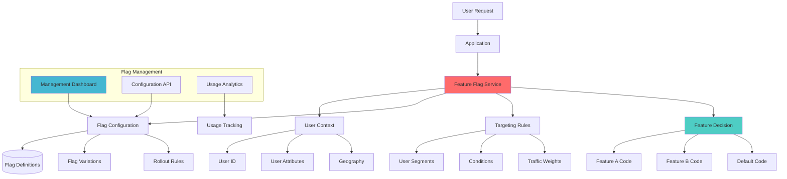

# Feature Flags

## Problem Statement

Tightly coupling feature releases with code deployments creates risks and limits flexibility. Teams struggle to safely test new features, perform gradual rollouts, or quickly disable problematic functionality without rolling back entire deployments.

**Real-World Impact**: The 2021 Facebook outage lasted 6+ hours partially due to inability to quickly disable problematic configurations, demonstrating the need for runtime feature control.

## Solution Overview

Feature Flags provide runtime control over application behavior through configurable switches that can:
- Enable/disable features for specific user segments
- Control feature rollout percentages
- A/B test different implementations
- Instantly disable problematic features
- Manage feature lifecycles independently of deployments



## Architecture Components

### 1. Flag Service
```yaml
Core Components:
  Flag Storage:
    - Flag definitions and configurations
    - User targeting rules
    - Rollout percentages
    - Feature variations
  
  Evaluation Engine:
    - Real-time flag evaluation
    - User context processing
    - Rule matching logic
    - Fallback handling
  
  Management Interface:
    - Web-based dashboard
    - API for programmatic access
    - Audit logging
    - User permissions

Performance Features:
  - Local caching
  - Edge distribution
  - Streaming updates
  - Offline fallbacks
```

### 2. Client SDKs
```yaml
SDK Features:
  Multi-language Support:
    - JavaScript/TypeScript
    - Python, Java, Go
    - Mobile (iOS, Android)
    - Server-side languages
  
  Caching Strategy:
    - In-memory caching
    - Background refresh
    - Graceful degradation
    - Network failure handling
  
  Context Handling:
    - User identification
    - Custom attributes
    - Geographic data
    - Device information
```

### 3. Targeting System
```yaml
Targeting Capabilities:
  User Segments:
    - Demographic targeting
    - Behavioral segments
    - Custom attribute matching
    - Geographic targeting
  
  Rollout Controls:
    - Percentage-based rollouts
    - Gradual increase automation
    - Kill switches
    - Emergency overrides
  
  Advanced Targeting:
    - Multi-variate testing
    - Mutual exclusion groups
    - Prerequisites
    - Time-based targeting
```

## Implementation Guide

### Phase 1: Core Infrastructure (Weeks 1-2)

1. **LaunchDarkly Setup**
```javascript
/ Client-side JavaScript SDK initialization
import { LDClient } from 'launchdarkly-js-client-sdk';

class FeatureFlagService {
    constructor(clientSideId, userContext) {
        this.client = LDClient.initialize(clientSideId, userContext);
        this.ready = false;
        
        this.client.on('ready', () => {
            this.ready = true;
            console.log('Feature flags initialized');
        });
        
        this.client.on('change', (settings) => {
            console.log('Feature flags updated:', settings);
            this.handleFlagChanges(settings);
        });
    }
    
    async isFeatureEnabled(flagKey, defaultValue = false) {
        if (!this.ready) {
            await this.client.waitForInitialization();
        }
        
        return this.client.variation(flagKey, defaultValue);
    }
    
    async getFeatureVariation(flagKey, defaultValue) {
        if (!this.ready) {
            await this.client.waitForInitialization();
        }
        
        return this.client.variation(flagKey, defaultValue);
    }
    
    trackEvent(eventKey, data = {}, metricValue = null) {
        if (this.ready) {
            this.client.track(eventKey, data, metricValue);
        }
    }
    
    handleFlagChanges(settings) {
        / React to real-time flag changes
        Object.keys(settings).forEach(flagKey => {
            const newValue = settings[flagKey].current;
            const oldValue = settings[flagKey].previous;
            
            if (newValue !== oldValue) {
                console.log(`Flag ${flagKey} changed from ${oldValue} to ${newValue}`);
                this.notifyComponents(flagKey, newValue);
            }
        });
    }
    
    notifyComponents(flagKey, newValue) {
        / Notify application components of flag changes
        window.dispatchEvent(new CustomEvent('featureFlagChange', {
            detail: { flagKey, newValue }
        }));
    }
}

/ Usage example
const userContext = {
    key: 'user-123',
    name: 'John Doe',
    email: 'john@example.com',
    country: 'US',
    custom: {
        plan: 'premium',
        signup_date: '2023-01-15'
    }
};

const featureFlags = new FeatureFlagService('your-client-side-id', userContext);

/ Check feature flags
async function initializeApp() {
    const newUIEnabled = await featureFlags.isFeatureEnabled('new-ui-redesign');
    const paymentProvider = await featureFlags.getFeatureVariation('payment-provider', 'stripe');
    
    if (newUIEnabled) {
        loadNewUI();
    } else {
        loadLegacyUI();
    }
    
    configurePaymentProvider(paymentProvider);
}
```

2. **Server-side Implementation**
```python
# Python server-side implementation
import ldclient
from ldclient.config import Config
from ldclient import Context
import logging
from typing import Dict, Any, Optional

class FeatureFlagManager:
    def __init__(self, sdk_key: str, offline_mode: bool = False):
        self.sdk_key = sdk_key
        
        # Configure LaunchDarkly client
        config = Config(
            sdk_key=sdk_key,
            offline=offline_mode,
            events_enabled=True,
            diagnostics_enabled=True
        )
        
        ldclient.set_config(config)
        self.client = ldclient.get()
        
        # Setup logging
        self.logger = logging.getLogger(__name__)
    
    def create_user_context(self, user_id: str, attributes: Dict[str, Any] = None) -> Context:
        """
        Create user context for flag evaluation
        """
        context_builder = Context.builder(user_id)
        
        if attributes:
            for key, value in attributes.items():
                if key == 'email':
                    context_builder.set('email', value)
                elif key == 'name':
                    context_builder.set('name', value)
                elif key == 'country':
                    context_builder.set('country', value)
                else:
                    context_builder.set_custom(key, value)
        
        return context_builder.build()
    
    def is_feature_enabled(self, 
                          flag_key: str, 
                          user_context: Context, 
                          default_value: bool = False) -> bool:
        """
        Check if a feature is enabled for a user
        """
        try:
            return self.client.variation(flag_key, user_context, default_value)
        except Exception as e:
            self.logger.error(f"Error evaluating flag {flag_key}: {e}")
            return default_value
    
    def get_feature_variation(self, 
                             flag_key: str, 
                             user_context: Context, 
                             default_value: Any) -> Any:
        """
        Get feature variation value
        """
        try:
            return self.client.variation(flag_key, user_context, default_value)
        except Exception as e:
            self.logger.error(f"Error getting variation for {flag_key}: {e}")
            return default_value
    
    def track_event(self, 
                   user_context: Context, 
                   event_name: str, 
                   data: Dict[str, Any] = None, 
                   metric_value: Optional[float] = None):
        """
        Track custom events for analytics
        """
        try:
            self.client.track(event_name, user_context, data, metric_value)
        except Exception as e:
            self.logger.error(f"Error tracking event {event_name}: {e}")
    
    def get_all_flags(self, user_context: Context) -> Dict[str, Any]:
        """
        Get all flag values for a user (useful for frontend)
        """
        try:
            return self.client.all_flags_state(user_context).to_values_map()
        except Exception as e:
            self.logger.error(f"Error getting all flags: {e}")
            return {}
    
    def close(self):
        """
        Clean shutdown
        """
        self.client.close()

# Flask integration example
from flask import Flask, request, jsonify
from functools import wraps

app = Flask(__name__)
feature_flags = FeatureFlagManager('your-server-side-sdk-key')

def with_feature_flag(flag_key: str, default_value: bool = False):
    """
    Decorator to protect routes with feature flags
    """
    def decorator(f):
        @wraps(f)
        def decorated_function(*args, **kwargs):
            # Get user context from request
            user_id = request.headers.get('X-User-Id', 'anonymous')
            user_attrs = {
                'email': request.headers.get('X-User-Email'),
                'country': request.headers.get('X-User-Country', 'US')
            }
            
            user_context = feature_flags.create_user_context(user_id, user_attrs)
            
            if feature_flags.is_feature_enabled(flag_key, user_context, default_value):
                return f(*args, **kwargs)
            else:
                return jsonify({'error': 'Feature not available'}), 404
        
        return decorated_function
    return decorator

@app.route('/api/new-feature')
@with_feature_flag('new-api-feature')
def new_feature():
    return jsonify({'message': 'New feature is enabled!'})

@app.route('/api/payment/process')
def process_payment():
    user_id = request.headers.get('X-User-Id', 'anonymous')
    user_context = feature_flags.create_user_context(user_id)
    
    # Get payment provider variation
    payment_provider = feature_flags.get_feature_variation(
        'payment-provider', 
        user_context, 
        'stripe'
    )
    
    if payment_provider == 'braintree':
        return process_braintree_payment()
    elif payment_provider == 'paypal':
        return process_paypal_payment()
    else:
        return process_stripe_payment()
    
    # Track the payment attempt
    feature_flags.track_event(
        user_context, 
        'payment_attempted', 
        {'provider': payment_provider}
    )

@app.route('/api/flags')
def get_user_flags():
    user_id = request.headers.get('X-User-Id', 'anonymous')
    user_context = feature_flags.create_user_context(user_id)
    
    return jsonify(feature_flags.get_all_flags(user_context))
```

### Phase 2: Advanced Implementation (Weeks 3-4)

1. **React Integration with Hooks**
```typescript
/ React hooks for feature flags
import { useState, useEffect, useContext, createContext } from 'react';
import { FeatureFlagService } from './FeatureFlagService';

interface FeatureFlagContextType {
    featureFlags: FeatureFlagService | null;
    isReady: boolean;
}

const FeatureFlagContext = createContext<FeatureFlagContextType>({
    featureFlags: null,
    isReady: false
});

/ Provider component
export const FeatureFlagProvider: React.FC<{ 
    children: React.ReactNode;
    clientSideId: string;
    userContext: any;
}> = ({ children, clientSideId, userContext }) => {
    const [featureFlags, setFeatureFlags] = useState<FeatureFlagService | null>(null);
    const [isReady, setIsReady] = useState(false);
    
    useEffect(() => {
        const service = new FeatureFlagService(clientSideId, userContext);
        
        service.client.on('ready', () => {
            setIsReady(true);
        });
        
        setFeatureFlags(service);
        
        return () => {
            service.client.close();
        };
    }, [clientSideId, userContext]);
    
    return (
        <FeatureFlagContext.Provider value={{ featureFlags, isReady }}>
            {children}
        </FeatureFlagContext.Provider>
    );
};

/ Hook for checking feature flags
export const useFeatureFlag = (flagKey: string, defaultValue: boolean = false) => {
    const { featureFlags, isReady } = useContext(FeatureFlagContext);
    const [isEnabled, setIsEnabled] = useState(defaultValue);
    const [loading, setLoading] = useState(true);
    
    useEffect(() => {
        if (!featureFlags || !isReady) return;
        
        const checkFlag = async () => {
            try {
                const enabled = await featureFlags.isFeatureEnabled(flagKey, defaultValue);
                setIsEnabled(enabled);
            } catch (error) {
                console.error(`Error checking flag ${flagKey}:`, error);
                setIsEnabled(defaultValue);
            } finally {
                setLoading(false);
            }
        };
        
        checkFlag();
        
        / Listen for flag changes
        const handleFlagChange = (event: CustomEvent) => {
            if (event.detail.flagKey === flagKey) {
                setIsEnabled(event.detail.newValue);
            }
        };
        
        window.addEventListener('featureFlagChange', handleFlagChange as EventListener);
        
        return () => {
            window.removeEventListener('featureFlagChange', handleFlagChange as EventListener);
        };
    }, [featureFlags, isReady, flagKey, defaultValue]);
    
    return { isEnabled, loading };
};

/ Hook for feature variations
export const useFeatureVariation = <T>(flagKey: string, defaultValue: T) => {
    const { featureFlags, isReady } = useContext(FeatureFlagContext);
    const [variation, setVariation] = useState<T>(defaultValue);
    const [loading, setLoading] = useState(true);
    
    useEffect(() => {
        if (!featureFlags || !isReady) return;
        
        const getVariation = async () => {
            try {
                const value = await featureFlags.getFeatureVariation(flagKey, defaultValue);
                setVariation(value);
            } catch (error) {
                console.error(`Error getting variation ${flagKey}:`, error);
                setVariation(defaultValue);
            } finally {
                setLoading(false);
            }
        };
        
        getVariation();
        
        / Listen for flag changes
        const handleFlagChange = (event: CustomEvent) => {
            if (event.detail.flagKey === flagKey) {
                setVariation(event.detail.newValue);
            }
        };
        
        window.addEventListener('featureFlagChange', handleFlagChange as EventListener);
        
        return () => {
            window.removeEventListener('featureFlagChange', handleFlagChange as EventListener);
        };
    }, [featureFlags, isReady, flagKey, defaultValue]);
    
    return { variation, loading };
};

/ Feature flag component
export const FeatureFlag: React.FC<{
    flagKey: string;
    defaultValue?: boolean;
    children: React.ReactNode;
    fallback?: React.ReactNode;
}> = ({ flagKey, defaultValue = false, children, fallback = null }) => {
    const { isEnabled, loading } = useFeatureFlag(flagKey, defaultValue);
    
    if (loading) {
        return <div>Loading...</div>;
    }
    
    return isEnabled ? <>{children}</> : <>{fallback}</>;
};

/ Usage examples
const MyComponent: React.FC = () => {
    const { isEnabled: newUIEnabled } = useFeatureFlag('new-ui-redesign');
    const { variation: theme } = useFeatureVariation('ui-theme', 'light');
    
    return (
        <div className={`app ${theme}-theme`}>
            <FeatureFlag flagKey="beta-banner" fallback={null}>
                <div className="beta-banner">
                    You're using our beta version!
                </div>
            </FeatureFlag>
            
            {newUIEnabled ? (
                <NewDashboard />
            ) : (
                <LegacyDashboard />
            )}
            
            <FeatureFlag 
                flagKey="new-checkout-flow" 
                fallback={<LegacyCheckout />}
            >
                <NewCheckout />
            </FeatureFlag>
        </div>
    );
};
```

2. **A/B Testing Integration**
```python
# A/B testing with feature flags
from dataclasses import dataclass
from typing import Dict, List, Optional
from enum import Enum
import uuid
from datetime import datetime, timedelta

class ExperimentStatus(Enum):
    DRAFT = "draft"
    RUNNING = "running"
    PAUSED = "paused"
    COMPLETED = "completed"

@dataclass
class ExperimentVariation:
    key: str
    name: str
    description: str
    weight: float  # Percentage of traffic (0-100)
    configuration: Dict[str, any]

@dataclass
class ExperimentMetric:
    key: str
    name: str
    description: str
    metric_type: str  # 'conversion', 'numeric', 'custom'
    target_value: Optional[float] = None
    improvement_hypothesis: str = ""  # 'increase', 'decrease', 'no_change'

@dataclass
class Experiment:
    key: str
    name: str
    description: str
    flag_key: str
    status: ExperimentStatus
    variations: List[ExperimentVariation]
    primary_metric: ExperimentMetric
    secondary_metrics: List[ExperimentMetric]
    start_date: Optional[datetime] = None
    end_date: Optional[datetime] = None
    minimum_sample_size: int = 1000
    traffic_allocation: float = 100.0  # Percentage of users in experiment

class ExperimentManager:
    def __init__(self, feature_flag_manager: FeatureFlagManager):
        self.feature_flags = feature_flag_manager
        self.experiments: Dict[str, Experiment] = {}
        self.user_assignments: Dict[str, Dict[str, str]] = {}  # user_id -> {experiment_key: variation}
        
    def create_experiment(self, experiment: Experiment) -> bool:
        """
        Create a new A/B test experiment
        """
        # Validate experiment configuration
        if not self._validate_experiment(experiment):
            return False
        
        self.experiments[experiment.key] = experiment
        
        # Create or update the associated feature flag
        self._setup_experiment_flag(experiment)
        
        return True
    
    def get_experiment_variation(self, 
                               experiment_key: str, 
                               user_context,
                               default_variation: str = "control") -> str:
        """
        Get the variation for a user in an experiment
        """
        experiment = self.experiments.get(experiment_key)
        if not experiment or experiment.status != ExperimentStatus.RUNNING:
            return default_variation
        
        user_id = user_context.key
        
        # Check if user is already assigned
        if (user_id in self.user_assignments and 
            experiment_key in self.user_assignments[user_id]):
            return self.user_assignments[user_id][experiment_key]
        
        # Check if user should be included in experiment
        if not self._should_include_user(experiment, user_context):
            return default_variation
        
        # Assign user to variation
        variation = self._assign_user_to_variation(experiment, user_id)
        
        # Store assignment
        if user_id not in self.user_assignments:
            self.user_assignments[user_id] = {}
        self.user_assignments[user_id][experiment_key] = variation
        
        # Track assignment event
        self.feature_flags.track_event(
            user_context,
            'experiment_assignment',
            {
                'experiment_key': experiment_key,
                'variation': variation,
                'assignment_id': str(uuid.uuid4())
            }
        )
        
        return variation
    
    def track_metric(self, 
                    user_context, 
                    experiment_key: str, 
                    metric_key: str, 
                    value: float = 1.0):
        """
        Track a metric event for an experiment
        """
        experiment = self.experiments.get(experiment_key)
        if not experiment:
            return
        
        user_id = user_context.key
        variation = self.user_assignments.get(user_id, {}).get(experiment_key)
        
        if not variation:
            return
        
        # Track metric event
        self.feature_flags.track_event(
            user_context,
            'experiment_metric',
            {
                'experiment_key': experiment_key,
                'metric_key': metric_key,
                'variation': variation,
                'value': value,
                'timestamp': datetime.utcnow().isoformat()
            },
            metric_value=value
        )
    
    def _validate_experiment(self, experiment: Experiment) -> bool:
        """
        Validate experiment configuration
        """
        # Check variation weights sum to 100
        total_weight = sum(v.weight for v in experiment.variations)
        if abs(total_weight - 100.0) > 0.01:
            print(f"Variation weights must sum to 100, got {total_weight}")
            return False
        
        # Check for duplicate variation keys
        variation_keys = [v.key for v in experiment.variations]
        if len(variation_keys) != len(set(variation_keys)):
            print("Variation keys must be unique")
            return False
        
        return True
    
    def _should_include_user(self, experiment: Experiment, user_context) -> bool:
        """
        Determine if user should be included in experiment
        """
        # Simple hash-based traffic allocation
        user_hash = hash(f"{user_context.key}:{experiment.key}") % 100
        return user_hash < experiment.traffic_allocation
    
    def _assign_user_to_variation(self, experiment: Experiment, user_id: str) -> str:
        """
        Assign user to a variation based on weights
        """
        # Use consistent hashing for stable assignments
        user_hash = hash(f"{user_id}:{experiment.key}:{experiment.start_date}") % 100
        
        cumulative_weight = 0
        for variation in experiment.variations:
            cumulative_weight += variation.weight
            if user_hash < cumulative_weight:
                return variation.key
        
        # Fallback to first variation
        return experiment.variations[0].key
    
    def _setup_experiment_flag(self, experiment: Experiment):
        """
        Setup feature flag configuration for experiment
        This would integrate with your feature flag service's API
        """
        # This is a conceptual implementation
        # In practice, you'd use your feature flag service's API
        pass

# Usage example
class CheckoutExperiment:
    def __init__(self, experiment_manager: ExperimentManager):
        self.experiment_manager = experiment_manager
        
        # Define the experiment
        self.experiment = Experiment(
            key="checkout-flow-v2",
            name="New Checkout Flow",
            description="Test impact of simplified checkout flow on conversion",
            flag_key="checkout-flow",
            status=ExperimentStatus.RUNNING,
            variations=[
                ExperimentVariation(
                    key="control",
                    name="Current Checkout",
                    description="Existing multi-step checkout",
                    weight=50.0,
                    configuration={"steps": 3, "guest_checkout": False}
                ),
                ExperimentVariation(
                    key="treatment",
                    name="Simplified Checkout",
                    description="New single-step checkout with guest option",
                    weight=50.0,
                    configuration={"steps": 1, "guest_checkout": True}
                )
            ],
            primary_metric=ExperimentMetric(
                key="checkout_conversion",
                name="Checkout Conversion Rate",
                description="Percentage of users who complete checkout",
                metric_type="conversion",
                improvement_hypothesis="increase"
            ),
            secondary_metrics=[
                ExperimentMetric(
                    key="checkout_abandonment",
                    name="Checkout Abandonment Rate",
                    description="Percentage of users who abandon checkout",
                    metric_type="conversion",
                    improvement_hypothesis="decrease"
                ),
                ExperimentMetric(
                    key="checkout_time",
                    name="Time to Complete Checkout",
                    description="Average time to complete checkout process",
                    metric_type="numeric",
                    improvement_hypothesis="decrease"
                )
            ],
            minimum_sample_size=5000,
            traffic_allocation=80.0  # Only 80% of users in experiment
        )
        
        # Create the experiment
        self.experiment_manager.create_experiment(self.experiment)
    
    def get_checkout_config(self, user_context) -> Dict[str, any]:
        """
        Get checkout configuration based on experiment
        """
        variation = self.experiment_manager.get_experiment_variation(
            "checkout-flow-v2",
            user_context,
            "control"
        )
        
        for var in self.experiment.variations:
            if var.key == variation:
                return var.configuration
        
        # Fallback to control
        return self.experiment.variations[0].configuration
    
    def track_checkout_started(self, user_context):
        """
        Track when user starts checkout
        """
        self.experiment_manager.track_metric(
            user_context,
            "checkout-flow-v2",
            "checkout_started"
        )
    
    def track_checkout_completed(self, user_context, completion_time: float):
        """
        Track successful checkout completion
        """
        # Track conversion
        self.experiment_manager.track_metric(
            user_context,
            "checkout-flow-v2",
            "checkout_conversion"
        )
        
        # Track completion time
        self.experiment_manager.track_metric(
            user_context,
            "checkout-flow-v2",
            "checkout_time",
            completion_time
        )
    
    def track_checkout_abandoned(self, user_context):
        """
        Track checkout abandonment
        """
        self.experiment_manager.track_metric(
            user_context,
            "checkout-flow-v2",
            "checkout_abandonment"
        )
```

## Real-World Examples

### Netflix Implementation
```yaml
Scale: 4000+ feature flags, 200M+ users
Components:
  - Custom feature flag platform
  - Real-time flag evaluation
  - A/B testing integration
  - Machine learning optimization

Results:
  - 99.99% flag evaluation uptime
  - <5ms flag evaluation latency
  - 50% faster feature iteration
  - $100M+ in A/B test-driven improvements
```

### Uber Implementation
```yaml
Scale: 2000+ feature flags, 100M+ users
Components:
  - Distributed flag evaluation system
  - Mobile and server-side SDKs
  - Geographic targeting
  - Gradual rollout automation

Results:
  - 95% reduction in rollback incidents
  - 3x faster feature delivery
  - 80% of features A/B tested
  - $50M+ saved from prevented incidents
```

## Metrics and Success Criteria

### Technical Metrics
```yaml
Performance:
  - Flag evaluation latency: <10ms p95
  - Flag service uptime: >99.9%
  - Cache hit rate: >95%
  - SDK initialization time: <1 second

Reliability:
  - Flag configuration errors: <0.1%
  - Graceful degradation: 100% uptime
  - Rollback success rate: >99%
  - False positive flag triggers: <1%

Adoption:
  - Developer satisfaction: >4.5/5
  - Flag coverage: >80% of features
  - Self-service flag creation: >90%
  - Time to create new flag: <5 minutes
```

### Business Impact
```yaml
Development Velocity:
  - Feature delivery speed: +60%
  - Deployment frequency: +300%
  - Lead time for changes: -70%
  - Mean time to recovery: -80%

Risk Reduction:
  - Production incidents: -50%
  - Rollback incidents: -90%
  - User-impacting bugs: -60%
  - Emergency deployments: -75%

Experimentation:
  - A/B tests running: 50+ concurrent
  - Feature optimization rate: +40%
  - Data-driven decisions: +80%
  - Revenue impact from tests: +15%
```

## Common Pitfalls and Solutions

### 1. Flag Debt and Technical Debt
**Problem**: Accumulation of unused or obsolete flags
**Solution**:
```yaml
Flag Lifecycle Management:
  - Automatic flag expiration dates
  - Regular flag audit processes
  - Automated cleanup tools
  - Flag usage monitoring

Governance Process:
  - Flag review requirements
  - Ownership assignment
  - Documentation standards
  - Removal procedures
```

### 2. Performance Impact
**Problem**: Flag evaluations adding latency
**Solution**:
```yaml
Performance Optimization:
  - Aggressive caching strategies
  - Edge-based flag evaluation
  - Batch flag retrievals
  - Async flag updates

Architecture Patterns:
  - Circuit breaker for flag service
  - Local fallback values
  - Graceful degradation modes
  - CDN-based flag distribution
```

### 3. Flag Complexity and Dependencies
**Problem**: Complex flag interactions become unmanageable
**Solution**:
```yaml
Complexity Management:
  - Limit flag nesting depth
  - Use feature hierarchies
  - Implement flag dependencies
  - Provide impact analysis tools

Best Practices:
  - Single responsibility per flag
  - Clear naming conventions
  - Documentation requirements
  - Dependency tracking
```

## Related Patterns

- **Complementary**: [Canary Release](canary-release/index.md) - Gradual rollout with monitoring
- **Complementary**: [Blue-Green Deployment](blue-green-deployment/index.md) - Safe deployment switches
- **Building Block**: A/B testing framework
- **Extension**: Progressive rollout automation
- **Alternative**: Configuration-based toggles (simpler but less flexible)

## Further Reading

- [Martin Fowler - Feature Toggles](https://martinfowler.com/articles/feature-toggles.html/index.md)
- [LaunchDarkly - Feature Flag Guide](https://launchdarkly.com/blog/what-are-feature-flags/index.md)
- [Split.io - Feature Flags Best Practices](https://www.split.io/blog/feature-flag-best-practices/index.md)
- [Optimizely - Feature Experimentation](https://www.optimizely.com/optimization-glossary/feature-flags/index.md)
