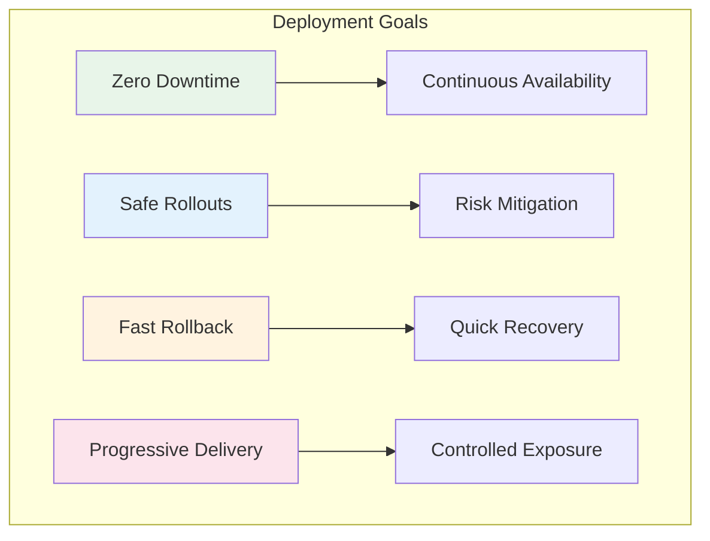

# Deployment Patterns

Patterns for managing deployments, releases, and rollouts in distributed systems with minimal risk and downtime.

## Core Principles

## Pattern Overview

| Pattern | Description | Tier | When to Use |
|---------|-------------|------|------------|
| [Blue-Green Deployment](blue-green-deployment.md) | Two identical environments for instant switching | 🥈 Silver | Applications requiring zero-downtime deployments |

## Deployment Strategies

### Progressive Delivery
1. **Feature Flags**: Control feature exposure
2. **Canary Releases**: Gradual rollout
3. **A/B Testing**: Compare versions
4. **Dark Launches**: Test with production traffic

### Risk Mitigation
- Automated rollback
- Health monitoring
- Traffic management
- Version control

## Best Practices

!!! tip "Deployment Best Practices"
    - Automate everything
    - Monitor key metrics during deployment
    - Have rollback plans ready
    - Test in staging first
    - Use progressive rollout strategies

## Related Patterns
- [Circuit Breaker](../resilience/circuit-breaker.md) - Protect during deployments
- [Health Check](../resilience/health-check.md) - Validate deployments
- [Load Balancing](../scaling/load-balancing.md) - Traffic management
- [Service Mesh](../communication/service-mesh.md) - Advanced traffic control

## Evolution of Deployment
1. **Manual Deployments**: High risk, downtime required
2. **Blue-Green**: Zero downtime, instant rollback
3. **Canary**: Progressive rollout
4. **Feature Flags**: Fine-grained control
5. **GitOps**: Declarative deployments