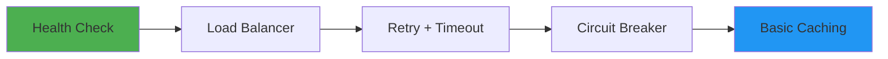
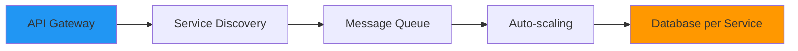
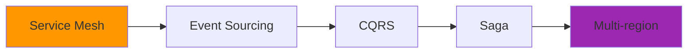

# Pattern Library: 130 Distributed Systems Patterns

**104 Production-Ready** • **26 Preview/Experimental**

## Table of Contents

- [🎯 Quick Navigation](#quick-navigation)
- [🚀 Learning Paths](#learning-paths)
  - [👶 Beginner Path (2-4 weeks)](#beginner-path-2-4-weeks)
  - [🚀 Intermediate Path (1-2 months)](#intermediate-path-1-2-months)
  - [🏆 Advanced Path (3-6 months)](#advanced-path-3-6-months)
- [🔍 Pattern Explorer {#pattern-explorer}](#pattern-explorer-pattern-explorer)
- [📈 Pattern Statistics at a Glance](#pattern-statistics-at-a-glance)
- [🏆 Top Patterns by Impact](#top-patterns-by-impact)
  - [The Elite 15 - Master These First](#the-elite-15-master-these-first)
- [📚 Pattern Categories](#pattern-categories)
- [🏆 Excellence Tiers](#excellence-tiers)
  - [Pattern Selection Guide](#pattern-selection-guide)
- [📊 Pattern Metadata](#pattern-metadata)
- [🎓 Pattern Resources Hub](#pattern-resources-hub)
- [🚦 Common Pattern Combinations](#common-pattern-combinations)
  - [The Netflix Stack](#the-netflix-stack)
  - [The Uber Stack](#the-uber-stack)
  - [The Banking Stack](#the-banking-stack)
- [🎯 Pattern Selection by Problem](#pattern-selection-by-problem)

<div class="pattern-hero">
    <h2>🏗️ Build Reliable Distributed Systems with Proven Patterns</h2>
    <p>From Netflix's Circuit Breakers to Google's MapReduce - Learn from the giants</p>
</div>

## 🎯 Quick Navigation

<div class="quick-nav-grid">
    <a href="#pattern-explorer" class="nav-card">
        <span class="icon">🔍</span>
        <span class="label">Pattern Explorer</span>
        <span class="desc">Find patterns by problem</span>
    </a>
    <a href="pattern-synthesis-guide/" class="nav-card">
        <span class="icon">🧠</span>
        <span class="label">Synthesis Guide</span>
        <span class="desc">Understand relationships</span>
    </a>
    <a href="pattern-decision-matrix/" class="nav-card">
        <span class="icon">📊</span>
        <span class="label">Decision Matrix</span>
        <span class="desc">Choose right patterns</span>
    </a>
    <a href="../reference/pattern-selection-cheatsheet/" class="nav-card">
        <span class="icon">⚡</span>
        <span class="label">Quick Reference</span>
        <span class="desc">Cheatsheet for pros</span>
    </a>
</div>

## 🚀 Learning Paths

### 👶 Beginner Path (2-4 weeks)
**Goal**: Build your first reliable service



### 🚀 Intermediate Path (1-2 months)
**Goal**: Scale to 100K users



### 🏆 Advanced Path (3-6 months)
**Goal**: Build complex distributed systems



## 🔍 Pattern Explorer {#pattern-explorer}

<div class="pattern-explorer-enhanced">
    <div class="explorer-header">
        <h3>🎯 Smart Pattern Discovery</h3>
        <p>Find the right pattern based on our analysis of 130 patterns across 60 years of distributed systems</p>
    </div>
    
    <div class="pattern-filter-container">
        <div class="filter-header">
            <input type="text" id="pattern-search" placeholder="Try: 'failure', 'scale', 'netflix', 'consistency', 'real-time'..." />
            <div class="pattern-count">
                Showing <span id="filtered-count">0</span> of <span id="total-count">130</span> patterns
            </div>
        </div>
        
        <div class="quick-filters">
            <button class="quick-filter-btn" onclick="applyQuickFilter('elite')">
                ⭐ Elite 24 Only
            </button>
            <button class="quick-filter-btn" onclick="applyQuickFilter('beginner')">
                👶 Beginner Friendly
            </button>
            <button class="quick-filter-btn" onclick="applyQuickFilter('trending')">
                📈 Trending Up
            </button>
            <button class="quick-filter-btn" onclick="applyQuickFilter('avoid')">
                ⚠️ Legacy/Avoid
            </button>
        </div>
        
        <div class="filter-controls">
            <div class="filter-group">
                <label>Excellence Tier:</label>
                <div class="filter-buttons">
                    <button class="filter-btn active" data-filter="tier" data-value="all">All</button>
                    <button class="filter-btn" data-filter="tier" data-value="gold">🥇 Gold (50)</button>
                    <button class="filter-btn" data-filter="tier" data-value="silver">🥈 Silver (73)</button>
                    <button class="filter-btn" data-filter="tier" data-value="bronze">🥉 Bronze (7)</button>
                </div>
            </div>
            
            <div class="filter-group">
                <label>Category:</label>
                <div class="filter-buttons">
                    <button class="filter-btn active" data-filter="category" data-value="all">All</button>
                    <button class="filter-btn" data-filter="category" data-value="data-management">Data Management (28)</button>
                    <button class="filter-btn" data-filter="category" data-value="scaling">Scaling (25)</button>
                    <button class="filter-btn" data-filter="category" data-value="architecture">Architecture (19)</button>
                    <button class="filter-btn" data-filter="category" data-value="coordination">Coordination (17)</button>
                    <button class="filter-btn" data-filter="category" data-value="resilience">Resilience (13)</button>
                    <button class="filter-btn" data-filter="category" data-value="communication">Communication (8)</button>
                    <button class="filter-btn" data-filter="category" data-value="security">Security (7)</button>
                    <button class="filter-btn" data-filter="category" data-value="ml-infrastructure">ML Infrastructure (5)</button>
                    <button class="filter-btn" data-filter="category" data-value="deployment">Deployment (5)</button>
                    <button class="filter-btn" data-filter="category" data-value="cost-optimization">Cost Optimization (3)</button>
                </div>
            </div>
            
            <div class="filter-group">
                <label>Problem Domain:</label>
                <div class="filter-buttons">
                    <button class="filter-btn" data-filter="problem" data-value="failure">Handle Failures</button>
                    <button class="filter-btn" data-filter="problem" data-value="performance">Improve Performance</button>
                    <button class="filter-btn" data-filter="problem" data-value="scale">Handle Scale</button>
                    <button class="filter-btn" data-filter="problem" data-value="consistency">Data Consistency</button>
                    <button class="filter-btn" data-filter="problem" data-value="realtime">Real-time</button>
                </div>
            </div>
            
            <div class="filter-group">
                <label>Adoption Status:</label>
                <div class="filter-buttons">
                    <button class="filter-btn" data-filter="relevance" data-value="mainstream">Mainstream</button>
                    <button class="filter-btn" data-filter="relevance" data-value="growing">Growing</button>
                    <button class="filter-btn" data-filter="relevance" data-value="specialized">Specialized</button>
                    <button class="filter-btn" data-filter="relevance" data-value="declining">Declining</button>
                </div>
            </div>
            
            <div class="filter-group">
                <label>Company Examples:</label>
                <div class="filter-buttons">
                    <button class="filter-btn" data-filter="company" data-value="netflix">Netflix</button>
                    <button class="filter-btn" data-filter="company" data-value="google">Google</button>
                    <button class="filter-btn" data-filter="company" data-value="amazon">Amazon</button>
                    <button class="filter-btn" data-filter="company" data-value="uber">Uber</button>
                </div>
            </div>
            
            <button class="reset-filters-btn" onclick="resetFilters()">Reset All Filters</button>
        </div>
    </div>
    
    <div class="pattern-insights">
        <div class="insight-card">
            <span class="insight-icon">💡</span>
            <span class="insight-text" id="dynamic-insight">
                <strong>Did you know?</strong> The average pattern takes 5 years to reach mainstream adoption, down from 15 years in the 1980s.
            </span>
        </div>
    </div>
    
    <div class="pattern-grid-enhanced">
        <div class="grid-header">
            <div class="sort-controls">
                <label>Sort by:</label>
                <select id="pattern-sort" onchange="sortPatterns()">
                    <option value="relevance">Relevance</option>
                    <option value="name">Name (A-Z)</option>
                    <option value="excellence">Excellence Tier</option>
                    <option value="adoption">Adoption Rate</option>
                    <option value="age">Pattern Age</option>
                    <option value="complexity">Implementation Complexity</option>
                </select>
            </div>
            <div class="view-controls">
                <button class="view-btn active" data-view="grid">
                    <span class="material-icons">grid_view</span>
                </button>
                <button class="view-btn" data-view="list">
                    <span class="material-icons">list</span>
                </button>
                <button class="view-btn" data-view="graph">
                    <span class="material-icons">account_tree</span>
                </button>
            </div>
        </div>
        
        <div id="pattern-grid" class="pattern-grid">
            <!-- Patterns will be dynamically loaded here -->
            <div class="loading-spinner">Loading patterns...</div>
        </div>
    </div>
</div>

## 📈 Pattern Statistics at a Glance

<div class="stats-grid">
    <div class="stat-card">
        <div class="stat-number">130</div>
        <div class="stat-label">Total Patterns</div>
        <div class="stat-detail">Covering all distributed systems challenges</div>
    </div>
    <div class="stat-card gold">
        <div class="stat-number">50</div>
        <div class="stat-label">🥇 Gold Patterns</div>
        <div class="stat-detail">Battle-tested at massive scale</div>
    </div>
    <div class="stat-card silver">
        <div class="stat-number">73</div>
        <div class="stat-label">🥈 Silver Patterns</div>
        <div class="stat-detail">Specialized solutions</div>
    </div>
    <div class="stat-card bronze">
        <div class="stat-number">7</div>
        <div class="stat-label">🥉 Bronze Patterns</div>
        <div class="stat-detail">Legacy with alternatives</div>
    </div>
</div>

## 🏆 Top Patterns by Impact

### The Elite 15 - Master These First

<div class="elite-patterns-grid">
    <div class="elite-category">
        <h4>🛡️ Resilience Foundation</h4>
        <ul>
            <li><a href="resilience/circuit-breaker/">Circuit Breaker</a> - Prevent cascade failures</li>
            <li><a href="resilience/retry-backoff/">Retry with Backoff</a> - Handle transients</li>
            <li><a href="resilience/timeout/">Timeout</a> - Bound operations</li>
            <li><a href="resilience/health-check/">Health Check</a> - Monitor status</li>
        </ul>
    </div>
    <div class="elite-category">
        <h4>🔀 Communication Core</h4>
        <ul>
            <li><a href="communication/api-gateway/">API Gateway</a> - Single entry point</li>
            <li><a href="scaling/load-balancing/">Load Balancer</a> - Distribute traffic</li>
            <li><a href="communication/publish-subscribe/">Message Queue</a> - Async messaging</li>
            <li><a href="communication/service-discovery/">Service Discovery</a> - Find services</li>
        </ul>
    </div>
    <div class="elite-category">
        <h4>📊 Data Essentials</h4>
        <ul>
            <li><a href="scaling/caching-strategies/">Caching</a> - Reduce latency</li>
            <li><a href="data-management/shared-database/">Database per Service</a> - Independence</li>
            <li><a href="data-management/event-sourcing/">Event Sourcing</a> - Audit trail</li>
            <li><a href="data-management/cdc/">CDC</a> - Data sync</li>
        </ul>
    </div>
    <div class="elite-category">
        <h4>🚀 Scale Enablers</h4>
        <ul>
            <li><a href="scaling/auto-scaling/">Auto-scaling</a> - Dynamic capacity</li>
            <li><a href="scaling/sharding/">Sharding</a> - Partition data</li>
            <li><a href="scaling/edge-computing/">CDN</a> - Global delivery</li>
        </ul>
    </div>
</div>

## 📚 Pattern Categories

!!! info "📖 Pattern Discovery Guide"
    **🥇 Gold Tier**: Battle-tested at massive scale (Netflix, Google, Amazon). Start here for production systems.
    
    **🥈 Silver Tier**: Proven in specific domains with clear trade-offs. Use when Gold patterns don't fit.
    
    **🥉 Bronze Tier**: Legacy patterns with modern alternatives. Avoid in new systems.
    
    **🔍 Smart Search**: Try keywords like "failure", "scale", "async", or "consistency" to find relevant patterns.
    
    **💾 Auto-Save**: Your filter preferences are saved automatically and persist across browser sessions.
    
    **🔄 Reset**: Click "Reset Filters" to clear all selections and start fresh.

<div class="grid cards" markdown>

- :material-lan:{ .lg } **[Communication Patterns](communication/)** (8 patterns)
    
    ---
    
    How services communicate across networks and process boundaries
    
    🥇 **Top Gold**: API Gateway, Service Mesh, WebSocket
    
    💡 **Best For**: Microservices, real-time systems, event-driven architectures

- :material-shield-check:{ .lg } **[Resilience Patterns](resilience/)** (13 patterns)
    
    ---
    
    Building fault-tolerant systems that gracefully handle failures
    
    🥇 **Top Gold**: Circuit Breaker, Retry with Exponential Backoff, Health Check
    
    💡 **Best For**: High-availability systems, failure recovery, system stability

- :material-database:{ .lg } **[Data Management Patterns](data-management/)** (28 patterns)
    
    ---
    
    Storing, replicating, and maintaining consistency across distributed data
    
    🥇 **Top Gold**: Event Sourcing, CQRS, Saga, Consistent Hashing
    
    💡 **Best For**: Large-scale data, eventual consistency, complex transactions

- :material-arrow-expand-all:{ .lg } **[Scaling Patterns](scaling/)** (25 patterns)
    
    ---
    
    Handling growth in users, data, and computational demands
    
    🥇 **Top Gold**: Load Balancing, Auto-scaling, Caching Strategies, Sharding
    
    💡 **Best For**: High-traffic systems, performance optimization, cost efficiency

- :material-sitemap:{ .lg } **[Architecture Patterns](architecture/)** (19 patterns)
    
    ---
    
    Organizing system structure and deployment strategies
    
    🥇 **Top Gold**: Microservices, Event-Driven Architecture, Serverless/FaaS
    
    💡 **Best For**: System decomposition, deployment flexibility, maintainability

- :material-sync:{ .lg } **[Coordination Patterns](coordination/)** (17 patterns)
    
    ---
    
    Achieving consensus and synchronization in distributed environments
    
    🥇 **Top Gold**: Leader Election, Distributed Locking, Consensus Algorithms
    
    💡 **Best For**: Coordination, distributed state management, consistency guarantees

- :material-security:{ .lg } **[Security Patterns](security/)** (7 patterns)
    
    ---
    
    Protecting systems and data from threats with layered security approaches
    
    🥇 **Top Gold**: Zero-Trust Architecture, API Security Gateway, Secrets Management
    
    💡 **Best For**: Security-critical systems, compliance requirements, threat mitigation

- :material-rocket-launch:{ .lg } **[Deployment Patterns](deployment/)** (5 patterns)
    
    ---
    
    Safe and reliable software delivery with zero-downtime deployments
    
    🥇 **Top Gold**: Blue-Green Deployment, Canary Release, Feature Flags
    
    💡 **Best For**: Continuous delivery, risk mitigation, feature management

- :material-brain:{ .lg } **[ML Infrastructure Patterns](ml-infrastructure/)** (5 patterns)
    
    ---
    
    Machine learning systems infrastructure for training, serving, and MLOps workflows
    
    🥇 **Top Gold**: Model Serving, Feature Store, ML Pipeline
    
    💡 **Best For**: ML systems, model deployment, data pipelines

- :material-currency-usd:{ .lg } **[Cost Optimization Patterns](cost-optimization/)** (3 patterns)
    
    ---
    
    Reducing cloud infrastructure costs while maintaining performance and reliability
    
    🥇 **Top Gold**: Spot Instance Management, Resource Rightsizing, Auto-scaling Cost Optimization
    
    💡 **Best For**: Cloud cost reduction, resource efficiency, operational optimization

</div>

## 🏆 Excellence Tiers

Understanding our classification system helps you choose the right patterns for your context.

| Tier | Criteria | What You Get | Use When |
|------|----------|--------------|----------|
| 🥇 **Gold** (50 patterns) | Production-proven at massive scale by tech giants | Production checklists, real-world scale examples, performance benchmarks | Building mission-critical systems, handling millions of users |
| 🥈 **Silver** (73 patterns) | Solid patterns with proven track record in specific domains | Detailed trade-offs, implementation guides, best-fit scenarios | Solving specialized problems, domain-specific challenges |  
| 🥉 **Bronze** (7 patterns) | Legacy patterns or niche use cases | Migration paths to modern alternatives, deprecation guidance | Maintaining legacy systems, understanding historical context |

### Pattern Selection Guide

1. **Start with Gold patterns** for core system components
2. **Use Silver patterns** for specialized requirements  
3. **Avoid Bronze patterns** in new systems unless unavoidable
4. **Always check "Related Patterns"** for modern alternatives

## 📊 Pattern Metadata

Each pattern includes:
- **Problem Context** - When and why to use
- **Solution Approach** - How it works
- **Architecture Diagram** - Visual representation
- **Trade-offs** - Pros and cons
- **Implementation Guide** - Step-by-step instructions
- **Real Examples** - Companies using at scale
- **Related Patterns** - Complementary and alternative patterns

## 🎓 Pattern Resources Hub

<div class="resource-grid">
    <div class="resource-card">
        <h3>📖 Learning Resources</h3>
        <ul>
            <li><a href="pattern-synthesis-guide/">Pattern Synthesis Guide</a> - Understand 130 patterns</li>
            <li><a href="pattern-relationship-map/">Relationship Map</a> - See connections</li>
            <li><a href="../reference/pattern-template/">Pattern Template</a> - Documentation standard</li>
            <li><a href="../reference/pattern-evolution-timeline/">Evolution Timeline</a> - 60 years of patterns</li>
        </ul>
    </div>
    <div class="resource-card">
        <h3>🛠️ Decision Tools</h3>
        <ul>
            <li><a href="pattern-decision-matrix/">Decision Matrix</a> - Scenario-based selection</li>
            <li><a href="../reference/pattern-selection-cheatsheet/">Selection Cheatsheet</a> - Quick reference</li>
            <li><a href="../reference/pattern-dependency-graph/">Dependency Graph</a> - Implementation order</li>
            <li><a href="../reference/pattern-meta-analysis/">Meta-Analysis</a> - Data insights</li>
        </ul>
    </div>
    <div class="resource-card">
        <h3>📊 Pattern Analytics</h3>
        <ul>
            <li><a href="../reference/pattern-health-dashboard/">Health Dashboard</a> - Adoption metrics</li>
            <li><strong>38%</strong> patterns are Gold tier</li>
            <li><strong>24</strong> patterns power Netflix, Google, Amazon</li>
            <li><strong>5 years</strong> average time to mainstream</li>
        </ul>
    </div>
</div>

## 🚦 Common Pattern Combinations

### The Netflix Stack
```yaml
Resilience: Circuit Breaker + Bulkhead + Timeout
Scale: Auto-scaling + Multi-region
Data: Event Sourcing + CQRS
```

### The Uber Stack
```yaml
Real-time: WebSocket + Geo-sharding
Resilience: Circuit Breaker + Graceful Degradation
Scale: Cell-based + Edge Computing
```

### The Banking Stack
```yaml
Consistency: Saga + Event Sourcing
Security: Encryption + Audit Log
Compliance: Immutable Logs + Two-Person Rule
```

## 🎯 Pattern Selection by Problem

<div class="problem-selector">
    <details>
        <summary><strong>"My service keeps failing"</strong></summary>
        <p>Start with: <a href="resilience/circuit-breaker/">Circuit Breaker</a> → <a href="resilience/retry-backoff/">Retry</a> → <a href="resilience/bulkhead/">Bulkhead</a></p>
    </details>
    <details>
        <summary><strong>"System is too slow"</strong></summary>
        <p>Start with: <a href="scaling/caching-strategies/">Caching</a> → <a href="scaling/load-balancing/">Load Balancing</a> → <a href="scaling/edge-computing/">CDN</a></p>
    </details>
    <details>
        <summary><strong>"Can't handle the load"</strong></summary>
        <p>Start with: <a href="scaling/auto-scaling/">Auto-scaling</a> → <a href="scaling/sharding/">Sharding</a> → <a href="architecture/event-driven/">Event-driven</a></p>
    </details>
    <details>
        <summary><strong>"Data inconsistency issues"</strong></summary>
        <p>Start with: <a href="data-management/event-sourcing/">Event Sourcing</a> → <a href="data-management/saga/">Saga</a> → <a href="data-management/cqrs/">CQRS</a></p>
    </details>
    <details>
        <summary><strong>"Services can't find each other"</strong></summary>
        <p>Start with: <a href="communication/service-discovery/">Service Discovery</a> → <a href="communication/api-gateway/">API Gateway</a> → <a href="communication/service-mesh/">Service Mesh</a></p>
    </details>
</div>

---

<div class="pattern-cta">
    <h3>🚀 Ready to Build Better Systems?</h3>
    <p>Start with the <a href="#pattern-explorer">Pattern Explorer</a> above or dive into our <a href="resilience/">Resilience Patterns</a> for immediate impact.</p>
    <p><em>Remember: The best pattern is the simplest one that solves your problem.</em></p>
</div>

<script>
/ Pattern filtering for the pattern library page
document.addEventListener('DOMContentLoaded', function() {
    / Wait for patterns to be loaded from pattern-filtering.js
    if (typeof patterns === 'undefined') {
        console.error('Patterns not loaded. Make sure pattern-filtering.js is included.');
        return;
    }

    let currentFilters = {
        search: '',
        tier: 'all',
        category: 'all',
        status: 'all',
        problem: '',
        relevance: '',
        company: ''
    };

    / Load saved filters
    const savedFilters = localStorage.getItem('patternFilters');
    if (savedFilters) {
        try {
            currentFilters = Object.assign(currentFilters, JSON.parse(savedFilters));
        } catch (e) {
            console.error('Error loading saved filters:', e);
        }
    }

    / Initialize pattern grid
    initializePatternGrid();
    setupEventListeners();
    applyCurrentFilters();

    function initializePatternGrid() {
        const grid = document.getElementById('pattern-grid');
        if (grid) {
            grid.innerHTML = ''; / Clear loading message
        }
    }

    function setupEventListeners() {
        / Search input
        const searchBox = document.getElementById('pattern-search');
        if (searchBox) {
            searchBox.value = currentFilters.search;
            searchBox.addEventListener('input', function(e) {
                currentFilters.search = e.target.value.toLowerCase();
                applyCurrentFilters();
            });
        }

        / Filter buttons
        document.querySelectorAll('.filter-btn').forEach(function(btn) {
            btn.addEventListener('click', function() {
                const filterType = this.getAttribute('data-filter');
                const filterValue = this.getAttribute('data-value');
                
                / Update active state
                const parent = this.parentElement;
                parent.querySelectorAll('.filter-btn').forEach(b => b.classList.remove('active'));
                this.classList.add('active');
                
                currentFilters[filterType] = filterValue;
                applyCurrentFilters();
            });
        });

        / Quick filters
        window.applyQuickFilter = function(type) {
            / Reset filters first
            Object.keys(currentFilters).forEach(key => {
                currentFilters[key] = key === 'tier' || key === 'category' || key === 'status' ? 'all' : '';
            });

            switch(type) {
                case 'elite':
                    currentFilters.tier = 'gold';
                    break;
                case 'beginner':
                    currentFilters.tier = 'gold';
                    currentFilters.category = 'resilience';
                    break;
                case 'trending':
                    currentFilters.relevance = 'growing';
                    break;
                case 'avoid':
                    currentFilters.tier = 'bronze';
                    break;
            }

            updateFilterUI();
            applyCurrentFilters();
        };

        / Reset filters
        window.resetFilters = function() {
            Object.keys(currentFilters).forEach(key => {
                currentFilters[key] = key === 'tier' || key === 'category' || key === 'status' ? 'all' : '';
            });
            
            const searchBox = document.getElementById('pattern-search');
            if (searchBox) searchBox.value = '';
            
            updateFilterUI();
            applyCurrentFilters();
            localStorage.removeItem('patternFilters');
        };

        / Sort functionality
        window.sortPatterns = function() {
            const sortSelect = document.getElementById('pattern-sort');
            if (!sortSelect) return;
            
            const sortValue = sortSelect.value;
            let sortedPatterns = [...patterns];
            
            switch(sortValue) {
                case 'name':
                    sortedPatterns.sort((a, b) => a.name.localeCompare(b.name));
                    break;
                case 'excellence':
                    const tierOrder = {gold: 1, silver: 2, bronze: 3};
                    sortedPatterns.sort((a, b) => tierOrder[a.tier] - tierOrder[b.tier]);
                    break;
                case 'adoption':
                    const statusOrder = {recommended: 1, 'use-with-expertise': 2, 'use-with-caution': 3, legacy: 4};
                    sortedPatterns.sort((a, b) => statusOrder[a.status] - statusOrder[b.status]);
                    break;
            }
            
            displayFilteredPatterns(filterPatterns(sortedPatterns));
        };
    }

    function updateFilterUI() {
        / Update filter buttons
        document.querySelectorAll('.filter-btn').forEach(function(btn) {
            const filterType = btn.getAttribute('data-filter');
            const filterValue = btn.getAttribute('data-value');
            
            if (currentFilters[filterType] === filterValue) {
                btn.classList.add('active');
            } else {
                btn.classList.remove('active');
            }
        });
    }

    function filterPatterns(patternList) {
        let filtered = patternList || patterns;

        / Search filter
        if (currentFilters.search) {
            filtered = filtered.filter(p => 
                p.name.toLowerCase().includes(currentFilters.search) ||
                p.description.toLowerCase().includes(currentFilters.search) ||
                (p.tags && p.tags.some(tag => tag.toLowerCase().includes(currentFilters.search)))
            );
        }

        / Tier filter
        if (currentFilters.tier !== 'all') {
            filtered = filtered.filter(p => p.tier === currentFilters.tier);
        }

        / Category filter
        if (currentFilters.category !== 'all') {
            filtered = filtered.filter(p => p.category === currentFilters.category);
        }

        / Status filter
        if (currentFilters.status !== 'all') {
            filtered = filtered.filter(p => p.status === currentFilters.status);
        }

        / Problem domain filter
        if (currentFilters.problem) {
            const problemKeywords = {
                'failure': ['resilience', 'circuit', 'retry', 'fault', 'failure'],
                'performance': ['cache', 'performance', 'optimization', 'speed'],
                'scale': ['scaling', 'sharding', 'load', 'distribution'],
                'consistency': ['consistency', 'saga', 'transaction', 'cqrs'],
                'realtime': ['websocket', 'streaming', 'real-time', 'event']
            };
            
            const keywords = problemKeywords[currentFilters.problem] || [];
            filtered = filtered.filter(p => 
                keywords.some(k => 
                    p.name.toLowerCase().includes(k) || 
                    p.description.toLowerCase().includes(k)
                )
            );
        }

        return filtered;
    }

    function applyCurrentFilters() {
        const filtered = filterPatterns();
        displayFilteredPatterns(filtered);
        
        / Update count
        const countEl = document.getElementById('pattern-count');
        if (countEl) {
            countEl.textContent = `Showing ${filtered.length} of ${patterns.length} patterns`;
        }
        
        / Save filters
        localStorage.setItem('patternFilters', JSON.stringify(currentFilters));
    }

    function displayFilteredPatterns(filteredPatterns) {
        const grid = document.getElementById('pattern-grid');
        if (!grid) return;

        if (filteredPatterns.length === 0) {
            grid.innerHTML = `
                <div class="no-results">
                    <h3>No patterns found</h3>
                    <p>Try adjusting your filters or search terms.</p>
                    <button class="reset-filters-btn" onclick="resetFilters()">Reset All Filters</button>
                </div>
            `;
            return;
        }

        const html = filteredPatterns.map(pattern => `
            <div class="pattern-card ${pattern.tier}-tier">
                <div class="pattern-header">
                    <h3><a href="${pattern.url}">${pattern.name}</a></h3>
                    <span class="tier-badge tier-${pattern.tier}">${pattern.tier.toUpperCase()}</span>
                </div>
                <p class="pattern-description">${pattern.description}</p>
                <div class="pattern-meta">
                    <span class="category-tag">${pattern.category}</span>
                    <span class="status-tag status-${pattern.status}">${pattern.status}</span>
                </div>
                ${pattern.tags ? `
                    <div class="pattern-tags">
                        ${pattern.tags.map(tag => `<span class="tag">#${tag}</span>`).join(' ')}
                    </div>
                ` : ''}
            </div>
        `).join('');

        grid.innerHTML = html;
    }
});
</script>