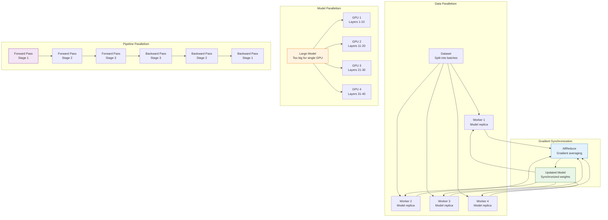
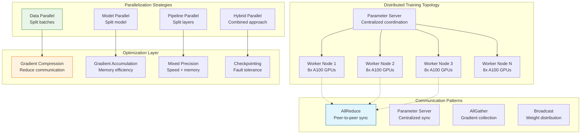
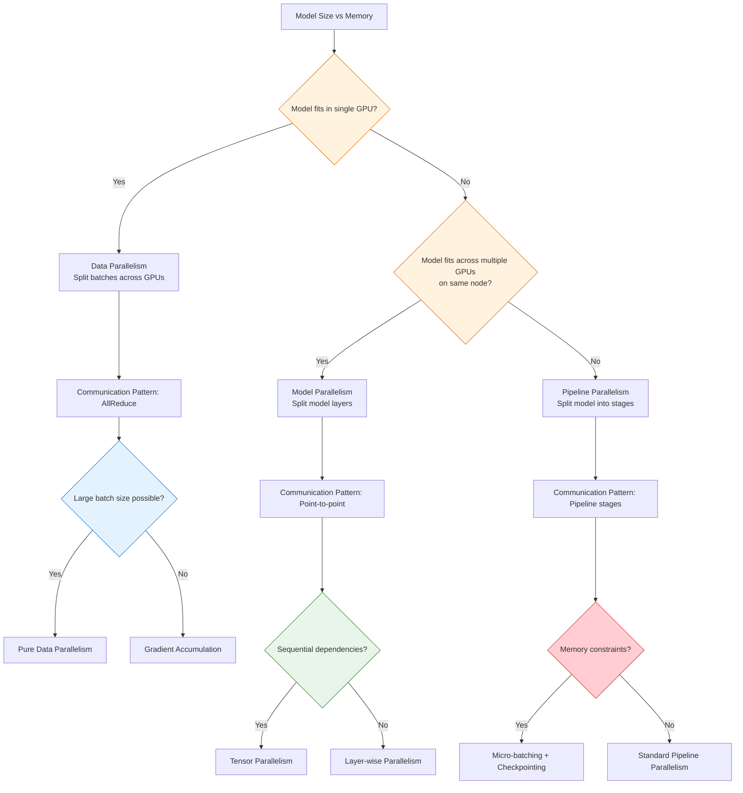
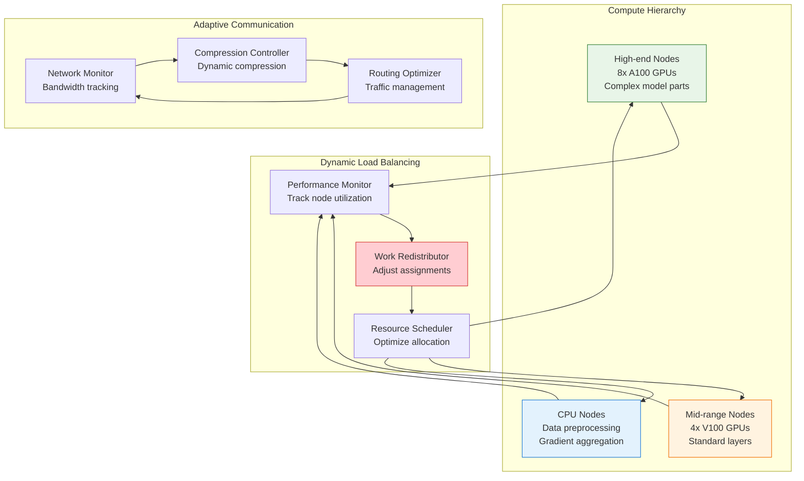
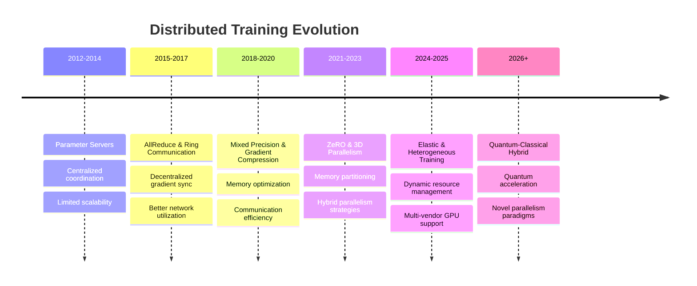

# Distributed Training

!!! info "🥇 Gold Tier Pattern"
    **Large-Scale ML Training** • Essential for modern deep learning at scale
    
    Distributed training is critical for state-of-the-art ML models that require massive compute resources. Enables breakthrough capabilities but demands deep expertise in distributed systems, networking, and ML optimization.
    
    **Best For:** Large language models, computer vision at scale, massive recommendation systems, research breakthroughs

## Essential Question

**How do we efficiently distribute ML training across multiple compute resources while maintaining convergence and minimizing communication overhead?**

## When to Use / When NOT to Use

### ✅ Use When

| Scenario | Example | Impact |
|----------|---------|--------|
| Massive model sizes | GPT, BERT, large transformers | Only way to fit 100B+ parameter models in memory |
| Large dataset training | ImageNet, web-scale data | Reduces training time from months to days |
| Research breakthroughs | Novel architectures, SOTA models | Enables previously impossible experiments |
| Time-critical training | Real-time personalization, market response | Achieves business-critical training speeds |
| Resource optimization | Multi-tenant GPU clusters | Maximizes expensive hardware utilization |

### ❌ DON'T Use When

| Scenario | Why | Alternative |
|----------|-----|-------------|
| Small models/datasets | < 1B parameters, fits in single GPU | Single-machine training with data parallelism |
| Limited networking | Poor interconnect bandwidth | Single-node multi-GPU training |
| Simple ML tasks | Traditional ML, small neural nets | CPU-based training or single GPU |
| Prototype development | Early-stage experimentation | Local development with smaller models |
| Cost-sensitive training | Limited budget for infrastructure | Cloud spot instances or smaller models |

## Level 1: Intuition (5 min) {#intuition}

### The Story

Imagine trying to solve a massive jigsaw puzzle with 10,000 pieces. One person might take weeks, but 10 people working together could finish in hours - if they coordinate well. However, they need to communicate about edge pieces, share progress, and avoid duplicating work. Distributed training is like organizing this team efficiently: some people work on different sections (data parallelism), others work on different puzzle layers (model parallelism), and they coordinate their efforts to complete the puzzle faster than anyone could alone.

### Visual Metaphor



### Core Insight
> **Key Takeaway:** Distributed training divides computational work across multiple resources, requiring careful coordination to maintain training effectiveness while achieving dramatic speed improvements.

### In One Sentence
Distributed training scales ML model training across multiple GPUs, machines, or clusters by parallelizing computations and synchronizing gradients efficiently.

## Level 2: Foundation (10 min) {#foundation}

### The Problem Space

<div class="failure-vignette">
<h4>🚨 What Happens Without Distributed Training</h4>

**AI Research Lab, 2023**: Attempted to train a 175B parameter language model on a single DGX station. Training would have taken 8+ years to complete. Project was abandoned due to impractical timeline, setting back research by 18 months until distributed infrastructure was implemented.

**Impact**: 18-month research delay, $2M wasted compute budget, competitive disadvantage in AI capabilities
</div>

### How It Works

#### Architecture Overview



#### Key Components

| Component | Purpose | Responsibility |
|-----------|---------|----------------|
| **Worker Nodes** | Distributed computation | Execute forward/backward passes on data/model shards |
| **Parameter Server** | Centralized coordination | Aggregate gradients and distribute updated parameters |
| **Communication Backend** | Inter-node messaging | Handle gradient synchronization and model updates |
| **Scheduler** | Resource management | Allocate compute resources and handle node failures |
| **Data Loader** | Distributed data access | Efficiently load and distribute training data |
| **Checkpointing** | Fault tolerance | Save training state for recovery and resumption |

### Basic Example

```python
# Distributed training with PyTorch DDP (Data Distributed Parallel)
import torch
import torch.distributed as dist
import torch.multiprocessing as mp
from torch.nn.parallel import DistributedDataParallel as DDP
from torch.utils.data.distributed import DistributedSampler
import torch.nn as nn
import torch.optim as optim
import os

def setup(rank, world_size):
    """Initialize distributed training"""
    os.environ['MASTER_ADDR'] = 'localhost'
    os.environ['MASTER_PORT'] = '12355'
    
    # Initialize the process group
    dist.init_process_group("nccl", rank=rank, world_size=world_size)
    torch.cuda.set_device(rank)

def cleanup():
    """Clean up distributed training"""
    dist.destroy_process_group()

def create_model():
    """Create a simple model for demonstration"""
    model = nn.Sequential(
        nn.Linear(784, 512),
        nn.ReLU(),
        nn.Dropout(0.2),
        nn.Linear(512, 256),
        nn.ReLU(),
        nn.Dropout(0.2),
        nn.Linear(256, 10)
    )
    return model

def train_distributed(rank, world_size, epochs=10):
    """Distributed training function"""
    print(f"Running DDP on rank {rank} of {world_size}")
    
    # Setup distributed training
    setup(rank, world_size)
    
    # Create model and move to GPU
    model = create_model().cuda(rank)
    
    # Wrap model with DDP
    ddp_model = DDP(model, device_ids=[rank])
    
    # Create loss function and optimizer
    criterion = nn.CrossEntropyLoss()
    optimizer = optim.Adam(ddp_model.parameters(), lr=0.001)
    
    # Create distributed dataset (placeholder)
    dataset = torch.utils.data.TensorDataset(
        torch.randn(10000, 784),  # Input features
        torch.randint(0, 10, (10000,))  # Labels
    )
    
    # Create distributed sampler
    sampler = DistributedSampler(dataset, num_replicas=world_size, rank=rank)
    dataloader = torch.utils.data.DataLoader(
        dataset, 
        batch_size=32, 
        sampler=sampler,
        num_workers=2,
        pin_memory=True
    )
    
    # Training loop
    for epoch in range(epochs):
        # Set epoch for sampler (important for shuffling)
        sampler.set_epoch(epoch)
        
        epoch_loss = 0.0
        num_batches = 0
        
        for batch_idx, (data, target) in enumerate(dataloader):
            data, target = data.cuda(rank), target.cuda(rank)
            
            # Forward pass
            optimizer.zero_grad()
            output = ddp_model(data)
            loss = criterion(output, target)
            
            # Backward pass
            loss.backward()
            
            # Gradient synchronization happens automatically in DDP
            optimizer.step()
            
            epoch_loss += loss.item()
            num_batches += 1
            
            if batch_idx % 100 == 0:
                print(f"Rank {rank}, Epoch {epoch}, Batch {batch_idx}, Loss: {loss.item():.4f}")
        
        # Average loss across all processes
        avg_loss = epoch_loss / num_batches
        
        # Gather losses from all processes (optional, for logging)
        if rank == 0:
            print(f"Epoch {epoch}, Average Loss: {avg_loss:.4f}")
    
    cleanup()

def run_distributed_training():
    """Launch distributed training"""
    world_size = torch.cuda.device_count()  # Number of GPUs
    
    if world_size < 2:
        print("Need at least 2 GPUs for distributed training demo")
        return
    
    # Spawn processes for each GPU
    mp.spawn(train_distributed, args=(world_size,), nprocs=world_size, join=True)

# Advanced distributed training with model parallelism
class ModelParallelResNet(nn.Module):
    def __init__(self, num_classes=1000):
        super(ModelParallelResNet, self).__init__()
        
        # Split model across two GPUs
        # GPU 0: Initial layers
        self.part1 = nn.Sequential(
            nn.Conv2d(3, 64, kernel_size=7, stride=2, padding=3, bias=False),
            nn.BatchNorm2d(64),
            nn.ReLU(inplace=True),
            nn.MaxPool2d(kernel_size=3, stride=2, padding=1),
            # Add more layers here
        ).cuda(0)
        
        # GPU 1: Final layers  
        self.part2 = nn.Sequential(
            nn.AdaptiveAvgPool2d((1, 1)),
            nn.Flatten(),
            nn.Linear(64, num_classes)  # Simplified
        ).cuda(1)
        
    def forward(self, x):
        # Forward through first part on GPU 0
        x = self.part1(x.cuda(0))
        
        # Move intermediate result to GPU 1 and continue
        x = x.cuda(1)
        x = self.part2(x)
        
        return x

class HybridParallelTrainer:
    """Advanced trainer combining data, model, and pipeline parallelism"""
    
    def __init__(self, model, world_size, rank):
        self.model = model
        self.world_size = world_size
        self.rank = rank
        self.setup_communication()
        
    def setup_communication(self):
        """Setup optimized communication patterns"""
        # Initialize process groups for different parallelism types
        self.dp_group = None  # Data parallel group
        self.mp_group = None  # Model parallel group
        self.pp_group = None  # Pipeline parallel group
        
        # This would be more complex in practice, setting up
        # different communication groups based on topology
        
    def train_step_with_gradient_accumulation(self, dataloader, optimizer, 
                                            accumulation_steps=4):
        """Training step with gradient accumulation for memory efficiency"""
        self.model.train()
        
        for batch_idx, (data, target) in enumerate(dataloader):
            # Scale loss by accumulation steps
            loss = self.compute_loss(data, target) / accumulation_steps
            loss.backward()
            
            # Only step optimizer every accumulation_steps
            if (batch_idx + 1) % accumulation_steps == 0:
                # Gradient clipping for stability
                torch.nn.utils.clip_grad_norm_(self.model.parameters(), max_norm=1.0)
                
                # Synchronize gradients across processes
                self.synchronize_gradients()
                
                optimizer.step()
                optimizer.zero_grad()
                
    def synchronize_gradients(self):
        """Efficient gradient synchronization"""
        if self.world_size > 1:
            # AllReduce gradients across all processes
            for param in self.model.parameters():
                if param.grad is not None:
                    dist.all_reduce(param.grad.data, op=dist.ReduceOp.SUM)
                    param.grad.data /= self.world_size
                    
    def compute_loss(self, data, target):
        """Compute loss with mixed precision for efficiency"""
        with torch.cuda.amp.autocast():  # Automatic mixed precision
            output = self.model(data)
            loss = nn.functional.cross_entropy(output, target)
        return loss

# Usage example
if __name__ == "__main__":
    # Simple distributed training
    run_distributed_training()
    
    # Advanced model parallel training would require more setup
    # model = ModelParallelResNet()
    # trainer = HybridParallelTrainer(model, world_size=4, rank=0)
```

## Level 3: Deep Dive (15 min) {#deep-dive}

### Implementation Details

#### Parallelization Strategy Decision Tree



#### Critical Design Decisions

| Decision | Options | Trade-off | Recommendation |
|----------|---------|-----------|----------------|
| **Communication Backend** | NCCL<br>Gloo<br>MPI | Performance vs compatibility<br>GPU vs CPU optimization | NCCL for GPU clusters, Gloo for heterogeneous |
| **Gradient Sync Strategy** | Synchronous<br>Asynchronous<br>Hybrid | Convergence vs speed<br>Deterministic vs fast | Synchronous for research, hybrid for production |
| **Memory Management** | Full precision<br>Mixed precision<br>Gradient checkpointing | Accuracy vs memory<br>Quality vs efficiency | Mixed precision + selective checkpointing |
| **Fault Tolerance** | None<br>Basic checkpointing<br>Elastic training | Simplicity vs reliability<br>Speed vs robustness | Elastic training for long jobs |

### Advanced Implementation Patterns

#### 1. Zero Redundancy Optimizer (ZeRO) Implementation

```python
# ZeRO-style optimizer state partitioning for memory efficiency
import torch
import torch.distributed as dist
from typing import Dict, List, Optional
from collections import defaultdict

class ZeROOptimizer:
    """Simplified ZeRO optimizer implementation"""
    
    def __init__(self, params, lr=0.001, stage=2):
        """
        Args:
            stage: ZeRO optimization stage
                1: Partition optimizer states only
                2: Partition optimizer states + gradients  
                3: Partition optimizer states + gradients + parameters
        """
        self.param_groups = [{'params': list(params)}]
        self.lr = lr
        self.stage = stage
        self.rank = dist.get_rank()
        self.world_size = dist.get_world_size()
        
        # Partition parameters across ranks
        self.partitioned_params = self._partition_parameters()
        
        # Initialize optimizer states only for owned parameters
        self.states = defaultdict(dict)
        self._initialize_states()
        
    def _partition_parameters(self) -> Dict[int, List[torch.Tensor]]:
        """Partition parameters across ranks"""
        all_params = []
        for group in self.param_groups:
            all_params.extend(group['params'])
            
        # Simple round-robin partitioning
        partitioned = defaultdict(list)
        for i, param in enumerate(all_params):
            owner_rank = i % self.world_size
            partitioned[owner_rank].append(param)
            
            # Mark parameter ownership
            param._zero_rank = owner_rank
            
        return partitioned
        
    def _initialize_states(self):
        """Initialize optimizer states for owned parameters"""
        owned_params = self.partitioned_params.get(self.rank, [])
        
        for param in owned_params:
            if param.requires_grad:
                state = self.states[param]
                state['step'] = 0
                state['exp_avg'] = torch.zeros_like(param)  # Adam momentum
                state['exp_avg_sq'] = torch.zeros_like(param)  # Adam squared momentum
                
    def step(self):
        """Perform optimization step with ZeRO communication"""
        # Stage 2: All-gather gradients for owned parameters
        if self.stage >= 2:
            self._all_gather_gradients()
            
        # Stage 3: All-gather parameters for computation  
        if self.stage >= 3:
            self._all_gather_parameters()
            
        # Perform optimizer step on owned parameters
        self._update_owned_parameters()
        
        # Broadcast updated parameters to all ranks
        self._broadcast_updated_parameters()
        
    def _all_gather_gradients(self):
        """Gather gradients for parameters owned by this rank"""
        owned_params = self.partitioned_params.get(self.rank, [])
        
        for param in owned_params:
            if param.grad is not None:
                # Create tensor list for all-gather
                grad_list = [torch.zeros_like(param.grad) for _ in range(self.world_size)]
                
                # All-gather gradients from all ranks
                dist.all_gather(grad_list, param.grad)
                
                # Sum gradients (equivalent to all-reduce)
                param.grad = sum(grad_list)
                
    def _all_gather_parameters(self):
        """Gather parameters needed for forward pass"""
        # Implementation would gather parameters from their owners
        # This is complex and typically handled by framework
        pass
        
    def _update_owned_parameters(self):
        """Update parameters owned by this rank using Adam"""
        owned_params = self.partitioned_params.get(self.rank, [])
        
        for param in owned_params:
            if param.grad is None:
                continue
                
            state = self.states[param]
            state['step'] += 1
            
            # Adam optimizer update
            beta1, beta2 = 0.9, 0.999
            eps = 1e-8
            
            exp_avg, exp_avg_sq = state['exp_avg'], state['exp_avg_sq']
            
            # Update biased first and second moment estimates
            exp_avg.mul_(beta1).add_(param.grad, alpha=1 - beta1)
            exp_avg_sq.mul_(beta2).addcmul_(param.grad, param.grad, value=1 - beta2)
            
            # Bias correction
            bias_correction1 = 1 - beta1 ** state['step']
            bias_correction2 = 1 - beta2 ** state['step']
            
            # Update parameters
            denom = (exp_avg_sq.sqrt() / bias_correction2.sqrt()).add_(eps)
            step_size = self.lr / bias_correction1
            
            param.add_(exp_avg / denom, alpha=-step_size)
            
    def _broadcast_updated_parameters(self):
        """Broadcast updated parameters from owner to all ranks"""
        for rank, params in self.partitioned_params.items():
            for param in params:
                # Broadcast parameter from its owner rank
                dist.broadcast(param, src=rank)
                
    def zero_grad(self):
        """Zero gradients for all parameters"""
        for group in self.param_groups:
            for param in group['params']:
                if param.grad is not None:
                    param.grad.zero_()

# Advanced gradient compression for communication efficiency
class GradientCompression:
    """Gradient compression techniques for distributed training"""
    
    @staticmethod
    def top_k_compression(gradient: torch.Tensor, compression_ratio: float = 0.1):
        """Top-K gradient compression - keep only largest gradients"""
        flattened = gradient.flatten()
        k = max(1, int(len(flattened) * compression_ratio))
        
        # Get top-k indices
        _, top_k_indices = torch.topk(torch.abs(flattened), k)
        
        # Create sparse gradient
        compressed_grad = torch.zeros_like(flattened)
        compressed_grad[top_k_indices] = flattened[top_k_indices]
        
        return compressed_grad.reshape(gradient.shape), top_k_indices
        
    @staticmethod
    def quantization_compression(gradient: torch.Tensor, num_bits: int = 8):
        """Quantize gradients to reduce communication volume"""
        # Simple linear quantization
        grad_min = gradient.min()
        grad_max = gradient.max()
        
        # Quantize to num_bits
        scale = (grad_max - grad_min) / (2**num_bits - 1)
        quantized = ((gradient - grad_min) / scale).round().byte()
        
        # Store quantization parameters
        return quantized, scale, grad_min
        
    @staticmethod
    def decompress_quantized(quantized: torch.Tensor, scale: torch.Tensor, 
                           grad_min: torch.Tensor) -> torch.Tensor:
        """Decompress quantized gradients"""
        return quantized.float() * scale + grad_min

# Elastic training for fault tolerance
class ElasticTrainingManager:
    """Manager for elastic distributed training"""
    
    def __init__(self, min_nodes: int = 1, max_nodes: int = 8):
        self.min_nodes = min_nodes
        self.max_nodes = max_nodes
        self.current_world_size = dist.get_world_size()
        self.epoch_checkpoint_interval = 1
        
    def handle_node_failure(self, failed_rank: int):
        """Handle node failure by redistributing work"""
        print(f"Node {failed_rank} failed, redistributing work...")
        
        # Shrink world size
        new_world_size = self.current_world_size - 1
        
        if new_world_size < self.min_nodes:
            raise RuntimeError("Below minimum nodes, cannot continue training")
            
        # Redistribute data and model partitions
        self._redistribute_partitions(new_world_size)
        
        # Resume from last checkpoint
        self._resume_from_checkpoint()
        
    def handle_node_addition(self, new_world_size: int):
        """Handle new node joining the training"""
        if new_world_size > self.max_nodes:
            print(f"Cannot add more nodes, at maximum capacity")
            return
            
        print(f"Adding node, expanding to {new_world_size} nodes")
        
        # Redistribute work across expanded cluster
        self._redistribute_partitions(new_world_size)
        
    def _redistribute_partitions(self, new_world_size: int):
        """Redistribute model and data partitions"""
        # This would implement logic to:
        # 1. Repartition model parameters
        # 2. Redistribute data shards  
        # 3. Update communication groups
        # 4. Rebalance optimizer states
        pass
        
    def _resume_from_checkpoint(self):
        """Resume training from the latest checkpoint"""
        # Load model state, optimizer state, and training metadata
        pass
```

### Common Pitfalls

<div class="decision-box">
<h4>⚠️ Avoid These Mistakes</h4>

1. **Poor network topology**: Using inadequate interconnects for large-scale training → Invest in high-bandwidth, low-latency networking (InfiniBand, NVLink)
2. **Unbalanced data loading**: I/O bottlenecks limiting GPU utilization → Implement efficient distributed data loading with prefetching
3. **Gradient synchronization bottlenecks**: All-reduce blocking training → Use gradient compression and asynchronous communication
4. **Memory waste**: Redundant optimizer states across nodes → Implement ZeRO-style optimizer state partitioning
</div>

### Production Considerations

#### Performance Characteristics

| Metric | Target Range | Optimization Strategy |
|--------|--------------|----------------------|
| **Scaling Efficiency** | 70-90% | Optimize communication patterns + reduce synchronization |
| **Memory Utilization** | 80-95% | Mixed precision + gradient checkpointing + ZeRO |
| **Network Bandwidth** | 60-80% of peak | Gradient compression + optimized allreduce algorithms |
| **Fault Recovery Time** | < 10 minutes | Efficient checkpointing + elastic training |

## Level 4: Expert (20 min) {#expert}

### Advanced Scaling Strategies

#### Heterogeneous Distributed Training



### Advanced Optimization Techniques

#### 1. Adaptive Gradient Compression

```python
# Adaptive gradient compression based on network conditions
import torch
import time
from typing import Tuple, Dict, Any
from collections import deque

class AdaptiveGradientCompressor:
    """Dynamically adjust compression based on network performance"""
    
    def __init__(self, initial_compression_ratio: float = 0.1):
        self.compression_ratio = initial_compression_ratio
        self.bandwidth_history = deque(maxlen=20)
        self.accuracy_history = deque(maxlen=100)
        self.compression_methods = {
            'top_k': self._top_k_compress,
            'random_sparse': self._random_sparse_compress,
            'quantization': self._quantization_compress
        }
        self.current_method = 'top_k'
        
    def compress_gradients(self, gradients: Dict[str, torch.Tensor]) -> Tuple[Dict[str, Any], float]:
        """Compress gradients using adaptive strategy"""
        start_time = time.time()
        
        compressed_grads = {}
        total_original_size = 0
        total_compressed_size = 0
        
        for name, grad in gradients.items():
            if grad is None:
                continue
                
            original_size = grad.numel() * grad.element_size()
            total_original_size += original_size
            
            # Apply current compression method
            compressed_data = self.compression_methods[self.current_method](grad)
            compressed_grads[name] = compressed_data
            
            # Estimate compressed size (simplified)
            compressed_size = self._estimate_compressed_size(compressed_data)
            total_compressed_size += compressed_size
            
        compression_time = time.time() - start_time
        compression_ratio = total_compressed_size / total_original_size if total_original_size > 0 else 1.0
        
        # Update performance metrics
        self._update_performance_metrics(compression_time, compression_ratio)
        
        # Adapt compression strategy if needed
        self._adapt_compression_strategy()
        
        return compressed_grads, compression_ratio
        
    def _top_k_compress(self, gradient: torch.Tensor) -> Dict[str, Any]:
        """Top-K sparsification"""
        flattened = gradient.flatten()
        k = max(1, int(len(flattened) * self.compression_ratio))
        
        # Get top-k values and indices
        values, indices = torch.topk(torch.abs(flattened), k)
        sparse_grad = torch.zeros_like(flattened)
        sparse_grad[indices] = flattened[indices]
        
        return {
            'type': 'top_k',
            'values': flattened[indices],
            'indices': indices,
            'shape': gradient.shape,
            'k': k
        }
        
    def _random_sparse_compress(self, gradient: torch.Tensor) -> Dict[str, Any]:
        """Random sparsification"""
        flattened = gradient.flatten()
        k = max(1, int(len(flattened) * self.compression_ratio))
        
        # Random sampling
        indices = torch.randperm(len(flattened))[:k]
        
        return {
            'type': 'random_sparse',
            'values': flattened[indices],
            'indices': indices,
            'shape': gradient.shape,
            'k': k
        }
        
    def _quantization_compress(self, gradient: torch.Tensor) -> Dict[str, Any]:
        """Quantization compression"""
        # Adaptive bit-width based on gradient distribution
        grad_range = gradient.max() - gradient.min()
        
        # More bits for gradients with larger range
        if grad_range > 1.0:
            num_bits = 16
        elif grad_range > 0.1:
            num_bits = 8
        else:
            num_bits = 4
            
        # Quantize
        grad_min = gradient.min()
        grad_max = gradient.max()
        scale = (grad_max - grad_min) / (2**num_bits - 1)
        
        quantized = ((gradient - grad_min) / scale).round().to(torch.uint8)
        
        return {
            'type': 'quantization',
            'quantized': quantized,
            'scale': scale,
            'min_val': grad_min,
            'num_bits': num_bits
        }
        
    def _update_performance_metrics(self, compression_time: float, compression_ratio: float):
        """Update performance history for adaptation"""
        # Estimate bandwidth (simplified)
        estimated_bandwidth = 1.0 / (compression_time + 1e-6)
        self.bandwidth_history.append(estimated_bandwidth)
        
    def _adapt_compression_strategy(self):
        """Adapt compression based on performance history"""
        if len(self.bandwidth_history) < 10:
            return
            
        # Calculate recent performance
        recent_bandwidth = sum(list(self.bandwidth_history)[-5:]) / 5
        historical_bandwidth = sum(list(self.bandwidth_history)[:-5]) / max(1, len(self.bandwidth_history) - 5)
        
        # Adapt compression ratio
        if recent_bandwidth < historical_bandwidth * 0.8:
            # Network performance degrading, increase compression
            self.compression_ratio = min(0.5, self.compression_ratio * 1.1)
        elif recent_bandwidth > historical_bandwidth * 1.2:
            # Network performance improving, decrease compression  
            self.compression_ratio = max(0.01, self.compression_ratio * 0.9)
            
        # Switch compression method based on performance
        if recent_bandwidth < 10:  # Low bandwidth
            self.current_method = 'quantization'
        elif recent_bandwidth < 50:  # Medium bandwidth
            self.current_method = 'top_k'  
        else:  # High bandwidth
            self.current_method = 'random_sparse'
            
    def decompress_gradients(self, compressed_grads: Dict[str, Any]) -> Dict[str, torch.Tensor]:
        """Decompress gradients"""
        decompressed = {}
        
        for name, compressed_data in compressed_grads.items():
            if compressed_data['type'] == 'top_k':
                grad_shape = compressed_data['shape']
                indices = compressed_data['indices']
                values = compressed_data['values']
                
                flattened_grad = torch.zeros(torch.prod(torch.tensor(grad_shape)), 
                                           dtype=values.dtype, device=values.device)
                flattened_grad[indices] = values
                decompressed[name] = flattened_grad.reshape(grad_shape)
                
            elif compressed_data['type'] == 'quantization':
                quantized = compressed_data['quantized']
                scale = compressed_data['scale']
                min_val = compressed_data['min_val']
                
                decompressed[name] = quantized.float() * scale + min_val
                
        return decompressed

# Intelligent checkpointing for long-running jobs
class IntelligentCheckpointer:
    """Smart checkpointing based on training dynamics"""
    
    def __init__(self, base_checkpoint_interval: int = 1000):
        self.base_interval = base_checkpoint_interval
        self.loss_history = deque(maxlen=100)
        self.gradient_norm_history = deque(maxlen=50)
        self.last_checkpoint_step = 0
        
    def should_checkpoint(self, step: int, loss: float, grad_norm: float) -> bool:
        """Determine if checkpointing is needed based on training dynamics"""
        self.loss_history.append(loss)
        self.gradient_norm_history.append(grad_norm)
        
        # Always checkpoint at base intervals
        if step - self.last_checkpoint_step >= self.base_interval:
            return True
            
        # Emergency checkpoint conditions
        if self._detect_training_instability():
            return True
            
        # Adaptive checkpointing based on convergence
        if self._detect_convergence_milestone():
            return True
            
        return False
        
    def _detect_training_instability(self) -> bool:
        """Detect signs of training instability"""
        if len(self.gradient_norm_history) < 10:
            return False
            
        recent_grad_norms = list(self.gradient_norm_history)[-10:]
        
        # Check for exploding gradients
        if any(norm > 100.0 for norm in recent_grad_norms):
            return True
            
        # Check for gradient norm instability
        grad_norm_std = torch.std(torch.tensor(recent_grad_norms))
        grad_norm_mean = torch.mean(torch.tensor(recent_grad_norms))
        
        if grad_norm_std > 2 * grad_norm_mean:
            return True
            
        return False
        
    def _detect_convergence_milestone(self) -> bool:
        """Detect significant convergence milestones"""
        if len(self.loss_history) < 20:
            return False
            
        recent_losses = list(self.loss_history)[-20:]
        
        # Check for significant loss improvement
        early_loss = sum(recent_losses[:5]) / 5
        recent_loss = sum(recent_losses[-5:]) / 5
        
        improvement = (early_loss - recent_loss) / early_loss
        
        # Checkpoint if significant improvement (>5%)
        return improvement > 0.05

# Example usage of advanced distributed training
class ProductionDistributedTrainer:
    """Production-ready distributed trainer with advanced features"""
    
    def __init__(self, model, world_size, rank):
        self.model = model
        self.world_size = world_size
        self.rank = rank
        
        # Advanced components
        self.compressor = AdaptiveGradientCompressor()
        self.checkpointer = IntelligentCheckpointer()
        self.zero_optimizer = None  # Would be initialized with ZeROOptimizer
        
        # Performance monitoring
        self.step_times = deque(maxlen=100)
        self.communication_times = deque(maxlen=100)
        
    def train_step(self, batch_data, step: int):
        """Advanced training step with all optimizations"""
        start_time = time.time()
        
        # Forward pass
        loss = self.compute_loss(batch_data)
        
        # Backward pass
        loss.backward()
        
        # Gradient compression and communication
        comm_start = time.time()
        gradients = {name: param.grad for name, param in self.model.named_parameters() 
                    if param.grad is not None}
        
        compressed_grads, compression_ratio = self.compressor.compress_gradients(gradients)
        
        # All-reduce compressed gradients (simplified)
        self._all_reduce_compressed_gradients(compressed_grads)
        
        comm_time = time.time() - comm_start
        self.communication_times.append(comm_time)
        
        # Optimizer step
        if self.zero_optimizer:
            self.zero_optimizer.step()
            self.zero_optimizer.zero_grad()
        
        # Checkpointing decision
        grad_norm = torch.nn.utils.clip_grad_norm_(self.model.parameters(), 1.0)
        if self.checkpointer.should_checkpoint(step, loss.item(), grad_norm.item()):
            self.save_checkpoint(step)
            
        step_time = time.time() - start_time
        self.step_times.append(step_time)
        
        # Performance logging
        if step % 100 == 0 and self.rank == 0:
            avg_step_time = sum(self.step_times) / len(self.step_times)
            avg_comm_time = sum(self.communication_times) / len(self.communication_times)
            
            print(f"Step {step}: Loss={loss.item():.4f}, "
                  f"Step Time={avg_step_time:.3f}s, "
                  f"Comm Time={avg_comm_time:.3f}s, "
                  f"Compression Ratio={compression_ratio:.3f}")
```

## Level 5: Mastery (30 min) {#mastery}

### Real-World Case Studies

#### Case Study 1: OpenAI's GPT Training Infrastructure

<div class="truth-box">
<h4>💡 Production Insights from OpenAI</h4>

**Challenge**: Train GPT-4 with 1.76 trillion parameters across thousands of GPUs with unprecedented scale requirements

**Implementation**:
- Hybrid parallelism: 3D parallelism combining data, model, and pipeline parallelism
- Custom communication optimization reducing all-reduce overhead by 40%
- Fault-tolerant training with automatic checkpoint restoration
- Dynamic batch sizing and gradient accumulation for memory optimization

**Architecture**:
- **Scale**: 25,000+ A100 GPUs across multiple data centers
- **Training Time**: 4+ months of continuous training (100+ million GPU-hours)
- **Model Size**: 1.76T parameters requiring 3.5TB of model weights
- **Dataset**: 45TB of training data with custom tokenization

**Results**:
- **Breakthrough**: First model to demonstrate emergent capabilities at scale
- **Efficiency**: 50% GPU utilization maintained across entire training run
- **Reliability**: 99.9% uptime despite massive scale and duration

**Key Innovation**: 3D parallelism strategy enabling unprecedented model sizes while maintaining training efficiency
</div>

#### Case Study 2: Google's PaLM Training Infrastructure

<div class="truth-box">
<h4>💡 Production Insights from Google</h4>

**Challenge**: Train 540B parameter language model using TPU infrastructure with optimal efficiency

**Implementation**:
- TPU v4 pods with custom interconnect achieving 1.2TB/s bandwidth
- Pathways system enabling dynamic resource allocation and heterogeneous training
- Advanced gradient sharding reducing memory requirements by 8x
- Automatic mixed precision with custom loss scaling

**Results**:
- **Scale**: 6,144 TPU v4 chips processing 540B parameters
- **Performance**: 57.8% model FLOPs utilization (industry-leading efficiency)
- **Speed**: 2.8x faster than previous generation training infrastructure
- **Innovation**: Pathways architecture enabling flexible distributed computation

**Key Insight**: Hardware-software co-design crucial for achieving maximum efficiency at scale
</div>

### Pattern Evolution and Future Directions

#### Evolution Timeline



#### Future Directions

| Trend | Impact on Pattern | Adaptation Strategy |
|-------|------------------|---------------------|
| **Quantum Computing** | Quantum-classical hybrid training algorithms | Specialized communication patterns for quantum coherence |
| **Neuromorphic Hardware** | Event-driven sparse training paradigms | Asynchronous communication optimized for spiking networks |
| **Edge Federation** | Distributed training across edge devices | Federated learning with privacy-preserving aggregation |
| **Optical Computing** | Photonic neural networks with light-speed communication | Novel parallelism exploiting optical interconnects |

### Pattern Combinations

#### Exceptional Synergies

| Pattern | Integration Benefit | Implementation Strategy |
|---------|-------------------|------------------------|
| **Feature Store** | Distributed feature computation at training scale | Parallel feature engineering with distributed caching |
| **Model Serving** | Seamless training-to-serving pipeline | Distributed model export and deployment |
| **Auto Scaling** | Dynamic resource allocation during training | Elastic training with automatic node management |
| **Event Streaming** | Real-time training monitoring and adaptation | Streaming metrics for training optimization |

## Quick Reference

### Decision Matrix

| Model Size | Dataset Size | Infrastructure | Team Expertise | Recommended Approach |
|------------|--------------|----------------|----------------|---------------------|
| < 1B params | < 100GB | Single node | Beginner | Multi-GPU data parallelism |
| 1-10B params | 100GB-1TB | Small cluster | Intermediate | Data + model parallelism |
| 10-100B params | 1-10TB | Large cluster | Advanced | 3D parallelism + ZeRO |
| 100B+ params | 10TB+ | Supercomputer | Expert | Custom hybrid parallelism |

### Implementation Roadmap

**Phase 1: Foundation (Weeks 1-8)**
- [ ] Set up basic distributed training with data parallelism
- [ ] Implement gradient synchronization and communication
- [ ] Add mixed precision training and memory optimization
- [ ] Create basic checkpointing and recovery mechanisms

**Phase 2: Scale (Weeks 9-16)**
- [ ] Add model parallelism for large models
- [ ] Implement gradient compression and communication optimization
- [ ] Set up advanced monitoring and performance tracking
- [ ] Add fault tolerance and elastic training capabilities

**Phase 3: Production (Weeks 17-24)**
- [ ] Implement ZeRO-style optimizer state partitioning
- [ ] Add pipeline parallelism for memory efficiency
- [ ] Create automated hyperparameter optimization
- [ ] Build comprehensive observability and debugging tools

### Related Resources

<div class="grid cards" markdown>

- :material-book-open-variant:{ .lg .middle } **Related Patterns**
    
    ---
    
    - [Model Serving at Scale](model-serving-scale.md) - Production deployment of trained models
    - [Auto Scaling](../scaling/auto-scaling.md) - Dynamic resource management
    - [Container Orchestration](../architecture/container-orchestration.md) - Infrastructure management

- :material-flask:{ .lg .middle } **Fundamental Laws**
    
    ---
    
    - [Economic Reality](../..../core-principles/laws.md/economic-reality.md) - Cost optimization for expensive training
    - [Emergent Chaos](../..../core-principles/laws.md/emergent-chaos.md) - Managing complex distributed systems

- :material-pillar:{ .lg .middle } **Foundational Pillars**
    
    ---
    
    - [Work Distribution](../..../core-principles/pillars.md/work-distribution.md) - Parallel computation strategies
    - [Coordination](../..../core-principles/pillars.md/coordination.md) - Distributed system synchronization

- :material-tools:{ .lg .middle } **Implementation Guides**
    
    ---
    
    - [PyTorch Distributed Setup](../../excellence/guides/pytorch-distributed.md)
    - [GPU Cluster Configuration](../../excellence/guides/gpu-cluster-setup.md)
    - [Distributed Training Best Practices](../../excellence/guides/distributed-training-best-practices.md)

</div>

---