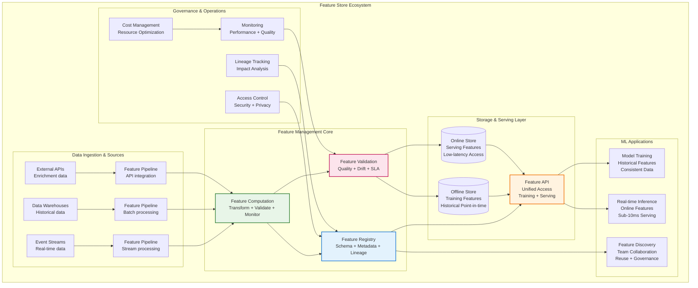
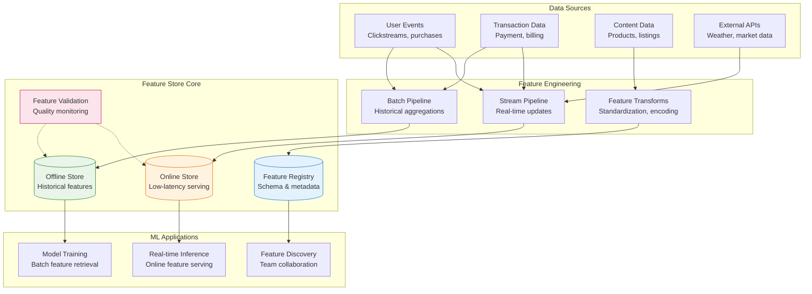
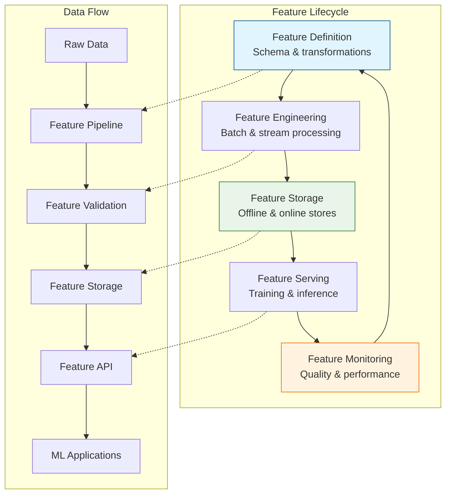
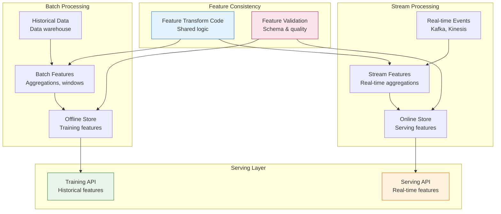
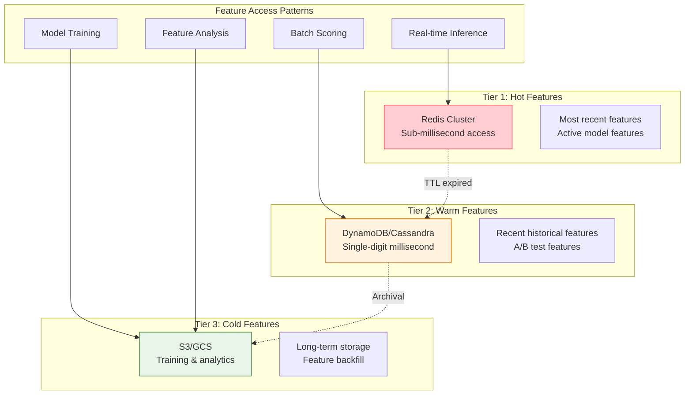
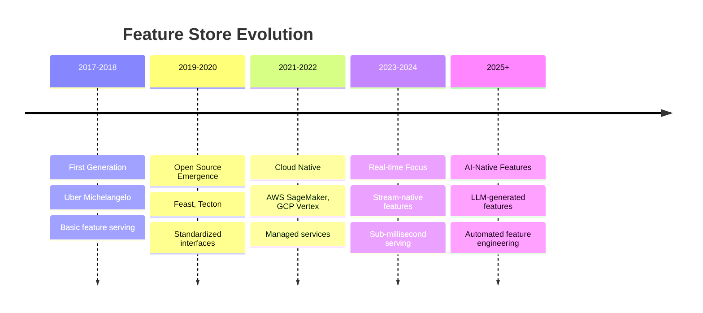

# Feature Store

## The Complete Blueprint

A feature store is the critical infrastructure pattern that transforms chaotic, duplicate feature engineering across ML teams into a unified, reusable, and governed system. This pattern centralizes the entire feature lifecycle—from definition and computation to storage and serving—ensuring that features computed once can be consistently reused across training, validation, and inference workloads. Feature stores solve the notorious "training-serving skew" problem where models degrade in production due to subtle differences between training and serving feature computation, while dramatically accelerating ML development through feature reuse and collaboration across teams.



### What You'll Master

By implementing a feature store, you'll achieve:

- **Eliminates Feature Engineering Waste**: End duplicate feature development across teams, reducing feature engineering time by 50-70% while ensuring consistency and quality across all ML applications
- **Guarantees Training-Serving Consistency**: Eliminate the 15-25% model accuracy degradation commonly caused by training-serving skew through unified feature computation paths
- **Accelerates ML Development Velocity**: Enable teams to discover, reuse, and build upon existing features, reducing time-to-production for new models from months to weeks  
- **Establishes ML Governance & Compliance**: Implement comprehensive feature lineage, access controls, and quality monitoring essential for regulated industries and enterprise ML
- **Optimizes Infrastructure Costs**: Reduce compute costs by 30-50% through shared feature computation, intelligent caching, and elimination of redundant processing across teams

## Table of Contents

- [Essential Question](#essential-question)
- [When to Use / When NOT to Use](#when-to-use-when-not-to-use)
  - [✅ Use When](#use-when)
  - [❌ DON'T Use When](#dont-use-when)
- [Level 1: Intuition (5 min) {#intuition}](#level-1-intuition-5-min-intuition)
  - [The Story](#the-story)
  - [Visual Metaphor](#visual-metaphor)
  - [Core Insight](#core-insight)
  - [In One Sentence](#in-one-sentence)
- [Level 2: Foundation (10 min) {#foundation}](#level-2-foundation-10-min-foundation)
  - [The Problem Space](#the-problem-space)
  - [How It Works](#how-it-works)
  - [Basic Example](#basic-example)
- [Feature store implementation with Feast (open source)](#feature-store-implementation-with-feast-open-source)
- [Define entities (primary keys for features)](#define-entities-primary-keys-for-features)
- [Define feature views (logical grouping of features)](#define-feature-views-logical-grouping-of-features)
- [Initialize feature store](#initialize-feature-store)
- [Training: Get historical features for model training](#training-get-historical-features-for-model-training)
- [Serving: Get online features for real-time inference](#serving-get-online-features-for-real-time-inference)
- [Level 3: Deep Dive (15 min) {#deep-dive}](#level-3-deep-dive-15-min-deep-dive)
  - [Implementation Details](#implementation-details)
  - [Advanced Implementation Patterns](#advanced-implementation-patterns)
- [Advanced feature engineering with data quality checks](#advanced-feature-engineering-with-data-quality-checks)
- [Usage example](#usage-example)
  - [Common Pitfalls](#common-pitfalls)
  - [Production Considerations](#production-considerations)
- [Level 4: Expert (20 min) {#expert}](#level-4-expert-20-min-expert)
  - [Advanced Architecture Patterns](#advanced-architecture-patterns)
  - [Advanced Optimization Strategies](#advanced-optimization-strategies)
- [Advanced feature caching with smart invalidation](#advanced-feature-caching-with-smart-invalidation)
  - [2. Feature Drift Detection and Alerting](#2-feature-drift-detection-and-alerting)
- [Production-grade feature drift monitoring](#production-grade-feature-drift-monitoring)
  - [Scaling Considerations](#scaling-considerations)
- [Level 5: Mastery (30 min) {#mastery}](#level-5-mastery-30-min-mastery)
  - [Real-World Case Studies](#real-world-case-studies)
  - [Pattern Evolution and Future Directions](#pattern-evolution-and-future-directions)
  - [Pattern Combinations](#pattern-combinations)
- [Quick Reference](#quick-reference)
  - [Decision Matrix](#decision-matrix)
  - [Implementation Roadmap](#implementation-roadmap)
  - [Related Resources](#related-resources)

!!! info "🥇 Gold Tier Pattern"
    **ML Feature Management** • Essential for enterprise ML at scale
    
    Feature stores solve the critical challenge of feature management in production ML systems. Essential for organizations with multiple ML teams and models, but requires significant platform engineering investment.
    
    **Best For:** Multi-team ML organizations, real-time ML applications, feature-heavy models like recommendations and ranking

## Essential Question

**How do we manage and serve ML features consistently across training and inference while enabling feature reuse and maintaining data quality?**

## When to Use / When NOT to Use

### ✅ Use When

| Scenario | Example | Impact |
|----------|---------|--------|
| Multiple ML teams | 5+ teams building ML models | Prevents duplicate feature engineering across teams |
| Feature-heavy models | Recommendation systems, fraud detection | Manages 100s-1000s of features effectively |
| Training/serving consistency | Real-time ML applications | Eliminates accuracy degradation from feature skew |
| Feature reuse needs | Common user/item features | Reduces development time by 50-70% |
| Regulatory compliance | Financial services, healthcare | Provides audit trails and feature governance |

### ❌ DON'T Use When

| Scenario | Why | Alternative |
|----------|-----|-------------|
| Single ML team | < 5 people, few models | Simple data pipelines or notebooks |
| Simple feature sets | < 20 features per model | Direct database queries or APIs |
| Batch-only ML | No real-time inference | Data warehouse with scheduled ETL |
| Limited engineering resources | < 2 dedicated platform engineers | Managed ML services (SageMaker, Vertex AI) |
| Experimental ML projects | Research, proof of concepts | Local feature engineering in notebooks |

## Level 1: Intuition (5 min) {#intuition}

### The Story

Imagine a large restaurant chain where each location was creating their own ingredients from scratch - one making tomato sauce, another making pasta, all slightly different recipes. A feature store is like a central commissary kitchen that prepares high-quality ingredients once, then distributes them consistently to all restaurants. Each restaurant (ML team) can focus on creating great dishes (models) rather than recreating basic ingredients (features).

### Visual Metaphor



### Core Insight
> **Key Takeaway:** A feature store centralizes feature engineering, ensuring consistency between training and serving while enabling feature reuse across teams and models.

### In One Sentence
A feature store is a centralized platform for computing, storing, and serving ML features consistently across training and inference workloads.

## Level 2: Foundation (10 min) {#foundation}

### The Problem Space

<div class="failure-vignette">
<h4>🚨 What Happens Without a Feature Store</h4>

**Large Tech Company, 2020**: Had 15 ML teams each implementing user engagement features differently. Training/serving skew caused 23% accuracy degradation in production. Took 8 months to identify and fix inconsistencies across 40+ models.

**Impact**: 23% model accuracy loss, $5M revenue impact, 18 person-months to resolve feature consistency issues
</div>

### How It Works

#### Architecture Overview



#### Key Components

| Component | Purpose | Responsibility |
|-----------|---------|----------------|
| **Feature Registry** | Feature metadata management | Schema, lineage, documentation, discovery |
| **Offline Store** | Historical feature storage | Training data, batch jobs, feature backfill |
| **Online Store** | Low-latency feature serving | Real-time inference, sub-10ms retrieval |
| **Feature Pipeline** | Feature computation | Batch/stream processing, transformations |
| **Feature API** | Consistent access interface | Training/serving APIs, feature retrieval |
| **Monitoring** | Feature quality assurance | Data quality, freshness, performance tracking |

### Basic Example

```python
## Feature store implementation with Feast (open source)
from feast import FeatureStore, Entity, FeatureView, Field
from feast.types import Float64, Int64, String
import pandas as pd
from datetime import timedelta

## Define entities (primary keys for features)
user = Entity(name="user_id", join_keys=["user_id"])
item = Entity(name="item_id", join_keys=["item_id"])

## Define feature views (logical grouping of features)
user_features = FeatureView(
    name="user_features",
    entities=[user],
    ttl=timedelta(days=30),  # Feature freshness
    schema=[
        Field(name="age", dtype=Int64),
        Field(name="avg_rating", dtype=Float64),
        Field(name="total_purchases", dtype=Int64),
        Field(name="preferred_category", dtype=String),
    ],
    source="user_table"  # Data source
)

item_features = FeatureView(
    name="item_features", 
    entities=[item],
    ttl=timedelta(days=7),
    schema=[
        Field(name="price", dtype=Float64),
        Field(name="category", dtype=String),
        Field(name="avg_rating", dtype=Float64),
        Field(name="view_count", dtype=Int64),
    ],
    source="item_table"
)

## Initialize feature store
store = FeatureStore(repo_path=".")

## Training: Get historical features for model training
training_df = store.get_historical_features(
    entity_df=pd.DataFrame({
        "user_id": [1, 2, 3],
        "item_id": [101, 102, 103],
        "timestamp": ["2024-01-01", "2024-01-02", "2024-01-03"]
    }),
    features=["user_features:age", "user_features:avg_rating", 
             "item_features:price", "item_features:category"]
).to_df()

## Serving: Get online features for real-time inference  
online_features = store.get_online_features(
    features=["user_features:age", "item_features:price"],
    entity_rows=[{"user_id": 1, "item_id": 101}]
).to_dict()

print(f"Online features: {online_features}")
```

## Level 3: Deep Dive (15 min) {#deep-dive}

### Implementation Details

#### Feature Computation Architecture



#### Critical Design Decisions

| Decision | Options | Trade-off | Recommendation |
|----------|---------|-----------|----------------|
| **Storage Backend** | SQL Database<br>NoSQL Store<br>Hybrid | Consistency vs scale<br>ACID vs performance | Hybrid: SQL for metadata, NoSQL for features |
| **Feature Freshness** | Real-time<br>Near real-time<br>Batch | Latency vs cost<br>Complex vs simple | Near real-time (minutes) for most use cases |
| **Feature Encoding** | Schema-on-write<br>Schema-on-read | Safety vs flexibility<br>Strict vs agile | Schema-on-write for production features |
| **API Design** | REST APIs<br>gRPC<br>Native SDKs | Simplicity vs performance<br>Universal vs optimized | gRPC for high-performance, REST for simplicity |

### Advanced Implementation Patterns

#### Feature Pipeline with Data Quality

```python
## Advanced feature engineering with data quality checks
from dataclasses import dataclass
from typing import Dict, List, Any, Optional
import pandas as pd
import numpy as np
from datetime import datetime, timedelta

@dataclass
class FeatureDefinition:
    name: str
    description: str
    data_type: str
    source_tables: List[str]
    transformation_logic: str
    quality_checks: List[Dict[str, Any]]
    freshness_sla: timedelta
    
class FeaturePipeline:
    def __init__(self, feature_def: FeatureDefinition):
        self.feature_def = feature_def
        self.quality_metrics = {}
        
    def compute_feature(self, raw_data: pd.DataFrame) -> pd.DataFrame:
        """Compute feature with integrated quality checks"""
        # Apply transformation
        feature_data = self._apply_transformation(raw_data)
        
        # Run quality validations
        quality_results = self._validate_feature_quality(feature_data)
        
        if not quality_results["passed"]:
            raise ValueError(f"Feature quality check failed: {quality_results}")
            
        return feature_data
    
    def _apply_transformation(self, data: pd.DataFrame) -> pd.DataFrame:
        """Apply feature transformation logic"""
        # Example: User engagement score
        if self.feature_def.name == "user_engagement_score":
            return self._compute_engagement_score(data)
        return data
        
    def _compute_engagement_score(self, data: pd.DataFrame) -> pd.DataFrame:
        """Complex feature: user engagement score"""
        # Multi-dimensional engagement calculation
        engagement = (
            data['page_views'].fillna(0) * 0.1 +
            data['session_duration'].fillna(0) * 0.3 +  
            data['purchases'].fillna(0) * 2.0 +
            data['shares'].fillna(0) * 1.5
        )
        
        # Normalize to 0-100 scale
        engagement_normalized = np.clip(engagement / engagement.max() * 100, 0, 100)
        
        return pd.DataFrame({
            'user_id': data['user_id'],
            'engagement_score': engagement_normalized,
            'computed_at': datetime.now()
        })
    
    def _validate_feature_quality(self, data: pd.DataFrame) -> Dict[str, Any]:
        """Comprehensive feature quality validation"""
        results = {"passed": True, "checks": []}
        
        for check in self.feature_def.quality_checks:
            if check["type"] == "null_rate":
                null_rate = data.isnull().sum().sum() / len(data)
                passed = null_rate <= check["threshold"] 
                results["checks"].append({
                    "type": "null_rate",
                    "value": null_rate,
                    "threshold": check["threshold"],
                    "passed": passed
                })
                if not passed:
                    results["passed"] = False
                    
        return results

## Usage example
user_engagement_def = FeatureDefinition(
    name="user_engagement_score",
    description="Composite score measuring user engagement across platform",
    data_type="float64",
    source_tables=["user_events", "purchases", "sessions"],
    transformation_logic="weighted_sum_normalized",
    quality_checks=[
        {"type": "null_rate", "threshold": 0.05},
        {"type": "range_check", "min": 0, "max": 100}
    ],
    freshness_sla=timedelta(hours=4)
)

pipeline = FeaturePipeline(user_engagement_def)
```

### Common Pitfalls

<div class="decision-box">
<h4>⚠️ Avoid These Mistakes</h4>

1. **Training/serving skew**: Different feature computation in training vs serving → Use identical code paths for both
2. **Feature sprawl**: Unlimited feature creation without governance → Implement feature review and lifecycle management  
3. **No feature monitoring**: Undetected data quality issues → Set up continuous monitoring for feature drift and quality
4. **Over-engineering**: Complex features that are rarely used → Start simple, add complexity based on actual usage
</div>

### Production Considerations

#### Performance Characteristics

| Metric | Target Range | Optimization Strategy |
|--------|--------------|----------------------|
| **Online Latency** | 1-10ms P95 | In-memory caching + precomputation |
| **Batch Throughput** | TB/hour | Distributed processing + columnar storage |
| **Feature Freshness** | Minutes-Hours | Stream processing + incremental updates |
| **Storage Efficiency** | 70-90% compression | Feature encoding + data partitioning |

## Level 4: Expert (20 min) {#expert}

### Advanced Architecture Patterns

#### Multi-Tier Feature Store



### Advanced Optimization Strategies

#### 1. Feature Precomputation and Caching

```python
## Advanced feature caching with smart invalidation
from typing import Dict, Set, Optional
import redis
import hashlib
import json
from datetime import datetime, timedelta

class SmartFeatureCache:
    def __init__(self, redis_client: redis.Redis):
        self.redis = redis_client
        self.cache_stats = {"hits": 0, "misses": 0}
        
    def get_features(self, entity_ids: List[str], 
                    feature_names: List[str]) -> Dict[str, Dict]:
        """Get features with intelligent caching"""
        cache_key = self._build_cache_key(entity_ids, feature_names)
        
        # Try cache first
        cached_result = self.redis.get(cache_key)
        if cached_result:
            self.cache_stats["hits"] += 1
            return json.loads(cached_result)
            
        # Cache miss - compute features
        self.cache_stats["misses"] += 1
        features = self._compute_features(entity_ids, feature_names)
        
        # Cache with smart TTL based on feature characteristics
        ttl = self._calculate_smart_ttl(feature_names)
        self.redis.setex(cache_key, ttl, json.dumps(features))
        
        return features
    
    def _calculate_smart_ttl(self, feature_names: List[str]) -> int:
        """Calculate TTL based on feature update frequency"""
        feature_update_patterns = {
            "real_time": 60,      # 1 minute
            "hourly": 3600,       # 1 hour  
            "daily": 86400,       # 1 day
            "static": 604800      # 1 week
        }
        
        min_ttl = float('inf')
        for feature in feature_names:
            # Determine update pattern (simplified logic)
            if "real_time" in feature:
                min_ttl = min(min_ttl, feature_update_patterns["real_time"])
            elif "hourly" in feature:
                min_ttl = min(min_ttl, feature_update_patterns["hourly"])
            # ... other patterns
                
        return int(min_ttl) if min_ttl != float('inf') else 3600
    
    def invalidate_features(self, entity_ids: List[str], 
                           feature_names: List[str]) -> None:
        """Smart cache invalidation for updated features"""
        pattern = f"features:{':'.join(sorted(entity_ids))}:*"
        keys_to_delete = self.redis.keys(pattern)
        
        if keys_to_delete:
            self.redis.delete(*keys_to_delete)
```

### 2. Feature Drift Detection and Alerting

```python
## Production-grade feature drift monitoring
from scipy import stats
import numpy as np
from dataclasses import dataclass
from typing import Dict, List, Tuple
import logging

@dataclass 
class DriftAlert:
    feature_name: str
    drift_type: str
    severity: str
    drift_score: float
    timestamp: datetime
    description: str

class FeatureDriftMonitor:
    def __init__(self, baseline_window: int = 7, 
                 alert_threshold: float = 0.1):
        self.baseline_window = baseline_window
        self.alert_threshold = alert_threshold
        self.baseline_distributions = {}
        
    def monitor_feature_drift(self, feature_name: str, 
                            current_data: np.ndarray) -> Optional[DriftAlert]:
        """Monitor feature for distribution drift"""
        if feature_name not in self.baseline_distributions:
            self._establish_baseline(feature_name, current_data)
            return None
            
        baseline = self.baseline_distributions[feature_name]
        
        # Statistical tests for different drift types
        drift_results = {
            "distribution": self._test_distribution_drift(baseline, current_data),
            "mean": self._test_mean_drift(baseline, current_data),  
            "variance": self._test_variance_drift(baseline, current_data)
        }
        
        # Determine if alert should be triggered
        max_drift = max(drift_results.values())
        if max_drift > self.alert_threshold:
            severity = "high" if max_drift > 0.3 else "medium"
            
            return DriftAlert(
                feature_name=feature_name,
                drift_type=max(drift_results, key=drift_results.get),
                severity=severity,
                drift_score=max_drift,
                timestamp=datetime.now(),
                description=f"Feature drift detected: {max_drift:.3f}"
            )
            
        return None
        
    def _test_distribution_drift(self, baseline: np.ndarray, 
                               current: np.ndarray) -> float:
        """Kolmogorov-Smirnov test for distribution change"""
        ks_stat, p_value = stats.ks_2samp(baseline, current)
        return 1 - p_value  # Convert p-value to drift score
        
    def _test_mean_drift(self, baseline: np.ndarray, 
                        current: np.ndarray) -> float:
        """T-test for mean change"""
        t_stat, p_value = stats.ttest_ind(baseline, current)
        return 1 - p_value
        
    def _test_variance_drift(self, baseline: np.ndarray,
                           current: np.ndarray) -> float:
        """F-test for variance change"""  
        f_stat = np.var(current) / np.var(baseline)
        # Simplified drift score based on variance ratio
        return abs(1 - f_stat)
```

### Scaling Considerations

#### Multi-Region Feature Store Architecture

| Region | Components | Data Sync | Latency Target |
|--------|------------|-----------|----------------|
| **Primary** | Full feature store + compute | Source of truth | < 5ms local |
| **Secondary** | Cached features + serving | Near real-time sync | < 10ms local |  
| **Edge** | Hot features only | Event-driven sync | < 2ms local |

## Level 5: Mastery (30 min) {#mastery}

### Real-World Case Studies

#### Case Study 1: Uber's Michelangelo Feature Store

<div class="truth-box">
<h4>💡 Production Insights from Uber</h4>

**Challenge**: Support 1000+ ML models across ride-sharing, delivery, and freight with consistent features

**Implementation**: 
- Hierarchical feature organization: Domain → Team → Model → Features
- Real-time feature pipeline processing 100M+ events/hour
- Multi-tier storage: Redis (hot) → Cassandra (warm) → Hive (cold)  
- Feature governance with automated quality monitoring

**Architecture**:
- **Scale**: 10,000+ features serving 1M+ requests/second
- **Teams**: 100+ data scientists across 20+ ML teams
- **Models**: 1000+ production models using shared features
- **Latency**: P95 < 10ms for feature retrieval

**Results**:
- **Productivity**: 60% reduction in feature development time
- **Consistency**: 95% reduction in training/serving skew issues
- **Reuse**: 40% of features reused across multiple models

**Lessons Learned**: Feature governance and quality monitoring are as important as the technology platform
</div>

#### Case Study 2: Airbnb's Feature Store Evolution

<div class="truth-box">
<h4>💡 Production Insights from Airbnb</h4>

**Challenge**: Scale personalized search and pricing across global marketplace with diverse data sources

**Implementation**:
- Feature store built on Spark + Kafka + Hadoop ecosystem
- Point-in-time correctness for training data generation  
- Feature sharing across search ranking, pricing, and recommendations
- Comprehensive feature lineage and impact analysis

**Results**:
- **Coverage**: 100TB+ feature data supporting 500+ feature sets
- **Impact**: 15% improvement in search relevance metrics
- **Efficiency**: 70% reduction in duplicate feature engineering

**Key Innovation**: Point-in-time correctness ensuring training data matches what was available at prediction time
</div>

### Pattern Evolution and Future Directions

#### Evolution Timeline



#### Future Directions

| Trend | Impact on Pattern | Adaptation Strategy |
|-------|------------------|---------------------|
| **LLM Integration** | AI-generated features and embeddings | Feature stores as embedding management platforms |
| **Edge Computing** | Distributed feature computation | Federated feature stores with edge caching |
| **Real-time ML** | Sub-millisecond feature serving requirements | In-memory feature stores with predictive prefetching |
| **Automated ML** | Automated feature discovery and engineering | AI-powered feature recommendation and optimization |

### Pattern Combinations

#### Exceptional Synergies

| Pattern | Integration Benefit | Implementation Strategy |
|---------|-------------------|------------------------|
| **Model Serving** | Consistent feature computation | Shared feature pipelines between training and serving |
| **Event Streaming** | Real-time feature updates | Stream processing for feature computation |
| **Data Lakehouse** | Unified analytics and ML data | Feature store as curated layer over data lakehouse |
| **API Gateway** | Centralized feature API management | API gateway for feature serving with rate limiting |

## Quick Reference

### Decision Matrix

| Scenario | Team Size | Model Count | Complexity | Recommendation |
|----------|-----------|-------------|------------|----------------|
| Startup ML | 1-3 people | 1-5 models | Low | Simple feature pipelines |
| Growing company | 5-15 people | 5-20 models | Medium | Lightweight feature store (Feast) |
| Enterprise | 20+ people | 20+ models | High | Full platform (Tecton, custom) |
| Large tech | 100+ people | 100+ models | Very High | Custom enterprise platform |

### Implementation Roadmap

**Phase 1: Foundation (Weeks 1-6)**
- [ ] Set up basic feature registry and metadata management
- [ ] Implement offline feature store for training data
- [ ] Create feature transformation pipelines  
- [ ] Add basic feature serving API

**Phase 2: Production (Weeks 7-12)**
- [ ] Deploy online feature store for real-time serving
- [ ] Add feature quality monitoring and alerting
- [ ] Implement feature lineage tracking
- [ ] Set up automated feature pipeline testing

**Phase 3: Scale (Weeks 13-18)**
- [ ] Add multi-tier feature caching for performance
- [ ] Implement feature drift detection and alerts
- [ ] Create feature discovery and collaboration tools
- [ ] Deploy multi-region feature serving

### Related Resources

<div class="grid cards" markdown>

- :material-book-open-variant:{ .lg .middle } **Related Patterns**
    
    ---
    
    - [Model Serving at Scale](model-serving-scale.md) - Feature consumption for inference
    - [Data Lakehouse](../data-management/data-lakehouse.md) - Unified analytics and ML storage
    - [Event Streaming](../architecture/event-streaming.md) - Real-time feature updates

- :material-flask:{ .lg .middle } **Fundamental Laws**
    
    ---
    
    - [Distributed Knowledge](../../core-principles/laws/distributed-knowledge.md) - Feature sharing across teams
    - [Economic Reality](../../core-principles/laws/economic-reality.md) - Cost optimization through reuse

- :material-pillar:{ .lg .middle } **Foundational Pillars**
    
    ---
    
    - [State Distribution](../../core-principles/pillars/state-distribution.md) - Distributed feature storage
    - [Intelligence Amplification](../../core-principles/pillars/intelligence-amplification.md) - ML capability enhancement

- :material-tools:{ .lg .middle } **Implementation Guides**
    
    ---
    
    - <!-- TODO: Add Feast Setup Guide from Architects Handbook -->
    - <!-- TODO: Add Feature Engineering Best Practices from Architects Handbook -->  
    - <!-- TODO: Add ML Data Pipeline Design from Architects Handbook -->

</div>

---