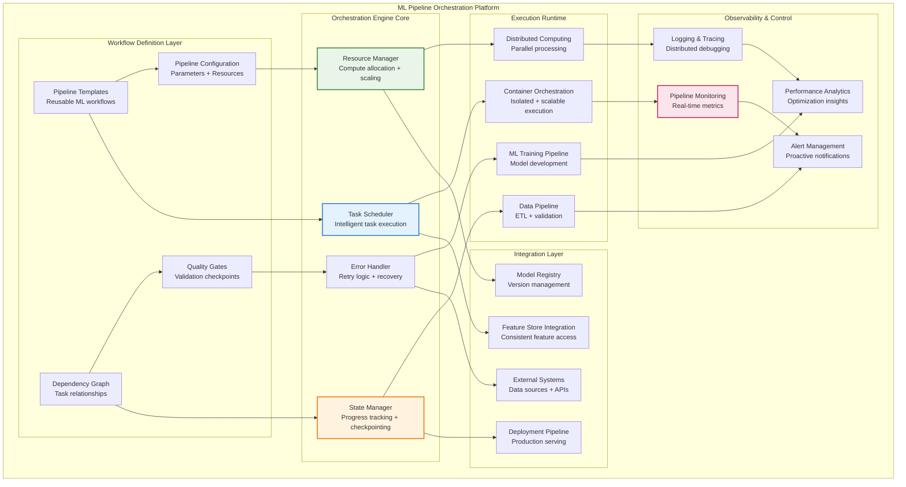
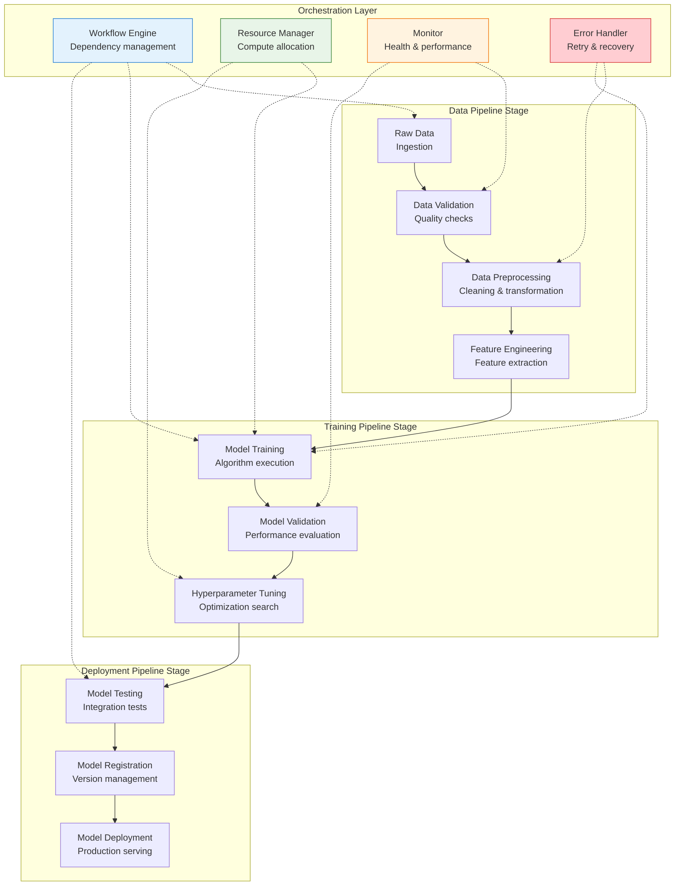
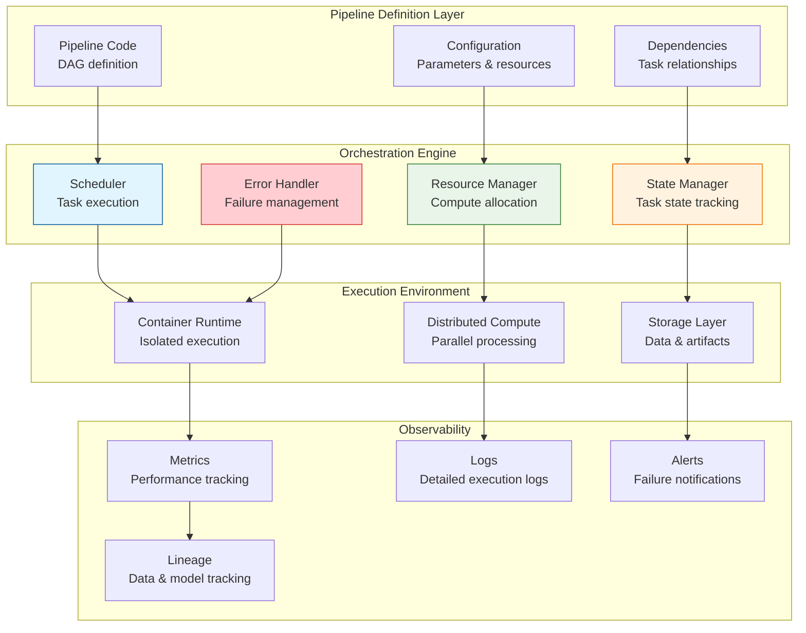
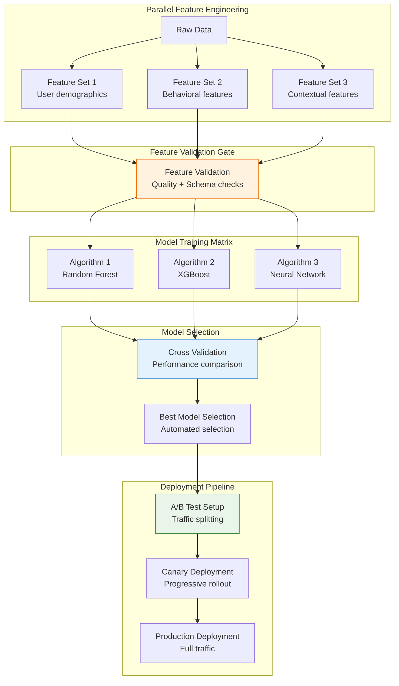
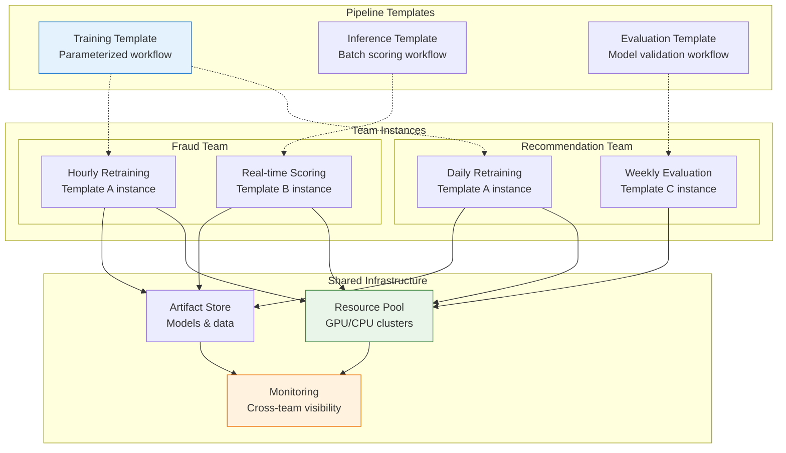
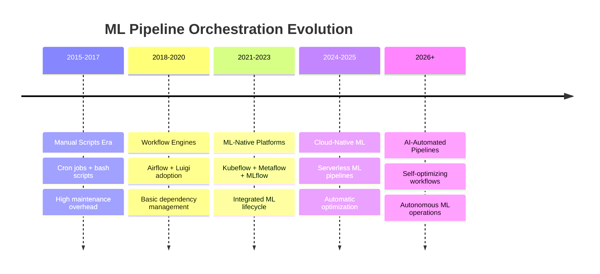

# ML Pipeline Orchestration

## The Complete Blueprint

ML Pipeline Orchestration transforms chaotic, manual ML workflows into reliable, automated systems that can execute complex machine learning processes at enterprise scale. This pattern coordinates the intricate dance of data ingestion, preprocessing, feature engineering, model training, validation, and deployment through a unified orchestration layer that manages dependencies, handles failures gracefully, and provides comprehensive observability. Unlike simple scheduling systems, ML pipeline orchestration understands the unique challenges of ML workflows—non-deterministic runtimes, data quality variations, resource-intensive computations, and the need for experiment tracking and reproducibility across distributed infrastructure.



### What You'll Master

By implementing ML pipeline orchestration, you'll achieve:

- **Enterprise-Scale ML Reliability**: Transform brittle ML scripts into robust, production-grade workflows with 99%+ success rates, automatic error recovery, and comprehensive monitoring across distributed infrastructure
- **Dramatically Accelerated ML Development**: Reduce time from experiment to production by 70% through reusable pipeline templates, automated testing, and streamlined deployment workflows that eliminate manual bottlenecks
- **Resource Optimization Excellence**: Achieve 50-80% better resource utilization through intelligent scheduling, dynamic scaling, and workload optimization across GPU and CPU clusters
- **Complete ML Workflow Visibility**: Gain end-to-end observability with detailed metrics, distributed tracing, and automated alerting that enables rapid debugging and performance optimization
- **Scalable ML Operations**: Support hundreds of models and dozens of teams with multi-tenant resource management, standardized workflows, and governance controls that maintain quality at scale

## Table of Contents

- [Essential Question](#essential-question)
- [When to Use / When NOT to Use](#when-to-use-when-not-to-use)
  - [✅ Use When](#use-when)
  - [❌ DON'T Use When](#dont-use-when)
- [Level 1: Intuition (5 min) {#intuition}](#level-1-intuition-5-min-intuition)
  - [The Story](#the-story)
  - [Visual Metaphor](#visual-metaphor)
  - [Core Insight](#core-insight)
  - [In One Sentence](#in-one-sentence)
- [Level 2: Foundation (10 min) {#foundation}](#level-2-foundation-10-min-foundation)
  - [The Problem Space](#the-problem-space)
  - [How It Works](#how-it-works)
  - [Basic Example](#basic-example)
- [ML Pipeline with Apache Airflow](#ml-pipeline-with-apache-airflow)
- [Default arguments for the DAG](#default-arguments-for-the-dag)
- [Define the DAG](#define-the-dag)
- [Define tasks](#define-tasks)
- [Deploy model (simplified)](#deploy-model-simplified)
- [Define task dependencies](#define-task-dependencies)
- [Level 3: Deep Dive (15 min) {#deep-dive}](#level-3-deep-dive-15-min-deep-dive)
  - [Implementation Details](#implementation-details)
  - [Advanced Implementation Patterns](#advanced-implementation-patterns)
- [Advanced pipeline with comprehensive error handling and quality gates](#advanced-pipeline-with-comprehensive-error-handling-and-quality-gates)
  - [Common Pitfalls](#common-pitfalls)
  - [Production Considerations](#production-considerations)
- [Level 4: Expert (20 min) {#expert}](#level-4-expert-20-min-expert)
  - [Advanced Orchestration Patterns](#advanced-orchestration-patterns)
  - [Advanced Optimization Strategies](#advanced-optimization-strategies)
- [Advanced pipeline scheduler with resource optimization](#advanced-pipeline-scheduler-with-resource-optimization)
- [Usage example](#usage-example)
- [Submit jobs with different priorities and resource requirements](#submit-jobs-with-different-priorities-and-resource-requirements)
- [Schedule jobs](#schedule-jobs)
  - [2. Pipeline Observability and Debugging](#2-pipeline-observability-and-debugging)
- [Advanced pipeline monitoring with distributed tracing](#advanced-pipeline-monitoring-with-distributed-tracing)
- [Enhanced pipeline stage with observability](#enhanced-pipeline-stage-with-observability)
- [Level 5: Mastery (30 min) {#mastery}](#level-5-mastery-30-min-mastery)
  - [Real-World Case Studies](#real-world-case-studies)
  - [Pattern Evolution and Future Directions](#pattern-evolution-and-future-directions)
  - [Pattern Combinations](#pattern-combinations)
- [Quick Reference](#quick-reference)
  - [Decision Matrix](#decision-matrix)
  - [Implementation Roadmap](#implementation-roadmap)
  - [Related Resources](#related-resources)

!!! info "🥇 Gold Tier Pattern"
    **ML Workflow Automation** • Essential for production ML at scale
    
    ML pipeline orchestration transforms ad-hoc ML scripts into reliable, observable workflows that can run at enterprise scale. Critical for any organization running multiple ML models in production, but requires significant platform engineering expertise.
    
    **Best For:** Production ML systems, automated retraining, complex feature engineering, multi-step model validation

## Essential Question

**How do we reliably orchestrate complex ML workflows with proper dependency management, error handling, and observability across distributed systems?**

## When to Use / When NOT to Use

### ✅ Use When

| Scenario | Example | Impact |
|----------|---------|--------|
| Complex ML workflows | Multi-stage feature engineering + training + validation | Automates 10+ hour manual processes |
| Production model training | Automated retraining on new data | Reduces model staleness from weeks to hours |
| Multi-team ML dependencies | Shared data preprocessing + model-specific training | Enables parallel development across teams |
| Regulatory compliance | Audit trails for model development | Provides complete workflow lineage and versioning |
| Resource optimization | GPU scheduling across multiple training jobs | Reduces infrastructure costs by 30-50% |

### ❌ DON'T Use When

| Scenario | Why | Alternative |
|----------|-----|-------------|
| Simple batch jobs | Single script execution | Cron jobs or cloud schedulers |
| Experimental ML | Rapid prototyping and iteration | Jupyter notebooks or interactive environments |
| Small team/single model | < 5 people, 1-2 models | Simple CI/CD with basic automation |
| Limited infrastructure | No container orchestration | Cloud ML services (SageMaker, Vertex AI) |
| Ad-hoc analysis | One-time data analysis | Direct database queries or notebooks |

## Level 1: Intuition (5 min) {#intuition}

### The Story

Imagine building a car on an assembly line. Each station (data cleaning, feature engineering, model training, validation) must complete its work before the next can begin. If the paint station fails, you don't want to discover this after installing the engine. ML pipeline orchestration is like a smart factory manager that coordinates all stations, monitors quality at each step, and can restart from any point when issues occur.

### Visual Metaphor



### Core Insight
> **Key Takeaway:** ML pipeline orchestration transforms brittle scripts into reliable, observable workflows that can recover from failures and scale across distributed infrastructure.

### In One Sentence
ML pipeline orchestration automates complex ML workflows by managing dependencies, handling failures, and providing observability across all stages from data to deployment.

## Level 2: Foundation (10 min) {#foundation}

### The Problem Space

<div class="failure-vignette">
<h4>🚨 What Happens Without Proper Pipeline Orchestration</h4>

**Financial Services Company, 2022**: Ran credit scoring model retraining manually via scripts. A data quality issue in the 6th hour of a 12-hour training process went unnoticed. The faulty model was deployed, causing $1.8M in bad loan approvals before being detected 3 days later.

**Impact**: $1.8M direct losses, 2-week rollback process, regulatory investigation, 6-month platform rebuild
</div>

### How It Works

#### Architecture Overview



#### Key Components

| Component | Purpose | Responsibility |
|-----------|---------|----------------|
| **Workflow Engine** | Task orchestration | Schedule, execute, and monitor pipeline tasks |
| **Resource Manager** | Compute allocation | Distribute workloads across available compute resources |
| **State Manager** | Pipeline state tracking | Track task status, handle checkpoints, manage recovery |
| **Data Manager** | Artifact management | Handle data lineage, versioning, and storage |
| **Monitor** | Observability | Collect metrics, logs, and provide alerting |
| **Error Handler** | Failure management | Implement retry logic, error recovery, and notifications |

### Basic Example

```python
## ML Pipeline with Apache Airflow
from airflow import DAG
from airflow.operators.python_operator import PythonOperator
from airflow.operators.bash_operator import BashOperator
from datetime import datetime, timedelta
import pandas as pd
from sklearn.model_selection import train_test_split
from sklearn.ensemble import RandomForestClassifier
import joblib

## Default arguments for the DAG
default_args = {
    'owner': 'ml-team',
    'depends_on_past': False,
    'start_date': datetime(2024, 1, 1),
    'email_on_failure': True,
    'email_on_retry': False,
    'retries': 2,
    'retry_delay': timedelta(minutes=5)
}

## Define the DAG
dag = DAG(
    'ml_training_pipeline',
    default_args=default_args,
    description='End-to-end ML training pipeline',
    schedule_interval=timedelta(days=1),  # Daily retraining
    catchup=False
)

def extract_data(**context):
    """Extract data from source systems"""
    # Simulate data extraction
    data = pd.read_sql("SELECT * FROM user_features WHERE date >= '{{ ds }}'", 
                      connection_string)
    data.to_parquet(f"/data/raw/{{ ds }}/features.parquet")
    return f"Extracted {len(data)} records"

def validate_data(**context):
    """Validate data quality"""
    data = pd.read_parquet(f"/data/raw/{{ ds }}/features.parquet")
    
    # Data quality checks
    assert data['user_id'].notna().all(), "User ID cannot be null"
    assert len(data) > 1000, "Insufficient data for training"
    assert data['target'].isin([0, 1]).all(), "Invalid target values"
    
    print(f"Data validation passed for {len(data)} records")

def preprocess_data(**context):
    """Clean and preprocess data"""
    data = pd.read_parquet(f"/data/raw/{{ ds }}/features.parquet")
    
    # Preprocessing steps
    data = data.dropna()
    data['feature_scaled'] = (data['feature'] - data['feature'].mean()) / data['feature'].std()
    
    # Train/test split
    X = data.drop(['target', 'user_id'], axis=1)
    y = data['target']
    X_train, X_test, y_train, y_test = train_test_split(X, y, test_size=0.2, random_state=42)
    
    # Save processed data
    X_train.to_parquet(f"/data/processed/{{ ds }}/X_train.parquet")
    X_test.to_parquet(f"/data/processed/{{ ds }}/X_test.parquet") 
    pd.Series(y_train).to_pickle(f"/data/processed/{{ ds }}/y_train.pkl")
    pd.Series(y_test).to_pickle(f"/data/processed/{{ ds }}/y_test.pkl")

def train_model(**context):
    """Train machine learning model"""
    # Load processed data
    X_train = pd.read_parquet(f"/data/processed/{{ ds }}/X_train.parquet")
    y_train = pd.read_pickle(f"/data/processed/{{ ds }}/y_train.pkl")
    
    # Train model
    model = RandomForestClassifier(n_estimators=100, random_state=42)
    model.fit(X_train, y_train)
    
    # Save model
    joblib.dump(model, f"/models/{{ ds }}/model.pkl")
    print(f"Model trained with {len(X_train)} samples")

def validate_model(**context):
    """Validate model performance"""
    # Load test data and model
    X_test = pd.read_parquet(f"/data/processed/{{ ds }}/X_test.parquet")
    y_test = pd.read_pickle(f"/data/processed/{{ ds }}/y_test.pkl")
    model = joblib.load(f"/models/{{ ds }}/model.pkl")
    
    # Calculate metrics
    from sklearn.metrics import accuracy_score, precision_score, recall_score
    predictions = model.predict(X_test)
    
    accuracy = accuracy_score(y_test, predictions)
    precision = precision_score(y_test, predictions)
    recall = recall_score(y_test, predictions)
    
    # Validation checks
    assert accuracy > 0.7, f"Accuracy too low: {accuracy}"
    assert precision > 0.6, f"Precision too low: {precision}"
    
    print(f"Model validation passed: Accuracy={accuracy:.3f}, Precision={precision:.3f}")

## Define tasks
extract_task = PythonOperator(
    task_id='extract_data',
    python_callable=extract_data,
    dag=dag
)

validate_data_task = PythonOperator(
    task_id='validate_data', 
    python_callable=validate_data,
    dag=dag
)

preprocess_task = PythonOperator(
    task_id='preprocess_data',
    python_callable=preprocess_data, 
    dag=dag
)

train_task = PythonOperator(
    task_id='train_model',
    python_callable=train_model,
    dag=dag
)

validate_model_task = PythonOperator(
    task_id='validate_model',
    python_callable=validate_model,
    dag=dag
)

## Deploy model (simplified)
deploy_task = BashOperator(
    task_id='deploy_model',
    bash_command='cp /models/{{ ds }}/model.pkl /production/current_model.pkl',
    dag=dag
)

## Define task dependencies
extract_task >> validate_data_task >> preprocess_task >> train_task >> validate_model_task >> deploy_task
```

## Level 3: Deep Dive (15 min) {#deep-dive}

### Implementation Details

#### Advanced Pipeline Patterns



#### Critical Design Decisions

| Decision | Options | Trade-off | Recommendation |
|----------|---------|-----------|----------------|
| **Execution Model** | Sequential<br>Parallel<br>Hybrid | Simplicity vs speed<br>Resource usage vs time | Hybrid: parallel where possible, sequential for dependencies |
| **Error Handling** | Fail-fast<br>Continue on error<br>Graceful degradation | Safety vs availability<br>Strict vs flexible | Fail-fast for critical stages, graceful for optional |
| **State Management** | Stateless<br>Checkpointed<br>Persistent | Simplicity vs resilience<br>Fast vs recoverable | Checkpointed for long-running pipelines |
| **Resource Allocation** | Static<br>Dynamic<br>Adaptive | Predictability vs efficiency<br>Simple vs optimized | Dynamic with resource limits |

### Advanced Implementation Patterns

#### 1. Multi-Stage Pipeline with Quality Gates

```python
## Advanced pipeline with comprehensive error handling and quality gates
from typing import Dict, List, Any, Optional
from dataclasses import dataclass
from abc import ABC, abstractmethod
import logging
import traceback
from datetime import datetime

@dataclass
class PipelineContext:
    run_id: str
    parameters: Dict[str, Any]
    artifacts: Dict[str, str]
    metrics: Dict[str, float]
    
@dataclass 
class QualityGate:
    name: str
    threshold: float
    metric_name: str
    comparison: str  # 'gt', 'lt', 'eq'

class PipelineStage(ABC):
    def __init__(self, name: str, quality_gates: List[QualityGate] = None):
        self.name = name
        self.quality_gates = quality_gates or []
        self.logger = logging.getLogger(f"pipeline.{name}")
        
    @abstractmethod
    def execute(self, context: PipelineContext) -> PipelineContext:
        """Execute the pipeline stage"""
        pass
        
    def validate_quality_gates(self, context: PipelineContext) -> bool:
        """Validate all quality gates for this stage"""
        for gate in self.quality_gates:
            if gate.metric_name not in context.metrics:
                raise ValueError(f"Metric {gate.metric_name} not found in context")
                
            metric_value = context.metrics[gate.metric_name]
            
            if gate.comparison == 'gt' and metric_value <= gate.threshold:
                self.logger.error(f"Quality gate failed: {gate.name} - "
                                f"{metric_value} <= {gate.threshold}")
                return False
            elif gate.comparison == 'lt' and metric_value >= gate.threshold:
                self.logger.error(f"Quality gate failed: {gate.name} - "
                                f"{metric_value} >= {gate.threshold}")  
                return False
                
        return True

class DataValidationStage(PipelineStage):
    def execute(self, context: PipelineContext) -> PipelineContext:
        """Comprehensive data validation with quality metrics"""
        import pandas as pd
        
        # Load data
        data_path = context.artifacts.get('raw_data')
        data = pd.read_parquet(data_path)
        
        # Calculate quality metrics
        null_rate = data.isnull().sum().sum() / (len(data) * len(data.columns))
        duplicate_rate = data.duplicated().sum() / len(data)
        
        # Data quality checks
        quality_issues = []
        if null_rate > 0.1:
            quality_issues.append(f"High null rate: {null_rate:.2%}")
        if duplicate_rate > 0.05:
            quality_issues.append(f"High duplicate rate: {duplicate_rate:.2%}")
            
        if quality_issues:
            self.logger.warning(f"Data quality issues: {quality_issues}")
            
        # Update context
        context.metrics.update({
            'data_null_rate': null_rate,
            'data_duplicate_rate': duplicate_rate,
            'data_row_count': len(data)
        })
        
        # Validate quality gates
        if not self.validate_quality_gates(context):
            raise ValueError("Data validation quality gates failed")
            
        self.logger.info(f"Data validation completed: {len(data)} rows, "
                        f"{null_rate:.2%} null rate")
        return context

class ModelTrainingStage(PipelineStage):
    def execute(self, context: PipelineContext) -> PipelineContext:
        """Model training with comprehensive metrics"""
        from sklearn.ensemble import RandomForestClassifier
        from sklearn.metrics import accuracy_score, precision_score, recall_score
        import pandas as pd
        
        # Load processed data
        X_train = pd.read_parquet(context.artifacts['X_train'])
        y_train = pd.read_pickle(context.artifacts['y_train'])
        X_val = pd.read_parquet(context.artifacts['X_val'])
        y_val = pd.read_pickle(context.artifacts['y_val'])
        
        # Training
        model = RandomForestClassifier(**context.parameters.get('model_params', {}))
        model.fit(X_train, y_train)
        
        # Validation
        predictions = model.predict(X_val)
        
        # Calculate comprehensive metrics
        metrics = {
            'model_accuracy': accuracy_score(y_val, predictions),
            'model_precision': precision_score(y_val, predictions, average='weighted'),
            'model_recall': recall_score(y_val, predictions, average='weighted'),
            'model_training_samples': len(X_train)
        }
        
        context.metrics.update(metrics)
        
        # Validate quality gates  
        if not self.validate_quality_gates(context):
            raise ValueError("Model training quality gates failed")
            
        # Save model
        import joblib
        model_path = f"/models/{context.run_id}/model.pkl"
        joblib.dump(model, model_path)
        context.artifacts['trained_model'] = model_path
        
        self.logger.info(f"Model training completed: "
                        f"Accuracy={metrics['model_accuracy']:.3f}")
        return context

class MLPipelineOrchestrator:
    def __init__(self, stages: List[PipelineStage]):
        self.stages = stages
        self.logger = logging.getLogger("pipeline.orchestrator")
        
    def execute_pipeline(self, initial_context: PipelineContext) -> PipelineContext:
        """Execute full pipeline with error handling and recovery"""
        context = initial_context
        
        for i, stage in enumerate(self.stages):
            try:
                self.logger.info(f"Executing stage {i+1}/{len(self.stages)}: {stage.name}")
                start_time = datetime.now()
                
                context = stage.execute(context)
                
                execution_time = (datetime.now() - start_time).total_seconds()
                context.metrics[f'{stage.name}_execution_time'] = execution_time
                
                self.logger.info(f"Stage {stage.name} completed in {execution_time:.2f}s")
                
            except Exception as e:
                self.logger.error(f"Stage {stage.name} failed: {str(e)}")
                self.logger.error(traceback.format_exc())
                
                # Implement retry logic here if needed
                raise RuntimeError(f"Pipeline failed at stage {stage.name}: {str(e)}")
                
        self.logger.info("Pipeline execution completed successfully")
        return context
```

### Common Pitfalls

<div class="decision-box">
<h4>⚠️ Avoid These Mistakes</h4>

1. **No intermediate checkpoints**: Long-running pipelines fail and restart from beginning → Implement checkpointing for expensive stages
2. **Inadequate error handling**: Cryptic failures without proper context → Add comprehensive logging and error context
3. **Resource contention**: Multiple pipelines competing for resources → Implement resource quotas and scheduling
4. **No pipeline testing**: Broken pipelines discovered in production → Create pipeline unit and integration tests
</div>

### Production Considerations

#### Performance Characteristics

| Metric | Target Range | Optimization Strategy |
|--------|--------------|----------------------|
| **Pipeline Latency** | Hours-Days | Parallel execution + resource optimization |
| **Success Rate** | 95-99% | Robust error handling + data validation |
| **Resource Utilization** | 60-80% | Dynamic scaling + resource pooling |
| **Recovery Time** | Minutes | Fast checkpoint restoration + health checks |

## Level 4: Expert (20 min) {#expert}

### Advanced Orchestration Patterns

#### Multi-Tenant Pipeline Architecture



### Advanced Optimization Strategies

#### 1. Intelligent Pipeline Scheduling

```python
## Advanced pipeline scheduler with resource optimization
from typing import Dict, List, Set
import heapq
from dataclasses import dataclass, field
from datetime import datetime, timedelta
from enum import Enum

class PipelineStatus(Enum):
    PENDING = "pending"
    RUNNING = "running"
    COMPLETED = "completed"
    FAILED = "failed"

@dataclass
class ResourceRequirement:
    cpu_cores: int
    memory_gb: int
    gpu_count: int = 0
    estimated_duration: timedelta = field(default_factory=lambda: timedelta(hours=1))

@dataclass 
class PipelineJob:
    id: str
    priority: int
    resources: ResourceRequirement
    dependencies: Set[str] = field(default_factory=set)
    status: PipelineStatus = PipelineStatus.PENDING
    scheduled_time: datetime = None
    completion_time: datetime = None

class IntelligentPipelineScheduler:
    def __init__(self, max_cpu: int, max_memory: int, max_gpu: int):
        self.max_cpu = max_cpu
        self.max_memory = max_memory  
        self.max_gpu = max_gpu
        self.current_cpu = 0
        self.current_memory = 0
        self.current_gpu = 0
        self.pending_jobs = []  # Min-heap by priority
        self.running_jobs: Dict[str, PipelineJob] = {}
        self.completed_jobs: Dict[str, PipelineJob] = {}
        
    def submit_job(self, job: PipelineJob) -> None:
        """Submit pipeline job for scheduling"""
        # Use negative priority for max-heap behavior
        heapq.heappush(self.pending_jobs, (-job.priority, job.id, job))
        
    def schedule_jobs(self) -> List[PipelineJob]:
        """Intelligent job scheduling with resource optimization"""
        scheduled_jobs = []
        
        # Check for completed jobs to free resources
        self._free_completed_resources()
        
        # Try to schedule pending jobs
        jobs_to_reschedule = []
        
        while self.pending_jobs:
            priority, job_id, job = heapq.heappop(self.pending_jobs)
            
            # Check dependencies
            if not self._dependencies_satisfied(job):
                jobs_to_reschedule.append((priority, job_id, job))
                continue
                
            # Check resource availability
            if self._can_allocate_resources(job.resources):
                self._allocate_resources(job.resources)
                job.status = PipelineStatus.RUNNING
                job.scheduled_time = datetime.now()
                self.running_jobs[job.id] = job
                scheduled_jobs.append(job)
            else:
                jobs_to_reschedule.append((priority, job_id, job))
                
        # Reschedule jobs that couldn't run
        for job_tuple in jobs_to_reschedule:
            heapq.heappush(self.pending_jobs, job_tuple)
            
        return scheduled_jobs
    
    def _dependencies_satisfied(self, job: PipelineJob) -> bool:
        """Check if all job dependencies are completed"""
        for dep_id in job.dependencies:
            if dep_id not in self.completed_jobs:
                return False
        return True
        
    def _can_allocate_resources(self, resources: ResourceRequirement) -> bool:
        """Check if resources are available"""
        return (
            self.current_cpu + resources.cpu_cores <= self.max_cpu and
            self.current_memory + resources.memory_gb <= self.max_memory and
            self.current_gpu + resources.gpu_count <= self.max_gpu
        )
        
    def _allocate_resources(self, resources: ResourceRequirement) -> None:
        """Allocate resources for job"""
        self.current_cpu += resources.cpu_cores
        self.current_memory += resources.memory_gb
        self.current_gpu += resources.gpu_count
        
    def get_resource_utilization(self) -> Dict[str, float]:
        """Get current resource utilization percentages"""
        return {
            'cpu': self.current_cpu / self.max_cpu * 100,
            'memory': self.current_memory / self.max_memory * 100,
            'gpu': self.current_gpu / self.max_gpu * 100 if self.max_gpu > 0 else 0
        }

## Usage example
scheduler = IntelligentPipelineScheduler(max_cpu=64, max_memory=512, max_gpu=8)

## Submit jobs with different priorities and resource requirements
training_job = PipelineJob(
    id="model_training_v2",
    priority=1,  # High priority
    resources=ResourceRequirement(cpu_cores=8, memory_gb=64, gpu_count=2, 
                                 estimated_duration=timedelta(hours=4))
)

batch_scoring_job = PipelineJob(
    id="batch_scoring_daily", 
    priority=2,  # Lower priority
    resources=ResourceRequirement(cpu_cores=16, memory_gb=128, gpu_count=0,
                                 estimated_duration=timedelta(hours=2)),
    dependencies={"model_training_v2"}  # Depends on training completion
)

scheduler.submit_job(training_job)
scheduler.submit_job(batch_scoring_job)

## Schedule jobs
scheduled = scheduler.schedule_jobs()
print(f"Scheduled {len(scheduled)} jobs")
print(f"Resource utilization: {scheduler.get_resource_utilization()}")
```

### 2. Pipeline Observability and Debugging

```python
## Advanced pipeline monitoring with distributed tracing
from opentelemetry import trace
from opentelemetry.exporter.jaeger.thrift import JaegerExporter  
from opentelemetry.sdk.trace import TracerProvider
from opentelemetry.sdk.trace.export import BatchSpanProcessor
import structlog
from typing import Dict, Any
import json

class PipelineObservability:
    def __init__(self, service_name: str = "ml-pipeline"):
        # Set up distributed tracing
        trace.set_tracer_provider(TracerProvider())
        tracer_provider = trace.get_tracer_provider()
        
        jaeger_exporter = JaegerExporter(
            agent_host_name="localhost",
            agent_port=14268,
        )
        
        span_processor = BatchSpanProcessor(jaeger_exporter)
        tracer_provider.add_span_processor(span_processor)
        
        self.tracer = trace.get_tracer(service_name)
        
        # Set up structured logging
        self.logger = structlog.get_logger(service_name)
        
    def trace_pipeline_execution(self, pipeline_name: str, context: PipelineContext):
        """Create distributed trace for entire pipeline"""
        with self.tracer.start_as_current_span(
            f"pipeline-{pipeline_name}",
            attributes={
                "pipeline.name": pipeline_name,
                "pipeline.run_id": context.run_id,
                "pipeline.start_time": datetime.now().isoformat()
            }
        ) as span:
            
            # Add pipeline parameters as span attributes
            for key, value in context.parameters.items():
                span.set_attribute(f"pipeline.param.{key}", str(value))
                
            return span
    
    def trace_stage_execution(self, stage_name: str, context: PipelineContext):
        """Create trace span for pipeline stage"""
        return self.tracer.start_as_current_span(
            f"stage-{stage_name}",
            attributes={
                "stage.name": stage_name,
                "pipeline.run_id": context.run_id
            }
        )
    
    def log_pipeline_event(self, event_type: str, stage: str = None, 
                          metrics: Dict[str, Any] = None, error: Exception = None):
        """Log structured pipeline events"""
        log_data = {
            "event_type": event_type,
            "timestamp": datetime.now().isoformat(),
        }
        
        if stage:
            log_data["stage"] = stage
        if metrics:
            log_data["metrics"] = metrics
        if error:
            log_data["error"] = {
                "type": type(error).__name__,
                "message": str(error),
                "traceback": traceback.format_exc()
            }
            
        if error:
            self.logger.error("Pipeline event", **log_data)
        else:
            self.logger.info("Pipeline event", **log_data)

## Enhanced pipeline stage with observability
class ObservablePipelineStage(PipelineStage):
    def __init__(self, name: str, observability: PipelineObservability, **kwargs):
        super().__init__(name, **kwargs)
        self.observability = observability
        
    def execute(self, context: PipelineContext) -> PipelineContext:
        """Execute stage with full observability"""
        with self.observability.trace_stage_execution(self.name, context) as span:
            try:
                # Log stage start
                self.observability.log_pipeline_event(
                    "stage_started", 
                    stage=self.name,
                    metrics={"input_artifacts": len(context.artifacts)}
                )
                
                # Execute stage logic (implemented by subclass)  
                context = self._execute_stage_logic(context)
                
                # Validate quality gates
                if not self.validate_quality_gates(context):
                    raise ValueError("Quality gate validation failed")
                
                # Add stage metrics to span
                for metric_name, value in context.metrics.items():
                    if metric_name.startswith(self.name):
                        span.set_attribute(f"stage.metric.{metric_name}", value)
                
                # Log stage completion
                self.observability.log_pipeline_event(
                    "stage_completed",
                    stage=self.name, 
                    metrics=context.metrics
                )
                
                return context
                
            except Exception as e:
                # Add error to span
                span.record_exception(e)
                span.set_status(trace.Status(trace.StatusCode.ERROR, str(e)))
                
                # Log error
                self.observability.log_pipeline_event(
                    "stage_failed",
                    stage=self.name,
                    error=e
                )
                
                raise
    
    def _execute_stage_logic(self, context: PipelineContext) -> PipelineContext:
        """Override this method with actual stage logic"""
        raise NotImplementedError("Subclasses must implement _execute_stage_logic")
```

## Level 5: Mastery (30 min) {#mastery}

### Real-World Case Studies

#### Case Study 1: Netflix's Metaflow

<div class="truth-box">
<h4>💡 Production Insights from Netflix</h4>

**Challenge**: Scale ML from data science experiments to production recommendation systems serving 200M+ users

**Implementation**:
- Python-native workflow definition with automatic infrastructure provisioning
- Built-in versioning and experiment tracking for all pipeline runs  
- Seamless scaling from laptop to cloud with identical code
- Integration with Netflix's cloud infrastructure for automatic resource management

**Architecture**:
- **Scale**: 10,000+ daily pipeline executions across 500+ models
- **Teams**: 300+ data scientists using standardized ML workflows
- **Infrastructure**: Automatic scaling from 1 to 1000+ compute instances
- **Reliability**: 99.9% pipeline success rate with automatic retries

**Results**:
- **Productivity**: 3x faster time from experiment to production
- **Reliability**: 95% reduction in pipeline failures through standardization  
- **Cost**: 40% reduction in compute costs through intelligent scheduling

**Key Innovation**: Treating ML workflows as first-class code with automatic infrastructure management
</div>

#### Case Study 2: Uber's Michelangelo Platform

<div class="truth-box">
<h4>💡 Production Insights from Uber</h4>

**Challenge**: Support diverse ML use cases across ride-sharing, food delivery, and freight with unified platform

**Implementation**:
- Workflow templates for common ML patterns (training, evaluation, deployment)
- Multi-tenant resource management with team-based quotas and priorities
- Integrated feature store and model registry for end-to-end workflow
- Real-time monitoring and alerting for all pipeline executions

**Results**:  
- **Scale**: 100,000+ monthly pipeline executions across 1000+ models
- **Teams**: 200+ ML engineers using standardized workflows
- **Efficiency**: 50% reduction in ML infrastructure management overhead
- **Quality**: 99.5% model deployment success rate through automated validation

**Key Insight**: Standardized workflow templates enable team autonomy while maintaining platform consistency
</div>

### Pattern Evolution and Future Directions

#### Evolution Timeline



#### Future Directions

| Trend | Impact on Pattern | Adaptation Strategy |
|-------|------------------|---------------------|
| **Serverless Computing** | Event-driven pipeline execution | Function-based pipeline stages with automatic scaling |
| **AI-Automated DevOps** | Self-optimizing pipeline configuration | AI-driven resource allocation and workflow optimization |
| **Edge ML Deployment** | Distributed pipeline execution | Federated pipelines with edge-cloud coordination |
| **Real-time ML** | Streaming pipeline architectures | Event-driven workflows with sub-second latency |

### Pattern Combinations

#### Exceptional Synergies

| Pattern | Integration Benefit | Implementation Strategy |
|---------|-------------------|------------------------|
| **Feature Store** | Consistent feature engineering across pipelines | Shared feature computation and validation |
| **Model Serving** | Seamless training to deployment workflow | Automated model registration and deployment |
| **Event Streaming** | Real-time pipeline triggers and updates | Event-driven pipeline execution and monitoring |
| **GitOps** | Version-controlled pipeline definitions | Infrastructure-as-code for ML workflows |

## Quick Reference

### Decision Matrix

| Pipeline Complexity | Team Size | Model Count | Infrastructure | Recommendation |
|--------------------|-----------|-------------|----------------|----------------|
| Simple | 1-5 people | 1-5 models | Cloud services | Managed ML services |
| Moderate | 5-15 people | 5-20 models | Kubernetes | Kubeflow or similar |
| Complex | 15+ people | 20+ models | Enterprise cloud | Custom platform |
| Enterprise | 50+ people | 100+ models | Multi-cloud | Netflix Metaflow approach |

### Implementation Roadmap

**Phase 1: Foundation (Weeks 1-8)**
- [ ] Set up basic workflow orchestration (Airflow/Kubeflow)
- [ ] Create pipeline templates for common ML workflows
- [ ] Implement basic monitoring and logging
- [ ] Add automated testing for pipeline components

**Phase 2: Production (Weeks 9-16)**  
- [ ] Add comprehensive error handling and recovery
- [ ] Implement quality gates and validation checkpoints
- [ ] Set up resource management and auto-scaling
- [ ] Create pipeline performance monitoring dashboards

**Phase 3: Scale (Weeks 17-24)**
- [ ] Add multi-tenant pipeline management
- [ ] Implement intelligent scheduling and resource optimization  
- [ ] Create advanced observability with distributed tracing
- [ ] Add automated pipeline optimization and tuning

### Related Resources

<div class="grid cards" markdown>

- :material-book-open-variant:{ .lg .middle } **Related Patterns**
    
    ---
    
    - [Feature Store](feature-store.md) - Centralized feature management for pipelines
    - [Model Serving at Scale](model-serving-scale.md) - Production deployment integration
    - [GitOps Deployment](../architecture/gitops-deployment.md) - Version-controlled workflows

- :material-flask:{ .lg .middle } **Fundamental Laws**
    
    ---
    
    - [Emergent Chaos](../../core-principles/laws/emergent-chaos.md) - Complex system behavior management
    - [Asynchronous Reality](../../core-principles/laws/asynchronous-reality.md) - Distributed workflow coordination

- :material-pillar:{ .lg .middle } **Foundational Pillars**
    
    ---
    
    - [Work Distribution](../../core-principles/pillars/work-distribution.md) - Distributed pipeline execution
    - [Coordination](../../core-principles/pillars/coordination.md) - Workflow orchestration and synchronization

- :material-tools:{ .lg .middle } **Implementation Guides**
    
    ---
    
    - <!-- TODO: Add Kubeflow Setup Guide from Architects Handbook -->
    - <!-- TODO: Add ML Pipeline Testing from Architects Handbook -->
    - <!-- TODO: Add Pipeline Monitoring Best Practices from Architects Handbook -->

</div>

---