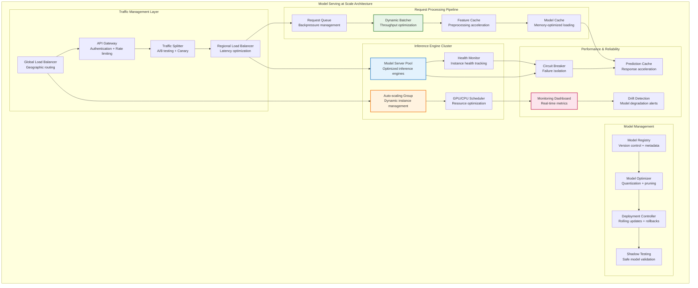
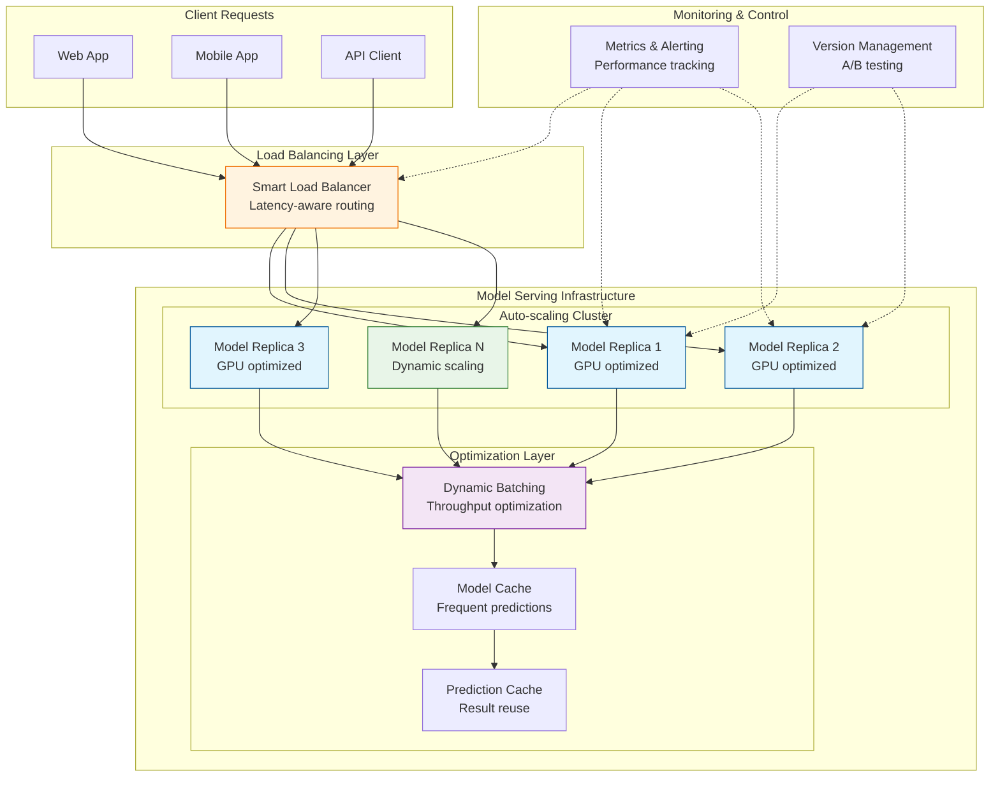
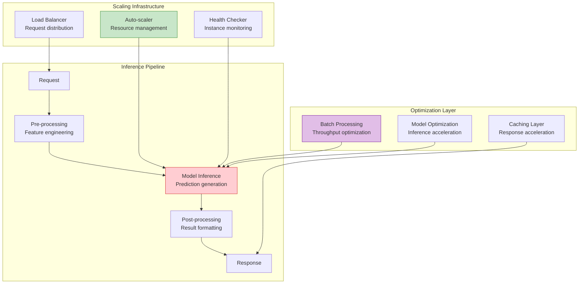
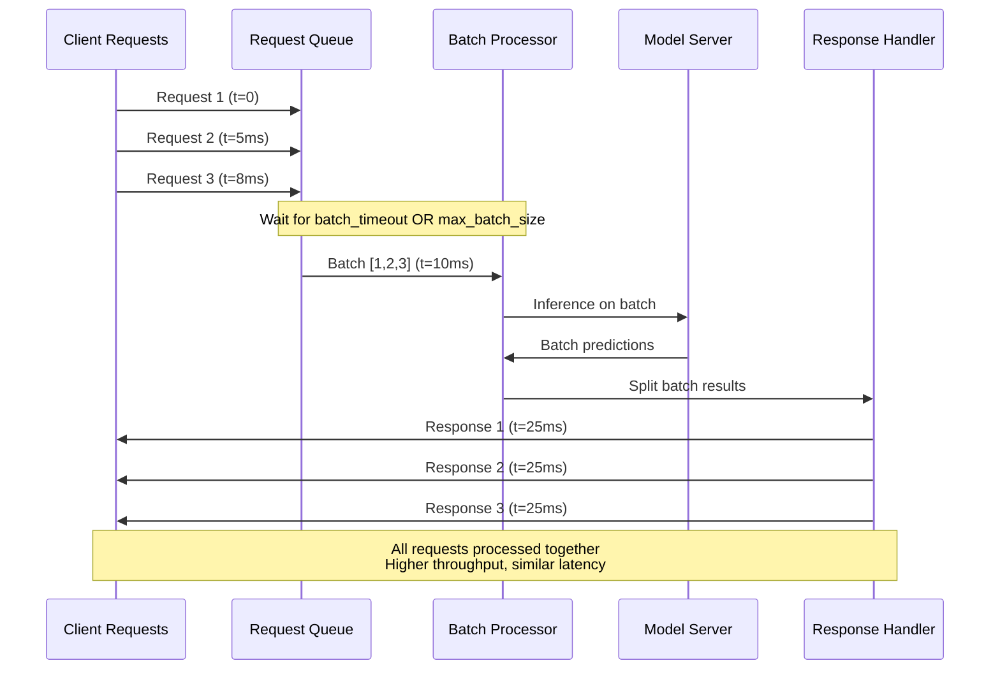
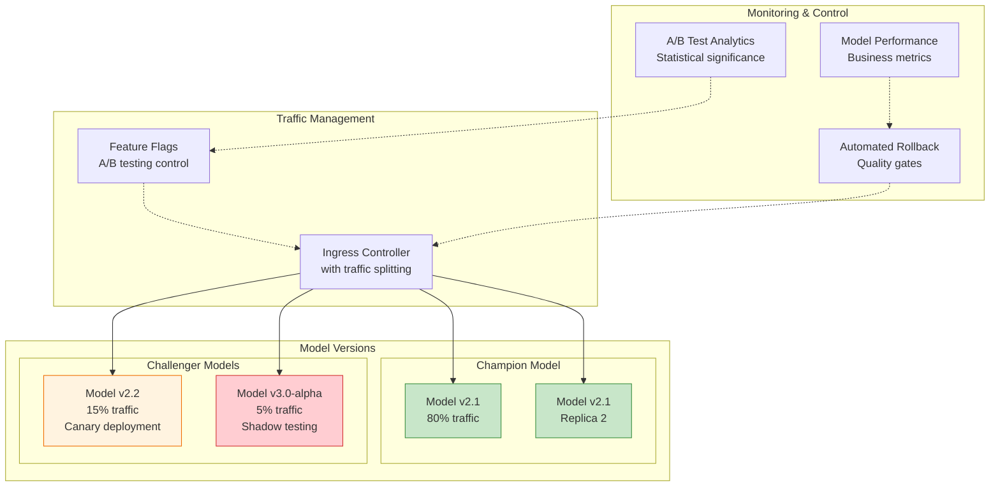
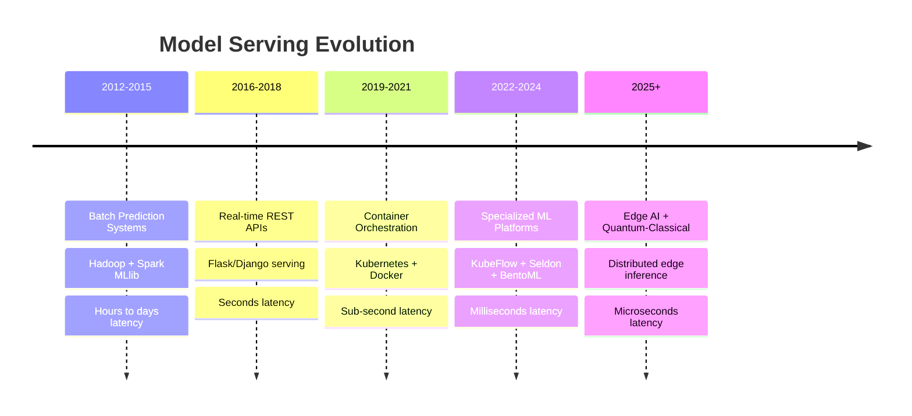

# Model Serving at Scale

## The Complete Blueprint

Model Serving at Scale transforms trained ML models from experimental artifacts into production-grade services capable of handling millions of predictions per second with enterprise-level reliability and performance. This pattern orchestrates the complex infrastructure required for real-time ML inference, managing everything from request routing and dynamic batching to model optimization and automatic scaling. Unlike simple API deployments, serving models at scale requires sophisticated optimization techniques including model quantization, intelligent caching, circuit breakers, and comprehensive monitoring to maintain sub-100ms latencies while serving diverse model types across global infrastructure.



### What You'll Master

By implementing model serving at scale, you'll achieve:

- **Ultra-High Performance Inference**: Serve millions of model predictions per second with sub-100ms P95 latencies through advanced batching, caching, and GPU optimization techniques
- **Enterprise-Grade Reliability**: Build fault-tolerant ML systems with 99.9%+ uptime using circuit breakers, graceful degradation, and automated failover across multiple regions
- **Intelligent Cost Optimization**: Reduce inference costs by 40-60% through dynamic scaling, spot instance management, model quantization, and intelligent resource allocation
- **Seamless Model Deployment**: Enable continuous model updates with zero-downtime deployments, A/B testing, canary releases, and automated rollback capabilities
- **Production ML Observability**: Implement comprehensive monitoring with drift detection, performance analytics, and business impact tracking that prevents issues before they affect users

## Table of Contents

- [Essential Question](#essential-question)
- [When to Use / When NOT to Use](#when-to-use-when-not-to-use)
  - [✅ Use When](#use-when)
  - [❌ DON'T Use When](#dont-use-when)
- [Level 1: Intuition (5 min) {#intuition}](#level-1-intuition-5-min-intuition)
  - [The Story](#the-story)
  - [Visual Metaphor](#visual-metaphor)
  - [Core Insight](#core-insight)
  - [In One Sentence](#in-one-sentence)
- [Level 2: Foundation (10 min) {#foundation}](#level-2-foundation-10-min-foundation)
  - [The Problem Space](#the-problem-space)
  - [How It Works](#how-it-works)
  - [Basic Example](#basic-example)
- [Model serving with basic scaling](#model-serving-with-basic-scaling)
- [Usage with auto-scaling considerations](#usage-with-auto-scaling-considerations)
- [Level 3: Deep Dive (15 min) {#deep-dive}](#level-3-deep-dive-15-min-deep-dive)
  - [Implementation Details](#implementation-details)
  - [Advanced Optimization Techniques](#advanced-optimization-techniques)
- [Model optimization for production serving](#model-optimization-for-production-serving)
  - [Common Pitfalls](#common-pitfalls)
  - [Production Considerations](#production-considerations)
- [Level 4: Expert (20 min) {#expert}](#level-4-expert-20-min-expert)
  - [Advanced Deployment Strategies](#advanced-deployment-strategies)
  - [Advanced Monitoring & Observability](#advanced-monitoring-observability)
- [Advanced model monitoring with drift detection](#advanced-model-monitoring-with-drift-detection)
- [Level 5: Mastery (30 min) {#mastery}](#level-5-mastery-30-min-mastery)
  - [Real-World Case Studies](#real-world-case-studies)
  - [Pattern Evolution and Future Directions](#pattern-evolution-and-future-directions)
  - [Pattern Combinations](#pattern-combinations)
- [Quick Reference](#quick-reference)
  - [Decision Matrix](#decision-matrix)
  - [Implementation Roadmap](#implementation-roadmap)
  - [Related Resources](#related-resources)

!!! info "🥇 Gold Tier Pattern" 
    **Production ML Infrastructure** • Critical for ML-driven applications at scale
    
    Model serving at scale is essential for any production ML system handling significant traffic. Enables real-time inference with enterprise-grade reliability, but requires deep expertise in both ML operations and distributed systems.
    
    **Best For:** Real-time recommendation systems, autonomous vehicles, fraud detection, computer vision applications

## Essential Question

**How do we serve ML models at scale with low latency, high throughput, and cost efficiency while maintaining model quality and system reliability?**

## When to Use / When NOT to Use

### ✅ Use When

| Scenario | Example | Impact |
|----------|---------|--------|
| Real-time inference | Recommendation engines, fraud detection | Sub-second decisions drive user experience |
| High-volume predictions | Ad targeting, search ranking | Millions of predictions/hour required |
| Mission-critical ML | Autonomous driving, medical diagnosis | System availability directly impacts safety |
| Variable load patterns | E-commerce recommendations, content moderation | Traffic spikes require automatic scaling |
| Multi-model deployment | A/B testing, gradual rollouts | Need sophisticated deployment strategies |

### ❌ DON'T Use When

| Scenario | Why | Alternative |
|----------|-----|-------------|
| Batch prediction needs | Offline analytics, reporting | Apache Spark MLlib or similar |
| Low-volume inference | < 100 predictions/day | Simple REST API or serverless functions |
| Development/experimentation | Model prototyping, research | Jupyter notebooks or local serving |
| Single-region deployment | Small-scale applications | Basic containerized deployment |
| Limited ML ops expertise | Small team, simple models | Managed ML services (SageMaker, Vertex AI) |

## Level 1: Intuition (5 min) {#intuition}

### The Story

Imagine a world-class restaurant during peak hours. The kitchen (your ML model) must serve hundreds of orders simultaneously while maintaining quality. You need multiple cooking stations (model replicas), intelligent waiters (load balancers), and a system to handle rush periods (auto-scaling). Model serving at scale is like running this restaurant chain globally, ensuring every location delivers consistently excellent meals instantly.

### Visual Metaphor



### Core Insight
> **Key Takeaway:** Model serving at scale transforms ML models from experimental code into production-grade services that can handle enterprise workloads with reliability and efficiency.

### In One Sentence
Model serving at scale deploys ML models as highly available, automatically scaling services that can handle millions of predictions while maintaining low latency and high reliability.

## Level 2: Foundation (10 min) {#foundation}

### The Problem Space

<div class="failure-vignette">
<h4>🚨 What Happens Without Proper Model Serving</h4>

**E-commerce Giant, 2021**: Deployed a recommendation model without proper scaling infrastructure. During Black Friday, recommendation API timeouts reached 40%, causing $12M in lost revenue over 6 hours as users couldn't get product recommendations.

**Impact**: $12M revenue loss, 35% increase in customer churn, 6-month project to rebuild serving infrastructure
</div>

### How It Works

#### Architecture Overview



#### Key Components

| Component | Purpose | Responsibility |
|-----------|---------|----------------|
| **Model Server** | Core inference engine | Execute model predictions with optimal resource usage |
| **Load Balancer** | Traffic distribution | Route requests to healthy instances with latency optimization |
| **Auto-scaler** | Resource management | Scale instances based on demand with cost optimization |
| **Batch Processor** | Throughput optimization | Group requests for efficient model execution |
| **Cache Layer** | Performance acceleration | Store frequent predictions and preprocessed features |
| **Monitor** | System observability | Track performance, health, and business metrics |

### Basic Example

```python
## Model serving with basic scaling
from transformers import AutoTokenizer, AutoModel
import torch
from concurrent.futures import ThreadPoolExecutor
import asyncio
from typing import List, Dict
import time

class ScalableModelServer:
    def __init__(self, model_name: str, max_workers: int = 4):
        self.tokenizer = AutoTokenizer.from_pretrained(model_name)
        self.model = AutoModel.from_pretrained(model_name)
        self.executor = ThreadPoolExecutor(max_workers=max_workers)
        self.batch_size = 32
        self.batch_timeout = 0.1  # 100ms max wait for batching
        
    async def predict_batch(self, texts: List[str]) -> List[Dict]:
        """Process batch of texts with dynamic batching"""
        loop = asyncio.get_event_loop()
        
        def _batch_inference():
            inputs = self.tokenizer(texts, padding=True, 
                                  truncation=True, return_tensors="pt")
            with torch.no_grad():
                outputs = self.model(**inputs)
            return outputs.last_hidden_state.mean(dim=1).numpy()
        
        embeddings = await loop.run_in_executor(
            self.executor, _batch_inference
        )
        
        return [{"embedding": emb.tolist(), "confidence": 0.95} 
                for emb in embeddings]
    
    async def predict(self, text: str) -> Dict:
        """Single prediction with batching optimization"""
        return (await self.predict_batch([text]))[0]

## Usage with auto-scaling considerations
server = ScalableModelServer("bert-base-uncased", max_workers=8)
```

## Level 3: Deep Dive (15 min) {#deep-dive}

### Implementation Details

#### Dynamic Batching Strategy



#### Critical Design Decisions

| Decision | Options | Trade-off | Recommendation |
|----------|---------|-----------|----------------|
| **Scaling Strategy** | Horizontal<br>Vertical<br>Hybrid | Cost vs complexity<br>Simple vs optimal | Hybrid: vertical for GPU, horizontal for CPU |
| **Batching Approach** | Static<br>Dynamic<br>Adaptive | Latency vs throughput<br>Simple vs optimal | Dynamic with adaptive timeouts |
| **Model Loading** | Lazy<br>Eager<br>Warm-up | Memory vs startup<br>Fast vs resource-efficient | Warm-up for production, lazy for development |
| **Caching Strategy** | Feature-level<br>Prediction-level<br>Multi-tier | Hit rate vs memory<br>Simple vs sophisticated | Multi-tier with TTL-based eviction |

### Advanced Optimization Techniques

#### 1. Model Quantization and Optimization

```python
## Model optimization for production serving
import torch
from torch.quantization import quantize_dynamic
import tensorrt as trt  # NVIDIA TensorRT for GPU optimization

class OptimizedModelServer:
    def __init__(self, model_path: str, optimization_level: str = "balanced"):
        self.model = self._load_optimized_model(model_path, optimization_level)
        
    def _load_optimized_model(self, path: str, level: str):
        model = torch.load(path)
        
        if level == "aggressive":
            # INT8 quantization for maximum speed
            return quantize_dynamic(model, {torch.nn.Linear}, dtype=torch.qint8)
        elif level == "balanced":  
            # FP16 mixed precision
            return model.half()
        else:
            return model  # No optimization
    
    def optimize_for_tensorrt(self, example_input):
        """Convert to TensorRT for NVIDIA GPU optimization"""
        traced_model = torch.jit.trace(self.model, example_input)
        trt_model = torch.jit.script(traced_model)
        return trt_model
```

### Common Pitfalls

<div class="decision-box">
<h4>⚠️ Avoid These Mistakes</h4>

1. **No request batching**: Processing one request at a time → Implement dynamic batching for 3-10x throughput improvement
2. **Static resource allocation**: Fixed instance counts → Use auto-scaling based on queue depth and latency metrics
3. **Ignoring cold start costs**: No model warming → Pre-load models and maintain warm instances for consistent latency
4. **No circuit breakers**: Cascading failures during overload → Implement graceful degradation and load shedding
</div>

### Production Considerations

#### Performance Characteristics

| Metric | Target Range | Optimization Strategy |
|--------|--------------|----------------------|
| **P95 Latency** | 50-200ms | Model optimization + batching + caching |
| **Throughput** | 1K-100K RPS | Horizontal scaling + GPU acceleration |
| **Resource Utilization** | 70-85% | Dynamic scaling with proper headroom |
| **Error Rate** | < 0.1% | Circuit breakers + health checks + retries |
| **Cost per Prediction** | $0.001-$0.01 | Right-sizing instances + spot instances |

## Level 4: Expert (20 min) {#expert}

### Advanced Deployment Strategies

#### Multi-Model Serving Architecture



#### Optimization Strategies

1. **Adaptive Batching**
   - When to apply: Variable request patterns with latency SLAs
   - Impact: 40-60% improvement in throughput during peak times
   - Trade-off: More complex batch management logic

2. **Model Ensemble Serving**
   - When to apply: Critical predictions requiring higher accuracy
   - Impact: 10-20% accuracy improvement with ensemble methods
   - Trade-off: 2-3x increase in compute resources

3. **Edge Inference Deployment**
   - When to apply: Ultra-low latency requirements (< 10ms)
   - Impact: 90% reduction in network latency for edge applications
   - Trade-off: Limited model complexity and update frequency

### Advanced Monitoring & Observability

#### Key Metrics Dashboard

| Metric Category | Key Indicators | Alert Thresholds |
|-----------------|----------------|------------------|
| **Latency** | P50, P95, P99 response times | P95 > 200ms |
| **Throughput** | Requests/second, predictions/second | < 80% capacity |
| **Model Quality** | Accuracy drift, prediction confidence | > 5% degradation |
| **Resource Health** | CPU, GPU, memory utilization | > 85% sustained |
| **Business Impact** | Conversion rates, revenue per prediction | > 2% decrease |

#### Model Drift Detection

```python
## Advanced model monitoring with drift detection
from scipy import stats
import numpy as np
from dataclasses import dataclass
from typing import List, Dict, Tuple
import logging

@dataclass
class ModelMetrics:
    timestamp: float
    predictions: List[float]  
    features: np.ndarray
    response_times: List[float]
    confidence_scores: List[float]

class ModelDriftDetector:
    def __init__(self, baseline_window: int = 1000, 
                 drift_threshold: float = 0.05):
        self.baseline_window = baseline_window
        self.drift_threshold = drift_threshold
        self.baseline_metrics = None
        self.current_metrics = []
        
    def update_baseline(self, metrics: ModelMetrics):
        """Update baseline distribution from recent good performance"""
        self.baseline_metrics = metrics
        
    def detect_drift(self, current_metrics: ModelMetrics) -> Dict[str, bool]:
        """Detect various types of model drift"""
        if not self.baseline_metrics:
            return {"data_drift": False, "concept_drift": False}
            
        results = {}
        
        # Feature drift detection using KS test
        feature_drift = self._detect_feature_drift(current_metrics)
        results["feature_drift"] = feature_drift
        
        # Prediction drift detection  
        pred_drift = self._detect_prediction_drift(current_metrics)
        results["prediction_drift"] = pred_drift
        
        # Performance drift detection
        perf_drift = self._detect_performance_drift(current_metrics)  
        results["performance_drift"] = perf_drift
        
        return results
        
    def _detect_feature_drift(self, metrics: ModelMetrics) -> bool:
        """Statistical test for input feature distribution changes"""
        for i in range(metrics.features.shape[1]):
            baseline_feature = self.baseline_metrics.features[:, i]
            current_feature = metrics.features[:, i]
            
            # Kolmogorov-Smirnov test for distribution change
            ks_stat, p_value = stats.ks_2samp(baseline_feature, current_feature)
            
            if p_value < self.drift_threshold:
                logging.warning(f"Feature drift detected in feature {i}: "
                              f"KS={ks_stat:.3f}, p={p_value:.3f}")
                return True
        return False
```

## Level 5: Mastery (30 min) {#mastery}

### Real-World Case Studies

#### Case Study 1: Netflix's Recommendation Serving

<div class="truth-box">
<h4>💡 Production Insights from Netflix</h4>

**Challenge**: Serve personalized recommendations to 200M+ users globally with sub-100ms latency

**Implementation**: 
- Multi-tier caching: Feature cache → Model cache → Prediction cache
- A/B testing framework with 1000+ concurrent experiments  
- Regional model deployment with data locality optimization
- Shadow traffic for model validation before production deployment

**Architecture**:
- **Compute**: 10,000+ AWS instances across 3 regions
- **Models**: 200+ specialized recommendation models  
- **Scale**: 1M+ predictions/second globally
- **Latency**: P95 < 80ms end-to-end response time

**Results**:
- **Performance**: 25% improvement in user engagement
- **Reliability**: 99.99% uptime with graceful degradation
- **Efficiency**: 40% reduction in compute costs through optimization

**Lessons Learned**: Multi-tier caching and regional deployment are essential for global-scale ML serving
</div>

#### Case Study 2: Tesla's Autopilot Inference

<div class="truth-box">
<h4>💡 Production Insights from Tesla</h4>

**Challenge**: Real-time computer vision inference for autonomous driving with safety-critical requirements

**Implementation**:
- Custom neural processing units (NPUs) in vehicle hardware
- Edge inference with cloud-assisted learning and updates  
- Multi-model ensemble for safety-critical decisions
- Over-the-air model deployment with rollback capabilities

**Architecture**:
- **Edge Compute**: Custom FSD chip with 144 TOPS performance
- **Models**: 8-camera neural networks + sensor fusion
- **Scale**: 288M inferences/second per vehicle (8 cameras × 36 FPS × 1M vehicles)  
- **Latency**: < 10ms critical path for safety decisions

**Results**:
- **Safety**: 10x reduction in accidents per mile vs human drivers
- **Performance**: Real-time inference with 99.99% availability
- **Innovation**: Breakthrough in edge ML inference capabilities

**Lessons Learned**: Edge inference with specialized hardware enables safety-critical real-time ML applications
</div>

### Pattern Evolution and Future Directions

#### Evolution Timeline



#### Future Directions

| Trend | Impact on Pattern | Adaptation Strategy |
|-------|------------------|---------------------|
| **Edge AI Computing** | Inference moves to IoT devices and edge | Federated model serving with cloud coordination |
| **Quantum-Classical Hybrid** | Quantum acceleration for specific ML tasks | Hybrid serving with quantum co-processors |
| **Neuromorphic Computing** | Brain-inspired chips for ultra-low power ML | Specialized serving for neuromorphic models |
| **5G/6G Networks** | Ultra-low latency distributed inference | Network-aware model placement and routing |

### Pattern Combinations

#### Works Exceptionally Well With

| Pattern | Combination Benefit | Integration Strategy |
|---------|-------------------|---------------------|
| **Feature Store** | Consistent feature engineering at scale | Shared feature computation and caching |
| **Event Streaming** | Real-time model updates and feedback | Streaming model performance monitoring |
| **Circuit Breaker** | Graceful degradation during model failures | Fallback to simpler models or cached results |
| **API Gateway** | Unified ML API management and security | Centralized authentication and rate limiting |

## Quick Reference

### Decision Matrix

| Use Case | Latency Req | Scale Req | Complexity | Recommended Approach |
|----------|-------------|-----------|------------|---------------------|
| Real-time recommendations | < 100ms | High | High | Full serving infrastructure |
| Batch analytics | Hours | Very High | Medium | Spark/BigQuery ML |
| Research/experimentation | Minutes | Low | Low | Jupyter + simple API |
| Edge applications | < 10ms | Medium | Very High | Edge inference + optimization |

### Implementation Roadmap

**Phase 1: Foundation (Weeks 1-4)**
- [ ] Set up basic containerized model serving
- [ ] Implement health checks and basic monitoring  
- [ ] Create CI/CD pipeline for model deployment
- [ ] Add load balancing and horizontal scaling

**Phase 2: Optimization (Weeks 5-8)**  
- [ ] Implement dynamic batching and request queuing
- [ ] Add multi-tier caching (features, models, predictions)
- [ ] Set up A/B testing framework for model comparison
- [ ] Optimize models for inference (quantization, pruning)

**Phase 3: Production Excellence (Weeks 9-12)**
- [ ] Deploy multi-region serving with data locality
- [ ] Implement advanced monitoring with drift detection  
- [ ] Add automated rollback and canary deployment
- [ ] Create comprehensive disaster recovery procedures

### Related Resources

<div class="grid cards" markdown>

- :material-book-open-variant:{ .lg .middle } **Related Patterns**
    
    ---
    
    - [Feature Store](feature-store.md) - Centralized feature management
    - [API Gateway](../communication/api-gateway.md) - ML API management
    - [Auto Scaling](../scaling/auto-scaling.md) - Dynamic resource management

- :material-flask:{ .lg .middle } **Fundamental Laws**
    
    ---
    
    - [Economic Reality](../../core-principles/laws/economic-reality.md) - Cost optimization strategies
    - [Asynchronous Reality](../../core-principles/laws/asynchronous-reality.md) - Latency management

- :material-pillar:{ .lg .middle } **Foundational Pillars**
    
    ---
    
    - [Work Distribution](../../core-principles/pillars/work-distribution.md) - Inference workload management
    - [Intelligence Amplification](../../core-principles/pillars/intelligence-amplification.md) - ML system optimization

- :material-tools:{ .lg .middle } **Implementation Guides**
    
    ---
    
    - [Kubernetes ML Deployment](../../architects-handbook/implementation-playbooks/guides/k8s-ml-deployment.md)
    - [Model Optimization Guide](../../architects-handbook/implementation-playbooks/guides/model-optimization.md)
    - [ML Monitoring Best Practices](../../architects-handbook/implementation-playbooks/guides/ml-monitoring.md)

</div>

---