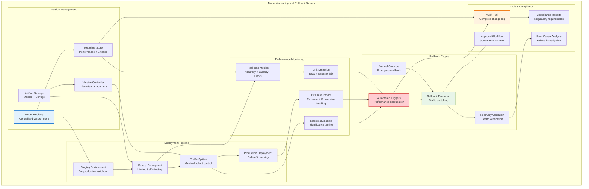
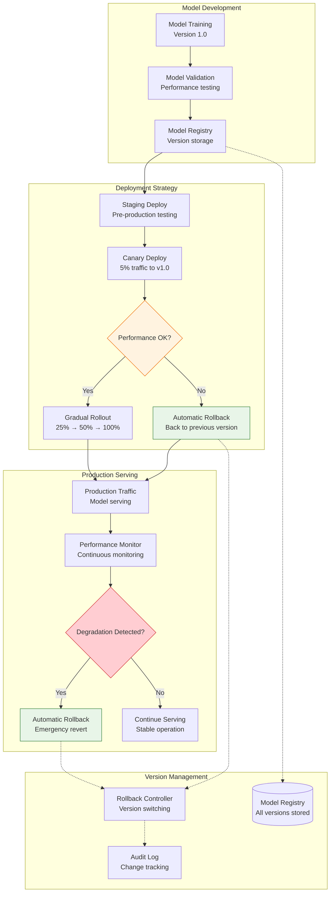
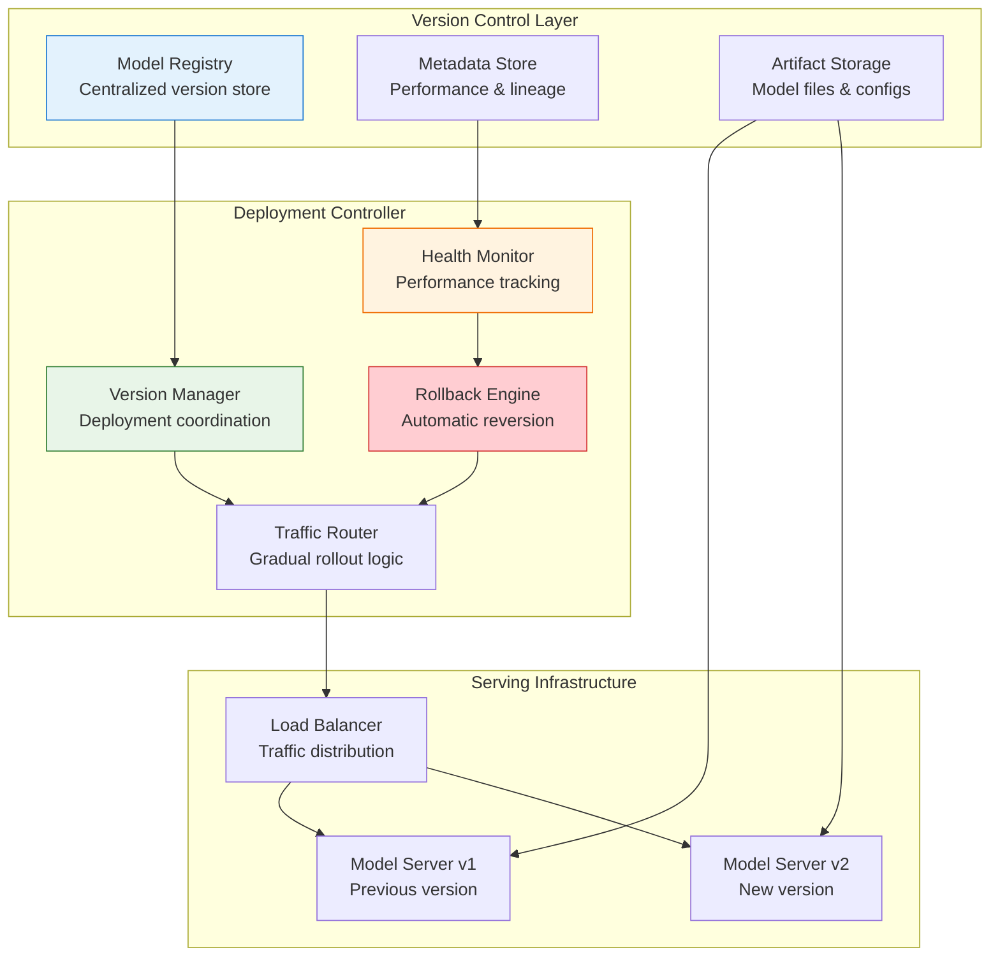
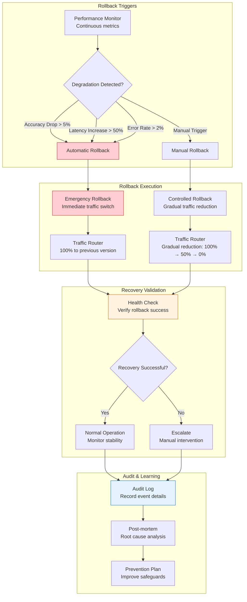
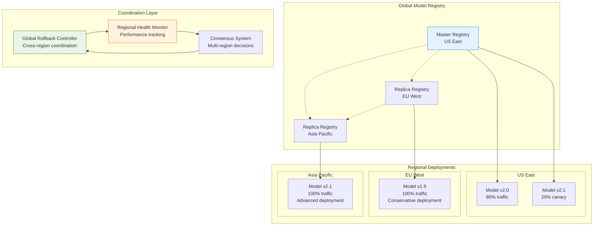
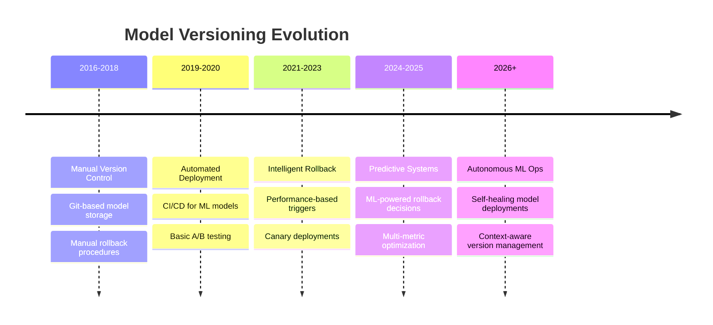

# Model Versioning and Rollback

## The Complete Blueprint

Model Versioning and Rollback transforms risky ML model deployments into safe, controlled experiments with complete safety nets and audit trails. This pattern provides the critical infrastructure needed to deploy model updates confidently, knowing that any issues can be instantly reverted to a previous known-good state. Beyond simple backup and restore, this pattern orchestrates sophisticated deployment strategies including canary releases, A/B testing, automated performance monitoring, and intelligent rollback decisions based on statistical significance and business impact. The pattern ensures complete traceability of model lineage, deployment history, and performance impact for regulatory compliance and debugging.



### What You'll Master

By implementing model versioning and rollback, you'll achieve:

- **Zero-Risk Model Deployments**: Deploy ML model updates with complete confidence through automated canary testing, statistical validation, and instant rollback capabilities that protect against any production issues
- **Enterprise-Grade Audit & Compliance**: Maintain complete model lineage tracking, deployment history, and change documentation required for regulatory compliance and debugging complex production issues
- **Intelligent Rollback Decisions**: Implement ML-powered rollback systems that detect performance degradation, statistical significance, and business impact to make automated rollback decisions faster than human operators
- **Sophisticated Deployment Strategies**: Execute advanced deployment patterns including canary releases, blue-green deployments, and gradual traffic ramping with automated promotion or rollback based on performance metrics
- **Complete Operational Visibility**: Gain comprehensive insights into model performance trends, rollback patterns, and deployment success rates that enable continuous improvement of ML operations

## Table of Contents

- [Essential Question](#essential-question)
- [When to Use / When NOT to Use](#when-to-use-when-not-to-use)
  - [✅ Use When](#use-when)
  - [❌ DON'T Use When](#dont-use-when)
- [Level 1: Intuition (5 min) {#intuition}](#level-1-intuition-5-min-intuition)
  - [The Story](#the-story)
  - [Visual Metaphor](#visual-metaphor)
  - [Core Insight](#core-insight)
  - [In One Sentence](#in-one-sentence)
- [Level 2: Foundation (10 min) {#foundation}](#level-2-foundation-10-min-foundation)
  - [The Problem Space](#the-problem-space)
  - [How It Works](#how-it-works)
  - [Basic Example](#basic-example)
- [Model versioning and rollback implementation](#model-versioning-and-rollback-implementation)
- [Performance monitoring for automatic rollback](#performance-monitoring-for-automatic-rollback)
- [Usage example](#usage-example)
- [Register new model version](#register-new-model-version)
- [Deploy as canary](#deploy-as-canary)
- [Monitor performance](#monitor-performance)
- [Level 3: Deep Dive (15 min) {#deep-dive}](#level-3-deep-dive-15-min-deep-dive)
  - [Implementation Details](#implementation-details)
  - [Advanced Implementation Patterns](#advanced-implementation-patterns)
- [Advanced rollback decision engine with machine learning](#advanced-rollback-decision-engine-with-machine-learning)
- [Usage in production monitoring](#usage-in-production-monitoring)
- [Example performance assessment](#example-performance-assessment)
  - [Common Pitfalls](#common-pitfalls)
  - [Production Considerations](#production-considerations)
- [Level 4: Expert (20 min) {#expert}](#level-4-expert-20-min-expert)
  - [Advanced Deployment Strategies](#advanced-deployment-strategies)
  - [Advanced Optimization Strategies](#advanced-optimization-strategies)
- [Predictive rollback using early warning signals](#predictive-rollback-using-early-warning-signals)
- [Integration with deployment controller](#integration-with-deployment-controller)
- [Level 5: Mastery (30 min) {#mastery}](#level-5-mastery-30-min-mastery)
  - [Real-World Case Studies](#real-world-case-studies)
  - [Pattern Evolution and Future Directions](#pattern-evolution-and-future-directions)
  - [Pattern Combinations](#pattern-combinations)
- [Quick Reference](#quick-reference)
  - [Decision Matrix](#decision-matrix)
  - [Implementation Roadmap](#implementation-roadmap)
  - [Related Resources](#related-resources)

!!! info "🥈 Silver Tier Pattern"
    **Production ML Safety** • Essential for reliable model deployments
    
    Model versioning and rollback capabilities are fundamental for any production ML system. Enables safe experimentation and rapid recovery from model failures, but requires disciplined version management and monitoring practices.
    
    **Best For:** Production ML applications, regulated industries, high-stakes applications, A/B testing scenarios

## Essential Question

**How do we safely deploy ML model updates with the ability to quickly rollback to previous versions while maintaining complete audit trails?**

## When to Use / When NOT to Use

### ✅ Use When

| Scenario | Example | Impact |
|----------|---------|--------|
| Production ML systems | Any customer-facing ML application | Prevents service disruptions from bad models |
| Regulatory compliance | Financial services, healthcare ML | Provides required audit trails and model governance |
| A/B testing scenarios | Recommendation systems, search ranking | Enables safe comparison of model versions |
| High-stakes applications | Fraud detection, autonomous systems | Critical safety net for mission-critical decisions |
| Continuous model updates | Dynamic pricing, real-time personalization | Supports frequent model iterations with safety |

### ❌ DON'T Use When

| Scenario | Why | Alternative |
|----------|-----|-------------|
| Experimental/research ML | One-off experiments, prototyping | Simple model checkpoints or notebooks |
| Single-model applications | Static models, infrequent updates | Basic backup and restore procedures |
| Resource-constrained environments | Limited storage or compute | Manual deployment with basic versioning |
| Simple batch scoring | Offline prediction jobs | File-based model management |
| Development/staging only | Non-production environments | Git-based model versioning |

## Level 1: Intuition (5 min) {#intuition}

### The Story

Imagine deploying software updates to millions of phones. You'd want to test the update on a small group first, monitor for problems, and have a "big red button" to instantly revert if things go wrong. Model versioning and rollback is like having a sophisticated deployment system for your AI models - you can safely try new versions, compare their performance, and instantly switch back to the previous version if problems arise.

### Visual Metaphor



### Core Insight
> **Key Takeaway:** Model versioning and rollback transforms risky model deployments into safe, reversible experiments with complete audit trails.

### In One Sentence
Model versioning and rollback provides the safety net and control mechanisms needed to deploy ML models confidently in production environments.

## Level 2: Foundation (10 min) {#foundation}

### The Problem Space

<div class="failure-vignette">
<h4>🚨 What Happens Without Model Versioning and Rollback</h4>

**E-commerce Company, 2021**: Deployed an updated recommendation model without proper versioning. The new model had a data preprocessing bug causing 40% drop in click-through rates. Took 6 hours to identify the issue and manually restore the previous model, resulting in $2.1M revenue loss.

**Impact**: $2.1M revenue loss, 6-hour service degradation, 2-week investigation, damaged customer trust
</div>

### How It Works

#### Architecture Overview



#### Key Components

| Component | Purpose | Responsibility |
|-----------|---------|----------------|
| **Model Registry** | Version storage and metadata | Store model artifacts, track versions, maintain lineage |
| **Deployment Controller** | Version orchestration | Coordinate deployments, manage traffic routing |
| **Health Monitor** | Performance tracking | Monitor model performance, detect degradation |
| **Rollback Engine** | Automated reversion | Execute rollbacks based on performance triggers |
| **Traffic Router** | Gradual deployment | Control traffic distribution across model versions |
| **Audit Logger** | Change tracking | Record all deployment and rollback events |

### Basic Example

```python
## Model versioning and rollback implementation
from dataclasses import dataclass, field
from datetime import datetime
from typing import Dict, List, Optional, Any
from enum import Enum
import json
import logging

class ModelStatus(Enum):
    TRAINING = "training"
    STAGED = "staged" 
    CANARY = "canary"
    PRODUCTION = "production"
    DEPRECATED = "deprecated"
    ROLLBACK = "rollback"

@dataclass
class ModelVersion:
    version: str
    model_path: str
    created_at: datetime
    created_by: str
    status: ModelStatus
    performance_metrics: Dict[str, float] = field(default_factory=dict)
    deployment_config: Dict[str, Any] = field(default_factory=dict)
    traffic_allocation: float = 0.0
    parent_version: Optional[str] = None

class ModelRegistry:
    def __init__(self):
        self.models: Dict[str, List[ModelVersion]] = {}
        self.active_deployments: Dict[str, List[ModelVersion]] = {}
        
    def register_model(self, model_name: str, version: ModelVersion) -> None:
        """Register a new model version"""
        if model_name not in self.models:
            self.models[model_name] = []
            
        self.models[model_name].append(version)
        logging.info(f"Registered {model_name} version {version.version}")
        
    def get_model_version(self, model_name: str, version: str) -> Optional[ModelVersion]:
        """Retrieve specific model version"""
        if model_name in self.models:
            for model in self.models[model_name]:
                if model.version == version:
                    return model
        return None
        
    def get_production_versions(self, model_name: str) -> List[ModelVersion]:
        """Get all production versions for a model"""
        if model_name not in self.models:
            return []
            
        return [m for m in self.models[model_name] 
                if m.status in [ModelStatus.PRODUCTION, ModelStatus.CANARY]]
        
    def get_latest_version(self, model_name: str) -> Optional[ModelVersion]:
        """Get the latest version of a model"""
        if model_name not in self.models:
            return None
            
        return max(self.models[model_name], key=lambda x: x.created_at)

class DeploymentController:
    def __init__(self, registry: ModelRegistry):
        self.registry = registry
        self.rollback_history: List[Dict[str, Any]] = []
        
    def deploy_canary(self, model_name: str, version: str, 
                     traffic_percent: float = 5.0) -> bool:
        """Deploy model version as canary with limited traffic"""
        model_version = self.registry.get_model_version(model_name, version)
        if not model_version:
            raise ValueError(f"Model version {version} not found")
            
        # Update model status and traffic allocation
        model_version.status = ModelStatus.CANARY
        model_version.traffic_allocation = traffic_percent
        
        # Reduce traffic from existing production versions
        prod_versions = self.registry.get_production_versions(model_name)
        for prod_model in prod_versions:
            if prod_model.status == ModelStatus.PRODUCTION:
                prod_model.traffic_allocation *= (100 - traffic_percent) / 100
                
        logging.info(f"Deployed {model_name} v{version} as canary with {traffic_percent}% traffic")
        return True
        
    def promote_canary(self, model_name: str, version: str) -> bool:
        """Promote canary version to full production"""
        model_version = self.registry.get_model_version(model_name, version)
        if not model_version or model_version.status != ModelStatus.CANARY:
            raise ValueError(f"Model version {version} is not in canary status")
            
        # Demote existing production versions
        for model in self.registry.models[model_name]:
            if model.status == ModelStatus.PRODUCTION:
                model.status = ModelStatus.DEPRECATED
                model.traffic_allocation = 0.0
                
        # Promote canary to production
        model_version.status = ModelStatus.PRODUCTION
        model_version.traffic_allocation = 100.0
        
        logging.info(f"Promoted {model_name} v{version} to production")
        return True
        
    def rollback_model(self, model_name: str, target_version: str = None) -> bool:
        """Rollback to previous or specified model version"""
        if target_version:
            target_model = self.registry.get_model_version(model_name, target_version)
        else:
            # Find previous production version
            versions = sorted(self.registry.models[model_name], 
                            key=lambda x: x.created_at, reverse=True)
            target_model = None
            for model in versions[1:]:  # Skip current version
                if model.status in [ModelStatus.DEPRECATED, ModelStatus.PRODUCTION]:
                    target_model = model
                    break
                    
        if not target_model:
            raise ValueError("No suitable target version for rollback")
            
        # Record rollback event
        rollback_event = {
            "model_name": model_name,
            "from_version": self.get_current_production_version(model_name),
            "to_version": target_model.version,
            "timestamp": datetime.now().isoformat(),
            "reason": "manual_rollback"
        }
        self.rollback_history.append(rollback_event)
        
        # Execute rollback
        for model in self.registry.models[model_name]:
            if model.status in [ModelStatus.PRODUCTION, ModelStatus.CANARY]:
                model.status = ModelStatus.ROLLBACK
                model.traffic_allocation = 0.0
                
        target_model.status = ModelStatus.PRODUCTION
        target_model.traffic_allocation = 100.0
        
        logging.info(f"Rolled back {model_name} to version {target_model.version}")
        return True
        
    def get_current_production_version(self, model_name: str) -> Optional[str]:
        """Get currently deployed production version"""
        prod_versions = self.registry.get_production_versions(model_name)
        if prod_versions:
            return max(prod_versions, key=lambda x: x.traffic_allocation).version
        return None

## Performance monitoring for automatic rollback
class ModelPerformanceMonitor:
    def __init__(self, controller: DeploymentController):
        self.controller = controller
        self.performance_history: Dict[str, List[Dict]] = {}
        self.rollback_triggers = {
            "accuracy_threshold": 0.05,  # 5% drop triggers rollback
            "latency_threshold": 1.5,    # 50% latency increase triggers rollback
            "error_rate_threshold": 0.02  # 2% error rate triggers rollback
        }
        
    def record_performance(self, model_name: str, version: str, 
                         metrics: Dict[str, float]) -> None:
        """Record performance metrics for a model version"""
        if model_name not in self.performance_history:
            self.performance_history[model_name] = []
            
        performance_record = {
            "version": version,
            "timestamp": datetime.now().isoformat(),
            "metrics": metrics
        }
        
        self.performance_history[model_name].append(performance_record)
        
        # Check for automatic rollback triggers
        if self._should_trigger_rollback(model_name, version, metrics):
            self._trigger_automatic_rollback(model_name, version, metrics)
            
    def _should_trigger_rollback(self, model_name: str, version: str, 
                               current_metrics: Dict[str, float]) -> bool:
        """Determine if performance degradation warrants automatic rollback"""
        # Get baseline performance from previous version
        history = self.performance_history.get(model_name, [])
        if len(history) < 2:
            return False  # Need baseline for comparison
            
        # Find baseline metrics from previous stable version
        baseline_metrics = None
        for record in reversed(history[:-1]):  # Exclude current record
            if record["version"] != version:
                baseline_metrics = record["metrics"]
                break
                
        if not baseline_metrics:
            return False
            
        # Check for significant performance degradation
        if "accuracy" in current_metrics and "accuracy" in baseline_metrics:
            accuracy_drop = baseline_metrics["accuracy"] - current_metrics["accuracy"]
            if accuracy_drop > self.rollback_triggers["accuracy_threshold"]:
                return True
                
        if "latency_p95" in current_metrics and "latency_p95" in baseline_metrics:
            latency_increase = (current_metrics["latency_p95"] / baseline_metrics["latency_p95"]) - 1
            if latency_increase > self.rollback_triggers["latency_threshold"] - 1:
                return True
                
        return False
        
    def _trigger_automatic_rollback(self, model_name: str, version: str, 
                                  metrics: Dict[str, float]) -> None:
        """Execute automatic rollback due to performance degradation"""
        logging.warning(f"Triggering automatic rollback for {model_name} v{version} "
                       f"due to performance degradation: {metrics}")
        
        try:
            self.controller.rollback_model(model_name)
            # Record rollback reason
            if self.controller.rollback_history:
                self.controller.rollback_history[-1]["reason"] = "automatic_performance_degradation"
                self.controller.rollback_history[-1]["trigger_metrics"] = metrics
        except Exception as e:
            logging.error(f"Failed to execute automatic rollback: {e}")

## Usage example
registry = ModelRegistry()
controller = DeploymentController(registry)
monitor = ModelPerformanceMonitor(controller)

## Register new model version
new_model = ModelVersion(
    version="2.1.0",
    model_path="/models/recommendation_v2.1.0.pkl", 
    created_at=datetime.now(),
    created_by="ml-team",
    status=ModelStatus.STAGED,
    performance_metrics={"accuracy": 0.85, "precision": 0.82}
)

registry.register_model("recommendation_model", new_model)

## Deploy as canary
controller.deploy_canary("recommendation_model", "2.1.0", traffic_percent=5.0)

## Monitor performance
monitor.record_performance("recommendation_model", "2.1.0", {
    "accuracy": 0.78,  # Significant drop - will trigger rollback
    "latency_p95": 120,
    "error_rate": 0.01
})
```

## Level 3: Deep Dive (15 min) {#deep-dive}

### Implementation Details

#### Advanced Rollback Strategies



#### Critical Design Decisions

| Decision | Options | Trade-off | Recommendation |
|----------|---------|-----------|----------------|
| **Rollback Speed** | Immediate<br>Gradual<br>Controlled | Safety vs availability<br>Risk vs continuity | Immediate for critical issues, gradual for minor ones |
| **Version Storage** | All versions<br>Last N versions<br>Time-based retention | Storage cost vs recovery options<br>Space vs flexibility | Last 5 versions + 6-month retention |
| **Traffic Routing** | Binary switch<br>Gradual migration<br>Feature flags | Simplicity vs control<br>Fast vs safe | Gradual migration with feature flag override |
| **Monitoring Granularity** | Real-time<br>Near real-time<br>Batch | Cost vs responsiveness<br>Resource vs speed | Near real-time (1-5 minute windows) |

### Advanced Implementation Patterns

#### 1. Intelligent Rollback Decision Engine

```python
## Advanced rollback decision engine with machine learning
from typing import Dict, List, Tuple, Optional
import numpy as np
from sklearn.ensemble import IsolationForest
from sklearn.preprocessing import StandardScaler
import pandas as pd
from dataclasses import dataclass
from datetime import datetime, timedelta

@dataclass
class PerformanceWindow:
    start_time: datetime
    end_time: datetime
    metrics: Dict[str, float]
    model_version: str
    traffic_volume: int

class IntelligentRollbackEngine:
    def __init__(self, lookback_hours: int = 24):
        self.lookback_hours = lookback_hours
        self.anomaly_detector = IsolationForest(contamination=0.1, random_state=42)
        self.scaler = StandardScaler()
        self.baseline_performance: Dict[str, Dict[str, float]] = {}
        self.performance_history: List[PerformanceWindow] = []
        
    def update_baseline(self, model_name: str, performance_windows: List[PerformanceWindow]):
        """Update baseline performance from stable periods"""
        if len(performance_windows) < 10:
            return  # Need sufficient data for baseline
            
        # Calculate baseline statistics
        metrics_data = []
        for window in performance_windows:
            metrics_data.append(list(window.metrics.values()))
            
        metrics_array = np.array(metrics_data)
        self.baseline_performance[model_name] = {
            'mean': np.mean(metrics_array, axis=0),
            'std': np.std(metrics_array, axis=0),
            'percentiles': {
                '5th': np.percentile(metrics_array, 5, axis=0),
                '95th': np.percentile(metrics_array, 95, axis=0)
            }
        }
        
        # Train anomaly detector on baseline data
        scaled_data = self.scaler.fit_transform(metrics_array)
        self.anomaly_detector.fit(scaled_data)
        
    def assess_rollback_need(self, model_name: str, 
                           current_window: PerformanceWindow) -> Tuple[bool, float, str]:
        """Intelligent assessment of rollback necessity"""
        if model_name not in self.baseline_performance:
            return False, 0.0, "Insufficient baseline data"
            
        baseline = self.baseline_performance[model_name]
        current_metrics = list(current_window.metrics.values())
        
        # Statistical significance test
        significance_score = self._calculate_significance(baseline, current_metrics)
        
        # Anomaly detection
        scaled_current = self.scaler.transform([current_metrics])
        anomaly_score = self.anomaly_detector.decision_function(scaled_current)[0]
        is_anomaly = self.anomaly_detector.predict(scaled_current)[0] == -1
        
        # Business impact assessment
        business_impact = self._assess_business_impact(current_window.metrics)
        
        # Combined risk score (0-1 scale)
        risk_score = self._calculate_combined_risk(
            significance_score, anomaly_score, business_impact
        )
        
        # Decision logic
        should_rollback = (
            risk_score > 0.7 or  # High overall risk
            (is_anomaly and business_impact > 0.5) or  # Anomaly with business impact
            significance_score > 0.8  # Statistically significant degradation
        )
        
        reason = self._generate_rollback_reason(
            risk_score, significance_score, is_anomaly, business_impact
        )
        
        return should_rollback, risk_score, reason
        
    def _calculate_significance(self, baseline: Dict[str, np.ndarray], 
                              current_metrics: List[float]) -> float:
        """Calculate statistical significance of performance change"""
        # Z-score based significance test
        mean_diff = np.abs(np.array(current_metrics) - baseline['mean'])
        z_scores = mean_diff / (baseline['std'] + 1e-8)  # Avoid division by zero
        
        # Convert to significance probability (higher = more significant)
        from scipy.stats import norm
        p_values = 2 * (1 - norm.cdf(z_scores))  # Two-tailed test
        significance = 1 - np.mean(p_values)  # Average significance
        
        return min(significance, 1.0)
        
    def _assess_business_impact(self, metrics: Dict[str, float]) -> float:
        """Assess potential business impact of performance changes"""
        impact_weights = {
            'accuracy': 0.4,
            'precision': 0.3,
            'recall': 0.3,
            'latency_p95': 0.2,
            'error_rate': 0.5,
            'conversion_rate': 0.6
        }
        
        # Calculate weighted impact score
        total_impact = 0.0
        total_weight = 0.0
        
        for metric_name, value in metrics.items():
            if metric_name in impact_weights:
                weight = impact_weights[metric_name]
                # Normalize metric impact (higher values = higher impact for error metrics)
                if metric_name in ['latency_p95', 'error_rate']:
                    impact = min(value * 10, 1.0)  # Scale appropriately
                else:
                    impact = max(0, 1 - value)  # Lower accuracy/precision = higher impact
                    
                total_impact += impact * weight
                total_weight += weight
                
        return total_impact / total_weight if total_weight > 0 else 0.0
        
    def _calculate_combined_risk(self, significance: float, anomaly_score: float, 
                               business_impact: float) -> float:
        """Combine multiple signals into overall risk score"""
        # Weighted combination of risk factors
        weights = [0.4, 0.3, 0.3]  # significance, anomaly, business impact
        
        # Normalize anomaly score to 0-1 range (more negative = more anomalous)
        normalized_anomaly = max(0, -anomaly_score / 0.5)
        
        combined_risk = (
            weights[0] * significance + 
            weights[1] * min(normalized_anomaly, 1.0) +
            weights[2] * business_impact
        )
        
        return min(combined_risk, 1.0)
        
    def _generate_rollback_reason(self, risk_score: float, significance: float,
                                is_anomaly: bool, business_impact: float) -> str:
        """Generate human-readable rollback reason"""
        reasons = []
        
        if significance > 0.8:
            reasons.append(f"Statistically significant performance degradation (confidence: {significance:.1%})")
        if is_anomaly:
            reasons.append("Anomalous performance pattern detected")
        if business_impact > 0.5:
            reasons.append(f"High business impact risk (score: {business_impact:.2f})")
        if risk_score > 0.9:
            reasons.append("Critical risk level reached")
            
        return "; ".join(reasons) if reasons else f"Overall risk score: {risk_score:.2f}"

## Usage in production monitoring
engine = IntelligentRollbackEngine()

## Example performance assessment
current_performance = PerformanceWindow(
    start_time=datetime.now() - timedelta(minutes=5),
    end_time=datetime.now(),
    metrics={
        'accuracy': 0.76,  # Significantly lower than baseline
        'precision': 0.78,
        'recall': 0.74,
        'latency_p95': 150,  # Higher latency
        'error_rate': 0.03   # Higher error rate
    },
    model_version="2.1.0",
    traffic_volume=10000
)

should_rollback, risk_score, reason = engine.assess_rollback_need(
    "recommendation_model", current_performance
)

print(f"Rollback decision: {should_rollback}")
print(f"Risk score: {risk_score:.3f}")
print(f"Reason: {reason}")
```

### Common Pitfalls

<div class="decision-box">
<h4>⚠️ Avoid These Mistakes</h4>

1. **No automated rollback triggers**: Relying only on manual detection → Implement automated performance monitoring with rollback triggers
2. **Insufficient version retention**: Deleting old versions too quickly → Maintain at least 5 previous versions for emergency rollback
3. **Missing audit trails**: No record of rollback events → Comprehensive logging of all version changes and rollback reasons
4. **Inadequate testing**: Not validating rollback procedures → Regular disaster recovery drills and rollback testing
</div>

### Production Considerations

#### Performance Characteristics

| Metric | Target Range | Optimization Strategy |
|--------|--------------|----------------------|
| **Rollback Time** | 30 seconds - 5 minutes | Pre-loaded model versions + fast traffic switching |
| **Version Storage** | 5-10 versions | Intelligent version lifecycle management |
| **Monitoring Latency** | 1-5 minutes | Real-time metrics with batch processing |
| **Success Rate** | 99.5%+ | Comprehensive testing + automated validation |

## Level 4: Expert (20 min) {#expert}

### Advanced Deployment Strategies

#### Multi-Region Model Versioning



### Advanced Optimization Strategies

#### 1. Predictive Rollback System

```python
## Predictive rollback using early warning signals
from typing import Dict, List, Tuple
import pandas as pd
import numpy as np
from sklearn.ensemble import RandomForestClassifier
from sklearn.metrics import precision_recall_curve
from datetime import datetime, timedelta
import warnings

class PredictiveRollbackSystem:
    def __init__(self, prediction_horizon_minutes: int = 15):
        self.prediction_horizon = prediction_horizon_minutes
        self.model = RandomForestClassifier(n_estimators=100, random_state=42)
        self.feature_scaler = StandardScaler()
        self.is_trained = False
        self.feature_importance = {}
        
    def train_predictor(self, historical_data: pd.DataFrame) -> None:
        """Train predictive model on historical rollback events"""
        # Feature engineering from time series metrics
        features = self._engineer_features(historical_data)
        
        # Create labels (1 = rollback needed within prediction_horizon)
        labels = self._create_rollback_labels(historical_data)
        
        if len(features) != len(labels):
            raise ValueError("Feature and label length mismatch")
            
        # Scale features
        features_scaled = self.feature_scaler.fit_transform(features)
        
        # Train model
        self.model.fit(features_scaled, labels)
        self.is_trained = True
        
        # Store feature importance
        feature_names = [f"metric_{i}" for i in range(features.shape[1])]
        self.feature_importance = dict(zip(
            feature_names, 
            self.model.feature_importances_
        ))
        
        print(f"Trained predictor on {len(features)} samples")
        print(f"Top predictive features: {sorted(self.feature_importance.items(), key=lambda x: x[1], reverse=True)[:5]}")
        
    def predict_rollback_need(self, recent_metrics: List[Dict[str, float]], 
                            confidence_threshold: float = 0.7) -> Tuple[bool, float, Dict[str, float]]:
        """Predict if rollback will be needed based on early signals"""
        if not self.is_trained:
            return False, 0.0, {}
            
        # Convert metrics to DataFrame for feature engineering
        metrics_df = pd.DataFrame(recent_metrics)
        
        # Engineer features
        features = self._engineer_features(metrics_df)
        if len(features) == 0:
            return False, 0.0, {}
            
        # Scale features
        features_scaled = self.feature_scaler.transform(features[-1:])  # Last observation
        
        # Predict probability of rollback need
        rollback_prob = self.model.predict_proba(features_scaled)[0][1]
        
        # Decision based on confidence threshold
        should_preemptive_action = rollback_prob > confidence_threshold
        
        # Generate explanation
        explanation = self._explain_prediction(features[-1], rollback_prob)
        
        return should_preemptive_action, rollback_prob, explanation
        
    def _engineer_features(self, metrics_df: pd.DataFrame) -> np.ndarray:
        """Engineer predictive features from raw metrics"""
        if len(metrics_df) < 5:
            return np.array([])  # Need minimum data points
            
        features = []
        
        # Rolling statistics over different windows
        for window in [5, 10, 15]:
            if len(metrics_df) >= window:
                for col in metrics_df.select_dtypes(include=[np.number]).columns:
                    rolling_data = metrics_df[col].rolling(window=window, min_periods=1)
                    
                    # Trend features
                    features.extend([
                        rolling_data.mean().iloc[-1],
                        rolling_data.std().iloc[-1],
                        rolling_data.max().iloc[-1] - rolling_data.min().iloc[-1],  # Range
                        (metrics_df[col].iloc[-1] - rolling_data.mean().iloc[-1]) / (rolling_data.std().iloc[-1] + 1e-8)  # Z-score
                    ])
                    
        # Trend detection features
        for col in metrics_df.select_dtypes(include=[np.number]).columns:
            if len(metrics_df) >= 3:
                # Linear trend slope
                x = np.arange(len(metrics_df))
                y = metrics_df[col].values
                if len(x) > 1:
                    slope = np.polyfit(x, y, 1)[0]
                    features.append(slope)
                    
        return np.array(features).reshape(1, -1) if features else np.array([])
        
    def _create_rollback_labels(self, historical_data: pd.DataFrame) -> np.ndarray:
        """Create binary labels for rollback events within prediction horizon"""
        # This would be implemented based on your historical rollback data
        # For demo purposes, creating synthetic labels based on performance degradation
        labels = []
        
        for i in range(len(historical_data)):
            # Look ahead within prediction horizon
            future_window = historical_data.iloc[i:i+self.prediction_horizon]
            
            # Check if significant performance degradation occurs
            if len(future_window) > 1:
                accuracy_drop = (
                    future_window['accuracy'].iloc[0] - future_window['accuracy'].min()
                ) > 0.05  # 5% accuracy drop
                
                error_spike = future_window['error_rate'].max() > 0.02  # 2% error rate
                
                labels.append(1 if (accuracy_drop or error_spike) else 0)
            else:
                labels.append(0)
                
        return np.array(labels)
        
    def _explain_prediction(self, features: np.ndarray, probability: float) -> Dict[str, float]:
        """Provide explanation for the rollback prediction"""
        explanation = {}
        
        # Feature contribution analysis (simplified)
        feature_contributions = features * list(self.feature_importance.values())[:len(features)]
        
        # Top contributing factors
        top_indices = np.argsort(np.abs(feature_contributions))[-3:]
        
        for i, idx in enumerate(top_indices):
            explanation[f"factor_{i+1}"] = float(feature_contributions[idx])
            
        explanation["confidence"] = probability
        explanation["recommendation"] = (
            "Consider preemptive action" if probability > 0.7 
            else "Monitor closely" if probability > 0.5 
            else "Normal operation"
        )
        
        return explanation

## Integration with deployment controller
class PredictiveDeploymentController(DeploymentController):
    def __init__(self, registry: ModelRegistry, 
                 predictive_system: PredictiveRollbackSystem):
        super().__init__(registry)
        self.predictor = predictive_system
        self.recent_metrics: List[Dict[str, float]] = []
        
    def update_metrics(self, metrics: Dict[str, float]) -> None:
        """Update metrics and check for predictive rollback signals"""
        self.recent_metrics.append({
            **metrics,
            "timestamp": datetime.now().timestamp()
        })
        
        # Keep only recent data (last hour)
        cutoff_time = datetime.now().timestamp() - 3600
        self.recent_metrics = [
            m for m in self.recent_metrics 
            if m["timestamp"] > cutoff_time
        ]
        
        # Check for predictive rollback need
        if len(self.recent_metrics) >= 5:
            should_act, probability, explanation = self.predictor.predict_rollback_need(
                self.recent_metrics
            )
            
            if should_act:
                logging.warning(f"Predictive rollback signal detected! "
                              f"Probability: {probability:.2f}, "
                              f"Explanation: {explanation}")
                
                # Could trigger preemptive actions here:
                # - Increase monitoring frequency
                # - Prepare rollback plan
                # - Alert operations team
                # - Reduce traffic to canary version
```

## Level 5: Mastery (30 min) {#mastery}

### Real-World Case Studies

#### Case Study 1: Spotify's Model Version Management

<div class="truth-box">
<h4>💡 Production Insights from Spotify</h4>

**Challenge**: Manage hundreds of music recommendation models with frequent updates while maintaining user experience

**Implementation**:
- Hierarchical model versioning: Global → Regional → Playlist-specific models
- A/B testing framework with statistical significance testing for model comparison
- Automated rollback based on user engagement metrics (skip rate, completion rate)
- Gradual rollout with traffic ramping: 1% → 5% → 25% → 100%

**Architecture**:
- **Models**: 500+ recommendation models across different music contexts
- **Deployment Frequency**: 100+ model updates monthly
- **Rollback Capability**: Sub-5-minute automated rollback
- **Success Rate**: 99.2% successful deployments without manual intervention

**Results**:
- **User Experience**: 15% improvement in music discovery metrics
- **Operational Efficiency**: 80% reduction in manual rollback interventions
- **Innovation Speed**: 3x faster model experimentation and deployment

**Key Innovation**: Context-aware rollback decisions based on user behavior patterns rather than just technical metrics
</div>

#### Case Study 2: Airbnb's Model Registry and Rollback

<div class="truth-box">
<h4>💡 Production Insights from Airbnb</h4>

**Challenge**: Manage pricing and search ranking models across global marketplace with diverse market conditions

**Implementation**:
- Centralized model registry with comprehensive metadata tracking
- Market-specific rollback policies accounting for regional differences
- Canary deployments with business metric monitoring (booking conversion, revenue per visit)
- Automated rollback triggers based on statistical significance tests

**Results**:
- **Scale**: 500+ models with complete version lineage tracking
- **Reliability**: 99.8% rollback success rate when triggered
- **Business Impact**: Prevented $2M+ revenue loss through automatic rollbacks
- **Compliance**: Full audit trail supporting regulatory requirements

**Key Insight**: Regional customization of rollback policies essential for global marketplace applications
</div>

### Pattern Evolution and Future Directions

#### Evolution Timeline



#### Future Directions

| Trend | Impact on Pattern | Adaptation Strategy |
|-------|------------------|---------------------|
| **Federated Learning** | Distributed model versioning across edge devices | Version synchronization protocols for federated models |
| **Continuous Learning** | Models that update in real-time | Micro-versioning with rollback to stable checkpoints |
| **Multi-Modal AI** | Complex model compositions with multiple components | Component-level versioning with dependency management |
| **Quantum-Classical ML** | Hybrid model architectures | Specialized versioning for quantum components |

### Pattern Combinations

#### Exceptional Synergies

| Pattern | Integration Benefit | Implementation Strategy |
|---------|-------------------|------------------------|
| **Feature Store** | Consistent feature versions with model versions | Linked versioning ensuring feature-model compatibility |
| **A/B Testing** | Scientific model comparison with statistical rigor | Integrated experimentation platform with automated decisions |
| **Circuit Breaker** | Graceful degradation during rollback events | Fallback mechanisms during version transitions |
| **GitOps** | Version control integration with infrastructure changes | Git-based model promotion workflows |

## Quick Reference

### Decision Matrix

| Use Case | Rollback Frequency | Complexity | Risk Tolerance | Recommended Approach |
|----------|-------------------|------------|----------------|---------------------|
| High-stakes production | Daily-weekly | High | Very Low | Automated + Manual override |
| Standard web applications | Weekly-monthly | Medium | Low | Semi-automated with approval |
| Experimental systems | Frequent | Low | Medium | Manual with good tooling |
| Batch processing | Infrequent | Low | High | Simple backup/restore |

### Implementation Roadmap

**Phase 1: Foundation (Weeks 1-4)**
- [ ] Set up model registry with version tracking
- [ ] Implement basic deployment and rollback procedures
- [ ] Add performance monitoring and alerting
- [ ] Create manual rollback documentation and procedures

**Phase 2: Automation (Weeks 5-8)**
- [ ] Add automated rollback triggers based on performance metrics
- [ ] Implement canary deployment with traffic splitting
- [ ] Set up comprehensive audit logging and reporting
- [ ] Create rollback testing and validation procedures

**Phase 3: Intelligence (Weeks 9-12)**
- [ ] Add statistical significance testing for rollback decisions
- [ ] Implement predictive rollback system with early warnings
- [ ] Create multi-region version management
- [ ] Add advanced observability and root cause analysis

### Related Resources

<div class="grid cards" markdown>

- :material-book-open-variant:{ .lg .middle } **Related Patterns**
    
    ---
    
    - [Model Serving at Scale](model-serving-scale.md) - Production model deployment
    - [Feature Store](feature-store.md) - Version consistency across features and models
    - [Circuit Breaker](../resilience/circuit-breaker.md) - Graceful degradation during rollbacks

- :material-flask:{ .lg .middle } **Fundamental Laws**
    
    ---
    
    - [Economic Reality](../../core-principles/laws/economic-reality.md) - Cost of model failures vs rollback complexity
    - [Asynchronous Reality](../../core-principles/laws/asynchronous-reality.md) - Distributed rollback coordination

- :material-pillar:{ .lg .middle } **Foundational Pillars**
    
    ---
    
    - [State Distribution](../../core-principles/pillars/state-distribution.md) - Distributed model version management
    - [Coordination](../../core-principles/pillars/coordination.md) - Rollback orchestration across systems

- :material-tools:{ .lg .middle } **Implementation Guides**
    
    ---
    
    - [Model Registry Setup](../../architects-handbook/implementation-playbooks/guides/model-registry.md)
    - [Rollback Testing Procedures](../../architects-handbook/implementation-playbooks/guides/rollback-testing.md)
    - [ML Monitoring Best Practices](../../architects-handbook/implementation-playbooks/guides/ml-monitoring.md)

</div>

---