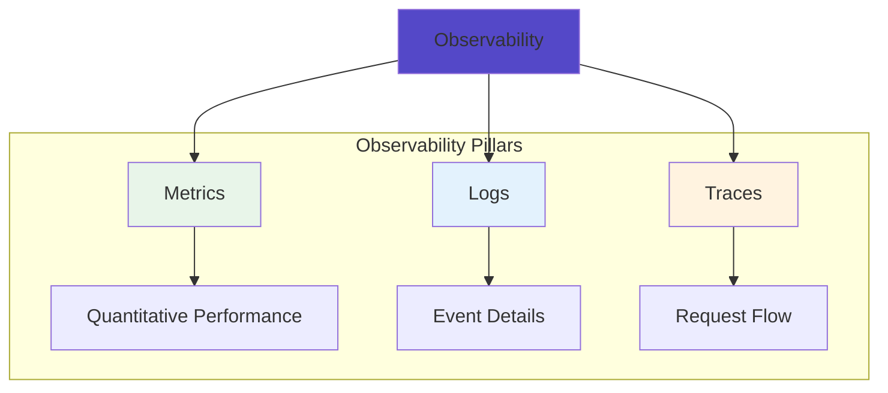

# Observability Patterns

Patterns for achieving comprehensive visibility into distributed systems, enabling effective monitoring, debugging, and performance optimization.

## Core Principles

## Pattern Overview

| Pattern | Description | Tier | When to Use |
|---------|-------------|------|------------|
| [Observability](observability.md) | Comprehensive system visibility through metrics, logs, and traces | 🥇 Gold | Production systems requiring deep insights |

## Key Concepts

### The Three Pillars
1. **Metrics**: Numeric measurements over time
2. **Logs**: Discrete events with context
3. **Traces**: Request flow across services

### Observable Systems
- High cardinality data
- Contextual information
- Real-time insights
- Historical analysis

## Best Practices

!!! tip "Observability Best Practices"
    - Instrument early and comprehensively
    - Use structured logging
    - Implement distributed tracing
    - Monitor business metrics
    - Set up intelligent alerting

## Related Patterns
- [Health Check](../resilience/health-check.md) - System health monitoring
- [Circuit Breaker](../resilience/circuit-breaker.md) - Failure detection
- [Service Mesh](../communication/service-mesh.md) - Built-in observability

## Learning Path
1. Start with basic metrics and logging
2. Add distributed tracing
3. Implement custom instrumentation
4. Build observability culture