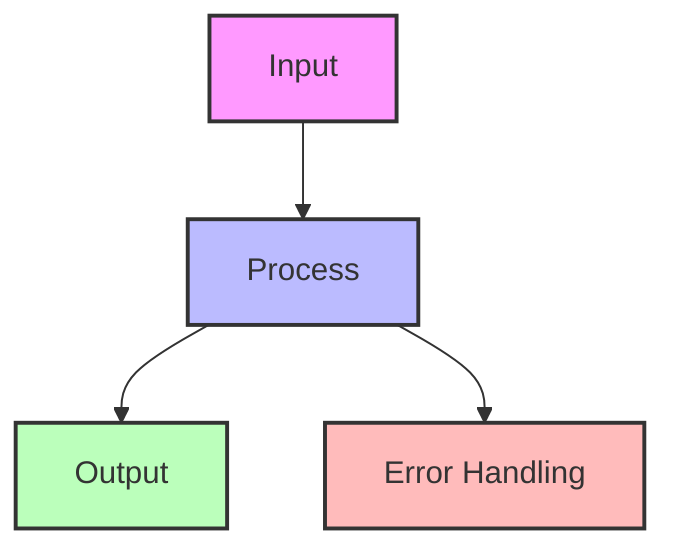
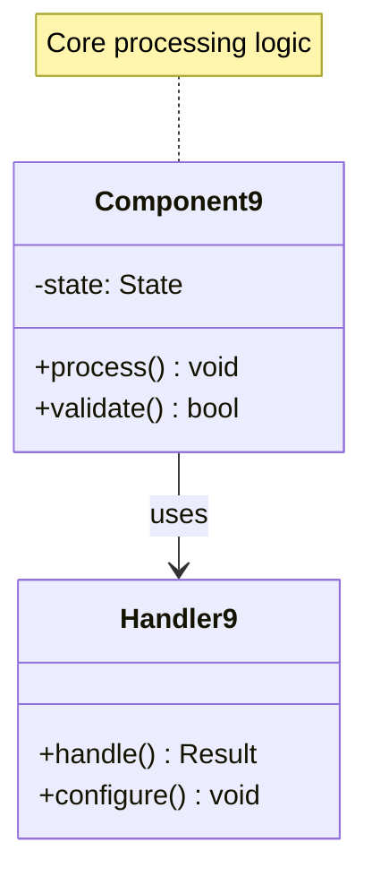
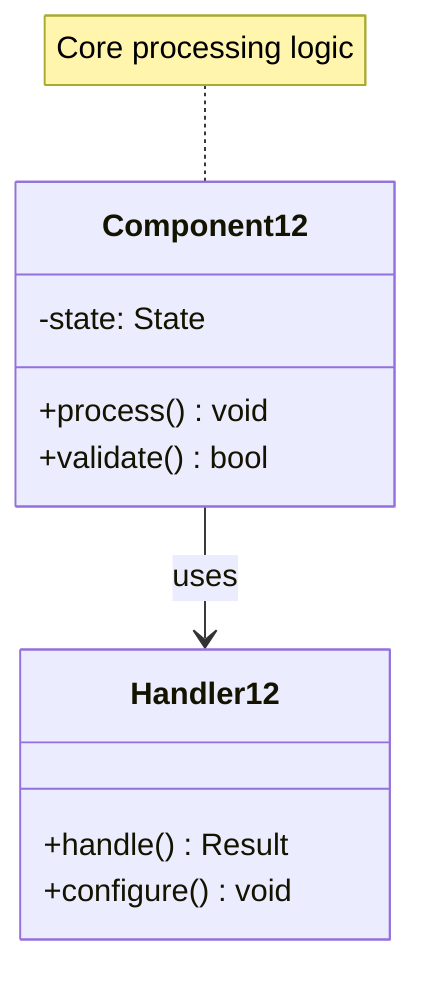
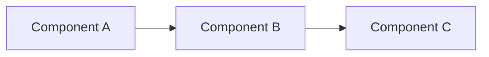
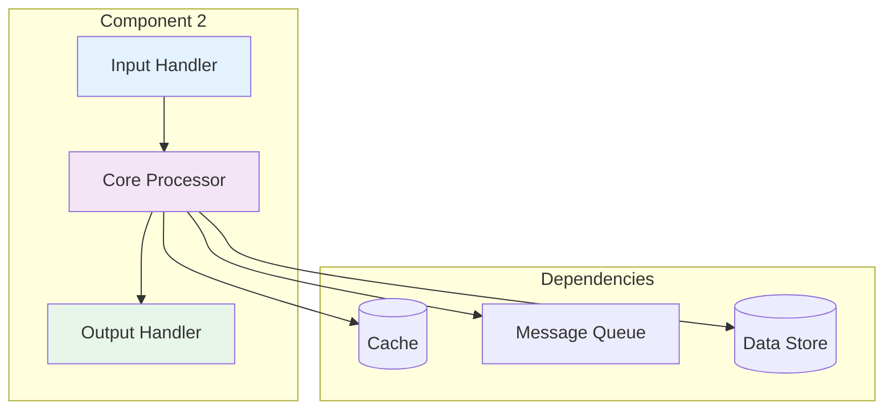
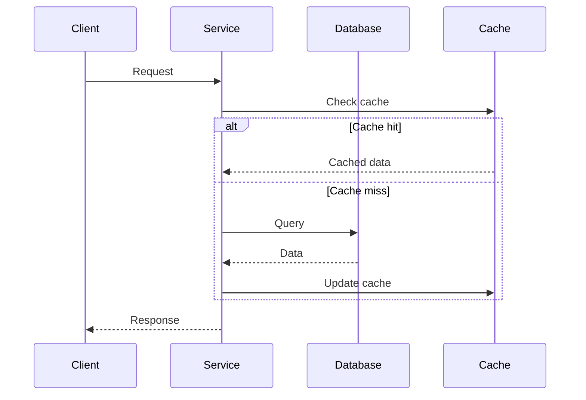

## Essential Question
## When to Use / When NOT to Use

### When to Use

| Scenario | Why It Fits | Alternative If Not |
|----------|-------------|-------------------|
| High availability required | Pattern provides resilience | Consider simpler approach |
| Scalability is critical | Handles load distribution | Monolithic might suffice |
| Distributed coordination needed | Manages complexity | Centralized coordination |

### When NOT to Use

| Scenario | Why to Avoid | Better Alternative |
|----------|--------------|-------------------|
| Simple applications | Unnecessary complexity | Direct implementation |
| Low traffic systems | Overhead not justified | Basic architecture |
| Limited resources | High operational cost | Simpler patterns |
**When and how should we implement pattern anti-patterns guide - what not to do in our distributed system?**

# Pattern Anti-Patterns Guide

<div class="warning-banner">
    <h2>⚠️ Learn from Others' Mistakes</h2>
    <p>This guide documents common anti-patterns that have caused production outages, performance degradation, and maintenance nightmares.</p>
</div>

## 🚫 The Hall of Shame

### Top 10 Most Dangerous Anti-Patterns

1. **Distributed Monolith** - Microservices that share databases
2. **Chatty Services** - Excessive synchronous calls between services
3. **Missing Circuit Breakers** - No protection against cascade failures
4. **Synchronous Everything** - No async communication patterns
5. **No Timeout Strategy** - Unbounded operations
6. **Shared Mutable State** - Race conditions at scale
7. **No Monitoring** - Flying blind in production
8. **Premature Optimization** - Complex patterns without need
9. **Data Inconsistency Ignorance** - Assuming distributed ACID
10. **Single Point of Failure** - No redundancy in critical paths

## 🔍 Anti-Pattern Detector

### Quick Diagnostic Tool

<div class="diagnostic-tool">
    <h3>Is Your System at Risk?</h3>
    <div class="checklist">
        <label><input type="checkbox"> Services share the same database</label>
        <label><input type="checkbox"> No circuit breakers on external calls</label>
        <label><input type="checkbox"> All communication is synchronous</label>
        <label><input type="checkbox"> No health check endpoints</label>
        <label><input type="checkbox"> Missing timeouts on network calls</label>
        <label><input type="checkbox"> No monitoring or alerting</label>
        <label><input type="checkbox"> Single region deployment</label>
        <label><input type="checkbox"> No caching strategy</label>
        <label><input type="checkbox"> Manual scaling only</label>
        <label><input type="checkbox"> No message queues or async processing</label>
    </div>
    <div class="risk-assessment">
        <p><strong>Risk Level:</strong> <span id="risk-level">Check items to assess</span></p>
        <p><strong>Recommendation:</strong> <span id="recommendation">Complete checklist for guidance</span></p>
    </div>
</div>

## ❌ Communication Anti-Patterns

### 1. The Distributed Monolith

*See Implementation Example 1 in Appendix*

**Why It's Bad:**
- Services aren't truly independent
- Schema changes affect all services
- Can't scale services independently
- Database becomes bottleneck

**The Fix:**
<details>
<summary>📄 View mermaid code (9 lines)</summary>

<details>
<summary>📄 View mermaid code (9 lines)</summary>



</details>

</details>

<details>
<summary>View implementation code</summary>

*See Implementation Example 2 in Appendix*

</details>

### 2. Chatty Services

**Anti-Pattern Code:**
<details>
<summary>📄 View python code (9 lines)</summary>

```python
## ❌ BAD: Multiple synchronous calls
def get_user_dashboard(user_id):
    user = user_service.get_user(user_id)  # Call 1
    orders = order_service.get_orders(user_id)  # Call 2
    recommendations = recommendation_service.get_recs(user_id)  # Call 3
    notifications = notification_service.get_notifications(user_id)  # Call 4
    
    # Total latency = sum of all calls (sequential)
    return compile_dashboard(user, orders, recommendations, notifications)
```

</details>

**Pattern Fix:**
*See Implementation Example 3 in Appendix*

<details>
<summary>📄 View async implementation</summary>

## ✅ GOOD: Parallel calls with aggregation
async def get_user_dashboard(user_id):
    # Parallel execution
    user, orders, recs, notifs = await asyncio.gather(
        user_service.get_user(user_id),
        order_service.get_orders(user_id),
        recommendation_service.get_recs(user_id),
        notification_service.get_notifications(user_id)
    )
    
    # Or use API Gateway aggregation
    # Or implement BFF pattern
    return compile_dashboard(user, orders, recs, notifs)

</details>

### 3. Missing Circuit Breakers

**Anti-Pattern:**
*See Implementation Example 4 in Appendix*

**Pattern Fix:**
*See Implementation Example 5 in Appendix*

## ❌ Data Management Anti-Patterns

### 4. Assuming Distributed ACID

**Anti-Pattern:**
<details>
<summary>📄 View python code (7 lines)</summary>

```python
## ❌ BAD: Trying to maintain consistency across services
def transfer_money(from_account, to_account, amount):
    # This doesn't work in distributed systems!
    account_service.debit(from_account, amount)
    payment_service.process_transfer(amount)
    account_service.credit(to_account, amount)
    # What if step 3 fails after steps 1 & 2 succeed?
```

</details>

**Pattern Fix:**


<details>
<summary>View implementation code</summary>



<details>
<summary>📄 View implementation code</summary>

## ✅ GOOD: Saga pattern with compensation
class MoneyTransferSaga:
    def execute(self, from_account, to_account, amount):
        saga = SagaOrchestrator()
        
        saga.add_step(
            action=lambda: account_service.debit(from_account, amount),
            compensation=lambda: account_service.credit(from_account, amount)
        )
        
        saga.add_step(
            action=lambda: payment_service.process_transfer(amount),
            compensation=lambda: payment_service.cancel_transfer(amount)
        )
        
        saga.add_step(
            action=lambda: account_service.credit(to_account, amount),
            compensation=lambda: account_service.debit(to_account, amount)
        )
        
        return saga.execute()

</details>

</details>

### 5. N+1 Query Problem

**Anti-Pattern:**
<details>
<summary>📄 View python code (7 lines)</summary>

```python
## ❌ BAD: Fetching related data in loops
def get_orders_with_details():
    orders = get_all_orders()  # 1 query
    for order in orders:
        order.items = get_order_items(order.id)  # N queries
        order.customer = get_customer(order.customer_id)  # N queries
    # Total: 1 + 2N queries!
```

</details>

**Pattern Fix:**
```python
## ✅ GOOD: Batch fetching or joins
def get_orders_with_details():
    orders = get_all_orders_with_items_and_customers()  # 1 query with joins
    # Or use DataLoader pattern for batching
    return orders
```

## ❌ Scalability Anti-Patterns

### 6. Stateful Services

**Anti-Pattern:**


<details>
<summary>📄 View implementation code</summary>

## ❌ BAD: Storing state in service memory
class ShoppingCartService:
    def __init__(self):
        self.carts = {}  # In-memory state
    
    def add_item(self, user_id, item):
        if user_id not in self.carts:
            self.carts[user_id] = []
        self.carts[user_id].append(item)
        # What happens when service restarts?
        # How do you scale horizontally?

</details>

**Pattern Fix:**
<details>
<summary>📄 View python code (9 lines)</summary>

```python
## ✅ GOOD: External state store
class ShoppingCartService:
    def __init__(self):
        self.redis = Redis()
    
    def add_item(self, user_id, item):
        key = f"cart:{user_id}"
        self.redis.rpush(key, json.dumps(item))
        self.redis.expire(key, 3600)  # 1 hour TTL
```

</details>

### 7. No Caching Strategy

**Anti-Pattern:**
```python
## ❌ BAD: Always hitting database
def get_product(product_id):
    return database.query(f"SELECT * FROM products WHERE id = {product_id}")
    # Every request hits DB
    # No performance optimization
```

**Pattern Fix:**
*See Implementation Example 6 in Appendix*

## ❌ Resilience Anti-Patterns

### 8. No Timeout Strategy

**Anti-Pattern:**
```python
## ❌ BAD: Unbounded operations
def fetch_data():
    response = requests.get("http://slow-service/data")
    # Could wait forever!
    return response.json()
```

**Pattern Fix:**
*See Implementation Example 7 in Appendix*

### 9. Single Point of Failure

**Anti-Pattern:**
<details>
<summary>📄 View yaml code (6 lines)</summary>

```yaml
## ❌ BAD: No redundancy
architecture:
  load_balancer: single_instance
  database: single_master
  cache: single_node
  region: us-east-1_only
```

</details>

**Pattern Fix:**
*See Implementation Example 8 in Appendix*

## 💡 Anti-Pattern Prevention Checklist

### Design Phase
- [ ] Each service owns its data
- [ ] Async communication preferred
- [ ] Failure scenarios identified
- [ ] Scaling strategy defined
- [ ] Monitoring plan created

#
## Level 1: Intuition (5 minutes)

*Start your journey with relatable analogies*

### The Elevator Pitch
[Pattern explanation in simple terms]

### Real-World Analogy
[Everyday comparison that explains the concept]

## Level 2: Foundation (10 minutes)

*Build core understanding*

### Core Concepts
- Key principle 1
- Key principle 2
- Key principle 3

### Basic Example


## Level 3: Deep Dive (15 minutes)

*Understand implementation details*

### How It Really Works
[Technical implementation details]

### Common Patterns
[Typical usage patterns]

## Level 4: Expert (20 minutes)

*Master advanced techniques*

### Advanced Configurations
[Complex scenarios and optimizations]

### Performance Tuning
[Optimization strategies]

## Level 5: Mastery (30 minutes)

*Apply in production*

### Real-World Case Studies
[Production examples from major companies]

### Lessons from the Trenches
[Common pitfalls and solutions]


## Decision Matrix

*See Implementation Example 9 in Appendix*

### Quick Decision Table

| Factor | Low Complexity | Medium Complexity | High Complexity |
|--------|----------------|-------------------|-----------------|
| Team Size | < 5 developers | 5-20 developers | > 20 developers |
| Traffic | < 1K req/s | 1K-100K req/s | > 100K req/s |
| Data Volume | < 1GB | 1GB-1TB | > 1TB |
| **Recommendation** | ❌ Avoid | ⚠️ Consider | ✅ Implement |

## Implementation Phase
- [ ] Circuit breakers on all external calls
- [ ] Timeouts on all operations
- [ ] Retries with exponential backoff
- [ ] Graceful degradation paths
- [ ] Comprehensive error handling

### Deployment Phase
- [ ] Multi-region deployment
- [ ] Auto-scaling configured
- [ ] Health checks enabled
- [ ] Monitoring active
- [ ] Chaos testing performed

## 🎯 Pattern vs Anti-Pattern Quick Reference

| Anti-Pattern | Use This Pattern Instead | Why |
|--------------|-------------------------|-----|
| Distributed Monolith | Database per Service + Events | True service independence |
| Chatty Services | API Gateway/BFF | Reduce network calls |
| No Circuit Breakers | Circuit Breaker + Retry | Prevent cascade failures |
| Synchronous Everything | Message Queues | Better scalability |
| No Timeouts | Timeout + Fallback | Prevent hanging |
| Shared State | External State Store | Horizontal scaling |
| No Caching | Multi-layer Cache | Performance |
| Manual Scaling | Auto-scaling | Handle load spikes |
| Single Region | Multi-region | Disaster recovery |
| No Monitoring | Observability Stack | Operational visibility |

## 🚑 Recovery Guide

### If You're Already Using Anti-Patterns

1. **Don't Panic** - Most systems have some anti-patterns
2. **Prioritize** - Fix the most dangerous ones first
3. **Gradual Migration** - Use strangler pattern
4. **Monitor Impact** - Measure before/after
5. **Document Learnings** - Share with team

### Migration Priority Matrix

| Anti-Pattern | Impact | Effort | Priority |
|--------------|--------|--------|----------|
| No Circuit Breakers | High | Low | 🔥 Critical |
| Missing Timeouts | High | Low | 🔥 Critical |
| Shared Database | High | High | 🟠 Important |
| No Monitoring | Medium | Low | 🟡 Quick Win |
| Manual Scaling | Medium | Medium | 🟢 Plan |

---

*Remember: Anti-patterns often start as pragmatic choices. The key is recognizing when to refactor before they become critical issues.*


## Appendix: Implementation Details

### Implementation Example 1

*See Implementation Example 1 in Appendix*

### Implementation Example 2

*See Implementation Example 2 in Appendix*

### Implementation Example 3

*See Implementation Example 3 in Appendix*

### Implementation Example 4

*See Implementation Example 4 in Appendix*

### Implementation Example 5

*See Implementation Example 5 in Appendix*

### Implementation Example 6

*See Implementation Example 6 in Appendix*

### Implementation Example 7

*See Implementation Example 7 in Appendix*

### Implementation Example 8

*See Implementation Example 8 in Appendix*

### Implementation Example 9

*See Implementation Example 9 in Appendix*


## Appendix: Implementation Details

### Implementation Example 1


### Implementation Example 2



### Implementation Example 3



### Implementation Example 4


### Implementation Example 5


### Implementation Example 6


### Implementation Example 7


### Implementation Example 8


### Implementation Example 9


