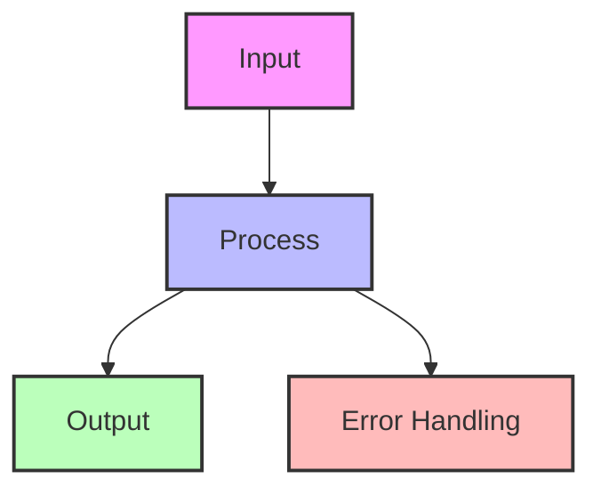
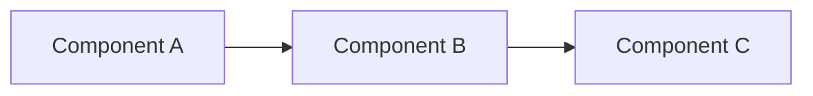
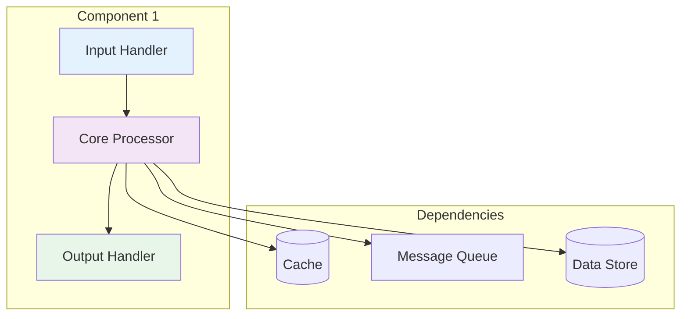
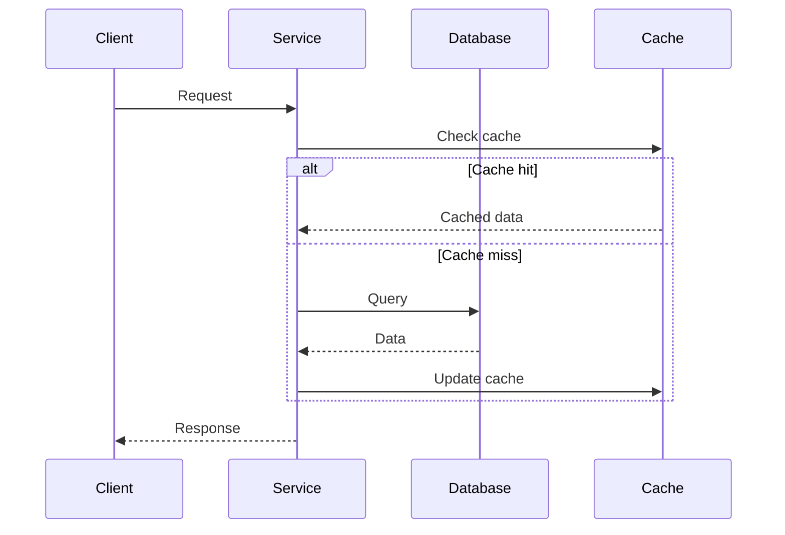

## Essential Question
## When to Use / When NOT to Use

### When to Use

| Scenario | Why It Fits | Alternative If Not |
|----------|-------------|-------------------|
| High availability required | Pattern provides resilience | Consider simpler approach |
| Scalability is critical | Handles load distribution | Monolithic might suffice |
| Distributed coordination needed | Manages complexity | Centralized coordination |

### When NOT to Use

| Scenario | Why to Avoid | Better Alternative |
|----------|--------------|-------------------|
| Simple applications | Unnecessary complexity | Direct implementation |
| Low traffic systems | Overhead not justified | Basic architecture |
| Limited resources | High operational cost | Simpler patterns |
**When and how should we implement pattern combination recipes - proven architectural stacks in our distributed system?**

# Pattern Combination Recipes

Learn from proven pattern combinations that power the world's largest distributed systems.

## 🍳 Quick Recipe Finder

<div class="recipe-finder">
    <div class="recipe-categories">
        <button class="recipe-cat-btn active" onclick="filterRecipes('all')">🌐 All Recipes</button>
        <button class="recipe-cat-btn" onclick="filterRecipes('resilience')">🛡️ Resilience</button>
        <button class="recipe-cat-btn" onclick="filterRecipes('scale')">🚀 Scale</button>
        <button class="recipe-cat-btn" onclick="filterRecipes('realtime')">⚡ Real-time</button>
        <button class="recipe-cat-btn" onclick="filterRecipes('data')">💾 Data</button>
        <button class="recipe-cat-btn" onclick="filterRecipes('migration')">🔄 Migration</button>
    </div>
</div>

## 🏆 Battle-Tested Stacks

### The Netflix Resilience Stack
**Used for: 200M+ subscribers, 100B+ requests/day**

<details>
<summary>📄 View mermaid code (9 lines)</summary>

<details>
<summary>📄 View mermaid code (9 lines)</summary>

<details>
<summary>📄 View mermaid code (9 lines)</summary>

<details>
<summary>📄 View mermaid code (9 lines)</summary>



</details>

</details>

</details>

</details>

<details>
<summary>View implementation code</summary>

*See Implementation Example 1 in Appendix*

</details>

**Pattern Combination:**
1. 🌐 **API Gateway** (Zuul) - Single entry point
2. 🛡️ **Circuit Breaker** (Hystrix) - Prevent cascade failures
3. ⚖️ **Load Balancer** (Ribbon) - Distribute traffic
4. 🔍 **Service Discovery** (Eureka) - Dynamic routing
5. 📦 **Distributed Cache** (EVCache) - Reduce latency
6. 📨 **Event Streaming** (Kafka) - Async communication

**Key Success Factors:**
- Circuit breakers on all service calls
- Aggressive caching (90%+ cache hit rate)
- Graceful degradation for non-critical features
- Chaos engineering to test resilience

### The Uber Real-Time Stack
**Used for: 25M+ rides/day, sub-second dispatch**


<details>
<summary>View implementation code</summary>

*See Implementation Example 2 in Appendix*

</details>

**Pattern Combination:**
1. 🔌 **WebSocket** - Real-time bidirectional communication
2. 🌍 **Geo-Sharding** - Location-based partitioning
3. 📢 **Pub/Sub** - Event distribution
4. 🧩 **Cell-Based Architecture** - Isolated failure domains
5. 🎯 **Consistent Hashing** - Dynamic scaling
6. 📦 **In-Memory Cache** (Redis) - Ultra-low latency

**Key Success Factors:**
- Geo-sharding for locality
- WebSocket with fallback to polling
- Cell isolation prevents global failures
- Predictive scaling based on ML

### The Amazon E-Commerce Stack
**Used for: 300M+ customers, Prime Day scale**


<details>
<summary>View implementation code</summary>

*See Implementation Example 3 in Appendix*

</details>

**Pattern Combination:**
1. 🌐 **CDN** (CloudFront) - Global static content
2. 🚀 **Auto-scaling** - Handle traffic spikes
3. 📦 **NoSQL** (DynamoDB) - Unlimited scale
4. 📨 **Message Queue** (SQS) - Decouple services
5. 🌊 **Stream Processing** (Kinesis) - Real-time analytics
6. ☁️ **Serverless** (Lambda) - Event-driven compute

## 📖 Recipe Categories

### 🛡️ Resilience Recipes

#### Recipe: "The Unbreakable Service"
**Problem**: Service with 99.99% uptime requirement

*See Implementation Example 4 in Appendix*

#### Recipe: "Chaos-Ready Architecture"
**Problem**: System that survives any failure

*See Implementation Example 5 in Appendix*

### 🚀 Scale Recipes

#### Recipe: "0 to 1M Users"
**Problem**: Rapid growth from startup to scale

*See Implementation Example 6 in Appendix*

<details>
<summary>📄 View async implementation</summary>

Phase 1 (0-10K users):
  - Load Balancer + 2 servers
  - Basic caching (Redis)
  - CDN for static assets
  - Simple monitoring

Phase 2 (10K-100K users):
  - Auto-scaling groups
  - Read replicas for database
  - API Gateway
  - Distributed caching

Phase 3 (100K-1M users):
  - Microservices architecture
  - Message queues for async
  - Database sharding
  - Multi-region deployment

Time: 6-12 months per phase

</details>

#### Recipe: "Infinite Scale"
**Problem**: Google/Facebook scale architecture

*See Implementation Example 7 in Appendix*

### ⚡ Real-Time Recipes

#### Recipe: "Sub-Second Latency"
**Problem**: Real-time trading/gaming platform

*See Implementation Example 8 in Appendix*

### 💾 Data Consistency Recipes

#### Recipe: "Eventually Consistent E-Commerce"
**Problem**: Shopping cart across devices

*See Implementation Example 9 in Appendix*

### 🔄 Migration Recipes

#### Recipe: "Monolith to Microservices"
**Problem**: Breaking down a large monolith

*See Implementation Example 10 in Appendix*

## 🎯 Anti-Recipes (What NOT to Do)

### ❌ The "Everything Everywhere" Anti-Pattern
<details>
<summary>📄 View yaml code (7 lines)</summary>

```yaml
Bad Ingredients:
  - Every pattern in the book
  - No clear architecture
  - Premature optimization
  - Resume-driven development

Result: Unmaintainable complexity
```

</details>

### ❌ The "Distributed Monolith"
<details>
<summary>📄 View yaml code (7 lines)</summary>

```yaml
Bad Ingredients:
  - Microservices sharing databases
  - Synchronous everything
  - No service boundaries
  - Chatty interfaces

Result: Worst of both worlds
```

</details>

## 🔧 Implementation Guide

### How to Apply a Recipe

1. **Assess Current State**
   - What patterns do you have?
   - What problems are you solving?
   - What's your scale?

2. **Choose Recipe**
   - Match your problem
   - Consider your scale
   - Check prerequisites

3. **Implement Gradually**
   - Start with foundation
   - Add patterns incrementally
   - Measure impact

4. **Customize**
   - Adapt to your context
   - Remove unnecessary parts
   - Add missing pieces

## 📊 Success Metrics

### How to Know Your Recipe Works

| Metric | Good | Great | Elite |
|--------|------|-------|-------|
| Availability | 99.9% | 99.99% | 99.999% |
| Latency (p99) | <1s | <200ms | <50ms |
| Error Rate | <1% | <0.1% | <0.01% |
| Deploy Frequency | Weekly | Daily | Hourly |
| MTTR | <1hr | <15min | <5min |

## 🌟 Recipe Maturity Model


<details>
<summary>View implementation code</summary>

*See Implementation Example 11 in Appendix*

</details>

---

*These recipes are extracted from real production systems. Adapt them to your specific needs, and remember: start simple, evolve gradually.*


## Level 1: Intuition (5 minutes)

*Start your journey with relatable analogies*

### The Elevator Pitch
[Pattern explanation in simple terms]

### Real-World Analogy
[Everyday comparison that explains the concept]

## Level 2: Foundation (10 minutes)

*Build core understanding*

### Core Concepts
- Key principle 1
- Key principle 2
- Key principle 3

### Basic Example


## Level 3: Deep Dive (15 minutes)

*Understand implementation details*

### How It Really Works
[Technical implementation details]

### Common Patterns
[Typical usage patterns]

## Level 4: Expert (20 minutes)

*Master advanced techniques*

### Advanced Configurations
[Complex scenarios and optimizations]

### Performance Tuning
[Optimization strategies]

## Level 5: Mastery (30 minutes)

*Apply in production*

### Real-World Case Studies
[Production examples from major companies]

### Lessons from the Trenches
[Common pitfalls and solutions]


## Decision Matrix

*See Implementation Example 12 in Appendix*

### Quick Decision Table

| Factor | Low Complexity | Medium Complexity | High Complexity |
|--------|----------------|-------------------|-----------------|
| Team Size | < 5 developers | 5-20 developers | > 20 developers |
| Traffic | < 1K req/s | 1K-100K req/s | > 100K req/s |
| Data Volume | < 1GB | 1GB-1TB | > 1TB |
| **Recommendation** | ❌ Avoid | ⚠️ Consider | ✅ Implement |


## Appendix: Implementation Details

### Implementation Example 1

*See Implementation Example 1 in Appendix*

### Implementation Example 2

*See Implementation Example 2 in Appendix*

### Implementation Example 3

*See Implementation Example 3 in Appendix*

### Implementation Example 4

*See Implementation Example 4 in Appendix*

### Implementation Example 5

*See Implementation Example 5 in Appendix*

### Implementation Example 6

*See Implementation Example 6 in Appendix*

### Implementation Example 7

*See Implementation Example 7 in Appendix*

### Implementation Example 8

*See Implementation Example 8 in Appendix*

### Implementation Example 9

*See Implementation Example 9 in Appendix*

### Implementation Example 10

*See Implementation Example 10 in Appendix*

### Implementation Example 11

*See Implementation Example 11 in Appendix*

### Implementation Example 12

*See Implementation Example 12 in Appendix*


## Appendix: Implementation Details

### Implementation Example 1



### Implementation Example 2


### Implementation Example 3


### Implementation Example 4


### Implementation Example 5


### Implementation Example 6



### Implementation Example 7


### Implementation Example 8


### Implementation Example 9


### Implementation Example 10


### Implementation Example 11


### Implementation Example 12


