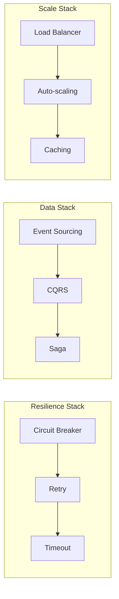

# Pattern Comparison Tool

Compare patterns side-by-side to understand trade-offs and make informed decisions.

## 🔍 Quick Comparisons

### Popular Comparisons

    <button class="compare-btn" onclick="loadComparison('circuit-breaker', 'retry')">
        Circuit Breaker vs Retry
    </button>
    <button class="compare-btn" onclick="loadComparison('event-sourcing', 'cqrs')">
        Event Sourcing vs CQRS
    </button>
    <button class="compare-btn" onclick="loadComparison('service-mesh', 'api-gateway')">
        Service Mesh vs API Gateway
    </button>
    <button class="compare-btn" onclick="loadComparison('saga', 'two-phase-commit')">
        Saga vs 2PC
    </button>
    <button class="compare-btn" onclick="loadComparison('grpc', 'rest')">
        gRPC vs REST
    </button>
    <button class="compare-btn" onclick="loadComparison('monolith', 'microservices')">
        Monolith vs Microservices
    </button>

## ⚖️ Interactive Comparison

    

        

            <label>Pattern A:</label>
            <select id="pattern-a-select" onchange="updateComparison()">
                <option value="">Select a pattern...</option>
                <optgroup label="🛡️ Resilience">
                    <option value="circuit-breaker">Circuit Breaker</option>
                    <option value="retry">Retry with Backoff</option>
                    <option value="bulkhead">Bulkhead</option>
                    <option value="timeout">Timeout</option>
                </optgroup>
                <optgroup label="📡 Communication">
                    <option value="api-gateway">API Gateway</option>
                    <option value="service-mesh">Service Mesh</option>
                    <option value="grpc">gRPC</option>
                    <option value="message-queue">Message Queue</option>
                </optgroup>
                <optgroup label="💾 Data Management">
                    <option value="event-sourcing">Event Sourcing</option>
                    <option value="cqrs">CQRS</option>
                    <option value="saga">Saga</option>
                    <option value="cdc">CDC</option>
                </optgroup>
            </select>
        

        
VS

        

            <label>Pattern B:</label>
            <select id="pattern-b-select" onchange="updateComparison()">
                <option value="">Select a pattern...</option>
                <optgroup label="🛡️ Resilience">
                    <option value="circuit-breaker">Circuit Breaker</option>
                    <option value="retry">Retry with Backoff</option>
                    <option value="bulkhead">Bulkhead</option>
                    <option value="timeout">Timeout</option>
                </optgroup>
                <optgroup label="📡 Communication">
                    <option value="api-gateway">API Gateway</option>
                    <option value="service-mesh">Service Mesh</option>
                    <option value="grpc">gRPC</option>
                    <option value="message-queue">Message Queue</option>
                </optgroup>
                <optgroup label="💾 Data Management">
                    <option value="event-sourcing">Event Sourcing</option>
                    <option value="cqrs">CQRS</option>
                    <option value="saga">Saga</option>
                    <option value="cdc">CDC</option>
                </optgroup>
            </select>
        

    

    
    

        

            
Select two patterns above to compare them side-by-side

        

    

## 📊 Common Pattern Comparisons

### Resilience Patterns

#### Circuit Breaker vs Retry

| Aspect | Circuit Breaker | Retry with Backoff |
|--------|----------------|-------------------|
| **Purpose** | Prevent cascade failures | Handle transient failures |
| **When to Use** | Protecting against downstream failures | Network glitches, temporary unavailability |
| **Failure Handling** | Fails fast when threshold reached | Attempts multiple times before failing |
| **State Management** | Stateful (Open/Closed/Half-Open) | Stateless |
| **Resource Impact** | Reduces load on failing service | Can increase load if not careful |
| **Recovery** | Automatic with timeout | Immediate on next request |
| **Best Together** | ✅ Yes - Circuit Breaker wraps Retry | ✅ Yes - Retry inside Circuit Breaker |

#### Bulkhead vs Circuit Breaker

| Aspect | Bulkhead | Circuit Breaker |
|--------|----------|----------------|
| **Purpose** | Isolate resources | Prevent cascade failures |
| **Scope** | Resource isolation | Service protection |
| **Implementation** | Thread pools, semaphores | State machine |
| **Failure Impact** | Contains failure to one partition | Stops calls to failing service |
| **Use Case** | Multi-tenant systems | Microservice communication |

### Communication Patterns

#### Service Mesh vs API Gateway

| Aspect | Service Mesh | API Gateway |
|--------|--------------|-------------|
| **Deployment** | Sidecar per service | Centralized gateway |
| **Protocol Support** | Any TCP protocol | Primarily HTTP/REST |
| **Service Discovery** | Built-in | Requires integration |
| **Traffic Management** | Fine-grained per service | Coarse-grained at edge |
| **Observability** | Detailed service-to-service | Edge traffic only |
| **Complexity** | High (distributed) | Medium (centralized) |
| **Best For** | Internal service communication | External API management |

#### gRPC vs REST

| Aspect | gRPC | REST |
|--------|------|------|
| **Protocol** | HTTP/2 binary | HTTP/1.1 text |
| **Performance** | High (binary, multiplexing) | Lower (text, no multiplexing) |
| **Schema** | Protobuf (strongly typed) | OpenAPI (optional) |
| **Streaming** | Bidirectional streaming | Request-response only |
| **Browser Support** | Limited (needs proxy) | Universal |
| **Debugging** | Harder (binary) | Easy (text) |
| **Use Case** | Internal services | Public APIs |

### Data Management Patterns

#### Event Sourcing vs CQRS

| Aspect | Event Sourcing | CQRS |
|--------|----------------|------|
| **Core Concept** | Store events, not state | Separate read/write models |
| **Complexity** | High | Medium |
| **Audit Trail** | Complete by design | Requires additional work |
| **Performance** | Write: Fast, Read: Slower | Both optimized separately |
| **Eventual Consistency** | Always | Optional |
| **Best Together** | ✅ Often combined | ✅ ES enables CQRS |

#### Saga vs Two-Phase Commit

| Aspect | Saga | Two-Phase Commit |
|--------|------|------------------|
| **Consistency** | Eventual | Strong |
| **Availability** | High | Low (blocking) |
| **Scalability** | Excellent | Poor |
| **Failure Handling** | Compensation | Rollback |
| **Complexity** | Medium-High | Low-Medium |
| **Modern Usage** | Recommended | Legacy/Avoid |

## 🎯 Decision Framework

### When Comparing Patterns, Consider:

1. **Scale Requirements**
   - Current load
   - Growth projections
   - Global distribution needs

2. **Consistency Needs**
   - Strong vs Eventual
   - Audit requirements
   - Regulatory compliance

3. **Team Expertise**
   - Current skills
   - Learning curve
   - Operational complexity

4. **Cost Factors**
   - Implementation cost
   - Operational cost
   - Maintenance burden

## 🔄 Pattern Combinations

### Patterns That Work Well Together

### Conflicting Patterns

| Pattern A | Pattern B | Why They Conflict |
|-----------|-----------|-------------------|
| Synchronous RPC | Event-Driven | Opposite communication models |
| Shared Database | Microservices | Violates service independence |
| Two-Phase Commit | Saga | Different consistency approaches |
| Monolith | Service Mesh | Architectural mismatch |

## 📈 Migration Paths

### Common Pattern Transitions

1. **Monolith → Microservices**
   - Start: Strangler Fig pattern
   - Add: API Gateway
   - Then: Service Discovery
   - Finally: Service Mesh

2. **Synchronous → Asynchronous**
   - Start: Message Queue
   - Add: Event Sourcing
   - Then: CQRS
   - Finally: Event-Driven Architecture

3. **No Resilience → Full Resilience**
   - Start: Health Checks
   - Add: Timeouts
   - Then: Retry with Backoff
   - Finally: Circuit Breaker + Bulkhead

## 💡 Quick Decision Guide

### "Should I use X or Y?"

<strong>Circuit Breaker or Retry?</strong>

Use BOTH! Retry handles transient failures, Circuit Breaker prevents cascade failures. Wrap Retry with Circuit Breaker.

<strong>Service Mesh or API Gateway?</strong>

API Gateway for edge traffic, Service Mesh for service-to-service. Large systems often use both.

<strong>Event Sourcing or CQRS?</strong>

They solve different problems. Event Sourcing for audit trails, CQRS for read/write optimization. Often used together.

<strong>Saga or Two-Phase Commit?</strong>

Always prefer Saga for distributed systems. 2PC doesn't scale and reduces availability.

<strong>Monolith or Microservices?</strong>

Start with modular monolith. Move to microservices when you hit scaling limits or need independent deployments.

---

*Use this comparison tool to make informed decisions about pattern selection. Remember: context matters more than general rules.*
