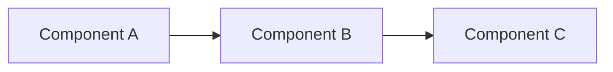
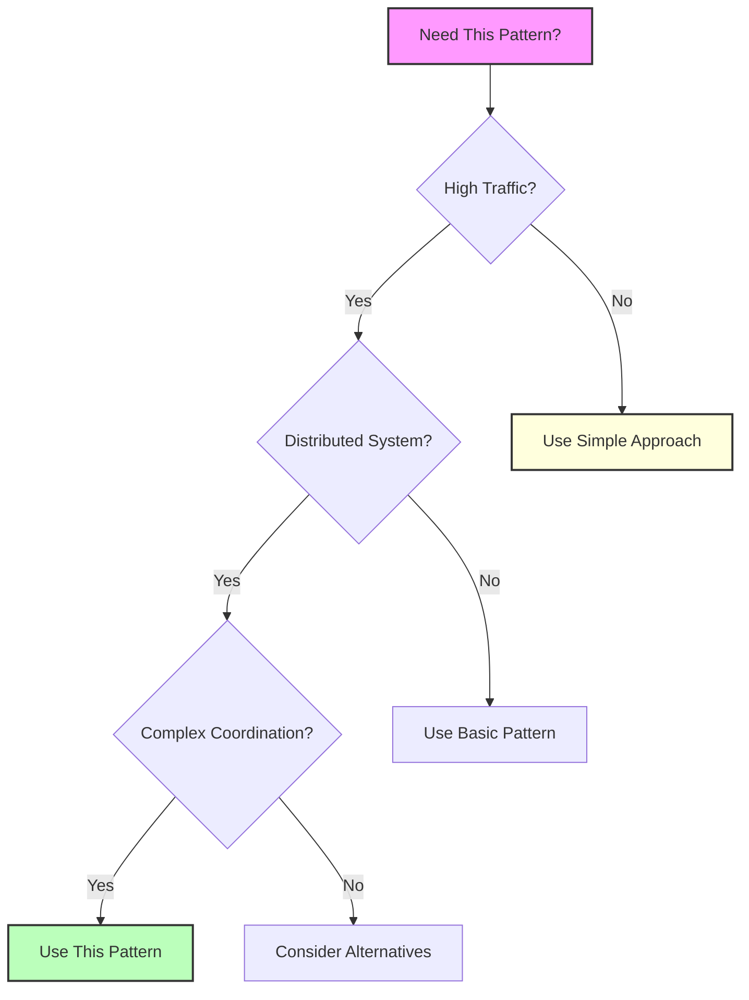

## Essential Question
## When to Use / When NOT to Use

### When to Use

| Scenario | Why It Fits | Alternative If Not |
|----------|-------------|-------------------|
| High availability required | Pattern provides resilience | Consider simpler approach |
| Scalability is critical | Handles load distribution | Monolithic might suffice |
| Distributed coordination needed | Manages complexity | Centralized coordination |

### When NOT to Use

| Scenario | Why to Avoid | Better Alternative |
|----------|--------------|-------------------|
| Simple applications | Unnecessary complexity | Direct implementation |
| Low traffic systems | Overhead not justified | Basic architecture |
| Limited resources | High operational cost | Simpler patterns |
**When and how should we implement pattern decision matrix - choose the right patterns for your scenario in our distributed system?**

# Pattern Decision Matrix

Choose the right patterns for your specific scenario using these comprehensive decision matrices.

## 🎯 Quick Scenario Finder

| Your Scenario | Jump To Section |
|--------------|-----------------|
| Building a new microservice | [Microservices Starter Pack](#microservices-starter-pack) |
| Migrating from monolith | [Monolith Migration Matrix](#monolith-migration-matrix) |
| Handling high traffic | [High Traffic Scenarios](#high-traffic-scenarios) |
| Need real-time features | [Real-Time Systems](#real-time-systems) |
| Financial/Banking system | [Financial Systems](#financial-systems) |
| E-commerce platform | [E-commerce Platform](#e-commerce-platform) |
| IoT/Edge computing | [IoT and Edge Systems](#iot-and-edge-systems) |
| Global scale system | [Global Scale Architecture](#global-scale-architecture) |

## 📊 Master Decision Matrix

This matrix maps system characteristics to recommended patterns:

| System Characteristic | Primary Patterns | Supporting Patterns | Avoid |
|----------------------|------------------|---------------------|-------|
| **< 10K requests/day** | Monolith, Simple Cache, Basic LB | Health Check, Retry | Microservices, Service Mesh |
| **10K-100K requests/day** | API Gateway, Circuit Breaker, Cache | Load Balancer, CDN | Complex orchestration |
| **100K-1M requests/day** | Microservices, Auto-scaling, MQ | Service Mesh, CQRS | Synchronous everything |
| **> 1M requests/day** | Event-driven, Sharding, Edge Computing | Saga, Event Sourcing | Single points of failure |
| **High consistency needs** | Distributed Lock, 2PC, Consensus | Leader Election | Eventual consistency |
| **High availability needs** | Circuit Breaker, Multi-region, Bulkhead | Graceful Degradation | Single region |
| **Complex transactions** | Saga, Event Sourcing, Compensation | CQRS, Audit Log | Distributed transactions |
| **Real-time requirements** | WebSocket, Pub/Sub, Edge Computing | Message Queue, CDC | Batch processing |
| **Compliance/Audit needs** | Event Sourcing, Immutable Log | Audit Trail, Encryption | Mutable state |

## 🚀 Scenario-Based Pattern Selection

### Microservices Starter Pack

**Scenario**: Building your first microservices architecture (5-20 services)

| Concern | Must Have | Nice to Have | Future Consideration |
|---------|-----------|--------------|---------------------|
| **Service Communication** | REST APIs, Service Discovery | gRPC, GraphQL | Service Mesh |
| **Resilience** | Circuit Breaker, Retry, Timeout | Bulkhead, Fallback | Chaos Engineering |
| **Data Management** | Database per Service | CDC, Event Streaming | Event Sourcing |
| **API Management** | API Gateway | Rate Limiting | BFF Pattern |
| **Observability** | Centralized Logging, Metrics | Distributed Tracing | APM Tools |
| **Deployment** | Container Orchestration | Blue-Green Deploy | GitOps |

**Implementation Order**:
1. Week 1-2: Service Discovery + Health Checks
2. Week 3-4: API Gateway + Circuit Breaker
3. Week 5-6: Centralized Logging + Metrics
4. Week 7-8: Database per Service + Basic CDC

### Monolith Migration Matrix

**Scenario**: Breaking down a monolith into microservices

| Migration Phase | Patterns to Apply | Key Decisions | Risk Mitigation |
|----------------|-------------------|---------------|-----------------|
| **Phase 1: Strangler Fig** | Proxy/API Gateway, Feature Toggles | Which module first? | Keep fallback to monolith |
| **Phase 2: Data Separation** | Database per Service, CDC | Shared data strategy? | Dual writes temporarily |
| **Phase 3: Extract Services** | Service Discovery, Circuit Breaker | Service boundaries? | Start with read-only services |
| **Phase 4: Event Decoupling** | Event Sourcing, Message Queue | Sync vs Async? | Maintain audit trail |
| **Phase 5: Full Microservices** | Service Mesh, Saga Pattern | Orchestration vs Choreography? | Comprehensive monitoring |

### High Traffic Scenarios

**Scenario**: System experiencing or expecting high traffic (>100K requests/day)

| Traffic Pattern | Critical Patterns | Performance Patterns | Cost Optimization |
|----------------|-------------------|---------------------|-------------------|
| **Steady High Load** | Load Balancer, Horizontal Scaling | Cache Everything, CDN | Reserved Instances |
| **Spiky Traffic** | Auto-scaling, Queue-based Load Leveling | Circuit Breaker, Rate Limiting | Spot Instances |
| **Global Traffic** | GeoDNS, Multi-region, Edge Computing | Regional Caches, CDN | Edge Locations |
| **Read Heavy (90%+)** | CQRS, Read Replicas, Materialized Views | Aggressive Caching | Cache-aside Pattern |
| **Write Heavy** | Event Sourcing, Write Buffer, Sharding | Async Processing | Write-through Cache |

### Real-Time Systems

**Scenario**: Building systems with real-time requirements (<100ms latency)

| Use Case | Primary Patterns | Latency Optimization | Scalability Approach |
|----------|------------------|---------------------|---------------------|
| **Live Chat** | WebSocket, Pub/Sub | In-memory Cache, Edge Servers | Sticky Sessions, Sharding |
| **Gaming** | UDP Protocol, State Sync | Client Prediction, Regional Servers | Geographic Sharding |
| **Trading** | Event Streaming, CQRS | Colocation, Hardware Optimization | Vertical Scaling First |
| **Live Video** | CDN, Adaptive Bitrate | Edge Transcoding, P2P | Hierarchical CDN |
| **IoT Telemetry** | MQTT, Time-series DB | Edge Processing, Batching | Stream Processing |

### Financial Systems

**Scenario**: Building financial or banking systems with strict requirements

| Requirement | Essential Patterns | Compliance Patterns | Anti-Patterns |
|-------------|-------------------|--------------------|-|-------------|
| **ACID Transactions** | Saga, Compensation, 2PC | Event Sourcing, Audit Log | Eventual Consistency |
| **Audit Trail** | Event Sourcing, Immutable Log | Cryptographic Hash Chain | Mutable Records |
| **Regulatory Compliance** | Data Residency, Encryption | Access Control, Audit Log | Data in Multiple Jurisdictions |
| **High Availability** | Multi-region Active-Active | Disaster Recovery, Backup | Single Region |
| **Fraud Detection** | Stream Processing, Rules Engine | ML Pipelines, Anomaly Detection | Batch Only Processing |

### E-commerce Platform

**Scenario**: Building or scaling an e-commerce platform

| Component | Scale Patterns | Reliability Patterns | User Experience |
|-----------|---------------|---------------------|-----------------|
| **Product Catalog** | CDN, Elasticsearch, Cache | Circuit Breaker, Fallback | Faceted Search, Recommendations |
| **Shopping Cart** | Session Affinity, Redis | Persistent Cart, Graceful Degradation | Real-time Updates |
| **Checkout** | Saga Pattern, Idempotency | Retry with Backoff, Compensation | Progress Indicators |
| **Inventory** | Event Sourcing, CQRS | Distributed Lock, Reservation Pattern | Real-time Availability |
| **Payment** | External Gateway, Circuit Breaker | Timeout, Fallback Payment Methods | Multiple Payment Options |

### IoT and Edge Systems

**Scenario**: Building IoT or edge computing systems

| Challenge | Edge Patterns | Cloud Patterns | Hybrid Approach |
|-----------|--------------|----------------|-----------------|
| **Connectivity** | Store and Forward, Local Cache | Message Queue, Batch Upload | Edge Buffer + Cloud Sync |
| **Processing** | Edge Analytics, Filtering | Stream Processing, ML Training | Edge Inference + Cloud Training |
| **Scale** | Device Registry, Groups | Auto-scaling, Sharding | Hierarchical Architecture |
| **Updates** | OTA Updates, Rollback | Version Control, A/B Testing | Phased Rollouts |
| **Security** | Device Authentication, Encryption | API Gateway, Rate Limiting | Zero Trust Architecture |

### Global Scale Architecture

**Scenario**: Building systems for global scale (>10M users)

| Concern | Regional Patterns | Global Patterns | Consistency Trade-offs |
|---------|------------------|-----------------|----------------------|
| **Data Distribution** | Regional Sharding, Read Replicas | Geo-replication, Multi-master | Eventual Consistency |
| **Traffic Routing** | Regional Load Balancers | GeoDNS, Anycast | Latency vs Consistency |
| **Content Delivery** | Regional CDN | Global CDN, Edge Computing | Staleness vs Performance |
| **Service Deployment** | Regional Clusters | Global Service Mesh | Complexity vs Control |
| **Disaster Recovery** | Regional Failover | Global Active-Active | Cost vs Availability |

## 🎭 Pattern Selection by Quality Attributes

### Performance Requirements

| Latency Target | Caching Strategy | Data Patterns | Architecture Style |
|---------------|------------------|---------------|-------------------|
| < 10ms | In-memory Cache, Edge Cache | Denormalized, Read Replicas | Edge Computing |
| 10-50ms | Distributed Cache, CDN | CQRS, Materialized Views | Regional Distribution |
| 50-200ms | Application Cache | Optimized Queries | Standard Microservices |
| 200ms-1s | Database Cache | Normal Relational | Monolith OK |
| > 1s | Basic Caching | Batch Processing | Consider Redesign |

### Availability Requirements

| Target SLA | Required Patterns | Infrastructure | Operational Needs |
|------------|------------------|----------------|-------------------|
| 99% (87.6h/year down) | Basic Health Checks | Single Region, 2 AZs | On-call Rotation |
| 99.9% (8.76h/year) | Circuit Breaker, Retry | Multi-AZ, Auto-scaling | 24/7 Monitoring |
| 99.99% (52m/year) | Bulkhead, Graceful Degradation | Multi-region Active-Passive | SRE Team |
| 99.999% (5m/year) | Full Redundancy, Chaos Engineering | Multi-region Active-Active | Dedicated SRE Org |

### Scalability Requirements

| Scale Factor | Patterns Needed | Database Strategy | Caching Strategy |
|-------------|-----------------|-------------------|------------------|
| 10x growth | Load Balancer, Auto-scaling | Read Replicas | Application Cache |
| 100x growth | Microservices, Queue-based | Sharding | Distributed Cache |
| 1000x growth | Event-driven, CQRS | NoSQL, Event Sourcing | Multi-tier Cache |
| 10000x growth | Edge Computing, Cell-based | Geo-distributed | Edge Cache |

## 📋 Decision Flowcharts

### "Which Communication Pattern?"
```
Start → Is it real-time?
         ├─ Yes → Need bidirectional?
         │         ├─ Yes → WebSocket
         │         └─ No → Server-Sent Events
         └─ No → Is it async?
                  ├─ Yes → Need persistence?
                  │         ├─ Yes → Message Queue
                  │         └─ No → Pub/Sub
                  └─ No → REST API or gRPC
```

### "Which Data Pattern?"
```
Start → Need audit trail?
         ├─ Yes → Event Sourcing
         └─ No → Complex queries?
                  ├─ Yes → Different read/write patterns?
                  │         ├─ Yes → CQRS
                  │         └─ No → Materialized Views
                  └─ No → Need transactions?
                          ├─ Yes → Saga Pattern
                          └─ No → Simple CRUD
```

### "Which Resilience Pattern?"
```
Start → External dependency?
         ├─ Yes → Can fail independently?
         │         ├─ Yes → Circuit Breaker
         │         └─ No → Timeout + Retry
         └─ No → Resource constraints?
                  ├─ Yes → Bulkhead
                  └─ No → Health Checks
```

## 🏆 Pattern Combinations That Work

### The Netflix Stack
| Layer | Patterns | Purpose |
|-------|----------|---------|
| Edge | Zuul (API Gateway) | Single entry point |
| Resilience | Hystrix (Circuit Breaker) | Fault tolerance |
| Service | Eureka (Service Discovery) | Dynamic routing |
| Data | EVCache (Distributed Cache) | Performance |
| Streaming | Kafka | Event backbone |

### The Uber Stack
| Layer | Patterns | Purpose |
|-------|----------|---------|
| Mobile | WebSocket + Fallback | Real-time updates |
| Gateway | Custom API Gateway | Request routing |
| Services | Microservices + RPC | Service isolation |
| Data | Sharding + Schemaless | Scale + Flexibility |
| Analytics | Streaming + Lambda | Real-time + Batch |

### The Amazon Stack
| Layer | Patterns | Purpose |
|-------|----------|---------|
| Front-end | CloudFront (CDN) | Global distribution |
| Compute | Auto-scaling + Spot | Cost optimization |
| Storage | S3 + DynamoDB | Object + NoSQL |
| Queue | SQS + Kinesis | Async + Streaming |
| Workflow | Step Functions (Saga) | Orchestration |

## ⚡ Quick Decision Rules

1. **Start Simple**: Don't use a pattern unless you feel the pain it solves
2. **Resilience First**: Always add Circuit Breaker before scaling out
3. **Cache Everything**: But know your invalidation strategy
4. **Async When Possible**: Synchronous calls are the enemy of scale
5. **Monitor Before Optimizing**: You can't improve what you don't measure
6. **Design for Failure**: Everything fails, plan for it
7. **Evolutionary Architecture**: Your needs will change, design for change

---

*Use these decision matrices to quickly identify the right patterns for your scenario. Remember: the best pattern is the simplest one that solves your current problem.*

## Level 1: Intuition (5 minutes)

*Start your journey with relatable analogies*

### The Elevator Pitch
[Pattern explanation in simple terms]

### Real-World Analogy
[Everyday comparison that explains the concept]

## Level 2: Foundation (10 minutes)

*Build core understanding*

### Core Concepts
- Key principle 1
- Key principle 2
- Key principle 3

### Basic Example


## Level 3: Deep Dive (15 minutes)

*Understand implementation details*

### How It Really Works
[Technical implementation details]

### Common Patterns
[Typical usage patterns]

## Level 4: Expert (20 minutes)

*Master advanced techniques*

### Advanced Configurations
[Complex scenarios and optimizations]

### Performance Tuning
[Optimization strategies]

## Level 5: Mastery (30 minutes)

*Apply in production*

### Real-World Case Studies
[Production examples from major companies]

### Lessons from the Trenches
[Common pitfalls and solutions]


## Decision Matrix



### Quick Decision Table

| Factor | Low Complexity | Medium Complexity | High Complexity |
|--------|----------------|-------------------|-----------------|
| Team Size | < 5 developers | 5-20 developers | > 20 developers |
| Traffic | < 1K req/s | 1K-100K req/s | > 100K req/s |
| Data Volume | < 1GB | 1GB-1TB | > 1TB |
| **Recommendation** | ❌ Avoid | ⚠️ Consider | ✅ Implement |
