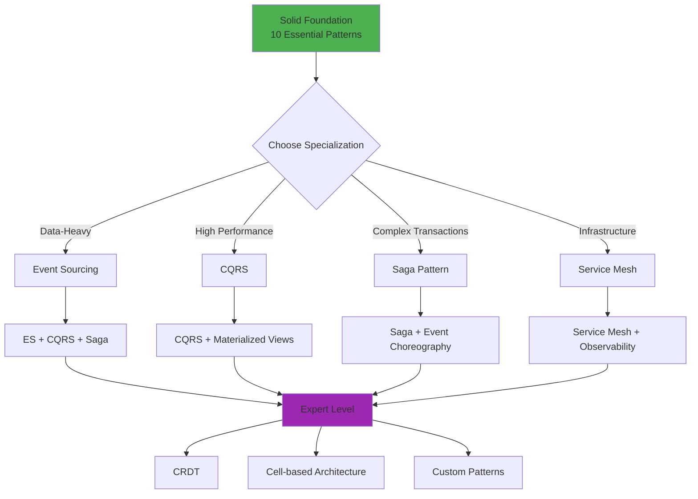
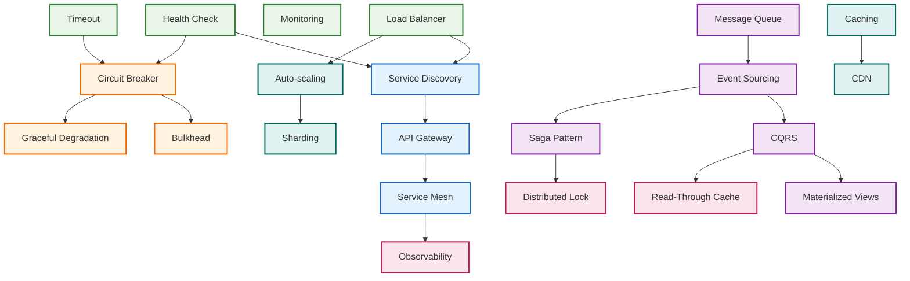
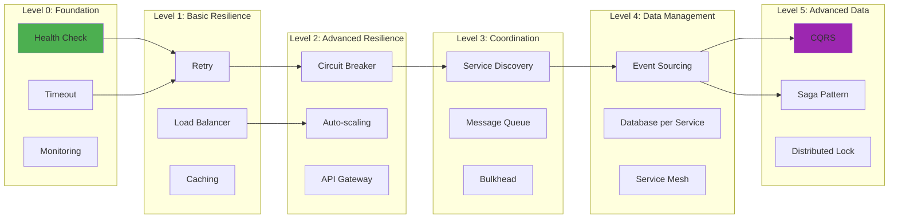
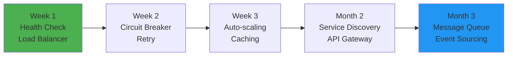
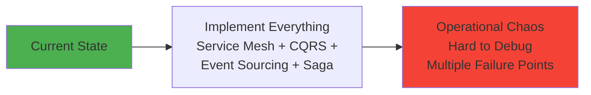

# Pattern Discovery: Navigate 130+ Patterns with Confidence

Master the art of pattern selection and composition. This guide helps you navigate our comprehensive library of 130+ distributed systems patterns, from beginner essentials to expert-level techniques.

## 🎯 Quick Navigation

<div class="discovery-nav-grid">
    <a href="#top-10-essential" class="nav-card">
        <span class="icon">👶</span>
        <span class="label">Top 10 Essential</span>
        <span class="desc">Start here</span>
    </a>
    <a href="#advanced-patterns" class="nav-card">
        <span class="icon">🚀</span>
        <span class="label">Advanced Patterns</span>
        <span class="desc">For experts</span>
    </a>
    <a href="#relationship-maps" class="nav-card">
        <span class="icon">🗺️</span>
        <span class="label">Relationship Maps</span>
        <span class="desc">How patterns connect</span>
    </a>
    <a href="#composition-guide" class="nav-card">
        <span class="icon">🧩</span>
        <span class="label">Composition Guide</span>
        <span class="desc">Combine patterns</span>
    </a>
</div>

## 👶 Top 10 Essential Patterns for Beginners {#top-10-essential}

### The Foundation Layer (Must-Have for Any System)

These patterns solve 80% of distributed systems problems and form the foundation for everything else.

<div class="pattern-tier-grid">

#### 1. **[Health Check](resilience/health-check/)** 
<div class="pattern-card gold-tier">
<div class="pattern-header">
    <span class="tier-badge">GOLD</span>
    <span class="complexity">Low</span>
</div>
<div class="pattern-content">
    <p><strong>Problem</strong>: "How do I know if my services are working?"</p>
    <p><strong>Solution</strong>: Standardized endpoint that reports service status</p>
    <p><strong>Impact</strong>: 90% faster problem detection, enables auto-recovery</p>
    <p><strong>Implementation</strong>: 30 minutes, immediate value</p>
    <div class="pattern-tags">
        <span class="tag">monitoring</span>
        <span class="tag">operations</span>
        <span class="tag">beginner-friendly</span>
    </div>
</div>
</div>

#### 2. **[Load Balancing](scaling/load-balancing/)** 
<div class="pattern-card gold-tier">
<div class="pattern-header">
    <span class="tier-badge">GOLD</span>
    <span class="complexity">Low</span>
</div>
<div class="pattern-content">
    <p><strong>Problem</strong>: "Single server can't handle all requests"</p>
    <p><strong>Solution</strong>: Distribute traffic across multiple instances</p>
    <p><strong>Impact</strong>: 3-10x capacity increase, improved availability</p>
    <p><strong>Implementation</strong>: 2 hours for basic setup</p>
    <div class="pattern-tags">
        <span class="tag">scaling</span>
        <span class="tag">availability</span>
        <span class="tag">essential</span>
    </div>
</div>
</div>

#### 3. **[Circuit Breaker](resilience/circuit-breaker/)** 
<div class="pattern-card gold-tier">
<div class="pattern-header">
    <span class="tier-badge">GOLD</span>
    <span class="complexity">Medium</span>
</div>
<div class="pattern-content">
    <p><strong>Problem</strong>: "One failing service brings down everything"</p>
    <p><strong>Solution</strong>: Automatically stop calling failing services</p>
    <p><strong>Impact</strong>: Prevents 95% of cascade failures</p>
    <p><strong>Implementation</strong>: 4 hours for production-ready version</p>
    <div class="pattern-tags">
        <span class="tag">resilience</span>
        <span class="tag">failure-handling</span>
        <span class="tag">netflix-proven</span>
    </div>
</div>
</div>

#### 4. **[Retry with Exponential Backoff](resilience/retry-backoff/)** 
<div class="pattern-card gold-tier">
<div class="pattern-header">
    <span class="tier-badge">GOLD</span>
    <span class="complexity">Low</span>
</div>
<div class="pattern-content">
    <p><strong>Problem</strong>: "Network calls fail randomly"</p>
    <p><strong>Solution</strong>: Retry with increasing delays to avoid overwhelming</p>
    <p><strong>Impact</strong>: 99% success rate for transient failures</p>
    <p><strong>Implementation</strong>: 1 hour, works with any HTTP client</p>
    <div class="pattern-tags">
        <span class="tag">resilience</span>
        <span class="tag">network</span>
        <span class="tag">quick-win</span>
    </div>
</div>
</div>

#### 5. **[Caching Strategies](scaling/caching-strategies/)** 
<div class="pattern-card gold-tier">
<div class="pattern-header">
    <span class="tier-badge">GOLD</span>
    <span class="complexity">Medium</span>
</div>
<div class="pattern-content">
    <p><strong>Problem</strong>: "Database queries are too slow"</p>
    <p><strong>Solution</strong>: Store frequently accessed data in fast memory</p>
    <p><strong>Impact</strong>: 10-100x performance improvement</p>
    <p><strong>Implementation</strong>: 4 hours for cache-aside pattern</p>
    <div class="pattern-tags">
        <span class="tag">performance</span>
        <span class="tag">scaling</span>
        <span class="tag">high-impact</span>
    </div>
</div>
</div>

#### 6. **[API Gateway](communication/api-gateway/)** 
<div class="pattern-card gold-tier">
<div class="pattern-header">
    <span class="tier-badge">GOLD</span>
    <span class="complexity">Medium</span>
</div>
<div class="pattern-content">
    <p><strong>Problem</strong>: "Clients need to know about all microservices"</p>
    <p><strong>Solution</strong>: Single entry point that routes to appropriate services</p>
    <p><strong>Impact</strong>: Simplifies client integration, enables centralized policies</p>
    <p><strong>Implementation</strong>: 1 day for basic routing, 1 week for advanced features</p>
    <div class="pattern-tags">
        <span class="tag">microservices</span>
        <span class="tag">integration</span>
        <span class="tag">architectural</span>
    </div>
</div>
</div>

#### 7. **[Auto-scaling](scaling/auto-scaling/)** 
<div class="pattern-card gold-tier">
<div class="pattern-header">
    <span class="tier-badge">GOLD</span>
    <span class="complexity">Medium</span>
</div>
<div class="pattern-content">
    <p><strong>Problem</strong>: "Can't predict traffic patterns"</p>
    <p><strong>Solution</strong>: Automatically adjust capacity based on metrics</p>
    <p><strong>Impact</strong>: 30-70% cost reduction, improved availability</p>
    <p><strong>Implementation</strong>: 1 day for CPU-based, 3 days for custom metrics</p>
    <div class="pattern-tags">
        <span class="tag">scaling</span>
        <span class="tag">cost-optimization</span>
        <span class="tag">cloud-native</span>
    </div>
</div>
</div>

#### 8. **[Service Discovery](communication/service-discovery/)** 
<div class="pattern-card gold-tier">
<div class="pattern-header">
    <span class="tier-badge">GOLD</span>
    <span class="complexity">Medium</span>
</div>
<div class="pattern-content">
    <p><strong>Problem</strong>: "Services don't know where to find each other"</p>
    <p><strong>Solution</strong>: Dynamic registry of available services and locations</p>
    <p><strong>Impact</strong>: Enables true elasticity, zero-downtime deployments</p>
    <p><strong>Implementation</strong>: 2 days for basic setup, integrates with load balancer</p>
    <div class="pattern-tags">
        <span class="tag">microservices</span>
        <span class="tag">service-mesh</span>
        <span class="tag">operational</span>
    </div>
</div>
</div>

#### 9. **[Message Queue](communication/publish-subscribe/)** 
<div class="pattern-card gold-tier">
<div class="pattern-header">
    <span class="tier-badge">GOLD</span>
    <span class="complexity">Medium</span>
</div>
<div class="pattern-content">
    <p><strong>Problem</strong>: "Synchronous calls create tight coupling"</p>
    <p><strong>Solution</strong>: Asynchronous message passing between services</p>
    <p><strong>Impact</strong>: Loose coupling, better scalability, improved resilience</p>
    <p><strong>Implementation</strong>: 1 day for basic pub-sub, 3 days for guaranteed delivery</p>
    <div class="pattern-tags">
        <span class="tag">async</span>
        <span class="tag">decoupling</span>
        <span class="tag">event-driven</span>
    </div>
</div>
</div>

#### 10. **[Database per Service](data-management/shared-database/)** 
<div class="pattern-card gold-tier">
<div class="pattern-header">
    <span class="tier-badge">GOLD</span>
    <span class="complexity">High</span>
</div>
<div class="pattern-content">
    <p><strong>Problem</strong>: "Shared database creates coupling between services"</p>
    <p><strong>Solution</strong>: Each service owns its data and database</p>
    <p><strong>Impact</strong>: Independent scaling, deployment, and technology choices</p>
    <p><strong>Implementation</strong>: 1-2 weeks, requires data migration planning</p>
    <div class="pattern-tags">
        <span class="tag">microservices</span>
        <span class="tag">data-management</span>
        <span class="tag">architectural</span>
    </div>
</div>
</div>

</div>

### Learning Path for Beginners

```mermaid
graph LR
    Start([Start]) --> HC[Health Check]
    HC --> LB[Load Balancer]
    LB --> R[Retry + Timeout]
    R --> CB[Circuit Breaker]
    CB --> Cache[Basic Caching]
    Cache --> AG[API Gateway]
    AG --> AS[Auto-scaling]
    AS --> SD[Service Discovery]
    SD --> MQ[Message Queue]
    MQ --> End([Solid Foundation])
    
    style Start fill:#4caf50
    style End fill:#2196f3
```



**Timeline**: 4-8 weeks  
**Outcome**: Production-ready distributed system foundation

## 🚀 Advanced Patterns for Experts {#advanced-patterns}

### The Expert Tier (For Complex Systems)

These patterns solve sophisticated challenges and require deep understanding of distributed systems principles.

<div class="pattern-tier-grid">

#### 1. **[Event Sourcing](data-management/event-sourcing/)** 
<div class="pattern-card gold-tier advanced">
<div class="pattern-header">
    <span class="tier-badge">GOLD</span>
    <span class="complexity">High</span>
</div>
<div class="pattern-content">
    <p><strong>Advanced Problem</strong>: "Need complete audit trail and temporal queries"</p>
    <p><strong>Solution</strong>: Store state as sequence of immutable events</p>
    <p><strong>Expert Value</strong>: Time travel debugging, perfect audit, event replay</p>
    <p><strong>Prerequisites</strong>: Message Queue, Database per Service</p>
    <div class="pattern-tags">
        <span class="tag">audit</span>
        <span class="tag">temporal</span>
        <span class="tag">expert-level</span>
    </div>
</div>
</div>

#### 2. **[CQRS (Command Query Responsibility Segregation)](data-management/cqrs/)** 
<div class="pattern-card gold-tier advanced">
<div class="pattern-header">
    <span class="tier-badge">GOLD</span>
    <span class="complexity">High</span>
</div>
<div class="pattern-content">
    <p><strong>Advanced Problem</strong>: "Read and write models have different requirements"</p>
    <p><strong>Solution</strong>: Separate models optimized for commands vs queries</p>
    <p><strong>Expert Value</strong>: Optimal read performance, complex business logic support</p>
    <p><strong>Prerequisites</strong>: Event Sourcing, Message Queue</p>
    <div class="pattern-tags">
        <span class="tag">performance</span>
        <span class="tag">complexity</span>
        <span class="tag">ddd</span>
    </div>
</div>
</div>

#### 3. **[Saga Pattern](data-management/saga/)** 
<div class="pattern-card gold-tier advanced">
<div class="pattern-header">
    <span class="tier-badge">GOLD</span>
    <span class="complexity">Very High</span>
</div>
<div class="pattern-content">
    <p><strong>Advanced Problem</strong>: "Distributed transactions without 2PC"</p>
    <p><strong>Solution</strong>: Sequence of local transactions with compensation</p>
    <p><strong>Expert Value</strong>: Maintains data consistency across services</p>
    <p><strong>Prerequisites</strong>: Event Sourcing, Distributed Lock, Message Queue</p>
    <div class="pattern-tags">
        <span class="tag">transactions</span>
        <span class="tag">consistency</span>
        <span class="tag">choreography</span>
    </div>
</div>
</div>

#### 4. **[Service Mesh](communication/service-mesh/)** 
<div class="pattern-card gold-tier advanced">
<div class="pattern-header">
    <span class="tier-badge">GOLD</span>
    <span class="complexity">Very High</span>
</div>
<div class="pattern-content">
    <p><strong>Advanced Problem</strong>: "Need advanced traffic management and observability"</p>
    <p><strong>Solution</strong>: Infrastructure layer for service-to-service communication</p>
    <p><strong>Expert Value</strong>: Advanced routing, security, observability</p>
    <p><strong>Prerequisites</strong>: Service Discovery, Load Balancer, Circuit Breaker</p>
    <div class="pattern-tags">
        <span class="tag">infrastructure</span>
        <span class="tag">observability</span>
        <span class="tag">istio</span>
    </div>
</div>
</div>

#### 5. **[CRDT (Conflict-free Replicated Data Types)](data-management/crdt/)** 
<div class="pattern-card silver-tier advanced">
<div class="pattern-header">
    <span class="tier-badge">SILVER</span>
    <span class="complexity">Expert</span>
</div>
<div class="pattern-content">
    <p><strong>Cutting-edge Problem</strong>: "Merge concurrent updates without coordination"</p>
    <p><strong>Solution</strong>: Data structures that merge automatically</p>
    <p><strong>Expert Value</strong>: Conflict-free collaboration, edge computing</p>
    <p><strong>Prerequisites</strong>: Deep understanding of consistency models</p>
    <div class="pattern-tags">
        <span class="tag">collaboration</span>
        <span class="tag">edge</span>
        <span class="tag">research-grade</span>
    </div>
</div>
</div>

#### 6. **[Cell-based Architecture](architecture/cell-based/)** 
<div class="pattern-card silver-tier advanced">
<div class="pattern-header">
    <span class="tier-badge">SILVER</span>
    <span class="complexity">Expert</span>
</div>
<div class="pattern-content">
    <p><strong>Hyperscale Problem</strong>: "Blast radius containment at infrastructure level"</p>
    <p><strong>Solution</strong>: Independent failure domains (cells) with routing</p>
    <p><strong>Expert Value</strong>: Netflix/AWS level fault isolation</p>
    <p><strong>Prerequisites</strong>: Multi-region, Advanced Routing, Deep Ops Experience</p>
    <div class="pattern-tags">
        <span class="tag">hyperscale</span>
        <span class="tag">blast-radius</span>
        <span class="tag">aws-proven</span>
    </div>
</div>
</div>

</div>

### Advanced Learning Path



## 🗺️ Pattern Relationship Maps {#relationship-maps}

### Core Pattern Dependencies

Understanding how patterns build upon each other is crucial for implementation planning.



### Pattern Interaction Matrix

| Pattern Category | Complements Best With | Conflicts With | Migration Path |
|------------------|----------------------|----------------|----------------|
| **Circuit Breaker** | Retry, Bulkhead, Health Check | Naive Retry Loops | Timeout → Retry → Circuit Breaker |
| **Event Sourcing** | CQRS, Saga, Message Queue | Shared Database | Database per Service → Event Log → Event Sourcing |
| **Service Mesh** | Service Discovery, Observability | Direct Service Calls | Service Discovery → API Gateway → Service Mesh |
| **Auto-scaling** | Load Balancer, Health Check | Manual Scaling | Load Balancer → Health Check → Auto-scaling |
| **CQRS** | Event Sourcing, Caching | Single Model Systems | Event Sourcing → Read Models → CQRS |

### Dependency Depth Analysis



## 🧩 Pattern Composition Guidelines {#composition-guide}

### Proven Pattern Stacks

#### The Netflix Stack: Hyperscale Streaming
```yaml
Resilience Tier:
  - Circuit Breaker: "Prevent cascade failures"
  - Bulkhead: "Isolate failure domains" 
  - Graceful Degradation: "Degrade functionality gracefully"
  - Chaos Engineering: "Test resilience continuously"

Scale Tier:
  - Auto-scaling: "Handle variable load"
  - Multi-region: "Global distribution"
  - CDN: "Edge content delivery"
  - Cell-based Architecture: "Blast radius containment"

Data Tier:
  - Event Sourcing: "Complete audit trail"
  - CQRS: "Optimized read models"
  - Eventual Consistency: "Scale over consistency"
```

**Why It Works**: Each layer reinforces the others. Resilience patterns contain failures, scaling patterns handle growth, data patterns maintain consistency at scale.

#### The Uber Stack: Real-time Geo-scale
```yaml
Real-time Tier:
  - WebSocket: "Low-latency bi-directional communication"
  - Event Streaming: "Real-time data flow"
  - Geo-sharding: "Location-aware data partitioning"

Coordination Tier:
  - Consistent Hashing: "Predictable data distribution"
  - Leader Election: "Coordination without central authority"
  - Distributed Lock: "Critical section protection"

Resilience Tier:  
  - Circuit Breaker: "Handle service failures"
  - Retry with Backoff: "Handle transient failures"
  - Graceful Degradation: "Core functionality preservation"
```

**Why It Works**: Real-time requirements demand predictable performance. Geo-sharding reduces latency, consistent hashing ensures even distribution, coordination patterns maintain correctness.

#### The Banking Stack: ACID at Scale
```yaml
Consistency Tier:
  - Event Sourcing: "Immutable transaction log"
  - Saga Pattern: "Distributed transaction coordination"
  - Two-Phase Commit: "Strong consistency where required"

Audit Tier:
  - Immutable Log: "Regulatory compliance"
  - Encryption: "Data protection"
  - Digital Signatures: "Non-repudiation"

Resilience Tier:
  - Circuit Breaker: "Prevent system failures"
  - Bulkhead: "Isolate critical systems"
  - Disaster Recovery: "Business continuity"
```

**Why It Works**: Financial systems prioritize correctness over performance. Event sourcing provides audit trail, saga manages distributed transactions, encryption ensures security.

### Anti-Pattern Combinations to Avoid

#### ❌ The "Over-Engineering" Stack
```yaml
# Don't do this for small systems
Bad Combination:
  - Service Mesh: "For 3 services"
  - Event Sourcing: "For simple CRUD"  
  - CQRS: "With no performance issues"
  - Saga: "For single-service transactions"
```

**Why It Fails**: Massive operational overhead with no benefit. Patterns should solve actual problems, not theoretical ones.

#### ❌ The "Inconsistent Resilience" Stack
```yaml
# Resilience gaps create failure points
Bad Combination:
  - Circuit Breaker: "On external calls only"
  - Retry: "Without timeout"
  - Auto-scaling: "Without health checks"
  - Load Balancer: "Without circuit breaker"
```

**Why It Fails**: Inconsistent resilience creates weak links. Every service boundary needs protection.

#### ❌ The "Shared Everything" Stack
```yaml
# Anti-microservices patterns
Bad Combination:
  - Shared Database: "Between microservices"
  - Synchronous Calls: "For everything"
  - Distributed Transactions: "Across all services"
  - Centralized Session State: "Couples services"
```

**Why It Fails**: Creates distributed monolith with all downsides of both architectures.

### Composition Validation Framework

#### Step 1: Compatibility Check
```markdown
✅ **Compatible Pattern Pairs**:
- Circuit Breaker + Retry = Resilient calls
- Event Sourcing + CQRS = Optimal reads/writes  
- Load Balancer + Auto-scaling = Elastic capacity
- Service Mesh + Observability = Complete visibility

❌ **Conflicting Patterns**:
- Two-Phase Commit + High Availability
- Shared Database + Microservice Independence
- Synchronous Calls + Event-driven Architecture
- Manual Scaling + Variable Load
```

#### Step 2: Dependency Validation
```markdown
**Prerequisites Met?**:
- [ ] Circuit Breaker requires Health Check + Timeout
- [ ] Service Mesh requires Service Discovery + Load Balancer
- [ ] Event Sourcing requires Message Queue + Database per Service
- [ ] CQRS requires Event Sourcing + Materialized Views
```

#### Step 3: Operational Feasibility
```markdown
**Team Readiness Check**:
- [ ] Do we have expertise for this complexity level?
- [ ] Can we operate and debug these patterns?
- [ ] Do we have monitoring for all patterns?
- [ ] Is the maintenance burden acceptable?
```

### Pattern Sequencing Strategies

#### The Incremental Approach (Recommended)


**Benefits**: Validate each pattern before adding complexity, build expertise gradually, minimize risk.

#### The Big Bang Approach (Not Recommended)


**Problems**: Overwhelming complexity, hard to debug issues, high risk of failure.

## 📊 Pattern Selection Decision Matrix

### By System Characteristics

| System Type | Team Size | Traffic | Recommended Starter Kit |
|-------------|-----------|---------|-------------------------|
| **Startup MVP** | 1-3 devs | <1K users | Health Check + Load Balancer + Basic Retry |
| **Growing Product** | 4-10 devs | 1K-100K users | Above + Circuit Breaker + Auto-scaling + Caching |
| **Scale-up** | 10-50 devs | 100K-1M users | Above + Service Mesh + Event Sourcing + CQRS |
| **Enterprise** | 50+ devs | 1M+ users | Above + Saga + Advanced Patterns + Custom Solutions |

### By Problem Domain

| Problem Domain | Core Patterns | Advanced Patterns | Expert Patterns |
|----------------|---------------|-------------------|-----------------|
| **E-commerce** | Circuit Breaker, Caching, Auto-scaling | Event Sourcing, Saga | CQRS, Cell-based |
| **Real-time Apps** | WebSocket, Load Balancer, Caching | Event Streaming, CQRS | CRDT, Actor Model |
| **Financial** | Event Sourcing, Distributed Lock, Encryption | Saga, Audit Log | Formal Verification |
| **Gaming** | Load Balancer, Auto-scaling, Caching | Actor Model, Event Sourcing | CRDT, Custom Protocols |
| **IoT/Edge** | Circuit Breaker, Retry, Caching | Edge Computing, CRDT | Custom Edge Patterns |

### By Quality Attributes

| Priority | Patterns for Reliability | Patterns for Performance | Patterns for Scalability |
|----------|-------------------------|-------------------------|--------------------------|
| **Must Have** | Circuit Breaker, Health Check | Caching, Load Balancer | Auto-scaling, Sharding |
| **Nice to Have** | Bulkhead, Graceful Degradation | CDN, CQRS | Multi-region, Edge Computing |
| **Advanced** | Chaos Engineering, Self-Healing | Custom Caching, Precomputation | Cell-based, Adaptive Scaling |

## 🎯 Next Steps

### For Beginners
1. **Start with the Top 10 Essential Patterns** - Build solid foundation
2. **Follow the incremental approach** - Add patterns gradually
3. **Focus on operational basics** - Monitoring, health checks, basic resilience
4. **Measure impact** - Validate each pattern's value before adding complexity

### For Intermediate Users  
1. **Master pattern combinations** - Understand how patterns work together
2. **Implement domain-specific stacks** - Choose patterns for your use case
3. **Build operational expertise** - Debug and maintain pattern implementations
4. **Contribute back** - Share learnings and improvements

### For Experts
1. **Push boundaries** - Implement cutting-edge patterns like CRDT
2. **Create custom solutions** - Adapt patterns for specific requirements  
3. **Share knowledge** - Mentor others and contribute to pattern library
4. **Research new approaches** - Stay ahead of the curve

---

*This discovery guide helps you navigate the complexity of distributed systems patterns systematically. Remember: the best architecture is the simplest one that meets your current requirements.*