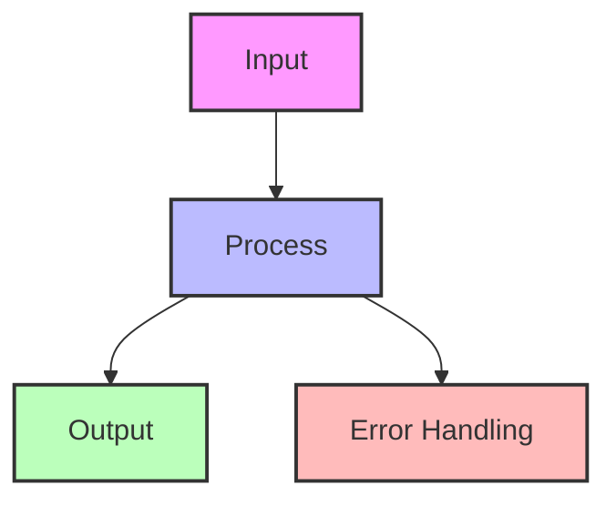
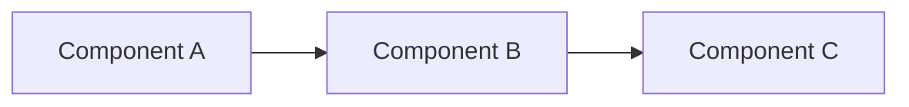
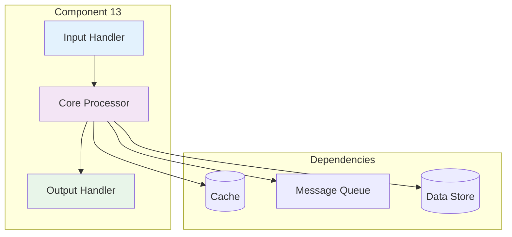

## Essential Question
## When to Use / When NOT to Use

### When to Use

| Scenario | Why It Fits | Alternative If Not |
|----------|-------------|-------------------|
| High availability required | Pattern provides resilience | Consider simpler approach |
| Scalability is critical | Handles load distribution | Monolithic might suffice |
| Distributed coordination needed | Manages complexity | Centralized coordination |

### When NOT to Use

| Scenario | Why to Avoid | Better Alternative |
|----------|--------------|-------------------|
| Simple applications | Unnecessary complexity | Direct implementation |
| Low traffic systems | Overhead not justified | Basic architecture |
| Limited resources | High operational cost | Simpler patterns |
**When and how should we implement pattern implementation roadmap - your path to distributed systems mastery in our distributed system?**

# Pattern Implementation Roadmap Generator

Create a customized implementation plan based on your specific needs and constraints.

## 🎯 Roadmap Generator

<div class="roadmap-generator">
    <h3>🔧 Build Your Custom Roadmap</h3>
    
    <div class="generator-form">
        <div class="form-section">
            <h4>1. Current System Profile</h4>
            <label>System Type:</label>
            <select id="system-type">
                <option value="monolith">Monolith</option>
                <option value="basic-microservices">Basic Microservices (2-10)</option>
                <option value="complex-microservices">Complex Microservices (10+)</option>
                <option value="serverless">Serverless/FaaS</option>
                <option value="hybrid">Hybrid Architecture</option>
            </select>
            
            <label>Current Scale:</label>
            <select id="current-scale">
                <option value="startup">Startup (<10K users)</option>
                <option value="growth">Growth (10K-100K users)</option>
                <option value="scale">Scale (100K-1M users)</option>
                <option value="enterprise">Enterprise (1M+ users)</option>
            </select>
            
            <label>Team Size:</label>
            <select id="team-size">
                <option value="small">Small (1-5 engineers)</option>
                <option value="medium">Medium (6-20 engineers)</option>
                <option value="large">Large (20-50 engineers)</option>
                <option value="enterprise">Enterprise (50+ engineers)</option>
            </select>
        </div>
        
        <div class="form-section">
            <h4>2. Primary Challenges</h4>
            <label><input type="checkbox" value="reliability"> System reliability issues</label>
            <label><input type="checkbox" value="performance"> Performance problems</label>
            <label><input type="checkbox" value="scalability"> Can't handle growth</label>
            <label><input type="checkbox" value="consistency"> Data consistency issues</label>
            <label><input type="checkbox" value="complexity"> System too complex</label>
            <label><input type="checkbox" value="deployment"> Deployment difficulties</label>
        </div>
        
        <div class="form-section">
            <h4>3. Goals & Timeline</h4>
            <label>Primary Goal:</label>
            <select id="primary-goal">
                <option value="reliability">Improve Reliability (99.9%+)</option>
                <option value="performance">Reduce Latency (<200ms)</option>
                <option value="scale">Handle 10x Growth</option>
                <option value="agility">Faster Deployments</option>
                <option value="cost">Reduce Costs</option>
            </select>
            
            <label>Timeline:</label>
            <select id="timeline">
                <option value="3months">3 Months</option>
                <option value="6months">6 Months</option>
                <option value="12months">12 Months</option>
                <option value="18months">18+ Months</option>
            </select>
        </div>
        
        <button class="generate-btn" onclick="generateRoadmap()">Generate My Roadmap</button>
    </div>
    
    <div id="generated-roadmap" class="generated-roadmap">
        <!-- Roadmap will be generated here -->
    </div>
</div>

## 📚 Pre-Built Roadmaps

### 🚀 Startup to Scale Roadmap
**For: Teams growing from 0 to 100K users**

<details>
<summary>📄 View mermaid code (9 lines)</summary>

<details>
<summary>📄 View mermaid code (9 lines)</summary>



</details>

</details>

<details>
<summary>View implementation code</summary>

*See Implementation Example 1 in Appendix*

</details>

#### Phase 1: Foundation (Weeks 1-4)
**Goal: Basic reliability and observability**

*See Implementation Example 2 in Appendix*

#### Phase 2: Resilience (Weeks 5-9)
**Goal: Handle failures gracefully**

*See Implementation Example 3 in Appendix*

#### Phase 3: Scale (Weeks 10-16)
**Goal: Handle 10x growth**

*See Implementation Example 4 in Appendix*

### 🏢 Monolith to Microservices Roadmap
**For: Teams breaking down monolithic applications**


<details>
<summary>View implementation code</summary>

*See Implementation Example 5 in Appendix*

</details>

### 🌍 Global Scale Roadmap
**For: Systems targeting 1M+ users globally**

#### Quarter 1: Multi-Region Foundation
*See Implementation Example 6 in Appendix*

#### Quarter 2: Edge Computing
```yaml
Month 4-6:
  - Edge locations deployment
  - CDN optimization
  - Edge compute functions
  - Global traffic management
```

## 📊 Implementation Priorities

### By System Maturity

| Maturity Level | Must Have | Should Have | Nice to Have |
|----------------|-----------|-------------|-------------|
| **Startup** | Health Check, Load Balancer | Caching, Monitoring | Auto-scaling |
| **Growth** | Circuit Breaker, Retry | API Gateway, CDN | Service Mesh |
| **Scale** | Multi-region, Sharding | Event Sourcing, CQRS | Edge Computing |
| **Enterprise** | Everything above | ML-driven ops | Custom protocols |

### By Problem Domain

#### 🛡️ If Reliability is Critical
```
1. Health Checks (Week 1)
2. Circuit Breaker (Week 2-3)
3. Retry + Timeout (Week 4)
4. Bulkhead Isolation (Week 5-6)
5. Multi-region Failover (Week 7-12)
```

#### ⚡ If Performance is Critical
```
1. Caching Strategy (Week 1-2)
2. CDN Integration (Week 3)
3. Database Optimization (Week 4-5)
4. Edge Computing (Week 6-8)
5. Custom Protocols (Week 9-12)
```

#### 📨 If Scale is Critical
```
1. Load Balancing (Week 1)
2. Auto-scaling (Week 2-3)
3. Sharding Strategy (Week 4-6)
4. Event-driven Architecture (Week 7-10)
5. Cell-based Architecture (Week 11-16)
```

## 🎯 Success Metrics

### Track Your Progress

| Milestone | Metric | Target | Timeline |
|-----------|--------|--------|----------|
| **Foundation** | Health check coverage | 100% | Week 2 |
| **Resilience** | Error rate | <0.1% | Week 8 |
| **Performance** | P99 latency | <200ms | Week 12 |
| **Scale** | Auto-scaling enabled | 100% | Week 16 |
| **Maturity** | Chaos testing | Weekly | Month 6 |

## 🛠️ Implementation Tools

### Pattern Implementation Checklist

#### Pre-Implementation
- [ ] Current state documented
- [ ] Success metrics defined
- [ ] Team trained on pattern
- [ ] Dependencies identified
- [ ] Rollback plan created

#### During Implementation
- [ ] Incremental rollout
- [ ] Monitoring in place
- [ ] Documentation updated
- [ ] Tests written
- [ ] Performance measured

#### Post-Implementation
- [ ] Success metrics achieved
- [ ] Team retrospective
- [ ] Lessons documented
- [ ] Next pattern selected
- [ ] Knowledge shared

## 📚 Learning Resources

### By Implementation Phase

1. **Foundation Phase**
   - [Health Check Pattern](../resilience/health-check/)
   - [Load Balancing Basics](../scaling/load-balancing/)
   - [Caching Strategies](../scaling/caching-strategies/)

2. **Resilience Phase**
   - [Circuit Breaker Deep Dive](../resilience/circuit-breaker/)
   - [Retry Patterns](../resilience/retry-backoff/)
   - [Timeout Strategies](../resilience/timeout/)

3. **Scale Phase**
   - [Auto-scaling Guide](../scaling/auto-scaling/)
   - [Sharding Strategies](../scaling/sharding/)
   - [Event-Driven Architecture](../architecture/event-driven/)

## 🌟 Roadmap Templates

### Download Customizable Templates

- **[Startup Roadmap (Excel)](roadmaps/startup-roadmap.xlsx/)** - 0 to 100K users
- **[Scale Roadmap (Excel)](roadmaps/scale-roadmap.xlsx/)** - 100K to 1M users
- **[Enterprise Roadmap (Excel)](roadmaps/enterprise-roadmap.xlsx/)** - 1M+ users
- **[Migration Roadmap (Excel)](roadmaps/migration-roadmap.xlsx/)** - Monolith to microservices

## 👥 Team Alignment

### Roadmap Communication Plan

1. **Week 0: Kickoff**
   - Present roadmap to team
   - Assign pattern champions
   - Set up tracking dashboard

2. **Weekly: Progress Review**
   - Pattern implementation status
   - Metrics review
   - Blocker discussion
   - Next week planning

3. **Monthly: Retrospective**
   - What worked well
   - What needs improvement
   - Roadmap adjustments
   - Celebrate wins

---

*Remember: The best roadmap is one that evolves with your needs. Start with the fundamentals, measure everything, and adjust based on real data.*


## Level 1: Intuition (5 minutes)

*Start your journey with relatable analogies*

### The Elevator Pitch
[Pattern explanation in simple terms]

### Real-World Analogy
[Everyday comparison that explains the concept]

## Level 2: Foundation (10 minutes)

*Build core understanding*

### Core Concepts
- Key principle 1
- Key principle 2
- Key principle 3

### Basic Example


## Level 3: Deep Dive (15 minutes)

*Understand implementation details*

### How It Really Works
[Technical implementation details]

### Common Patterns
[Typical usage patterns]

## Level 4: Expert (20 minutes)

*Master advanced techniques*

### Advanced Configurations
[Complex scenarios and optimizations]

### Performance Tuning
[Optimization strategies]

## Level 5: Mastery (30 minutes)

*Apply in production*

### Real-World Case Studies
[Production examples from major companies]

### Lessons from the Trenches
[Common pitfalls and solutions]


## Decision Matrix

*See Implementation Example 7 in Appendix*

### Quick Decision Table

| Factor | Low Complexity | Medium Complexity | High Complexity |
|--------|----------------|-------------------|-----------------|
| Team Size | < 5 developers | 5-20 developers | > 20 developers |
| Traffic | < 1K req/s | 1K-100K req/s | > 100K req/s |
| Data Volume | < 1GB | 1GB-1TB | > 1TB |
| **Recommendation** | ❌ Avoid | ⚠️ Consider | ✅ Implement |


## Appendix: Implementation Details

### Implementation Example 1

*See Implementation Example 1 in Appendix*

### Implementation Example 2

*See Implementation Example 2 in Appendix*

### Implementation Example 3

*See Implementation Example 3 in Appendix*

### Implementation Example 4

*See Implementation Example 4 in Appendix*

### Implementation Example 5

*See Implementation Example 5 in Appendix*

### Implementation Example 6

*See Implementation Example 6 in Appendix*

### Implementation Example 7

*See Implementation Example 7 in Appendix*


## Appendix: Implementation Details

### Implementation Example 1


### Implementation Example 2


### Implementation Example 3


### Implementation Example 4


### Implementation Example 5


### Implementation Example 6


### Implementation Example 7



