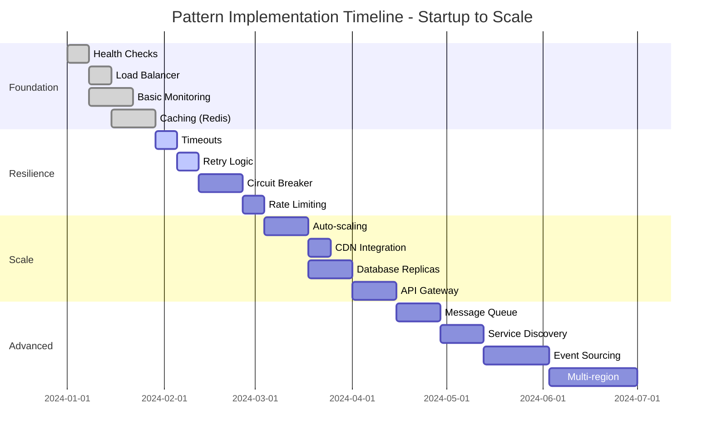

# Pattern Implementation Roadmap Generator

Create a customized implementation plan based on your specific needs and constraints.

## 🎯 Roadmap Generator

<div class="roadmap-generator">
    <h3>🔧 Build Your Custom Roadmap</h3>
    
    <div class="generator-form">
        <div class="form-section">
            <h4>1. Current System Profile</h4>
            <label>System Type:</label>
            <select id="system-type">
                <option value="monolith">Monolith</option>
                <option value="basic-microservices">Basic Microservices (2-10)</option>
                <option value="complex-microservices">Complex Microservices (10+)</option>
                <option value="serverless">Serverless/FaaS</option>
                <option value="hybrid">Hybrid Architecture</option>
            </select>
            
            <label>Current Scale:</label>
            <select id="current-scale">
                <option value="startup">Startup (<10K users)</option>
                <option value="growth">Growth (10K-100K users)</option>
                <option value="scale">Scale (100K-1M users)</option>
                <option value="enterprise">Enterprise (1M+ users)</option>
            </select>
            
            <label>Team Size:</label>
            <select id="team-size">
                <option value="small">Small (1-5 engineers)</option>
                <option value="medium">Medium (6-20 engineers)</option>
                <option value="large">Large (20-50 engineers)</option>
                <option value="enterprise">Enterprise (50+ engineers)</option>
            </select>
        </div>
        
        <div class="form-section">
            <h4>2. Primary Challenges</h4>
            <label><input type="checkbox" value="reliability"> System reliability issues</label>
            <label><input type="checkbox" value="performance"> Performance problems</label>
            <label><input type="checkbox" value="scalability"> Can't handle growth</label>
            <label><input type="checkbox" value="consistency"> Data consistency issues</label>
            <label><input type="checkbox" value="complexity"> System too complex</label>
            <label><input type="checkbox" value="deployment"> Deployment difficulties</label>
        </div>
        
        <div class="form-section">
            <h4>3. Goals & Timeline</h4>
            <label>Primary Goal:</label>
            <select id="primary-goal">
                <option value="reliability">Improve Reliability (99.9%+)</option>
                <option value="performance">Reduce Latency (<200ms)</option>
                <option value="scale">Handle 10x Growth</option>
                <option value="agility">Faster Deployments</option>
                <option value="cost">Reduce Costs</option>
            </select>
            
            <label>Timeline:</label>
            <select id="timeline">
                <option value="3months">3 Months</option>
                <option value="6months">6 Months</option>
                <option value="12months">12 Months</option>
                <option value="18months">18+ Months</option>
            </select>
        </div>
        
        <button class="generate-btn" onclick="generateRoadmap()">Generate My Roadmap</button>
    </div>
    
    <div id="generated-roadmap" class="generated-roadmap">
        <!-- Roadmap will be generated here -->
    </div>
</div>

## 📚 Pre-Built Roadmaps

### 🚀 Startup to Scale Roadmap
**For: Teams growing from 0 to 100K users**



#### Phase 1: Foundation (Weeks 1-4)
**Goal: Basic reliability and observability**

```yaml
Week 1-2:
  patterns:
    - Health Check endpoints
    - Load Balancer setup
  implementation:
    - Add /health endpoint to all services
    - Configure ALB/NLB with health checks
    - Set up basic CloudWatch/Datadog
  
Week 3-4:
  patterns:
    - Basic Caching
    - Monitoring
  implementation:
    - Deploy Redis cluster
    - Implement cache-aside pattern
    - Add APM instrumentation
    - Create dashboards and alerts
```

#### Phase 2: Resilience (Weeks 5-9)
**Goal: Handle failures gracefully**

```yaml
Week 5-6:
  patterns:
    - Timeout Strategy
    - Retry with Backoff
  implementation:
    - Add timeouts to all HTTP clients
    - Implement exponential backoff
    - Add jitter to prevent thundering herd
    
Week 7-9:
  patterns:
    - Circuit Breaker
    - Rate Limiting
  implementation:
    - Deploy Hystrix/Resilience4j
    - Configure thresholds per service
    - Implement API rate limiting
    - Add graceful degradation
```

#### Phase 3: Scale (Weeks 10-16)
**Goal: Handle 10x growth**

```yaml
Week 10-12:
  patterns:
    - Auto-scaling
    - CDN
  implementation:
    - Configure auto-scaling groups
    - Set up scaling policies
    - Integrate CloudFront/Cloudflare
    - Optimize static assets
    
Week 13-16:
  patterns:
    - Database Scaling
    - API Gateway
  implementation:
    - Add read replicas
    - Implement connection pooling
    - Deploy API Gateway
    - Consolidate external APIs
```

### 🏢 Monolith to Microservices Roadmap
**For: Teams breaking down monolithic applications**

```mermaid
graph LR
    subgraph "Month 1-2"
        M[Monolith] --> SF[Strangler Fig]
        SF --> AG[API Gateway]
        AG --> SD[Service Discovery]
    end
    
    subgraph "Month 3-4"
        SD --> MS1[Extract Auth Service]
        MS1 --> MS2[Extract User Service]
        MS2 --> MQ[Message Queue]
    end
    
    subgraph "Month 5-6"
        MQ --> MS3[Extract Orders]
        MS3 --> ES[Event Sourcing]
        ES --> CQRS[CQRS]
    end
    
    subgraph "Month 7+"
        CQRS --> SM[Service Mesh]
        SM --> CR[Chaos Ready]
    end
    
    style M fill:#ff6b6b
    style CR fill:#2ecc71
```



### 🌍 Global Scale Roadmap
**For: Systems targeting 1M+ users globally**

#### Quarter 1: Multi-Region Foundation
```yaml
Month 1:
  - Multi-region deployment
  - GeoDNS setup
  - Regional load balancers
  
Month 2:
  - Cross-region replication
  - Regional caching layers
  - Latency-based routing
  
Month 3:
  - Regional failover
  - Data residency compliance
  - Performance optimization
```

#### Quarter 2: Edge Computing
```yaml
Month 4-6:
  - Edge locations deployment
  - CDN optimization
  - Edge compute functions
  - Global traffic management
```

## 📊 Implementation Priorities

### By System Maturity

| Maturity Level | Must Have | Should Have | Nice to Have |
|----------------|-----------|-------------|-------------|
| **Startup** | Health Check, Load Balancer | Caching, Monitoring | Auto-scaling |
| **Growth** | Circuit Breaker, Retry | API Gateway, CDN | Service Mesh |
| **Scale** | Multi-region, Sharding | Event Sourcing, CQRS | Edge Computing |
| **Enterprise** | Everything above | ML-driven ops | Custom protocols |

### By Problem Domain

#### 🛡️ If Reliability is Critical
```
1. Health Checks (Week 1)
2. Circuit Breaker (Week 2-3)
3. Retry + Timeout (Week 4)
4. Bulkhead Isolation (Week 5-6)
5. Multi-region Failover (Week 7-12)
```

#### ⚡ If Performance is Critical
```
1. Caching Strategy (Week 1-2)
2. CDN Integration (Week 3)
3. Database Optimization (Week 4-5)
4. Edge Computing (Week 6-8)
5. Custom Protocols (Week 9-12)
```

#### 📨 If Scale is Critical
```
1. Load Balancing (Week 1)
2. Auto-scaling (Week 2-3)
3. Sharding Strategy (Week 4-6)
4. Event-driven Architecture (Week 7-10)
5. Cell-based Architecture (Week 11-16)
```

## 🎯 Success Metrics

### Track Your Progress

| Milestone | Metric | Target | Timeline |
|-----------|--------|--------|----------|
| **Foundation** | Health check coverage | 100% | Week 2 |
| **Resilience** | Error rate | <0.1% | Week 8 |
| **Performance** | P99 latency | <200ms | Week 12 |
| **Scale** | Auto-scaling enabled | 100% | Week 16 |
| **Maturity** | Chaos testing | Weekly | Month 6 |

## 🛠️ Implementation Tools

### Pattern Implementation Checklist

#### Pre-Implementation
- [ ] Current state documented
- [ ] Success metrics defined
- [ ] Team trained on pattern
- [ ] Dependencies identified
- [ ] Rollback plan created

#### During Implementation
- [ ] Incremental rollout
- [ ] Monitoring in place
- [ ] Documentation updated
- [ ] Tests written
- [ ] Performance measured

#### Post-Implementation
- [ ] Success metrics achieved
- [ ] Team retrospective
- [ ] Lessons documented
- [ ] Next pattern selected
- [ ] Knowledge shared

## 📚 Learning Resources

### By Implementation Phase

1. **Foundation Phase**
   - [Health Check Pattern](../resilience/health-check/)
   - [Load Balancing Basics](../scaling/load-balancing/)
   - [Caching Strategies](../scaling/caching-strategies/)

2. **Resilience Phase**
   - [Circuit Breaker Deep Dive](../resilience/circuit-breaker/)
   - [Retry Patterns](../resilience/retry-backoff/)
   - [Timeout Strategies](../resilience/timeout/)

3. **Scale Phase**
   - [Auto-scaling Guide](../scaling/auto-scaling/)
   - [Sharding Strategies](../scaling/sharding/)
   - [Event-Driven Architecture](../architecture/event-driven/)

## 🌟 Roadmap Templates

### Download Customizable Templates

- **[Startup Roadmap (Excel)](roadmaps/startup-roadmap.xlsx)** - 0 to 100K users
- **[Scale Roadmap (Excel)](roadmaps/scale-roadmap.xlsx)** - 100K to 1M users
- **[Enterprise Roadmap (Excel)](roadmaps/enterprise-roadmap.xlsx)** - 1M+ users
- **[Migration Roadmap (Excel)](roadmaps/migration-roadmap.xlsx)** - Monolith to microservices

## 👥 Team Alignment

### Roadmap Communication Plan

1. **Week 0: Kickoff**
   - Present roadmap to team
   - Assign pattern champions
   - Set up tracking dashboard

2. **Weekly: Progress Review**
   - Pattern implementation status
   - Metrics review
   - Blocker discussion
   - Next week planning

3. **Monthly: Retrospective**
   - What worked well
   - What needs improvement
   - Roadmap adjustments
   - Celebrate wins

---

*Remember: The best roadmap is one that evolves with your needs. Start with the fundamentals, measure everything, and adjust based on real data.*
