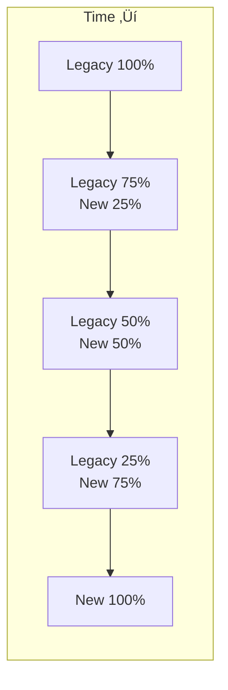

## Essential Question
## When to Use / When NOT to Use

### When to Use

| Scenario | Why It Fits | Alternative If Not |
|----------|-------------|-------------------|
| High availability required | Pattern provides resilience | Consider simpler approach |
| Scalability is critical | Handles load distribution | Monolithic might suffice |
| Distributed coordination needed | Manages complexity | Centralized coordination |

### When NOT to Use

| Scenario | Why to Avoid | Better Alternative |
|----------|--------------|-------------------|
| Simple applications | Unnecessary complexity | Direct implementation |
| Low traffic systems | Overhead not justified | Basic architecture |
| Limited resources | High operational cost | Simpler patterns |
**When and how should we implement pattern migration guides - evolve your architecture safely in our distributed system?**

# Pattern Migration Guides

Safely evolve your architecture by migrating from legacy patterns to modern alternatives.

## 🎯 Migration Overview

### Why Migrate Patterns?

1. **Technical Debt**: Legacy patterns accumulate maintenance burden
2. **Scale Limits**: Original patterns can't handle growth
3. **New Requirements**: Business needs exceed pattern capabilities
4. **Better Alternatives**: Modern patterns offer superior solutions
5. **Team Growth**: More sophisticated patterns become feasible

### Migration Risk Matrix

| Migration Type | Risk | Duration | Rollback Difficulty |
|----------------|------|----------|--------------------|
| **Bronze → Gold** | Low | 2-4 weeks | Easy |
| **Sync → Async** | Medium | 4-8 weeks | Moderate |
| **Monolith → Microservices** | High | 3-6 months | Hard |
| **Single → Multi-region** | High | 2-4 months | Very Hard |

## 📚 Common Pattern Migrations

### 1. Two-Phase Commit → Saga Pattern
**From: Distributed transactions with locking**  
**To: Eventually consistent choreography**


<details>
<summary>View implementation code</summary>

*See Implementation Example 1 in Appendix*

</details>

#### Migration Steps

**Week 1-2: Analysis & Design**
<details>
<summary>📄 View yaml code (9 lines)</summary>

```yaml
1. Map existing transactions:
   - Identify all 2PC participants
   - Document transaction boundaries
   - Calculate failure rates
   
2. Design saga flow:
   - Define compensating transactions
   - Identify pivot point
   - Plan event schema
```

</details>

**Week 3-4: Parallel Implementation**
<details>
<summary>📄 View yaml code (9 lines)</summary>

```yaml
3. Implement saga alongside 2PC:
   - Create event handlers
   - Build compensation logic
   - Add idempotency
   
4. Shadow mode testing:
   - Run both patterns
   - Compare results
   - Measure performance
```

</details>

**Week 5-6: Gradual Cutover**
<details>
<summary>📄 View yaml code (10 lines)</summary>

```yaml
5. Traffic shifting:
   - 10% to saga (monitor closely)
   - 50% to saga (fix issues)
   - 90% to saga (final validation)
   - 100% to saga
   
6. Cleanup:
   - Remove 2PC code
   - Archive transaction logs
   - Update documentation
```

</details>

#### Rollback Plan
```yaml
If issues arise:
1. Immediate: Route traffic back to 2PC
2. Fix saga implementation
3. Retest in shadow mode
4. Retry migration
```

### 2. Synchronous RPC → Async Message Queue
**From: Direct service calls**  
**To: Event-driven communication**

*See Implementation Example 2 in Appendix*

#### Migration Strategy

**Phase 1: Add Queue Infrastructure**


<details>
<summary>📄 View implementation code</summary>

# Step 1: Keep sync, add async publishing
class OrderService:
    def create_order(self, order_data):
        # Existing sync call
        result = payment_service.process_payment(order_data)
        
        # NEW: Also publish to queue
        queue.publish("payment.requested", {
            "order_id": order_data.id,
            "amount": order_data.total
        })
        
        return result

</details>

**Phase 2: Dual Write Pattern**


<details>
<summary>📄 View implementation code</summary>

# Step 2: Both paths active
class OrderService:
    def create_order(self, order_data):
        # Publish to queue first
        queue.publish("payment.requested", order_data)
        
        # Feature flag for gradual migration
        if feature_flags.use_async_payment:
            # Return immediately, process async
            return {"status": "processing", "id": order_data.id}
        else:
            # Fallback to sync
            return payment_service.process_payment(order_data)

</details>

**Phase 3: Full Async**


<details>
<summary>📄 View implementation code</summary>

# Step 3: Remove sync path
class OrderService:
    def create_order(self, order_data):
        # Only async now
        queue.publish("payment.requested", order_data)
        return {"status": "processing", "id": order_data.id}

# New: Result handler
class PaymentResultHandler:
    def handle_payment_completed(self, event):
        # Update order status
        # Notify customer
        # Trigger fulfillment

</details>

### 3. Shared Database → Database per Service
**From: Multiple services sharing one database**  
**To: Service-owned databases with data synchronization**


<details>
<summary>View implementation code</summary>

*See Implementation Example 3 in Appendix*

</details>

#### Migration Approach

**Step 1: Identify Service Boundaries**
<details>
<summary>📄 View sql code (9 lines)</summary>

```sql
-- Analyze table dependencies
SELECT 
    t1.table_name,
    t2.table_name as references,
    COUNT(*) as reference_count
FROM foreign_keys t1
JOIN tables t2 ON t1.referenced_table = t2.id
GROPU BY t1.table_name, t2.table_name
ORDER BY reference_count DESC;
```

</details>

**Step 2: Implement Strangler Fig**
*See Implementation Example 4 in Appendix*

### 4. Monolith → Microservices
**From: Single deployable unit**  
**To: Distributed services**

#### The Strangler Fig Approach


<details>
<summary>View implementation code</summary>

*See Implementation Example 5 in Appendix*

</details>

#### Extraction Order Strategy

1. **Start with Edges** (Low risk)
   - Authentication/Authorization
   - Email/Notification service
   - Reporting/Analytics

2. **Then Supporting Services** (Medium risk)
   - User management
   - File storage
   - Search functionality

3. **Finally Core Business** (High risk)
   - Order processing
   - Payment handling
   - Inventory management

### 5. REST → GraphQL
**From: Multiple REST endpoints**  
**To: Unified GraphQL schema**


<details>
<summary>View implementation code</summary>

*See Implementation Example 6 in Appendix*

</details>

#### Migration Steps

**Week 1: GraphQL Gateway**
*See Implementation Example 7 in Appendix*

<details>
<summary>📄 View async implementation</summary>

/ Wrap existing REST APIs
const resolvers = {
  Query: {
    user: async (_, { id }) => {
      / Call existing REST API
      const user = await fetch(`/api/user/${id}`)
      return user
    }
  },
  User: {
    orders: async (user) => {
      / Lazy load related data
      const orders = await fetch(`/api/user/${user.id}/orders`)
      return orders
    }
  }
}

</details>

**Week 2-3: Parallel Operation**
- Run GraphQL alongside REST
- Monitor query patterns
- Optimize resolvers

**Week 4: Client Migration**
- Update mobile apps
- Update web frontend
- Deprecate REST endpoints

## 🛠️ Migration Patterns & Techniques

### 1. Strangler Fig Pattern
**Use for: Monolith decomposition, legacy replacement**

<details>
<summary>📄 View mermaid code (10 lines)</summary>



</details>

### 2. Branch by Abstraction
**Use for: Gradual interface changes**


<details>
<summary>📄 View implementation code</summary>

# Step 1: Create abstraction
class PaymentProcessor:
    def process(self, amount):
        if feature_flag.use_new_processor:
            return self._new_process(amount)
        return self._legacy_process(amount)
    
    def _legacy_process(self, amount):
        # Old implementation
        pass
    
    def _new_process(self, amount):
        # New implementation
        pass

</details>

### 3. Parallel Run
**Use for: High-risk migrations**


<details>
<summary>📄 View implementation code</summary>

# Run both systems, compare results
class MigrationValidator:
    def process_order(self, order):
        # Run old system
        old_result = legacy_system.process(order)
        
        # Run new system
        new_result = new_system.process(order)
        
        # Compare and log differences
        if not self.results_match(old_result, new_result):
            log_discrepancy(order, old_result, new_result)
        
        # Return old result (safe)
        return old_result

</details>

## 📊 Migration Success Metrics

### Track These KPIs

| Metric | Target | Red Flag |
|--------|--------|----------|
| Error Rate | < 0.1% increase | > 1% increase |
| Latency (p99) | < 10% increase | > 50% increase |
| Rollback Count | < 2 per phase | > 5 per phase |
| Data Inconsistency | 0 critical | Any financial data |
| Team Velocity | 80% maintained | < 50% original |

## 🎯 Migration Decision Framework

### When to Migrate

*See Implementation Example 8 in Appendix*

### When NOT to Migrate

1. **System is stable** - Don't fix what isn't broken
2. **Team lacks expertise** - Train first, migrate later
3. **No clear benefit** - Migration for migration's sake
4. **Critical period** - Not before Black Friday!
5. **Incomplete planning** - Rush decisions = failures

## 📖 Migration Playbooks

### Download Templates

- **[Monolith to Microservices Playbook](playbooks/monolith-microservices.pdf/)**
- **[Sync to Async Migration Guide](playbooks/sync-async.pdf/)**
- **[Database Splitting Strategy](playbooks/database-split.pdf/)**
- **[Legacy Pattern Sunset Plan](playbooks/legacy-sunset.pdf/)**

## 👥 Team Alignment

### Migration Roles

| Role | Responsibility |
|------|----------------|
| **Migration Lead** | Overall strategy and coordination |
| **Technical Architect** | Design target architecture |
| **Platform Engineer** | Infrastructure and tooling |
| **Service Owners** | Individual service migrations |
| **QA Engineers** | Validation and testing |
| **SRE Team** | Monitoring and rollback |

### Communication Plan

*See Implementation Example 9 in Appendix*

## ⚠️ Common Migration Pitfalls

### Top 5 Mistakes to Avoid

1. **Big Bang Migration**
   - ❌ Wrong: Migrate everything at once
   - ✅ Right: Incremental, reversible steps

2. **No Rollback Plan**
   - ❌ Wrong: Hope for the best
   - ✅ Right: Test rollback procedures

3. **Insufficient Monitoring**
   - ❌ Wrong: Wait for user complaints
   - ✅ Right: Proactive monitoring

4. **Skipping Team Training**
   - ❌ Wrong: Learn in production
   - ✅ Right: Train before migrate

5. **Ignoring Data Migration**
   - ❌ Wrong: Focus only on code
   - ✅ Right: Data strategy first

---

*Successful pattern migration requires patience, planning, and incremental progress. Start small, measure everything, and always have a rollback plan.*


## Level 1: Intuition (5 minutes)

*Start your journey with relatable analogies*

### The Elevator Pitch
[Pattern explanation in simple terms]

### Real-World Analogy
[Everyday comparison that explains the concept]

## Level 2: Foundation (10 minutes)

*Build core understanding*

### Core Concepts
- Key principle 1
- Key principle 2
- Key principle 3

### Basic Example


## Level 3: Deep Dive (15 minutes)

*Understand implementation details*

### How It Really Works
[Technical implementation details]

### Common Patterns
[Typical usage patterns]

## Level 4: Expert (20 minutes)

*Master advanced techniques*

### Advanced Configurations
[Complex scenarios and optimizations]

### Performance Tuning
[Optimization strategies]

## Level 5: Mastery (30 minutes)

*Apply in production*

### Real-World Case Studies
[Production examples from major companies]

### Lessons from the Trenches
[Common pitfalls and solutions]


## Decision Matrix

*See Implementation Example 10 in Appendix*

### Quick Decision Table

| Factor | Low Complexity | Medium Complexity | High Complexity |
|--------|----------------|-------------------|-----------------|
| Team Size | < 5 developers | 5-20 developers | > 20 developers |
| Traffic | < 1K req/s | 1K-100K req/s | > 100K req/s |
| Data Volume | < 1GB | 1GB-1TB | > 1TB |
| **Recommendation** | ❌ Avoid | ⚠️ Consider | ✅ Implement |


## Appendix: Implementation Details

### Implementation Examples

**Available in Appendix:**
- A1: Two-Phase Commit to Saga Pattern
- A2: Sync to Async Communication  
- A3: Shared to Separated Databases
- A4: Monolith to Microservices Decomposition
- A5: REST to GraphQL Gateway
- A6: Migration Decision Framework
- A7: Team Communication Templates


## Appendix: Implementation Details

### A1. Two-Phase Commit to Saga Pattern

<details>
<summary>📄 View complete migration implementation</summary>

```python
# Step 1: Legacy 2PC Transaction
class TwoPhaseCommitService:
    def process_order(self, order):
        tx = start_transaction()
        try:
            inventory.reserve(order.items)
            payment.charge(order.payment)
            shipping.schedule(order.address)
            tx.commit()
        except Exception:
            tx.rollback()
            raise

# Step 2: Saga Implementation
class OrderSaga:
    def __init__(self):
        self.saga_manager = SagaManager()
    
    def process_order(self, order):
        saga = self.saga_manager.start_saga("order-processing")
        
        # Define saga steps with compensations
        saga.add_step(
            action=lambda: inventory.reserve(order.items),
            compensation=lambda: inventory.release(order.items)
        )
        saga.add_step(
            action=lambda: payment.charge(order.payment),
            compensation=lambda: payment.refund(order.payment)
        )
        saga.add_step(
            action=lambda: shipping.schedule(order.address),
            compensation=lambda: shipping.cancel(order.id)
        )
        
        return saga.execute()
```

</details>

### A2. Sync to Async Migration

<details>
<summary>📄 View communication pattern migration</summary>

```python
# Phase 1: Synchronous RPC
class OrderService:
    def create_order(self, order_data):
        # Blocking calls
        payment_result = payment_service.process(order_data)
        inventory_result = inventory_service.reserve(order_data)
        
        if payment_result.success and inventory_result.success:
            return {"status": "completed", "id": order_data.id}
        else:
            # Handle rollback
            return {"status": "failed", "reason": "Payment or inventory failed"}

# Phase 2: Dual Write (Transition)
class OrderService:
    def create_order(self, order_data):
        # Publish async event
        event_bus.publish("order.created", order_data)
        
        # Feature flag for gradual migration
        if feature_flags.use_sync_fallback:
            return self._sync_process(order_data)
        else:
            return {"status": "processing", "id": order_data.id}

# Phase 3: Full Async
class OrderService:
    def create_order(self, order_data):
        # Only async processing
        saga_id = saga_manager.start("order-processing", order_data)
        return {"status": "processing", "saga_id": saga_id}

# Event handlers
class PaymentEventHandler:
    def handle_order_created(self, event):
        result = payment_service.process(event.data)
        event_bus.publish("payment.processed", {
            "order_id": event.data.id,
            "result": result
        })
```

</details>

### A3. Database Decomposition

<details>
<summary>📄 View database separation strategy</summary>

```sql
-- Step 1: Identify boundaries
SELECT 
    table_name,
    COUNT(DISTINCT service_usage) as service_count,
    SUM(daily_operations) as total_ops
FROM table_analytics 
GROUP BY table_name
HAVING service_count > 1
ORDER BY total_ops DESC;

-- Step 2: Create service-specific schemas
CREATE SCHEMA order_service;
CREATE SCHEMA inventory_service;
CREATE SCHEMA user_service;
```

</details>

### A4. Strangler Fig Pattern Implementation

<details>
<summary>📄 View monolith decomposition approach</summary>

```python
# API Gateway routing for gradual migration
class MigrationRouter:
    def __init__(self):
        self.feature_flags = FeatureFlags()
        
    def route_request(self, request):
        if request.path.startswith('/api/users'):
            if self.feature_flags.user_service_enabled:
                return self.proxy_to_microservice('user-service', request)
            else:
                return self.proxy_to_monolith(request)
        
        elif request.path.startswith('/api/orders'):
            if self.feature_flags.order_service_enabled:
                return self.proxy_to_microservice('order-service', request)
            else:
                return self.proxy_to_monolith(request)
        
        # Default to monolith
        return self.proxy_to_monolith(request)
```

</details>

### A5. GraphQL Gateway Migration

<details>
<summary>📄 View REST to GraphQL transition</summary>

```javascript
/ GraphQL resolvers wrapping existing REST APIs
const resolvers = {
  Query: {
    user: async (_, { id }) => {
      const response = await fetch(`/api/users/${id}`);
      return response.json();
    },
    orders: async (_, { userId }) => {
      const response = await fetch(`/api/users/${userId}/orders`);
      return response.json();
    }
  },
  User: {
    orders: async (user) => {
      / Resolve related data lazily
      const response = await fetch(`/api/users/${user.id}/orders`);
      return response.json();
    }
  }
};
```

</details>

### A6. Migration Decision Framework

| Factor | Migrate Now | Wait | Never |
|--------|-------------|------|-------|
| **System Stability** | Frequent issues | Stable | Rock solid |
| **Team Expertise** | High | Medium | Low |
| **Business Value** | Clear ROI | Uncertain | No benefit |
| **Risk Tolerance** | High | Medium | Low |
| **Timeline Pressure** | Flexible | Moderate | Critical period |

