## Essential Question
## When to Use / When NOT to Use

### When to Use

| Scenario | Why It Fits | Alternative If Not |
|----------|-------------|-------------------|
| High availability required | Pattern provides resilience | Consider simpler approach |
| Scalability is critical | Handles load distribution | Monolithic might suffice |
| Distributed coordination needed | Manages complexity | Centralized coordination |

### When NOT to Use

| Scenario | Why to Avoid | Better Alternative |
|----------|--------------|-------------------|
| Simple applications | Unnecessary complexity | Direct implementation |
| Low traffic systems | Overhead not justified | Basic architecture |
| Limited resources | High operational cost | Simpler patterns |
**When and how should we implement pattern relationship map - visual guide to pattern connections in our distributed system?**

# Pattern Relationship Map

Understanding how patterns relate is crucial for building effective distributed systems. This visual guide shows the connections between patterns.

## 🌐 Master Relationship Map

This comprehensive map shows all major pattern relationships:

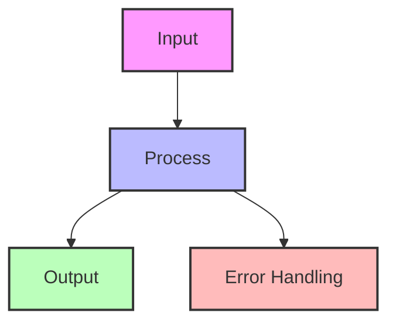

<details>
<summary>View implementation code</summary>

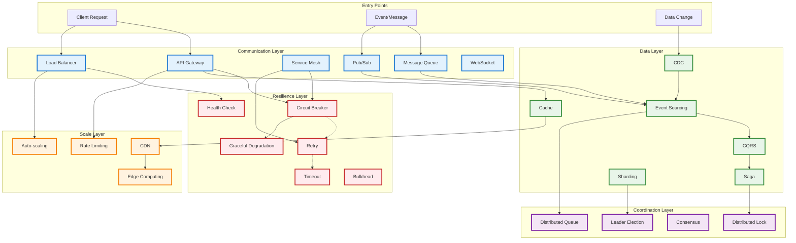

</details>

## 🔗 Key Pattern Relationships

### 1. The Resilience Chain
**Patterns that work together to prevent failures**


<details>
<summary>View implementation code</summary>

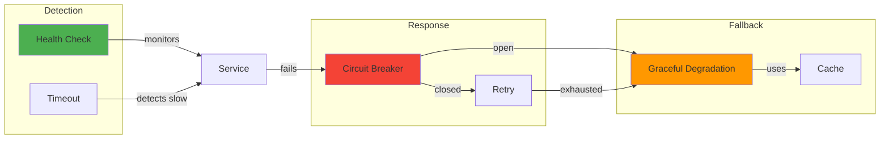

</details>

**How they work together**:
- Health Check continuously monitors service health
- Timeout prevents operations from hanging indefinitely
- Circuit Breaker prevents cascade failures
- Retry handles transient failures (when circuit is closed)
- Graceful Degradation provides fallback functionality
- Cache provides stale but available data

### 2. The Data Consistency Journey
**Patterns for managing distributed data**


<details>
<summary>View implementation code</summary>

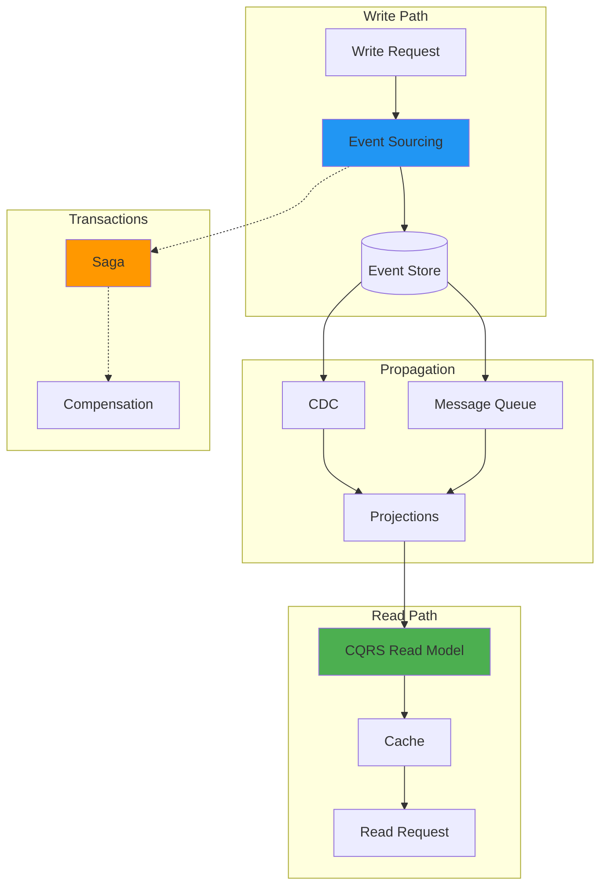

</details>

### 3. The Scale Architecture
**Patterns that enable horizontal scaling**


<details>
<summary>View implementation code</summary>

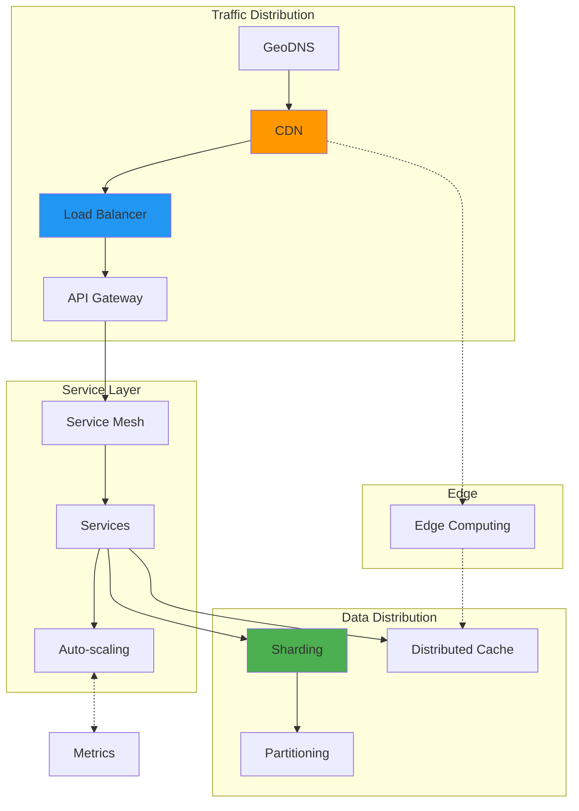

</details>

## 🧩 Pattern Combinations by Use Case

### E-Commerce Platform


<details>
<summary>View implementation code</summary>

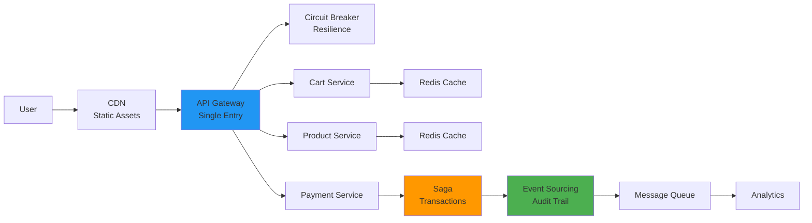

</details>

### Real-Time Chat System
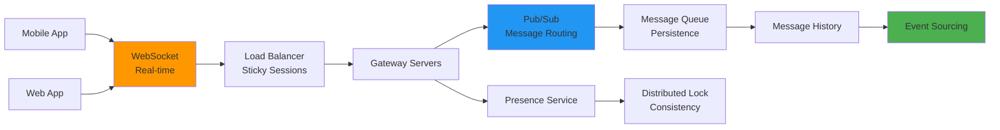

### Financial Trading System


<details>
<summary>View implementation code</summary>

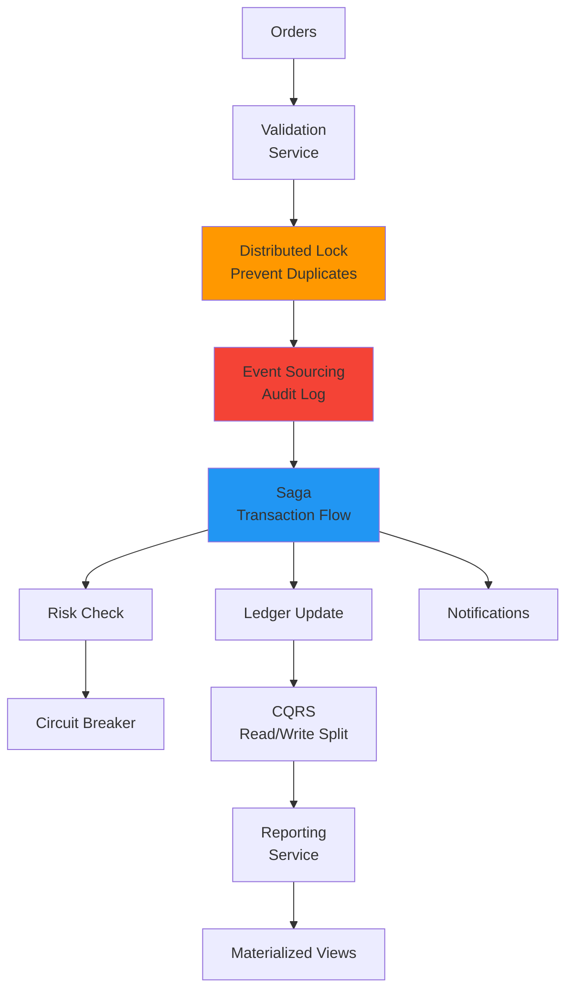

</details>

## 🔄 Pattern Dependencies

### Hard Dependencies (Required)
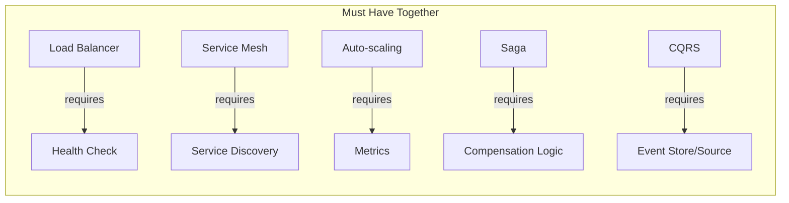

### Soft Dependencies (Recommended)
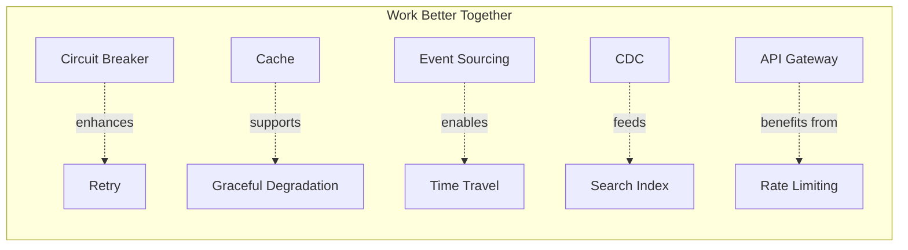

## 🎯 Pattern Selection by Problem

### "My service is slow"
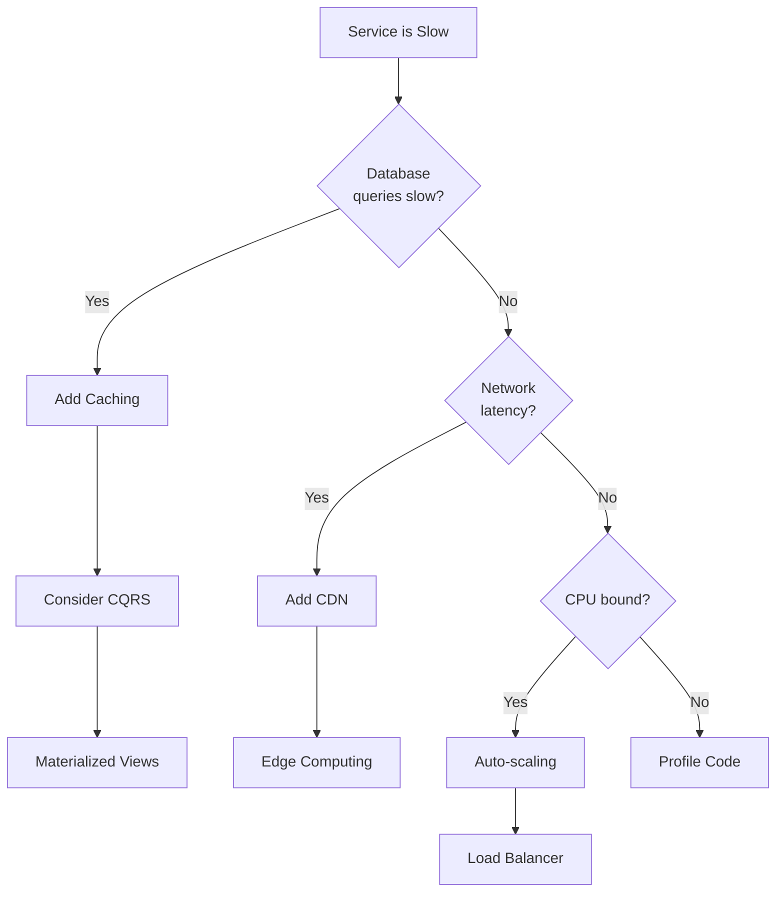

### "My system keeps crashing"
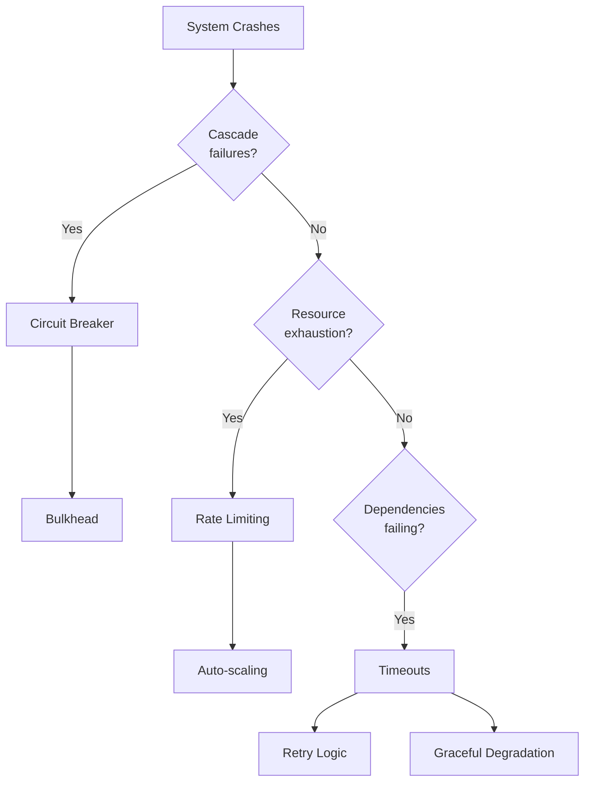

## 🏗️ Building Blocks: Pattern Stacks

### The Reliability Stack
```
Foundation → Enhancement → Advanced
    ↓             ↓            ↓
Health Check → Timeout → Circuit Breaker
    +             +            +
  Retry      Backoff    Graceful Degradation
```

### The Performance Stack
```
Foundation → Enhancement → Advanced
    ↓             ↓            ↓
  Cache   →     CDN    →  Edge Computing
    +             +            +
Load Balancer  Sharding   Read Replicas
```

### The Data Stack
```
Foundation → Enhancement → Advanced
    ↓             ↓            ↓
Database   →   CQRS    → Event Sourcing
    +             +            +
  Backup        CDC         Saga
```

## 📈 Evolution Path

### Phase 1: Monolith
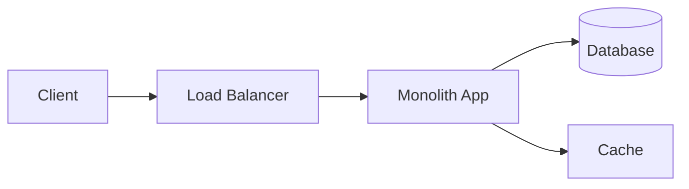

### Phase 2: Simple Microservices
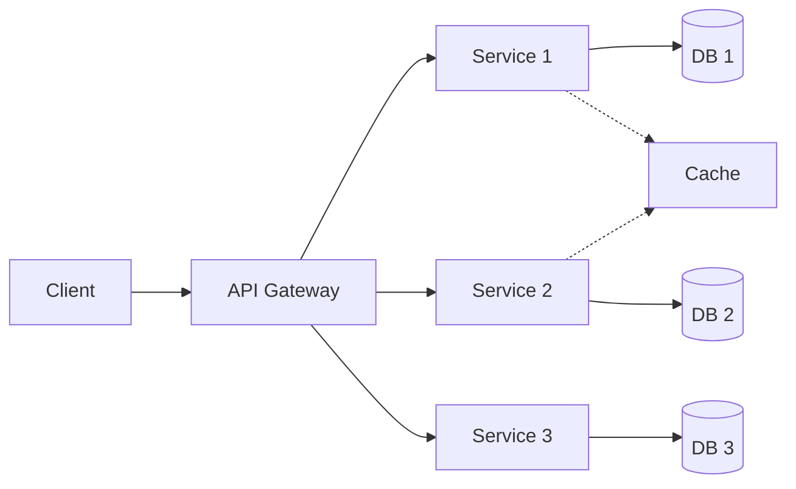

### Phase 3: Advanced Architecture
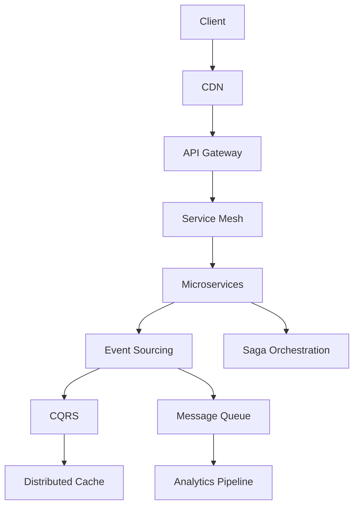

## 🔍 Pattern Discovery Questions

To find the right patterns, ask:

1. **What fails?** → Resilience patterns
2. **What's slow?** → Performance patterns
3. **What doesn't scale?** → Scaling patterns
4. **What's inconsistent?** → Data patterns
5. **What can't communicate?** → Communication patterns
6. **What needs coordination?** → Coordination patterns

---

*Use this relationship map to understand how patterns work together. Remember: patterns are most powerful when combined correctly.*

## Level 1: Intuition (5 minutes)

*Start your journey with relatable analogies*

### The Elevator Pitch
[Pattern explanation in simple terms]

### Real-World Analogy
[Everyday comparison that explains the concept]

## Level 2: Foundation (10 minutes)

*Build core understanding*

### Core Concepts
- Key principle 1
- Key principle 2
- Key principle 3

### Basic Example
```mermaid
graph LR
    A[Component A] --> B[Component B]
    B --> C[Component C]
```

## Level 3: Deep Dive (15 minutes)

*Understand implementation details*

### How It Really Works
[Technical implementation details]

### Common Patterns
[Typical usage patterns]

## Level 4: Expert (20 minutes)

*Master advanced techniques*

### Advanced Configurations
[Complex scenarios and optimizations]

### Performance Tuning
[Optimization strategies]

## Level 5: Mastery (30 minutes)

*Apply in production*

### Real-World Case Studies
[Production examples from major companies]

### Lessons from the Trenches
[Common pitfalls and solutions]


## Decision Matrix

```mermaid
graph TD
    Start[Need This Pattern?] --> Q1{High Traffic?}
    Q1 -->|Yes| Q2{Distributed System?}
    Q1 -->|No| Simple[Use Simple Approach]
    Q2 -->|Yes| Q3{Complex Coordination?}
    Q2 -->|No| Basic[Use Basic Pattern]
    Q3 -->|Yes| Advanced[Use This Pattern]
    Q3 -->|No| Intermediate[Consider Alternatives]
    
    style Start fill:#f9f,stroke:#333,stroke-width:2px
    style Advanced fill:#bfb,stroke:#333,stroke-width:2px
    style Simple fill:#ffd,stroke:#333,stroke-width:2px
```

### Quick Decision Table

| Factor | Low Complexity | Medium Complexity | High Complexity |
|--------|----------------|-------------------|-----------------|
| Team Size | < 5 developers | 5-20 developers | > 20 developers |
| Traffic | < 1K req/s | 1K-100K req/s | > 100K req/s |
| Data Volume | < 1GB | 1GB-1TB | > 1TB |
| **Recommendation** | ❌ Avoid | ⚠️ Consider | ✅ Implement |
