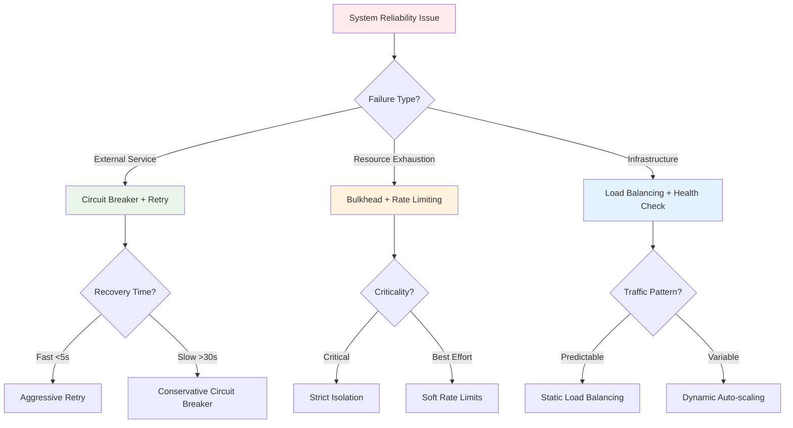
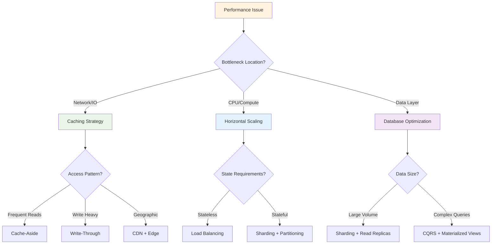
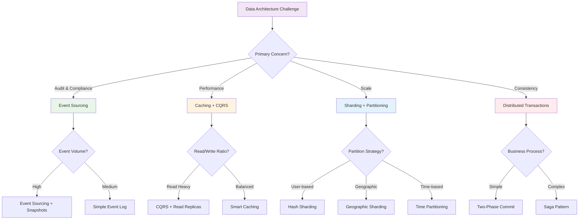
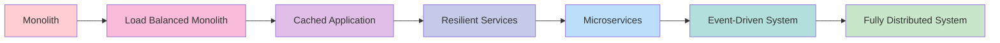

# Pattern Selection Cheatsheet

**The definitive quick reference for choosing the right patterns for your distributed systems challenges**

This cheatsheet provides instant guidance for selecting appropriate distributed systems patterns based on your specific problems, constraints, and requirements. Use it during architecture reviews, system design sessions, and troubleshooting to quickly identify the most effective patterns for your situation.

## 🚨 Problem-to-Pattern Quick Lookup

### System Reliability Problems

| Problem | Primary Pattern | Supporting Patterns | Example |
|---------|----------------|-------------------|---------|
| **Service keeps going down** | [Circuit Breaker](resilience/circuit-breaker.md) | Retry, Health Check, Bulkhead | Payment service failing |
| **Cascade failures** | [Bulkhead](resilience/bulkhead-gold.md) | Circuit Breaker, Load Shedding | One slow API affecting entire system |
| **Intermittent network errors** | [Retry with Backoff](resilience/retry-backoff-gold.md) | Circuit Breaker, Timeout | Database connection timeouts |
| **Single point of failure** | [Load Balancing](scaling/load-balancing.md) | Health Check, Auto-scaling | Single server handling all traffic |
| **System overload** | [Rate Limiting](resilience/rate-limiting-elite-engineering.md) | Load Shedding, Circuit Breaker | API getting too many requests |

### Performance & Scale Problems  

| Problem | Primary Pattern | Supporting Patterns | Example |
|---------|----------------|-------------------|---------|
| **Slow response times** | [Caching](scaling/caching-strategies.md) | CDN, Read Replicas | Database queries taking >1 second |
| **Can't handle traffic spikes** | [Auto-scaling](scaling/auto-scaling.md) | Load Balancing, Circuit Breaker | Black Friday traffic surge |
| **Database bottleneck** | [Sharding](scaling/sharding.md) | Read Replicas, CQRS | Single DB hitting CPU/memory limits |
| **Geographic latency** | [CDN](scaling/content-delivery-network.md) | Edge Computing, Geo-routing | Global users experiencing delays |
| **Batch processing slowdown** | [Backpressure](scaling/backpressure.md) | Queue, Load Shedding | Message processing falling behind |

### Data Consistency Problems

| Problem | Primary Pattern | Supporting Patterns | Example |
|---------|----------------|-------------------|---------|
| **Lost transaction history** | [Event Sourcing](data-management/event-sourcing.md) | CQRS, Snapshot | Can't recreate account balance |
| **Complex distributed transactions** | [Saga](data-management/saga.md) | Event Sourcing, Compensation | Multi-step order processing |
| **Read/write performance mismatch** | [CQRS](data-management/cqrs.md) | Event Sourcing, Materialized View | Slow reporting affecting operations |
| **Data synchronization issues** | [CDC](data-management/cdc.md) | Event Sourcing, Message Queue | Keeping multiple databases in sync |
| **Eventual consistency challenges** | [Outbox Pattern](data-management/outbox.md) | Event Sourcing, Saga | Ensuring message delivery |

### Architecture & Integration Problems

| Problem | Primary Pattern | Supporting Patterns | Example |
|---------|----------------|-------------------|---------|
| **Tight service coupling** | [Event-Driven Architecture](architecture/event-driven.md) | Message Queue, CQRS | Services calling each other directly |
| **Service discovery issues** | [Service Registry](communication/service-registry.md) | Health Check, Load Balancing | Hard-coded service addresses |
| **Complex API management** | [API Gateway](communication/api-gateway.md) | Rate Limiting, Authentication | Many clients calling many services |
| **Cross-cutting concerns** | [Service Mesh](communication/service-mesh.md) | Circuit Breaker, Observability | Repeated code for logging, security |
| **Deployment complexity** | [Blue-Green Deployment](deployment/blue-green.md) | Feature Flags, Canary | Risk of deployment downtime |

## 🎯 Decision Trees

### Reliability Decision Tree



### Performance Decision Tree



### Data Architecture Decision Tree



## ⚡ Quick Selection Matrix

### By System Characteristics

| System Type | Must-Have Patterns | Should-Have Patterns | Nice-to-Have Patterns |
|-------------|------------------|-------------------|---------------------|
| **High-Traffic Web App** | Load Balancing, Caching, Circuit Breaker | Auto-scaling, CDN, Rate Limiting | Blue-Green Deployment |
| **Microservices Architecture** | Service Registry, Circuit Breaker, Retry | API Gateway, Event-Driven, CQRS | Service Mesh, Saga |
| **Data-Intensive System** | Sharding, CQRS, Caching | Event Sourcing, CDC, Read Replicas | Materialized Views |
| **Financial/Audit System** | Event Sourcing, Saga, Bulkhead | CQRS, Two-Phase Commit, Encryption | Immutable Infrastructure |
| **Real-time System** | Backpressure, Load Shedding, Circuit Breaker | Event Streaming, WebSocket, Edge Computing | Predictive Scaling |
| **Global System** | CDN, Geo-routing, Multi-region | Edge Computing, Geographic Sharding | Anycast, Latency Routing |

### By Team Size & Expertise

| Team Profile | Recommended Start | Growth Phase | Advanced Phase |
|--------------|------------------|--------------|----------------|
| **Startup (2-5 devs)** | Load Balancing, Basic Caching, Health Check | Circuit Breaker, Auto-scaling | Microservices patterns |
| **Growing Team (5-15 devs)** | Circuit Breaker, Retry, CQRS | Sharding, Event-Driven, Saga | Service Mesh, Advanced patterns |
| **Enterprise (15+ devs)** | Full reliability stack | Domain-specific patterns | Custom pattern development |

### By Non-Functional Requirements

| Requirement | Priority Level | Recommended Patterns | Implementation Order |
|-------------|----------------|-------------------|-------------------|
| **99.9% Availability** | Critical | Circuit Breaker, Load Balancing, Health Check, Retry | 1. Load Balancing<br>2. Health Check<br>3. Circuit Breaker<br>4. Retry |
| **Sub-100ms Latency** | Critical | Caching, CDN, Edge Computing, Connection Pooling | 1. Caching<br>2. CDN<br>3. Edge Computing<br>4. Connection Pooling |
| **10x Traffic Growth** | High | Auto-scaling, Load Balancing, Sharding, Caching | 1. Load Balancing<br>2. Caching<br>3. Auto-scaling<br>4. Sharding |
| **Audit Compliance** | High | Event Sourcing, Immutable Log, Encryption, Access Control | 1. Event Sourcing<br>2. Immutable Log<br>3. Encryption<br>4. Access Control |
| **Global Users** | Medium | CDN, Multi-region, Geographic Routing, Edge Computing | 1. CDN<br>2. Multi-region<br>3. Geographic Routing<br>4. Edge Computing |

## 🛠️ Implementation Priority Matrix

### Phase 1: Foundation (Weeks 1-4)
**Goal**: Basic reliability and performance

| Pattern | Effort | Impact | Priority | Dependencies |
|---------|--------|--------|----------|-------------|
| Health Check | Low | High | 1 | None |
| Load Balancing | Medium | High | 2 | Health Check |
| Basic Caching | Low | High | 3 | None |
| Retry with Backoff | Low | Medium | 4 | None |

### Phase 2: Resilience (Weeks 5-8)  
**Goal**: Fault tolerance and isolation

| Pattern | Effort | Impact | Priority | Dependencies |
|---------|--------|--------|----------|-------------|
| Circuit Breaker | Medium | High | 1 | Health Check, Retry |
| Rate Limiting | Low | Medium | 2 | None |
| Bulkhead | Medium | Medium | 3 | Load Balancing |
| Graceful Degradation | Low | Medium | 4 | Circuit Breaker |

### Phase 3: Scale (Weeks 9-16)
**Goal**: Handle growth and performance

| Pattern | Effort | Impact | Priority | Dependencies |
|---------|--------|--------|----------|-------------|
| Auto-scaling | High | High | 1 | Load Balancing, Health Check |
| CDN | Low | High | 2 | None |
| Sharding | High | High | 3 | Stable application architecture |
| CQRS | Medium | Medium | 4 | Clear read/write separation |

### Phase 4: Advanced (Weeks 17-24)
**Goal**: Complex workflows and optimization

| Pattern | Effort | Impact | Priority | Dependencies |
|---------|--------|--------|----------|-------------|
| Event Sourcing | High | Medium | 1 | Clear domain model |
| Saga Pattern | High | Medium | 2 | Event Sourcing or messaging |
| Service Mesh | High | Low | 3 | Microservices architecture |
| Event-Driven Architecture | High | High | 4 | Messaging infrastructure |

## 📊 Pattern Combination Recipes

### The Netflix Stack
**Use Case**: High-scale video streaming platform

```yaml
Core Patterns:
  - Circuit Breaker (Hystrix)
  - Bulkhead (Thread Pool Isolation)  
  - Auto-scaling (Dynamic capacity)
  - CDN (Global content delivery)

Data Patterns:
  - Event Sourcing (User actions)
  - CQRS (Recommendation engine)
  - Sharding (User data)

Results:
  - 99.9% availability
  - Handles 15% failure rate
  - Serves 200+ countries
```

### The Uber Stack  
**Use Case**: Real-time ride-sharing platform

```yaml
Core Patterns:
  - Geographic Sharding (City-based)
  - WebSocket (Real-time updates)
  - Circuit Breaker (Payment/mapping APIs)
  - Event-Driven (Trip lifecycle)

Data Patterns:
  - Time-based Partitioning (Trip data)
  - Saga (Trip booking workflow)
  - CDC (Driver location updates)

Results:
  - Sub-second matching
  - 20M+ rides/day
  - 70+ countries
```

### The Stripe Stack
**Use Case**: Global payment processing

```yaml
Core Patterns:
  - Idempotency Keys (Duplicate prevention)
  - Bulkhead (Payment method isolation)
  - Retry with Backoff (Bank API calls)
  - Rate Limiting (API protection)

Data Patterns:
  - Event Sourcing (Financial transactions)
  - Saga (Multi-party payments)
  - Encryption (PCI compliance)

Results:
  - 99.99% API uptime
  - $350B+ processed annually
  - 50+ countries
```

### The Discord Stack
**Use Case**: Real-time messaging platform

```yaml
Core Patterns:
  - WebSocket (Message delivery)
  - Load Balancing (Connection distribution)
  - Circuit Breaker (Voice/video APIs)
  - Backpressure (Message queuing)

Data Patterns:
  - Sharding (Server-based partitioning)
  - Time Partitioning (Message history)
  - Caching (User presence)

Results:
  - 14B+ messages monthly
  - <50ms message delivery
  - 150M+ monthly users
```

## 🚫 Anti-Pattern Warnings

### Common Mistakes to Avoid

| Anti-Pattern | Description | Impact | Fix |
|--------------|-------------|--------|-----|
| **Pattern Soup** | Using too many patterns without clear need | High complexity, maintenance burden | Start simple, add patterns incrementally |
| **Premature Optimization** | Adding advanced patterns before proving need | Wasted effort, over-engineering | Measure first, optimize second |
| **Cargo Cult Implementation** | Copying patterns without understanding context | Ineffective solutions, hidden problems | Understand the problem before applying patterns |
| **Single Pattern Thinking** | Relying on one pattern for all problems | Brittle solutions, missed opportunities | Use pattern combinations appropriately |
| **No Monitoring** | Implementing patterns without observability | Invisible failures, debugging nightmares | Add monitoring from day one |

### Pattern Overuse Symptoms

| Symptom | Likely Cause | Recommended Action |
|---------|--------------|-------------------|
| Debugging takes >2 hours | Too many abstraction layers | Simplify architecture, remove unnecessary patterns |
| New features take >2 weeks | Over-engineered system | Focus on core patterns, remove complexity |
| Team velocity decreasing | Cognitive overload | Pattern training, documentation, simplification |
| Production issues increasing | Pattern conflicts | Review pattern interactions, fix conflicts |

## 🎯 Context-Specific Guidance

### Startup Phase (0-50K users)
**Focus**: Shipping features fast while building on solid foundations

```yaml
Essential:
  - Load Balancing (2 servers minimum)
  - Health Check (basic availability)
  - Database Replication (backup & read scaling)

Avoid:
  - Microservices (too much complexity)
  - Advanced sharding (premature optimization)
  - Complex event sourcing (over-engineering)

Next Phase Triggers:
  - Response time >500ms → Add caching
  - Frequent downtime → Add circuit breaker
  - Manual scaling pain → Add auto-scaling
```

### Growth Phase (50K-1M users)  
**Focus**: Handling scale while maintaining velocity

```yaml
Essential:
  - Circuit Breaker (external API protection)
  - Caching (performance improvement)
  - Auto-scaling (handle traffic spikes)
  - Rate Limiting (abuse protection)

Consider:
  - CQRS (if read/write patterns differ)
  - Sharding (if database becomes bottleneck)
  - CDN (if global users or static content)

Next Phase Triggers:
  - Database queries >100ms → Consider sharding
  - Complex workflows → Consider saga pattern
  - Audit requirements → Consider event sourcing
```

### Scale Phase (1M+ users)
**Focus**: Optimization and specialized patterns

```yaml
Essential:
  - Sharding (data layer scaling)
  - Event-Driven Architecture (service decoupling)
  - Service Discovery (microservices support)
  - Advanced monitoring (observability)

Advanced:
  - Event Sourcing (audit & replay capabilities)
  - Saga Pattern (complex workflow management)
  - Service Mesh (cross-cutting concerns)
  - Geographic Distribution (global scale)

Optimization Focus:
  - Pattern performance tuning
  - Custom pattern development
  - Domain-specific optimizations
```

## 📋 Quick Decision Checklist

Before implementing any pattern, answer these questions:

### Problem Validation
- [ ] **Is this a real problem?** Do you have metrics showing the issue?
- [ ] **What's the impact?** How many users/requests are affected?
- [ ] **What's the trend?** Is this problem getting worse over time?
- [ ] **What's the cost of inaction?** Revenue, user experience, or operational cost?

### Pattern Selection
- [ ] **Does this pattern solve the core problem?** Not just symptoms
- [ ] **What are the trade-offs?** Complexity vs benefit analysis
- [ ] **Do we have the expertise?** Team capability to implement and maintain
- [ ] **What are the dependencies?** Other patterns or infrastructure needed

### Implementation Planning
- [ ] **How will we measure success?** Define metrics before implementation
- [ ] **What's the rollback plan?** How to undo if things go wrong
- [ ] **How will we monitor it?** Observability and alerting strategy
- [ ] **What's the maintenance overhead?** Ongoing operational costs

### Success Criteria
- [ ] **Performance improvement**: Quantify expected gains
- [ ] **Reliability improvement**: Define availability targets
- [ ] **Complexity acceptable**: Team can understand and maintain
- [ ] **Cost justified**: Benefits outweigh implementation and operational costs

## 🔄 Pattern Evolution Path

### Typical Evolution Sequence



### Migration Strategies

| Current State | Target Pattern | Migration Strategy | Risk Level |
|---------------|----------------|-------------------|------------|
| Single Server | Load Balancing | Add second server, configure LB | Low |
| Direct Service Calls | Circuit Breaker | Add circuit breaker library | Low |
| Synchronous Calls | Event-Driven | Implement message queue gradually | Medium |
| Monolithic Database | CQRS | Split read models first | Medium |
| CRUD Operations | Event Sourcing | Start with critical aggregates | High |
| Monolith | Microservices | Extract services by domain | High |

## 📚 Further Reading

### Essential Resources by Pattern Category

**Reliability Patterns**:
- [Circuit Breaker Implementation Guide](resilience/circuit-breaker.md)
- [Retry Strategy Best Practices](resilience/retry-backoff-gold.md)
- [Bulkhead Pattern Deep Dive](resilience/bulkhead-gold.md)

**Performance Patterns**:
- [Caching Strategies Comparison](scaling/caching-strategies.md)
- [Sharding Design Patterns](scaling/sharding.md)
- [CDN Implementation Guide](scaling/content-delivery-network.md)

**Data Patterns**:
- [Event Sourcing Practical Guide](data-management/event-sourcing.md)
- [CQRS Architecture Patterns](data-management/cqrs.md)
- [Saga Pattern Implementation](data-management/saga.md)

**Architecture Patterns**:
- [Event-Driven Architecture](architecture/event-driven.md)
- [Microservices Patterns](architecture/microservices-decomposition-mastery.md)
- [Service Mesh Guide](communication/service-mesh.md)

---

## Summary

This cheatsheet provides the essential guidance for pattern selection in distributed systems. Remember:

1. **Start Simple**: Don't over-engineer from the beginning
2. **Measure First**: Use data to drive pattern selection decisions  
3. **Incremental Adoption**: Add patterns as you encounter specific challenges
4. **Monitor Everything**: Implement observability for all patterns
5. **Team Capability**: Only adopt patterns your team can maintain

The most successful distributed systems aren't those that use the most patterns, but those that use the right patterns applied at the right time to solve specific, measurable problems.

Use this guide as a reference during architecture discussions, but always validate pattern choices against your specific context, constraints, and team capabilities.