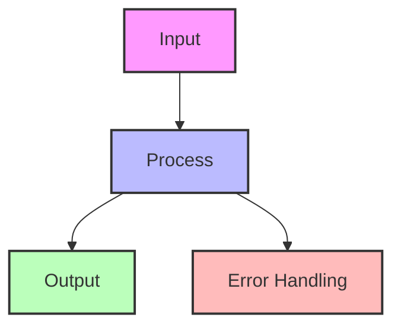
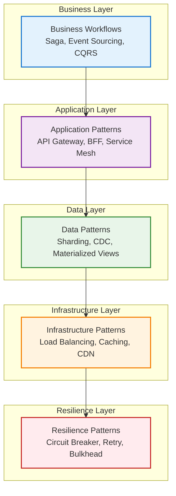
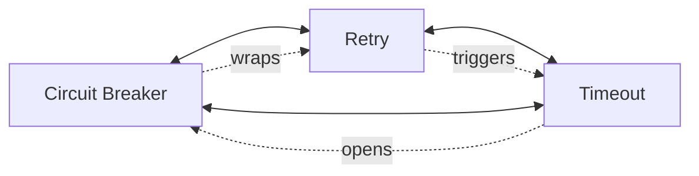
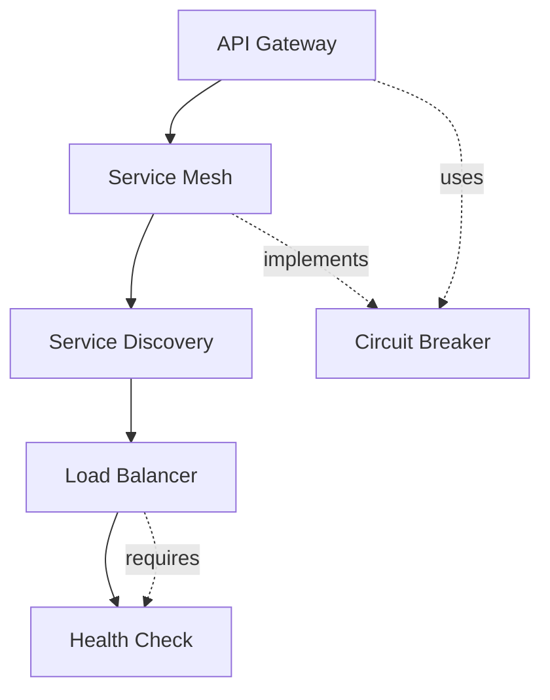
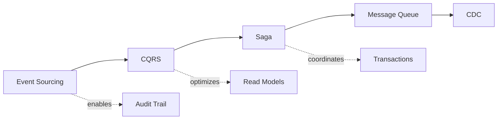
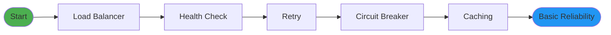
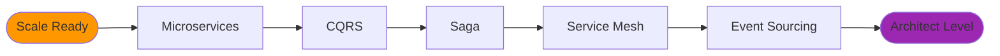
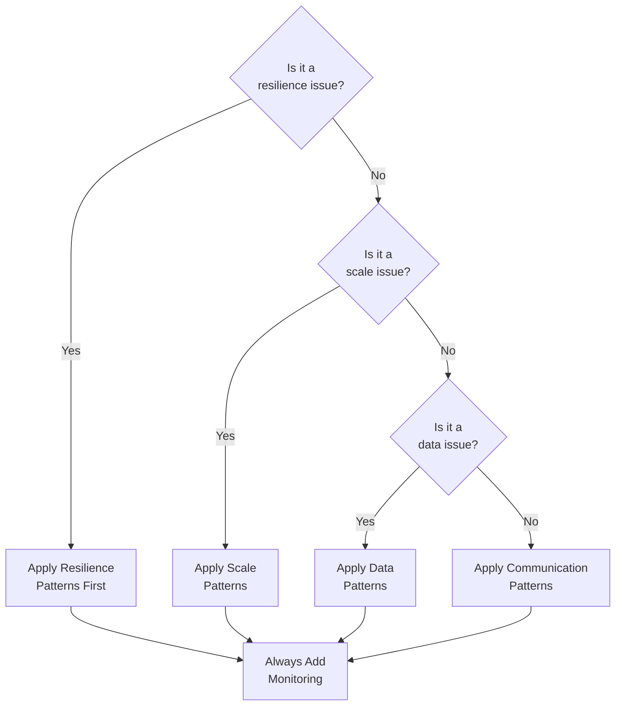
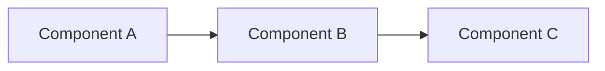
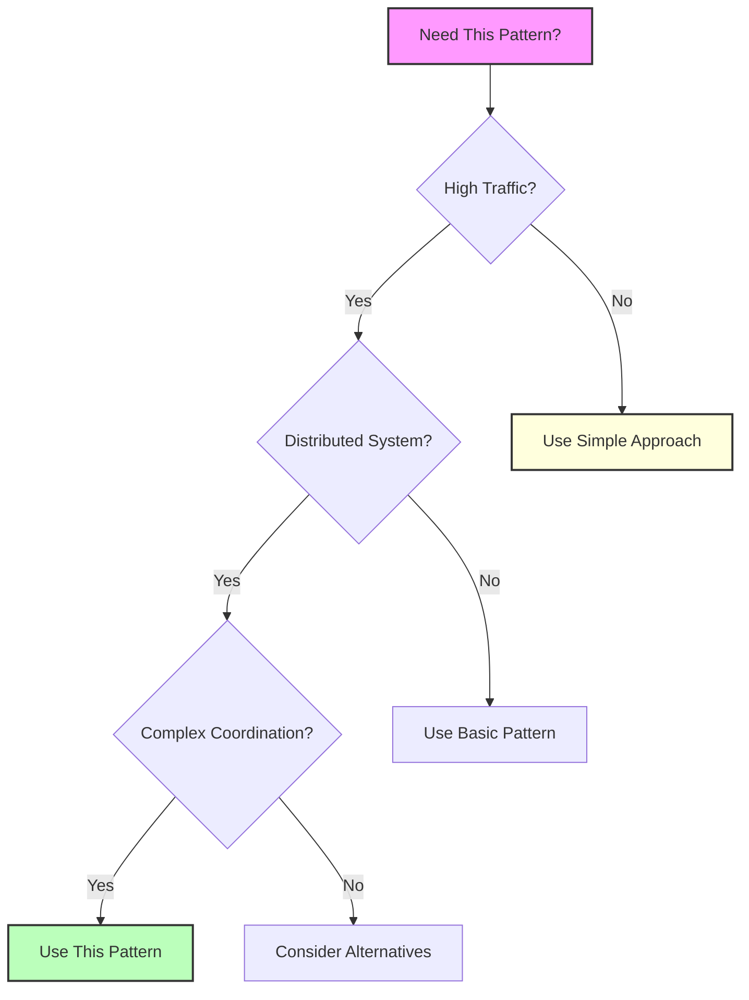

## Essential Question
## When to Use / When NOT to Use

### When to Use

| Scenario | Why It Fits | Alternative If Not |
|----------|-------------|-------------------|
| High availability required | Pattern provides resilience | Consider simpler approach |
| Scalability is critical | Handles load distribution | Monolithic might suffice |
| Distributed coordination needed | Manages complexity | Centralized coordination |

### When NOT to Use

| Scenario | Why to Avoid | Better Alternative |
|----------|--------------|-------------------|
| Simple applications | Unnecessary complexity | Direct implementation |
| Low traffic systems | Overhead not justified | Basic architecture |
| Limited resources | High operational cost | Simpler patterns |
**When and how should we implement pattern synthesis guide - making sense of 91 patterns in our distributed system?**

# Pattern Synthesis Guide: Making Sense of 91 Patterns

With 91 distributed systems patterns, the challenge isn't finding solutions—it's understanding which patterns work together, when to use them, and how they relate. This guide synthesizes the entire pattern library into digestible mental models.

## 🧠 The Core Mental Model: The Distributed Systems Stack

Think of distributed systems patterns as layers in a stack, each solving problems at different levels:



<details>
<summary>View implementation code</summary>



</details>

## 🎯 The 15 Essential Patterns (Start Here!)

If you learn only 15 patterns, these provide 80% of the value:

### 🛡️ The Resilience Foundation (4 patterns)
**Without these, your system WILL fail in production**

1. **Circuit Breaker** - Prevent cascade failures
2. **Retry with Backoff** - Handle transient failures
3. **Timeout** - Bound operation time
4. **Health Check** - Know system status

### 🔀 The Communication Core (4 patterns)
**How services talk to each other**

5. **API Gateway** - Single entry point
6. **Load Balancer** - Distribute traffic
7. **Message Queue** - Async communication
8. **Service Discovery** - Find services

### 📊 The Data Essentials (4 patterns)
**Managing state in distributed systems**

9. **Caching** - Reduce latency
10. **Database per Service** - Service independence
11. **Event Sourcing** - Audit trail
12. **CDC (Change Data Capture)** - Data synchronization

### 🚀 The Scale Enablers (3 patterns)
**Growing from 1K to 1M users**

13. **Auto-scaling** - Handle load dynamically
14. **Sharding** - Partition data
15. **CDN** - Global content delivery

## 🗺️ Pattern Relationship Map

Understanding how patterns work together is crucial. Here are the key relationships:

### The Resilience Trinity


**Why they work together**: Timeout detects slow operations, Retry handles transient failures, Circuit Breaker prevents retry storms.

### The Microservices Foundation


### The Event-Driven Architecture


## 🧩 Pattern Combinations That Work

### 1. The "Netflix Stack" (High-Scale Streaming)
```
API Gateway → Circuit Breaker → Service Mesh → Cache → CDN
            ↓                    ↓              ↓       ↓
         Fallback           Observability   Redis   Global PoPs
```

### 2. The "Uber Stack" (Real-Time Location)
```
WebSocket → Load Balancer → Geo-Sharding → Event Stream
         ↓              ↓              ↓            ↓
    Persistent     Sticky Sessions  Location   Kafka/Kinesis
```

### 3. The "Banking Stack" (Financial Transactions)
```
Event Sourcing → Saga → Distributed Lock → Audit Log
             ↓       ↓                ↓          ↓
        Immutable  Compensation   Consistency  Compliance
```

## 🎓 Progressive Learning Paths

### Path 1: The Beginner's Journey (2-4 weeks)
**Goal**: Build a reliable service



### Path 2: The Scale Journey (1-2 months)
**Goal**: Handle 100x growth


### Path 3: The Architecture Journey (3-6 months)
**Goal**: Build complex systems



## 🤔 Pattern Selection Mental Models

### Mental Model 1: The Failure Spectrum
```
Transient Failure ←――――――――――――→ Permanent Failure
     Retry              Circuit Breaker        Failover
```

### Mental Model 2: The Consistency Spectrum
```
Strong Consistency ←――――――――――→ Eventual Consistency
   2PC/Locks          Saga           Event Sourcing
```

### Mental Model 3: The Scale Spectrum
```
Single Server ←――――――――――――→ Global Scale
 Monolith    Load Balancer   Sharding    Edge Computing
```

### Mental Model 4: The Latency Spectrum
```
Microseconds ←――――――――――――→ Seconds
  Cache        CDN       Async Queue    Batch Processing
```

## 📊 Decision Framework: Which Pattern When?

### Step 1: Identify Your Primary Challenge

| Challenge | Pattern Category | Start With |
|-----------|-----------------|------------|
| "Things keep failing" | Resilience | Circuit Breaker, Retry |
| "Too slow" | Performance | Caching, CDN |
| "Can't handle load" | Scaling | Load Balancer, Auto-scaling |
| "Data inconsistency" | Data Management | Event Sourcing, Saga |
| "Services can't find each other" | Communication | Service Discovery, API Gateway |
| "Need audit trail" | Compliance | Event Sourcing, Audit Log |

### Step 2: Apply the Pattern Hierarchy



## 🏗️ Architecture Templates

### Template 1: Basic Microservices (5-10 services)
```yaml
Foundation:
  - API Gateway (single entry point)
  - Service Discovery (find services)
  - Load Balancer (distribute load)
  
Resilience:
  - Circuit Breaker (prevent cascades)
  - Retry + Backoff (handle transients)
  - Health Checks (know status)
  
Data:
  - Database per Service (independence)
  - Caching (performance)
  
Scale:
  - Auto-scaling (handle spikes)
```

### Template 2: Event-Driven Architecture
```yaml
Events:
  - Event Sourcing (source of truth)
  - Message Queue (decouple services)
  - CDC (data synchronization)
  
Processing:
  - CQRS (optimize read/write)
  - Saga (distributed transactions)
  - Stream Processing (real-time analytics)
  
Storage:
  - Event Store (immutable log)
  - Read Models (optimized views)
  - Snapshots (performance)
```

### Template 3: Global Scale System
```yaml
Edge:
  - CDN (content delivery)
  - Edge Computing (reduce latency)
  - GeoDNS (route by location)
  
Distribution:
  - Multi-Region (availability)
  - Geo-Replication (data locality)
  - Geo-Sharding (partition by location)
  
Consistency:
  - Eventual Consistency (accept delays)
  - Conflict Resolution (handle conflicts)
  - Vector Clocks (track causality)
```

## 🎭 Pattern Anti-Patterns to Avoid

### ❌ The "Kitchen Sink" Architecture
**Problem**: Using every pattern because it exists
**Solution**: Start simple, add patterns when you feel the pain

### ❌ The "Distributed Monolith"  
**Problem**: Microservices that share databases
**Solution**: Database per service + CDC for sync

### ❌ The "Cascade of Death"
**Problem**: No circuit breakers between services
**Solution**: Circuit breaker at every service boundary

### ❌ The "Chatty Services"
**Problem**: Too many synchronous calls
**Solution**: API Gateway aggregation + async messaging

## 📈 Maturity Model: Where Are You?

### Level 1: Startup (1-10K users)
**Patterns needed**: 5-10
- Load Balancer, Health Check
- Basic Caching, Simple Retry
- Monitoring

### Level 2: Growth (10K-1M users)
**Patterns needed**: 15-25
- Add: Circuit Breaker, API Gateway
- Add: Auto-scaling, CDN
- Add: Message Queues

### Level 3: Scale (1M-100M users)
**Patterns needed**: 30-50
- Add: Sharding, Service Mesh
- Add: Event Sourcing, CQRS
- Add: Multi-region

### Level 4: Hyperscale (100M+ users)
**Patterns needed**: 50+
- Add: Edge Computing
- Add: Custom protocols
- Add: ML-driven optimization

## 🚀 Quick Wins: Immediate Impact Patterns

If you implement nothing else, these patterns provide immediate value:

1. **Health Check** (1 hour) - Know when things break
2. **Retry with Backoff** (2 hours) - Handle network glitches
3. **Timeout** (1 hour) - Prevent hanging operations
4. **Basic Caching** (4 hours) - Instant performance boost
5. **Load Balancer** (1 day) - Basic high availability

**Total time**: 1-2 days for 5x reliability improvement

## 📚 Pattern Categories Simplified

Instead of 6 categories with 91 patterns, think in terms of problems:

### 🛡️ "Keep it Running" Patterns (Resilience)
Circuit Breaker, Retry, Timeout, Bulkhead, Health Check

### 🚀 "Make it Fast" Patterns (Performance)
Caching, CDN, Edge Computing, Materialized Views

### 📈 "Make it Scale" Patterns (Scaling)
Load Balancing, Auto-scaling, Sharding, Partitioning

### 🔄 "Keep Data Consistent" Patterns (Data)
Event Sourcing, Saga, CQRS, CDC

### 🔌 "Connect Services" Patterns (Communication)  
API Gateway, Service Mesh, Message Queue, gRPC

### 🎯 "Coordinate Actions" Patterns (Coordination)
Leader Election, Distributed Lock, Consensus

## 🎓 Final Synthesis: The 80/20 Rule

**80% of distributed systems problems are solved by 20% of patterns:**

1. **Resilience**: Circuit Breaker + Retry + Timeout
2. **Scale**: Load Balancer + Caching + Auto-scaling  
3. **Communication**: API Gateway + Message Queue
4. **Data**: Event Sourcing + Database per Service
5. **Coordination**: Leader Election + Distributed Lock

Master these 12-15 patterns first. Add others as your specific needs evolve.

---

*Remember: The best architecture is the simplest one that solves your current problems. Don't implement patterns you don't need yet.*

## Level 1: Intuition (5 minutes)

*Start your journey with relatable analogies*

### The Elevator Pitch
[Pattern explanation in simple terms]

### Real-World Analogy
[Everyday comparison that explains the concept]

## Level 2: Foundation (10 minutes)

*Build core understanding*

### Core Concepts
- Key principle 1
- Key principle 2
- Key principle 3

### Basic Example


## Level 3: Deep Dive (15 minutes)

*Understand implementation details*

### How It Really Works
[Technical implementation details]

### Common Patterns
[Typical usage patterns]

## Level 4: Expert (20 minutes)

*Master advanced techniques*

### Advanced Configurations
[Complex scenarios and optimizations]

### Performance Tuning
[Optimization strategies]

## Level 5: Mastery (30 minutes)

*Apply in production*

### Real-World Case Studies
[Production examples from major companies]

### Lessons from the Trenches
[Common pitfalls and solutions]


## Decision Matrix



### Quick Decision Table

| Factor | Low Complexity | Medium Complexity | High Complexity |
|--------|----------------|-------------------|-----------------|
| Team Size | < 5 developers | 5-20 developers | > 20 developers |
| Traffic | < 1K req/s | 1K-100K req/s | > 100K req/s |
| Data Volume | < 1GB | 1GB-1TB | > 1TB |
| **Recommendation** | ❌ Avoid | ⚠️ Consider | ✅ Implement |
