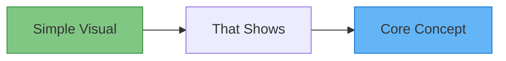
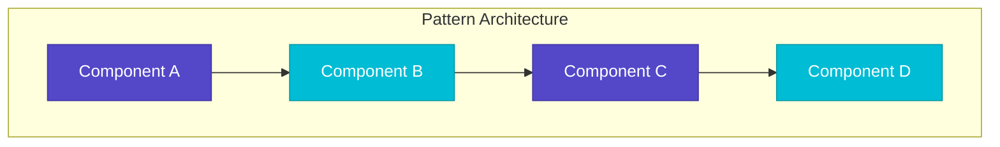
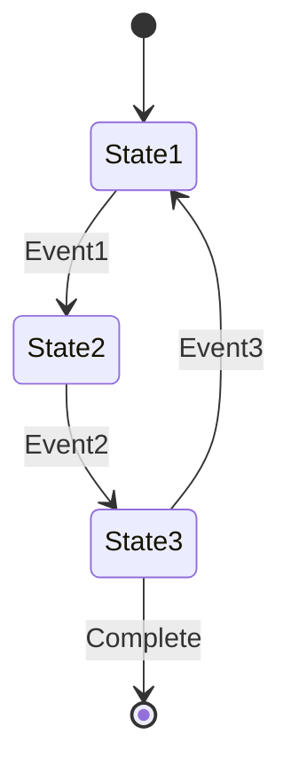
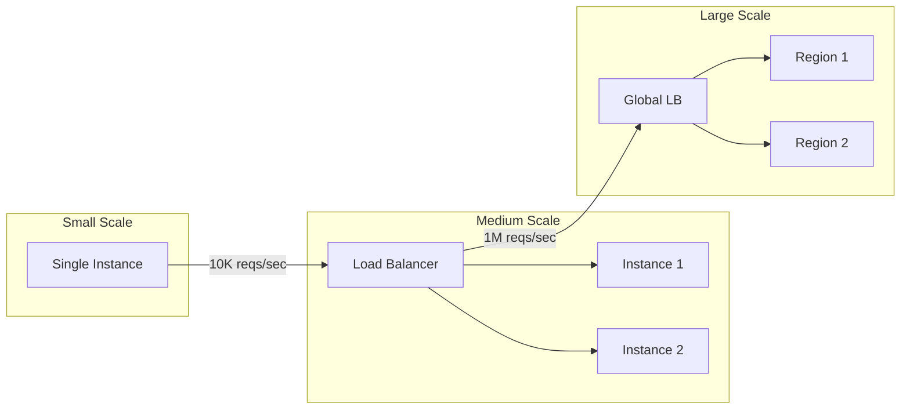
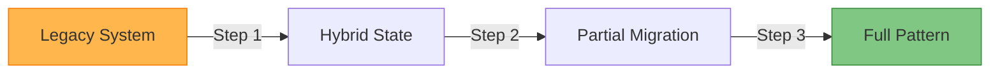
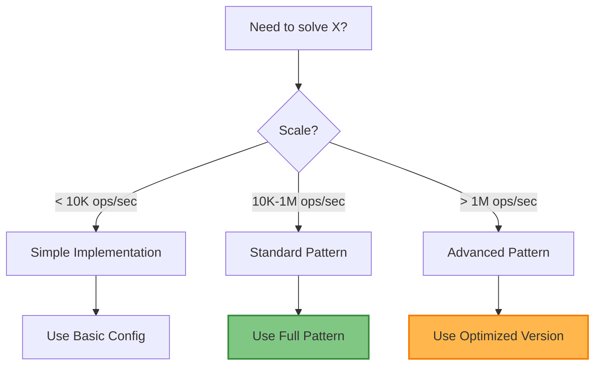

# [Pattern Name]

<!-- TIER-SPECIFIC BANNER (Choose ONE based on excellence_tier) -->

!!! success "🏆 Gold Standard Pattern"
    **[Tagline]** • [Companies] proven at [scale]
    
    [2-3 line summary of pattern value - focus on production success metrics]
    
    **Key Success Metrics:**
    - Company 1: [Specific metric - e.g., "99.99% uptime for 1B requests/day"]
    - Company 2: [Specific metric - e.g., "50% reduction in latency"]
    - Company 3: [Specific metric - e.g., "Handles 10M concurrent connections"]

!!! info "🥈 Silver Tier Pattern"
    **[Tagline]** • Specialized solution for [use case]
    
    [2-3 line summary explaining when this pattern excels]
    
    **Best For:** [Primary scenarios where this pattern shines]

!!! warning "🥉 Bronze Tier Pattern"
    **[Tagline]** • Legacy approach - Consider [modern alternative]
    
    [2-3 line summary explaining why this is legacy and what to use instead]
    
    **Migration Path:** See [modern alternative pattern] for current best practices

<!-- ESSENTIAL QUESTION - MUST BE PROMINENT -->

## Essential Question

**[Repeat the essential question in bold - e.g., "How do we handle millions of concurrent connections without overwhelming any single server?"]**

<!-- WHEN TO USE / WHEN NOT TO USE - MUST BE WITHIN FIRST 200 LINES -->

## When to Use / When NOT to Use

### ✅ Use When

| Scenario | Example | Impact |
|----------|---------|--------|
| [Scenario 1] | [Concrete example] | [Business impact] |
| [Scenario 2] | [Concrete example] | [Business impact] |
| [Scenario 3] | [Concrete example] | [Business impact] |

### ❌ DON'T Use When

| Scenario | Why | Alternative |
|----------|-----|-------------|
| [Anti-scenario 1] | [Reason it fails] | [Better pattern] |
| [Anti-scenario 2] | [Reason it fails] | [Better pattern] |
| [Anti-scenario 3] | [Reason it fails] | [Better pattern] |

<!-- 5-LEVEL PROGRESSIVE DISCLOSURE STRUCTURE -->

## Level 1: Intuition (5 min) {#intuition}

<!-- GOAL: Anyone can understand the core concept -->

### The Story
[Brief relatable story or metaphor that explains the pattern - 3-5 sentences]

### Visual Metaphor


### Core Insight
> **Key Takeaway:** [One sentence that captures the essence of the pattern]

### In One Sentence
[Pattern Name] [does what] by [how it works] to achieve [benefit].

## Level 2: Foundation (10 min) {#foundation}

<!-- GOAL: Engineers understand how it works -->

### The Problem Space

<div class="failure-vignette">
<h4>🚨 What Happens Without This Pattern</h4>

**Company X, 2023**: [Brief failure story showing what happens without this pattern - 3-4 sentences]

**Impact**: [Quantified impact - downtime, revenue loss, etc.]
</div>

### How It Works

#### Architecture Overview


#### Key Components

| Component | Purpose | Responsibility |
|-----------|---------|----------------|
| [Component A] | [What it does] | [Key responsibility] |
| [Component B] | [What it does] | [Key responsibility] |
| [Component C] | [What it does] | [Key responsibility] |

### Basic Example

```python
# Minimal example showing core concept (10-15 lines MAX)
def pattern_example():
    """Shows the essential pattern mechanism"""
    # Key step 1
    # Key step 2
    # Key step 3
    pass
```

## Level 3: Deep Dive (15 min) {#deep-dive}

<!-- GOAL: Engineers can implement it -->

### Implementation Details

#### State Management


#### Critical Design Decisions

| Decision | Options | Trade-off | Recommendation |
|----------|---------|-----------|----------------|
| [Decision 1] | Option A<br>Option B | A: [pros/cons]<br>B: [pros/cons] | [Context-based recommendation] |
| [Decision 2] | Option A<br>Option B | A: [pros/cons]<br>B: [pros/cons] | [Context-based recommendation] |

### Common Pitfalls

<div class="decision-box">
<h4>⚠️ Avoid These Mistakes</h4>

1. **[Pitfall 1]**: [Why it happens] → [How to avoid]
2. **[Pitfall 2]**: [Why it happens] → [How to avoid]
3. **[Pitfall 3]**: [Why it happens] → [How to avoid]
</div>

### Production Considerations

#### Performance Characteristics

| Metric | Typical Range | Optimization Target |
|--------|---------------|-------------------|
| Latency | [Range] | [Target] |
| Throughput | [Range] | [Target] |
| Memory | [Range] | [Target] |
| CPU | [Range] | [Target] |

## Level 4: Expert (20 min) {#expert}

<!-- GOAL: Engineers can optimize and scale it -->

### Advanced Techniques

#### Optimization Strategies

1. **[Technique 1]**
   - When to apply: [Context]
   - Impact: [Quantified improvement]
   - Trade-off: [What you sacrifice]

2. **[Technique 2]**
   - When to apply: [Context]
   - Impact: [Quantified improvement]
   - Trade-off: [What you sacrifice]

### Scaling Considerations



### Monitoring & Observability

#### Key Metrics to Track

| Metric | Alert Threshold | Dashboard Panel |
|--------|----------------|-----------------|
| [Metric 1] | [Threshold] | [What to show] |
| [Metric 2] | [Threshold] | [What to show] |
| [Metric 3] | [Threshold] | [What to show] |

## Level 5: Mastery (30 min) {#mastery}

<!-- GOAL: Architects can evolve and combine it -->

### Real-World Case Studies

#### Case Study 1: [Company] at Scale

<div class="truth-box">
<h4>💡 Production Insights from [Company]</h4>

**Challenge**: [What they needed to solve]

**Implementation**: [How they applied the pattern]

**Results**: 
- [Metric 1]: [Improvement]
- [Metric 2]: [Improvement]
- [Metric 3]: [Improvement]

**Lessons Learned**: [Key insights from their experience]
</div>

### Pattern Evolution

#### Migration from Legacy



#### Future Directions

| Trend | Impact on Pattern | Adaptation Strategy |
|-------|------------------|-------------------|
| [Trend 1] | [How it affects] | [How to adapt] |
| [Trend 2] | [How it affects] | [How to adapt] |

### Pattern Combinations

#### Works Well With

| Pattern | Combination Benefit | Integration Point |
|---------|-------------------|------------------|
| [Pattern 1] | [Why they work together] | [Where they connect] |
| [Pattern 2] | [Why they work together] | [Where they connect] |

## Quick Reference

### Decision Matrix



### Comparison with Alternatives

| Aspect | This Pattern | Alternative 1 | Alternative 2 |
|--------|-------------|---------------|---------------|
| Complexity | [Rating] | [Rating] | [Rating] |
| Performance | [Rating] | [Rating] | [Rating] |
| Scalability | [Rating] | [Rating] | [Rating] |
| Cost | [Rating] | [Rating] | [Rating] |
| When to use | [Context] | [Context] | [Context] |

### Implementation Checklist

**Pre-Implementation**
- [ ] Validated use case matches pattern strengths
- [ ] Reviewed "When NOT to use" section
- [ ] Capacity planning completed
- [ ] Monitoring strategy defined

**Implementation**
- [ ] Basic components deployed
- [ ] Error handling implemented
- [ ] Monitoring enabled
- [ ] Performance baselines established

**Post-Implementation**
- [ ] Load testing completed
- [ ] Runbooks created
- [ ] Team trained
- [ ] Success metrics tracking

### Related Resources

<div class="grid cards" markdown>

- :material-book-open-variant:{ .lg .middle } **Related Patterns**
    
    ---
    
    - [Pattern 1](../category/pattern1.md) - [How it relates]
    - [Pattern 2](../category/pattern2.md) - [How it relates]
    - [Pattern 3](../category/pattern3.md) - [How it relates]

- :material-flask:{ .lg .middle } **Fundamental Laws**
    
    ---
    
    - [Law 1: Name](../../part1-axioms/law1/) - [Connection]
    - [Law 2: Name](../../part1-axioms/law2/) - [Connection]

- :material-pillar:{ .lg .middle } **Foundational Pillars**
    
    ---
    
    - [Pillar 1: Name](../../part2-pillars/pillar1/) - [Implementation]
    - [Pillar 2: Name](../../part2-pillars/pillar2/) - [Implementation]

- :material-tools:{ .lg .middle } **Implementation Guides**
    
    ---
    
    - [Setup Guide](../../excellence/guides/pattern-setup.md)
    - [Testing Guide](../../excellence/guides/pattern-testing.md)
    - [Migration Guide](../../excellence/migrations/to-pattern.md)

</div>

---

<!-- TEMPLATE INSTRUCTIONS - DELETE IN ACTUAL PATTERNS -->

## Template Usage Instructions

### Content Limits (STRICT)
- **Total Length**: ≤ 1000 lines (including markdown)
- **Code Blocks**: ≤ 20% of total content
- **Each Level**: Strictly time-boxed content
- **Essential Question**: Must appear in frontmatter AND as section
- **When NOT to Use**: MUST be within first 200 lines

### Required Elements
1. **Excellence Tier Banner**: Choose ONE based on tier
2. **Essential Question**: Both in frontmatter and prominent section
3. **When to Use/NOT Use**: In table format, early in document
4. **Visual Diagrams**: Minimum 3 Mermaid diagrams
5. **Decision Support**: Matrix or flowchart for decisions
6. **Failure Story**: Real or realistic example
7. **Production Metrics**: Quantified benefits

### Writing Guidelines
1. **Start Visual**: Lead with diagrams, not text
2. **Tables > Lists**: Convert bullet points to tables
3. **Concise**: Every sentence must add value
4. **Scannable**: Use headers, tables, boxes
5. **Cross-reference**: Link to laws, pillars, patterns
6. **Mobile-friendly**: Test readability on small screens

### Level Structure Rules
- **Level 1**: Anyone can understand (non-technical)
- **Level 2**: Junior engineer can implement basics
- **Level 3**: Senior engineer can implement properly
- **Level 4**: Expert can optimize and scale
- **Level 5**: Architect can evolve and integrate

### Tier-Specific Requirements

#### Gold Patterns
- Production checklist in frontmatter
- 3+ real company examples with metrics
- Complete implementation guide
- Performance benchmarks
- Scaling roadmap

#### Silver Patterns
- Detailed trade-offs (pros/cons) in frontmatter
- "Best for" scenarios clearly defined
- Comparison with alternatives
- Complexity assessment
- Clear use case boundaries

#### Bronze Patterns
- Modern alternatives in frontmatter
- Deprecation reason explained
- Migration guide to modern pattern
- Historical context
- Clear warnings about limitations

### Quality Checklist
- [ ] Under 1000 lines total
- [ ] Essential question prominent
- [ ] When NOT to use within 200 lines
- [ ] 3+ visual diagrams
- [ ] 80%+ content in tables/diagrams
- [ ] All 5 levels present and balanced
- [ ] Cross-references to laws/pillars
- [ ] Mobile-friendly formatting
- [ ] Production examples included
- [ ] Decision support tools

<!-- END TEMPLATE INSTRUCTIONS -->