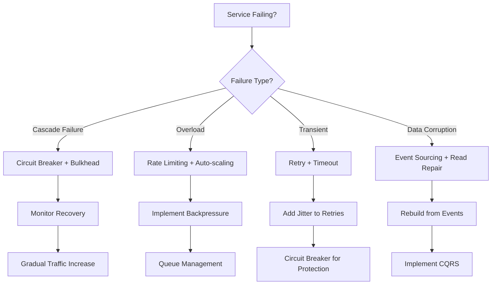
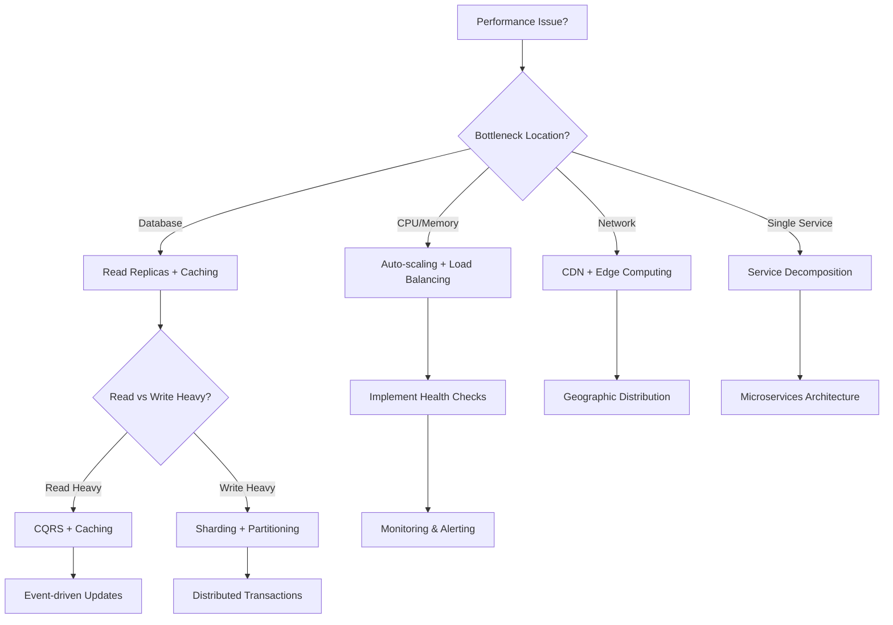
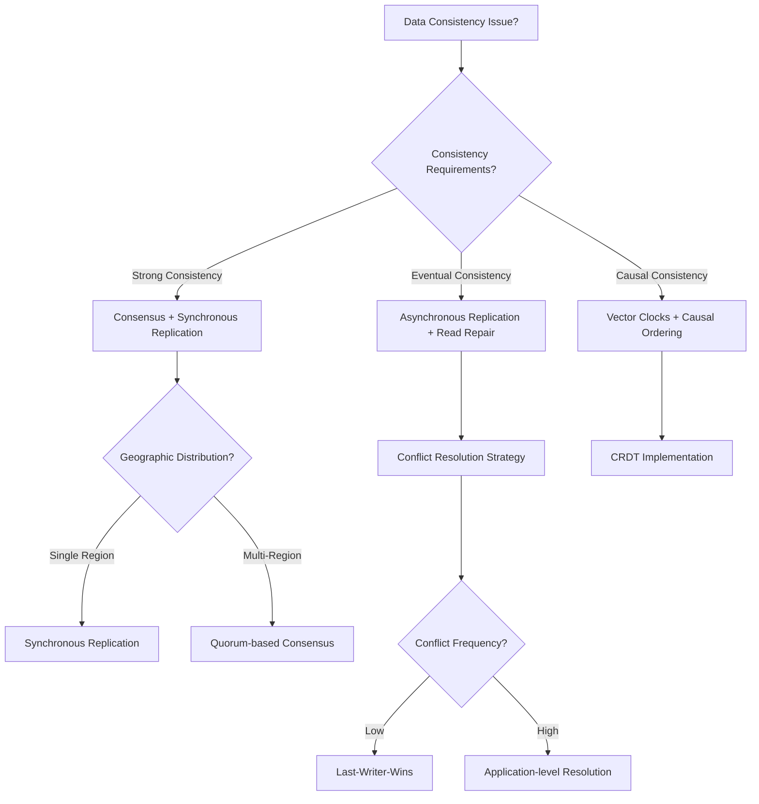

# Problem → Pattern Discovery Guide

> **Smart pattern discovery**: From "my system is failing" to "implement these 3 patterns in this order"

This guide helps you navigate from real-world problems to specific pattern implementations, with decision trees, cheat sheets, and curated pattern combinations.

## Quick Navigation

- [🚨 Emergency Fixes](#emergency-fixes) — Critical issues, immediate solutions
- [🔍 Pattern Discovery Wizard](#pattern-wizard) — Interactive problem-solving
- [📊 Top 10 Essential Patterns](#essential-patterns) — Start here for any system
- [🏆 Advanced Pattern Library](#advanced-patterns) — Specialized and cutting-edge
- [🎯 Decision Trees](#decision-trees) — Step-by-step pattern selection
- [🛠️ Implementation Roadmaps](#roadmaps) — Pattern application order

---

## 🚨 Emergency Fixes {#emergency-fixes}

### "My System is Down" Checklist

#### 🔥 Critical Service Failures

**Symptoms**: 5xx errors, timeouts, cascade failures

**Immediate Actions** (30 minutes):
1. **[Circuit Breaker](resilience/circuit-breaker.md)** — Stop cascade failures
2. **[Health Check](resilience/health-check.md)** — Identify failing components  
3. **[Bulkhead](resilience/bulkhead.md)** — Isolate failure domains
4. **[Graceful Degradation](resilience/graceful-degradation.md)** — Maintain core functionality

**Short-term** (24 hours):
- **[Retry with Backoff](resilience/retry-backoff.md)** — Handle transient failures
- **[Timeout](resilience/timeout.md)** — Prevent hanging operations
- **[Load Shedding](resilience/load-shedding.md)** — Protect against overload

#### ⚡ Performance Collapse

**Symptoms**: Response times >5x normal, queue buildup, CPU/memory saturation

**Immediate Actions** (30 minutes):
1. **[Rate Limiting](scaling/rate-limiting.md)** — Control incoming load
2. **[Caching Strategies](scaling/caching-strategies.md)** — Reduce backend load
3. **[Load Balancing](scaling/load-balancing.md)** — Distribute traffic
4. **[Auto-scaling](scaling/auto-scaling.md)** — Add capacity

**Short-term** (24 hours):
- **[Backpressure](scaling/backpressure.md)** — Flow control mechanisms
- **[Priority Queue](scaling/priority-queue.md)** — Handle critical requests first

#### 💥 Data Inconsistency

**Symptoms**: Conflicting data, lost updates, dirty reads

**Immediate Actions** (30 minutes):
1. **[Read Repair](data-management/read-repair.md)** — Fix inconsistencies on read
2. **[Saga](data-management/saga.md)** — Manage distributed transactions
3. **[Outbox Pattern](data-management/outbox.md)** — Ensure message delivery

**Short-term** (24 hours):
- **[Event Sourcing](data-management/event-sourcing.md)** — Rebuild state from events
- **[CQRS](data-management/cqrs.md)** — Separate read/write concerns

---

## 🔍 Pattern Discovery Wizard {#pattern-wizard}

### Interactive Problem Analysis

<div class="pattern-wizard">
<div class="wizard-step" id="step-1">

#### Step 1: What's Your Primary Problem?

<div class="problem-options">
<button class="problem-btn" onclick="selectProblem('failure')">
  🔥 **System Failures**<br/>
  Services going down, cascade failures, unreliable components
</button>

<button class="problem-btn" onclick="selectProblem('performance')">
  ⚡ **Performance Issues**<br/>
  Slow response times, high latency, throughput bottlenecks  
</button>

<button class="problem-btn" onclick="selectProblem('scale')">
  📈 **Scaling Challenges**<br/>
  Growing user base, increasing data volume, capacity limits
</button>

<button class="problem-btn" onclick="selectProblem('consistency')">
  🔄 **Data Consistency**<br/>
  Conflicting data, transaction management, sync issues
</button>

<button class="problem-btn" onclick="selectProblem('complexity')">
  🧠 **System Complexity**<br/>
  Hard to maintain, difficult deployments, operational overhead
</button>

<button class="problem-btn" onclick="selectProblem('realtime')">
  ⏱️ **Real-time Requirements**<br/>
  Live updates, streaming data, low-latency interactions
</button>
</div>
</div>

<div class="wizard-results" id="wizard-results" style="display: none;">
<!-- Results will be populated by JavaScript -->
</div>
</div>

---

## 📊 Top 10 Essential Patterns {#essential-patterns}

### Must-Have Patterns for Any Distributed System

<div class="essential-patterns-grid">

#### 1. **[Circuit Breaker](resilience/circuit-breaker.md)** 
*Prevents cascade failures*

**Use When**: Any service-to-service communication  
**Impact**: Prevents 90% of cascade failures  
**Implementation**: Start with simple timeout-based circuit breaker  

#### 2. **[Load Balancing](scaling/load-balancing.md)**
*Distributes traffic across instances*

**Use When**: Multiple instances of any service  
**Impact**: 3-5x capacity increase with proper implementation  
**Implementation**: Start with round-robin, graduate to weighted/health-based

#### 3. **[Health Check](resilience/health-check.md)** 
*Monitors service availability*

**Use When**: Every service, every deployment  
**Impact**: Reduces MTTR by 80%  
**Implementation**: Shallow + deep health checks

#### 4. **[API Gateway](communication/api-gateway.md)**
*Single entry point for microservices*

**Use When**: 3+ microservices  
**Impact**: Simplifies client integration, enables centralized policies  
**Implementation**: Start simple, add features incrementally

#### 5. **[Caching Strategies](scaling/caching-strategies.md)**
*Reduces latency and backend load*

**Use When**: Read-heavy workloads  
**Impact**: 10-100x performance improvement  
**Implementation**: Start with application-level, add CDN/distributed cache

#### 6. **[Auto-scaling](scaling/auto-scaling.md)**
*Dynamic capacity management*

**Use When**: Variable load patterns  
**Impact**: 30-70% cost reduction + availability improvement  
**Implementation**: CPU-based → Custom metrics → Predictive

#### 7. **[Event Sourcing](data-management/event-sourcing.md)**
*Store state as sequence of events*

**Use When**: Audit requirements, complex business logic  
**Impact**: Complete audit trail, temporal queries, replay capability  
**Implementation**: Start with single aggregate, expand gradually

#### 8. **[Service Discovery](communication/service-discovery.md)**
*Dynamic service location*

**Use When**: Microservices with dynamic scaling  
**Impact**: Enables true elasticity and zero-downtime deployments  
**Implementation**: DNS-based → Registry-based → Service mesh

#### 9. **[Retry with Backoff](resilience/retry-backoff.md)**
*Handle transient failures*

**Use When**: Any network communication  
**Impact**: 95%+ success rate for transient failures  
**Implementation**: Exponential backoff with jitter

#### 10. **[Bulkhead](resilience/bulkhead.md)**
*Isolate system components*

**Use When**: Mixed criticality workloads  
**Impact**: Contains blast radius of failures  
**Implementation**: Thread pools → Resource pools → Service isolation

</div>

---

## 🏆 Advanced Pattern Library {#advanced-patterns}

### For Complex Systems & Specialized Requirements

#### 🔬 Cutting-Edge Patterns (2023-2025)

**[Cell-based Architecture](architecture/cell-based.md)**  
*Isolate blast radius at infrastructure level*
- **Best For**: Ultra-large scale systems (Netflix, Amazon scale)
- **Complexity**: Very High
- **Adoption**: Growing in hyperscale companies

**[CRDT (Conflict-free Replicated Data Types)](data-management/crdt.md)**  
*Merge without coordination*
- **Best For**: Collaborative applications, edge computing
- **Complexity**: High (requires deep understanding)
- **Adoption**: Specialized use cases, growing in edge computing

**[Hybrid Logical Clocks](coordination/hlc.md)**  
*Physical + logical time for ordering*
- **Best For**: Distributed databases, debugging systems
- **Complexity**: High
- **Adoption**: Database internals, specialized monitoring

#### 🎯 Domain-Specific Patterns

**[ML Infrastructure](ml-infrastructure/)**
- **[Feature Store](ml-infrastructure/feature-store.md)** — Centralized feature management
- **[Model Serving at Scale](ml-infrastructure/model-serving-scale.md)** — Production ML deployment
- **[ML Pipeline Orchestration](ml-infrastructure/ml-pipeline-orchestration.md)** — End-to-end ML workflows

**[Security](security/)**
- **[Zero-Trust Architecture](security/zero-trust-architecture.md)** — Never trust, always verify
- **[Secrets Management](security/secrets-management.md)** — Secure credential handling
- **[API Security Gateway](security/api-security-gateway.md)** — Centralized security enforcement

**[Cost Optimization](cost-optimization/)**
- **[Spot Instance Management](cost-optimization/spot-instance-management.md)** — Leverage cheap compute
- **[Resource Rightsizing](cost-optimization/resource-rightsizing.md)** — Optimal resource allocation

#### 🚫 Patterns to Avoid (Bronze Tier)

**Two-Phase Commit**
- **Why Avoid**: Blocking protocol, single point of failure
- **Use Instead**: Saga pattern, eventual consistency

**Distributed Locks (naive implementations)**  
- **Why Avoid**: Often incorrectly implemented, performance bottleneck
- **Use Instead**: Consensus algorithms, optimistic locking

**Shared Database Anti-pattern**
- **Why Avoid**: Tight coupling, scaling bottleneck
- **Use Instead**: Database per service, event-driven integration

---

## 🎯 Decision Trees {#decision-trees}

### Failure Handling Decision Tree



### Scaling Decision Tree



### Data Consistency Decision Tree



---

## 🛠️ Implementation Roadmaps {#roadmaps}

### Phase 1: Foundation (Week 1-2)
**Goal**: Stop the bleeding, stabilize core functionality

```yaml
immediate_implementation:
  week_1:
    - health_checks: "All services"
    - circuit_breaker: "Critical service calls"
    - basic_monitoring: "Error rates, response times"
    
  week_2:
    - retry_with_backoff: "All external calls"
    - timeout_patterns: "All network operations"
    - basic_caching: "Expensive operations"
```

### Phase 2: Scaling (Week 3-6)  
**Goal**: Handle growth, improve performance

```yaml
scaling_implementation:
  week_3:
    - load_balancing: "Multi-instance services"
    - auto_scaling: "CPU-based scaling"
    
  week_4:
    - api_gateway: "Centralized routing"
    - service_discovery: "Dynamic service location"
    
  week_5_6:
    - advanced_caching: "Distributed cache layer"
    - database_optimization: "Read replicas, indexing"
```

### Phase 3: Resilience (Week 7-10)
**Goal**: Handle failures gracefully, improve reliability

```yaml
resilience_implementation:
  week_7:
    - bulkhead_isolation: "Separate thread pools"
    - graceful_degradation: "Fallback mechanisms"
    
  week_8_9:
    - event_sourcing: "Critical business entities"
    - saga_pattern: "Distributed transactions"
    
  week_10:
    - chaos_engineering: "Controlled failure injection"
    - disaster_recovery: "Cross-region failover"
```

### Phase 4: Advanced Patterns (Week 11+)
**Goal**: Optimize for specific requirements

```yaml
advanced_implementation:
  specialized_patterns:
    - cqrs: "Complex read/write scenarios"  
    - event_driven_architecture: "Loose coupling"
    - service_mesh: "Advanced traffic management"
    
  domain_specific:
    - ml_infrastructure: "If ML workloads"
    - security_patterns: "If compliance requirements"
    - cost_optimization: "If budget constraints"
```

---

## Pattern Combinations by Use Case

### E-commerce Platform
```yaml
core_stack:
  - api_gateway: "Single entry point"
  - circuit_breaker: "Service protection"
  - event_sourcing: "Order history"
  - caching_strategies: "Product catalog"
  - auto_scaling: "Handle traffic spikes"

advanced_stack:
  - saga_pattern: "Order processing"
  - cqrs: "Separate order reads/writes"  
  - rate_limiting: "API protection"
```

### Real-time Gaming
```yaml
core_stack:
  - websocket: "Real-time communication"
  - load_balancing: "Player distribution"
  - caching_strategies: "Game state"
  - circuit_breaker: "Service protection"

specialized_stack:
  - actor_model: "Player state management"
  - event_sourcing: "Game event log"
  - crdt: "Collaborative game elements"
```

### Financial Services
```yaml
core_stack:
  - event_sourcing: "Complete audit trail"
  - saga_pattern: "Transaction management"
  - circuit_breaker: "System protection"
  - encryption: "Data protection"

compliance_stack:
  - zero_trust_architecture: "Security first"
  - immutable_logs: "Audit requirements"
  - multi_region_backup: "Disaster recovery"
```

---

## Quick Reference Cards

### 30-Second Pattern Selection

**"My service keeps crashing"**  
→ Circuit Breaker + Health Check + Retry with Backoff

**"System is too slow"**  
→ Caching + Load Balancing + Auto-scaling

**"Can't handle the load"**  
→ Rate Limiting + Backpressure + Scale-out Architecture

**"Data is inconsistent"**  
→ Event Sourcing + Saga Pattern + Read Repair

**"System is too complex"**  
→ API Gateway + Service Discovery + Microservices Decomposition

**"Need real-time updates"**  
→ WebSocket + Event-driven Architecture + CQRS

**"Costs are too high"**  
→ Auto-scaling + Spot Instances + Resource Rightsizing

**"Security concerns"**  
→ Zero-Trust + API Security Gateway + Secrets Management

---

## Related Resources

- **[Pattern Library Index](index.md)** — Complete pattern catalog
- **[Cross-Reference Matrix](../reference/cross-reference-matrix.md)** — Law-Pillar-Pattern relationships
- **[Implementation Roadmaps](pattern-implementation-roadmap.md)** — Step-by-step guides
- **[Pattern Health Dashboard](../reference/pattern-health-dashboard.md)** — Current adoption trends

---

<script>
// Interactive Pattern Wizard Implementation
function selectProblem(problemType) {
    const recommendations = {
        'failure': {
            title: '🔥 System Failure Solutions',
            patterns: [
                {
                    name: 'Circuit Breaker',
                    url: 'resilience/circuit-breaker.md',
                    priority: 'IMMEDIATE',
                    description: 'Prevents cascade failures by failing fast'
                },
                {
                    name: 'Health Check', 
                    url: 'resilience/health-check.md',
                    priority: 'IMMEDIATE',
                    description: 'Monitors service health and enables recovery'
                },
                {
                    name: 'Bulkhead',
                    url: 'resilience/bulkhead.md', 
                    priority: 'SHORT-TERM',
                    description: 'Isolates failure domains'
                },
                {
                    name: 'Retry with Backoff',
                    url: 'resilience/retry-backoff.md',
                    priority: 'SHORT-TERM', 
                    description: 'Handles transient failures gracefully'
                }
            ],
            implementation: 'Start with Circuit Breaker (30 min), add Health Checks (1 hour), then Bulkhead isolation (4 hours)'
        },
        'performance': {
            title: '⚡ Performance Optimization',
            patterns: [
                {
                    name: 'Caching Strategies',
                    url: 'scaling/caching-strategies.md',
                    priority: 'IMMEDIATE',
                    description: '10-100x performance improvement for read-heavy workloads'
                },
                {
                    name: 'Load Balancing',
                    url: 'scaling/load-balancing.md',
                    priority: 'IMMEDIATE',
                    description: 'Distributes traffic across instances'
                },
                {
                    name: 'Auto-scaling', 
                    url: 'scaling/auto-scaling.md',
                    priority: 'SHORT-TERM',
                    description: 'Dynamic capacity management'
                },
                {
                    name: 'CDN/Edge Computing',
                    url: 'scaling/edge-computing.md',
                    priority: 'MEDIUM-TERM',
                    description: 'Reduces latency through geographic distribution'
                }
            ],
            implementation: 'Add caching layer (2 hours), implement load balancing (4 hours), configure auto-scaling (8 hours)'
        },
        'scale': {
            title: '📈 Scaling Solutions', 
            patterns: [
                {
                    name: 'Auto-scaling',
                    url: 'scaling/auto-scaling.md',
                    priority: 'IMMEDIATE',
                    description: 'Handle traffic growth automatically'
                },
                {
                    name: 'Sharding',
                    url: 'scaling/sharding.md', 
                    priority: 'SHORT-TERM',
                    description: 'Partition data across multiple databases'
                },
                {
                    name: 'Load Balancing',
                    url: 'scaling/load-balancing.md',
                    priority: 'IMMEDIATE',
                    description: 'Distribute load across instances'
                },
                {
                    name: 'Microservices',
                    url: 'architecture/microservices-decomposition-mastery.md',
                    priority: 'LONG-TERM',
                    description: 'Independent scaling of services'
                }
            ],
            implementation: 'Enable auto-scaling (2 hours), add load balancing (4 hours), plan data sharding (16+ hours)'
        },
        'consistency': {
            title: '🔄 Data Consistency',
            patterns: [
                {
                    name: 'Event Sourcing',
                    url: 'data-management/event-sourcing.md',
                    priority: 'SHORT-TERM',
                    description: 'Store state as sequence of events for complete audit trail'
                },
                {
                    name: 'Saga Pattern',
                    url: 'data-management/saga.md',
                    priority: 'IMMEDIATE',
                    description: 'Manage distributed transactions with compensation'
                },
                {
                    name: 'CQRS',
                    url: 'data-management/cqrs.md',
                    priority: 'MEDIUM-TERM', 
                    description: 'Separate read and write models'
                },
                {
                    name: 'Read Repair',
                    url: 'data-management/read-repair.md',
                    priority: 'IMMEDIATE',
                    description: 'Fix inconsistencies during read operations'
                }
            ],
            implementation: 'Implement Saga for transactions (8 hours), add Event Sourcing for critical entities (16+ hours)'
        },
        'complexity': {
            title: '🧠 Complexity Management',
            patterns: [
                {
                    name: 'API Gateway',
                    url: 'communication/api-gateway.md',
                    priority: 'IMMEDIATE',
                    description: 'Single entry point simplifies client integration'
                },
                {
                    name: 'Service Discovery',
                    url: 'communication/service-discovery.md',
                    priority: 'SHORT-TERM',
                    description: 'Dynamic service location reduces configuration'
                },
                {
                    name: 'Service Mesh',
                    url: 'communication/service-mesh.md',
                    priority: 'LONG-TERM',
                    description: 'Infrastructure layer for service communication'
                },
                {
                    name: 'Feature Flags',
                    url: 'deployment/feature-flags.md',
                    priority: 'SHORT-TERM',
                    description: 'Decouple deployment from feature release'
                }
            ],
            implementation: 'Set up API Gateway (4 hours), implement service discovery (8 hours), add observability (12+ hours)'
        },
        'realtime': {
            title: '⏱️ Real-time Solutions',
            patterns: [
                {
                    name: 'WebSocket',
                    url: 'communication/websocket.md',
                    priority: 'IMMEDIATE',
                    description: 'Full-duplex real-time communication'
                },
                {
                    name: 'Event-driven Architecture',
                    url: 'architecture/event-driven.md',
                    priority: 'SHORT-TERM',
                    description: 'React to events in real-time'
                },
                {
                    name: 'CQRS',
                    url: 'data-management/cqrs.md',
                    priority: 'MEDIUM-TERM',
                    description: 'Optimized read models for real-time queries'
                },
                {
                    name: 'Event Streaming',
                    url: 'architecture/event-streaming.md',
                    priority: 'MEDIUM-TERM',
                    description: 'Process continuous streams of events'
                }
            ],
            implementation: 'Add WebSocket support (4 hours), implement event-driven updates (8 hours), optimize with CQRS (16+ hours)'
        }
    };

    const recommendation = recommendations[problemType];
    const resultsDiv = document.getElementById('wizard-results');
    
    resultsDiv.innerHTML = `
        <div class="recommendation-result">
            <h3>${recommendation.title}</h3>
            <p><strong>Implementation Timeline:</strong> ${recommendation.implementation}</p>
            
            <div class="pattern-recommendations">
                ${recommendation.patterns.map(pattern => `
                    <div class="pattern-recommendation ${pattern.priority.toLowerCase().replace('-', '')}">
                        <div class="pattern-priority">${pattern.priority}</div>
                        <h4><a href="${pattern.url}">${pattern.name}</a></h4>
                        <p>${pattern.description}</p>
                    </div>
                `).join('')}
            </div>
            
            <div class="next-steps">
                <h4>Next Steps:</h4>
                <ol>
                    <li>Implement IMMEDIATE priority patterns first</li>
                    <li>Measure impact before adding more patterns</li>
                    <li>Follow the <a href="pattern-implementation-roadmap.md">Implementation Roadmap</a> for systematic rollout</li>
                </ol>
            </div>
        </div>
    `;
    
    resultsDiv.style.display = 'block';
    resultsDiv.scrollIntoView({ behavior: 'smooth' });
}

// Hide wizard results initially
document.addEventListener('DOMContentLoaded', function() {
    const resultsDiv = document.getElementById('wizard-results');
    if (resultsDiv) {
        resultsDiv.style.display = 'none';
    }
});
</script>

<style>
.pattern-wizard {
    background: #f8f9fa;
    padding: 2rem;
    border-radius: 8px;
    margin: 2rem 0;
}

.problem-options {
    display: grid;
    grid-template-columns: repeat(auto-fit, minmax(300px, 1fr));
    gap: 1rem;
    margin: 1rem 0;
}

.problem-btn {
    background: white;
    border: 2px solid #e9ecef;
    border-radius: 8px;
    padding: 1.5rem;
    cursor: pointer;
    transition: all 0.3s ease;
    text-align: left;
    font-size: 1rem;
}

.problem-btn:hover {
    border-color: #007bff;
    box-shadow: 0 4px 12px rgba(0,123,255,0.15);
}

.essential-patterns-grid {
    display: grid;
    grid-template-columns: repeat(auto-fit, minmax(300px, 1fr));
    gap: 1.5rem;
    margin: 2rem 0;
}

.essential-patterns-grid > div {
    background: white;
    border: 1px solid #e9ecef;
    border-radius: 8px;
    padding: 1.5rem;
    box-shadow: 0 2px 4px rgba(0,0,0,0.1);
}

.pattern-recommendations {
    display: grid;
    gap: 1rem;
    margin: 1.5rem 0;
}

.pattern-recommendation {
    background: white;
    border: 1px solid #e9ecef;
    border-radius: 6px;
    padding: 1rem;
    border-left: 4px solid #6c757d;
}

.pattern-recommendation.immediate {
    border-left-color: #dc3545;
}

.pattern-recommendation.shortterm {
    border-left-color: #fd7e14;
}

.pattern-recommendation.mediumterm {
    border-left-color: #ffc107;
}

.pattern-recommendation.longterm {
    border-left-color: #28a745;
}

.pattern-priority {
    font-size: 0.8rem;
    font-weight: bold;
    color: #6c757d;
    margin-bottom: 0.5rem;
}

.recommendation-result {
    background: white;
    border-radius: 8px;
    padding: 2rem;
    margin-top: 2rem;
    box-shadow: 0 4px 12px rgba(0,0,0,0.1);
}

.next-steps {
    background: #e7f3ff;
    padding: 1rem;
    border-radius: 6px;
    margin-top: 1.5rem;
}
</style>

*This guide evolves with new patterns and real-world feedback. Last updated: 2025-01-08*