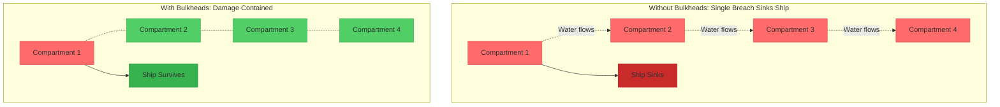
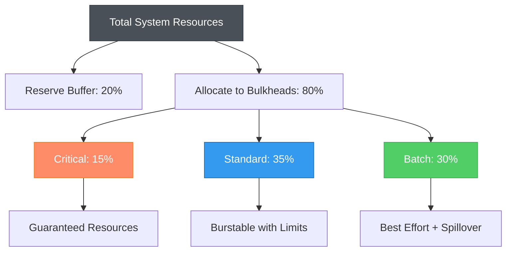
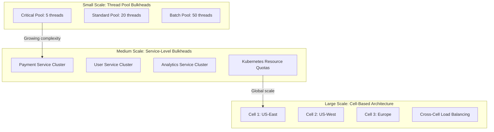

# Bulkhead Pattern

!!! success "🏆 Gold Standard Pattern"
    **Compartmentalize resources to prevent cascade failures** • Netflix, Amazon, Kubernetes proven at massive scale
    
    Inspired by ship design where watertight compartments prevent a single breach from sinking the entire vessel, this pattern isolates system resources to contain failures and protect critical operations.
    
    **Key Success Metrics:**
    - Netflix: Zero cascade failures across 1000+ microservices using Hystrix bulkheads
    - Amazon: 99.99% availability maintained through cell-based resource isolation  
    - Kubernetes: Millions of workloads isolated with namespace quotas and pod limits

## Essential Question

**How do we prevent failure in one part of the system from consuming all resources and causing total system collapse?**

## When to Use / When NOT to Use

### ✅ Use When

| Scenario | Example | Impact |
|----------|---------|--------|
| Mixed criticality services | Payment processing + analytics on same infrastructure | Protects revenue-critical operations |
| Multi-tenant architecture | SaaS platform with diverse customer workloads | Prevents tenant interference |
| Resource contention risk | Database connection pools shared across services | Isolates database access patterns |
| Unpredictable load patterns | Social media spikes affecting all features | Contains viral load to specific compartments |

### ❌ DON'T Use When

| Scenario | Why | Alternative |
|----------|-----|-------------|
| Single-purpose systems | Dedicated payment service with one function | Resource limits and monitoring |
| Development environments | Simple testing scenarios | Basic resource monitoring |
| Extremely low traffic | < 100 requests/hour applications | Standard connection pooling |
| Tight resource constraints | Systems where every resource matters | Careful resource management patterns |

## Level 1: Intuition (5 min) {#intuition}

### The Story
The Titanic disaster taught naval architects that ships need watertight compartments. When the ship hit the iceberg, water flooded multiple compartments, but if the breach had been contained to just 1-2 compartments, the ship would have survived. Modern systems face the same risk - a memory leak in one feature can crash the entire application, or a database query that runs wild can exhaust all connections for every service.

### Visual Metaphor


### Core Insight
> **Key Takeaway:** Resource isolation transforms system-wide failures into contained, recoverable incidents.

### In One Sentence
Bulkhead pattern isolates system resources into separate compartments so that failure or resource exhaustion in one area cannot bring down the entire system.

## Level 2: Foundation (10 min) {#foundation}

### The Problem Space

<div class="failure-vignette">
<h4>🚨 What Happens Without This Pattern</h4>

**Knight Capital, 2012**: A rogue trading algorithm consumed all available system resources, preventing normal trading operations. No resource isolation meant the faulty code brought down the entire trading platform.

**Impact**: $440M loss in 30 minutes, company bankruptcy, highlighting the need for resource compartmentalization
</div>

### How It Works

#### Architecture Overview
```mermaid
graph TB
    subgraph "Bulkhead Architecture"
        subgraph "Critical Operations Pool"
            CP1[Thread Pool: 50]
            CC1[Connection Pool: 20]
            CM1[Memory: 2GB]
        end
        
        subgraph "Standard Operations Pool" 
            SP1[Thread Pool: 100]
            SC1[Connection Pool: 50]
            SM1[Memory: 4GB]
        end
        
        subgraph "Batch/Analytics Pool"
            BP1[Thread Pool: 200]
            BC1[Connection Pool: 100] 
            BM1[Memory: 8GB]
        end
        
        LB[Load Balancer] --> CP1
        LB --> SP1  
        LB --> BP1
        
        CP1 --> DB[(Critical DB)]
        SC1 --> DB
        BC1 --> DB
    end
    
    classDef critical fill:#ff8c69,stroke:#fd7e14,color:#fff
    classDef standard fill:#339af0,stroke:#1971c2,color:#fff
    classDef batch fill:#51cf66,stroke:#37b24d,color:#fff
    
    class CP1,CC1,CM1 critical
    class SP1,SC1,SM1 standard  
    class BP1,BC1,BM1 batch
```

#### Key Components

| Component | Purpose | Responsibility |
|-----------|---------|----------------|
| Resource Pool | Isolate computational resources | Separate thread pools, memory allocation |
| Connection Pool | Isolate database access | Dedicated connections per service tier |
| Queue System | Isolate message processing | Separate queues for different priorities |
| Resource Monitor | Track utilization | Alert when bulkhead capacity approached |

### Basic Example

```java
// Java example with Spring Boot and Hystrix
@Component  
public class ServiceBulkheads {
    
    // Critical operations pool - small but guaranteed
    @HystrixCommand(
        threadPoolKey = "critical-pool",
        threadPoolProperties = {
            @HystrixProperty(name = "coreSize", value = "10"),
            @HystrixProperty(name = "maximumSize", value = "15"),
            @HystrixProperty(name = "maxQueueSize", value = "5")
        }
    )
    public PaymentResult processPayment(PaymentRequest request) {
        return paymentService.process(request);
    }
    
    // Analytics pool - larger capacity, non-critical
    @HystrixCommand(
        threadPoolKey = "analytics-pool", 
        threadPoolProperties = {
            @HystrixProperty(name = "coreSize", value = "50"),
            @HystrixProperty(name = "maximumSize", value = "100"),
            @HystrixProperty(name = "maxQueueSize", value = "200")
        }
    )
    public AnalyticsResult processAnalytics(AnalyticsRequest request) {
        return analyticsService.process(request);
    }
}
```

## Level 3: Deep Dive (15 min) {#deep-dive}

### Implementation Details

#### Resource Allocation Strategy


#### Critical Design Decisions

| Decision | Options | Trade-off | Recommendation |
|----------|---------|-----------|----------------|
| **Pool Sizing Strategy** | Fixed<br>Dynamic<br>Hybrid | Fixed: Predictable but wasteful<br>Dynamic: Efficient but complex<br>Hybrid: Balanced approach | **Hybrid with minimum guarantees** |
| **Spillover Policy** | Reject<br>Queue<br>Degrade | Reject: Fast fail<br>Queue: Delayed processing<br>Degrade: Reduced quality | **Queue for non-critical, reject for critical** |
| **Isolation Level** | Thread-only<br>Process-level<br>Container-based | Thread: Lightweight<br>Process: Strong isolation<br>Container: Cloud-native | **Container-based for microservices** |
| **Resource Monitoring** | Passive<br>Active<br>Predictive | Passive: React to issues<br>Active: Prevent issues<br>Predictive: AI-driven | **Active monitoring with alerts** |

### Common Pitfalls

<div class="decision-box">
<h4>⚠️ Avoid These Mistakes</h4>

1. **Undersized Critical Pools**: Makes critical operations slow and unreliable → Size based on peak load analysis
2. **No Spillover Strategy**: Hard failures when pool exhausted → Implement graceful degradation
3. **Static Pool Sizes**: Wastes resources during low traffic → Use dynamic sizing with minimum guarantees  
4. **Missing Monitoring**: Can't detect pool saturation until too late → Monitor utilization and queue depths
5. **Over-isolation**: Too many small pools creates overhead → Balance isolation granularity with efficiency
</div>

### Production Considerations

#### Resource Allocation by Service Tier

| Service Tier | Thread Pool Size | Connection Pool | Memory Limit | Timeout | Spillover Strategy |
|-------------|------------------|-----------------|-------------|---------|-------------------|
| **Critical** | 5-20 (small, guaranteed) | 5-15 dedicated | 1-2GB fixed | 1-5s | Reject immediately |
| **Standard** | 50-100 (moderate) | 20-50 shared | 2-4GB burstable | 10-30s | Queue up to 2x pool |
| **Batch** | 100-500 (large) | 50-200 shared | 4-16GB elastic | 60-300s | Queue unlimited |
| **Background** | 20-50 (low priority) | 10-30 shared | 1-8GB elastic | No limit | Best effort only |

#### Kubernetes Resource Quotas Example
```yaml
apiVersion: v1
kind: ResourceQuota
metadata:
  name: critical-services-quota
  namespace: critical
spec:
  hard:
    requests.cpu: "10"    # Guaranteed CPU
    requests.memory: 20Gi # Guaranteed memory
    limits.cpu: "20"      # Max CPU burst
    limits.memory: 40Gi   # Max memory burst
    persistentvolumeclaims: "4"
    services: "5"
    
---
apiVersion: v1 
kind: ResourceQuota
metadata:
  name: standard-services-quota
  namespace: standard
spec:
  hard:
    requests.cpu: "50"
    requests.memory: 100Gi
    limits.cpu: "100" 
    limits.memory: 200Gi
```

## Level 4: Expert (20 min) {#expert}

### Advanced Techniques

#### 1. Adaptive Bulkhead Sizing
```python
class AdaptiveBulkhead:
    def __init__(self, min_size: int, max_size: int):
        self.min_size = min_size
        self.max_size = max_size
        self.current_size = min_size
        self.utilization_history = []
        
    def adjust_size(self):
        avg_utilization = sum(self.utilization_history[-10:]) / 10
        
        if avg_utilization > 0.8 and self.current_size < self.max_size:
            self.current_size = min(self.current_size + 5, self.max_size)
            self.log_resize("increased", avg_utilization)
        elif avg_utilization < 0.3 and self.current_size > self.min_size:
            self.current_size = max(self.current_size - 5, self.min_size)  
            self.log_resize("decreased", avg_utilization)
            
    def get_pool_size(self) -> int:
        return self.current_size
```

#### 2. Multi-dimensional Resource Isolation
```python
@dataclass
class ResourceLimits:
    cpu_cores: float
    memory_gb: float  
    network_mbps: int
    disk_iops: int
    connections: int
    
class MultiDimensionalBulkhead:
    def __init__(self, name: str, limits: ResourceLimits):
        self.name = name
        self.limits = limits
        self.current_usage = ResourceUsage()
        
    def can_accept_request(self, required: ResourceLimits) -> bool:
        return (
            self.current_usage.cpu + required.cpu <= self.limits.cpu and
            self.current_usage.memory + required.memory <= self.limits.memory and
            self.current_usage.connections + 1 <= self.limits.connections
        )
```

#### 3. Circuit Breaker Integration
```python
class BulkheadWithCircuitBreaker:
    def __init__(self, pool_size: int, circuit_breaker_threshold: float = 0.9):
        self.semaphore = asyncio.Semaphore(pool_size)
        self.pool_size = pool_size
        self.circuit_breaker = CircuitBreaker()
        self.threshold = circuit_breaker_threshold
        
    async def execute(self, operation: Callable) -> Any:
        # Check if bulkhead is near capacity
        current_usage = (self.pool_size - self.semaphore._value) / self.pool_size
        
        if current_usage > self.threshold:
            self.circuit_breaker.record_failure() 
            raise BulkheadCapacityExceeded()
            
        if self.circuit_breaker.is_open():
            raise CircuitBreakerOpenError()
            
        async with self.semaphore:
            try:
                result = await operation()
                self.circuit_breaker.record_success()
                return result
            except Exception as e:
                self.circuit_breaker.record_failure()
                raise
```

### Scaling Considerations



### Monitoring & Observability

#### Key Metrics to Track

| Metric | Alert Threshold | Dashboard Panel | Purpose |
|--------|----------------|-----------------|---------|
| **Pool Utilization** | >85% sustained | Real-time gauges per pool | Capacity planning |
| **Queue Depth** | >2x pool size | Time series with pool breakdown | Spillover detection |  
| **Rejection Rate** | >5% of requests | Error rate by bulkhead | Undersizing detection |
| **Cross-Pool Impact** | >0 failures in isolated pools | Correlation heatmap | Isolation validation |

#### Advanced Monitoring Dashboard
```python
class BulkheadMetrics:
    def __init__(self, metrics_client, pool_name: str):
        self.metrics = metrics_client
        self.pool_name = pool_name
        
    def record_pool_utilization(self, active_threads: int, total_threads: int):
        utilization = active_threads / total_threads
        self.metrics.gauge(
            'bulkhead.pool.utilization',
            utilization,
            tags={'pool': self.pool_name}
        )
        
    def record_request_rejection(self, reason: str):
        self.metrics.increment(
            'bulkhead.request.rejected',
            tags={'pool': self.pool_name, 'reason': reason}
        )
        
    def record_spillover_event(self, from_pool: str, to_pool: str):
        self.metrics.increment(
            'bulkhead.spillover',
            tags={'from': from_pool, 'to': to_pool}
        )
```

## Level 5: Mastery (30 min) {#mastery}

### Real-World Case Studies

#### Case Study 1: Netflix Hystrix at Scale

<div class="truth-box">
<h4>💡 Production Insights from Netflix</h4>

**Challenge**: Isolate failures across 1000+ microservices handling billions of requests daily

**Implementation**:
- Thread pool per external dependency
- Separate pools for critical vs non-critical operations  
- Dynamic pool sizing based on traffic patterns
- Integration with circuit breakers and metrics

**Results**:
- **Zero cascade failures**: During major external service outages
- **99.99% availability**: Maintained for critical user flows
- **50% faster recovery**: Isolated failures don't impact healthy services
- **80% reduction**: In cross-service failure correlation

**Lessons Learned**: Bulkheads must be combined with circuit breakers - isolation alone isn't sufficient
</div>

#### Case Study 2: Amazon Cell Architecture

<div class="truth-box">
<h4>💡 Production Insights from Amazon</h4>

**Challenge**: Prevent failures in one availability zone from affecting global service

**Implementation**:
- Cell-based service architecture with resource isolation
- Independent resource pools per cell
- Cross-cell load balancing with failure detection
- Automated cell evacuation during failures

**Results**:
- **99.99% availability**: Maintained during major AZ outages  
- **<1% impact**: When entire cells fail due to isolation
- **90% faster incident response**: Clear failure boundaries
- **10x reduction**: In blast radius of infrastructure failures

**Lessons Learned**: Physical isolation (cells) more effective than logical isolation (threads) at scale
</div>

### Pattern Evolution

#### Migration Strategy


#### Future Directions

| Trend | Impact on Pattern | Adaptation Strategy |
|-------|------------------|-------------------|
| **Serverless Computing** | Function-level isolation built-in | Focus on cold start bulkheads |
| **Service Mesh** | Infrastructure-level resource control | Integrate with Envoy proxy limits |
| **ML-based Autoscaling** | Intelligent pool sizing | Predictive bulkhead adjustment |
| **WebAssembly** | Lightweight isolation boundaries | WASM sandboxes as micro-bulkheads |

### Pattern Combinations

#### Works Well With

| Pattern | Combination Benefit | Integration Point |
|---------|-------------------|------------------|
| **Circuit Breaker** | Prevents wasted resources on known failures | Open circuit when bulkhead saturated |
| **Rate Limiting** | Controls input to bulkheads | Rate limit before pool assignment |
| **Load Balancing** | Distributes load across isolated pools | Route to healthy bulkheads only |
| **Health Check** | Validates bulkhead health | Include pool utilization in health |
| **Auto-scaling** | Adjusts pool capacity dynamically | Scale pools based on utilization |

#### Enterprise Architecture Example
```python
class EnterpriseResilienceStack:
    def __init__(self):
        self.bulkheads = {
            'critical': BulkheadWithCircuitBreaker(pool_size=10),
            'standard': BulkheadWithCircuitBreaker(pool_size=50), 
            'batch': BulkheadWithCircuitBreaker(pool_size=100)
        }
        self.rate_limiter = TieredRateLimiter()
        self.load_balancer = HealthAwareLoadBalancer()
        
    async def handle_request(self, request: Request) -> Response:
        # Rate limit before bulkhead
        if not self.rate_limiter.allow(request.tier):
            raise RateLimitExceeded()
            
        # Route to appropriate bulkhead
        bulkhead = self.bulkheads[request.tier]
        
        # Execute with full protection
        return await bulkhead.execute(
            lambda: self.load_balancer.route_request(request)
        )
```

## Quick Reference

### Decision Matrix

```mermaid
graph TD
    A[Need Resource Isolation?] --> B{System Complexity}
    B -->|Single Service| C[Thread Pool Bulkheads]
    B -->|Multiple Services| D[Service-Level Isolation] 
    B -->|Distributed System| E[Cell-Based Architecture]
    
    C --> F[Hystrix/Spring Cloud]
    D --> G[Kubernetes Quotas]
    E --> H[Multi-Region Cells]
    
    classDef simple fill:#81c784,stroke:#388e3c,stroke-width:2px
    classDef moderate fill:#339af0,stroke:#1971c2,stroke-width:2px
    classDef complex fill:#5448c8,stroke:#3f33a6,stroke-width:2px
    
    class F simple
    class G moderate  
    class H complex
```

### Comparison with Alternatives

| Aspect | Bulkhead | Circuit Breaker | Rate Limiting | Load Balancing |
|--------|----------|----------------|---------------|----------------|
| **Resource Protection** | Excellent | Good | Moderate | Poor |
| **Failure Isolation** | Excellent | Excellent | Poor | Moderate |
| **Performance Impact** | Medium | Low | Low | Low |
| **Implementation Complexity** | High | Medium | Low | Medium |
| **Operational Overhead** | High | Medium | Low | Medium |
| **When to use** | Mixed workloads | External dependencies | Rate protection | Load distribution |

### Implementation Checklist

**Pre-Implementation**
- [ ] Analyzed resource usage patterns and identified critical vs non-critical operations
- [ ] Calculated appropriate pool sizes based on expected load and SLA requirements
- [ ] Planned monitoring strategy for pool utilization and queue depths
- [ ] Designed spillover and degradation strategies for capacity exceeded scenarios

**Implementation**  
- [ ] Created separate resource pools for different service tiers
- [ ] Implemented proper pool sizing with minimum guarantees and maximum limits
- [ ] Added comprehensive monitoring and alerting for pool health
- [ ] Integrated with circuit breakers and rate limiting for layered protection

**Post-Implementation**
- [ ] Validated isolation effectiveness through failure testing 
- [ ] Tuned pool sizes based on actual traffic patterns
- [ ] Established capacity planning processes for pool maintenance
- [ ] Documented bulkhead strategy and runbooks for operations team

### Related Resources

<div class="grid cards" markdown>

- :material-book-open-variant:{ .lg .middle } **Related Patterns**
    
    ---
    
    - [Circuit Breaker](./circuit-breaker.md) - Stop calling failed dependencies
    - [Rate Limiting](../scaling/rate-limiting.md) - Control input to bulkheads  
    - [Health Check](./health-check.md) - Monitor bulkhead health
    - [Auto-scaling](../scaling/auto-scaling.md) - Dynamic pool capacity

- :material-flask:{ .lg .middle } **Fundamental Laws**
    
    ---
    
    - [Correlated Failure Law](../laws/correlated-failure.md) - Isolation prevents correlation
    - [Emergent Chaos Law](../laws/emergent-chaos.md) - Contains emergent failures
    - [Economic Reality Law](../laws/economic-reality.md) - Resource allocation trade-offs

- :material-pillar:{ .lg .middle } **Foundational Pillars**
    
    ---
    
    - [Work Pillar](../pillars/work.md) - Isolating different types of work
    - [Control Pillar](../pillars/control.md) - Controlling resource allocation
    - [State Pillar](../pillars/state.md) - Managing isolated state domains

- :material-tools:{ .lg .middle } **Implementation Guides**
    
    ---
    
    - Kubernetes Resource Quotas Guide
    - Hystrix Thread Pool Configuration
    - Cell Architecture Design Patterns

</div>