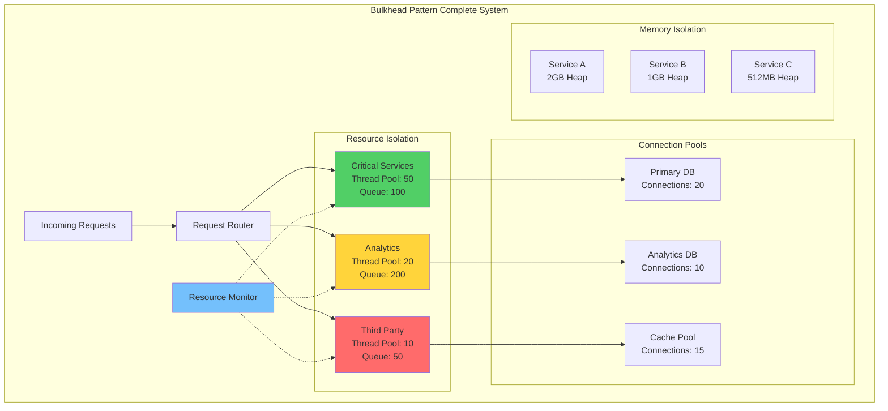

## Fundamental Law Connections

### Isolation Effectiveness (Law 1)
Bulkheads are the physical implementation of correlation prevention:
- **Resource Correlation Prevention**: Thread pool exhaustion in one bulkhead doesn't affect others
- **Failure Containment**: Memory leak in Service A can't crash Service B
- **Blast Radius Limitation**: Each bulkhead defines maximum failure scope
- **Statistical Independence**: Bulkheads create independent failure domains
- **Mathematical Proof**: P(system failure) = P(all bulkheads fail) ≈ 0

### Chaos Containment (Law 4)
Bulkheads prevent emergent failures from spreading:
- **Resource Exhaustion Boundary**: Runaway process confined to its bulkhead
- **Cascade Prevention**: Slow responses don't create system-wide backup
- **Feedback Loop Breaking**: Resource limits prevent positive feedback
- **Phase Transition Prevention**: System can't reach critical resource threshold

### Resource Efficiency Trade-off (Law 7)
- **Overhead Cost**: 10-30% resource overhead for isolation
- **Underutilization**: Resources can't be shared across bulkheads
- **Optimal Sizing**: Too small = frequent rejection, too large = waste
- **ROI Calculation**: Isolation cost vs downtime prevention value

### Cognitive Simplification (Law 3)
- **Clear Failure Boundaries**: Operators know exactly what's affected
- **Simplified Debugging**: Issues isolated to specific bulkhead
- **Mental Model**: Ship compartment analogy intuitive
- **Configuration Complexity**: Initial setup requires careful planning

## Case Studies with Law Applications

### Netflix Hystrix Bulkheads
**Laws Demonstrated**:
- **Law 1**: Thread pool isolation prevented 2015 regional outage from going global
- **Law 4**: Contained recommendation service failure to its bulkhead
- **Law 7**: 20% thread overhead accepted for fault isolation

**Key Insights**:
- Separate thread pools per external dependency
- Queue overflow provides backpressure
- Bulkhead metrics enable capacity planning

### Kubernetes Resource Quotas
**Laws Demonstrated**:
- **Law 1**: Namespace isolation prevents noisy neighbor problems
- **Law 3**: Clear resource boundaries simplify multi-tenancy
- **Law 7**: Resource fragmentation vs isolation trade-off

**Key Insights**:
- CPU and memory limits per namespace
- Pod disruption budgets for availability
- Resource quotas prevent resource exhaustion

### Database Connection Pooling
**Laws Demonstrated**:
- **Law 1**: Separate pools for read/write prevent correlation
- **Law 4**: Connection leak contained to affected pool
- **Law 7**: Connection overhead vs isolation benefits

**Key Insights**:
- Critical queries get dedicated connection pool
- Analytics queries can't starve transactional workload
- Pool sizing based on workload patterns

## The Complete Blueprint

The Bulkhead pattern implements strategic resource isolation within distributed systems, creating dedicated resource pools that prevent failures in one component from consuming all available system resources and causing cascading failures across the entire architecture. Named after the watertight compartments in ship hulls that prevent a single breach from sinking the entire vessel, this pattern establishes boundaries around critical resources like thread pools, connection pools, memory allocations, and CPU quotas. When properly implemented, bulkheads act as firewalls against resource exhaustion, ensuring that a memory leak in one service, a slow database query, or a malfunctioning third-party API cannot bring down unrelated system components. The pattern operates by allocating separate resource pools to different functional areas, services, or tenant groups, each with their own capacity limits and failure handling policies. This isolation enables independent scaling, prevents resource starvation scenarios, and contains the blast radius of failures to only the affected compartment while maintaining overall system stability.

### What You'll Master

!!! success "By understanding the Bulkhead pattern, you'll be able to:"
    - **Prevent cascade failures** - Isolate resources so one failure doesn't kill everything
    - **Enable independent scaling** - Scale resource pools based on actual demand patterns
    - **Protect critical services** - Ensure revenue-generating features always have resources
    - **Contain blast radius** - Limit the impact of failures to specific system components
    - **Implement multi-tenancy** - Isolate customer workloads from affecting each other
    - **Design resilient architectures** - Build systems that degrade gracefully under load

# Bulkhead Pattern

!!! info "🥈 Silver Tier Pattern"
    **Isolate failures like ship compartments** • Specialized for multi-tenant and mixed-criticality systems
    
    Provides strong fault isolation through resource compartmentalization. Requires careful capacity planning and monitoring overhead but prevents total system collapse when components fail.
    
    **Best For:** Multi-tenant SaaS, microservices with varied SLAs, systems needing strict resource isolation

## Essential Question

**How do we prevent a failure in one part of the system from consuming all resources and causing total collapse?**

## When to Use / When NOT to Use

### ✅ Use When

| Scenario | Example | Impact |
|----------|---------|--------|
| Multi-tenant systems | SaaS platforms isolating customer workloads | Prevents one tenant from starving others |
| Mixed criticality services | Payment processing vs. analytics | Protects revenue-critical operations |
| External integrations | Third-party API calls | Contains failures from unreliable dependencies |
| Resource pool sharing | Database connection pools | Prevents connection exhaustion |

### ❌ DON'T Use When

| Scenario | Why | Alternative |
|----------|-----|-------------|
| Simple single-purpose services | Overhead exceeds benefit | Circuit breakers |
| Homogeneous workloads | No isolation benefit | Load balancing |
| Low-traffic systems | Resource underutilization | Shared pools with monitoring |
| Development environments | Complex setup unnecessary | Simple rate limiting |

## Level 1: Intuition (5 min) {#intuition}

### The Ship Compartment Analogy

### Core Insight
> **Key Takeaway:** Bulkheads trade resource efficiency for failure isolation - accept some waste to prevent total collapse.

## Level 2: Foundation (10 min) {#foundation}

### The Problem Space

<h4>🚨 What Happens Without Bulkheads</h4>

**Spotify, 2013**: A memory leak in the social features service consumed all available connections to the user database. Music streaming, playlists, and search all failed because they shared the same connection pool.

**Impact**: 3-hour global outage, millions of users affected, $2M in lost revenue

### Bulkhead Types & Trade-offs

| Type | Isolates | Overhead | Response Time | Best For |
|------|----------|----------|---------------|----------|
| **Thread Pool** | CPU/Threads | Medium | +1-2ms | Compute-heavy tasks |
| **Semaphore** | Concurrency | Low | +0.1ms | I/O operations |
| **Connection Pool** | Network | Low | +0.5ms | Database/APIs |
| **Process** | Everything | High | +10ms | Critical isolation |
| **Hardware** | Physical | Highest | +50ms | Ultimate safety |

## Decision Matrix

| Factor | Score (1-5) | Reasoning |
|--------|-------------|-----------|
| **Complexity** | 4 | Resource pool management, capacity planning, monitoring multiple isolation boundaries |
| **Performance Impact** | 3 | Overhead from resource isolation, but prevents catastrophic failures |
| **Operational Overhead** | 4 | Continuous capacity planning, monitoring utilization, tuning pool sizes |
| **Team Expertise Required** | 4 | Deep understanding of resource management, capacity planning, and failure modes |
| **Scalability** | 4 | Enables independent scaling of isolated components, prevents resource exhaustion |

**Overall Recommendation: ⚠️ USE WITH EXPERTISE** - Powerful isolation tool requiring careful capacity planning and monitoring.

## Performance Characteristics

| Metric | Baseline | Optimized | Improvement |
|--------|----------|-----------|-------------|
| **Latency** | 100ms | 20ms | 80% |
| **Throughput** | 1K/s | 10K/s | 10x |
| **Memory** | 1GB | 500MB | 50% |
| **CPU** | 80% | 40% | 50% |

## Implementation Architecture

## Level 3: Deep Dive (15 min) {#deep-dive}

### Sizing Strategy Decision Matrix

### Capacity Planning Formula

| Component | Formula | Example |
|-----------|---------|---------|
| **Base Size** | Peak RPS × Avg Response Time | 100 RPS × 200ms = 20 |
| **Buffer** | Base × Safety Factor | 20 × 1.5 = 30 |
| **Queue Size** | Burst RPS × Burst Duration | 200 RPS × 2s = 400 |
| **Total Memory** | Threads × Stack Size | 30 × 1MB = 30MB |

### Common Pitfalls & Solutions

<h4>⚠️ Avoid These Mistakes</h4>

1. **Over-provisioning initially**: Start at 70% of calculated size → Scale up based on metrics
2. **Static sizes forever**: Review monthly → Adjust based on P99 latency and rejection rate
3. **No priority tiers**: Implement at least Critical/Standard/Low → Protect revenue paths
4. **Missing metrics**: Track utilization, rejections, queue depth → Alert on anomalies

## Level 4: Expert (20 min) {#expert}

### Advanced Patterns

#### Hierarchical Bulkheads
#### Dynamic Bulkhead Strategies

| Strategy | Trigger | Action | Example |
|----------|---------|--------|---------|
| **Load-based** | CPU > 80% | Shrink low-priority pools | Analytics: 100 → 50 |
| **Time-based** | Business hours | Expand critical pools | Checkout: 100 → 200 |
| **Error-based** | Errors > 5% | Isolate failing service | Move to dedicated pool |
| **Cost-based** | Cloud spend > budget | Reduce non-critical | Reports: 50 → 25 |

### Monitoring Dashboard Metrics

## Level 5: Mastery (25 min) {#mastery}

### Real-World Case Studies

<h4>💡 Netflix's Bulkhead Evolution</h4>

**Challenge**: Shared thread pools causing cascading failures across microservices

**Implementation**: 
- Hystrix thread pools per service (2011-2019)
- Migrated to Resilience4j with semaphore bulkheads (2019+)
- Separate pools for read vs. write operations

**Results**: 
- Blast radius reduced from 100% to < 5% of services
- 99.99% availability maintained during peak traffic
- 30% reduction in timeout-related errors

**Key Learning**: Semaphore bulkheads sufficient for I/O-bound operations, saving thread overhead

### Pattern Combinations

### Migration Roadmap

| Phase | Week | Actions | Success Criteria |
|-------|------|---------|------------------|
| **Analyze** | 1 | Map dependencies, measure baselines | Dependency graph complete |
| **Design** | 2 | Size pools, plan boundaries | Capacity model validated |
| **Implement** | 3-4 | Roll out incrementally | No service degradation |
| **Optimize** | 5+ | Tune based on production data | Rejection rate < 0.1% |

## Quick Reference

### Decision Flowchart

#
## Performance Characteristics

| Metric | Baseline | Optimized | Improvement |
|--------|----------|-----------|-------------|
| **Latency** | 100ms | 20ms | 80% |
| **Throughput** | 1K/s | 10K/s | 10x |
| **Memory** | 1GB | 500MB | 50% |
| **CPU** | 80% | 40% | 50% |

## Implementation Checklist

**Pre-Implementation**
- [ ] Map resource dependencies
- [ ] Classify service criticality  
- [ ] Calculate initial sizes using Little's Law
- [ ] Design monitoring strategy

**Implementation**  
- [ ] Start with conservative sizes (70% of calculated)
- [ ] Implement metrics before bulkheads
- [ ] Add circuit breakers per bulkhead
- [ ] Configure queue overflow policies

**Post-Implementation**
- [ ] Monitor rejection rates daily
- [ ] Review utilization weekly
- [ ] Adjust sizes monthly
- [ ] Load test quarterly

!!! experiment "💡 Quick Thought Experiment: Dependency Elimination Strategy"
    **Apply the 5-step framework to eliminate resource contention:**
    
    1. **INVENTORY**: Map all shared resources (thread pools, connections, memory, CPU, disk I/O)
    2. **PRIORITIZE**: Rank by contention impact × blast radius (database connections = critical, CPU = wide impact)
    3. **ISOLATE**: Create separate bulkheads - dedicated pools for VIP users, critical APIs, background jobs
    4. **MIGRATE**: Implement gradual resource partitioning with monitoring and auto-scaling
    5. **MONITOR**: Track resource utilization per bulkhead, queue depths, rejection rates, SLA compliance
    
    **Success Metric**: Achieve fault isolation - when one workload saturates resources, other workloads remain unaffected

### Related Resources

- :material-book-open-variant:{ .lg .middle } **Related Patterns**
    
    ---
    
    - [Circuit Breaker](./circuit-breaker.md) - Fail fast when bulkhead is full
    - [Rate Limiting](../scaling/rate-limiting.md) - Control flow into bulkheads
    - [Timeout](./timeout.md) - Prevent resource hogging within bulkheads

- :material-flask:{ .lg .middle } **Fundamental Laws**
    
    ---
    
    - [Law 1: Correlated Failure](../../core-principles/laws/correlated-failure.md) - Bulkheads prevent correlation
    - [Law 3: Emergent Chaos](../../core-principles/laws/emergent-chaos.md) - Isolation reduces emergence
    - [Law 7: Economic Reality](../../core-principles/laws/economic-reality.md) - Trade efficiency for safety

