# Bulkhead Pattern

!!! info "🥈 Silver Tier Pattern"
    **Isolate failures like ship compartments** • Specialized for multi-tenant and mixed-criticality systems
    
    Provides strong fault isolation through resource compartmentalization. Requires careful capacity planning and monitoring overhead but prevents total system collapse when components fail.
    
    **Best For:** Multi-tenant SaaS, microservices with varied SLAs, systems needing strict resource isolation

## Essential Question

**How do we prevent a failure in one part of the system from consuming all resources and causing total collapse?**

## When to Use / When NOT to Use

### ✅ Use When

| Scenario | Example | Impact |
|----------|---------|--------|
| Multi-tenant systems | SaaS platforms isolating customer workloads | Prevents one tenant from starving others |
| Mixed criticality services | Payment processing vs. analytics | Protects revenue-critical operations |
| External integrations | Third-party API calls | Contains failures from unreliable dependencies |
| Resource pool sharing | Database connection pools | Prevents connection exhaustion |

### ❌ DON'T Use When

| Scenario | Why | Alternative |
|----------|-----|-------------|
| Simple single-purpose services | Overhead exceeds benefit | Circuit breakers |
| Homogeneous workloads | No isolation benefit | Load balancing |
| Low-traffic systems | Resource underutilization | Shared pools with monitoring |
| Development environments | Complex setup unnecessary | Simple rate limiting |

## Level 1: Intuition (5 min) {#intuition}

### The Ship Compartment Analogy


### Core Insight
> **Key Takeaway:** Bulkheads trade resource efficiency for failure isolation - accept some waste to prevent total collapse.

## Level 2: Foundation (10 min) {#foundation}

### The Problem Space

<div class="failure-vignette">
<h4>🚨 What Happens Without Bulkheads</h4>

**Spotify, 2013**: A memory leak in the social features service consumed all available connections to the user database. Music streaming, playlists, and search all failed because they shared the same connection pool.

**Impact**: 3-hour global outage, millions of users affected, $2M in lost revenue
</div>

### Bulkhead Types & Trade-offs

| Type | Isolates | Overhead | Response Time | Best For |
|------|----------|----------|---------------|----------|
| **Thread Pool** | CPU/Threads | Medium | +1-2ms | Compute-heavy tasks |
| **Semaphore** | Concurrency | Low | +0.1ms | I/O operations |
| **Connection Pool** | Network | Low | +0.5ms | Database/APIs |
| **Process** | Everything | High | +10ms | Critical isolation |
| **Hardware** | Physical | Highest | +50ms | Ultimate safety |

### Implementation Architecture


## Level 3: Deep Dive (15 min) {#deep-dive}

### Sizing Strategy Decision Matrix

```mermaid
graph TD
    A[Determine Pool Size] --> B{Service Type?}
    B -->|Critical| C[Base × 2.0]
    B -->|Standard| D[Base × 1.5]
    B -->|Low Priority| E[Base × 1.2]
    
    C --> F{Load Pattern?}
    D --> F
    E --> F
    
    F -->|Steady| G[Fixed Size]
    F -->|Spiky| H[Elastic 50-200%]
    F -->|Unpredictable| I[Conservative + Queue]
    
    style C fill:#ff6b6b
    style D fill:#4dabf7
    style E fill:#69db7c
```



### Capacity Planning Formula

| Component | Formula | Example |
|-----------|---------|---------|
| **Base Size** | Peak RPS × Avg Response Time | 100 RPS × 200ms = 20 |
| **Buffer** | Base × Safety Factor | 20 × 1.5 = 30 |
| **Queue Size** | Burst RPS × Burst Duration | 200 RPS × 2s = 400 |
| **Total Memory** | Threads × Stack Size | 30 × 1MB = 30MB |

### Common Pitfalls & Solutions

<div class="decision-box">
<h4>⚠️ Avoid These Mistakes</h4>

1. **Over-provisioning initially**: Start at 70% of calculated size → Scale up based on metrics
2. **Static sizes forever**: Review monthly → Adjust based on P99 latency and rejection rate
3. **No priority tiers**: Implement at least Critical/Standard/Low → Protect revenue paths
4. **Missing metrics**: Track utilization, rejections, queue depth → Alert on anomalies
</div>

## Level 4: Expert (20 min) {#expert}

### Advanced Patterns

#### Hierarchical Bulkheads
```yaml
bulkhead_hierarchy:
  global_pool: 1000  # Total system capacity
  
  tier_1_critical: 500
    payment: 200
    authentication: 200  
    orders: 100
    
  tier_2_standard: 300
    search: 150
    recommendations: 150
    
  tier_3_low: 200
    analytics: 100
    reporting: 100
```

#### Dynamic Bulkhead Strategies

| Strategy | Trigger | Action | Example |
|----------|---------|--------|---------|
| **Load-based** | CPU > 80% | Shrink low-priority pools | Analytics: 100 → 50 |
| **Time-based** | Business hours | Expand critical pools | Checkout: 100 → 200 |
| **Error-based** | Errors > 5% | Isolate failing service | Move to dedicated pool |
| **Cost-based** | Cloud spend > budget | Reduce non-critical | Reports: 50 → 25 |

### Monitoring Dashboard Metrics


## Level 5: Mastery (25 min) {#mastery}

### Real-World Case Studies

<div class="truth-box">
<h4>💡 Netflix's Bulkhead Evolution</h4>

**Challenge**: Shared thread pools causing cascading failures across microservices

**Implementation**: 
- Hystrix thread pools per service (2011-2019)
- Migrated to Resilience4j with semaphore bulkheads (2019+)
- Separate pools for read vs. write operations

**Results**: 
- Blast radius reduced from 100% to < 5% of services
- 99.99% availability maintained during peak traffic
- 30% reduction in timeout-related errors

**Key Learning**: Semaphore bulkheads sufficient for I/O-bound operations, saving thread overhead
</div>

### Pattern Combinations


### Migration Roadmap

| Phase | Week | Actions | Success Criteria |
|-------|------|---------|------------------|
| **Analyze** | 1 | Map dependencies, measure baselines | Dependency graph complete |
| **Design** | 2 | Size pools, plan boundaries | Capacity model validated |
| **Implement** | 3-4 | Roll out incrementally | No service degradation |
| **Optimize** | 5+ | Tune based on production data | Rejection rate < 0.1% |

## Quick Reference

### Decision Flowchart


### Implementation Checklist

**Pre-Implementation**
- [ ] Map resource dependencies
- [ ] Classify service criticality  
- [ ] Calculate initial sizes using Little's Law
- [ ] Design monitoring strategy

**Implementation**  
- [ ] Start with conservative sizes (70% of calculated)
- [ ] Implement metrics before bulkheads
- [ ] Add circuit breakers per bulkhead
- [ ] Configure queue overflow policies

**Post-Implementation**
- [ ] Monitor rejection rates daily
- [ ] Review utilization weekly
- [ ] Adjust sizes monthly
- [ ] Load test quarterly

### Related Resources

<div class="grid cards" markdown>

- :material-book-open-variant:{ .lg .middle } **Related Patterns**
    
    ---
    
    - [Circuit Breaker](./circuit-breaker.md) - Fail fast when bulkhead is full
    - [Rate Limiting](../scaling/rate-limiting.md) - Control flow into bulkheads
    - [Timeout](./timeout.md) - Prevent resource hogging within bulkheads

- :material-flask:{ .lg .middle } **Fundamental Laws**
    
    ---
    
    - [Law 1: Correlated Failure](../../part1-axioms/law1-failure/) - Bulkheads prevent correlation
    - [Law 3: Emergent Chaos](../../part1-axioms/law3-emergence/) - Isolation reduces emergence
    - [Law 7: Economic Reality](../../part1-axioms/law7-economics/) - Trade efficiency for safety

</div>