# Bulkhead Pattern

!!! warning "🥈 Silver Tier Pattern"
    **Excellent isolation with operational overhead** • Use when failure isolation is critical
    
    Bulkheads provide strong fault isolation but require careful capacity planning and monitoring. Each bulkhead needs individual tuning and management. Consider simpler patterns like circuit breakers first unless you specifically need resource pool isolation.

## Essential Question
**How do we prevent a failure in one part of the system from consuming all resources and causing total collapse?**

## When to Use / When NOT to Use

### Use When
| Scenario | Example | Benefit |
|----------|---------|---------|
| Multi-tenant systems | SaaS platforms | Tenant isolation |
| Mixed criticality | Payment vs analytics | Priority protection |
| Resource pools | Database connections | Prevent exhaustion |
| Microservices | Service mesh | Fault containment |
| Third-party integrations | External APIs | Limit blast radius |

### DON'T Use When
| Scenario | Why | Alternative |
|----------|-----|-------------|
| Simple applications | Overhead not justified | Circuit breakers |
| Single resource type | No isolation benefit | Rate limiting |
| Low traffic | Underutilization | Shared pools |
| Homogeneous workload | Same priority | Load balancing |
| Development environment | Complex setup | Simple pooling |

## Level 1: Intuition (5 min)

### The Ship Compartment Analogy
<div class="axiom-box">
Ships have watertight compartments (bulkheads). If the hull is breached, only one compartment floods - the ship stays afloat. Software bulkheads work the same way: isolate resources so one failure doesn't sink everything.
</div>

### Visual Comparison

```mermaid
graph TD
    subgraph "Without Bulkheads"
        A[Shared Pool<br/>100 threads] --> B[Service A floods pool]
        B --> C[Services B,C,D starve]
        C --> D[💥 Total System Failure]
    end
    
    subgraph "With Bulkheads"
        E[Service A<br/>25 threads] --> F[A fails alone]
        G[Service B<br/>25 threads] --> H[B continues]
        I[Service C<br/>25 threads] --> J[C continues]
        K[Service D<br/>25 threads] --> L[D continues]
        F --> M[✅ Partial Degradation Only]
    end
    
    style D fill:#f99
    style M fill:#9f9
```


### Core Value
**Without Bulkheads**: One bad actor → Resource exhaustion → Total failure  
**With Bulkheads**: One bad actor → Isolated failure → System survives

## Level 2: Foundation (10 min)

### Bulkhead Types & Strategies

| Type | Isolates | Overhead | Best For | Example |
|------|----------|----------|----------|---------|
| **Thread Pool** | CPU/Threads | Medium | Compute tasks | Tomcat executors |
| **Semaphore** | Concurrency | Low | I/O operations | Hystrix semaphores |
| **Connection Pool** | Network | Low | Database/APIs | HikariCP pools |
| **Process** | Everything | High | Critical isolation | Docker containers |
| **Hardware** | Physical | Highest | Ultimate isolation | Separate servers |

### Resource Allocation Decision Tree


### Implementation Patterns

#### 1. Thread Pool Isolation
```yaml
bulkheads:
  payment_service:
    core_threads: 20
    max_threads: 50
    queue_size: 100
    rejection_policy: caller_runs
    
  search_service:
    core_threads: 10
    max_threads: 30
    queue_size: 500
    rejection_policy: discard
    
  analytics_service:
    core_threads: 5
    max_threads: 10
    queue_size: 1000
    rejection_policy: discard_oldest
```

#### 2. Connection Pool Isolation
| Service | Min Connections | Max Connections | Timeout | Priority |
|---------|----------------|-----------------|---------|----------|
| Payment DB | 10 | 50 | 5s | Critical |
| User DB | 5 | 30 | 10s | High |
| Analytics DB | 2 | 10 | 30s | Low |
| Cache | 20 | 100 | 1s | Critical |

## Level 3: Deep Dive (15 min)

### Bulkhead Sizing Strategies

#### 1. Little's Law Approach
```
Pool Size = Arrival Rate × Service Time

Example:
- 100 requests/second
- 200ms average processing
- Pool Size = 100 × 0.2 = 20 threads
- Add 50% buffer = 30 threads
```

#### 2. Criticality-Based Allocation


#### 3. Dynamic Bulkhead Adjustment

```mermaid
graph TD
    A[Monitor Metrics] --> B{Utilization?}
    B -->|< 50%| C[Reduce by 10%]
    B -->|50-80%| D[No change]
    B -->|> 80%| E{Rejection Rate?}
    E -->|< 1%| F[Increase by 10%]
    E -->|> 1%| G[Investigate root cause]
    
    C --> H[Min: Initial / 2]
    F --> I[Max: Initial × 2]
```


### Common Pitfalls & Solutions

| Pitfall | Impact | Solution |
|---------|--------|----------|
| Over-provisioning | Wasted resources | Start small, scale up |
| Under-provisioning | High rejection rate | Monitor and adjust |
| No priority tiers | Critical services starve | Implement QoS |
| Static allocation | Can't handle spikes | Elastic bulkheads |
| No monitoring | Blind to problems | Comprehensive metrics |

## Level 4: Expert (20 min)

### Advanced Patterns

#### 1. Hierarchical Bulkheads


#### 2. Adaptive Bulkheads
| Strategy | Trigger | Action | Example |
|----------|---------|--------|---------|
| **Load-based** | CPU > 80% | Reduce low-priority pools | Analytics: 50 → 25 |
| **Time-based** | Business hours | Increase critical pools | Checkout: 100 → 200 |
| **Error-based** | Errors > 5% | Isolate failing service | Search: shared → isolated |
| **SLA-based** | P99 > target | Expand pool | API: 50 → 75 threads |

#### 3. Multi-Dimensional Bulkheads
```yaml
# Isolate by multiple dimensions
bulkheads:
  dimensions:
    - service: [payment, search, analytics]
    - tenant: [premium, standard, free]
    - region: [us-east, us-west, eu]
    
  allocation:
    payment_premium_us-east:
      threads: 50
      connections: 20
      memory: 2GB
    
    search_free_eu:
      threads: 10
      connections: 5
      memory: 512MB
```

### Production Considerations

#### Monitoring Dashboard
| Metric | Green | Yellow | Red | Action |
|--------|-------|--------|-----|--------|
| Pool Utilization | < 70% | 70-85% | > 85% | Scale up |
| Rejection Rate | 0% | < 0.1% | > 0.1% | Investigate |
| Queue Depth | < 50% | 50-80% | > 80% | Add capacity |
| Response Time | < P95 | P95-P99 | > P99 | Optimize |

#### Testing Strategies
1. **Load Testing**: Verify bulkhead limits
2. **Chaos Testing**: Kill pools randomly
3. **Capacity Testing**: Find breaking points
4. **Priority Testing**: Verify QoS works

## Level 5: Mastery (25 min)

### Real-World Implementations

#### Netflix's Bulkhead Strategy
- **Thread pools**: Per-service isolation
- **Semaphores**: For non-blocking I/O
- **Dynamic sizing**: Based on traffic patterns
- **Fallbacks**: When bulkheads fill
- **Monitoring**: Real-time dashboards

#### Amazon's Multi-Tier Approach
```
Tier 1 (Critical): 60% resources
- Checkout, Payment, Inventory
- Guaranteed capacity
- No sharing with lower tiers

Tier 2 (Important): 30% resources  
- Search, Recommendations
- Can borrow from Tier 3

Tier 3 (Best Effort): 10% resources
- Analytics, Reports
- First to be throttled
```

#### Uber's Geo-Isolated Bulkheads
- Bulkheads per city/region
- Prevents regional failures from spreading
- Dynamic reallocation based on demand
- Separate pools for surge pricing

### Migration Guide

#### Phase 1: Analysis (Week 1)
1. Map resource dependencies
2. Classify service criticality
3. Measure current usage patterns
4. Identify sharing hotspots

#### Phase 2: Design (Week 2)
1. Define bulkhead boundaries
2. Size initial allocations
3. Plan monitoring strategy
4. Create runbooks

#### Phase 3: Implementation (Week 3-4)
1. Start with non-critical services
2. Implement monitoring first
3. Gradually introduce bulkheads
4. Tune based on metrics

#### Phase 4: Optimization (Week 5+)
1. Analyze rejection rates
2. Adjust pool sizes
3. Implement auto-scaling
4. Add advanced features

### Best Practices Checklist

#### Design
- [ ] Identify resource boundaries
- [ ] Classify service criticality
- [ ] Size pools using Little's Law
- [ ] Plan for peak load + buffer
- [ ] Design monitoring strategy

#### Implementation
- [ ] Start with conservative sizes
- [ ] Implement comprehensive metrics
- [ ] Add circuit breakers per bulkhead
- [ ] Configure appropriate timeouts
- [ ] Test failure scenarios

#### Operations
- [ ] Monitor utilization trends
- [ ] Alert on rejections
- [ ] Review allocations monthly
- [ ] Practice failure scenarios
- [ ] Document tuning decisions

## Quick Reference

### Bulkhead Sizing Formula
```
Pool Size = (Peak RPS × Avg Response Time) × Safety Factor

Where:
- Safety Factor = 1.5 for critical, 1.2 for standard
- Minimum = 10 threads/connections
- Maximum = 2x initial size
```

### Decision Matrix
| Service Type | Pool Strategy | Initial Size | Elastic? | Priority |
|--------------|---------------|--------------|----------|----------|
| Payment | Dedicated | Large (50+) | No | Highest |
| User API | Dedicated | Medium (30) | Yes | High |
| Search | Shared tier | Medium (20) | Yes | Medium |
| Analytics | Best effort | Small (10) | Yes | Low |

### Configuration Template
```yaml
bulkhead_config:
  # Critical Service
  payment:
    thread_pool:
      core: 30
      max: 50
      queue: 100
    connection_pool:
      min: 10
      max: 30
    monitoring:
      alert_on_rejection: true
      alert_threshold: 0.1%
  
  # Standard Service  
  search:
    thread_pool:
      core: 15
      max: 30
      queue: 500
    connection_pool:
      min: 5
      max: 20
    monitoring:
      alert_on_rejection: false
      alert_threshold: 1%
```

### Production Checklist ✓
- [ ] Map all shared resources
- [ ] Define isolation boundaries
- [ ] Size pools appropriately
- [ ] Implement monitoring
- [ ] Configure alerts
- [ ] Test isolation works
- [ ] Document allocation strategy
- [ ] Create scaling runbooks
- [ ] Train team on tuning
- [ ] Schedule regular reviews

## Related Patterns
- **[Circuit Breaker](./circuit-breaker.md)**: Combines with bulkheads for complete protection
- **[Rate Limiting](../scaling/rate-limiting.md)**: Controls flow into bulkheads
- **[Thread Pool](../concurrency/thread-pool.md)**: Implementation mechanism
- **[Queue](../messaging/queue.md)**: Buffers requests when bulkhead full
- **[Timeout](./timeout.md)**: Prevents resource hogging

## References
1. Nygard, M. (2007). "Release It!" - Bulkhead Pattern
2. Netflix (2013). "Hystrix: How it Works" - Isolation Strategies
3. AWS (2019). "Implementing Bulkheads" - Well-Architected Framework
4. Microsoft (2018). "Bulkhead Pattern" - Cloud Design Patterns
5. Google (2020). "Resource Isolation in Microservices" - SRE Book