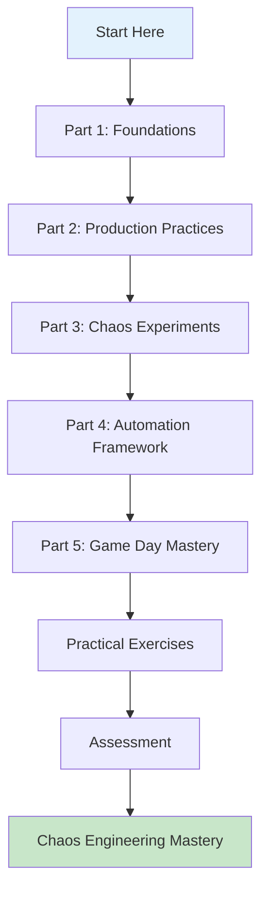
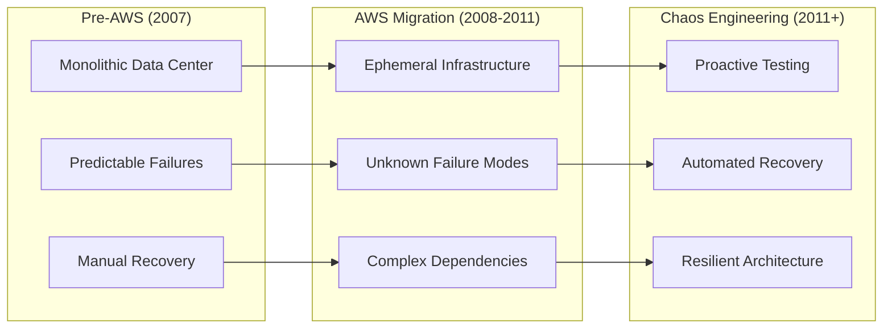
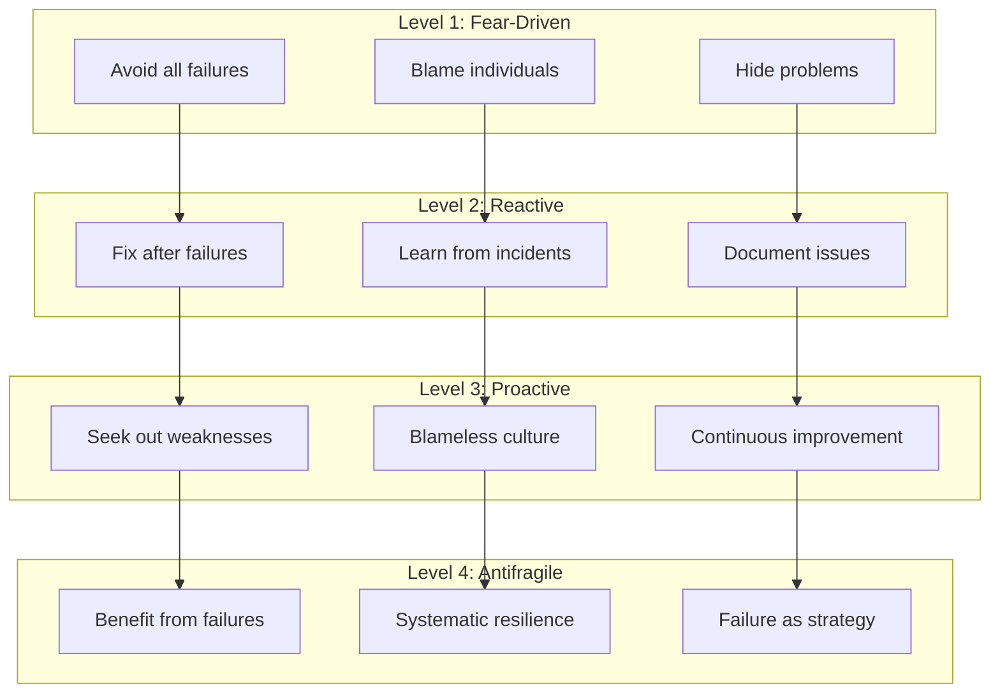

# Chaos Engineering Mastery: Production Systems

!!! success "Learning Module Overview"
    **Duration**: 300+ minutes | **Difficulty**: Advanced | **Hands-on**: 60% practical exercises
    
    Master the art and science of chaos engineering in production systems through real-world practices from Netflix, Gremlin, AWS, LinkedIn, and Slack.

## Table of Contents

- [Module Introduction](#module-introduction)
- [Part 1: Foundations & Philosophy](#part-1-foundations--philosophy) (45 minutes)
- [Part 2: Production Practices Deep Dive](#part-2-production-practices-deep-dive) (75 minutes)
- [Part 3: Comprehensive Chaos Experiments](#part-3-comprehensive-chaos-experiments) (90 minutes)
- [Part 4: Automation & Safety Framework](#part-4-automation--safety-framework) (60 minutes)
- [Part 5: Game Day Mastery](#part-5-game-day-mastery) (30 minutes)
- [Practical Exercises](#practical-exercises) (45 minutes)
- [Assessment & Certification](#assessment--certification) (15 minutes)

---

## Module Introduction

**Welcome to Chaos Engineering Mastery** - the definitive guide to implementing chaos engineering safely and effectively in production systems.

### Learning Path Overview



### Prerequisites Checklist

- [ ] Distributed systems architecture experience (2+ years)
- [ ] Cloud infrastructure management (AWS/GCP/Azure)
- [ ] Microservices deployment and operation
- [ ] Incident response and post-mortem experience
- [ ] Basic monitoring and observability setup

---

## Part 1: Foundations & Philosophy
*Duration: 45 minutes*

### 1.1 The Chaos Engineering Mindset (15 minutes)

Chaos engineering represents a fundamental shift from reactive to proactive resilience testing. Instead of waiting for failures to occur in production, we intentionally introduce controlled failures to build confidence in our systems.

#### Core Principles

1. **Build a hypothesis around steady state behavior**
2. **Vary real-world events** 
3. **Run experiments in production**
4. **Automate experiments to run continuously**
5. **Minimize blast radius**

#### The Netflix Origin Story

In 2008, Netflix began migrating from physical data centers to AWS. This transition exposed them to new failure modes:



### 1.2 Production-First Philosophy (15 minutes)

The controversial decision to test in production stems from a simple reality: **production environments are unique**.

#### Why Production Testing Matters

| Testing Environment | Limitations | Production Advantages |
|-------------------|-------------|---------------------|
| **Development** | Simple scenarios, no real load | Real traffic patterns, actual dependencies |
| **Staging** | Limited scale, clean data | Full scale, real user behavior |
| **Load Testing** | Synthetic traffic | Organic failure combinations |
| **Production** | Customer risk | Authentic system behavior |

#### Safety-First Approach

```python
class ProductionSafetyFramework:
    def __init__(self):
        self.safety_checks = [
            HealthyCapacityCheck(min_healthy_instances=3),
            OngoingIncidentCheck(),
            BusinessHoursCheck(),
            BlastRadiusCheck(max_customer_impact=0.01),
            RollbackCapabilityCheck()
        ]
    
    def is_safe_to_proceed(self, experiment):
        for check in self.safety_checks:
            if not check.validate(experiment):
                return False, check.failure_reason
        return True, "All safety checks passed"
    
    def abort_if_unsafe(self, experiment, real_time_metrics):
        if real_time_metrics.customer_impact > experiment.max_impact:
            self.emergency_abort(experiment)
            self.trigger_incident_response()
```

### 1.3 Cultural Transformation (15 minutes)

Successful chaos engineering requires significant cultural change. Teams must embrace failure as a learning opportunity rather than something to be avoided.

#### The Psychological Safety Foundation

**Blameless Post-Mortems**: When chaos experiments reveal issues, the focus must be on system improvements, not individual blame.

**Failure as Learning**: Each discovered weakness is an opportunity to strengthen the system before a real incident occurs.

**Gradual Adoption**: Start with non-critical systems and low-risk experiments to build confidence.

#### Cultural Maturity Model



---

## Part 2: Production Practices Deep Dive
*Duration: 75 minutes*

### 2.1 Netflix's Chaos Monkey Evolution (20 minutes)

Netflix pioneered chaos engineering with Chaos Monkey in 2011, evolving it into a comprehensive platform.

#### Chaos Monkey (2011-2013)
The original tool randomly terminated EC2 instances during business hours.

```python
class ChaosMonkey:
    """Original Chaos Monkey concept"""
    
    def __init__(self, config):
        self.enabled = config.chaos_enabled
        self.probability = config.termination_probability  # 1/10000
        self.business_hours_only = True
        self.excluded_services = ["payment-service", "user-auth"]
    
    def run_daily_chaos(self):
        if not self._is_business_hours():
            return
            
        eligible_instances = self.get_eligible_instances()
        for instance in eligible_instances:
            if random.random() < self.probability:
                self.terminate_with_monitoring(instance)
    
    def terminate_with_monitoring(self, instance):
        # Pre-termination snapshot
        metrics_snapshot = self.capture_metrics(instance)
        
        # Terminate instance
        self.aws.terminate_instance(instance.id)
        
        # Monitor recovery
        self.monitor_service_recovery(instance.service, metrics_snapshot)
```

#### The Simian Army (2013-2015)
Netflix expanded beyond instance termination with specialized tools:

**Chaos Gorilla**: Simulates availability zone failures
```yaml
chaos_gorilla:
  target: availability-zone
  frequency: weekly
  duration: 30m
  safety_checks:
    - minimum_healthy_zones: 2
    - no_ongoing_deployments: true
    - customer_impact_threshold: 1%
```

**Chaos Kong**: Tests entire region failures
```yaml
chaos_kong:
  target: aws-region
  frequency: quarterly
  duration: 4h
  safety_checks:
    - minimum_healthy_regions: 2
    - leadership_approval: required
    - customer_impact_threshold: 5%
```

#### Modern ChAP Platform (2015-2025)
Netflix's current Chaos Platform (ChAP) represents the state-of-the-art in chaos engineering.

```python
class ChaosPlatform:
    """Netflix's modern chaos platform"""
    
    def __init__(self):
        self.experiment_scheduler = ExperimentScheduler()
        self.blast_radius_controller = BlastRadiusController()
        self.ml_predictor = FailurePredictor()
        self.safety_framework = SafetyFramework()
    
    async def execute_experiment(self, experiment_config):
        # AI-driven risk assessment
        risk_score = await self.ml_predictor.assess_risk(experiment_config)
        
        if risk_score > experiment_config.risk_threshold:
            return ExperimentResult.SKIPPED_HIGH_RISK
        
        # Dynamic blast radius calculation
        blast_radius = self.blast_radius_controller.calculate_safe_radius(
            experiment_config
        )
        
        # Execute with real-time monitoring
        return await self._execute_with_monitoring(
            experiment_config, blast_radius
        )
```

### 2.2 Gremlin's Failure Injection Platform (20 minutes)

Gremlin commercialized chaos engineering with a comprehensive failure injection platform.

#### Failure Categories

**Resource Attacks**:
- CPU consumption
- Memory exhaustion  
- Disk I/O saturation
- Network bandwidth limits

**State Attacks**:
- Process killing
- Service shutdowns
- Container termination
- Kubernetes pod failures

**Network Attacks**:
- Latency injection
- Packet loss
- Network partitions
- DNS failures

#### Gremlin's Safety Framework

```python
class GremlinSafetyFramework:
    """Gremlin's production safety controls"""
    
    def __init__(self):
        self.halt_conditions = [
            ErrorRateThreshold(max_error_rate=5.0),
            ResponseTimeThreshold(max_p99_ms=1000),
            CustomerImpactThreshold(max_impact_percent=1.0),
            BusinessMetricThreshold()
        ]
    
    def monitor_experiment_safety(self, experiment):
        while experiment.is_running():
            current_metrics = self.collect_metrics()
            
            for condition in self.halt_conditions:
                if condition.is_violated(current_metrics):
                    self.emergency_halt(experiment)
                    self.send_alert(f"Emergency halt: {condition}")
                    break
            
            time.sleep(10)  # Check every 10 seconds
```

#### Advanced Experiment Design

```yaml
# Gremlin experiment configuration
experiments:
  - name: "database-connection-pool-exhaustion"
    target:
      type: service
      name: order-service
      tags: [production, critical]
    
    attack:
      type: resource
      resource: connections
      impact: exhaust_pool
      duration: 300s
    
    hypothesis: |
      Order service will gracefully degrade by implementing connection
      queuing when database connection pool is exhausted
    
    success_criteria:
      - error_rate: <2%
      - response_time_p99: <500ms  
      - fallback_activation: true
    
    safety_controls:
      max_customer_impact: 0.5%
      auto_halt_conditions:
        - error_rate: >5%
        - response_time_p99: >2000ms
      
    blast_radius:
      max_affected_instances: 2
      max_affected_services: 1
```

### 2.3 AWS Fault Injection Simulator (15 minutes)

AWS FIS provides managed chaos engineering for AWS infrastructure.

#### Key Capabilities

**EC2 Actions**:
- Instance termination
- CPU stress testing
- Memory exhaustion
- Network disruption

**EKS Actions**:
- Pod deletion
- Node termination  
- Network policies

**RDS Actions**:
- Database failover
- Connection exhaustion
- Read replica failures

#### FIS Experiment Template

```json
{
  "description": "Test RDS failover resilience",
  "roleArn": "arn:aws:iam::account:role/FISRole",
  "actions": {
    "rds-failover": {
      "actionId": "aws:rds:failover-db-cluster",
      "parameters": {},
      "targets": {
        "Cluster": "rds-cluster"
      }
    }
  },
  "targets": {
    "rds-cluster": {
      "resourceType": "aws:rds:cluster",
      "resourceTags": {
        "Environment": "production",
        "ChaosReady": "true"
      },
      "selectionMode": "ALL"
    }
  },
  "stopConditions": [
    {
      "source": "aws:cloudwatch:alarm",
      "value": "arn:aws:cloudwatch:region:account:alarm:HighErrorRate"
    }
  ]
}
```

### 2.4 LinkedIn's Waterbear (10 minutes)

LinkedIn's Waterbear focuses on data pipeline resilience testing.

#### Data Pipeline Chaos

**Stream Processing Failures**:
- Kafka broker failures
- Consumer lag injection
- Message corruption

**Batch Processing Failures**:
- Job failures mid-execution
- Data source unavailability  
- Resource constraints

```python
class WaterbearChaos:
    """LinkedIn's data pipeline chaos testing"""
    
    def inject_kafka_broker_failure(self, cluster, broker_id):
        """Simulate Kafka broker failure"""
        return self.kafka_admin.shutdown_broker(
            cluster=cluster,
            broker_id=broker_id,
            duration="5m",
            expected_behavior="automatic_rebalancing"
        )
    
    def inject_consumer_lag(self, consumer_group, lag_seconds):
        """Inject artificial consumer lag"""
        return self.kafka_admin.delay_consumer(
            group=consumer_group,
            delay=lag_seconds,
            expected_behavior="backpressure_handling"
        )
```

### 2.5 Slack's Disaster Recovery Testing (10 minutes)

Slack's approach focuses on communication system resilience.

#### Real-Time System Chaos

**WebSocket Connection Failures**:
- Connection drops
- Message delivery delays
- Presence system failures

**Message Persistence Failures**:
- Database write failures
- Search index corruption
- File upload failures

```python
class SlackChaos:
    """Slack's real-time communication chaos"""
    
    def simulate_websocket_storm(self, percentage=10):
        """Simulate WebSocket connection storm"""
        affected_connections = self.get_sample_connections(percentage)
        
        for connection in affected_connections:
            self.inject_connection_drop(
                connection=connection,
                reconnect_delay="5-30s",
                expected_behavior="graceful_reconnection"
            )
    
    def test_message_ordering_chaos(self):
        """Test message ordering under chaos"""
        self.inject_network_partition(
            duration="30s",
            affected_channels=["general", "random"],
            expected_behavior="eventual_consistency"
        )
```

---

## Part 3: Comprehensive Chaos Experiments
*Duration: 90 minutes*

### 3.1 Infrastructure Failure Experiments (25 minutes)

#### Network Chaos Experiments

**Latency Injection**:
```python
class NetworkLatencyChaos:
    def __init__(self, target_service, destination_service):
        self.target = target_service
        self.destination = destination_service
        self.network_controller = NetworkController()
    
    def inject_latency(self, latency_ms, jitter_ms=50, duration="10m"):
        """Inject network latency between services"""
        experiment = LatencyExperiment(
            source=self.target,
            destination=self.destination,
            base_latency=f"{latency_ms}ms",
            jitter=f"±{jitter_ms}ms",
            duration=duration
        )
        
        # Hypothesis: Service should handle increased latency gracefully
        expected_behaviors = [
            "Circuit breaker activation after 3 consecutive timeouts",
            "Fallback mechanism activation within 100ms",
            "Response time increase <2x baseline"
        ]
        
        return self.execute_with_validation(experiment, expected_behaviors)
```

**Packet Loss Scenarios**:
```yaml
packet_loss_experiments:
  - name: "gradual-packet-loss"
    description: "Gradually increase packet loss to test degradation"
    steps:
      - packet_loss: 1%
        duration: 2m
        expected: "no_visible_impact"
      - packet_loss: 5%
        duration: 2m  
        expected: "minor_retry_increase"
      - packet_loss: 15%
        duration: 2m
        expected: "circuit_breaker_activation"
      - packet_loss: 30%
        duration: 2m
        expected: "fallback_mechanism_activation"
```

**Network Partition Testing**:
```python
def test_split_brain_prevention():
    """Test distributed system behavior during network partition"""
    
    # Create network partition between data centers
    partition = NetworkPartition(
        group_a=["datacenter-east"],
        group_b=["datacenter-west"],
        duration="5m"
    )
    
    with partition:
        # Monitor consensus behavior
        consensus_health = monitor_consensus_system()
        
        # Verify no split-brain condition
        assert consensus_health.leaders_count <= 1
        assert consensus_health.write_operations_rejected
        
        # Test partition healing
        partition.heal()
        
        # Verify normal operation restoration
        assert consensus_health.normal_operation_restored_within("30s")
```

#### Compute Resource Chaos

**CPU Stress Testing**:
```python
class CPUStressChaos:
    def stress_test_gradual_degradation(self, target_service):
        """Test service behavior under increasing CPU load"""
        stress_levels = [50, 70, 85, 95, 99]
        results = []
        
        for cpu_percent in stress_levels:
            with CPUStress(target_service, cpu_percent, duration="3m"):
                metrics = self.collect_performance_metrics()
                
                results.append({
                    'cpu_load': cpu_percent,
                    'response_time_p99': metrics.response_time_p99,
                    'error_rate': metrics.error_rate,
                    'throughput': metrics.requests_per_second
                })
        
        # Analyze degradation curve
        self.analyze_performance_degradation(results)
        return results
```

**Memory Exhaustion Testing**:
```python
def test_memory_leak_simulation():
    """Simulate gradual memory leak to test garbage collection and OOM handling"""
    
    memory_leak = MemoryLeakSimulator(
        target_service="user-service",
        leak_rate="50MB/minute",
        max_memory="80%",  # Don't exceed 80% to avoid system instability
        duration="15m"
    )
    
    with memory_leak:
        # Monitor garbage collection behavior
        gc_metrics = monitor_garbage_collection()
        
        # Verify graceful degradation
        assert gc_metrics.frequency_increase < 300%
        assert gc_metrics.pause_times_ms < 100
        
        # Test OOM prevention
        memory_usage = monitor_memory_usage()
        assert memory_usage.max_percent < 90
```

#### Storage Failures

**Disk I/O Chaos**:
```python
class DiskIOChaos:
    def test_disk_latency_injection(self, target_instances):
        """Test application behavior under high disk I/O latency"""
        
        io_delays = [10, 50, 200, 1000]  # milliseconds
        
        for delay_ms in io_delays:
            with DiskLatencyInjection(target_instances, delay_ms):
                # Test database operations
                db_performance = self.test_database_operations()
                
                # Test log writing
                log_performance = self.test_log_operations()
                
                # Test file operations
                file_performance = self.test_file_operations()
                
                self.validate_performance_degradation({
                    'disk_latency': delay_ms,
                    'db_performance': db_performance,
                    'log_performance': log_performance,
                    'file_performance': file_performance
                })
```

### 3.2 Application-Level Chaos (25 minutes)

#### Service Communication Failures

**API Gateway Chaos**:
```python
class APIGatewayChaos:
    def test_rate_limiting_cascade(self):
        """Test behavior when API gateway rate limits are triggered"""
        
        # Inject rate limit responses
        rate_limit_injection = RateLimitInjection(
            gateway="api-gateway",
            rate_limit="100/minute",
            response_code=429,
            percentage=20  # 20% of requests get rate limited
        )
        
        with rate_limit_injection:
            # Monitor client behavior
            client_metrics = self.monitor_client_behavior()
            
            # Verify proper backoff behavior
            assert client_metrics.backoff_implemented
            assert client_metrics.retry_storm_prevented
            
            # Check circuit breaker activation
            circuit_breaker_metrics = self.monitor_circuit_breakers()
            assert circuit_breaker_metrics.appropriate_activation
```

**Service Mesh Chaos**:
```python
def test_istio_proxy_failures():
    """Test service mesh proxy failures"""
    
    # Inject sidecar proxy failures
    proxy_chaos = IstioProxyChaos(
        target_pods=["user-service", "order-service"],
        failure_type="proxy_crash",
        duration="5m"
    )
    
    with proxy_chaos:
        # Monitor service-to-service communication
        mesh_metrics = monitor_service_mesh()
        
        # Verify traffic rerouting
        assert mesh_metrics.traffic_rerouted_successfully
        
        # Check proxy restart behavior
        assert mesh_metrics.proxy_restart_time < "30s"
```

#### Database Chaos Experiments

**Connection Pool Exhaustion**:
```python
def test_database_connection_exhaustion():
    """Test application behavior when database connection pool is exhausted"""
    
    # Exhaust database connection pool
    connection_exhaustion = DatabaseConnectionChaos(
        target_database="postgresql-cluster",
        max_connections=100,
        exhaust_percentage=95,
        duration="10m"
    )
    
    with connection_exhaustion:
        # Test application response
        app_metrics = monitor_application_metrics()
        
        # Verify connection queuing
        assert app_metrics.connection_queuing_activated
        
        # Check graceful degradation
        assert app_metrics.error_rate < 5.0
        assert app_metrics.fallback_mechanisms_activated
```

**Replication Lag Testing**:
```python
def test_read_replica_lag():
    """Test application behavior under database replication lag"""
    
    replication_lag = DatabaseReplicationChaos(
        primary_db="orders-primary",
        replica_db="orders-replica",
        artificial_lag="30s",
        duration="15m"
    )
    
    with replication_lag:
        # Monitor read-after-write consistency
        consistency_metrics = monitor_consistency()
        
        # Verify eventual consistency handling
        assert consistency_metrics.stale_read_detection
        assert consistency_metrics.fallback_to_primary_when_needed
```

### 3.3 Data Corruption Scenarios (20 minutes)

#### Message Queue Corruption

**Message Duplication Testing**:
```python
def test_duplicate_message_handling():
    """Test system behavior with duplicate messages"""
    
    message_duplication = MessageChaos(
        queue="order-processing",
        duplication_rate=10,  # 10% of messages duplicated
        duplication_count=3,  # Each duplicate appears 3 times
        duration="20m"
    )
    
    with message_duplication:
        # Monitor idempotency
        processing_metrics = monitor_message_processing()
        
        # Verify duplicate detection
        assert processing_metrics.duplicates_detected
        assert processing_metrics.duplicate_processing_prevented
        
        # Check business logic integrity
        business_metrics = monitor_business_metrics()
        assert business_metrics.no_duplicate_charges
        assert business_metrics.inventory_consistency_maintained
```

**Message Ordering Chaos**:
```python
def test_message_ordering_violation():
    """Test system behavior when message ordering is violated"""
    
    ordering_chaos = MessageOrderingChaos(
        queue="user-events",
        reorder_percentage=15,  # 15% of messages reordered
        max_delay="5s",
        duration="30m"
    )
    
    with ordering_chaos:
        # Monitor event processing
        event_metrics = monitor_event_processing()
        
        # Verify ordering violation handling
        assert event_metrics.out_of_order_detection
        assert event_metrics.state_consistency_maintained
```

#### Data Format Corruption

**Schema Evolution Testing**:
```python
def test_backward_compatibility():
    """Test system behavior with old/new schema versions"""
    
    schema_chaos = SchemaChaos(
        service="user-profile",
        inject_old_schema=True,
        old_schema_percentage=25,
        missing_fields=["email_verified", "last_login"],
        duration="1h"
    )
    
    with schema_chaos:
        # Monitor schema handling
        schema_metrics = monitor_schema_processing()
        
        # Verify backward compatibility
        assert schema_metrics.old_schema_handled_gracefully
        assert schema_metrics.default_values_applied
        assert schema_metrics.no_application_crashes
```

### 3.4 Dependency Failures (20 minutes)

#### External Service Failures

**Third-Party API Chaos**:
```python
def test_external_payment_provider_failure():
    """Test payment processing resilience when external provider fails"""
    
    payment_provider_chaos = ExternalServiceChaos(
        service="stripe-payment-api",
        failure_types=[
            "timeout_responses",
            "http_500_errors", 
            "network_unreachable"
        ],
        failure_rate=30,  # 30% of calls fail
        duration="45m"
    )
    
    with payment_provider_chaos:
        # Monitor payment processing
        payment_metrics = monitor_payment_processing()
        
        # Verify fallback mechanisms
        assert payment_metrics.fallback_provider_activated
        assert payment_metrics.payment_queuing_for_retry
        assert payment_metrics.user_notification_sent
        
        # Check business continuity
        business_metrics = monitor_business_metrics()
        assert business_metrics.checkout_completion_rate > 90
```

#### Internal Service Failures

**Microservice Cascade Testing**:
```python
def test_microservice_cascade_prevention():
    """Test prevention of cascade failures in microservice architecture"""
    
    # Simulate user-service failure
    user_service_failure = ServiceFailure(
        service="user-service",
        failure_type="complete_unavailability",
        duration="20m"
    )
    
    with user_service_failure:
        # Monitor dependent services
        dependency_metrics = monitor_service_dependencies()
        
        # Verify cascade prevention
        assert dependency_metrics.circuit_breakers_activated
        assert dependency_metrics.fallback_data_used
        assert dependency_metrics.graceful_degradation
        
        # Check system stability
        system_metrics = monitor_system_stability()
        assert system_metrics.other_services_stable
        assert system_metrics.overall_availability > 95
```

---

## Part 4: Automation & Safety Framework
*Duration: 60 minutes*

### 4.1 Chaos Automation Framework (20 minutes)

#### Continuous Chaos Pipeline

```python
class ChaosAutomationFramework:
    """Production-ready chaos automation framework"""
    
    def __init__(self):
        self.scheduler = ChaosScheduler()
        self.experiment_library = ExperimentLibrary()
        self.safety_framework = SafetyFramework()
        self.reporting_system = ChaosReportingSystem()
    
    def setup_continuous_chaos(self):
        """Setup automated chaos experiments pipeline"""
        
        # Daily chaos schedule
        daily_experiments = [
            ScheduledExperiment(
                name="random-instance-termination",
                cron="0 14 * * MON-FRI",  # Weekdays 2 PM
                experiment=self.experiment_library.get("instance-termination"),
                safety_config=SafetyConfig(
                    max_blast_radius=BlastRadius.SMALL,
                    auto_abort_on_slo_breach=True
                )
            ),
            ScheduledExperiment(
                name="database-latency-injection",
                cron="0 15 * * TUE,THU",  # Tuesday/Thursday 3 PM
                experiment=self.experiment_library.get("db-latency"),
                safety_config=SafetyConfig(
                    max_customer_impact=0.5,
                    auto_rollback_timeout="5m"
                )
            )
        ]
        
        # Weekly chaos schedule
        weekly_experiments = [
            ScheduledExperiment(
                name="availability-zone-failure",
                cron="0 10 * * MON",  # Monday 10 AM
                experiment=self.experiment_library.get("az-failure"),
                safety_config=SafetyConfig(
                    leadership_approval_required=True,
                    max_customer_impact=2.0
                )
            )
        ]
        
        # Register all experiments
        for experiment in daily_experiments + weekly_experiments:
            self.scheduler.register_experiment(experiment)
    
    async def execute_scheduled_experiments(self):
        """Execute scheduled chaos experiments with safety controls"""
        
        pending_experiments = self.scheduler.get_pending_experiments()
        
        for experiment in pending_experiments:
            try:
                # Pre-execution safety check
                safety_check = await self.safety_framework.validate_safety(
                    experiment
                )
                
                if not safety_check.is_safe:
                    await self.handle_unsafe_conditions(experiment, safety_check)
                    continue
                
                # Execute experiment with monitoring
                result = await self.execute_experiment_with_monitoring(
                    experiment
                )
                
                # Generate report
                await self.reporting_system.generate_experiment_report(
                    experiment, result
                )
                
            except Exception as e:
                await self.handle_experiment_failure(experiment, e)
```

#### Experiment as Code

```yaml
# chaos-experiments.yaml
apiVersion: chaos.io/v1
kind: ChaosExperiment
metadata:
  name: order-service-cpu-stress
  namespace: production
spec:
  hypothesis: |
    Order service maintains <500ms p99 response time and <2% error rate
    during 80% CPU utilization for 10 minutes
  
  target:
    service: order-service
    selector:
      matchLabels:
        app: order-service
        environment: production
  
  experiment:
    type: cpu-stress
    parameters:
      cpu-percent: 80
      duration: 10m
      instances: 2  # Limit blast radius
  
  success-criteria:
    - metric: response_time_p99
      threshold: 500ms
      operator: less-than
    
    - metric: error_rate
      threshold: 2%
      operator: less-than
    
    - metric: throughput
      threshold: 80%
      operator: greater-than
      baseline: 7d  # Compare to 7-day average
  
  safety-controls:
    max-customer-impact: 1%
    auto-abort-conditions:
      - metric: error_rate
        threshold: 5%
      - metric: response_time_p99  
        threshold: 2000ms
    
    blast-radius:
      max-affected-instances: 2
      max-affected-services: 1
      excluded-services: [payment-service, auth-service]
  
  schedule:
    cron: "0 14 * * TUE"  # Tuesday 2 PM
    timezone: UTC
  
  notifications:
    slack-channel: "#chaos-engineering"
    email: ["sre-team@company.com"]
    pagerduty: false  # Don't page for scheduled chaos
```

### 4.2 Blast Radius Control (20 minutes)

#### Dynamic Blast Radius Calculation

```python
class BlastRadiusController:
    """Intelligent blast radius control system"""
    
    def __init__(self):
        self.dependency_analyzer = DependencyAnalyzer()
        self.impact_predictor = ImpactPredictor()
        self.traffic_analyzer = TrafficAnalyzer()
    
    def calculate_safe_blast_radius(self, experiment_config):
        """Calculate maximum safe blast radius for experiment"""
        
        # Analyze service dependencies
        dependency_graph = self.dependency_analyzer.build_dependency_graph(
            experiment_config.target_service
        )
        
        # Predict downstream impact
        impact_prediction = self.impact_predictor.predict_impact(
            experiment_config,
            dependency_graph
        )
        
        # Calculate current traffic patterns
        traffic_analysis = self.traffic_analyzer.analyze_current_traffic(
            experiment_config.target_service
        )
        
        # Determine safe radius based on multiple factors
        safe_radius = self._calculate_safe_radius(
            impact_prediction,
            traffic_analysis,
            experiment_config.max_customer_impact
        )
        
        return BlastRadius(
            max_instances=safe_radius.instances,
            max_availability_zones=safe_radius.azs,
            max_regions=safe_radius.regions,
            affected_services=safe_radius.services,
            estimated_customer_impact=safe_radius.customer_impact
        )
    
    def _calculate_safe_radius(self, impact, traffic, max_impact):
        """Internal calculation logic for safe blast radius"""
        
        # Start with conservative estimates
        base_radius = BlastRadiusCalculation(
            instances=min(2, traffic.total_instances * 0.1),
            azs=1,
            regions=0,  # Never start with cross-region
            services=[impact.target_service]
        )
        
        # Adjust based on traffic patterns
        if traffic.is_peak_time:
            base_radius.instances *= 0.5  # More conservative during peak
        
        if traffic.current_load < traffic.average_load * 0.7:
            base_radius.instances *= 1.5  # Less conservative during low load
        
        # Ensure customer impact stays below threshold
        predicted_impact = self._predict_customer_impact(base_radius, traffic)
        
        while predicted_impact > max_impact and base_radius.instances > 1:
            base_radius.instances -= 1
            predicted_impact = self._predict_customer_impact(base_radius, traffic)
        
        return base_radius
```

#### Cellular Architecture for Containment

```python
class CellularArchitecture:
    """Implement cellular architecture for blast radius containment"""
    
    def __init__(self):
        self.cell_manager = CellManager()
        self.traffic_router = TrafficRouter()
        self.health_monitor = CellHealthMonitor()
    
    def create_isolation_cells(self, service_config):
        """Create isolated cells for a service"""
        
        cells = []
        for cell_id in range(service_config.cell_count):
            cell = ServiceCell(
                id=f"{service_config.service_name}-cell-{cell_id}",
                capacity_percent=100 / service_config.cell_count,
                isolation_level=IsolationLevel.STRICT,
                dependencies=service_config.dependencies
            )
            
            # Configure cell-specific resources
            cell.configure_resources(
                compute=service_config.compute_per_cell,
                storage=service_config.storage_per_cell,
                network=service_config.network_per_cell
            )
            
            cells.append(cell)
        
        return cells
    
    def isolate_failed_cell(self, failed_cell):
        """Isolate a failed cell to prevent cascade failures"""
        
        # Stop routing traffic to failed cell
        self.traffic_router.stop_routing_to_cell(failed_cell)
        
        # Redistribute capacity to healthy cells
        healthy_cells = self.cell_manager.get_healthy_cells(
            service=failed_cell.service
        )
        
        for healthy_cell in healthy_cells:
            additional_capacity = failed_cell.capacity / len(healthy_cells)
            healthy_cell.increase_capacity(additional_capacity)
        
        # Monitor cascade prevention
        self.health_monitor.monitor_cascade_prevention(
            failed_cell, healthy_cells
        )
```

### 4.3 Rollback Mechanisms (20 minutes)

#### Automated Rollback Framework

```python
class ChaosRollbackFramework:
    """Automated rollback system for chaos experiments"""
    
    def __init__(self):
        self.state_manager = ExperimentStateManager()
        self.rollback_strategies = RollbackStrategyRegistry()
        self.monitoring = RollbackMonitoring()
    
    def execute_experiment_with_rollback(self, experiment):
        """Execute experiment with automatic rollback capability"""
        
        # Capture pre-experiment state
        pre_state = self.state_manager.capture_system_state(
            experiment.target_services
        )
        
        # Register rollback strategy
        rollback_strategy = self.rollback_strategies.get_strategy(
            experiment.experiment_type
        )
        
        try:
            # Execute experiment with monitoring
            result = self._execute_with_monitoring(experiment, rollback_strategy)
            
            if result.success:
                # Gradual rollback for successful experiments
                await self._gradual_rollback(experiment, pre_state)
            else:
                # Emergency rollback for failed experiments
                await self._emergency_rollback(experiment, pre_state)
            
            return result
            
        except Exception as e:
            # Critical failure - immediate rollback
            await self._critical_failure_rollback(experiment, pre_state)
            raise ChaosExperimentFailure(f"Experiment failed: {e}")
    
    async def _execute_with_monitoring(self, experiment, rollback_strategy):
        """Execute experiment with real-time monitoring"""
        
        experiment_monitor = ExperimentMonitor(experiment)
        experiment_monitor.start_monitoring()
        
        try:
            # Inject failure
            failure_injector = FailureInjector(experiment)
            await failure_injector.inject_failure()
            
            # Monitor experiment progress
            while experiment.is_running():
                current_metrics = experiment_monitor.get_current_metrics()
                
                # Check abort conditions
                if self._should_abort(experiment, current_metrics):
                    await self._abort_experiment(experiment, rollback_strategy)
                    return ExperimentResult.ABORTED
                
                await asyncio.sleep(10)  # Monitor every 10 seconds
            
            # Analyze results
            final_metrics = experiment_monitor.get_final_metrics()
            return self._analyze_experiment_results(experiment, final_metrics)
            
        finally:
            experiment_monitor.stop_monitoring()
    
    def _should_abort(self, experiment, current_metrics):
        """Determine if experiment should be aborted"""
        
        abort_conditions = [
            current_metrics.customer_impact > experiment.max_customer_impact,
            current_metrics.error_rate > experiment.max_error_rate,
            current_metrics.response_time_p99 > experiment.max_response_time,
            self._detect_cascade_failure(current_metrics)
        ]
        
        return any(abort_conditions)
    
    async def _emergency_rollback(self, experiment, pre_state):
        """Perform emergency rollback"""
        
        rollback_start = time.time()
        
        # Parallel rollback operations
        rollback_tasks = [
            self._restore_traffic_routing(pre_state.traffic_config),
            self._restore_service_configuration(pre_state.service_configs),
            self._restore_infrastructure(pre_state.infrastructure_config),
            self._clear_injected_failures(experiment)
        ]
        
        # Execute rollback operations with timeout
        try:
            await asyncio.wait_for(
                asyncio.gather(*rollback_tasks),
                timeout=60  # 1 minute timeout for rollback
            )
            
            rollback_duration = time.time() - rollback_start
            
            # Verify rollback success
            rollback_verification = await self._verify_rollback(
                experiment, pre_state
            )
            
            if rollback_verification.success:
                logger.info(f"Emergency rollback completed in {rollback_duration:.2f}s")
            else:
                logger.error(f"Rollback verification failed: {rollback_verification.issues}")
                
        except asyncio.TimeoutError:
            logger.critical("Emergency rollback timed out - manual intervention required")
            await self._trigger_incident_response(experiment)
```

#### Rollback Strategy Registry

```python
class RollbackStrategyRegistry:
    """Registry of rollback strategies for different experiment types"""
    
    def __init__(self):
        self.strategies = {
            'instance-termination': InstanceTerminationRollback(),
            'network-chaos': NetworkChaosRollback(),
            'resource-exhaustion': ResourceExhaustionRollback(),
            'application-failure': ApplicationFailureRollback()
        }
    
    def register_strategy(self, experiment_type, strategy):
        """Register custom rollback strategy"""
        self.strategies[experiment_type] = strategy
    
    def get_strategy(self, experiment_type):
        """Get appropriate rollback strategy"""
        strategy = self.strategies.get(experiment_type)
        if not strategy:
            return DefaultRollbackStrategy()
        return strategy

class NetworkChaosRollback(RollbackStrategy):
    """Rollback strategy for network chaos experiments"""
    
    async def rollback(self, experiment, pre_state):
        """Rollback network chaos injection"""
        
        # Remove network policies
        await self._remove_network_policies(experiment.network_policies)
        
        # Clear iptables rules
        await self._clear_iptables_rules(experiment.iptables_rules)
        
        # Restore DNS configurations
        await self._restore_dns_config(pre_state.dns_config)
        
        # Wait for network convergence
        await self._wait_for_network_convergence(timeout=30)
        
        # Verify connectivity restoration
        connectivity_check = await self._verify_connectivity(
            experiment.target_services
        )
        
        return RollbackResult(
            success=connectivity_check.all_services_reachable,
            duration=connectivity_check.restoration_time,
            issues=connectivity_check.remaining_issues
        )
```

---

## Part 5: Game Day Mastery
*Duration: 30 minutes*

### 5.1 Game Day Planning Framework (15 minutes)

#### Comprehensive Game Day Structure

```python
class GameDayFramework:
    """Complete framework for conducting Game Day exercises"""
    
    def __init__(self):
        self.scenario_generator = ScenarioGenerator()
        self.participant_manager = ParticipantManager()
        self.communication_system = GameDayCommunicationSystem()
        self.learning_extractor = LearningExtractor()
    
    def design_game_day_scenario(self, scenario_config):
        """Design comprehensive Game Day scenario"""
        
        scenario = GameDayScenario(
            name=scenario_config.name,
            description=scenario_config.description,
            complexity=scenario_config.complexity_level,
            duration=scenario_config.expected_duration
        )
        
        # Define failure injection timeline
        scenario.failure_timeline = self._create_failure_timeline(
            scenario_config.failure_sequences
        )
        
        # Assign participant roles
        scenario.participant_roles = self._assign_participant_roles(
            scenario_config.required_skills
        )
        
        # Create success criteria
        scenario.success_criteria = self._define_success_criteria(
            scenario_config.business_objectives
        )
        
        # Design communication templates
        scenario.communication_templates = self._create_communication_templates(
            scenario_config.stakeholder_groups
        )
        
        return scenario
    
    def _create_failure_timeline(self, failure_sequences):
        """Create timeline of failures to inject during Game Day"""
        
        timeline = FailureTimeline()
        
        for sequence in failure_sequences:
            timeline.add_failure(
                time_offset=sequence.start_time,
                failure_type=sequence.failure_type,
                target=sequence.target_service,
                severity=sequence.severity,
                expected_response=sequence.expected_team_response
            )
        
        # Add red herrings and distractions
        timeline.add_red_herrings([
            RedHerring(
                time_offset="15m",
                type="false_alarm",
                description="Non-critical service alert",
                purpose="Test prioritization skills"
            ),
            RedHerring(
                time_offset="45m", 
                type="minor_issue",
                description="Performance degradation in non-critical path",
                purpose="Test focus under pressure"
            )
        ])
        
        return timeline
```

#### Advanced Game Day Scenarios

```yaml
game_day_scenarios:
  
  - name: "Black Friday Traffic Surge with Cascading Failures"
    description: "Simulate peak shopping traffic with multiple system failures"
    complexity: very_high
    duration: 4h
    participants: [sre-team, backend-team, frontend-team, mobile-team, data-team, leadership]
    
    timeline:
      - time: "0m"
        event: "Traffic surge begins (10x normal load)"
        expected_response: "Auto-scaling activation, monitoring alerts"
        
      - time: "15m"
        event: "Primary database connection pool exhausted"
        inject: "Database connection pool exhaustion"
        expected_response: "Read replica failover, connection queuing"
        
      - time: "30m"  
        event: "CDN origin servers overwhelmed"
        inject: "CDN origin failure simulation"
        expected_response: "Additional origin scaling, cache hit optimization"
        
      - time: "45m"
        event: "Payment service rate limiting triggered"
        inject: "Payment provider API rate limiting"
        expected_response: "Fallback payment provider, queue management"
        
      - time: "60m"
        event: "Redis cache cluster failure"
        inject: "Redis cluster partition"
        expected_response: "Session store failover, graceful degradation"
    
    success_criteria:
      - customer_conversion_rate: >85%
      - page_load_times: <3s
      - payment_success_rate: >95%
      - zero_data_loss: true
      - customer_complaints: <50
    
    learning_objectives:
      - Cross-team coordination under extreme pressure
      - Priority decision making with multiple failures
      - Customer communication during outages
      - Incident escalation procedures
      - Post-incident recovery validation
  
  - name: "AI/ML Pipeline Cascade Failure"
    description: "Machine learning recommendation system failures"
    complexity: high
    duration: 3h
    participants: [ml-team, platform-team, sre-team, product-team]
    
    timeline:
      - time: "0m"
        event: "ML model serving latency spike"
        inject: "Model serving CPU exhaustion"
        expected_response: "Model scaling, fallback activation"
        
      - time: "20m"
        event: "Feature store connection timeout"  
        inject: "Feature store database failure"
        expected_response: "Cached features usage, degraded recommendations"
        
      - time: "40m"
        event: "Real-time data pipeline lag"
        inject: "Kafka consumer group lag"
        expected_response: "Pipeline scaling, batch processing fallback"
        
      - time: "60m"
        event: "A/B testing platform failure"
        inject: "Experiment configuration service failure"
        expected_response: "Default experience serving, manual overrides"
    
    success_criteria:
      - recommendation_availability: >90%
      - recommendation_quality_score: >0.8
      - user_engagement_degradation: <20%
      - model_serving_recovery_time: <10m
    
    learning_objectives:
      - ML system failure modes and recovery patterns  
      - Data pipeline resilience strategies
      - Graceful degradation for ML-powered features
      - Cross-functional ML incident response
```

### 5.2 Game Day Execution & Learning (15 minutes)

#### Real-Time Game Day Coordination

```python
class GameDayExecutor:
    """Execute and coordinate Game Day exercises"""
    
    def __init__(self):
        self.failure_injector = GameDayFailureInjector()
        self.communication_hub = GameDayCommunicationHub()
        self.metrics_collector = GameDayMetricsCollector()
        self.learning_recorder = LearningRecorder()
    
    async def execute_game_day(self, scenario):
        """Execute complete Game Day exercise"""
        
        session = GameDaySession(
            scenario=scenario,
            start_time=datetime.now(),
            participants=scenario.participants
        )
        
        # Pre-game briefing
        await self._conduct_pre_game_briefing(session)
        
        # Execute failure timeline
        timeline_executor = TimelineExecutor(scenario.failure_timeline)
        
        # Monitor participant responses
        response_monitor = ParticipantResponseMonitor(session)
        
        try:
            # Start failure injection according to timeline
            async for failure_event in timeline_executor.execute():
                # Inject failure
                await self.failure_injector.inject_failure(failure_event)
                
                # Monitor team response
                response_metrics = await response_monitor.monitor_response(
                    failure_event,
                    timeout=failure_event.max_response_time
                )
                
                # Record learning opportunities
                learning_insights = await self._capture_learning_insights(
                    failure_event,
                    response_metrics
                )
                
                session.add_learning_insights(learning_insights)
            
            # Post-game analysis
            final_results = await self._conduct_post_game_analysis(session)
            
            return GameDayResults(
                session=session,
                overall_success=final_results.meets_success_criteria,
                team_performance_score=final_results.team_performance,
                lessons_learned=final_results.lessons_learned,
                action_items=final_results.action_items
            )
            
        except Exception as e:
            # Emergency stop procedures
            await self._emergency_stop_game_day(session)
            raise GameDayFailure(f"Game Day execution failed: {e}")
    
    async def _capture_learning_insights(self, failure_event, response_metrics):
        """Capture learning insights from team responses"""
        
        insights = []
        
        # Response time analysis
        if response_metrics.detection_time > failure_event.expected_detection:
            insights.append(LearningInsight(
                category="detection",
                issue="Slow failure detection",
                observation=f"Took {response_metrics.detection_time}s to detect issue",
                recommendation="Improve monitoring alerts and thresholds"
            ))
        
        # Communication analysis
        if response_metrics.communication_delays:
            insights.append(LearningInsight(
                category="communication",
                issue="Communication delays",
                observation="Delayed stakeholder communication",
                recommendation="Streamline communication templates and escalation"
            ))
        
        # Technical response analysis
        if response_metrics.incorrect_diagnosis:
            insights.append(LearningInsight(
                category="diagnosis",
                issue="Incorrect initial diagnosis",
                observation="Team initially diagnosed wrong root cause",
                recommendation="Improve diagnostic runbooks and training"
            ))
        
        return insights
```

#### Learning Extraction and Action Planning

```python
class GameDayLearningExtractor:
    """Extract actionable learnings from Game Day exercises"""
    
    def extract_comprehensive_learnings(self, game_day_results):
        """Extract comprehensive learnings from Game Day"""
        
        learnings = ComprehensiveLearnings()
        
        # Technical learnings
        learnings.technical = self._extract_technical_learnings(
            game_day_results.technical_responses
        )
        
        # Process learnings
        learnings.process = self._extract_process_learnings(
            game_day_results.process_responses
        )
        
        # Cultural learnings
        learnings.cultural = self._extract_cultural_learnings(
            game_day_results.team_dynamics
        )
        
        # Infrastructure learnings
        learnings.infrastructure = self._extract_infrastructure_learnings(
            game_day_results.system_responses
        )
        
        return learnings
    
    def _extract_technical_learnings(self, technical_responses):
        """Extract technical system learnings"""
        
        technical_learnings = []
        
        for response in technical_responses:
            if response.failure_type == "database_failure":
                if response.recovery_time > response.target_recovery_time:
                    technical_learnings.append(TechnicalLearning(
                        category="database_resilience",
                        gap="Slow database failover",
                        current_state=f"Recovery took {response.recovery_time}s",
                        target_state=f"Recovery should take <{response.target_recovery_time}s",
                        action_items=[
                            "Implement automated failover scripts",
                            "Tune database health check intervals",
                            "Practice manual failover procedures"
                        ]
                    ))
        
        return technical_learnings
    
    def generate_action_plan(self, learnings):
        """Generate actionable improvement plan"""
        
        action_plan = ActionPlan()
        
        # Prioritize actions by impact and effort
        prioritized_actions = self._prioritize_actions(learnings.all_actions())
        
        # Group into time-based buckets
        action_plan.immediate_actions = [  # Within 1 week
            action for action in prioritized_actions 
            if action.effort == Effort.LOW and action.impact == Impact.HIGH
        ]
        
        action_plan.short_term_actions = [  # Within 1 month
            action for action in prioritized_actions
            if action.effort == Effort.MEDIUM and action.impact >= Impact.MEDIUM
        ]
        
        action_plan.long_term_actions = [  # Within 3 months
            action for action in prioritized_actions
            if action.effort == Effort.HIGH and action.impact == Impact.HIGH
        ]
        
        # Assign ownership and timelines
        for action in action_plan.all_actions():
            action.owner = self._assign_owner(action)
            action.timeline = self._calculate_timeline(action)
            action.success_metrics = self._define_success_metrics(action)
        
        return action_plan
```

---

## Practical Exercises
*Duration: 45 minutes*

### Exercise 1: Basic Chaos Experiment Design (15 minutes)

**Scenario**: You're running an e-commerce platform with the following services:
- Frontend (React SPA)
- API Gateway  
- User Service
- Product Service
- Order Service
- Payment Service
- Inventory Service
- PostgreSQL Database
- Redis Cache

**Task**: Design your first chaos experiment focusing on database connection failures.

**Template**:
```yaml
experiment_design:
  name: "database-connection-chaos"
  
  hypothesis: |
    # Write your hypothesis here
    
  target:
    service: # Which service to target?
    failure_type: # What failure to inject?
    
  success_criteria:
    - metric: # What metric to measure?
      threshold: # What's acceptable?
      
  safety_controls:
    max_customer_impact: # What's your limit?
    blast_radius:
      max_instances: # How many instances?
      
  rollback_plan:
    # How will you recover?
```

**Solution Discussion**:
<details>
<summary>Click to see example solution</summary>

```yaml
experiment_design:
  name: "database-connection-chaos"
  
  hypothesis: |
    The Order Service will gracefully handle database connection failures
    by implementing connection pooling retries and fallback to read replicas,
    maintaining <5% error rate and <2s response time degradation
    
  target:
    service: order-service
    failure_type: database_connection_exhaustion
    
  success_criteria:
    - metric: error_rate
      threshold: "<5%"
    - metric: response_time_p99
      threshold: "<3s"
    - metric: fallback_activation
      threshold: "within 30s"
      
  safety_controls:
    max_customer_impact: 2%
    blast_radius:
      max_instances: 2
      max_duration: 10m
      
  rollback_plan:
    - clear_connection_exhaustion_injection
    - restart_affected_instances
    - verify_service_health
```
</details>

### Exercise 2: Game Day Scenario Planning (15 minutes)

**Task**: Design a Game Day scenario for testing your team's response to a major incident.

**Context**: Your streaming platform experiences issues during a major sports event (peak traffic time).

**Template**:
```yaml
game_day_scenario:
  name: # Creative scenario name
  
  business_context: |
    # Why is this scenario realistic and important?
    
  failure_sequence:
    # What failures will you inject and when?
    
  participant_roles:
    # Who needs to be involved and what are their roles?
    
  success_criteria:
    # How will you measure success?
    
  learning_objectives:
    # What do you want the team to learn?
```

**Solution Discussion**:
<details>
<summary>Click to see example solution</summary>

```yaml
game_day_scenario:
  name: "Championship Game Cascade Failure"
  
  business_context: |
    During the championship game, traffic increases 15x normal levels.
    Multiple systems start failing under load, testing our peak traffic
    incident response and customer communication procedures.
    
  failure_sequence:
    - time: "0m"
      event: "Traffic surge begins (15x normal)"
      inject: "Load testing traffic generation"
      
    - time: "20m"
      event: "Video transcoding queue overwhelmed" 
      inject: "Transcoding service resource exhaustion"
      
    - time: "35m"
      event: "CDN origin servers failing"
      inject: "Random origin server termination"
      
    - time: "50m"
      event: "User authentication service timeouts"
      inject: "Auth service database connection issues"
      
  participant_roles:
    - role: "Incident Commander"
      responsibilities: ["Overall coordination", "Stakeholder communication"]
      
    - role: "Technical Lead" 
      responsibilities: ["Technical diagnosis", "Solution implementation"]
      
    - role: "Communications Lead"
      responsibilities: ["Customer communication", "Internal updates"]
      
  success_criteria:
    - video_streaming_availability: ">90%"
    - user_authentication_success: ">95%"  
    - customer_complaints: "<100"
    - incident_resolution_time: "<60m"
    
  learning_objectives:
    - Practice peak traffic incident response
    - Test cross-team communication under pressure
    - Validate auto-scaling and failover procedures
    - Improve customer communication templates
```
</details>

### Exercise 3: Safety Framework Implementation (15 minutes)

**Task**: Implement safety controls for the chaos experiment you designed in Exercise 1.

**Requirements**:
- Real-time monitoring
- Automatic abort conditions
- Blast radius limits
- Rollback procedures

**Code Template**:
```python
class ChaosExperimentSafetyFramework:
    def __init__(self):
        # Initialize your safety components
        pass
    
    def validate_safety_preconditions(self, experiment):
        # Check if it's safe to start the experiment
        pass
    
    def monitor_experiment_safety(self, experiment):
        # Monitor experiment in real-time
        pass
    
    def should_abort_experiment(self, experiment, current_metrics):
        # Determine if experiment should be aborted
        pass
    
    def emergency_rollback(self, experiment):
        # Perform emergency rollback
        pass
```

**Implementation Challenge**:
Implement the safety framework with specific abort conditions based on your experiment design.

---

## Assessment & Certification
*Duration: 15 minutes*

### Chaos Engineering Mastery Assessment

#### Scenario-Based Questions

**Question 1**: You're implementing chaos engineering at a financial services company. The leadership is concerned about customer impact. How would you structure your chaos engineering program to gain leadership buy-in while maintaining safety?

<details>
<summary>Model Answer</summary>

**Approach**:
1. **Start in non-production**: Begin with staging environments to demonstrate value
2. **Minimal blast radius**: Limit initial experiments to <0.1% customer impact
3. **Business hours only**: Run experiments when full teams are available
4. **Gradual expansion**: Prove success before expanding scope
5. **Clear ROI metrics**: Track prevented incidents and MTTR improvements
6. **Leadership involvement**: Include leadership in Game Day exercises
7. **Comprehensive safety**: Multiple layers of automated safety controls
</details>

**Question 2**: During a chaos experiment, you notice error rates increasing beyond acceptable thresholds, but the automatic abort hasn't triggered yet. What should you do?

<details>
<summary>Model Answer</summary>

**Immediate Actions**:
1. **Manual abort**: Don't wait for automatic abort - abort manually immediately
2. **Emergency rollback**: Execute rollback procedures to restore service
3. **Incident response**: Follow standard incident response procedures
4. **Root cause analysis**: Investigate why automatic abort didn't trigger
5. **Safety framework improvement**: Update abort conditions based on learnings
6. **Team debrief**: Conduct blameless post-mortem to improve procedures
</details>

#### Practical Skills Assessment

**Task**: Design a comprehensive chaos engineering program for a company transitioning from monolithic to microservices architecture.

**Include**:
- Cultural change strategy
- Technical implementation roadmap
- Safety framework design
- Measurement and success criteria
- Team structure and skills needed

### Certification Levels

#### Chaos Engineering Practitioner
- [ ] Complete all exercises successfully
- [ ] Demonstrate understanding of safety frameworks
- [ ] Design basic chaos experiments
- [ ] Plan simple Game Day scenarios

#### Chaos Engineering Specialist  
- [ ] Design advanced automation frameworks
- [ ] Implement blast radius control systems
- [ ] Lead complex Game Day exercises
- [ ] Mentor other team members

#### Chaos Engineering Master
- [ ] Architect organization-wide chaos programs
- [ ] Drive cultural transformation initiatives
- [ ] Innovate new chaos engineering practices
- [ ] Publish learnings and best practices

---

## Key Takeaways & Next Steps

### Essential Principles Mastered

1. **Safety First**: Production chaos engineering requires multiple layers of safety controls
2. **Gradual Adoption**: Start small and build confidence before expanding scope
3. **Cultural Foundation**: Successful chaos engineering is 70% culture, 30% technology
4. **Continuous Learning**: Every experiment should generate actionable insights
5. **Automation is Essential**: Manual chaos doesn't scale to modern distributed systems
6. **Measurement Matters**: Track concrete improvements in resilience metrics

### Recommended Learning Path Forward

#### Immediate (Next 2 weeks)
- [ ] Implement your first basic chaos experiment in staging
- [ ] Set up monitoring and safety controls
- [ ] Conduct team training on chaos engineering principles

#### Short-term (Next 2 months)
- [ ] Expand to production with minimal blast radius
- [ ] Implement automation framework
- [ ] Conduct first Game Day exercise

#### Long-term (Next 6 months)  
- [ ] Build comprehensive chaos engineering program
- [ ] Scale across multiple teams and services
- [ ] Measure and demonstrate ROI to leadership
- [ ] Contribute learnings back to the community

### Additional Resources

- **[Netflix Chaos Engineering Blog](https://netflixtechblog.com/)** - Latest innovations and practices
- **[Principles of Chaos Engineering](https://principlesofchaos.org/)** - Foundational principles
- **[Gremlin Chaos Engineering Community](https://www.gremlin.com/community/)** - Practical resources and case studies
- **[AWS Fault Injection Simulator](https://aws.amazon.com/fis/)** - Managed chaos engineering platform
- **[CNCF Chaos Engineering Working Group](https://github.com/cncf/tag-app-delivery/blob/main/chaos-engineering/README.md)** - Industry standards and practices

### Your Chaos Engineering Journey Continues

Chaos engineering is both an art and a science. The technical frameworks provide the foundation, but mastery comes through practice, learning from failures, and continuously improving your approach.

Remember: **The goal isn't to break things - it's to build confidence in your systems by discovering and fixing weaknesses before they cause real incidents.**

Start small, be safe, learn continuously, and help build more resilient systems for everyone.

---

*Congratulations on completing the Chaos Engineering Mastery learning module! You're now equipped with the knowledge and practical skills to implement safe, effective chaos engineering practices in production systems.*

---

## Cross-References & Related Patterns

### Related Core Principles
- **[Law 1: Correlated Failure](../../core-principles/laws/correlated-failure.md)** - Chaos engineering reveals and prevents correlated failures
- **[Law 4: Emergent Chaos](../../core-principles/laws/emergent-chaos.md)** - Understanding how complex systems generate unexpected behaviors
- **[Law 6: Cognitive Load](../../core-principles/laws/cognitive-load.md)** - Game Day exercises prepare teams for high-stress incidents

### Related Resilience Patterns
- **[Circuit Breaker](circuit-breaker.md)** - Essential for blast radius control in chaos experiments
- **[Bulkhead](bulkhead.md)** - Service isolation prevents chaos experiment cascade failures  
- **[Timeout](timeout.md)** - Critical for handling injected latency in chaos experiments
- **[Retry with Backoff](retry-backoff.md)** - Handles transient failures during chaos testing

### Related Case Studies
- **[Netflix Chaos Engineering](../../architects-handbook/case-studies/elite-engineering/netflix-chaos.md)** - Comprehensive Netflix chaos engineering case study
- **[Amazon DynamoDB Evolution](../../architects-handbook/case-studies/databases/amazon-dynamo.md)** - Database resilience through chaos testing
- **[Discord Voice Infrastructure](../../architects-handbook/case-studies/elite-engineering/discord-voice-infrastructure.md)** - Real-time system chaos engineering

---

*Return to the [Resilience Patterns](index.md) or explore the [Pattern Library](../index.md)*