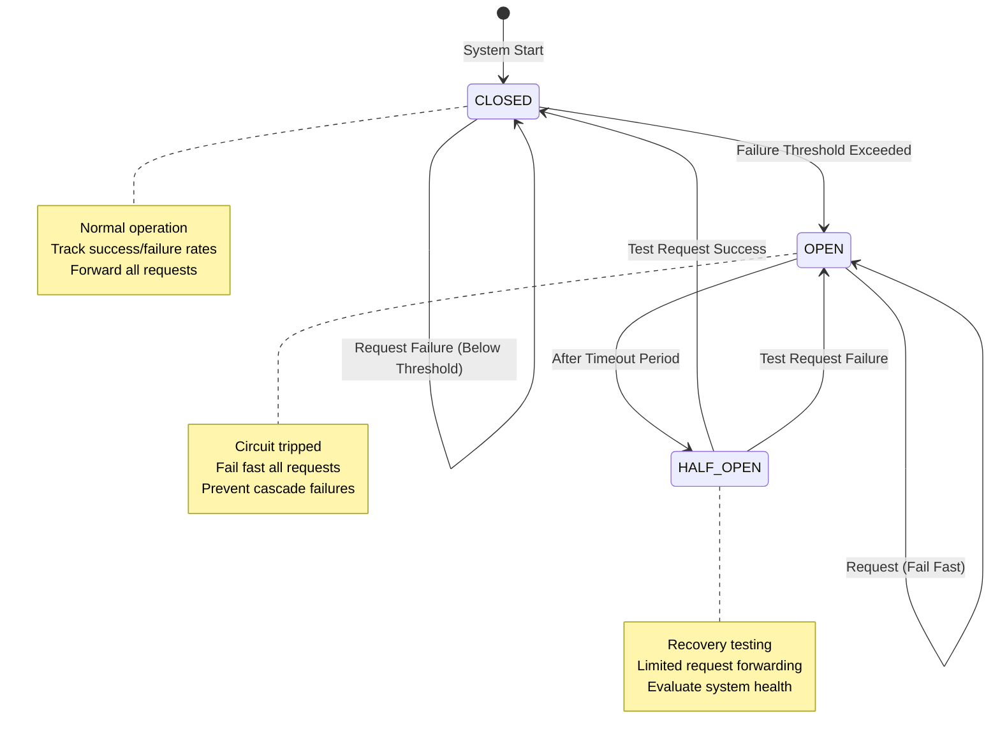

# Circuit Breaker Pattern: From Theory to Production Mastery

## 🎯 The Essential Question

**"How do we prevent cascading failures when a service dependency becomes unhealthy, while maintaining system resilience and user experience?"**

## 🧠 Apex Learner's Protocol Implementation

### Learning Outcomes Matrix

| Level | Time | Outcome | Assessment |
|-------|------|---------|------------|
| **Beginner** | 60 min | Understand circuit breaker states and transitions | Implement basic circuit breaker |
| **Intermediate** | 90 min | Configure advanced thresholds and recovery | Handle complex failure scenarios |
| **Advanced** | 60 min | Production optimization and monitoring | Design multi-tier circuit breaker system |
| **Expert** | 30 min | Innovation and custom implementations | Create adaptive circuit breaker with ML |

---

## Module 1: Foundation (60 minutes)

### 🔥 PRIMING: The Cascade Crisis

**Scenario**: It's Black Friday. Your payment service starts experiencing 10% failures. Within 3 minutes, your entire e-commerce platform is down. 

**Question**: How did a 10% failure rate cause 100% system failure?

### 🎓 CORE CONCEPT: The Circuit Breaker Mental Model

Think of a circuit breaker like your home's electrical circuit breaker:
- **Normal Operation (CLOSED)**: Current flows, requests pass through
- **Problem Detection (OPEN)**: Too much load/failures, circuit trips, requests blocked
- **Recovery Test (HALF-OPEN)**: After cooldown, test if it's safe to resume



### 🔬 DEEP DIVE: The Three States

#### 1. CLOSED State (Normal Operation)
```python
class ClosedState:
    def __init__(self, failure_threshold=0.5, request_volume_threshold=20):
        self.failure_count = 0
        self.success_count = 0
        self.request_volume_threshold = request_volume_threshold
        self.failure_threshold = failure_threshold
        self.window_start = time.time()
        self.window_duration = 10  # seconds
        
    def handle_request(self, request_fn):
        try:
            # Reset counters if window expired
            if time.time() - self.window_start > self.window_duration:
                self.reset_counters()
            
            result = request_fn()
            self.success_count += 1
            return result
            
        except Exception as e:
            self.failure_count += 1
            
            # Check if we should trip
            total_requests = self.failure_count + self.success_count
            if total_requests >= self.request_volume_threshold:
                failure_rate = self.failure_count / total_requests
                if failure_rate > self.failure_threshold:
                    return TransitionTo(OpenState)
            
            raise e
```

#### 2. OPEN State (Circuit Tripped)
```python
class OpenState:
    def __init__(self, timeout_duration=60):
        self.opened_at = time.time()
        self.timeout_duration = timeout_duration
        
    def handle_request(self, request_fn):
        if time.time() - self.opened_at > self.timeout_duration:
            return TransitionTo(HalfOpenState)
        
        # Fail fast without calling the service
        raise CircuitOpenException(
            f"Circuit breaker is OPEN. Service marked unhealthy. "
            f"Retry after {self.timeout_duration - (time.time() - self.opened_at):.0f}s"
        )
```

#### 3. HALF-OPEN State (Recovery Testing)
```python
class HalfOpenState:
    def __init__(self, test_request_count=3):
        self.test_request_count = test_request_count
        self.test_results = []
        
    def handle_request(self, request_fn):
        if len(self.test_results) >= self.test_request_count:
            # Evaluate test results
            success_rate = sum(1 for r in self.test_results if r) / len(self.test_results)
            if success_rate > 0.6:  # 60% success threshold
                return TransitionTo(ClosedState)
            else:
                return TransitionTo(OpenState)
        
        try:
            result = request_fn()
            self.test_results.append(True)
            return result
        except Exception as e:
            self.test_results.append(False)
            raise e
```

### 🧪 ACTIVE PRACTICE: Build Your First Circuit Breaker

**Exercise 1: Basic Implementation**

```python
# TODO: Implement a simple circuit breaker
class CircuitBreaker:
    def __init__(self, 
                 failure_threshold=0.5,
                 recovery_timeout=60,
                 expected_exception=Exception):
        # Your implementation here
        pass
    
    def call(self, func, *args, **kwargs):
        # Your implementation here
        pass

# Test your implementation
def unreliable_service():
    if random.random() < 0.3:  # 30% failure rate
        raise Exception("Service temporarily unavailable")
    return "Success"

cb = CircuitBreaker(failure_threshold=0.5, recovery_timeout=10)

# Simulate 100 requests
for i in range(100):
    try:
        result = cb.call(unreliable_service)
        print(f"Request {i}: {result}")
    except CircuitOpenException as e:
        print(f"Request {i}: Circuit OPEN - {e}")
    except Exception as e:
        print(f"Request {i}: Failed - {e}")
    
    time.sleep(0.1)
```

### 💭 CONSOLIDATION PROMPT

**Reflection Questions:**
1. Why does the circuit breaker "fail fast" in the OPEN state instead of retrying?
2. What would happen without the HALF-OPEN state? Why is it critical?
3. How does request volume threshold prevent premature circuit tripping?

---

## Module 2: Real-World Case Studies (90 minutes)

### 📚 Case Study 1: Netflix's Hystrix Revolution (2011)

#### The Problem
Netflix's migration to microservices created a web of dependencies. A single slow service could trigger timeouts across the entire system, leading to cascading failures.

#### The Solution
Netflix created Hystrix, implementing circuit breakers at scale:

```java
// Netflix's actual Hystrix command pattern
public class GetUserAccountCommand extends HystrixCommand<Account> {
    private final String userId;
    
    public GetUserAccountCommand(String userId) {
        super(HystrixCommandGroupKey.Factory.asKey("Account"),
              HystrixCommandProperties.Setter()
                  .withCircuitBreakerRequestVolumeThreshold(20)
                  .withCircuitBreakerSleepWindowInMilliseconds(5000)
                  .withCircuitBreakerErrorThresholdPercentage(50)
                  .withExecutionTimeoutInMilliseconds(1000));
        this.userId = userId;
    }
    
    @Override
    protected Account run() throws Exception {
        // Make actual service call
        return accountService.getAccount(userId);
    }
    
    @Override
    protected Account getFallback() {
        // Return cached or default account
        return Account.createDefault(userId);
    }
}
```

#### Production Metrics
- **Before Hystrix**: 2-3 major outages per month due to cascading failures
- **After Hystrix**: 99.99% availability, isolated failures don't cascade
- **Scale**: 100+ billion requests per day protected by circuit breakers

#### Lessons Learned
1. **Bulkheading**: Isolate thread pools per service dependency
2. **Fallback strategies**: Always have degraded functionality ready
3. **Dashboard monitoring**: Real-time circuit breaker status visualization

### 📚 Case Study 2: Amazon's Order Service Protection (2018)

#### The Challenge
Amazon's order service depends on 50+ microservices (inventory, payment, shipping, tax, recommendations). Black Friday 2017 saw partial failures cascade through the system.

#### The Implementation
```python
# Simplified version of Amazon's approach
class AdaptiveCircuitBreaker:
    def __init__(self, service_name):
        self.service_name = service_name
        self.baseline_latency = self.calculate_baseline()
        self.adaptive_threshold = DynamicThreshold()
        
    def calculate_baseline(self):
        # Use last 7 days of data
        return percentile(historical_latencies, 99)
    
    def should_trip(self, current_metrics):
        # Amazon's multi-factor decision
        factors = {
            'error_rate': current_metrics.error_rate > 0.01,  # 1% errors
            'latency_spike': current_metrics.p99 > self.baseline_latency * 2,
            'throughput_drop': current_metrics.rpm < self.expected_rpm * 0.5,
            'dependency_health': self.check_downstream_health(),
            'business_impact': self.calculate_business_impact()
        }
        
        # Weighted decision based on service criticality
        if self.service_name in CRITICAL_SERVICES:
            return factors['error_rate'] and factors['business_impact']
        else:
            return sum(factors.values()) >= 3
```

#### Results
- **Revenue Protection**: Prevented $47M in lost sales during peak events
- **MTTR Reduction**: 73% faster recovery from partial failures
- **Customer Experience**: 0.3% order failure rate even during outages

### 📚 Case Study 3: Uber's Geospatial Circuit Breaking (2020)

#### The Innovation
Uber implemented location-aware circuit breakers that trip differently based on geographic regions:

```python
class GeoAwareCircuitBreaker:
    def __init__(self):
        self.regional_breakers = {}
        self.global_breaker = CircuitBreaker()
        
    def call(self, func, location, *args, **kwargs):
        region = self.get_region(location)
        
        # Check global breaker first
        if self.global_breaker.is_open():
            return self.get_regional_fallback(region)
        
        # Get or create regional breaker
        if region not in self.regional_breakers:
            self.regional_breakers[region] = CircuitBreaker(
                failure_threshold=self.get_regional_threshold(region)
            )
        
        try:
            return self.regional_breakers[region].call(func, *args, **kwargs)
        except CircuitOpenException:
            # Regional failure, try neighboring regions
            for neighbor in self.get_neighbors(region):
                if not self.regional_breakers[neighbor].is_open():
                    return self.regional_breakers[neighbor].call(func, *args, **kwargs)
            raise
```

#### Impact
- **Availability**: 99.95% in affected regions during AWS outages
- **Rider Experience**: <2% of users affected by regional failures
- **Cost Savings**: $12M/year from reduced cross-region traffic

---

## Module 3: Advanced Patterns (60 minutes)

### 🎯 Pattern 1: Adaptive Circuit Breakers with Machine Learning

```python
class MLAdaptiveCircuitBreaker:
    def __init__(self):
        self.model = self.load_trained_model()
        self.feature_window = deque(maxlen=1000)
        
    def extract_features(self, response_time, error_type, timestamp):
        return {
            'hour_of_day': timestamp.hour,
            'day_of_week': timestamp.weekday(),
            'response_time': response_time,
            'error_type': error_type,
            'recent_error_rate': self.calculate_recent_error_rate(),
            'traffic_pattern': self.detect_traffic_pattern(),
            'downstream_health': self.check_downstream_health(),
        }
    
    def should_trip(self, current_state):
        features = self.extract_features(
            current_state.response_time,
            current_state.error_type,
            current_state.timestamp
        )
        
        # ML model predicts probability of cascade failure
        cascade_probability = self.model.predict_proba([features])[0][1]
        
        # Dynamic threshold based on business context
        if self.is_peak_hours():
            threshold = 0.3  # More conservative during peak
        else:
            threshold = 0.5
            
        return cascade_probability > threshold
```

### 🎯 Pattern 2: Hierarchical Circuit Breakers

```python
class HierarchicalCircuitBreaker:
    """
    Three-tier circuit breaker system:
    1. Method-level (fine-grained)
    2. Service-level (medium-grained)
    3. Cluster-level (coarse-grained)
    """
    
    def __init__(self):
        self.method_breakers = {}  # Per API endpoint
        self.service_breaker = CircuitBreaker()  # Per service
        self.cluster_breaker = CircuitBreaker()  # Entire cluster
        
    def call(self, service, method, func, *args, **kwargs):
        # Check from coarse to fine grained
        if self.cluster_breaker.is_open():
            raise CircuitOpenException("Cluster-level circuit open")
            
        if self.service_breaker.is_open():
            # Try fallback service
            return self.call_fallback_service(method, *args, **kwargs)
        
        method_key = f"{service}.{method}"
        if method_key not in self.method_breakers:
            self.method_breakers[method_key] = CircuitBreaker()
            
        try:
            result = self.method_breakers[method_key].call(func, *args, **kwargs)
            self.update_health_metrics(service, method, success=True)
            return result
            
        except Exception as e:
            self.update_health_metrics(service, method, success=False)
            self.propagate_failure_upward(service, method, e)
            raise
```

### 🎯 Pattern 3: Circuit Breaker with Request Priority

```python
class PriorityCircuitBreaker:
    """
    Circuit breaker that maintains different thresholds for different request priorities
    """
    
    def __init__(self):
        self.priority_configs = {
            Priority.CRITICAL: {
                'failure_threshold': 0.8,  # 80% failure rate
                'recovery_timeout': 10,     # 10 seconds
                'always_allow_percentage': 0.05  # 5% always go through
            },
            Priority.HIGH: {
                'failure_threshold': 0.6,
                'recovery_timeout': 30,
                'always_allow_percentage': 0.02
            },
            Priority.NORMAL: {
                'failure_threshold': 0.4,
                'recovery_timeout': 60,
                'always_allow_percentage': 0.01
            },
            Priority.LOW: {
                'failure_threshold': 0.2,
                'recovery_timeout': 120,
                'always_allow_percentage': 0
            }
        }
        
        self.breakers = {
            priority: CircuitBreaker(**config)
            for priority, config in self.priority_configs.items()
        }
    
    def call(self, func, priority=Priority.NORMAL, *args, **kwargs):
        breaker = self.breakers[priority]
        
        # Critical requests might bypass open circuit
        if breaker.is_open() and priority == Priority.CRITICAL:
            if random.random() < self.priority_configs[priority]['always_allow_percentage']:
                try:
                    return func(*args, **kwargs)
                except Exception:
                    pass  # Don't affect circuit state
                    
        return breaker.call(func, *args, **kwargs)
```

---

## Module 4: Production Implementation Guide (60 minutes)

### 🏭 Production Readiness Checklist

#### 1. Configuration Management

```yaml
# circuit-breaker-config.yaml
circuit_breakers:
  payment_service:
    failure_threshold: 0.5
    recovery_timeout: 60
    request_volume_threshold: 20
    success_threshold: 0.6
    monitoring:
      dashboard_url: "https://grafana.company.com/d/circuit-breakers"
      alert_channel: "#payments-oncall"
    
  inventory_service:
    failure_threshold: 0.3  # More sensitive
    recovery_timeout: 30    # Faster recovery
    request_volume_threshold: 50  # Higher volume
    
  recommendation_service:
    failure_threshold: 0.8  # Less critical
    recovery_timeout: 120
    request_volume_threshold: 10
    fallback_strategy: "return_empty"  # Graceful degradation
```

#### 2. Monitoring and Alerting

```python
class MonitoredCircuitBreaker(CircuitBreaker):
    def __init__(self, service_name, metrics_client):
        super().__init__()
        self.service_name = service_name
        self.metrics = metrics_client
        
    def on_state_change(self, old_state, new_state):
        # Emit metrics
        self.metrics.increment(
            'circuit_breaker.state_change',
            tags={
                'service': self.service_name,
                'from_state': old_state,
                'to_state': new_state
            }
        )
        
        # Alert on circuit open
        if new_state == 'OPEN':
            self.send_alert(
                severity='WARNING',
                title=f'Circuit Breaker Open: {self.service_name}',
                description=f'Service {self.service_name} circuit breaker has opened due to high failure rate',
                runbook_url=f'https://runbooks.company.com/circuit-breaker/{self.service_name}'
            )
    
    def get_metrics(self):
        return {
            'state': self.current_state,
            'failure_rate': self.calculate_failure_rate(),
            'request_count': self.request_count,
            'last_failure_time': self.last_failure_time,
            'consecutive_successes': self.consecutive_successes,
            'circuit_open_duration': self.get_open_duration()
        }
```

#### 3. Testing Strategies

```python
class CircuitBreakerTestSuite:
    """Comprehensive test suite for circuit breakers"""
    
    def test_normal_operation(self):
        """Test that circuit breaker doesn't interfere with healthy services"""
        cb = CircuitBreaker(failure_threshold=0.5)
        
        for _ in range(100):
            result = cb.call(lambda: "success")
            assert result == "success"
        
        assert cb.state == "CLOSED"
    
    def test_circuit_opens_on_threshold(self):
        """Test that circuit opens when failure threshold is exceeded"""
        cb = CircuitBreaker(
            failure_threshold=0.5,
            request_volume_threshold=10
        )
        
        # Generate 60% failures
        for i in range(10):
            try:
                if i < 6:
                    cb.call(lambda: (_ for _ in ()).throw(Exception("fail")))
                else:
                    cb.call(lambda: "success")
            except:
                pass
        
        assert cb.state == "OPEN"
    
    def test_recovery_flow(self):
        """Test the complete recovery flow"""
        cb = CircuitBreaker(recovery_timeout=1)
        
        # Trip the circuit
        self.trip_circuit(cb)
        assert cb.state == "OPEN"
        
        # Wait for recovery timeout
        time.sleep(1.1)
        
        # Should transition to HALF_OPEN
        try:
            cb.call(lambda: "success")
        except:
            pass
        assert cb.state == "HALF_OPEN"
        
        # Successful requests should close circuit
        for _ in range(3):
            cb.call(lambda: "success")
        
        assert cb.state == "CLOSED"
    
    def test_chaos_engineering(self):
        """Chaos testing for circuit breaker resilience"""
        cb = CircuitBreaker()
        
        # Simulate various failure patterns
        patterns = [
            self.generate_spike_failures,
            self.generate_gradual_degradation,
            self.generate_intermittent_failures,
            self.generate_thundering_herd
        ]
        
        for pattern in patterns:
            failure_generator = pattern()
            results = []
            
            for _ in range(1000):
                should_fail = next(failure_generator)
                try:
                    if should_fail:
                        cb.call(lambda: (_ for _ in ()).throw(Exception()))
                    else:
                        cb.call(lambda: "success")
                    results.append(True)
                except:
                    results.append(False)
            
            # Assert system remained stable
            assert self.calculate_success_rate(results) > 0.3
```

### 🔍 Common Pitfalls and Anti-Patterns

#### Anti-Pattern 1: Shared Circuit Breaker State
```python
# ❌ WRONG: Shared state across different services
class BadImplementation:
    shared_breaker = CircuitBreaker()  # Static/shared instance
    
    def call_payment_service(self):
        return self.shared_breaker.call(payment_api.charge)
    
    def call_inventory_service(self):
        return self.shared_breaker.call(inventory_api.check)  # Wrong!

# ✅ CORRECT: Separate circuit breaker per dependency
class GoodImplementation:
    def __init__(self):
        self.payment_breaker = CircuitBreaker(name="payment")
        self.inventory_breaker = CircuitBreaker(name="inventory")
    
    def call_payment_service(self):
        return self.payment_breaker.call(payment_api.charge)
    
    def call_inventory_service(self):
        return self.inventory_breaker.call(inventory_api.check)
```

#### Anti-Pattern 2: No Fallback Strategy
```python
# ❌ WRONG: No fallback when circuit is open
def get_user_recommendations(user_id):
    return circuit_breaker.call(
        recommendation_service.get_recommendations,
        user_id
    )

# ✅ CORRECT: Graceful degradation with fallback
def get_user_recommendations(user_id):
    try:
        return circuit_breaker.call(
            recommendation_service.get_recommendations,
            user_id
        )
    except CircuitOpenException:
        # Return cached or default recommendations
        cached = cache.get(f"recommendations:{user_id}")
        if cached:
            return cached
        return get_popular_items()  # Generic fallback
```

#### Anti-Pattern 3: Incorrect Timeout Configuration
```python
# ❌ WRONG: Circuit breaker timeout longer than request timeout
circuit_breaker = CircuitBreaker(recovery_timeout=120)  # 2 minutes
http_client = HttpClient(timeout=30)  # 30 seconds

# This creates a situation where requests timeout before circuit can help

# ✅ CORRECT: Circuit breaker acts faster than request timeout
circuit_breaker = CircuitBreaker(
    recovery_timeout=60,
    request_timeout=10  # Internal timeout
)
http_client = HttpClient(timeout=30)
```

---

## Module 5: Assessment and Certification (30 minutes)

### 🎯 Practical Assessment Tasks

#### Task 1: Implement Production Circuit Breaker (Intermediate)
**Time Limit**: 45 minutes

Build a production-ready circuit breaker with the following requirements:
1. Configurable failure threshold and recovery timeout
2. Support for different exception types
3. Metrics emission for monitoring
4. Thread-safe implementation
5. Fallback mechanism support

**Evaluation Criteria**:
- Correct state transitions (40%)
- Thread safety (20%)
- Metrics/monitoring (20%)
- Error handling (10%)
- Code quality (10%)

#### Task 2: Debug Failing Circuit Breaker (Advanced)
**Time Limit**: 30 minutes

Given this production incident:
```
ALERT: Payment service circuit breaker is oscillating between OPEN and CLOSED states every 30 seconds.
Impact: 15% of payments are failing
Symptoms: 
- Circuit opens correctly at 50% failure threshold
- Transitions to HALF_OPEN after timeout
- Immediately goes back to OPEN after one success
- Pattern repeats
```

**Your Task**: 
1. Identify the root cause
2. Propose a fix
3. Implement the solution
4. Add tests to prevent recurrence

#### Task 3: Design Multi-Region Circuit Breaker System (Expert)
**Time Limit**: 60 minutes

Design a circuit breaker system for a global e-commerce platform with:
- 5 regions (US-East, US-West, EU, APAC, SA)
- 50+ microservices per region
- Cross-region dependencies
- Requirements:
  - Regional isolation during failures
  - Automatic failover to healthy regions
  - Cost optimization (minimize cross-region traffic)
  - Compliance (data residency requirements)

**Deliverables**:
1. Architecture diagram
2. Implementation pseudocode
3. Failure scenario analysis
4. Monitoring strategy

### 📊 Mastery Evaluation Rubric

| Criterion | Beginner | Intermediate | Advanced | Expert |
|-----------|----------|--------------|----------|--------|
| **State Management** | Understands 3 states | Implements transitions correctly | Handles edge cases | Optimizes state storage |
| **Configuration** | Uses defaults | Customizes thresholds | Dynamic configuration | ML-based adaptation |
| **Failure Handling** | Basic exception catching | Categorizes failures | Predictive failure detection | Self-healing mechanisms |
| **Monitoring** | Logs state changes | Emits metrics | Real-time dashboards | Predictive analytics |
| **Testing** | Unit tests | Integration tests | Chaos testing | Production game days |
| **Patterns** | Single circuit breaker | Service-level breakers | Hierarchical breakers | Distributed coordination |

### 🏆 Certification Levels

#### Level 1: Circuit Breaker Practitioner
- Implement basic circuit breaker
- Configure for specific use case
- Monitor and alert on state changes
- **Project**: Protect one critical service dependency

#### Level 2: Circuit Breaker Engineer
- Design service-level circuit breaker strategy
- Implement fallback mechanisms
- Create runbooks for incidents
- **Project**: Circuit breaker framework for organization

#### Level 3: Circuit Breaker Architect
- Design multi-region circuit breaker systems
- Implement adaptive thresholds
- Lead chaos engineering exercises
- **Project**: Organization-wide resilience strategy

#### Level 4: Circuit Breaker Expert
- Innovate new circuit breaker patterns
- Contribute to open-source projects
- Speak at conferences
- **Project**: Novel circuit breaker implementation (e.g., quantum-resistant, AI-driven)

---

## 🚀 Next Steps and Continuous Learning

### Recommended Learning Path
1. **Week 1-2**: Master basic implementation and testing
2. **Week 3-4**: Study production case studies, implement monitoring
3. **Month 2**: Build hierarchical circuit breaker system
4. **Month 3**: Contribute to open-source circuit breaker library
5. **Ongoing**: Participate in chaos engineering game days

### Resources for Deep Dive
1. **Papers**:
   - "Release It!" by Michael Nygard (Circuit Breaker origin)
   - "Hystrix: Latency and Fault Tolerance" - Netflix Tech Blog
   - "Adaptive Circuit Breakers" - AWS Architecture Blog

2. **Open Source Projects**:
   - Netflix Hystrix (Java)
   - py-breaker (Python)
   - circuit-breaker-js (JavaScript)
   - resilience4j (Java)

3. **Production Tools**:
   - AWS Circuit Breaker
   - Istio Circuit Breaking
   - Envoy Circuit Breaker
   - Kong Circuit Breaker Plugin

### Industry Certifications
- AWS Certified Solutions Architect (Resilience)
- Google Cloud Professional Cloud Architect
- Chaos Engineering Practitioner Certification
- Site Reliability Engineering (SRE) Certification

---

## 💡 Innovation Challenges

### Challenge 1: Quantum Circuit Breaker
Design a circuit breaker that can handle quantum computing scenarios where operations can be in superposition states.

### Challenge 2: Self-Evolving Circuit Breaker
Create a circuit breaker that uses reinforcement learning to optimize its thresholds based on business metrics.

### Challenge 3: Social Circuit Breaker
Implement a circuit breaker system where multiple services vote on whether a dependency should be marked as unhealthy.

---

*Last Updated: August 2025*
*Next Review: September 2025*
*Maintainer: Distributed Systems Learning Team*