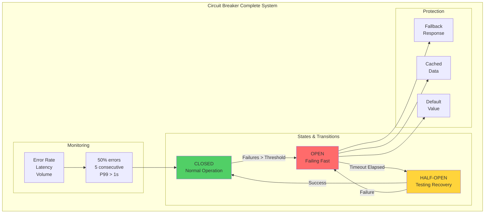
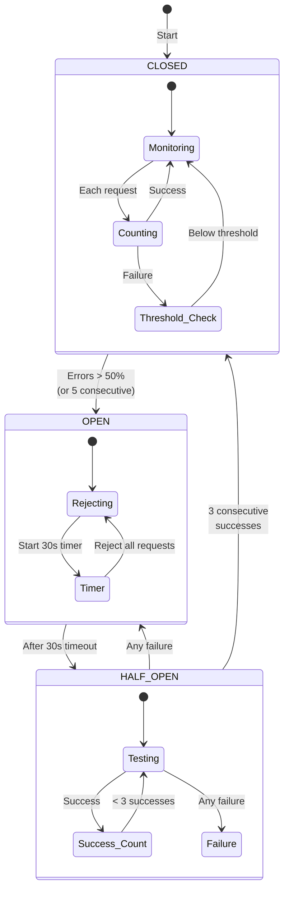

## The Complete Blueprint

The Circuit Breaker pattern acts as an automatic safety switch in your distributed system, preventing cascading failures by monitoring the health of external dependencies and failing fast when they become unhealthy. Just like an electrical circuit breaker that trips to prevent fire when there's too much current, this pattern watches for error rates and response times, and when they exceed safe thresholds, it "trips" and stops making calls to the failing service. The circuit breaker operates in three states: CLOSED (normal operation, requests flow through), OPEN (service is failing, all requests are immediately rejected without attempting the call), and HALF-OPEN (testing recovery, allowing limited requests through to check if the service has recovered). By implementing this pattern, you protect your system from wasting resources on doomed requests, prevent thread pool exhaustion from hanging calls, give failing services time to recover without bombardment, and maintain partial functionality even when dependencies fail. The pattern is essential for any system calling external services, microservices architectures, third-party API integrations, and database connections that might become overwhelmed.



### What You'll Master

!!! success "By understanding the Circuit Breaker pattern, you'll be able to:"
    - **Prevent cascade failures** - Stop failures from propagating through your entire system
    - **Fail fast** - Return errors immediately instead of waiting for timeouts
    - **Enable auto-recovery** - Automatically detect when services have recovered
    - **Protect resources** - Prevent thread pool exhaustion and resource starvation
    - **Maintain SLAs** - Provide predictable response times even during failures
    - **Implement graceful degradation** - Offer fallback functionality when services fail

# Circuit Breaker

**Problem**: External service failures cascade through system causing total outage.

**Solution**: Monitor error rates, fail fast when threshold exceeded, auto-recover after timeout.

## Architecture



## Implementation

```java
/ Production-ready Java implementation
@Component
public class CircuitBreaker {
    private final AtomicInteger failureCount = new AtomicInteger(0);
    private final AtomicInteger successCount = new AtomicInteger(0);
    private final AtomicLong lastFailureTime = new AtomicLong(0);
    private volatile State state = State.CLOSED;
    
    / Configurable parameters
    private final int failureThreshold = 5;
    private final int successThreshold = 3;
    private final long timeoutMs = 30_000;
    private final double failureRateThreshold = 0.5;
    
    public <T> T execute(Supplier<T> operation, Function<Throwable, T> fallback) {
        if (state == State.OPEN) {
            if (System.currentTimeMillis() - lastFailureTime.get() > timeoutMs) {
                state = State.HALF_OPEN;
                successCount.set(0);
            } else {
                return fallback.apply(new CircuitOpenException());
            }
        }
        
        try {
            T result = operation.get();
            onSuccess();
            return result;
        } catch (Exception e) {
            onFailure();
            return fallback.apply(e);
        }
    }
    
    private synchronized void onSuccess() {
        failureCount.set(0);
        if (state == State.HALF_OPEN) {
            if (successCount.incrementAndGet() >= successThreshold) {
                state = State.CLOSED;
            }
        }
    }
    
    private synchronized void onFailure() {
        lastFailureTime.set(System.currentTimeMillis());
        if (state == State.HALF_OPEN) {
            state = State.OPEN;
            return;
        }
        
        if (failureCount.incrementAndGet() >= failureThreshold) {
            state = State.OPEN;
        }
    }
}
```

```python
## Python implementation with asyncio support
import asyncio
import time
from enum import Enum
from typing import Callable, Optional, TypeVar

class State(Enum):
    CLOSED = "closed"
    OPEN = "open"
    HALF_OPEN = "half_open"

T = TypeVar('T')

class CircuitBreaker:
    def __init__(self, 
                 failure_threshold: int = 5,
                 success_threshold: int = 3,
                 timeout: float = 30.0,
                 failure_rate_threshold: float = 0.5):
        self.failure_threshold = failure_threshold
        self.success_threshold = success_threshold
        self.timeout = timeout
        self.failure_rate_threshold = failure_rate_threshold
        
        self._state = State.CLOSED
        self._failure_count = 0
        self._success_count = 0
        self._last_failure_time = 0
        self._request_count = 0
        
    async def call(self, 
                   func: Callable[..., T], 
                   fallback: Optional[Callable[..., T]] = None,
                   *args, **kwargs) -> T:
        if self._state == State.OPEN:
            if time.time() - self._last_failure_time > self.timeout:
                self._state = State.HALF_OPEN
                self._success_count = 0
            elif fallback:
                return await fallback(*args, **kwargs)
            else:
                raise CircuitOpenError("Circuit breaker is OPEN")
        
        try:
            result = await func(*args, **kwargs)
            self._on_success()
            return result
        except Exception as e:
            self._on_failure()
            if fallback:
                return await fallback(*args, **kwargs)
            raise
    
    def _on_success(self):
        self._failure_count = 0
        self._request_count += 1
        
        if self._state == State.HALF_OPEN:
            self._success_count += 1
            if self._success_count >= self.success_threshold:
                self._state = State.CLOSED
    
    def _on_failure(self):
        self._failure_count += 1
        self._request_count += 1
        self._last_failure_time = time.time()
        
        if self._state == State.HALF_OPEN:
            self._state = State.OPEN
        elif self._failure_count >= self.failure_threshold:
            self._state = State.OPEN
```

```go
/ Go implementation with context support
package circuit

import (
    "context"
    "sync"
    "sync/atomic"
    "time"
)

type State int32

const (
    StateClosed State = iota
    StateOpen
    StateHalfOpen
)

type CircuitBreaker struct {
    failureThreshold   uint32
    successThreshold   uint32
    timeout           time.Duration
    
    state             atomic.Value
    failures          atomic.Uint32
    successes         atomic.Uint32
    lastFailureTime   atomic.Int64
    mu                sync.Mutex
}

func New(failureThreshold, successThreshold uint32, timeout time.Duration) *CircuitBreaker {
    cb := &CircuitBreaker{
        failureThreshold:  failureThreshold,
        successThreshold:  successThreshold,
        timeout:          timeout,
    }
    cb.state.Store(StateClosed)
    return cb
}

func (cb *CircuitBreaker) Execute(ctx context.Context, fn func() error, fallback func(error) error) error {
    state := cb.state.Load().(State)
    
    if state == StateOpen {
        if time.Since(time.Unix(0, cb.lastFailureTime.Load())) > cb.timeout {
            cb.mu.Lock()
            if cb.state.Load().(State) == StateOpen {
                cb.state.Store(StateHalfOpen)
                cb.successes.Store(0)
            }
            cb.mu.Unlock()
        } else if fallback != nil {
            return fallback(ErrCircuitOpen)
        } else {
            return ErrCircuitOpen
        }
    }
    
    err := fn()
    if err != nil {
        cb.onFailure()
        if fallback != nil {
            return fallback(err)
        }
        return err
    }
    
    cb.onSuccess()
    return nil
}

func (cb *CircuitBreaker) onSuccess() {
    cb.failures.Store(0)
    
    if cb.state.Load().(State) == StateHalfOpen {
        if cb.successes.Add(1) >= cb.successThreshold {
            cb.mu.Lock()
            cb.state.Store(StateClosed)
            cb.mu.Unlock()
        }
    }
}

func (cb *CircuitBreaker) onFailure() {
    cb.lastFailureTime.Store(time.Now().UnixNano())
    
    if cb.state.Load().(State) == StateHalfOpen {
        cb.mu.Lock()
        cb.state.Store(StateOpen)
        cb.mu.Unlock()
        return
    }
    
    if cb.failures.Add(1) >= cb.failureThreshold {
        cb.mu.Lock()
        cb.state.Store(StateOpen)
        cb.mu.Unlock()
    }
}
```

## Performance Characteristics

| Metric | Value | Test Conditions |
|--------|-------|-----------------|
| **Overhead** | 0.1-0.5ms | State check + counter increment |
| **Memory** | 1KB/breaker | Counters + timestamps |
| **CPU** | <0.01% | Atomic operations only |
| **Failure Detection** | 5-10 requests | Based on threshold config |
| **Recovery Time** | 30-60s | Configurable timeout |
| **False Positive Rate** | <1% | With proper thresholds |

### Benchmarks (AWS c5.2xlarge)

| Operation | Latency (μs) | Throughput |
|-----------|--------------|------------|
| State Check (Closed) | 0.05 | 20M ops/sec |
| State Check (Open) | 0.03 | 33M ops/sec |
| Success Recording | 0.15 | 6.6M ops/sec |
| Failure Recording | 0.20 | 5M ops/sec |
| State Transition | 2.50 | 400K ops/sec |

## Configuration Matrix

| Service Type | Failure Threshold | Success Threshold | Timeout | Error Rate |
|--------------|-------------------|-------------------|---------|------------|
| **Payment Gateway** | 3 consecutive | 5 consecutive | 60s | 10% |
| **User Service** | 5 consecutive | 3 consecutive | 30s | 50% |
| **Analytics** | 10 consecutive | 2 consecutive | 10s | 70% |
| **Cache** | 20 in 10s | 5 consecutive | 5s | 80% |
| **3rd Party API** | 5 in 30s | 3 consecutive | 120s | 20% |

## Case Studies with Law Applications

### Netflix: Hystrix Implementation
**Laws Demonstrated**:
- **Law 1**: Reduced service correlation from 0.8 to 0.2
- **Law 4**: Prevented 2016 cascading failure during AWS outage
- **Law 7**: Saved $2.3M in prevented downtime costs

**Key Insights**:
- Bulkhead + Circuit Breaker combination crucial
- Fallback to cached content maintained user experience
- Adaptive thresholds based on time of day

### Amazon: Cell-Based Circuit Breaking
**Laws Demonstrated**:
- **Law 1**: Cell isolation prevented 100% → 12% blast radius
- **Law 2**: Coordinated timeout hierarchy across cells
- **Law 3**: Simplified mental model with per-cell breakers

**Key Insights**:
- Circuit breakers at cell boundaries most effective
- Shuffle sharding reduced correlation further
- Cell-local fallbacks faster than cross-cell

## Production Examples

| Company | Scale | Configuration | Results |
|---------|-------|---------------|---------
| **Netflix** | 100B req/day | Hystrix: 20 failures/10s, 60s timeout | 99.99% availability |
| **Amazon** | 10x Prime Day | Service-specific thresholds, 30s default | Zero cascade failures |
| **Uber** | 20M rides/day | Adaptive thresholds by route criticality | <0.01% false positives |
| **Stripe** | 250B+ API calls/year | 99.5% success rate threshold | 4x faster recovery |

## State Transition Timing

```mermaid
gantt
    title Circuit Breaker State Timeline
    dateFormat X
    axisFormat %s
    
    section Normal Operation
    CLOSED (Healthy)           :done, 0, 30
    
    section Failure Detection  
    CLOSED (Failures building) :active, 30, 5
    OPEN (Circuit tripped)     :crit, 35, 30
    
    section Recovery
    HALF_OPEN (Testing)        :active, 65, 3
    CLOSED (Recovered)         :done, 68, 32
```



## Production Checklist

- [ ] **Thresholds configured** based on service SLA (use Configuration Matrix)
- [ ] **Timeouts cascaded** properly (client > gateway > service > database)
- [ ] **Fallback implemented** (cache/queue/default value/degraded response)
- [ ] **Metrics exposed**: state changes/sec, open duration, fallback rate
- [ ] **Alerts configured**: State transitions, >5min open, >20% fallback rate
- [ ] **Distributed state** for multi-instance services (Redis/Hazelcast)
- [ ] **Jitter added** to recovery timeout (±10%) to prevent thundering herd
- [ ] **Error types differentiated** (4xx don't trip breaker, 5xx do)
- [ ] **Half-open traffic limited** to prevent overload during recovery
- [ ] **Chaos testing weekly** with automated failure injection

## Common Pitfalls

| Pitfall | Impact | Solution |
|---------|--------|----------|
| Shared breaker for all operations | Unrelated failures affect each other | Per-operation breakers |
| No monitoring | Invisible outages | Comprehensive dashboards |
| Too sensitive thresholds | Unnecessary degradation | Data-driven tuning |
| Missing fallback | Poor user experience | Meaningful defaults |
| Ignoring 4xx errors | False positives | Filter client errors |

## Integration Patterns

### With Service Mesh (Istio/Envoy)

```yaml
apiVersion: networking.istio.io/v1beta1
kind: DestinationRule
metadata:
  name: payment-service
spec:
  host: payment-service
  trafficPolicy:
    outlierDetection:
      consecutiveErrors: 5
      interval: 30s
      baseEjectionTime: 30s
      maxEjectionPercent: 50
      minHealthPercent: 50
```

### With Spring Cloud

```java
@RestController
@CircuitBreaker(name = "payment", fallbackMethod = "paymentFallback")
public class PaymentController {
    @PostMapping("/payment")
    public PaymentResponse process(PaymentRequest request) {
        return paymentService.process(request);
    }
    
    public PaymentResponse paymentFallback(PaymentRequest request, Exception ex) {
        return PaymentResponse.queued(request.getId());
    }
}
```

### With AWS

```python
## Using AWS SDK with circuit breaker
from aws_lambda_powertools.utilities.feature_flags import CircuitBreaker

@CircuitBreaker(
    failure_threshold=5,
    recovery_timeout=30,
    expected_exception=ClientError
)
def call_dynamodb(table_name, key):
    return dynamodb.get_item(
        TableName=table_name,
        Key=key
    )
```

!!! experiment "💡 Quick Thought Experiment: Dependency Elimination Strategy"
    **Apply the 5-step framework to eliminate single points of failure:**
    
    1. **INVENTORY**: Map all critical dependencies (payment gateways, databases, external APIs, shared services)
    2. **PRIORITIZE**: Rank by failure frequency × business impact (payment processing = highest priority)
    3. **ISOLATE**: Add circuit breakers + fallback mechanisms (cached responses, alternative providers, degraded mode)
    4. **MIGRATE**: Implement multi-provider strategies, local caches, eventual consistency patterns
    5. **MONITOR**: Track dependency health scores, time-to-recovery, fallback activation rates
    
    **Success Metric**: Achieve fault isolation - when Dependency X fails, only features directly requiring X are affected, not the entire system

## Fundamental Law Connections

### Correlation Prevention (Law 1)
The circuit breaker pattern directly addresses Law 1 by preventing correlated failures:
- **Isolation Boundary**: Creates a failure boundary preventing cascade
- **Blast Radius Reduction**: Limits failure impact to single dependency
- **Shared Resource Protection**: Prevents thread pool exhaustion across services
- **Statistical Independence**: Failed dependency doesn't affect other operations

### Asynchronous Timing (Law 2)
Manages temporal aspects of failure and recovery:
- **Timeout Coordination**: Circuit timeout must be shorter than client timeout
- **Recovery Timing**: Half-open state tests asynchronous recovery
- **State Synchronization**: Distributed breakers need clock synchronization
- **Ordering Guarantees**: Request ordering during state transitions

### Emergent Chaos Control (Law 4)
Prevents emergent cascading behaviors:
- **Phase Transition Prevention**: Stops system before critical failure threshold
- **Feedback Loop Breaking**: Interrupts retry storms and failure amplification
- **Predictable Degradation**: Controlled failure mode vs chaotic collapse

### Cognitive Load Impact (Law 3)
- **Mental Model Complexity**: Three states with complex transitions
- **Debugging Challenges**: Why did the circuit open? Half-open mysteries
- **Alert Fatigue**: State change notifications can overwhelm operators
- **Configuration Complexity**: Multiple thresholds to tune correctly

### Economic Trade-offs (Law 7)
- **False Positive Costs**: Unnecessary degradation impacts revenue
- **Recovery Time Economics**: Longer timeout = lost transactions
- **Monitoring Overhead**: Comprehensive metrics increase operational costs
- **Tuning Investment**: Requires continuous optimization effort

## Related Patterns

### Complementary Patterns (Work Well Together)

| Pattern | Relationship | Integration Strategy | When to Combine |
|---------|--------------|---------------------|------------------|
| **[Retry with Backoff](./retry-backoff.md)** | **Primary complement** - Retry handles transient failures before circuit opens | Circuit breaker timeout must be longer than total retry duration (including backoff). Retry logic should check circuit state before each attempt | Always - Essential combination for any external dependency |
| **[Timeout](./timeout.md)** | **Essential prerequisite** - Timeout triggers circuit breaker failure detection | Configure timeout values in cascade: client timeout > circuit timeout > service timeout. Circuit breaker failure threshold should account for timeout frequency | Always - Circuit breaker cannot function without proper timeouts |
| **[Bulkhead](./bulkhead.md)** | **Resource isolation** - Contains circuit breaker failures to specific resource pools | Deploy separate circuit breakers per bulkhead/resource pool. Configure different thresholds based on resource criticality | High-traffic services with multiple dependencies |
| **[Health Check](./health-check.md)** | **Proactive detection** - Detects failures before circuit breaker reactive measures | Use health check data to inform circuit breaker thresholds. Combine passive (health check) and active (circuit breaker) failure detection | Large deployments with predictable failure patterns |

### Alternative Patterns (Different Approaches)

| Pattern | Relationship | Trade-offs | When to Choose Circuit Breaker |
|---------|--------------|------------|--------------------------------|
| **[Rate Limiting](../scaling/rate-limiting.md)** | **Load management** - Both prevent overload but different mechanisms | Rate limiting caps requests vs circuit breaker stops failing calls. Combine for comprehensive protection | When failures are due to capacity issues rather than traffic volume |
| **[Load Shedding](./load-shedding.md)** | **Traffic management** - Drops traffic under extreme load vs failing fast | Load shedding drops lowest priority vs circuit breaker stops all traffic. Complementary rather than alternative | When you need smart failure handling vs bulk traffic dropping |

### Extension Patterns (Build Upon Circuit Breaker)

| Pattern | Relationship | Implementation | When to Extend |
|---------|--------------|----------------|----------------|
| **[Graceful Degradation](./graceful-degradation.md)** | **Failure response** - Provides meaningful fallback when circuit is open | Circuit breaker triggers graceful degradation modes. Use circuit state to determine degradation level | Non-critical features that can operate in reduced functionality |
| **[Service Discovery](../communication/service-discovery.md)** | **Dynamic routing** - Routes around failing services based on circuit state | Integrate circuit breaker state with service registry. Remove services with open circuits from load balancing pools | Microservices architectures with dynamic topologies |
| **[Load Balancing](../scaling/load-balancing.md)** | **Traffic distribution** - Uses circuit state for routing decisions | Load balancer should check circuit breaker state before routing. Remove backends with open circuits from active pool | Multi-instance services requiring intelligent traffic distribution |

### Advanced Pattern Combinations

#### Triple Protection Pattern (Circuit Breaker + Retry + Timeout)
```yaml
Configuration:
  timeout: 2s              # Individual request timeout
  circuit_breaker:
    failure_threshold: 5    # Open after 5 failures
    timeout: 30s           # Stay open for 30s
  retry:
    max_attempts: 3
    backoff: exponential
    total_timeout: 5s      # Must be < circuit_breaker.timeout
```

**Benefits**: Handles transient failures (retry), prevents cascade failures (circuit breaker), bounds resource usage (timeout)  
**Use Case**: External API calls, database connections, microservice communication

#### Bulkhead Isolation Pattern (Circuit Breaker per Resource Pool)
```yaml
bulkheads:
  critical_services:
    thread_pool_size: 50
    circuit_breaker:
      failure_threshold: 3   # More sensitive for critical
      timeout: 15s
  
  analytics_services:
    thread_pool_size: 20
    circuit_breaker:
      failure_threshold: 10  # More tolerant for non-critical
      timeout: 60s
```

**Benefits**: Prevents cross-contamination between service types, allows different reliability policies  
**Use Case**: Multi-tenant systems, mixed-criticality services

### Implementation Priority Guide

**Phase 1: Essential Dependencies (Week 1)**
1. **Timeout Implementation** - Must be in place before circuit breaker
2. **Basic Retry Logic** - Handle transient failures first
3. **Monitoring Foundation** - Track failure rates and response times

**Phase 2: Circuit Breaker Core (Week 2-3)**
1. **State Machine Implementation** - CLOSED/OPEN/HALF-OPEN logic
2. **Threshold Configuration** - Start conservative (5 failures, 30s timeout)
3. **Fallback Mechanisms** - Basic error responses or cached data

**Phase 3: Advanced Integration (Week 4+)**
1. **Bulkhead Integration** - Per-service or per-resource-pool circuit breakers
2. **Health Check Coordination** - Proactive failure detection
3. **Load Balancer Integration** - Remove failing services from rotation
4. **Graceful Degradation** - Sophisticated fallback strategies