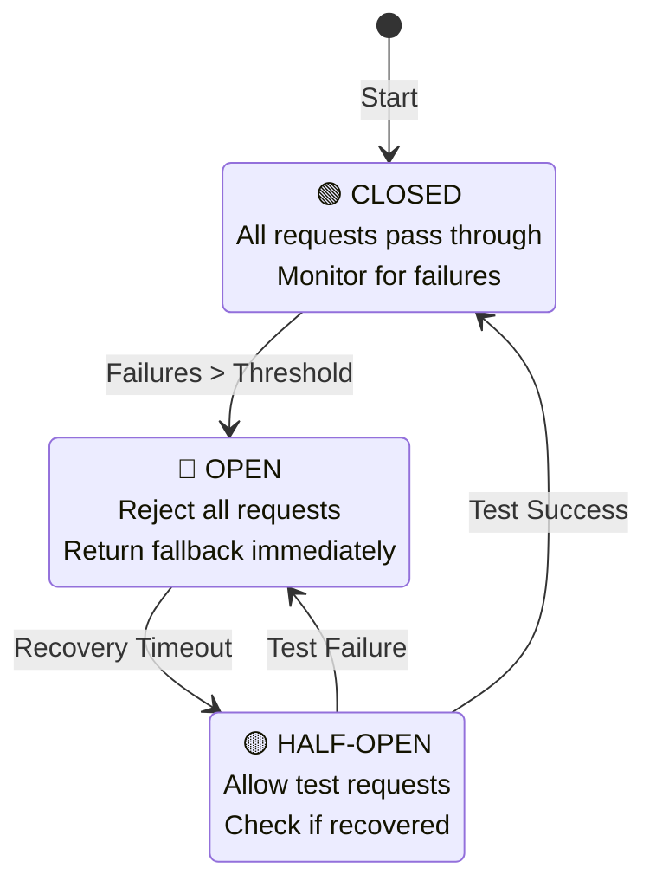
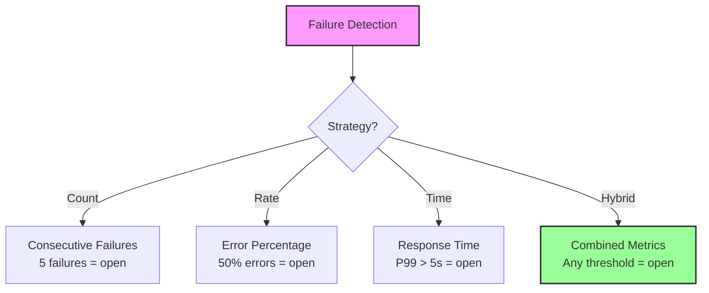
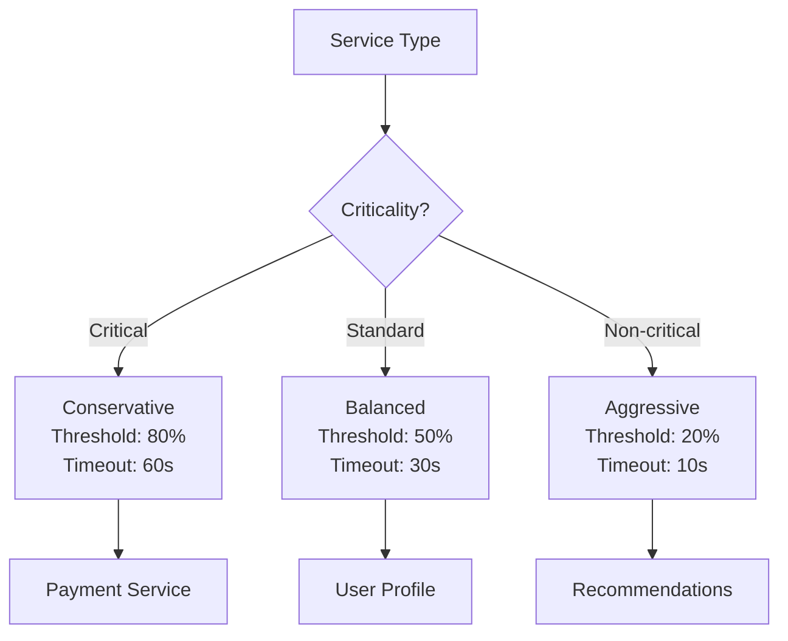
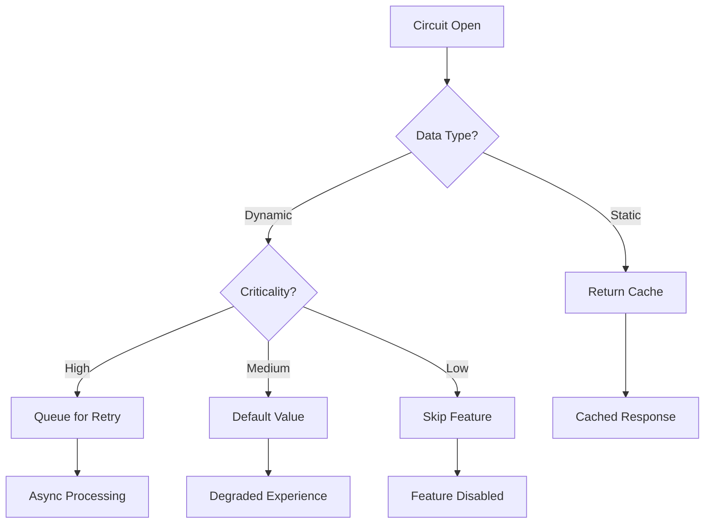
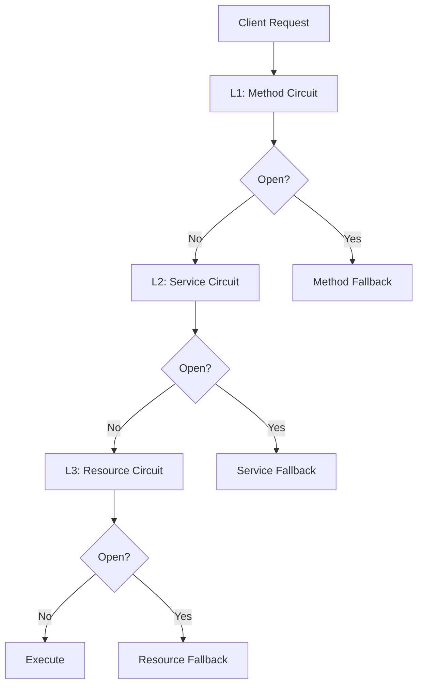
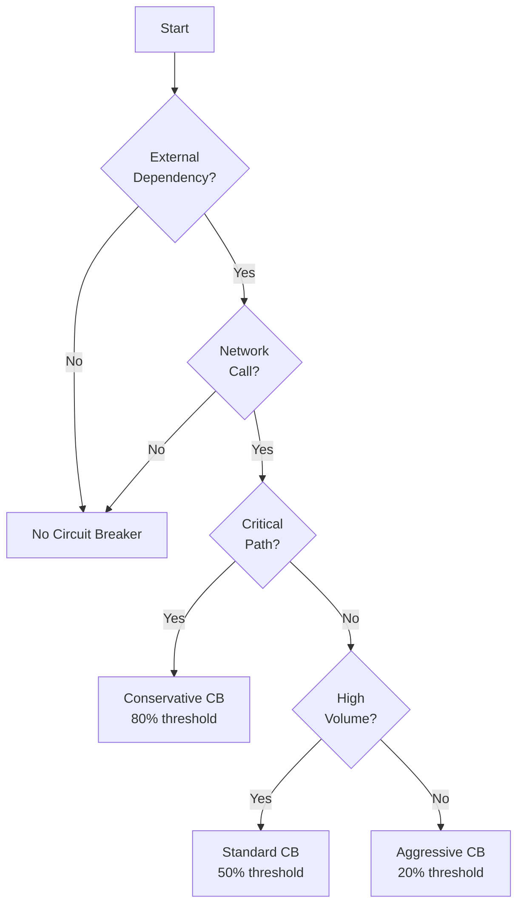

# Circuit Breaker Pattern

!!! success "🏆 Gold Standard Pattern"
    **Industry Champion** • Netflix, Amazon, Uber proven at 100B+ scale
    
    Essential for production systems with external dependencies. Prevents cascade failures through intelligent failure detection and recovery. Battle-tested at internet scale with mature implementations.

## Essential Question
**How do we detect service failures quickly and prevent cascade failures from spreading through the system?**

## When to Use / When NOT to Use

### Use When
| Scenario | Example | Impact |
|----------|---------|--------|
| External API calls | Payment gateway | Prevent cascade failures |
| Microservice communication | Service mesh | Fast failure detection |
| Database connections | Connection pools | Resource protection |
| Third-party integrations | Cloud services | Automatic recovery |
| High-traffic services | User-facing APIs | Maintain availability |

### DON'T Use When
| Scenario | Why | Alternative |
|----------|-----|-------------|
| Internal method calls | No network involved | Simple error handling |
| CPU-bound operations | Not about external failures | Thread management |
| Simple applications | Overhead not justified | Basic try-catch |
| Dev/test environments | Complex setup | Mock failures |
| Stateless operations | No resource exhaustion | Direct retry |

## Level 1: Intuition (5 min)

### The Electrical Circuit Breaker
<div class="axiom-box">
Like your home's electrical panel that trips to prevent fires, software circuit breakers trip to prevent system-wide failures. When electricity overloads, the breaker opens to stop flow. When service calls fail repeatedly, the circuit opens to stop wasted attempts.
</div>

### State Machine Visualization


### Core Value
**Without Circuit Breaker**: Cascading timeouts → Resource exhaustion → Total system failure  
**With Circuit Breaker**: Fast failure → Resource protection → Partial degradation only

## Level 2: Foundation (10 min)

### Configuration Parameters
| Parameter | Purpose | Typical Value | Production Example |
|-----------|---------|---------------|-------------------|
| **Failure Threshold** | Failures before opening | 5-10 failures or 50% | Netflix: 20 failures/10s |
| **Recovery Timeout** | Wait before testing | 30-60 seconds | Amazon: 30s default |
| **Success Threshold** | Successes to close | 2-5 consecutive | Uber: 3 successes |
| **Request Volume** | Minimum traffic | 20 requests/window | Stripe: 100 req/min |

### Failure Detection Strategies


### State Behavior Table
| State | Request Handling | Monitoring | Transition Trigger |
|-------|-----------------|------------|-------------------|
| **CLOSED** | Pass through | Count failures | Threshold exceeded → OPEN |
| **OPEN** | Reject immediately | Wait timer | Timeout elapsed → HALF-OPEN |
| **HALF-OPEN** | Limited pass | Test results | Success → CLOSED, Fail → OPEN |

## Level 3: Deep Dive (15 min)

### Threshold Configuration Guide


### Common Implementation Patterns

#### 1. Distributed Circuit Breaker
```yaml
# Shared state across instances
circuit_breaker:
  backend: redis
  key_prefix: "cb:"
  ttl: 300
  sync_interval: 1s
```

#### 2. Per-Operation Breakers
```yaml
# Different thresholds per operation
operations:
  read:
    threshold: 20%
    timeout: 10s
  write:
    threshold: 50%
    timeout: 30s
  delete:
    threshold: 80%
    timeout: 60s
```

#### 3. Cascading Timeouts
| Layer | Timeout | Circuit Timeout | Buffer |
|-------|---------|----------------|--------|
| Client | 10s | 8s | 2s |
| API Gateway | 8s | 6s | 2s |
| Service | 6s | 4s | 2s |
| Database | 4s | - | - |

### Fallback Strategy Decision Tree


## Level 4: Expert (20 min)

### Advanced Patterns

#### 1. Adaptive Thresholds
| Load Level | Error Threshold | Recovery Time | Rationale |
|------------|----------------|---------------|-----------|
| Light (<30%) | 20% | 10s | Quick recovery |
| Normal (30-70%) | 50% | 30s | Balanced approach |
| Heavy (>70%) | 80% | 60s | Protect system |

#### 2. Multi-Level Circuit Breakers


#### 3. Circuit Breaker Metrics
| Metric | Purpose | Alert Threshold |
|--------|---------|----------------|
| State Changes/min | Stability | >10 changes |
| Open Duration | Recovery time | >5 minutes |
| Fallback Rate | User impact | >20% |
| Success Rate (Half-Open) | Recovery health | <80% |

### Production Considerations

#### State Coordination
- **Single Instance**: In-memory state
- **Multiple Instances**: Redis/Hazelcast shared state
- **Service Mesh**: Envoy manages state
- **Cloud Native**: AWS App Mesh, Istio

#### Testing Strategies
1. **Chaos Engineering**: Inject failures weekly
2. **Load Testing**: Verify thresholds under load
3. **Canary Deployments**: Test with small traffic %
4. **Game Days**: Practice incident response

## Level 5: Mastery (30 min)

### Real-World Implementations

#### Netflix Hystrix Configuration
```java
@HystrixCommand(
    fallbackMethod = "getDefaultUser",
    commandProperties = {
        @HystrixProperty(name = "circuitBreaker.requestVolumeThreshold", value = "20"),
        @HystrixProperty(name = "circuitBreaker.errorThresholdPercentage", value = "50"),
        @HystrixProperty(name = "circuitBreaker.sleepWindowInMilliseconds", value = "30000")
    }
)
public User getUser(String id) {
    return userService.findById(id);
}
```

#### Amazon's Multi-Region Strategy
- Primary region circuit breaker at 50% error rate
- Fallback to secondary region
- Global circuit breaker at 80% error rate
- S3 static content as final fallback

#### Uber's Adaptive Approach
- Real-time threshold adjustment based on:
  - Time of day (rush hour vs quiet)
  - Geographic location
  - Service criticality
  - Business metrics impact

### Migration Guide

#### Phase 1: Identify Critical Paths (Week 1)
- Map service dependencies
- Identify high-risk integrations
- Measure baseline error rates

#### Phase 2: Implement Monitoring (Week 2)
- Add metrics collection
- Set up dashboards
- Establish baseline thresholds

#### Phase 3: Deploy Circuit Breakers (Week 3-4)
- Start with non-critical services
- Use conservative thresholds
- Monitor state changes

#### Phase 4: Tune and Optimize (Week 5-6)
- Adjust thresholds based on data
- Implement advanced patterns
- Add chaos testing

### Anti-Patterns to Avoid
| Anti-Pattern | Why It's Bad | Better Approach |
|--------------|--------------|-----------------|
| Shared circuit for all ops | Different ops have different SLAs | Per-operation circuits |
| No monitoring | Invisible failures | Comprehensive metrics |
| Too aggressive thresholds | Unnecessary outages | Data-driven tuning |
| No fallback strategy | Poor user experience | Meaningful degradation |
| Infinite timeout | Resource exhaustion | Cascading timeouts |

## Quick Reference

### Decision Flowchart


### Configuration Cheat Sheet
```yaml
# Production-Ready Defaults
circuit_breaker:
  # Detection
  error_threshold_percentage: 50
  request_volume_threshold: 20
  rolling_window_seconds: 10
  
  # Recovery
  sleep_window_seconds: 30
  half_open_max_requests: 10
  success_threshold: 3
  
  # Timeouts
  timeout_seconds: 5
  fallback_timeout_seconds: 1
  
  # Monitoring
  metrics_rolling_statistical_window: 60000
  metrics_health_snapshot_interval: 500
```

### Production Checklist ✓
- [ ] Identify all external dependencies
- [ ] Define failure thresholds per service
- [ ] Implement meaningful fallbacks
- [ ] Set up monitoring dashboards
- [ ] Configure alerts for state changes
- [ ] Test with chaos engineering
- [ ] Document recovery procedures
- [ ] Train team on circuit breaker behavior
- [ ] Implement distributed state if needed
- [ ] Add business metrics correlation

## Related Patterns
- **[Retry with Backoff](./retry-backoff.md)**: Complements circuit breakers for transient failures
- **[Bulkhead](./bulkhead.md)**: Isolates resources, pairs with circuit breakers
- **[Timeout](./timeout.md)**: Triggers circuit breaker state changes
- **[Health Check](./health-check.md)**: Informs circuit breaker decisions
- **[Graceful Degradation](./graceful-degradation.md)**: Provides fallback behavior

## References
1. Nygard, M. (2007). Release It! Pragmatic Bookshelf
2. Netflix (2012). Hystrix: Latency and Fault Tolerance Library
3. Fowler, M. (2014). Circuit Breaker Pattern
4. AWS (2019). Circuit Breaker Pattern in Microservices
5. Google (2018). Site Reliability Engineering: Circuit Breaking