# Failover Pattern

!!! info "🥈 Silver Tier Pattern"
    **Seamless switching to backup systems** • Essential for high-availability architectures
    
    Mature pattern for automatic recovery from failures. While fundamental for HA, modern systems often combine with multi-region active-active deployments and service mesh retry mechanisms.
    
    **Best For:** Database clusters, network infrastructure, regional disaster recovery

## Essential Question

**How do we automatically switch to backup systems when primary systems fail without losing user requests?**

## When to Use / When NOT to Use

### ✅ Use When

| Scenario | Example | Impact |
|----------|---------|--------|
| Critical data stores | Primary/replica databases | Zero data loss requirement |
| Network infrastructure | Redundant routers/switches | Maintain connectivity |
| Regional outages | Multi-region applications | Disaster recovery |
| Stateful services | Session-based applications | Preserve user state |

### ❌ DON'T Use When

| Scenario | Why | Alternative |
|----------|-----|-------------|
| Stateless microservices | Overhead unnecessary | Load balancing + retry |
| Development environments | Cost not justified | Single instance |
| Read-heavy workloads | Active-active better | Multi-master replication |
| Serverless functions | Built-in redundancy | Platform handles it |

## Level 1: Intuition (5 min) {#intuition}

### Hospital Emergency Power Analogy

```mermaid
graph LR
    subgraph "Normal Operation"
        U1[Users] --> P1[Primary Power]
        P1 --> H1[Hospital]
    end
    
    subgraph "Power Failure"
        U2[Users] --> X[❌ Primary Failed]
        G[Generator] --> H2[Hospital]
        D[Detection: < 1 sec] --> S[Switch: < 5 sec]
    end
    
    style X fill:#ff6b6b,stroke:#c92a2a
    style G fill:#51cf66,stroke:#2f9e44
```



### Core Insight
> **Key Takeaway:** Failover trades resource efficiency for availability - you pay for idle backups to ensure continuous service.

## Level 2: Foundation (10 min) {#foundation}

### The Problem Space

<div class="failure-vignette">
<h4>🚨 What Happens Without Failover</h4>

**GitHub, 2018**: Database server crash caused 24-hour outage. No automated failover meant manual intervention required, extended downtime while engineers diagnosed and switched to replica.

**Impact**: $10M+ in lost productivity across developer community, significant reputation damage
</div>

### Failover Architecture Types


### Failover Timing Comparison

| Type | Detection Time | Switch Time | Total RTO | Data Loss (RPO) | Cost |
|------|----------------|-------------|-----------|-----------------|------|
| **Active-Passive** | 10-30s | 30s-5m | 1-6m | < 1 min | Low |
| **Active-Active** | < 1s | < 1s | < 2s | Zero | High |
| **Pilot Light** | 30s | 10-30m | 10-30m | < 15 min | Lowest |
| **Warm Standby** | 10s | 30s-2m | 1-3m | < 5 min | Medium |

## Level 3: Deep Dive (15 min) {#deep-dive}

### Failover State Machine

```mermaid
stateDiagram-v2
    [*] --> Healthy: System Start
    Healthy --> Degraded: Performance Drop
    Healthy --> Failed: Crash/Network Loss
    Degraded --> Failed: Threshold Exceeded
    Degraded --> Healthy: Recovery
    Failed --> Failing_Over: Trigger Failover
    Failing_Over --> Backup_Active: Switch Complete
    Backup_Active --> Recovering: Primary Returns
    Recovering --> Healthy: Failback Complete
    
    note right of Failed: Detection:<br/>- Health checks fail<br/>- Timeouts exceed<br/>- Error rate spike
    
    note right of Failing_Over: Actions:<br/>1. Stop traffic to primary<br/>2. Verify backup ready<br/>3. Update routing<br/>4. Sync final state
```

### Critical Design Decisions

| Decision | Options | Trade-off | Recommendation |
|----------|---------|-----------|----------------|
| **Detection Method** | Health checks<br>Heartbeat<br>Gossip | Speed vs. Accuracy | Health checks for simplicity |
| **Switchover Trigger** | Automatic<br>Manual approval | Speed vs. Control | Automatic with manual override |
| **State Handling** | Sync replication<br>Async replication | Performance vs. Consistency | Async with bounded lag |
| **Failback Policy** | Automatic<br>Scheduled<br>Manual | Risk vs. Convenience | Scheduled during low traffic |

### Common Pitfalls

<div class="decision-box">
<h4>⚠️ Avoid These Mistakes</h4>

1. **Split-brain scenario**: Both systems think they're primary → Use proper fencing/quorum
2. **Cascading failover**: Backup can't handle load → Test capacity regularly
3. **Data divergence**: Writes during failover → Implement proper state synchronization
4. **Failover loops**: Systems keep switching → Add dampening/cooldown periods
</div>

## Level 4: Expert (20 min) {#expert}

### Advanced Failover Strategies

#### Multi-Region Failover Architecture


### Failover Decision Algorithm

```yaml
failover_policy:
  health_check:
    interval: 10s
    timeout: 5s
    healthy_threshold: 2
    unhealthy_threshold: 3
    
  triggers:
    - type: health_check_failure
      threshold: 3 consecutive
      action: immediate_failover
      
    - type: error_rate
      threshold: 5%
      window: 60s
      action: evaluate_failover
      
    - type: latency
      threshold: p99 > 1000ms
      window: 300s
      action: gradual_failover
      
  constraints:
    min_time_between_failovers: 300s
    require_quorum: true
    max_failover_attempts: 3
```

### Monitoring & Alerting

| Metric | Normal | Warning | Critical | Action |
|--------|--------|---------|----------|--------|
| Health Check Success | 100% | < 99% | < 95% | Investigate |
| Replication Lag | < 1s | 1-5s | > 5s | Pause writes |
| Failover Time | N/A | > 30s | > 60s | Review process |
| Split-brain Detection | False | N/A | True | Emergency response |

## Level 5: Mastery (25 min) {#mastery}

### Real-World Case Studies

<div class="truth-box">
<h4>💡 Netflix's Regional Failover Strategy</h4>

**Challenge**: Maintain streaming service during AWS region failures

**Implementation**: 
- Active-active across 3 regions
- Stateless microservices with regional data caches
- Chaos testing with controlled regional failures
- Customer-aware traffic routing

**Results**: 
- < 1 minute regional failover time
- 99.99% availability maintained
- Zero customer-visible outages during regional failures
- 40% reduction in cross-region traffic costs

**Key Learning**: Test failover more than you think necessary - their monthly chaos tests revealed issues automated testing missed
</div>

### Failover Economics

| Strategy | Infrastructure Cost | Operational Cost | Availability | Best For |
|----------|-------------------|------------------|--------------|----------|
| **Active-Passive** | 1.5x | Low | 99.9% | Cost-sensitive |
| **Active-Active** | 2x | Medium | 99.99% | Business critical |
| **Multi-Region** | 3x+ | High | 99.999% | Global scale |
| **Pilot Light** | 1.2x | Medium | 99.5% | Disaster recovery |

### Testing Strategies


## Quick Reference

### Decision Flowchart


### Implementation Checklist

**Pre-Implementation**
- [ ] Define RTO and RPO requirements
- [ ] Map all stateful components
- [ ] Design replication strategy
- [ ] Plan network routing changes

**Implementation**
- [ ] Set up health monitoring
- [ ] Configure replication
- [ ] Implement failover logic
- [ ] Add split-brain prevention

**Post-Implementation**
- [ ] Test failover monthly
- [ ] Monitor replication lag
- [ ] Document runbooks
- [ ] Train operations team

### Related Resources

<div class="grid cards" markdown>

- :material-book-open-variant:{ .lg .middle } **Related Patterns**
    
    ---
    
    - [Health Check](./health-check.md) - Detect when failover needed
    - [Circuit Breaker](./circuit-breaker.md) - Prevent cascading failures
    - [Load Balancing](../scaling/load-balancing.md) - Distribute during normal operation

- :material-flask:{ .lg .middle } **Fundamental Laws**
    
    ---
    
    - [Law 1: Correlated Failure](../../part1-axioms/law1-failure/) - Independent failure domains
    - [Law 2: Asynchronous Reality](../../part1-axioms/law2-asynchrony/) - Handle replication delays
    - [Law 5: Distributed Knowledge](../../part1-axioms/law5-epistemology/) - Prevent split-brain

</div>