# Fault Tolerance Pattern

!!! info "🥈 Silver Tier Pattern"
    **Keep systems running despite failures** • Foundation for high-availability architectures
    
    Comprehensive approach to building resilient systems through redundancy, isolation, and recovery. While essential for critical systems, the cost and complexity require careful consideration.
    
    **Best For:** Financial systems, healthcare platforms, critical infrastructure

## Essential Question

**How do we build systems that continue operating correctly even when components fail?**

## When to Use / When NOT to Use

### ✅ Use When

| Scenario | Example | Impact |
|----------|---------|--------|
| Mission-critical systems | Payment processing | Zero downtime requirement |
| Life safety systems | Medical devices, aviation | Failure means danger |
| High-value transactions | Trading platforms | Each second costs money |
| Regulatory compliance | Banking systems | Uptime SLAs required |

### ❌ DON'T Use When

| Scenario | Why | Alternative |
|----------|-----|-------------|
| Prototypes/MVPs | Over-engineering | Simple error handling |
| Read-only systems | Lower risk | Basic retry logic |
| Batch processing | Can restart | Checkpoint/resume |
| Cost-sensitive apps | Expensive redundancy | Best-effort approach |

## Level 1: Intuition (5 min) {#intuition}

### The Airplane Engine Analogy

```mermaid
graph TB
    subgraph "Single Engine = Single Point of Failure"
        P1[Plane] --> E1[Engine]
        E1 --> X[❌ Crash]
    end
    
    subgraph "Dual Engines = Fault Tolerance"
        P2[Plane] --> E2[Engine 1]
        P2 --> E3[Engine 2]
        E2 --> F[✈️ Keep Flying]
        E3 --> F
    end
    
    style X fill:#ff6b6b,stroke:#c92a2a
    style F fill:#51cf66,stroke:#2f9e44
```



### Core Insight
> **Key Takeaway:** Fault tolerance = Redundancy + Isolation + Detection + Recovery. No single failure should take down the system.

## Level 2: Foundation (10 min) {#foundation}

### The Problem Space

<div class="failure-vignette">
<h4>🚨 What Happens Without Fault Tolerance</h4>

**Knight Capital, 2012**: A single faulty software deployment caused uncontrolled trading. In 45 minutes, the company lost $440 million due to no fault isolation or circuit breakers.

**Impact**: Company nearly bankrupt, acquired at fraction of value, industry-wide regulatory changes
</div>

### Fault Tolerance Building Blocks


### Redundancy Models Comparison

| Model | Setup | Availability | Cost | Use Case |
|-------|-------|--------------|------|----------|
| **Active-Active** | Both process requests | 99.99% | 2x | Zero downtime required |
| **Active-Passive** | Standby ready | 99.9% | 1.5x | Cost-conscious HA |
| **N+1** | 1 spare for N units | 99.5% | 1.2x | Hardware redundancy |
| **N+M** | M spares for N units | 99.95% | 1.3x | Large clusters |

## Level 3: Deep Dive (15 min) {#deep-dive}

### Fault Detection & Response Matrix

```mermaid
stateDiagram-v2
    [*] --> Healthy
    Healthy --> Degraded: Performance Drop
    Healthy --> Suspect: Missed Heartbeat
    Suspect --> Failed: Threshold Exceeded
    Suspect --> Healthy: Recovery
    Degraded --> Failed: Critical Threshold
    Degraded --> Healthy: Auto-healing
    Failed --> Isolating: Fault Detected
    Isolating --> Recovering: Isolation Complete
    Recovering --> Healthy: Recovery Success
    Recovering --> Failed: Recovery Failed
    
    note right of Degraded: Actions:<br/>- Alert ops<br/>- Reduce load<br/>- Start backup
    note right of Failed: Actions:<br/>- Stop traffic<br/>- Isolate component<br/>- Trigger failover
```

### Implementation Strategies

| Strategy | Detection Time | Recovery Time | Data Loss | Complexity |
|----------|---------------|---------------|-----------|------------|
| **Heartbeat + Restart** | 10-30s | 1-5 min | Possible | Low |
| **State Replication** | 1-5s | < 30s | Minimal | Medium |
| **Event Sourcing** | Real-time | < 10s | None | High |
| **Consensus (Raft)** | < 1s | < 5s | None | Very High |

### Common Pitfalls

<div class="decision-box">
<h4>⚠️ Avoid These Mistakes</h4>

1. **Cascade failures**: One failure triggers another → Use circuit breakers between components
2. **Split-brain**: Multiple masters during partition → Implement proper quorum/fencing
3. **Retry storms**: Aggressive retries overwhelm → Exponential backoff with jitter
4. **Silent failures**: Errors hidden/ignored → Fail fast with clear error propagation
</div>

## Level 4: Expert (20 min) {#expert}

### Multi-Layer Fault Tolerance Architecture


### Fault Tolerance Patterns Stack

| Layer | Pattern | Purpose | Example |
|-------|---------|---------|---------|
| **Request** | Retry + Timeout | Handle transient failures | 3 retries with exponential backoff |
| **Circuit** | Circuit Breaker | Prevent cascade failures | Open after 5 failures in 10s |
| **Resource** | Bulkhead | Isolate resources | Separate thread pools per service |
| **Data** | Replication | Prevent data loss | Master-slave with <1s lag |
| **Service** | Health Checks | Detect failures | HTTP /health every 10s |

### Advanced Recovery Strategies

```yaml
recovery_strategies:
  checkpoint_restore:
    checkpoint_interval: 5m
    storage: distributed_fs
    restore_time: < 30s
    
  state_machine_replication:
    consensus: raft
    nodes: 5
    fault_tolerance: 2
    
  event_sourcing:
    event_store: kafka
    replay_speed: 100k_events/sec
    snapshot_interval: 1000_events
```

## Level 5: Mastery (25 min) {#mastery}

### Real-World Case Studies

<div class="truth-box">
<h4>💡 Netflix's Fault Tolerance Architecture</h4>

**Challenge**: Maintain streaming during any failure scenario

**Implementation**: 
- Hystrix circuit breakers on every service call
- Regional failover with <1 minute switchover
- Chaos Monkey randomly killing instances
- Fallback to cached content during outages

**Results**: 
- 99.99% availability globally
- Survived entire AWS region failures
- Reduced incident impact by 90%
- Built culture of resilience

**Key Learning**: Test fault tolerance continuously - "The best way to avoid failure is to fail constantly"
</div>

### Fault Tolerance Cost Analysis

| Approach | Redundancy | Availability | Monthly Cost | Cost per 9 |
|----------|------------|--------------|--------------|------------|
| **Single Instance** | None | 99% | $100 | $100 |
| **Active-Passive** | 2x | 99.9% | $150 | $50 |
| **Active-Active** | 2x | 99.99% | $200 | $20 |
| **Multi-Region** | 3x | 99.999% | $300 | $10 |

### Testing Fault Tolerance


## Quick Reference

### Decision Flowchart


### Implementation Checklist

**Pre-Implementation**
- [ ] Identify failure modes (FMEA analysis)
- [ ] Define availability targets (SLOs)
- [ ] Map critical paths
- [ ] Design redundancy strategy

**Implementation**
- [ ] Add health checks at all levels
- [ ] Implement circuit breakers
- [ ] Set up replication/backups
- [ ] Create runbooks

**Post-Implementation**
- [ ] Regular chaos testing
- [ ] Monitor error budgets
- [ ] Practice failure scenarios
- [ ] Review and improve

### Related Resources

<div class="grid cards" markdown>

- :material-book-open-variant:{ .lg .middle } **Related Patterns**
    
    ---
    
    - [Circuit Breaker](./circuit-breaker.md) - Prevent cascade failures
    - [Bulkhead](./bulkhead.md) - Isolate failures
    - [Retry](./retry-backoff.md) - Handle transient failures

- :material-flask:{ .lg .middle } **Fundamental Laws**
    
    ---
    
    - [Law 1: Correlated Failure](../../part1-axioms/law1-failure/) - Design independent failure domains
    - [Law 3: Emergent Chaos](../../part1-axioms/law3-emergence/) - Complex failure modes
    - [Law 7: Economic Reality](../../part1-axioms/law7-economics/) - Cost vs. availability trade-offs

</div>