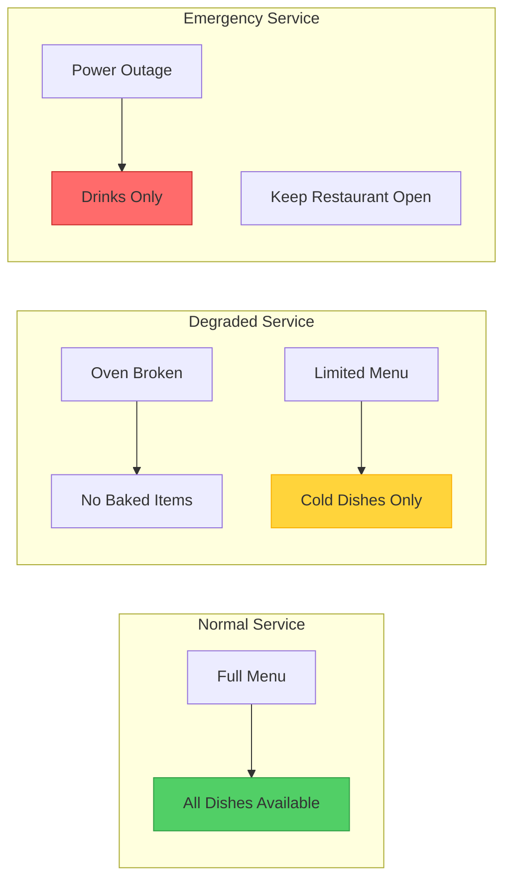
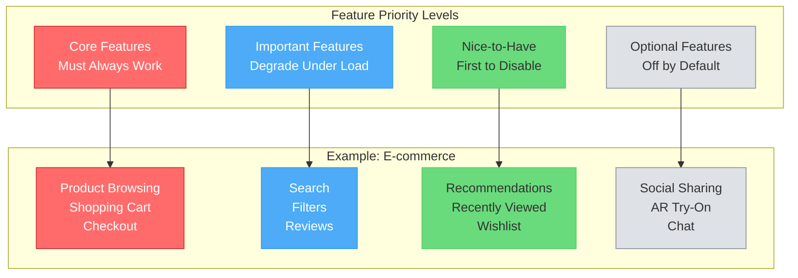
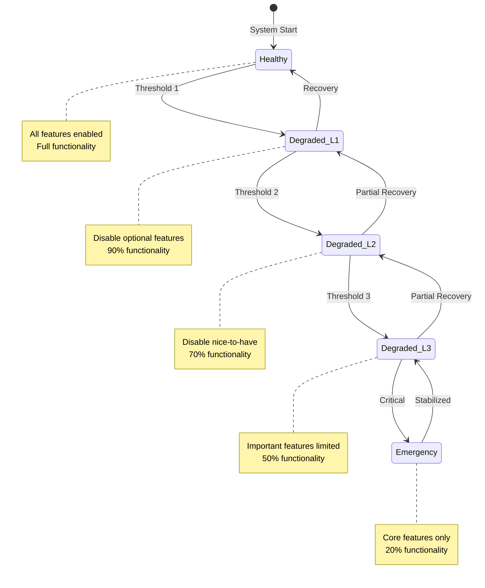
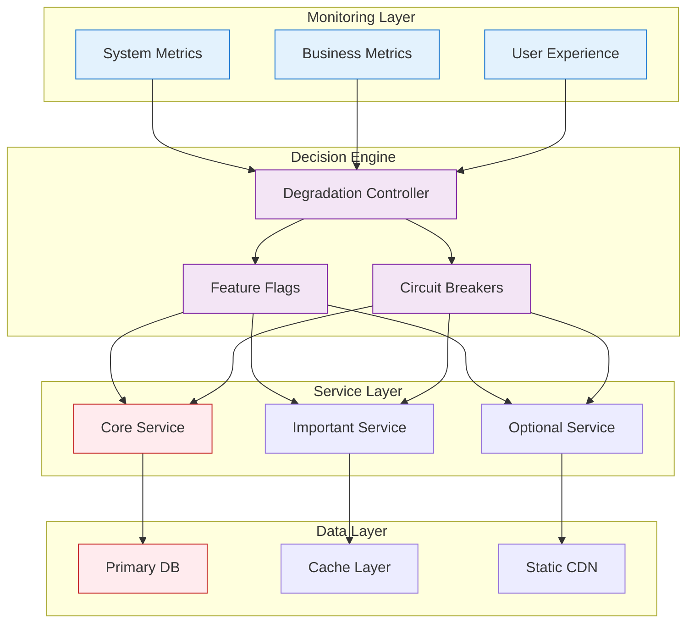
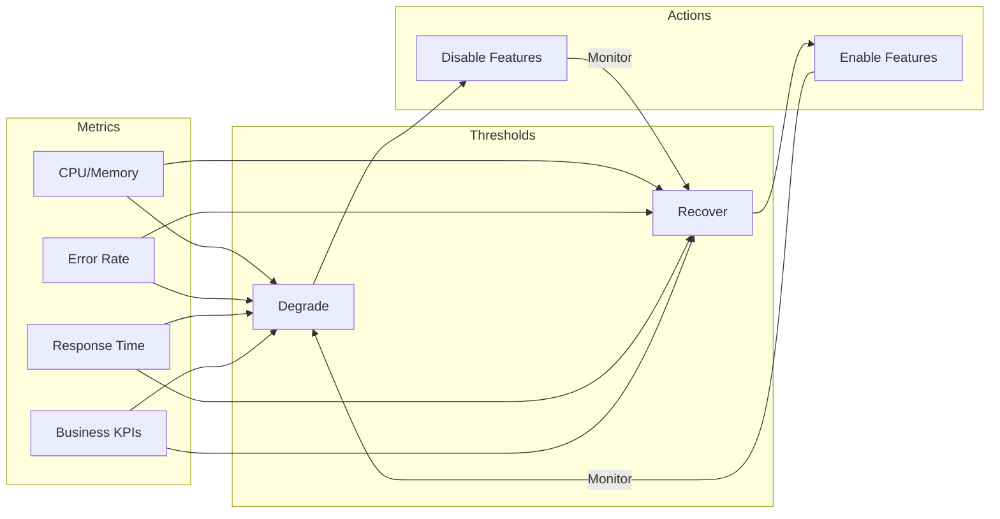
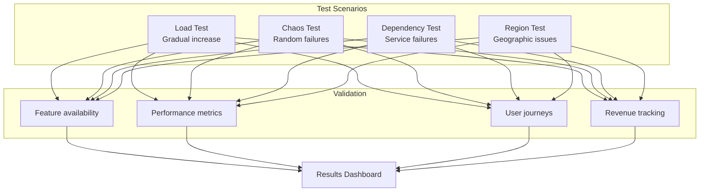
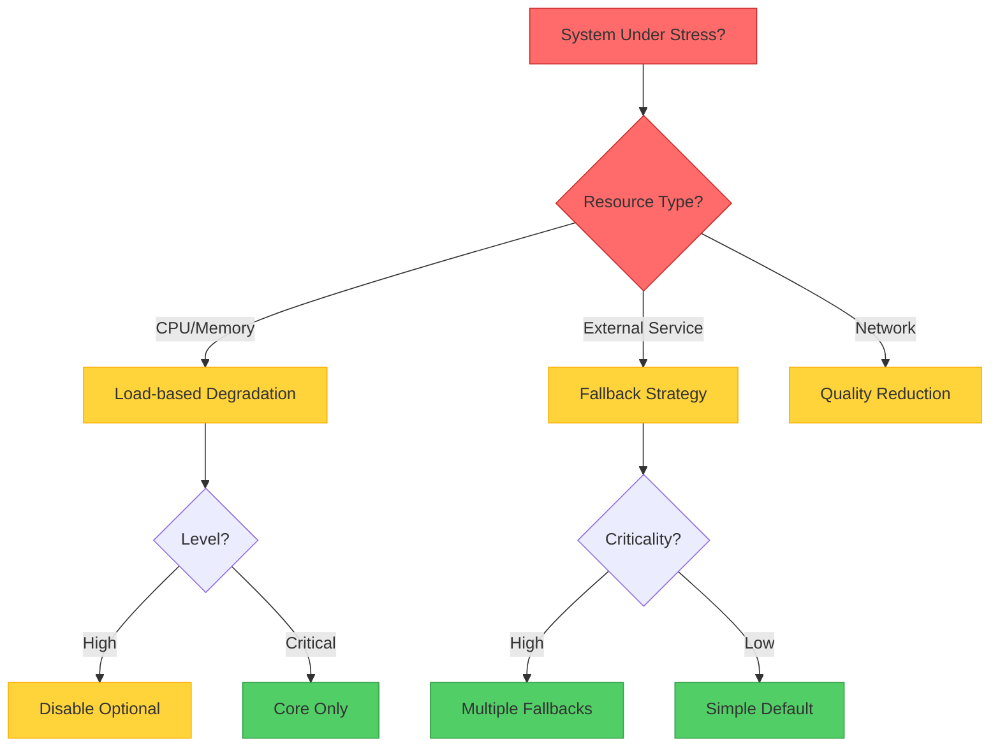

# Graceful Degradation Pattern

!!! info "🥈 Silver Tier Pattern"
    **Better degraded than dead** • Essential for consumer-facing applications
    
    Trades functionality for availability during failures or high load. Requires careful feature prioritization and extensive testing of degradation paths. Netflix, Amazon, and Google rely heavily on this pattern.
    
    **Best For:** E-commerce, streaming services, social media platforms

## Essential Question

**How do we keep core services running when parts of the system fail by reducing functionality?**

## When to Use / When NOT to Use

### ✅ Use When

| Scenario | Example | Impact |
|----------|---------|--------|
| Variable traffic load | Black Friday sales | Maintain checkout during peaks |
| Feature dependencies | Recommendation engines | Show popular items if ML fails |
| Third-party services | Payment gateways | Fallback payment methods |
| Resource constraints | Search systems | Limit results under load |

### ❌ DON'T Use When

| Scenario | Why | Alternative |
|----------|-----|-------------|
| Safety-critical systems | Can't compromise safety | Full redundancy |
| Financial transactions | Must be exact | Fail completely |
| Simple CRUD apps | Overhead unjustified | Basic error handling |
| All features equal priority | Nothing to degrade | Load balancing |

## Level 1: Intuition (5 min) {#intuition}

### The Restaurant Kitchen Analogy



### Core Insight
> **Key Takeaway:** Graceful degradation prioritizes availability over full functionality - serve something rather than nothing.

## Level 2: Foundation (10 min) {#foundation}

### The Problem Space

<div class="failure-vignette">
<h4>🚨 What Happens Without Graceful Degradation</h4>

**Twitter, 2016**: During US election night, recommendation service failure caused complete timeline failure. Users saw error pages instead of just losing personalized features.

**Impact**: 2-hour partial outage, millions unable to access any content, significant reputation damage
</div>

### Degradation Hierarchy



### Degradation Strategies

| Strategy | Trigger | Action | Example |
|----------|---------|--------|---------|
| **Load Shedding** | CPU > 80% | Drop low-priority requests | Disable analytics |
| **Feature Flags** | Service failure | Toggle features off | Disable recommendations |
| **Quality Reduction** | Bandwidth limited | Reduce data quality | Lower image resolution |
| **Caching Fallback** | Database overload | Serve stale data | Yesterday's popular items |

## Level 3: Deep Dive (15 min) {#deep-dive}

### Degradation State Machine



### Implementation Pattern

```yaml
degradation_config:
  levels:
    healthy:
      cpu_threshold: 60
      memory_threshold: 70
      error_rate: 0.01
      features: all
      
    level_1:
      cpu_threshold: 70
      memory_threshold: 80
      error_rate: 0.02
      disable:
        - social_sharing
        - user_analytics
        - a_b_testing
        
    level_2:
      cpu_threshold: 80
      memory_threshold: 85
      error_rate: 0.05
      disable:
        - recommendations
        - search_suggestions
        - real_time_inventory
      fallback:
        - use_cached_recommendations
        - simplified_search
        
    level_3:
      cpu_threshold: 90
      memory_threshold: 90
      error_rate: 0.10
      disable:
        - advanced_search
        - user_reviews
        - price_comparison
      limits:
        - max_results: 10
        - cache_ttl: 3600
        
    emergency:
      cpu_threshold: 95
      memory_threshold: 95
      error_rate: 0.20
      core_only: true
      read_only: true
```

### Common Pitfalls

<div class="decision-box">
<h4>⚠️ Avoid These Mistakes</h4>

1. **Binary degradation**: All or nothing → Implement gradual levels
2. **Silent degradation**: Users unaware → Clear communication/banners
3. **Cascade degradation**: One triggers all → Independent feature flags
4. **No recovery plan**: Stuck in degraded state → Automatic recovery thresholds
</div>

## Level 4: Expert (20 min) {#expert}

### Advanced Degradation Architecture



### Degradation Strategies by Service Type

| Service Type | Primary Strategy | Fallback 1 | Fallback 2 | Ultimate Fallback |
|--------------|------------------|------------|------------|-------------------|
| **Search** | Full-text search | Prefix match | Category browse | Static categories |
| **Recommendations** | ML personalized | Collaborative filter | Popular items | Editor picks |
| **Inventory** | Real-time | 5-min cache | 1-hour cache | "Call for availability" |
| **Pricing** | Dynamic pricing | Cached prices | Base prices | "Login for price" |

### Monitoring & Recovery



## Level 5: Mastery (25 min) {#mastery}

### Real-World Case Studies

<div class="truth-box">
<h4>💡 Netflix's Graceful Degradation</h4>

**Challenge**: Maintain streaming during various failure scenarios

**Implementation**: 
- Fallback from personalized to popular content
- Degrade from 4K → HD → SD based on bandwidth
- Static homepage during recommendation failure
- Regional CDN fallbacks

**Results**: 
- 99.99% streaming availability
- 60% of users unaware of degradation
- 80% reduction in support tickets during incidents
- Saved $10M annually in infrastructure

**Key Learning**: Users prefer degraded service to no service - most don't notice quality reduction during short periods
</div>

### Business Impact Analysis

| Degradation Level | Features Lost | User Impact | Revenue Impact | Acceptable Duration |
|-------------------|---------------|-------------|----------------|-------------------|
| **Level 1** | Analytics, A/B tests | None | 0% | Indefinite |
| **Level 2** | Personalization | Minor | -5% | 24 hours |
| **Level 3** | Search, filters | Moderate | -20% | 4 hours |
| **Emergency** | All but core | Severe | -60% | 1 hour |

### Testing Degradation Paths



## Quick Reference

### Decision Flowchart



### Implementation Checklist

**Pre-Implementation**
- [ ] Categorize features by priority
- [ ] Define degradation triggers
- [ ] Design fallback strategies
- [ ] Plan communication to users

**Implementation**
- [ ] Implement feature flags
- [ ] Add circuit breakers
- [ ] Create fallback data sources
- [ ] Set up monitoring dashboards

**Post-Implementation**
- [ ] Test all degradation paths
- [ ] Measure business impact
- [ ] Document for operations
- [ ] Regular degradation drills

### Related Resources

<div class="grid cards" markdown>

- :material-book-open-variant:{ .lg .middle } **Related Patterns**
    
    ---
    
    - [Circuit Breaker](./circuit-breaker.md) - Automatic failure detection
    - [Feature Flags](../deployment/feature-flags.md) - Dynamic feature control
    - [Load Shedding](./load-shedding.md) - Drop requests under load

- :material-flask:{ .lg .middle } **Fundamental Laws**
    
    ---
    
    - [Law 1: Correlated Failure](../../part1-axioms/law1-failure/) - Isolate feature failures
    - [Law 4: Multi-Dimensional Trade-offs](../../part1-axioms/law4-tradeoffs/) - Balance functionality vs availability
    - [Law 7: Economic Reality](../../part1-axioms/law7-economics/) - Cost of full redundancy

</div>