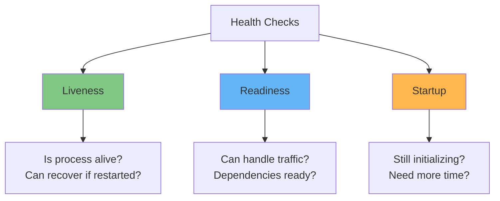
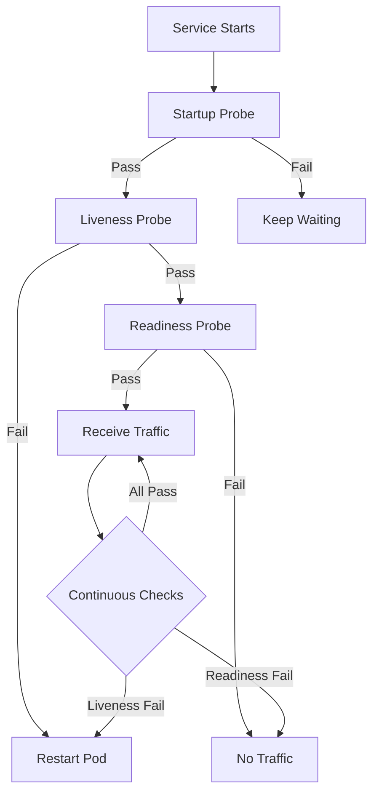
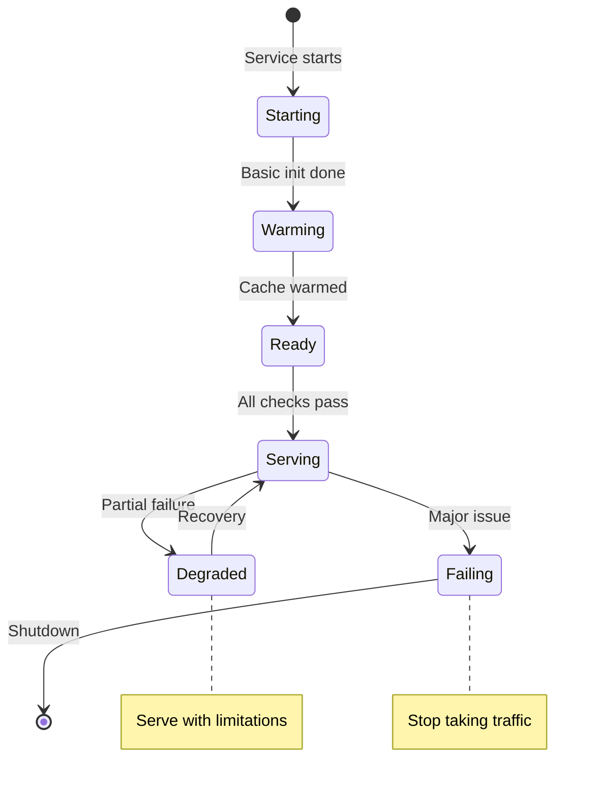

# Health Check Pattern

!!! success "🏆 Gold Standard Pattern"
    **Service Health Monitoring** • Kubernetes, AWS, Netflix proven
    
    Essential for automated recovery and load balancing. Health checks enable systems to detect and route around failures automatically. Foundation of self-healing infrastructure.

## Essential Question
**How do we distinguish between "alive but not ready" and "ready to serve" to enable intelligent traffic management?**

## When to Use / When NOT to Use

### Use When
| Scenario | Example | Check Type |
|----------|---------|------------|
| Container orchestration | Kubernetes pods | Liveness + Readiness |
| Load balancing | AWS ELB | HTTP/TCP checks |
| Service discovery | Consul/Eureka | Service registration |
| Auto-scaling | Based on health | Readiness checks |
| Circuit breakers | Health-based trips | Deep health checks |

### DON'T Use When
| Scenario | Why | Alternative |
|----------|-----|-------------|
| Single instance | No routing needed | Local monitoring |
| Development | Overhead | Simple logging |
| Batch jobs | Not long-running | Job status |
| Static content | Always available | Uptime monitoring |
| Internal tools | Low criticality | Manual checks |

## Level 1: Intuition (5 min)

### The Hospital Triage Analogy
<div class="axiom-box">
Like a hospital emergency room: First check if the patient is alive (pulse/breathing), then check if they can walk/talk/function. Services need the same two-stage health assessment.
</div>

### Health Check Types Comparison


### Critical Distinction
| Check Type | Question | Failure Action | Example |
|------------|----------|----------------|---------|
| **Liveness** | "Are you alive?" | Restart container | Process deadlock |
| **Readiness** | "Can you work?" | Remove from LB | Database down |
| **Startup** | "Still booting?" | Wait longer | Cache warming |

## Level 2: Foundation (10 min)

### Health Check Response Levels

#### 1. Basic (Binary)
```json
// Simple alive check
GET /health
200 OK
```

#### 2. Standard (Status)
```json
GET /health
{
  "status": "UP",
  "timestamp": "2024-01-20T10:30:00Z"
}
```

#### 3. Detailed (Components)
```json
GET /health
{
  "status": "UP",
  "components": {
    "database": "UP",
    "cache": "UP",
    "messageQueue": "DOWN"
  },
  "version": "2.1.0"
}
```

#### 4. Deep (Metrics)
```json
GET /health/deep
{
  "status": "DEGRADED",
  "components": {
    "database": {
      "status": "UP",
      "responseTime": "15ms",
      "connectionPool": "8/10"
    },
    "cache": {
      "status": "UP",
      "hitRate": "92%",
      "memory": "2.1GB/4GB"
    }
  }
}
```

### Configuration Parameters
| Parameter | Liveness | Readiness | Startup |
|-----------|----------|-----------|---------|
| **Initial Delay** | 30-60s | 0-10s | 0s |
| **Check Interval** | 10-30s | 5-10s | 1-5s |
| **Timeout** | 1-3s | 3-5s | 5-10s |
| **Success Threshold** | 1 | 1-3 | 1 |
| **Failure Threshold** | 3-5 | 1-3 | 10-30 |

### Health Check Decision Tree


## Level 3: Deep Dive (15 min)

### Implementation Patterns

#### 1. Kubernetes Health Checks
```yaml
livenessProbe:
  httpGet:
    path: /health/live
    port: 8080
  initialDelaySeconds: 60
  periodSeconds: 10
  timeoutSeconds: 3
  failureThreshold: 3

readinessProbe:
  httpGet:
    path: /health/ready
    port: 8080
  initialDelaySeconds: 5
  periodSeconds: 5
  timeoutSeconds: 3
  failureThreshold: 2

startupProbe:
  httpGet:
    path: /health/startup
    port: 8080
  periodSeconds: 5
  failureThreshold: 30
```

#### 2. Health Check Endpoints
```mermaid
graph LR
    A[/health/live] --> B[Process Check<br/>Memory Check<br/>Deadlock Check]
    C[/health/ready] --> D[Database Connected<br/>Cache Warmed<br/>Config Loaded]
    E[/health/startup] --> F[Migrations Done<br/>Indexes Built<br/>Plugins Loaded]
```

#### 3. Dependency Health Aggregation
| Service Health | DB | Cache | Queue | Result |
|----------------|-----|-------|--------|---------|
| UP | UP | UP | UP | UP |
| UP | UP | DOWN | UP | DEGRADED |
| UP | DOWN | - | - | DOWN |
| UP | UP | UP | DOWN | Depends on criticality |

### Common Patterns & Anti-Patterns

#### Do's ✓
- Separate liveness and readiness endpoints
- Keep health checks lightweight
- Include dependency checks in readiness
- Cache health check results briefly
- Return appropriate HTTP status codes

#### Don'ts ✗
- Heavy computation in health checks
- Checking external dependencies in liveness
- Same endpoint for all check types
- Infinite timeouts
- Ignoring health check costs

## Level 4: Expert (20 min)

### Advanced Health Check Strategies

#### 1. Graduated Health States


#### 2. Circuit Breaker Integration
| Health Status | Circuit State | Action |
|---------------|---------------|---------|
| UP | Closed | Normal operation |
| DEGRADED | Half-Open | Limited traffic |
| DOWN | Open | Reject requests |

#### 3. Smart Health Aggregation
```yaml
health_aggregation:
  critical_services:
    - database: weight=1.0, required=true
    - auth: weight=1.0, required=true
  
  important_services:
    - cache: weight=0.5, required=false
    - search: weight=0.3, required=false
  
  nice_to_have:
    - analytics: weight=0.1, required=false
    - recommendations: weight=0.1, required=false
  
  thresholds:
    healthy: score >= 0.9
    degraded: 0.5 <= score < 0.9
    unhealthy: score < 0.5
```

### Production Monitoring

#### Health Check Metrics
| Metric | Purpose | Alert Threshold |
|--------|---------|----------------|
| Check Latency | Performance impact | > 100ms |
| Check Failure Rate | Stability | > 5% |
| State Changes/min | Flapping detection | > 10 |
| Time to Ready | Startup performance | > 2min |

#### Dashboard Example
```
Service Health Overview
├── Liveness: 99.9% (last 1h)
├── Readiness: 98.5% (last 1h) 
├── Average Check Latency: 45ms
├── State Transitions: 3 (last 1h)
└── Dependencies:
    ├── Database: UP (15ms)
    ├── Cache: UP (3ms)
    └── Queue: DEGRADED (timeout)
```

## Level 5: Mastery (25 min)

### Real-World Implementations

#### Netflix's Eureka Health Model
```java
@HealthIndicator
public class ServiceHealth {
    @Override
    public Health health() {
        if (isDatabaseUp() && isCacheUp()) {
            return Health.up()
                .withDetail("services", getServiceStats())
                .build();
        } else if (isDatabaseUp()) {
            return Health.degraded()
                .withDetail("cache", "unavailable")
                .build();
        } else {
            return Health.down()
                .withDetail("database", "connection failed")
                .build();
        }
    }
}
```

#### AWS ELB Health Checks
- **HTTP/HTTPS**: Check specific path
- **TCP**: Port connectivity only
- **Custom**: Lambda-based checks
- **Deep**: Multi-region health aggregation

#### Kubernetes Advanced Patterns
1. **Exec Probes**: Run scripts for complex checks
2. **TCP Probes**: Simple port checks
3. **gRPC Probes**: Native gRPC health protocol
4. **Probe Priorities**: Startup → Liveness → Readiness

### Migration Guide

#### Phase 1: Basic Health (Week 1)
```python
# Simple liveness check
@app.route('/health/live')
def liveness():
    return {'status': 'UP'}, 200

# Basic readiness  
@app.route('/health/ready')
def readiness():
    if database.ping():
        return {'status': 'UP'}, 200
    return {'status': 'DOWN'}, 503
```

#### Phase 2: Component Health (Week 2)
```python
@app.route('/health/ready')
def readiness():
    components = {
        'database': check_database(),
        'cache': check_cache(),
        'queue': check_queue()
    }
    
    status = 'UP' if all(components.values()) else 'DOWN'
    code = 200 if status == 'UP' else 503
    
    return {
        'status': status,
        'components': components
    }, code
```

#### Phase 3: Advanced Health (Week 3-4)
- Add startup probes
- Implement health caching
- Add dependency weights
- Create health dashboards
- Set up alerts

### Best Practices Matrix

| Aspect | Good | Better | Best |
|--------|------|--------|------|
| **Endpoints** | Single /health | Separate live/ready | + startup + deep |
| **Checks** | Process only | + Critical deps | + Weighted scoring |
| **Response** | Binary | Status + timestamp | + Components + metrics |
| **Monitoring** | Check pass/fail | + Latency | + Business impact |

## Quick Reference

### Health Check Configuration
```yaml
# Production-ready defaults
health_checks:
  liveness:
    path: /health/live
    interval: 10s
    timeout: 3s
    failures: 3
    
  readiness:
    path: /health/ready
    interval: 5s
    timeout: 5s
    failures: 2
    
  startup:
    path: /health/startup
    interval: 2s
    timeout: 10s
    failures: 30
```

### Status Code Standards
| Status | HTTP Code | Load Balancer Action |
|--------|-----------|---------------------|
| UP | 200 | Route traffic |
| DEGRADED | 200 | Route with care |
| DOWN | 503 | Stop routing |
| UNKNOWN | 503 | Stop routing |

### Production Checklist ✓
- [ ] Implement separate liveness/readiness endpoints
- [ ] Add startup probe for slow-starting services
- [ ] Include critical dependencies in readiness
- [ ] Keep liveness checks simple and fast
- [ ] Configure appropriate timeouts and thresholds
- [ ] Monitor health check impact on performance
- [ ] Test failure scenarios thoroughly
- [ ] Document health check behavior
- [ ] Set up alerting for health degradation
- [ ] Review and tune thresholds regularly

## Related Patterns
- **[Circuit Breaker](./circuit-breaker.md)**: Uses health status for state decisions
- **[Service Discovery](../coordination/service-discovery.md)**: Registers healthy instances
- **[Load Balancing](../scaling/load-balancing.md)**: Routes based on health
- **[Graceful Shutdown](./graceful-shutdown.md)**: Coordinates with health checks
- **[Monitoring](../observability/monitoring.md)**: Tracks health metrics

## References
1. Kubernetes (2023). "Configure Liveness, Readiness and Startup Probes"
2. AWS (2023). "ELB Health Checks" - Elastic Load Balancing Guide
3. Netflix (2019). "Eureka Health Checks" - Wiki
4. Google (2022). "Health Checking gRPC Services" - gRPC Documentation
5. Microsoft (2023). "Health checks in ASP.NET Core" - Documentation