# Heartbeat Pattern

!!! warning "ü•à Silver Tier Pattern"
    **Fundamental but requires careful tuning** • Use when you need reliable failure detection
    
    Heartbeats are essential for distributed systems but come with trade-offs. Too aggressive and you'll get false positives during network hiccups. Too conservative and you'll have slow failure detection. Finding the right balance requires expertise and continuous monitoring.

**The pulse of distributed systems - detecting failures through periodic signals**

> *"In distributed systems, silence is not golden - it's a sign of failure."*

---

## Level 1: Intuition

### The Human Heart Analogy

Just like doctors monitor your pulse to detect health issues:

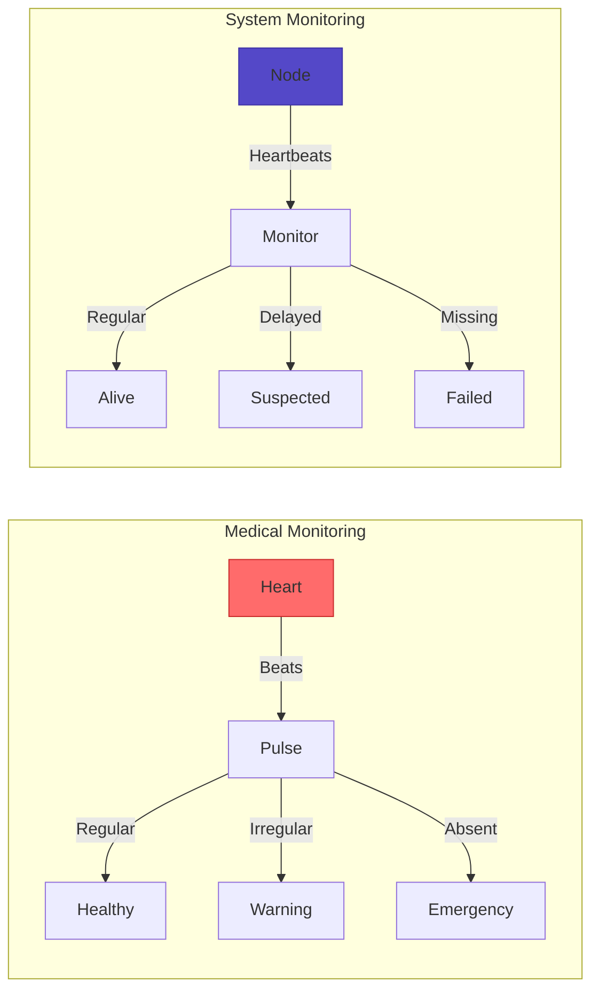
```mermaid
graph LR
    subgraph "Medical Monitoring"
        H[Heart] -->|Beats| P[Pulse]
        P -->|Regular| OK[Healthy]
        P -->|Irregular| W[Warning]
        P -->|Absent| E[Emergency]
    end
    
    subgraph "System Monitoring"
        N[Node] -->|Heartbeats| M[Monitor]
        M -->|Regular| A[Alive]
        M -->|Delayed| S[Suspected]
        M -->|Missing| F[Failed]
    end
    
    style H fill:#ff6b6b,stroke:#c92a2a
    style N fill:#5448C8,stroke:#3f33a6
```

### Core Concept

Heartbeats are periodic signals sent between distributed system components to indicate liveness:

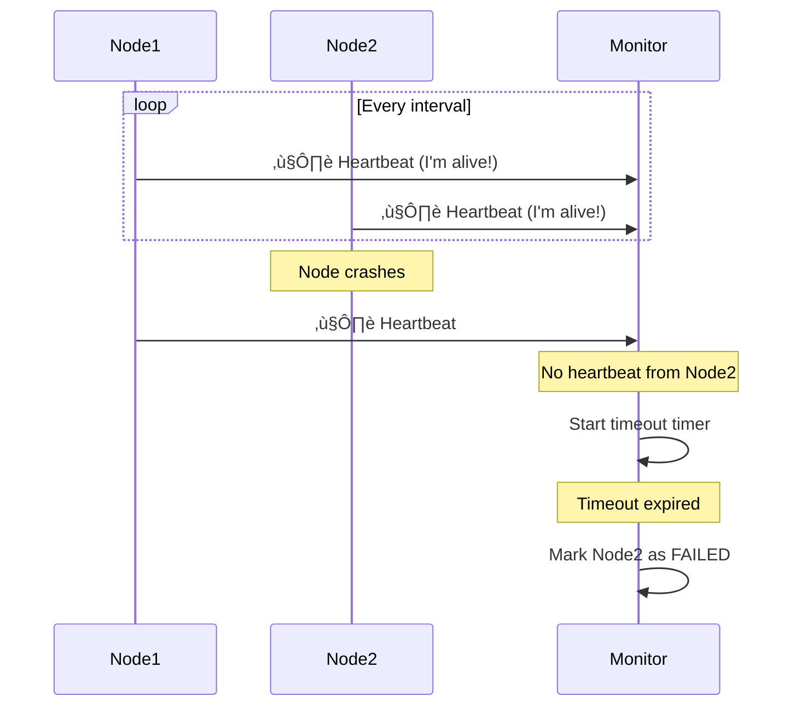
```mermaid
sequenceDiagram
    participant Node1
    participant Node2
    participant Monitor
    
    loop Every interval
        Node1->>Monitor: ❤️ Heartbeat (I'm alive!)
        Node2->>Monitor: ❤️ Heartbeat (I'm alive!)
    end
    
    Note over Node2: Node crashes
    
    Node1->>Monitor: ❤️ Heartbeat
    Note over Monitor: No heartbeat from Node2
    Monitor->>Monitor: Start timeout timer
    
    Note over Monitor: Timeout expired
    Monitor->>Monitor: Mark Node2 as FAILED
```

### Heartbeat Types Comparison

| Type | Direction | Use Case | Example |
|------|-----------|----------|---------|
| **Push** | Node ‚Üí Monitor | Active reporting | Kubernetes kubelet |
| **Pull** | Monitor ‚Üí Node | Health checks | HAProxy |
| **Peer-to-peer** | Node ‚Üî Node | Membership | Cassandra gossip |
| **Hierarchical** | Child ‚Üí Parent | Tree structures | ZooKeeper |

---

## Level 2: Foundation

### Heartbeat Mechanisms

#### Push-Based Heartbeats

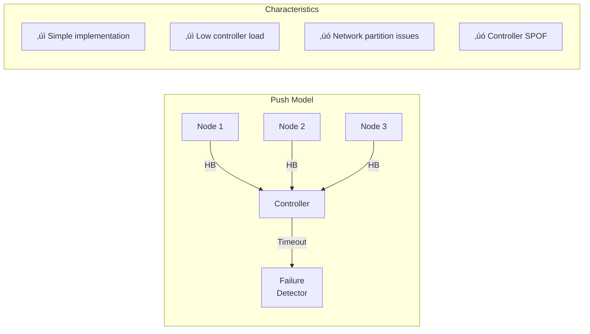
```mermaid
flowchart LR
    subgraph "Push Model"
        N1[Node 1] -->|HB| C[Controller]
        N2[Node 2] -->|HB| C
        N3[Node 3] -->|HB| C
        
        C -->|Timeout| FD[Failure<br/>Detector]
    end
    
    subgraph "Characteristics"
        P1[‚úì Simple implementation]
        P2[‚úì Low controller load]
        P3[‚úó Network partition issues]
        P4[‚úó Controller SPOF]
    end
```

#### Pull-Based Heartbeats

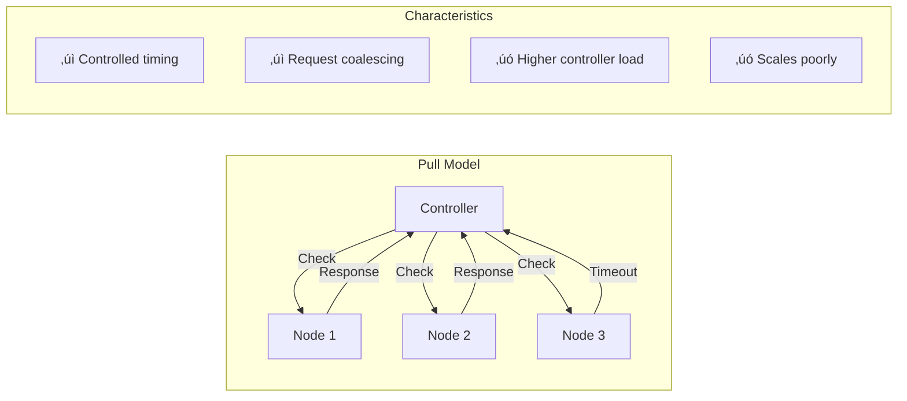
```mermaid
flowchart RL
    subgraph "Pull Model"
        C[Controller] -->|Check| N1[Node 1]
        C -->|Check| N2[Node 2]
        C -->|Check| N3[Node 3]
        
        N1 -->|Response| C
        N2 -->|Response| C
        N3 -->|Timeout| C
    end
    
    subgraph "Characteristics"
        P1[‚úì Controlled timing]
        P2[‚úì Request coalescing]
        P3[‚úó Higher controller load]
        P4[‚úó Scales poorly]
    end
```

### Timeout Calculation

#### Static Timeouts

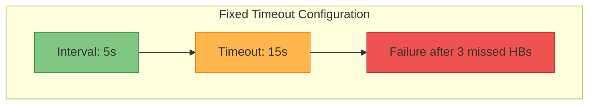
```mermaid
graph TB
    subgraph "Fixed Timeout Configuration"
        I[Interval: 5s] --> T[Timeout: 15s]
        T --> F[Failure after 3 missed HBs]
        
        style I fill:#81c784,stroke:#388e3c
        style T fill:#ffb74d,stroke:#f57c00
        style F fill:#ef5350,stroke:#c62828
    end
```

#### Adaptive Timeouts

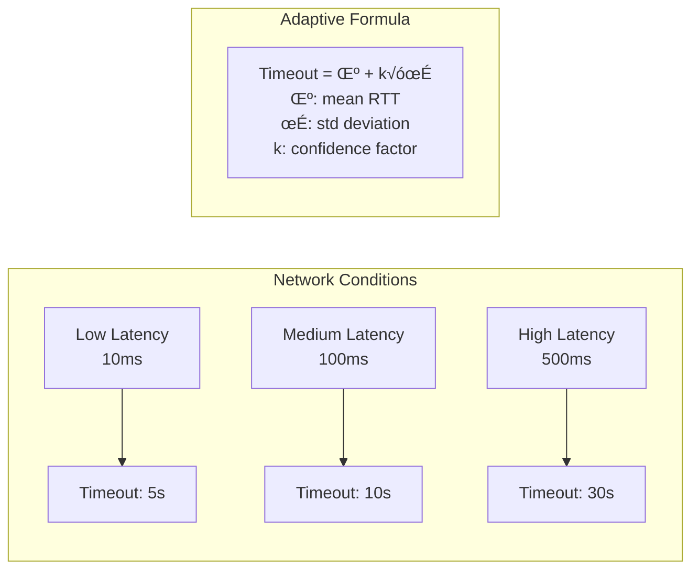
```mermaid
graph LR
    subgraph "Network Conditions"
        L[Low Latency<br/>10ms] --> T1[Timeout: 5s]
        M[Medium Latency<br/>100ms] --> T2[Timeout: 10s]
        H[High Latency<br/>500ms] --> T3[Timeout: 30s]
    end
    
    subgraph "Adaptive Formula"
        F["Timeout = μ + k×σ<br/>μ: mean RTT<br/>σ: std deviation<br/>k: confidence factor"]
    end
```

### Implementation Architecture

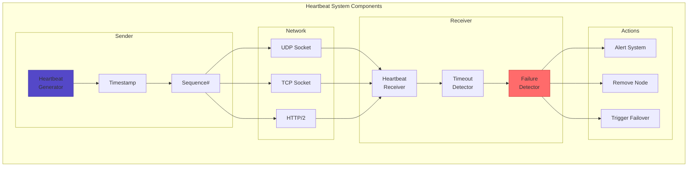
```mermaid
graph TB
    subgraph "Heartbeat System Components"
        subgraph "Sender"
            HG[Heartbeat<br/>Generator]
            TS[Timestamp]
            SEQ[Sequence#]
        end
        
        subgraph "Network"
            UDP[UDP Socket]
            TCP[TCP Socket]
            HTTP[HTTP/2]
        end
        
        subgraph "Receiver"
            HR[Heartbeat<br/>Receiver]
            TD[Timeout<br/>Detector]
            FD[Failure<br/>Detector]
        end
        
        subgraph "Actions"
            ALERT[Alert System]
            REMOVE[Remove Node]
            FAILOVER[Trigger Failover]
        end
    end
    
    HG --> TS --> SEQ --> UDP & TCP & HTTP
    UDP & TCP & HTTP --> HR --> TD --> FD
    FD --> ALERT & REMOVE & FAILOVER
    
    style HG fill:#5448C8,stroke:#3f33a6
    style FD fill:#ff6b6b,stroke:#c92a2a
```

### Heartbeat Message Format

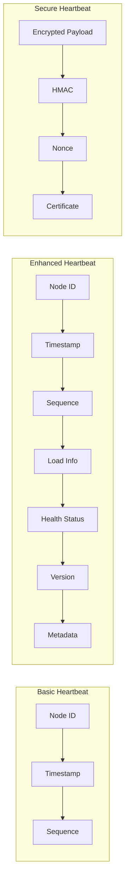
```mermaid
graph LR
    subgraph "Basic Heartbeat"
        B1[Node ID] --> B2[Timestamp] --> B3[Sequence]
    end
    
    subgraph "Enhanced Heartbeat"
        E1[Node ID] --> E2[Timestamp] --> E3[Sequence]
        E3 --> E4[Load Info] --> E5[Health Status]
        E5 --> E6[Version] --> E7[Metadata]
    end
    
    subgraph "Secure Heartbeat"
        S1[Encrypted Payload] --> S2[HMAC]
        S2 --> S3[Nonce] --> S4[Certificate]
    end
```

---

## Level 3: Deep Dive

### Advanced Failure Detection

#### Phi Accrual Failure Detector

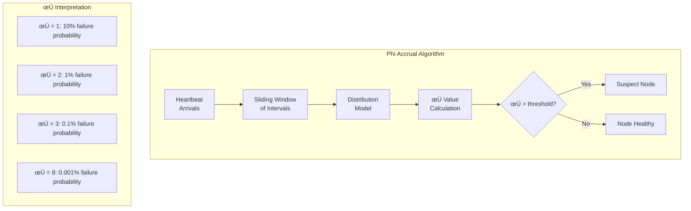
```mermaid
graph TB
    subgraph "Phi Accrual Algorithm"
        HB[Heartbeat<br/>Arrivals] --> SW[Sliding Window<br/>of Intervals]
        SW --> DIST[Distribution<br/>Model]
        DIST --> PHI[φ Value<br/>Calculation]
        
        PHI --> D{φ > threshold?}
        D -->|Yes| SUSPECT[Suspect Node]
        D -->|No| HEALTHY[Node Healthy]
    end
    
    subgraph "φ Interpretation"
        PHI1["φ = 1: 10% failure probability"]
        PHI2["φ = 2: 1% failure probability"]
        PHI3["φ = 3: 0.1% failure probability"]
        PHI8["φ = 8: 0.001% failure probability"]
    end
```

Implementation example:
```python
class PhiAccrualFailureDetector:
    def __init__(self, threshold=8, window_size=1000):
        self.threshold = threshold
        self.intervals = deque(maxlen=window_size)
        self.last_heartbeat = time.time()
    
    def heartbeat(self):
        now = time.time()
        interval = now - self.last_heartbeat
        self.intervals.append(interval)
        self.last_heartbeat = now
    
    def phi(self):
        if len(self.intervals) < 2:
            return 0
        
        now = time.time()
        time_since_last = now - self.last_heartbeat
        
        # Calculate probability using normal distribution
        mean = statistics.mean(self.intervals)
        stddev = statistics.stdev(self.intervals)
        
        # Cumulative distribution function
        probability = 1 - math.exp(-pow(time_since_last - mean, 2) / (2 * pow(stddev, 2)))
        
        # Convert to phi
        return -math.log10(1 - probability) if probability < 1 else float('inf')
    
    def is_alive(self):
        return self.phi() < self.threshold
```

#### SWIM Failure Detector

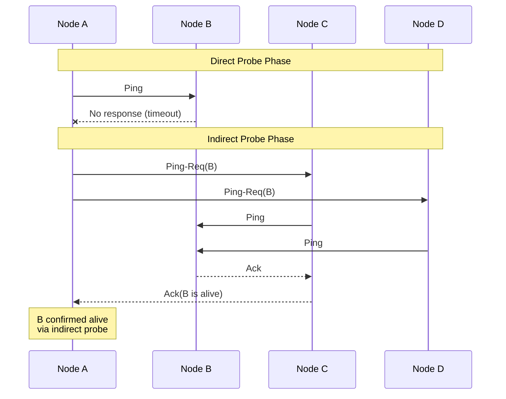
```mermaid
sequenceDiagram
    participant A as Node A
    participant B as Node B
    participant C as Node C
    participant D as Node D
    
    Note over A,D: Direct Probe Phase
    A->>B: Ping
    B--xA: No response (timeout)
    
    Note over A,D: Indirect Probe Phase
    A->>C: Ping-Req(B)
    A->>D: Ping-Req(B)
    C->>B: Ping
    D->>B: Ping
    B-->>C: Ack
    C-->>A: Ack(B is alive)
    
    Note over A: B confirmed alive<br/>via indirect probe
```

### Heartbeat Patterns in Production

#### Hierarchical Heartbeats

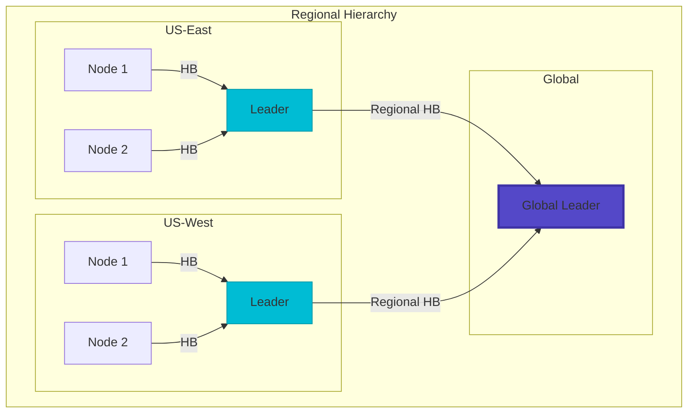
```mermaid
graph TB
    subgraph "Regional Hierarchy"
        subgraph "US-East"
            USE_L[Leader] 
            USE_N1[Node 1] -->|HB| USE_L
            USE_N2[Node 2] -->|HB| USE_L
        end
        
        subgraph "US-West"
            USW_L[Leader]
            USW_N1[Node 1] -->|HB| USW_L
            USW_N2[Node 2] -->|HB| USW_L
        end
        
        subgraph "Global"
            GLOBAL[Global Leader]
            USE_L -->|Regional HB| GLOBAL
            USW_L -->|Regional HB| GLOBAL
        end
    end
    
    style GLOBAL fill:#5448C8,stroke:#3f33a6,stroke-width:3px
    style USE_L fill:#00BCD4,stroke:#0097a7
    style USW_L fill:#00BCD4,stroke:#0097a7
```

#### Gossip-Based Heartbeats

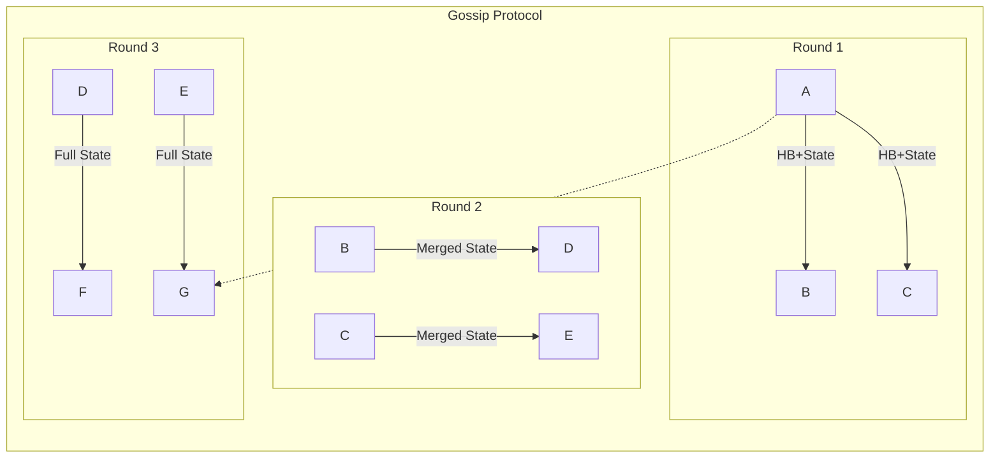
```mermaid
graph LR
    subgraph "Gossip Protocol"
        subgraph "Round 1"
            A1[A] -->|HB+State| B1[B]
            A1 -->|HB+State| C1[C]
        end
        
        subgraph "Round 2"
            B2[B] -->|Merged State| D2[D]
            C2[C] -->|Merged State| E2[E]
        end
        
        subgraph "Round 3"
            D3[D] -->|Full State| F3[F]
            E3[E] -->|Full State| G3[G]
        end
    end
    
    A1 -.->|Info spreads| G3
```

### Network-Aware Heartbeats

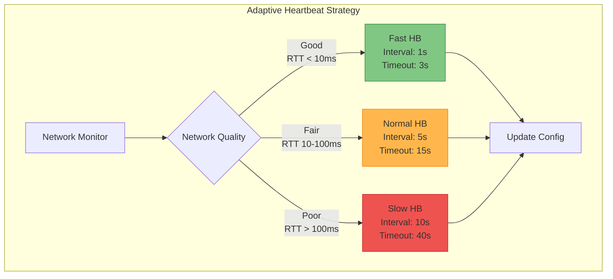
```mermaid
flowchart TB
    subgraph "Adaptive Heartbeat Strategy"
        NET[Network Monitor] --> COND{Network Quality}
        
        COND -->|Good<br/>RTT < 10ms| FAST[Fast HB<br/>Interval: 1s<br/>Timeout: 3s]
        COND -->|Fair<br/>RTT 10-100ms| NORMAL[Normal HB<br/>Interval: 5s<br/>Timeout: 15s]
        COND -->|Poor<br/>RTT > 100ms| SLOW[Slow HB<br/>Interval: 10s<br/>Timeout: 40s]
        
        FAST & NORMAL & SLOW --> CONFIG[Update Config]
    end
    
    style FAST fill:#81c784,stroke:#388e3c
    style NORMAL fill:#ffb74d,stroke:#f57c00
    style SLOW fill:#ef5350,stroke:#c62828
```

---

## Level 4: Expert

### Production Implementations

#### Kubernetes Heartbeat System

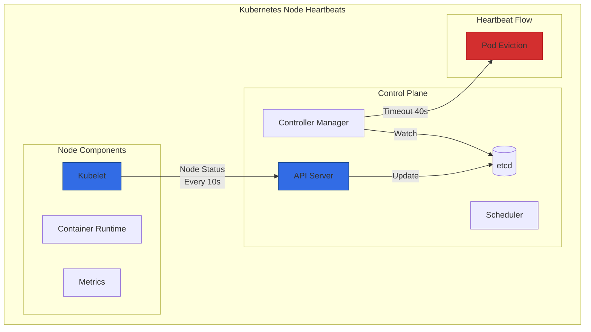
```mermaid
graph TB
    subgraph "Kubernetes Node Heartbeats"
        subgraph "Node Components"
            KUBELET[Kubelet]
            CRT[Container Runtime]
            METRICS[Metrics]
        end
        
        subgraph "Control Plane"
            API[API Server]
            ETCD[(etcd)]
            CM[Controller Manager]
            SCHED[Scheduler]
        end
        
        subgraph "Heartbeat Flow"
            KUBELET -->|Node Status<br/>Every 10s| API
            API -->|Update| ETCD
            CM -->|Watch| ETCD
            CM -->|Timeout 40s| EVICT[Pod Eviction]
        end
    end
    
    style KUBELET fill:#326ce5,stroke:#1e4a8b
    style API fill:#326ce5,stroke:#1e4a8b
    style EVICT fill:#d32f2f,stroke:#b71c1c
```

Kubernetes configuration:
```yaml
# kubelet configuration
nodeStatusUpdateFrequency: 10s
nodeStatusReportFrequency: 5m

# controller-manager configuration
node-monitor-period: 5s
node-monitor-grace-period: 40s
pod-eviction-timeout: 5m
```

#### Apache Cassandra Gossip Protocol

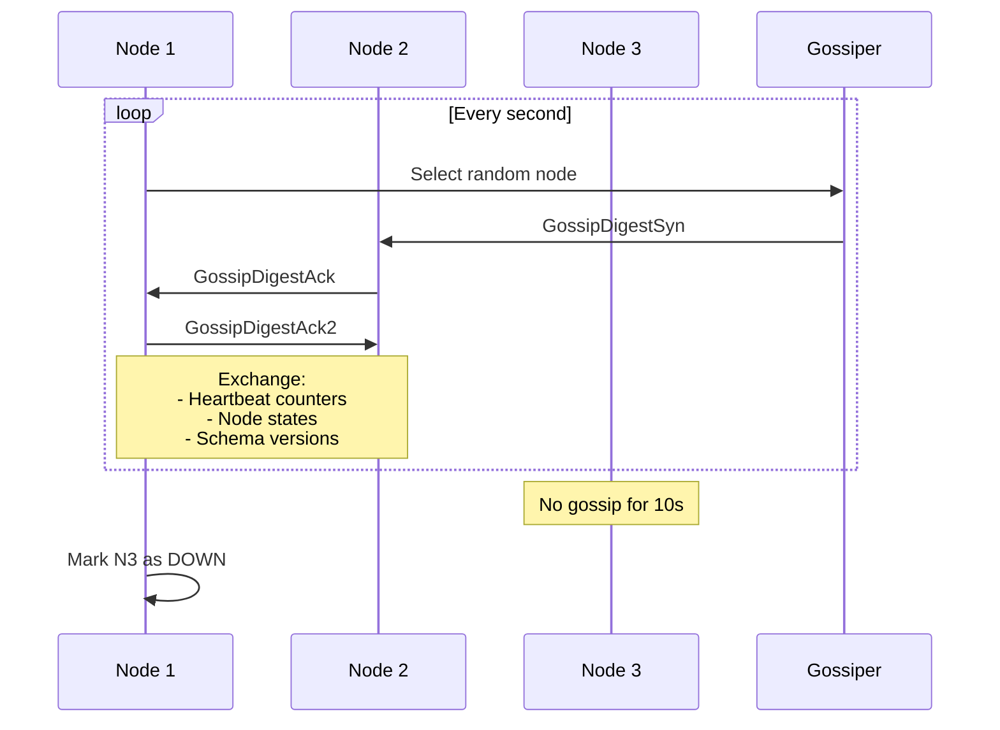
```mermaid
sequenceDiagram
    participant N1 as Node 1
    participant N2 as Node 2
    participant N3 as Node 3
    participant G as Gossiper
    
    loop Every second
        N1->>G: Select random node
        G->>N2: GossipDigestSyn
        N2->>N1: GossipDigestAck
        N1->>N2: GossipDigestAck2
        
        Note over N1,N2: Exchange:<br/>- Heartbeat counters<br/>- Node states<br/>- Schema versions
    end
    
    Note over N3: No gossip for 10s
    N1->>N1: Mark N3 as DOWN
```

#### ZooKeeper Session Heartbeats

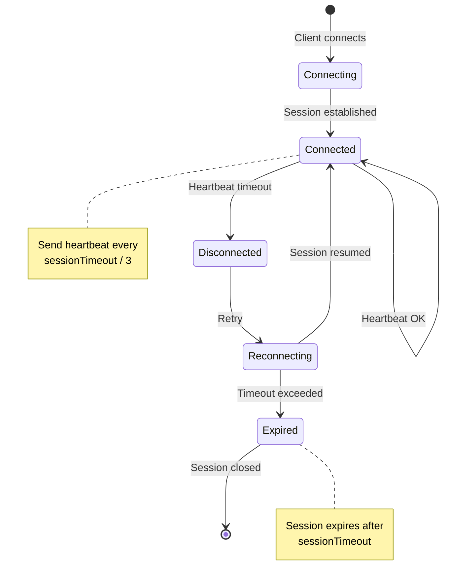
```mermaid
stateDiagram-v2
    [*] --> Connecting: Client connects
    Connecting --> Connected: Session established
    
    Connected --> Connected: Heartbeat OK
    Connected --> Disconnected: Heartbeat timeout
    
    Disconnected --> Reconnecting: Retry
    Reconnecting --> Connected: Session resumed
    Reconnecting --> Expired: Timeout exceeded
    
    Expired --> [*]: Session closed
    
    note right of Connected
        Send heartbeat every
        sessionTimeout / 3
    end note
    
    note right of Expired
        Session expires after
        sessionTimeout
    end note
```

### Advanced Patterns

#### Smart Heartbeat Piggybacking

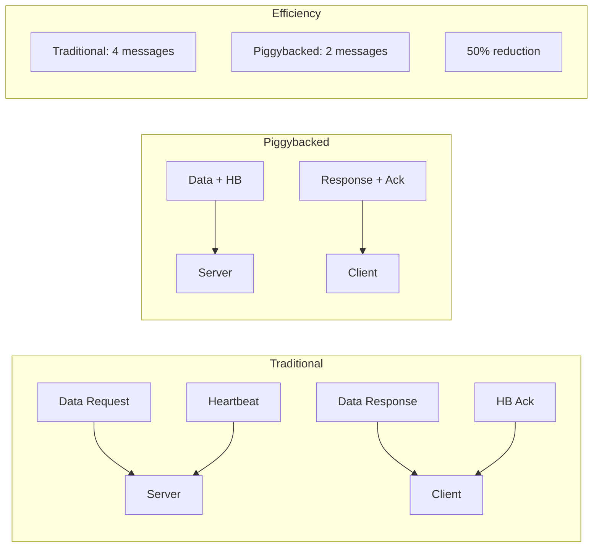
```mermaid
flowchart LR
    subgraph "Traditional"
        T1[Data Request] --> TS[Server]
        T2[Heartbeat] --> TS
        T3[Data Response] --> TC[Client]
        T4[HB Ack] --> TC
    end
    
    subgraph "Piggybacked"
        P1[Data + HB] --> PS[Server]
        P2[Response + Ack] --> PC[Client]
    end
    
    subgraph "Efficiency"
        E1[Traditional: 4 messages]
        E2[Piggybacked: 2 messages]
        E3[50% reduction]
    end
```

#### Heartbeat Storm Prevention

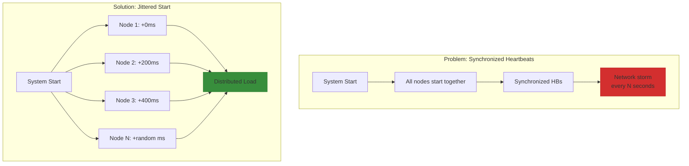
```mermaid
graph TB
    subgraph "Problem: Synchronized Heartbeats"
        START[System Start] --> ALL[All nodes start together]
        ALL --> SYNC[Synchronized HBs]
        SYNC --> STORM[Network storm<br/>every N seconds]
    end
    
    subgraph "Solution: Jittered Start"
        JSTART[System Start] --> J1[Node 1: +0ms]
        JSTART --> J2[Node 2: +200ms]
        JSTART --> J3[Node 3: +400ms]
        JSTART --> JN[Node N: +random ms]
        
        J1 & J2 & J3 & JN --> SPREAD[Distributed Load]
    end
    
    style STORM fill:#d32f2f,stroke:#b71c1c
    style SPREAD fill:#388e3c,stroke:#2e7d32
```

### Failure Scenarios

#### Network Partition Handling

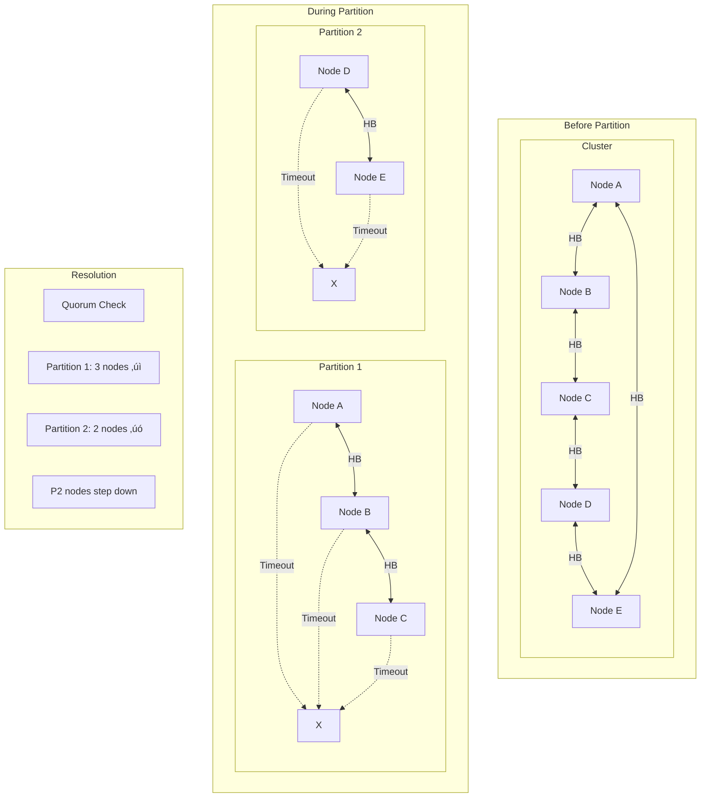
```mermaid
graph TB
    subgraph "Before Partition"
        subgraph "Cluster"
            A1[Node A] <-->|HB| B1[Node B]
            B1 <-->|HB| C1[Node C]
            C1 <-->|HB| D1[Node D]
            D1 <-->|HB| E1[Node E]
            E1 <-->|HB| A1
        end
    end
    
    subgraph "During Partition"
        subgraph "Partition 1"
            A2[Node A] <-->|HB| B2[Node B]
            B2 <-->|HB| C2[Node C]
            A2 & B2 & C2 -.->|Timeout| X1[X]
        end
        
        subgraph "Partition 2"
            D2[Node D] <-->|HB| E2[Node E]
            D2 & E2 -.->|Timeout| X2[X]
        end
    end
    
    subgraph "Resolution"
        Q1[Quorum Check]
        Q2[Partition 1: 3 nodes ‚úì]
        Q3[Partition 2: 2 nodes ‚úó]
        Q4[P2 nodes step down]
    end
```

#### False Positive Mitigation

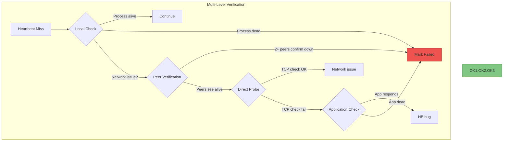
```mermaid
flowchart TB
    subgraph "Multi-Level Verification"
        HB[Heartbeat Miss] --> L1{Local Check}
        L1 -->|Process alive| OK1[Continue]
        L1 -->|Process dead| FAIL[Mark Failed]
        
        L1 -->|Network issue?| L2{Peer Verification}
        L2 -->|2+ peers confirm down| FAIL
        L2 -->|Peers see alive| L3{Direct Probe}
        
        L3 -->|TCP check OK| OK2[Network issue]
        L3 -->|TCP check fail| L4{Application Check}
        
        L4 -->|App responds| OK3[HB bug]
        L4 -->|App dead| FAIL
    end
    
    style OK1,OK2,OK3 fill:#81c784,stroke:#388e3c
    style FAIL fill:#ef5350,stroke:#c62828
```

---

## Level 5: Mastery

### Mathematical Foundations

#### Heartbeat Interval Optimization

```mermaid
graph LR
    subgraph "Trade-off Analysis"
        I[Interval] --> DT[Detection Time]
        I --> BW[Bandwidth]
        I --> CPU[CPU Usage]
        
        DT -->|Inverse| GOOD1[Faster detection]
        BW -->|Direct| BAD1[More traffic]
        CPU -->|Direct| BAD2[Higher load]
    end
    
    subgraph "Optimization Formula"
        F["Interval = ‚àö(2 √ó MTTDtarget √ó BWcost)<br/>where:<br/>MTTDtarget = target detection time<br/>BWcost = cost per message"]
    end
```

#### Failure Probability Models

```mermaid
graph TB
    subgraph "Failure Detection Probability"
        T[Time Since Last HB] --> EXP[Exponential Model]
        T --> NORM[Normal Model]
        T --> WEIB[Weibull Model]
        
        EXP --> P1["P(fail) = 1 - e^(-λt)"]
        NORM --> P2["P(fail) = Φ((t-μ)/σ)"]
        WEIB --> P3["P(fail) = 1 - e^(-(t/λ)^k)"]
    end
    
    subgraph "Model Selection"
        MS1[Exponential: Memory-less failures]
        MS2[Normal: Network delays]
        MS3[Weibull: Aging systems]
    end
```

### Future Directions

#### Machine Learning Enhanced Heartbeats

```mermaid
flowchart TB
    subgraph "ML-Powered Failure Prediction"
        HIST[Historical Data] --> FEAT[Feature Extraction]
        FEAT --> ML[ML Model]
        
        FEAT -->|Extract| F1[HB Interval Variance]
        FEAT -->|Extract| F2[CPU/Memory Trends]
        FEAT -->|Extract| F3[Network Latency]
        FEAT -->|Extract| F4[Time of Day]
        
        ML --> PRED[Failure Prediction]
        PRED --> ADJ[Adjust HB Params]
        
        ADJ -->|Proactive| PREVENT[Prevent Failures]
    end
    
    style ML fill:#9c27b0,stroke:#6a1b9a
    style PREVENT fill:#4caf50,stroke:#2e7d32
```

#### Quantum-Resistant Heartbeats

As quantum computing threatens current cryptography:

```mermaid
graph LR
    subgraph "Current"
        C1[RSA/ECDSA Signed HB]
        C2[AES Encrypted]
    end
    
    subgraph "Quantum-Resistant"
        Q1[Lattice-based Signatures]
        Q2[Hash-based Auth]
        Q3[Code-based Encryption]
    end
    
    C1 -->|Quantum threat| Q1
    C2 -->|Quantum threat| Q2 & Q3
```

---

## Real-World Examples

### Example 1: Elasticsearch Cluster

```mermaid
sequenceDiagram
    participant M as Master
    participant D1 as Data Node 1
    participant D2 as Data Node 2
    
    Note over M,D2: Discovery & Join
    D1->>M: Join cluster
    M->>D1: Assign node ID
    
    Note over M,D2: Fault Detection
    loop Every 1s
        D1->>M: Ping (master fault detection)
        M->>D1: Pong
        D1->>D2: Ping (peer fault detection)
        D2->>D1: Pong
    end
    
    Note over D2: Network issue
    D1->>D2: Ping
    D1->>D2: Ping (retry 1)
    D1->>D2: Ping (retry 2)
    D1->>M: D2 not responding
    M->>M: Start grace period (30s)
    
    Note over M: Grace period expires
    M->>M: Remove D2 from cluster
    M->>D1: Update cluster state
```

### Example 2: Redis Sentinel

```yaml
# Sentinel monitoring configuration
sentinel monitor mymaster 127.0.0.1 6379 2
sentinel down-after-milliseconds mymaster 5000
sentinel failover-timeout mymaster 60000

# Heartbeat flow:
# 1. Sentinel ‚Üí Redis: PING every 1s
# 2. Redis ‚Üí Sentinel: PONG
# 3. After 5s no PONG: Mark as subjectively down
# 4. 2+ Sentinels agree: Mark as objectively down
# 5. Trigger failover to replica
```

### Example 3: Kafka Broker Heartbeats

```mermaid
graph TB
    subgraph "Kafka Heartbeat Hierarchy"
        ZK[ZooKeeper]
        C[Controller Broker]
        B1[Broker 1]
        B2[Broker 2]
        B3[Broker 3]
        
        B1 & B2 & B3 -->|Session HB| ZK
        C -->|Watch| ZK
        
        subgraph "Consumer Groups"
            CG1[Consumer 1]
            CG2[Consumer 2]
            CG1 & CG2 -->|HB| B1
        end
    end
    
    style C fill:#e91e63,stroke:#c2185b
    style ZK fill:#8bc34a,stroke:#689f38
```

---

## Practical Considerations

### Configuration Guidelines

| System Component | Heartbeat Interval | Timeout | Use Case |
|-----------------|-------------------|---------|----------|
| LAN services | 1-5s | 3-5 √ó interval | Low latency needs |
| WAN services | 10-30s | 3-5 √ó interval | Geographic distribution |
| Cloud services | 5-10s | 30-60s | Cloud infrastructure |
| Mobile clients | 30-300s | 5-10 √ó interval | Battery optimization |

### Monitoring Metrics

```mermaid
graph LR
    subgraph "Key Metrics"
        M1[HB Success Rate]
        M2[Detection Latency]
        M3[False Positive Rate]
        M4[Network Overhead]
        M5[Failure Recovery Time]
    end
    
    subgraph "Alerts"
        A1[HB loss > 10%]
        A2[Detection > SLA]
        A3[Storm detected]
    end
    
    M1 & M2 & M3 --> A1
    M4 --> A3
    M5 --> A2
```

### Common Pitfalls

| Pitfall | Impact | Solution |
|---------|--------|----------|
| **Too aggressive timeout** | False positives | Use adaptive timeouts |
| **No jitter** | Heartbeat storms | Add random delays |
| **Single heartbeat path** | Hidden failures | Multiple detection methods |
| **Ignoring time sync** | Incorrect timestamps | Use monotonic clocks |

---

## Integration with Other Patterns

### With Leader Election

```mermaid
graph TB
    HB[Heartbeat] --> LD[Leader Detection]
    LD --> LE[Leader Election]
    LE --> NH[New Leader HB]
    
    HB -->|Timeout| FAIL[Leader Failed]
    FAIL --> LE
```

### With Health Checks

```mermaid
graph LR
    subgraph "Complementary Monitoring"
        HB[Heartbeat<br/>Liveness] --> ALIVE[Process Running]
        HC[Health Check<br/>Readiness] --> READY[Can Serve]
        
        ALIVE & READY --> HEALTHY[Fully Operational]
    end
```

### With Circuit Breakers

```mermaid
stateDiagram-v2
    [*] --> Closed
    Closed --> Open: Heartbeat timeout
    Open --> HalfOpen: Recovery period
    HalfOpen --> Closed: Heartbeat restored
    HalfOpen --> Open: Still failing
```

---

## Quick Reference

### Decision Framework

| Question | Yes ‚Üí | No ‚Üí |
|----------|-------|------|
| Need failure detection? | Use heartbeats | Consider health checks only |
| Distributed system? | Essential pattern | May be overkill |
| Network partitions possible? | Use peer verification | Simple timeout OK |
| Low latency critical? | Aggressive intervals | Conservative settings |
| Limited bandwidth? | Piggyback on data | Dedicated heartbeats OK |

### Implementation Checklist

- [ ] Choose push vs pull model
- [ ] Set appropriate intervals and timeouts
- [ ] Implement timeout detection
- [ ] Add jitter to prevent storms
- [ ] Handle network partitions
- [ ] Include sequence numbers
- [ ] Add security (HMAC/encryption)
- [ ] Monitor false positive rate
- [ ] Implement graceful degradation
- [ ] Test failure scenarios

---

## Key Takeaways

1. **Heartbeats are fundamental** - The primary mechanism for failure detection in distributed systems
2. **One size doesn't fit all** - Adapt intervals and timeouts to your specific network and requirements
3. **False positives hurt** - Better to be slightly slow detecting failures than to incorrectly mark nodes as failed
4. **Network awareness matters** - Adjust parameters based on network conditions
5. **Combine with other patterns** - Heartbeats work best with health checks, circuit breakers, and leader election

---

## Related Patterns

- **[Health Check](failover.md)**: Complement heartbeats with detailed health status
- **[Leader Election](leader-election.md)**: Use heartbeats to detect leader failures
- **[Gossip Protocol](consensus.md)**: Alternative failure detection approach
- **[Circuit Breaker](circuit-breaker.md)**: React to heartbeat failures
- **[Service Discovery](service-discovery.md)**: Register services based on heartbeats

## Related Laws & Pillars

### Fundamental Laws
This pattern directly addresses:

- **[Law 1: Correlated Failure ⛓️](../part1-axioms/law1-failure/index.md)**: Detects node failures to prevent cascade effects
- **[Law 2: Asynchronous Reality ⏱️](../part1-axioms/law2-asynchrony/index.md)**: Handles network delays and timeouts in failure detection
- **[Law 5: Distributed Knowledge üß©](../part1-axioms/law5-epistemology/index.md)**: Manages partial knowledge about node liveness
- **[Law 6: Cognitive Load 🧠](../part1-axioms/law6-human-api/index.md)**: Provides simple alive/dead abstraction for operators

### Foundational Pillars
Heartbeat implements:

- **[Pillar 3: Distribution of Truth üîç](../part2-pillars/truth/index.md)**: Establishes truth about node liveness across the system
- **[Pillar 4: Distribution of Control 🎮](../part2-pillars/control/index.md)**: Enables decentralized failure detection
- **[Pillar 5: Distribution of Intelligence 🤖](../part2-pillars/intelligence/index.md)**: Adaptive timeout and interval adjustments

---

*"A missed heartbeat in a distributed system is like a missed heartbeat in life - it might be nothing, or it might be everything."*

---

**Previous**: [Health Check Pattern](health-check.md) | **Next**: [Leader Election Pattern](leader-election.md)