# Heartbeat Pattern

!!! info "🥈 Silver Tier Pattern"
    **The pulse of distributed systems** • Essential for failure detection
    
    Heartbeats enable reliable failure detection but require careful tuning. Too aggressive leads to false positives; too conservative means slow detection. Used by Kubernetes, Cassandra, and every major distributed system.
    
    **Best For:** Cluster management, service discovery, health monitoring

## Essential Question

**How do we detect when distributed system components have failed by monitoring periodic signals?**

## When to Use / When NOT to Use

### ✅ Use When

| Scenario | Example | Impact |
|----------|---------|--------|
| Cluster membership | Kubernetes nodes | Detect failed nodes |
| Service health | Microservices mesh | Route around failures |
| Leader election | Consensus systems | Trigger new election |
| Connection pooling | Database pools | Remove dead connections |

### ❌ DON'T Use When

| Scenario | Why | Alternative |
|----------|-----|-------------|
| Single-node systems | No distribution | Local process monitoring |
| Request-response only | Built-in timeout | HTTP timeouts |
| Stateless functions | No persistent state | Platform monitoring |
| High-frequency trading | Latency overhead | Inline health checks |

## Level 1: Intuition (5 min) {#intuition}

### The Medical Monitor Analogy

```mermaid
graph LR
    subgraph "Human Heart Monitoring"
        H[❤️ Heart] -->|Beats| M[Monitor]
        M -->|Regular| A[✅ Alive]
        M -->|Missing| D[🚨 Alert]
    end
    
    subgraph "System Heartbeat"
        N[Node] -->|Heartbeat| C[Controller]
        C -->|Regular| OK[✅ Healthy]
        C -->|Missing| F[❌ Failed]
    end
    
    style A fill:#51cf66,stroke:#2f9e44
    style OK fill:#51cf66,stroke:#2f9e44
    style D fill:#ff6b6b,stroke:#c92a2a
    style F fill:#ff6b6b,stroke:#c92a2a
```



### Core Insight
> **Key Takeaway:** In distributed systems, silence equals failure. Regular heartbeats prove liveness.

## Level 2: Foundation (10 min) {#foundation}

### The Problem Space

<div class="failure-vignette">
<h4>🚨 What Happens Without Heartbeats</h4>

**AWS, 2011**: EBS control plane lost heartbeats from storage nodes during network event. Without proper timeout tuning, cascading re-mirroring overwhelmed the network, causing 2-day outage.

**Impact**: Major region outage, hundreds of services affected, led to multi-AZ best practices
</div>

### Heartbeat Architecture Patterns


### Heartbeat Timing Parameters

| Parameter | Formula | Typical Value | Impact |
|-----------|---------|---------------|---------|
| **Interval** | Network RTT × 10 | 1-10 seconds | Traffic vs detection speed |
| **Timeout** | Interval × 3-5 | 3-50 seconds | False positives vs speed |
| **Jitter** | Interval × 0.1-0.2 | ±10-20% | Prevent thundering herd |
| **Grace Period** | Timeout × 1.5 | 5-75 seconds | Network hiccup tolerance |

## Level 3: Deep Dive (15 min) {#deep-dive}

### Failure Detection State Machine


### Advanced Heartbeat Strategies

| Strategy | Description | Use Case | Trade-off |
|----------|-------------|----------|-----------|
| **Adaptive Timeout** | Adjust based on network conditions | WAN clusters | Complex but robust |
| **Phi Accrual** | Statistical failure probability | Cassandra | No fixed threshold |
| **SWIM Protocol** | Indirect probing via peers | Large clusters | Reduced traffic |
| **Hierarchical** | Tree-based aggregation | Massive scale | Single parent failure |

### Implementation Patterns

```yaml
heartbeat_config:
  # Basic configuration
  interval: 5s
  timeout: 20s
  max_missed: 3
  
  # Advanced features
  adaptive:
    enabled: true
    min_interval: 1s
    max_interval: 30s
    network_rtt_factor: 10
    
  jitter:
    enabled: true
    percentage: 15
    
  failure_detection:
    strategy: phi_accrual
    threshold: 8.0
    window_size: 1000
    
  recovery:
    grace_period: 60s
    auto_rejoin: true
    max_rejoin_attempts: 3
```

### Common Pitfalls

<div class="decision-box">
<h4>⚠️ Avoid These Mistakes</h4>

1. **Fixed timeouts across environments**: LAN ≠ WAN → Use adaptive timeouts
2. **No jitter**: Synchronized heartbeats → Add 10-20% random jitter
3. **Too aggressive timeouts**: False positives → 3-5× interval minimum
4. **Ignoring clock drift**: Time sync issues → Use monotonic clocks
</div>

## Level 4: Expert (20 min) {#expert}

### Scalable Heartbeat Architectures


### Phi Accrual Failure Detector

```python
# Simplified Phi Accrual implementation
class PhiAccrualDetector:
    def __init__(self, threshold=8.0, window_size=1000):
        self.threshold = threshold
        self.intervals = deque(maxlen=window_size)
        self.last_heartbeat = time.monotonic()
        
    def heartbeat(self):
        now = time.monotonic()
        interval = now - self.last_heartbeat
        self.intervals.append(interval)
        self.last_heartbeat = now
        
    def phi(self):
        if len(self.intervals) < 2:
            return 0.0
            
        now = time.monotonic()
        time_since_last = now - self.last_heartbeat
        
        # Calculate probability using intervals
        mean = statistics.mean(self.intervals)
        stddev = statistics.stdev(self.intervals)
        
        # Phi = -log10(probability)
        probability = normal_cdf(time_since_last, mean, stddev)
        return -math.log10(1 - probability) if probability < 1 else float('inf')
        
    def is_alive(self):
        return self.phi() < self.threshold
```

### Production Monitoring

| Metric | Healthy | Warning | Critical | Action |
|--------|---------|---------|----------|--------|
| **Heartbeat Success Rate** | > 99% | 95-99% | < 95% | Check network |
| **Detection Latency** | < 10s | 10-30s | > 30s | Tune timeouts |
| **False Positive Rate** | < 0.1% | 0.1-1% | > 1% | Increase timeout |
| **Network Overhead** | < 1% | 1-5% | > 5% | Reduce frequency |

## Level 5: Mastery (25 min) {#mastery}

### Real-World Case Studies

<div class="truth-box">
<h4>💡 Kubernetes Node Heartbeat</h4>

**Challenge**: Monitor 5000+ nodes across regions with varying network conditions

**Implementation**: 
- Kubelet → API server heartbeat every 10s
- Node marked "Unknown" after 40s
- Pod eviction after 5 minutes
- Lease objects for scalability

**Results**: 
- Scales to 5000 nodes per cluster
- Sub-minute failure detection
- 99.9% accuracy in failure detection
- Handles network partitions gracefully

**Key Learning**: Separate liveness (heartbeat) from readiness (serving traffic)
</div>

### Heartbeat at Scale


### Cost Analysis

| Scale | Method | Messages/sec | Bandwidth | CPU Overhead |
|-------|--------|--------------|-----------|--------------|
| 10 nodes | All-to-all | 100 | 10 KB/s | Negligible |
| 100 nodes | Gossip | 300 | 30 KB/s | 1% |
| 1000 nodes | SWIM | 1000 | 100 KB/s | 2% |
| 10000 nodes | Hierarchical | 5000 | 500 KB/s | 5% |

## Quick Reference

### Decision Flowchart


### Implementation Checklist

**Pre-Implementation**
- [ ] Measure network RTT/jitter
- [ ] Define failure detection SLA
- [ ] Choose push vs pull model
- [ ] Plan for network partitions

**Implementation**
- [ ] Use monotonic clocks
- [ ] Add configurable jitter
- [ ] Implement graceful shutdown
- [ ] Add heartbeat metrics

**Post-Implementation**
- [ ] Monitor false positive rate
- [ ] Tune timeouts based on data
- [ ] Test partition scenarios
- [ ] Document timeout rationale

### Related Resources

<div class="grid cards" markdown>

- :material-book-open-variant:{ .lg .middle } **Related Patterns**
    
    ---
    
    - [Health Check](./health-check.md) - Application-level health
    - [Circuit Breaker](./circuit-breaker.md) - Failure handling
    - [Leader Election](../coordination/leader-election.md) - Uses heartbeats

- :material-flask:{ .lg .middle } **Fundamental Laws**
    
    ---
    
    - [Law 1: Correlated Failure](../../part1-axioms/law1-failure/) - Network affects all heartbeats
    - [Law 2: Asynchronous Reality](../../part1-axioms/law2-asynchrony/) - No synchronized clocks
    - [Law 5: Distributed Knowledge](../../part1-axioms/law5-epistemology/) - Partial failure views

</div>