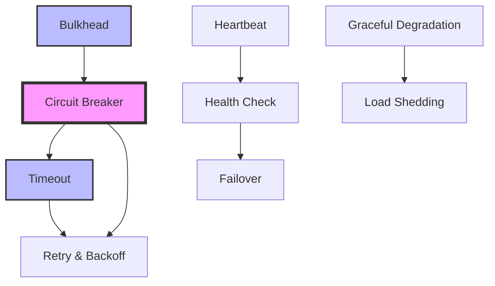

# Resilience Patterns

Patterns for fault tolerance, recovery, and system stability.

## Overview

Resilience patterns help systems survive and recover from failures. They address the reality that in distributed systems, failures are not just possible but inevitable. These patterns provide strategies for:

- **Fault Isolation** - Preventing cascade failures
- **Graceful Degradation** - Maintaining partial functionality
- **Quick Recovery** - Minimizing downtime
- **Failure Detection** - Identifying problems early

## Available Patterns

### Core Resilience Patterns
- **[Circuit Breaker](circuit-breaker.md)** - Prevent cascade failures by detecting service failures
- **[Retry & Backoff](retry-backoff.md)** - Handle transient failures with intelligent retries
- **[Timeout](timeout.md)** - Prevent indefinite waits and resource exhaustion
- **[Bulkhead](bulkhead.md)** - Isolate resources to contain failures

### Health & Monitoring
- **[Health Check](health-check.md)** - Monitor and report service health status
- **[Heartbeat](heartbeat.md)** - Detect service liveness through periodic signals

### Failure Handling
- **[Failover](failover.md)** - Switch to backup systems when primary fails
- **[Graceful Degradation](graceful-degradation.md)** - Maintain partial functionality during failures
- **[Load Shedding](load-shedding.md)** - Drop requests to prevent overload
- **[Split Brain](split-brain.md)** - Handle network partitions in distributed systems

### Advanced Topics
- **[Timeout Advanced](timeout-advanced.md)** - Production-grade timeout strategies

## Quick Decision Guide

| Failure Type | Pattern | When to Use |
|--------------|---------|-------------|
| Service unresponsive | [Circuit Breaker](circuit-breaker.md) | External service calls |
| Temporary network issues | [Retry with Backoff](retry-backoff.md) | Transient failures expected |
| Resource exhaustion | [Bulkhead](bulkhead.md) | Shared resource protection |
| Slow dependency | [Timeout](timeout.md) | Any network operation |
| Complete service failure | [Failover](failover.md) | Critical services |
| Overload conditions | [Load Shedding](load-shedding.md) | High traffic scenarios |
| Service health monitoring | [Health Check](health-check.md) | All services |
| Network partition | [Split Brain](split-brain.md) | Distributed consensus |

## Pattern Relationships

## Key Principles

1. **Fail Fast** - Don't wait for timeouts
2. **Isolate Failures** - Contain the blast radius
3. **Degrade Gracefully** - Partial service > no service
4. **Monitor Everything** - You can't fix what you can't see
5. **Test Failures** - Practice recovery before production

## Implementation Order

For new systems, implement patterns in this order:

1. **[Timeout](timeout.md)** - Foundation for all network calls
2. **[Health Check](health-check.md)** - Know when services are unhealthy
3. **[Circuit Breaker](circuit-breaker.md)** - Prevent cascade failures
4. **[Retry & Backoff](retry-backoff.md)** - Handle transient failures
5. **[Bulkhead](bulkhead.md)** - Isolate critical resources
6. **[Graceful Degradation](graceful-degradation.md)** - Maintain partial service

---

*Return to the [Pattern Library](../) or explore [Communication Patterns](../../pattern-library/communication.md/).*